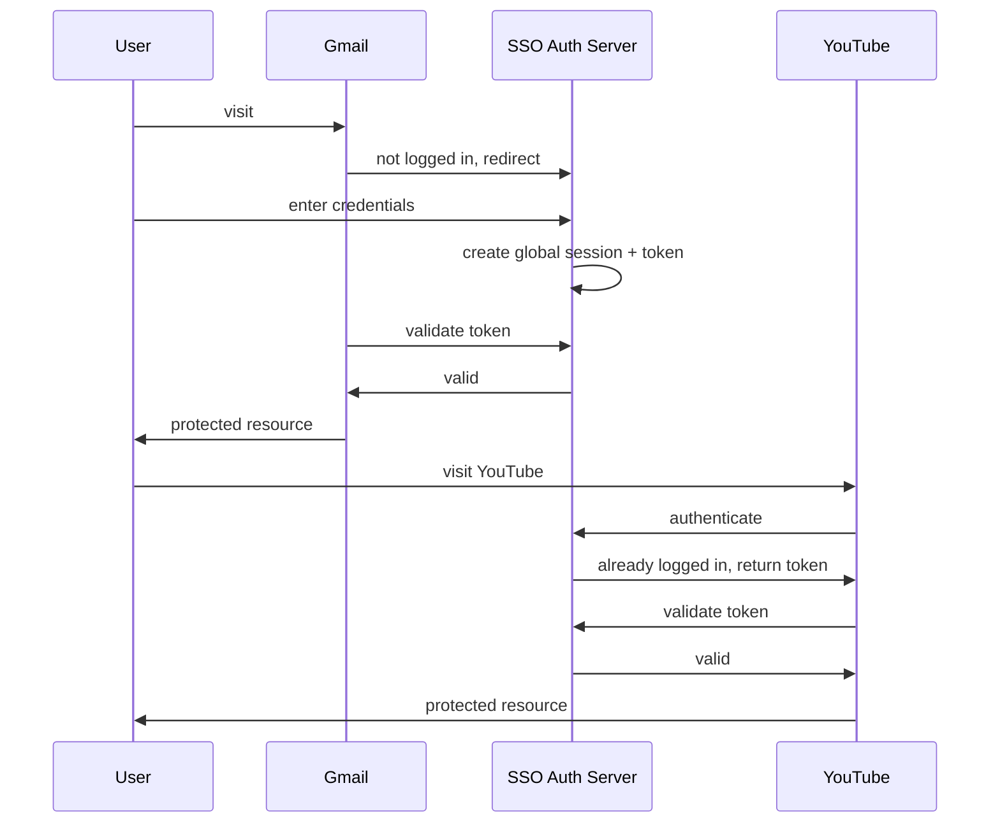
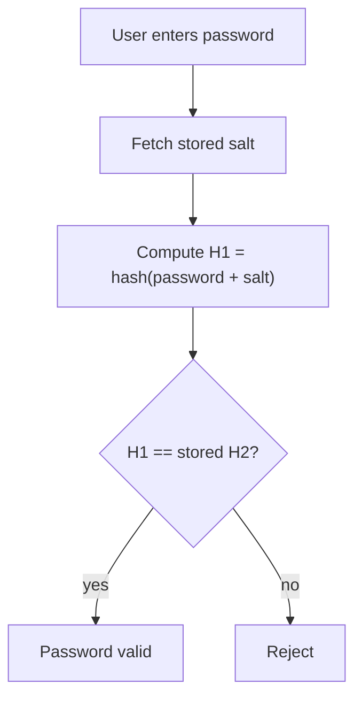
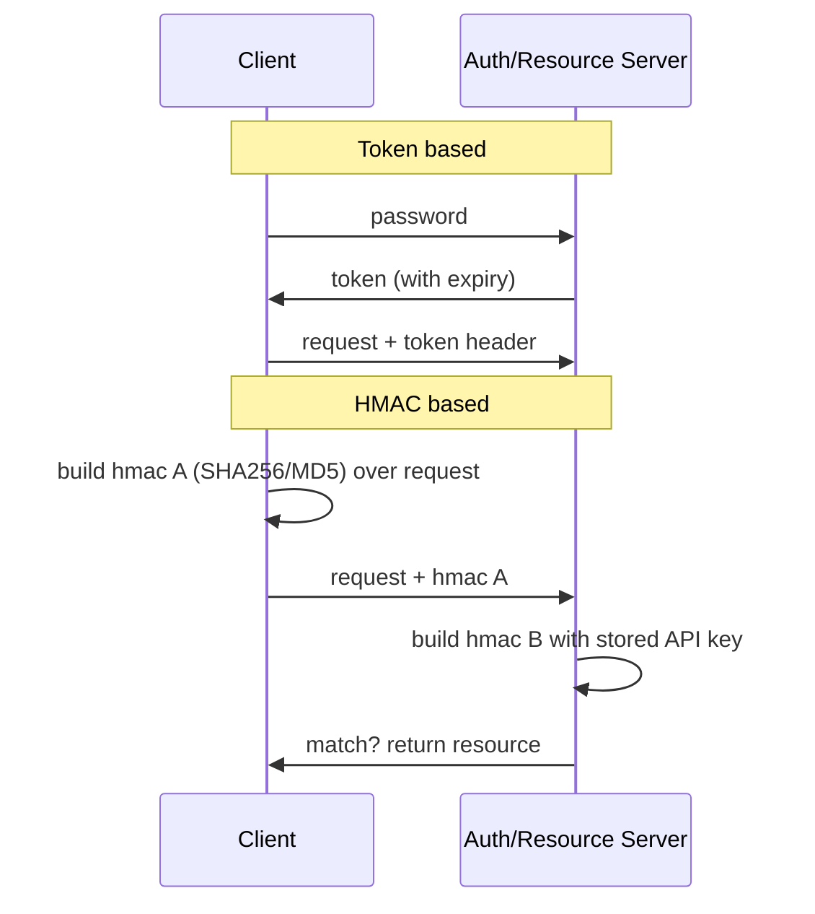

# Security & Auth · ByteByteGo

Simple notes on keeping users and APIs safe: single sign-on, safe password storage, and authenticated API access.

## SSO (Single Sign-On)

SSO is an authentication scheme that lets a user log in to many different systems with a **single ID**, so they don't have to sign in over and over. When you visit an app that isn't logged in, it redirects you to a central **SSO authentication server**; you log in once there, it creates a global session and a **token**, and after that other apps can trust that token instead of asking you to log in again.

Flow: You visit Gmail → not logged in → redirected to the SSO server → you enter credentials. The SSO server validates them, creates a global session, and issues a token. Gmail validates the token with the SSO server, which registers Gmail and returns "valid," and Gmail serves you. Later you go to YouTube → it asks the SSO server → the SSO server sees you're already logged in and returns the token → YouTube validates it and serves you, no second login needed.

## How to Store Passwords Safely in the Database

**Things NOT to do:**
- Storing passwords in **plain text** is bad; anyone with internal access can read them.
- Storing plain password **hashes** is not enough either; they're vulnerable to precomputation attacks like **rainbow tables**.

**The fix: salt the passwords.** Per OWASP, a **salt** is a unique, randomly generated string added to each password before hashing. The salt is **not secret** and can be stored in plain text; its job is to make each hash unique. Store the password as `hash(password + salt)`.

**Validating a password:**
1. The client enters the password.
2. The system fetches that user's salt from the database.
3. It appends the salt to the entered password and hashes it → call this **H1**.
4. It compares H1 with **H2** (the hash stored in the DB). If they match, the password is valid.

## How to Design Secure Web API Access

Every API call must be **authenticated** so the caller is who they claim to be. Two common approaches:

**Token based**: the user sends their password to an Authentication Server, which returns a **token with an expiry time**. The client attaches this token in the HTTP header on later requests, valid until it expires.

**HMAC based**: the server issues a **Public APP ID** (public key) and an **API Key** (private key). The client builds an HMAC **signature** over the request attributes using a hash function (SHA256 or MD5) — call it "hmac A" — and sends it in the header. The server rebuilds the signature with its stored API key ("hmac B") and returns the resource only if hmac A matches hmac B. Including a **request timestamp** in the signature helps ensure data integrity and guards against replayed requests.

