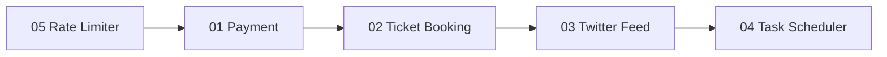
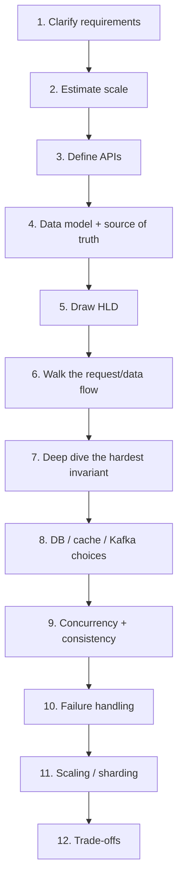
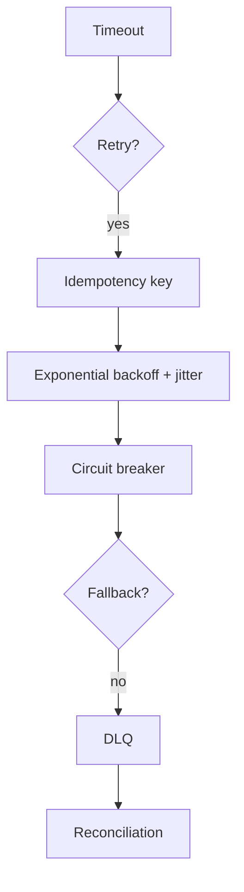
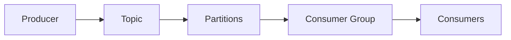
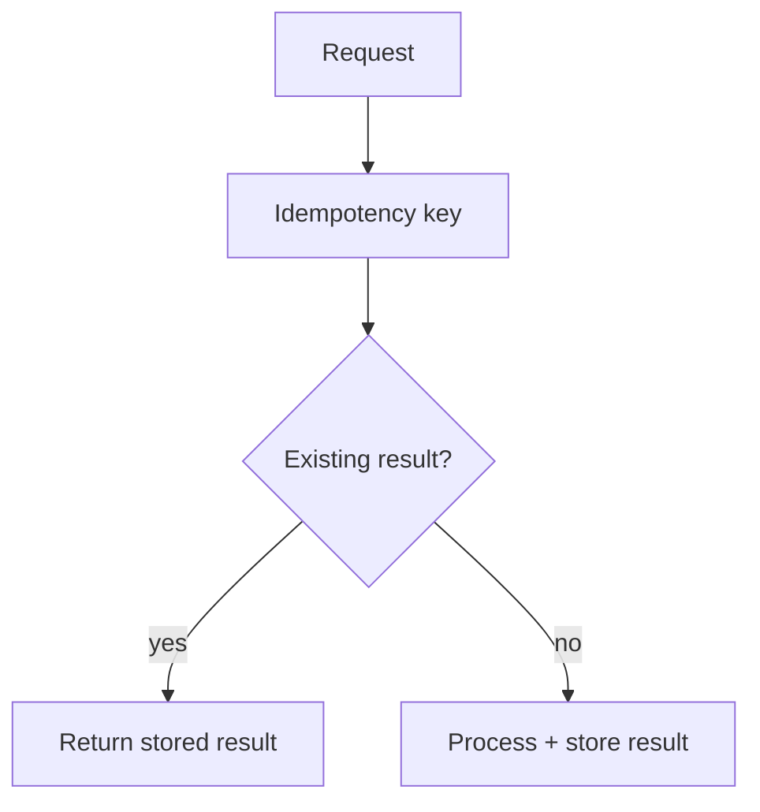

# Design Questions — Complete Interview Chapters

Standalone worked system-design problems. Open any file and read it top to bottom.

Each chapter follows the same house structure:

- Problem explained simply + real-world analogy
- Functional & non-functional requirements
- Capacity estimation (real arithmetic)
- API design
- HLD diagram + deep-dive request flow (real Mermaid)
- Database selection + **why**
- Deep-dive decisions and trade-offs
- Failure handling, concurrency, consistency, idempotency
- Low-level design
- 3-level interview Q&A + staff follow-ups
- 30-second / 2-minute answer
- Mental model + how it connects to other topics

> **Gold-standard reference:** `05-rate-limiter.md` is the depth/format bar every chapter aims for.

---

## How the chapters are grouped

The files are numbered as a curriculum. Read top-to-bottom, or jump by group.

### Group A — Core must-master (01–15)

The designs that expose the largest share of recurring interview concepts. If time is short, these fifteen come first.

| # | Chapter | Core concept it teaches |
|---|---------|-------------------------|
| 01 | Payment System | idempotency, outbox, reconciliation, ledger, strong consistency |
| 02 | Ticket Booking | reservations, oversell prevention, locking, expiry |
| 03 | Twitter / Social Feed | fan-out on write vs read, celebrity hot key, hybrid fan-out |
| 04 | Task Scheduler | distributed scheduling, leases, at-least-once execution |
| 05 | Rate Limiter ⭐ | token/leaky/sliding window, Redis + Lua atomicity, hot keys |
| 06 | Chat System | WebSockets, presence, ordering, delivery guarantees |
| 07 | URL Shortener | ID generation, KV lookup, cache, read scaling |
| 08 | Notification System | multi-channel fan-out, provider failover, retries, DLQ |
| 09 | Search / Autocomplete | trie + top-K, precompute vs query-time, stream updates |
| 10 | News Feed / Recommendation | candidate-gen → ranking → filter pipeline, freshness |
| 11 | Meeting Scheduler | free/busy, conflict detection, timezones, calendar model |
| 12 | Inventory Management | oversell, hot-row contention, saga, reservations |
| 13 | Ride Matching / Uber | geospatial index, high-write location, matching |
| 14 | File Storage / Dropbox | chunking, dedup, delta sync, metadata vs blocks |
| 15 | Analytics / Event Tracking | ingestion, batch vs stream, windowing, dedup counting |

### Group B — Classic infrastructure (16–26)

Foundational building blocks and canonical Alex Xu designs.

| # | Chapter | New technique it teaches |
|---|---------|--------------------------|
| 16 | Consistent Hashing | ring hashing, virtual nodes, minimal reshuffle |
| 17 | Distributed Key-Value Store | quorums, vector clocks, Merkle trees, gossip |
| 18 | Unique ID Generator | Snowflake, clock skew, monotonicity |
| 19 | Web Crawler | frontier, politeness, dedup, freshness |
| 20 | Distributed Message Queue | log storage, offsets, delivery semantics |
| 21 | Metrics Monitoring & Alerting | time-series ingestion, rollups, alerting |
| 22 | Distributed Email Service | mailbox storage, delivery, spam pipeline |
| 23 | Real-time Gaming Leaderboard | sorted sets, ranking at scale |
| 24 | Digital Wallet | double-entry ledger, exactly-once transfer |
| 25 | Stock Exchange | matching engine, order book, low latency |
| 26 | Video Streaming | transcoding pipeline, CDN, adaptive bitrate |

### Group C — Modern techniques (27–30)

Each teaches a specific technology not covered elsewhere.

| # | Chapter | New technique it teaches |
|---|---------|--------------------------|
| 27 | Full-Text Search Engine | inverted index, BM25/TF-IDF, scatter-gather |
| 28 | Collaborative Editing (Google Docs) | Operational Transformation vs CRDTs |
| 29 | Trending / Top-K (probabilistic) | Count-Min Sketch, HyperLogLog, Bloom filter |
| 30 | Distributed Cache | eviction (LRU/LFU/W-TinyLFU), stampede, hot key |

### Group D — Agentic AI & AI-infra (31–42)

For AI/agent roles — "design an AI agent / AI platform that does X." Each applies the `09-agentic-ai/` course. Cross-cutting lens: *agent-or-workflow? → tools → context → loop + bounds → verification → guardrails/least-privilege → reliability → evals → cost.*

| # | Chapter | Best fits |
|---|---------|-----------|
| 31 | PR Review Agent | loop, tools, verification, guardrails |
| 32 | Deep Research Agent | long-horizon loop, agentic RAG, sub-agents |
| 33 | Customer Support Agent | tools + RAG + HITL + safety |
| 34 | Coding Agent (SWE) | agent loop + context engineering + test-based verification |
| 35 | NL Analytics / Text-to-SQL Agent | schema grounding, safety on a data store, self-correction |
| 36 | RAG Q&A over Enterprise Docs | retrieval quality, freshness, access control, citations |
| 37 | LLM Gateway / Inference Platform | rate limit, cache, routing, fallback, cost |
| 38 | Multi-Agent Orchestrator | when to fan out, context isolation, cost multiplier |
| 39 | Voice AI Agent | streaming STT→LLM→TTS, sub-second latency, barge-in |
| 40 | Computer-Use / Browser Agent | screenshot→action loop, GUI grounding, safety on real clicks |
| 41 | Agent Eval & Observability Platform | trace ingestion, LLM-judge, CI regression, drift |
| 42 | Autonomous Engineering Pipeline | PRD→tickets→code→review→QA→merge, stage-gated workflow |

---

## The five to master first

If time is very limited:



These five expose a very large share of recurring interview concepts (idempotency, concurrency, fan-out, consistency, distributed coordination).

---

## Where this fits in the wider guide

- Need the **theory** behind a decision (replication, quorums, isolation, consensus, streams)? → **Track 1** folders `01-foundations`, `02-distributed-data`, `03-derived-data`.
- Want a **quick concept refresher** (networking, DB, caching, security)? → `06-concepts-bytebytego`.
- Want **failure-mode depth** that applies across *all* these designs (retry storms, cascading failure, cache stampede, outbox, split brain, DR)? → `08-edge-cases`.
- The book-chapter companions live in `04-book-vol-1` and `05-book-vol-2`.

See `00-start-here/` for the full learning path across all three tracks.

---

## How to practice each chapter

1. **Read** — understand the architecture.
2. **Close the file** — redraw the HLD from memory.
3. **Explain aloud** — answer the chapter's Q&A as if interrupted.
4. **Deep dive** — Why this DB? Why this cache? What's the hottest key? What must be strongly consistent? What happens at 10×?
5. **Staff-level** — "What's the weakest part of this design?" Then redesign it.

---

## Universal Interview Flow



**Opening line that sounds senior:**

> "I'll first clarify functional and non-functional requirements and estimate scale. Then I'll identify the most important business invariant, because that drives my consistency and database choices. Then APIs, high-level architecture, and a deep dive into the highest-risk part."

**Closing line:**

> "The main trade-off here is X versus Y. I chose X because the business requirement is Z. If scale or consistency requirements change, I'd revisit that decision."

---

## Universal Scale Formula

```text
Average QPS = daily requests / 86,400
Peak QPS    = average QPS × peak factor   (start at 5×, adjust to the traffic pattern)
```

---

## Universal Database Cheat Sheet

| Store | Reach for it when |
|-------|-------------------|
| **PostgreSQL** | ACID, strong consistency, relationships, constraints, conditional updates — booking / payment / inventory |
| **MongoDB** | document-shaped data, flexible schema, access mostly by document, relationships not dominant |
| **Cassandra** | very high write volume, high availability, predictable query patterns, time-series/activity/message data. *Model from queries, not entities.* |
| **Redis** | cache, counters, rate limits, locks/leases, sessions, presence, temporary state. *Not the durable source of truth for critical state.* |
| **Elasticsearch/OpenSearch** | full-text search, ranking, autocomplete, filtering/faceting. *A read model, not your transactional source of truth.* |
| **Kafka** | async events, decoupling, buffering, replay, fan-out, stream processing |

---

## Universal Reliability



For depth on every one of these, see `08-edge-cases`.

---

## Universal Cache Problems

| Problem | Meaning | Main protection |
|---------|---------|-----------------|
| Stampede | many requests rebuild the same expired key | request coalescing / lock / background refresh |
| Hot key | one key gets huge traffic | local cache / CDN / replication / sharding |
| Penetration | requests for keys that don't exist | negative cache / Bloom filter |
| Avalanche | many keys expire together | TTL jitter / staggered expiry / warming |

---

## Universal Kafka



- Ordering → within a partition
- Scale → partitions
- Parallelism → consumers (bounded by partition count)
- Replay → retention
- Duplicates → idempotent consumers

---

## Universal Consistency Rule

Use **strong** consistency when the invariant cannot tolerate stale state: payment, wallet, booking, critical inventory, ledger.

**Eventual** consistency is usually fine for: search index, analytics, recommendations, notifications, like/view counters.

> Consistency should follow the business invariant, not the technology.

---

## Universal Concurrency

> "What happens if two requests execute this operation at exactly the same time?"

Tools: atomic DB update · optimistic locking · pessimistic locking · unique constraint · distributed lock/lease · idempotency key · queue serialization.

---

## Universal Idempotency



---

## Universal Staff-Level Thinking

Always discuss:

1. What happens at 10× traffic? 2. What becomes the bottleneck? 3. What's the hot key/partition? 4. What if a dependency fails? 5. What if the same request arrives twice? 6. Which state must be strongly consistent? 7. What can be eventually consistent? 8. What can be async? 9. Where does backpressure happen? 10. How do we observe and reconcile failures?

> Don't jump into technologies. First clarify requirements and scale, then identify the critical invariant — it drives everything else.
