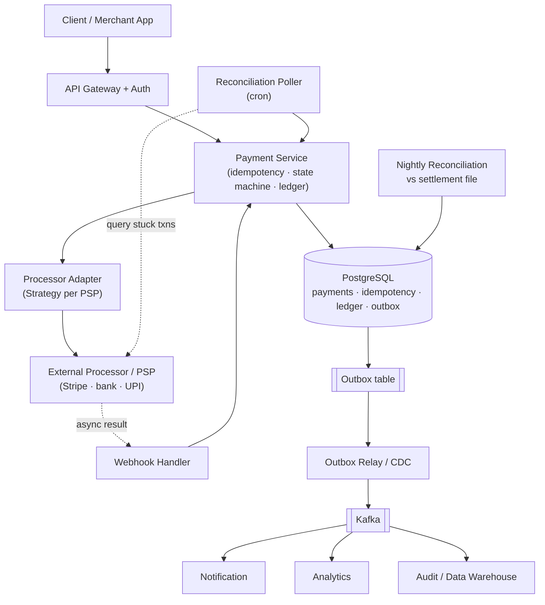
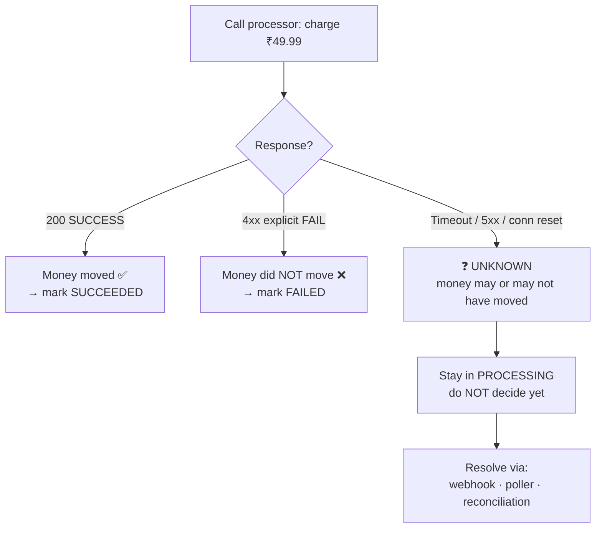
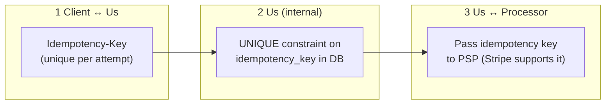
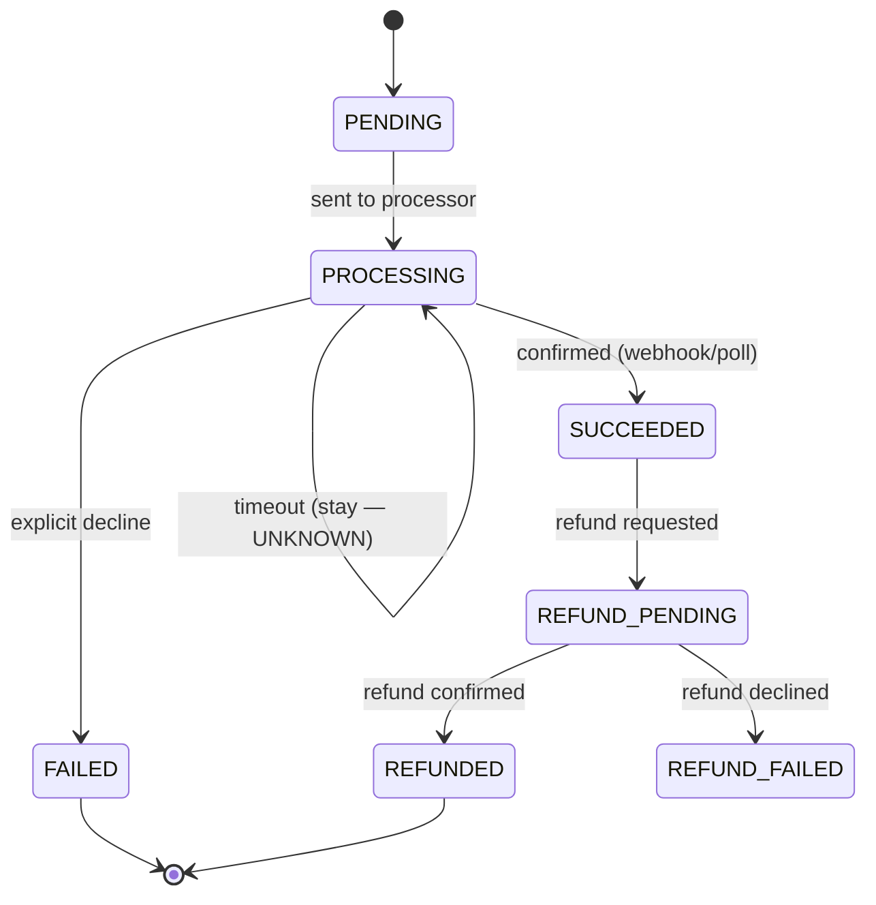
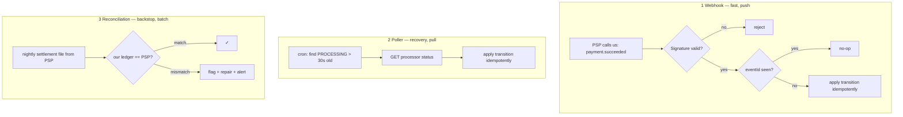
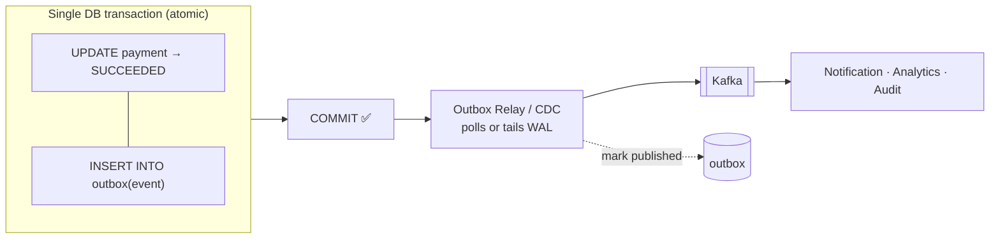
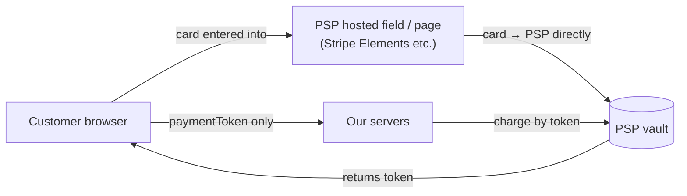

# Payment System — Staff/SSE System Design

**Difficulty:** Advanced
**Interview importance:** ⭐ **Critical** (the canonical "correctness over throughput" system — the anti-scale problem)
**References:** Alex Xu, *System Design Interview* Vol 2, Ch. 11 — *Payment System*; DDIA Ch. 7–9 (transactions, weak isolation, exactly-once); Stripe/PayPal engineering blogs

---

## 0. Why This Design Matters

Most system-design questions are about **scale** — millions of QPS, hot keys, sharding. A payment system is the opposite: throughput is often **tiny** (~10–100 TPS even for a big platform), but a **single lost or duplicated dollar is a catastrophe**. That inversion is exactly why interviewers use it — it tests whether you can reason about **correctness under partial failure** instead of reaching for Redis and calling it a day.

The whole design orbits **one ugly fact**: when you tell a bank "charge this card" and the network times out, **you do not know if the money moved.** You can't retry blindly (double charge), you can't give up (lost payment), and you can't ask the customer. Everything — idempotency, the state machine, webhooks, the reconciliation poller, the outbox, the ledger — exists to resolve that one ambiguity safely.

> The one-line thesis: **a payment system is a machine for turning "I don't know if the money moved" into a provably-correct, auditable answer — exactly once — despite crashes, timeouts, and duplicate messages.**

---

## 1. Problem Overview — Explain It Simply

Build a service that does four things, and never gets money wrong:

> **Accept a payment request → safely instruct a bank/processor to move money → determine the *true* final outcome even when things crash or time out → record it in an auditable ledger, without ever charging the customer twice.**

The hard part is not "call the payment API." It's everything that happens when the call **doesn't cleanly succeed or fail.**

### Real-world analogy — mailing a signed cheque

You mail a cheque (the charge request) to a bank. You get **no immediate confirmation** it was cashed. Three things can happen and you can't tell which:

- The cheque cleared (money moved) ✅
- It got lost in the mail (nothing happened) ❌
- It's *still in transit* (unknown — will resolve later) ⏳

If you assume "lost" and mail a **second** cheque, you might get charged **twice**. So you (1) put a **unique reference number** on every cheque (idempotency), (2) wait for the bank's statement (webhook), (3) if no statement comes, **call the bank to ask** (reconciliation poller), and (4) keep your own **double-entry checkbook** that must always balance (ledger). Every mechanism in this doc maps to one of those four moves.

---

## 2. Functional Requirements

**Core**
- **Create a payment** (pay-in): charge a customer via a card/UPI/wallet through a processor.
- **Get payment status** (poll from the client / support tooling).
- **Refund** a captured payment (full or partial).
- **Receive processor webhooks** (async "here's the final result" callbacks).
- **Poll uncertain transactions** (recover outcomes the webhook didn't deliver).
- **Reconcile** our records against the processor's settlement file (the backstop).
- **Maintain an immutable ledger / audit trail** (double-entry).

**Optional (name them, then defer)**
- **Pay-out** (platform → sellers/merchants — a *separate* flow, often via a different provider like Tipalti).
- Multi-processor routing / failover, split payments, subscriptions/recurring, multi-currency & FX, dispute/chargeback handling, fraud scoring hook.

> **Say this early:** *"There are two directions of money movement — **pay-in** (customer → us) and **pay-out** (us → sellers). They have different risk and idempotency properties, so I'll model them separately and focus on pay-in first."*

---

## 3. Non-Functional Requirements

| Requirement | Target | Why it dominates the design |
|---|---|---|
| **Correctness** | **Exactly-once effect on money** | The whole reason the system exists — never double-charge, never lose a payment |
| Durability | **Zero data loss** for financial records | A committed payment must survive any crash; no fire-and-forget |
| Consistency | **Strong** for payment & ledger state | Money invariants can't tolerate stale reads |
| Auditability | Every state change is **immutable + traceable** | Regulatory + reconciliation requirement |
| Availability | High (99.9%+), but **correctness > availability** | Better to reject a payment than to corrupt one |
| Latency | p99 ~300 ms **excluding** processor time | Processor round-trip dominates; we don't control it |
| Throughput | Low (**~10–100 TPS** typical) | This is *not* a scale problem — say so, it reframes everything |
| PCI scope | **Card data never touches our servers** | Use a PSP hosted page / tokenization to stay out of PCI-DSS scope |

> **Say this out loud:** *"This is a low-throughput, correctness-critical system. That single sentence flips every trade-off toward consistency and durability, away from the usual scale optimizations."*

---

## 4. Capacity Estimation (do the math — but note it's not the point)

```text
Assume a large platform:
  20M DAU × 2 payment attempts/day = 40M attempts/day
  Average QPS = 40,000,000 / 86,400 ≈ 460 TPS
  Peak (5×)   ≈ 2,300 TPS
```

Even at 5× peak this is **~2K TPS** — a *single well-tuned Postgres primary* handles this comfortably. Contrast with the rate limiter's 10M QPS. **The bottleneck here is not compute; it's correctness under failure.**

**Storage (this actually matters — records are kept forever):**
```text
1 payment record ≈ 1 KB (ids, amount, currency, status, timestamps, processor refs)
+ ledger entries ≈ 2 × 200 B (double-entry)
40M attempts/day × ~1.5 KB ≈ 60 GB/day → ~22 TB/year

→ Payments are retained for years (audit/regulatory).
  Hot data in Postgres; cold data archived to columnar store (e.g. S3/Parquet or a warehouse).
```

**What the numbers tell us:**
- **Do not shard for throughput** — you don't need to. Shard (if ever) by `merchant_id` for isolation, not speed.
- The design budget goes into **failure handling and idempotency**, not QPS.
- **Retention/archival** is a real concern; financial records live for years.

---

## 5. API Design

**Create a payment** (the hot path) — note the **mandatory `Idempotency-Key` header**:
```http
POST /v1/payments
Idempotency-Key: idem_7f3a9c...     ← client-generated, unique per logical attempt
```
```json
{
  "orderId": "O-123",
  "amount": 4999,               // integer minor units (₹49.99) — NEVER floats for money
  "currency": "INR",
  "method": "CARD",
  "paymentToken": "tok_abc"     // token from PSP hosted field — no raw PAN
}
```
```json
{
  "paymentId": "pay_01H...",
  "status": "PROCESSING",       // async: final result arrives via webhook/poll
  "amount": 4999,
  "currency": "INR",
  "createdAt": "2026-09-03T10:00:00Z"
}
```

**Get status** (client polls, or support tooling reads):
```http
GET /v1/payments/{paymentId}
```

**Refund** — also idempotent:
```http
POST /v1/payments/{paymentId}/refunds
Idempotency-Key: idem_refund_...
```
```json
{ "amount": 4999, "reason": "customer_request" }
```

**Processor webhook** (inbound from PSP — we verify signature, then process idempotently):
```http
POST /v1/webhooks/processor
X-Signature: sha256=...          ← verify HMAC to prove it's really the PSP
```
```json
{ "eventId": "evt_99", "type": "payment.succeeded", "processorTxnId": "ch_abc", "paymentId": "pay_01H..." }
```

> **Two interview-grade details in this API:** (1) money is an **integer in minor units**, never a float — floats lose cents. (2) The **`Idempotency-Key` is client-generated and required**; it's the anchor of double-charge prevention.

---

## 6. High-Level Architecture



**Two planes, kept separate:**
- **Synchronous path (thin):** Client → Payment Service → **one Postgres transaction** (idempotency check + create `PROCESSING` record + outbox row) → call processor. Return fast; the *final* result is usually async.
- **Asynchronous resolution (the heart):** Webhook **and** poller **and** nightly reconciliation all converge on the same **idempotent state-transition** logic in the Payment Service. Three independent paths to the truth, because any one of them can fail.

### Why this shape?
The processor is a **third party we don't control** and its response is **often ambiguous or delayed**. So we (a) never trust a single signal, (b) make every write idempotent, and (c) keep a durable ledger that reconciliation can prove against.

---

## 7. The Core Problem: The Ambiguous Outcome

This is the single most important section. **Master this and you pass the interview.**

You call the processor. Three things can come back — but really it's **two knowns and one deadly unknown**:



**The trap that fails candidates:** treating a **timeout as a failure.** If you mark it `FAILED` and let the client retry, but the charge *actually went through*, you've now **double-charged** the customer.

**The rule:** a timeout means **UNKNOWN**, not failure. You **keep the payment in `PROCESSING`** and let an idempotent asynchronous mechanism discover the true outcome. You never guess.

> **Say this exact sentence:** *"A timeout is not a failure — it's an unknown. The processor might have charged the card. So I keep the payment in PROCESSING and resolve the true outcome idempotently via webhook, poller, or reconciliation — never by guessing."*

---

## 8. Idempotency — How We Prevent Double Charges

Double-charge prevention is **end-to-end** — it takes three layers, not one:



**How the idempotency check works (in one DB transaction):**
```text
BEGIN
  INSERT INTO idempotency_keys(key, request_hash, status='IN_PROGRESS')   -- UNIQUE(key)
      -- if this throws a unique-violation → a duplicate is in flight/done
  ... create payment, insert outbox row ...
COMMIT
```
- **First request:** the `INSERT` succeeds → we process normally and store the response against the key.
- **Retry (same key):** the `INSERT` hits the **unique constraint** → we **return the stored original result** instead of charging again. The second call is a **no-op** with the same answer.
- **Concurrent duplicate:** the unique constraint (or a row lock) serializes them — one wins, the other reads the winner's result.

**Layer 3 matters too:** even *our* retry to the processor must carry the **same processor-level idempotency key**, so the PSP itself de-dupes if our first call actually reached it. Idempotency at only one layer leaves a gap.

> **This is a top-3 thing to mention.** "Double-charge prevention is end-to-end: a client idempotency key, a unique constraint in our DB, and an idempotency key passed to the processor — so a retry is a no-op at every hop."

---

## 9. The Payment State Machine

A payment is not a boolean — it's a **lifecycle**. Modeling it as an explicit state machine is what makes transitions **auditable and safe** (you only allow legal transitions).



**Rules that make it safe:**
- **Terminal states are terminal:** once `SUCCEEDED` or `FAILED`, a late/duplicate signal can't flip it (transitions are validated).
- **`PROCESSING` is the "unknown" holding pen** — the state where timeouts live until resolved.
- **Every transition is a row-locked, validated update** (`... WHERE status = 'PROCESSING'`) so two concurrent signals can't both apply. If the guard doesn't match, it's a no-op — natural idempotency.
- Refunds get their **own sub-lifecycle** because a refund can fail independently of the original charge.

> **Interview line:** *"An explicit state machine means I only ever apply legal transitions with a guarded, conditional UPDATE — so a duplicate webhook and a slow poll landing at the same time can't corrupt the payment; the second one is a no-op."*

---

## 10. Webhooks + Reconciliation Poller — Belt and Suspenders

We have three independent ways to learn the true outcome, in order of speed and trust:



**Why all three? Because each fails differently:**

| Mechanism | Speed | Failure mode it covers | Why it's not enough alone |
|---|---|---|---|
| **Webhook** | Seconds | Normal case | Can be **delayed, duplicated, or lost**; endpoint can be down |
| **Poller** | ~30s–minutes | Webhook never arrived / we were down | Wasteful to poll everything; PSP rate-limits |
| **Reconciliation** | Nightly | Everything else — silent drift, bugs | Slow; not real-time |

- **Webhooks must be verified** (HMAC signature) — otherwise anyone can POST "you got paid."
- **Webhooks must be de-duplicated** on `eventId` (or `processorTxnId`) with a **unique constraint** — PSPs deliver **at-least-once**, so duplicates are guaranteed, not hypothetical.
- The **poller only targets stuck `PROCESSING` rows** older than a threshold — bounded work.
- **Reconciliation compares our double-entry ledger against the PSP settlement file** and repairs/alerts on any mismatch. This is the **final safety net** that catches bugs the other two miss.

> **Say this:** *"Webhooks are fast but unreliable, so I don't depend on them alone. A poller sweeps stuck PROCESSING rows to recover missed outcomes, and nightly reconciliation against the PSP's settlement file is the backstop that catches anything else. All three funnel into the same idempotent transition."*

---

## 11. Transactional Outbox — Reliable Events Without Losing Money

**The failure that forces this to exist (dual-write problem):** After a payment succeeds you want to (1) update the DB and (2) publish a Kafka event (for notifications/analytics). These are **two systems**. If the DB commits and Kafka publish fails — or vice versa — your states **diverge**: money recorded but no receipt sent, or a receipt for a payment that rolled back. You **cannot make two independent systems atomic.**

**The fix:** write the event into an **`outbox` table in the *same* DB transaction** as the payment update. One transaction, one atomic commit. A separate relay reads the outbox and publishes to Kafka afterward.



**Why it's correct:**
- The event is **as durable as the payment** — same commit. If the transaction rolls back, no event. If it commits, the event *will* eventually publish.
- The relay publishes **at-least-once** (it may retry after a crash) → so **consumers must be idempotent** (keyed on the event/payment id). That's fine and expected.
- Implementations: a **polling relay** (`SELECT ... WHERE published=false`) or **CDC** (tail the Postgres WAL via Debezium) — CDC is lower-latency, polling is simpler.

> **Interview line:** *"I never dual-write to DB and Kafka. I write the event to an outbox table in the same transaction as the payment, then a relay publishes it at-least-once. That turns two non-atomic writes into one atomic commit; consumers stay idempotent to absorb the retries."*

---

## 12. The Ledger — Double-Entry Bookkeeping

**Payment status ≠ accounting.** The state machine is a *workflow*; the **ledger** is the **immutable financial record** that must always balance. Interviewers probe whether you know the difference.

**Double-entry rule:** every money movement writes **two entries that sum to zero** — a debit and a credit. The invariant "**all entries always sum to zero**" is what makes the books provably correct and reconciliation possible.

```text
Customer pays ₹49.99 for order O-123:

  entry 1:  DEBIT  customer_receivable   +4999
  entry 2:  CREDIT platform_cash         -4999
                                          -----
                            sum must  =      0   ← the invariant
```

- Ledger entries are **immutable and append-only** — you never `UPDATE` money. A correction is a **new balancing entry** (a reversal), never an edit. This gives a perfect audit trail.
- **Balances are derived** by summing entries (optionally with periodic snapshots for speed), not stored as a mutable number you `SET` (that's how money goes missing).
- Reconciliation works precisely *because* the ledger is double-entry: sum our entries per transaction, compare to the PSP's settlement amount; any nonzero delta is a bug to investigate.

> **Say this:** *"Payment status is workflow state; the ledger is the source of financial truth. It's append-only, double-entry — every transaction writes two entries summing to zero — so balances are derived, corrections are reversing entries, and the whole thing is auditable and reconcilable."*

---

## 13. Database Selection — Why PostgreSQL

| Store | Role here | Why / why not |
|---|---|---|
| **PostgreSQL** ⭐ | Payments, idempotency keys, **ledger**, outbox | **ACID transactions**, unique constraints, row locks, conditional updates — exactly the primitives money correctness needs. Low TPS means one primary is plenty. |
| **Redis** | Short-lived cache, distributed lock, rate limit | **Never** the source of truth for money — async replication can lose writes on failover; unacceptable for a ledger. |
| **Kafka** | Async event fan-out (via outbox) | Decoupling, replay, buffering — *not* the transactional store. |
| **Cassandra / columnar** | Cold historical payments, analytics read models | Great for huge append-only history, but weak transactions → not for the live financial write path. |
| **Object store (S3/Parquet)** | Archived old records, settlement files | Cheap long-term retention for years of data. |

**Why not "just shard everything for scale"?** Because **there is no scale problem** — ~2K TPS peak fits one Postgres primary with room to spare. Introducing sharding/eventual-consistency here would **trade away the ACID guarantees that make money correct** for throughput we don't need. If you ever shard, shard by `merchant_id` for **blast-radius isolation**, not speed.

> **The load-bearing sentence:** *"I pick Postgres because the business invariant is financial correctness, and ACID transactions + unique constraints + conditional updates are exactly the tools for that. The throughput is low, so I don't sacrifice consistency for a scale problem I don't have."*

---

## 14. Deep-Dive: The Complete Request Flow

Use this when asked **"walk me through the whole thing end to end."**

```mermaid
sequenceDiagram
    participant Cl as Client
    participant PS as Payment Service
    participant DB as PostgreSQL
    participant PR as Processor/PSP
    participant WH as Webhook Handler
    participant OB as Outbox Relay

    Cl->>PS: POST /payments (Idempotency-Key)
    PS->>DB: BEGIN — check idem key
    alt key already exists
        DB-->>PS: existing result
        PS-->>Cl: return original result (no charge)
    else new key
        PS->>DB: INSERT payment (PROCESSING) + idem key + outbox row; COMMIT
        PS->>PR: charge (with processor idempotency key)
        alt clear success
            PR-->>PS: SUCCESS
            PS->>DB: UPDATE → SUCCEEDED (WHERE status=PROCESSING) + ledger + outbox
        else explicit fail
            PR-->>PS: DECLINED
            PS->>DB: UPDATE → FAILED
        else timeout / unknown
            PR--x PS: (no clear answer)
            Note over PS,DB: stay PROCESSING — do NOT decide
        end
        PS-->>Cl: return current status (often PROCESSING)
    end

    Note over WH,PR: later, asynchronously...
    PR->>WH: webhook payment.succeeded (at-least-once)
    WH->>DB: verify sig, dedup eventId, UPDATE → SUCCEEDED (guarded) + ledger + outbox
    OB->>DB: read unpublished outbox rows
    OB->>OB: publish to Kafka (at-least-once) → notify/analytics/audit
```

---

## 15. Concurrency & Consistency Gotchas

- **Timeout = UNKNOWN, not FAILED** (the cardinal rule — §7). Guessing here is the #1 double-charge cause.
- **Guarded conditional updates** (`UPDATE ... WHERE status = 'PROCESSING'`) make transitions idempotent and race-safe: a duplicate webhook + a poll can't both apply; the loser's `WHERE` matches nothing.
- **Unique constraints are your friend** at three places: `idempotency_key` (dedup requests), `webhook_event_id` (dedup callbacks), `(payment_id, refund_idempotency_key)` (dedup refunds).
- **Money as integers, minor units.** Never floats — `0.1 + 0.2 ≠ 0.3` in IEEE-754, and cents vanish. Store `4999`, not `49.99`.
- **Row locks for balance-affecting ops** (`SELECT ... FOR UPDATE` on a wallet/account row) to serialize concurrent debits — prevents lost updates (DDIA weak-isolation territory).
- **At-least-once everywhere → idempotent everywhere.** PSP webhooks, the outbox relay, Kafka consumers all deliver at-least-once; every consumer keys on an id and de-dups.

---

## 16. Failure Scenarios

| Failure | Handling |
|---|---|
| **Processor timeout** | Keep `PROCESSING` (UNKNOWN); resolve via webhook/poller/reconciliation. Never mark FAILED. |
| **We crash after charging, before DB update** | Charge exists at PSP; poller/webhook/reconciliation discovers it and updates idempotently. |
| **Webhook arrives twice** | Unique constraint on `eventId` → second is a no-op. |
| **Webhook never arrives** | Poller sweeps stuck `PROCESSING` rows and pulls status. |
| **Client retries (network blip)** | Idempotency key → return original result, no second charge. |
| **Processor down** | Timeout → circuit breaker → backoff+jitter retries (same idempotency key); optionally route to a backup processor. |
| **Kafka down** | Outbox rows stay durable in Postgres; relay retries when Kafka recovers. No event lost. |
| **DB primary fails** | Sync-replica failover; committed payments are durable (that's why the ledger isn't in Redis). |
| **Two refunds race** | Refund idempotency key + guarded state transition → one applies, one no-ops. |
| **Silent drift / logic bug** | Nightly reconciliation vs settlement file flags the mismatch and alerts. |

---

## 17. Latency Budget

```text
User-perceived p99 target .......... depends mostly on the processor
  Gateway + auth ................... 5 ms
  Idempotency + create (1 txn) ..... 10 ms
  Call to processor ................ 200–2000 ms  ← we don't control this
  Update + ledger + outbox (1 txn) . 10 ms
  Response ......................... 5 ms
```
- **Our controllable overhead is ~30 ms**; the **processor round-trip dominates.**
- Because the processor is slow and often async, the API frequently **returns `PROCESSING` immediately** and the client learns the final result via **status poll or a push** — don't block the user on a bank.
- Corollary: **never put reconciliation or analytics on the synchronous path** — those are async by design.

---

## 18. Trade-Offs to Say Out Loud

| Axis | Option A | Option B | Choose by |
|---|---|---|---|
| Consistency | **Strong** (ACID Postgres) | Eventual (scale, availability) | Money → strong, always |
| Sync vs async result | Return final result synchronously | Return `PROCESSING`, resolve async | Processor latency & reliability → async |
| Outcome resolution | Webhook only | Webhook **+ poller + reconciliation** | Correctness → all three (defense in depth) |
| Event delivery | Dual-write DB+Kafka (❌ unsafe) | **Transactional outbox** | Never lose an event → outbox |
| Store for money | Redis (fast) | **Postgres** (durable, ACID) | Durability → Postgres; Redis only for cache/locks |
| Exactly-once | Promise true exactly-once (❌ impossible) | **At-least-once + idempotency** | Distributed reality → at-least-once + idempotent |
| PCI | Handle raw cards (huge scope) | **PSP hosted page / tokenization** | Compliance → keep card data off our servers |
| Scaling | Shard for throughput | **Single primary** (isolation shard by merchant if ever) | It's low-TPS → don't over-engineer |

---

## 19. Low-Level Design (clean OO)

```java
interface PaymentService {                       // one entry point
    PaymentResult create(CreatePaymentCmd cmd, String idempotencyKey);
    RefundResult  refund(String paymentId, RefundCmd cmd, String idemKey);
}

interface IdempotencyStore {                      // dedup on unique key
    Optional<StoredResult> find(String key);
    void save(String key, StoredResult result);
}

interface PaymentProcessor {                      // Strategy + Adapter per PSP
    ChargeResult charge(ChargeRequest req);       // carries processor idem key
    RefundResult refund(RefundRequest req);
    Status       getStatus(String processorTxnId);
}
// StripeAdapter | RazorpayAdapter | BankAdapter

interface Ledger {                                // append-only, double-entry
    void post(TransactionId txn, List<Entry> balancedEntries); // must sum to 0
}

interface OutboxPublisher {                       // reliable events
    void enqueueInSameTxn(Event e);               // written with the payment
}

enum PaymentStatus { PENDING, PROCESSING, SUCCEEDED, FAILED,
                     REFUND_PENDING, REFUNDED, REFUND_FAILED }
```

**Patterns worth naming:**
- **State Machine** — payment lifecycle; only legal, guarded transitions.
- **Strategy** — pick the processor/routing at runtime via config (OCP).
- **Adapter** — normalize each PSP's different API behind one interface.
- **Transactional Outbox** — reliable event publishing.
- **Saga** — for the larger multi-step order↔payment↔fulfilment workflow (compensating actions instead of a distributed transaction).
- **DIP/SRP** — `PaymentService` depends on `PaymentProcessor`/`Ledger`/`IdempotencyStore` abstractions; each has one responsibility.

---

## 20. PCI Boundary (High Level)

You do **not** want raw card numbers (PANs) on your servers — that drags you into full **PCI-DSS scope** (audits, network segmentation, huge liability).



- The customer's card data goes **straight to the PSP**, which returns a **token**. Your servers only ever see the **token**, never the PAN.
- This **minimizes PCI scope** (you fall into the lighter SAQ-A category) — a real, senior-signaling interview point.

> **Say this:** *"I keep card data off my servers entirely by using the PSP's hosted fields/tokenization — the browser sends the card to the PSP, I only handle a token. That keeps me out of heavy PCI-DSS scope."*

---

## 21. Interview Q&A

**Beginner**

**Q: How do you prevent double charging?**
End-to-end idempotency. The client sends a unique `Idempotency-Key`; I enforce it with a unique constraint in Postgres so a retry returns the original result instead of charging again; and I pass an idempotency key to the processor so even our retry to the PSP de-dupes. A retry is a no-op at every hop.

**Q: Why Postgres and not Redis for payment state?**
Money must be durable and transactional. Postgres gives ACID, unique constraints, and conditional updates — exactly what correctness needs. Redis replicates asynchronously and can lose writes on failover, which is fine for a cache but unacceptable for a ledger. Throughput is low (~thousands of TPS), so one Postgres primary is plenty.

**Intermediate**

**Q: The processor call times out. What do you do?**
A timeout is **unknown**, not failed — the charge might have gone through. I keep the payment in `PROCESSING` and never guess. The true outcome is resolved idempotently by the webhook, the reconciliation poller (which sweeps stuck `PROCESSING` rows), or nightly reconciliation against the settlement file.

**Q: Why an outbox instead of just publishing to Kafka after the DB commit?**
Because that's a dual-write across two systems that can't be made atomic — the DB can commit while the Kafka publish fails, and your states diverge. I write the event into an outbox table in the *same* transaction as the payment update, then a relay publishes it at-least-once. Consumers are idempotent to absorb the retries.

**Q: A webhook arrives twice — what happens?**
PSPs deliver at-least-once, so duplicates are expected. I verify the signature, then de-dup on the `eventId` with a unique constraint, and apply the state transition with a guarded conditional update. The second delivery is a no-op.

**Advanced / Staff**

**Q: We charged the card, then our service crashed before writing the DB. How is that not lost money?**
The charge exists at the PSP even though our DB doesn't reflect it. Three independent mechanisms recover it: the webhook (if it arrives), the poller (finds the stuck `PROCESSING` row and pulls status), and nightly reconciliation (settlement file vs our ledger). All apply the outcome idempotently, so whichever fires first wins and the rest are no-ops.

**Q: Can you guarantee exactly-once?**
Not as a network primitive — that's impossible in a distributed system. I achieve exactly-once *effect* by combining **at-least-once delivery (retries)** with **at-most-once processing (idempotency keys + unique constraints + guarded transitions)**. Reconciliation is the backstop that proves it held.

**Q: What's the difference between the payment status and the ledger, and why keep both?**
Status is workflow state — where the payment is in its lifecycle. The ledger is the immutable, double-entry financial record where every transaction posts two entries summing to zero. Balances are derived, corrections are reversing entries, and it's append-only — that's what makes the money auditable and lets reconciliation prove correctness. Status can be repaired; the ledger is the source of truth.

**Q: Where would you shard, and would you?**
Probably not — peak is a few thousand TPS, which one primary handles. If I ever did, I'd shard by `merchant_id` for **blast-radius isolation** (a bad merchant can't hurt others), not for throughput. Sharding to buy scale I don't need would cost me the ACID guarantees that keep money correct.

---

## 22. 30-Second Interview Answer

> "A payment system is a correctness problem, not a scale problem — throughput is low but a single lost or duplicated dollar is a disaster. The whole design orbits one fact: when the processor call times out, I don't know if the money moved. So a timeout means **UNKNOWN** — I keep the payment in `PROCESSING` and never guess. I prevent double charges with **end-to-end idempotency**: a client idempotency key, a unique constraint in Postgres, and an idempotency key passed to the processor. I resolve the true outcome with **three independent mechanisms** — fast webhooks (verified and de-duped), a **poller** that sweeps stuck transactions, and **nightly reconciliation** against the PSP's settlement file. I publish events reliably with a **transactional outbox** so I never dual-write to DB and Kafka. Money lives in **Postgres** for ACID, recorded in an append-only **double-entry ledger**. Exactly-once is at-least-once plus idempotency, and card data stays off my servers via the PSP's hosted fields to avoid PCI scope."

---

## 23. Mental Model

```text
REQUEST (+ Idempotency-Key)
   ↓ idempotency check (unique constraint)  ── retry → return original, no charge
   ↓ create PROCESSING + outbox (1 txn)
   ↓ call processor
      ├─ SUCCESS  → SUCCEEDED + ledger
      ├─ FAIL     → FAILED
      └─ TIMEOUT  → stay PROCESSING (UNKNOWN — never guess)
                        ↓ resolved by
                        webhook (fast) · poller (recovery) · reconciliation (backstop)

CORRECTNESS   → exactly-once *effect* = at-least-once + idempotency
STATE         → explicit state machine, guarded conditional UPDATEs
MONEY         → Postgres (ACID) + append-only double-entry ledger
EVENTS        → transactional outbox → Kafka (at-least-once → idempotent consumers)
UNKNOWN       → timeout ≠ failure; PROCESSING holding pen
PCI           → PSP hosted page / tokenization (cards never touch us)
SCALE         → low TPS; don't shard for speed; isolate by merchant if at all
```

---

## 24. How This Connects to Other Topics

- **Idempotency & exactly-once (DDIA Ch. 9)** — the payment system is the canonical real-world case: exactly-once *effect* = at-least-once delivery + idempotent processing. The same pattern powers idempotent Kafka consumers everywhere.
- **Transactions & weak isolation (DDIA Ch. 7)** — guarded conditional updates and `SELECT ... FOR UPDATE` are the concrete defenses against the lost-update anomaly that would corrupt a balance.
- **Transactional outbox / CDC** — the standard fix for the dual-write problem; reappears in any "update DB *and* publish an event" design (order service, inventory, notifications).
- **Sagas** — a payment inside a larger order/fulfilment workflow uses compensating actions (refund) instead of a distributed transaction across services.
- **Rate limiter / reliability patterns** — circuit breakers, backoff+jitter, and DLQs protect the processor call, the same primitives used to protect any fragile downstream.
- **Reconciliation as a pattern** — comparing two sources of truth and repairing drift is the same backstop used in inventory, billing, and any system integrating an external party you can't fully trust.
