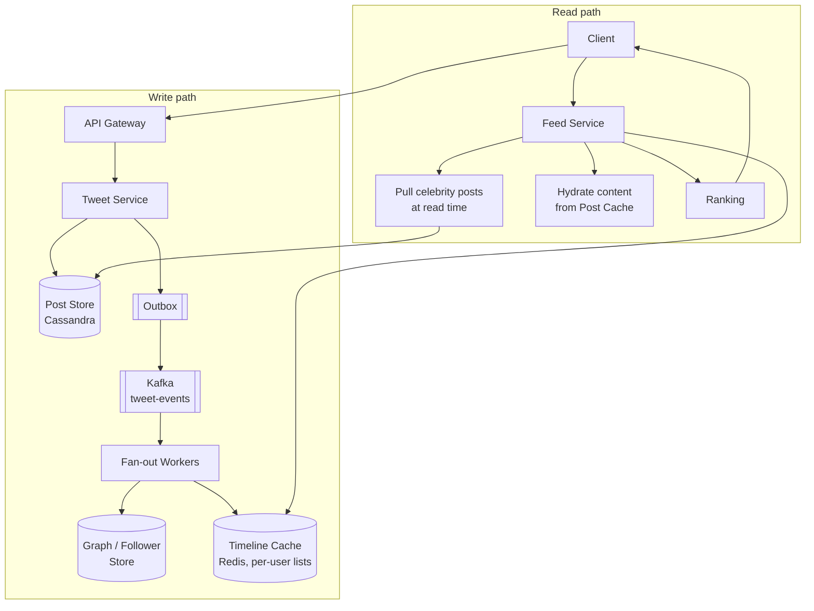
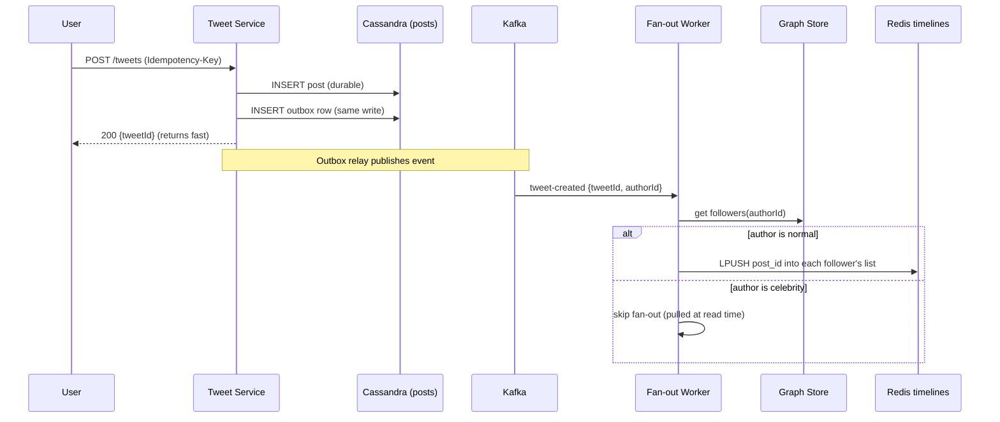
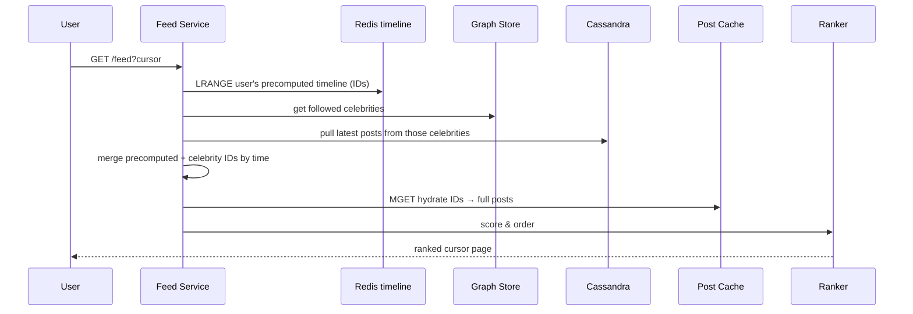
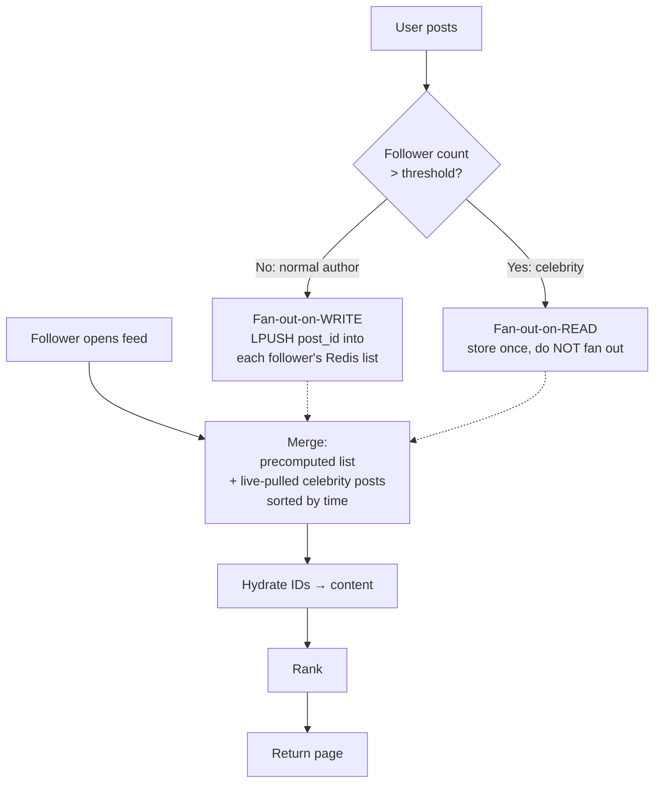
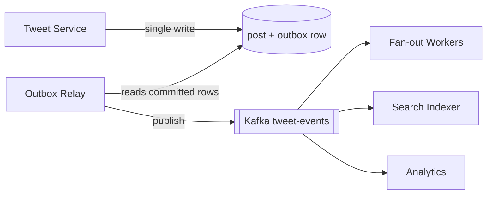
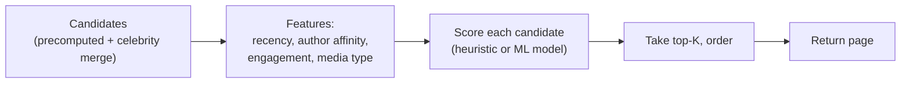
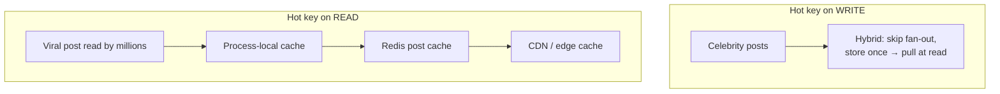

# Twitter / Social Feed — Staff/SSE System Design

**Difficulty:** Intermediate → Advanced
**Interview importance:** ⭐ **Critical** (the canonical "read-heavy at scale" question; also the home of the celebrity/hot-key problem)
**References:** Alex Xu — *System Design Interview* Vol 1, Ch. 11 (*Design a News Feed*); ByteByteGo — *Design a Newsfeed*; DDIA Ch. 5 (replication) & Ch. 11 (streams)

---

## 0. Why This Design Matters

A social feed looks like "fetch recent posts from people I follow, sort by time." One `JOIN` and a `LIMIT`, right? That naive query is exactly the trap. It runs on the **hottest read path in the product** — every app open, every pull-to-refresh — and it fans across an enormous, skewed follow graph where a handful of accounts have tens of millions of followers. The moment you try to serve that JOIN live at 100M+ daily users, the database melts.

So the entire design is about **moving work off the read path**: precompute each user's timeline *when someone posts* (fan-out-on-write) instead of *when someone reads* (fan-out-on-read). That single decision — and the ugly exception it creates for celebrities — is what the interview is really testing.

> The one-line thesis: **a feed system trades write amplification for read speed — and the whole design is about where you draw the line so that celebrities don't blow up your writes and ordinary users still get instant reads.**

---

## 1. Problem Overview — Explain It Simply

Build a system that answers one question, hundreds of thousands of times per second, in tens of milliseconds:

> **"What are the newest, most relevant posts from the accounts this user follows?"**

Two operations dominate and pull in opposite directions:

- **Post (write):** a user publishes a tweet. Cheap for the author — but it may need to reach *every follower's* timeline.
- **Read (feed):** a user opens the app and wants a ready-to-scroll, ranked, personalized timeline **now**.

The tension: reads outnumber writes by roughly **100:1**. If you make reads cheap by precomputing timelines, a celebrity's single post triggers **tens of millions of writes**. If you make writes cheap by computing feeds on read, every app-open becomes an expensive multi-source merge. You cannot have both cheap — you choose *where the pain lives*.

### Real-world analogy — the newspaper vs. the library

- **Fan-out-on-write = home delivery.** When news breaks, the paper prints a copy and drops one on **every subscriber's doorstep**. Readers just walk outside — instant. But if a columnist has 50 million subscribers, printing and delivering 50M copies for one article is brutal.
- **Fan-out-on-read = the library.** Nothing is delivered. When you want to read, **you go pull the latest from each author's shelf** and assemble your own reading list. Cheap to publish, but every reader does the assembly work every visit.

Real Twitter is a **hybrid**: home-deliver for normal authors (fast reads for the masses), but make the few mega-celebrities "shelf-only" and merge their posts in at read time. Everything else — Redis timelines, Kafka fan-out, ranking — is plumbing around that one choice.

---

## 2. Functional Requirements

**Core**
- **Post a tweet** (text; assume media is a URL to blob storage).
- **Follow / unfollow** an account (the social graph).
- **Home timeline** — merged, reverse-chronological (or ranked) feed of followed accounts, paginated.
- **User / profile timeline** — a single account's own posts.
- **Engage** — like, reply, repost (retweet).

**Optional (name them, then defer)**
- Ranking / relevance ("For You" vs "Following"), notifications, trending topics, search, media transcoding, mentions, DMs. Say them, then scope down to *post → fan-out → read timeline* as the interview spine.

---

## 3. Non-Functional Requirements

| Requirement | Target | Why it dominates the design |
|---|---|---|
| Read latency | **p99 < 200 ms** for a feed page | It's every app open; users bounce on lag |
| Read throughput | **100K+ feed reads/sec** | ~100:1 read:write → reads are the scaling problem |
| Write amplification | Bounded | One celebrity post must **not** cause 50M synchronous writes |
| Availability | **99.99%** on reads | A social feed that's down is a dead product |
| Consistency | **Eventual** for the timeline | A post appearing 1–2 s late is fine; correctness ≠ freshness here |
| Durability | Posts never lost | The tweet is the product; timelines are a rebuildable cache |
| Scalability | Horizontal | Graph + posts + timelines all grow without bound |

> **Say this out loud:** *"This is a read-heavy, eventually-consistent system. The feed is a cache I can rebuild; the posts are the source of truth I must never lose. That framing drives every storage and fan-out choice."*

---

## 4. Capacity Estimation (do the math — don't hand-wave)

Start from users and derive the **read:write ratio** and the **fan-out amplification** — those two numbers justify the whole architecture.

```text
DAU                 = 200,000,000
Posts/user/day      = 0.5      → 100,000,000 posts/day
Feed opens/user/day = 10       → 2,000,000,000 feed reads/day
```

**Convert to QPS:**
```text
Writes: 100,000,000 / 86,400 ≈ 1,160 posts/sec   (avg)
Reads : 2,000,000,000 / 86,400 ≈ 23,000 reads/sec (avg)
Peak (×3)  →  writes ≈ 3,500/sec ,  reads ≈ 70,000/sec
```

**Read:write ratio ≈ 20:1 at the API** — and it gets *worse* downstream because of fan-out.

**Fan-out amplification (the headline number).** Average followers ~200, so precomputing timelines on write:
```text
1,160 posts/sec × 200 avg followers ≈ 232,000 timeline writes/sec  (avg)
Peak (×3)                            ≈ 700,000 timeline writes/sec
```
The **average** is fine. The **tail** is the killer: a celebrity with 50M followers publishing one tweet is **50,000,000 writes** from a **single** request — a 50-million-fold amplification in one event. This one line justifies **hybrid fan-out**.

**Timeline storage.** Store **only IDs**, not full posts:
```text
per entry: post_id (8 B) + author_id (8 B) + score (8 B) ≈ 24 B
cache ~800 recent entries/user × 24 B ≈ 20 KB/user
200M users × 20 KB ≈ 4 TB of timeline cache  → sharded Redis cluster
```

**Post storage (durable).**
```text
100M posts/day × 300 B ≈ 30 GB/day ≈ 11 TB/year  → wide-column store (Cassandra)
```

**What the numbers tell us:**
- **Reads dominate** → precompute timelines so reads are a single cache lookup.
- **Fan-out amplification is unbounded at the tail** → celebrities need a different code path (hybrid).
- **Timelines store IDs only** → tiny, cache-friendly; hydrate content separately.
- **Posts are the durable source of truth; timelines are a rebuildable cache.**

---

## 5. API Design

**Post a tweet** (write path):
```http
POST /v1/tweets
Idempotency-Key: 4b1e-...        # dedupe client retries
```
```json
{ "text": "shipping the new feed 🚀", "mediaUrls": [] }
```
```json
{ "tweetId": "18092...", "authorId": "U123", "createdAt": "2026-09-03T10:00:00Z" }
```

**Read the home timeline** (hot read path) — **cursor pagination, never OFFSET**:
```http
GET /v1/feed?cursor=eyJ0cyI6MTY5Mn0&limit=20
```
```json
{
  "items": [ { "tweetId": "...", "authorId": "...", "text": "...", "createdAt": "..." } ],
  "nextCursor": "eyJ0cyI6MTY5MX0"
}
```

**Follow graph:**
```http
POST   /v1/users/{userId}/follow
DELETE /v1/users/{userId}/follow
GET    /v1/feed/user/{userId}?cursor=...   # profile timeline
```

> **Why a cursor, not `?page=500`?** `OFFSET 10000 LIMIT 20` makes the DB scan and discard 10,000 rows every time — cost grows with depth. A cursor (an opaque `{timestamp, tweet_id}`) turns "next page" into a **range scan from where you stopped** — O(page size) regardless of depth, and stable even when new posts arrive at the top.

---

## 6. High-Level Architecture



**The spine to draw first, then narrate:**
- **Write path (async fan-out):** Tweet Service durably stores the post, emits an event via an **outbox → Kafka**, and **fan-out workers** push the post ID into each follower's Redis timeline list — *for normal authors only*.
- **Read path (cheap):** Feed Service reads the user's **precomputed timeline list** from Redis, **merges in celebrity posts pulled live**, hydrates IDs → content, ranks, and returns a cursor page.

Keep the two paths separate in your head: **writes fan out asynchronously; reads are (mostly) a single cache read.**

---

## 7. Database Selection — and *Why*

| Data | Store | Why this one |
|---|---|---|
| **Posts** (source of truth) | **Cassandra** (wide-column) | Write-heavy, append-only, time-ordered, huge volume; partition by `author_id`, cluster by time → cheap "latest N by author" (perfect for profile timelines & read-fan-out) |
| **Home timelines** | **Redis** (list/sorted-set per user) | Feed read must be a single-digit-ms lookup; timelines are a rebuildable cache, not durable truth |
| **Follow graph** | **Cassandra / graph-ish KV** | `followers(user)` and `following(user)` as two denormalized lists; read on every fan-out and every celebrity merge |
| **Post content cache** | **Redis** | Hydrate the tiny ID timelines into full posts without hitting Cassandra per item |
| **Counters** (likes/reposts) | **Redis** (atomic) + async flush | High-write, tolerant of eventual consistency |
| **Search / trends** | **Elasticsearch** | Full-text + ranking read model, fed async off Kafka |

> **Why Cassandra for posts, not Postgres?** Posts are an append-only, time-series-shaped firehose (100M/day) read by simple key + time-range queries — Cassandra's exact sweet spot, with linear write scaling and no single-primary bottleneck. Postgres gives ACID and joins we don't need here, and its single-writer scaling is the wrong shape for this firehose. Postgres *would* be fine for account metadata; it is the wrong tool for the timeline firehose.

> **Why Redis for timelines, not Cassandra?** The timeline is a **derived cache** — if it's lost, we rebuild it from posts + graph. We optimize it purely for latency (in-memory, per-user list, O(1) push, O(page) read). Putting durability requirements on a cache would be paying for a guarantee we don't need.

---

## 8. Deep-Dive Request Flows

**Post → fan-out (write path):**



**Read feed (read path):**



Notice: **the common case (normal authors) is one Redis `LRANGE`.** The celebrity merge touches only the *few* mega-accounts a user follows — a bounded, cache-friendly extra.

---

## 9. The Core Decision — Fan-out-on-Write vs Fan-out-on-Read

This is the heart of the interview. Lead with the trade-off table, then explain the hybrid.

| | **Fan-out-on-write (push)** | **Fan-out-on-read (pull)** |
|---|---|---|
| When work happens | On **post** — precompute every follower's timeline | On **read** — assemble feed live from followees |
| Read cost | **Cheap** (one cache read) ✅ | **Expensive** (merge N authors) ❌ |
| Write cost | **Expensive** (×followers) ❌ | **Cheap** (write once) ✅ |
| Celebrity post | **Write storm** (50M writes) ❌ | Fine (write once) ✅ |
| Inactive followers | **Wasted work** (compute for users who never read) ❌ | No waste ✅ |
| Timeline freshness | Slight lag (async) | Always current ✅ |
| Best for | The **many** normal authors | The **few** celebrities |

### 9.1 Fan-out-on-write (push) — the failure that forced it

Naively, the feed is `SELECT ... FROM posts WHERE author IN (my followees) ORDER BY time LIMIT 20`. At 70K reads/sec against a follow-set that can be thousands of authors, that live merge crushes the DB. **Push** solves it: when you post, workers **precompute** by pushing your `post_id` into each follower's Redis list. Now a feed read is a single `LRANGE` — reads become trivially cheap. The bill moves to write time and grows with follower count.

### 9.2 Fan-out-on-read (pull) — when push breaks

Push breaks for **celebrities**: 50M followers = 50M writes for one tweet, a **hot-partition write storm** that also wastes effort on the ~90% of followers who won't open the app soon. **Pull** fixes it: store the celebrity's tweet **once**; when a follower reads, **pull** the celebrity's recent posts live and merge them in. One write, extra read work — exactly the opposite trade.

### 9.3 The Hybrid — the answer to give ⭐

Route by follower count. **Push for normal authors** (cheap reads for the masses). **Pull for celebrities** (no write storm). At read time, merge the follower's precomputed list with live-pulled celebrity posts.



**Where's the threshold?** Not a magic constant — driven by cost. Pushing is worth it while `followers × write_cost < readers × read_savings`. Practically, "celebrity" is the small set (say **>100K–1M followers**) where a single post's fan-out cost exceeds what precomputation buys. Some systems make it **adaptive** (also consider follower *activity* — don't push to dormant accounts).

> **Interview line:** *"I fan out on write for normal authors so the 100:1 read majority is a single cache lookup, and fall back to fan-out on read for celebrities to avoid the 50-million-write storm. At read time I merge the precomputed timeline with live-pulled celebrity posts. The threshold is a cost knob, not a constant."*

---

## 10. Why Kafka + Outbox on the Write Path

Fan-out must be **asynchronous** — the author's `POST /tweets` cannot block on writing to millions of timelines. So the write is: durably store the post, emit an event, return; workers fan out later.

**The trap: dual-write.** If Tweet Service writes to Cassandra *and* publishes to Kafka as two separate steps, a crash between them either loses the post or loses the fan-out event. Fix with the **Transactional Outbox**: write the post **and** an `outbox` row in the **same** write, then a relay tails the outbox and publishes to Kafka. The event is now guaranteed to be emitted **at least once**.



**Why Kafka specifically:** it **decouples** posting from the many consumers (fan-out, search, analytics, notifications), **buffers** bursts (a viral spike is absorbed as lag, not dropped writes), and enables **replay** — if a fan-out worker had a bug, reprocess the topic to rebuild timelines. Partition by `author_id` so a single author's events stay ordered.

**Idempotent fan-out.** Kafka is at-least-once, so a worker may reprocess an event. Writing `post_id` into a timeline must be idempotent — a Redis **sorted set** keyed by `post_id` naturally dedupes (re-adding the same member is a no-op), so replays don't create duplicates.

---

## 11. Timeline Cache Design (Redis)

Store **IDs only** — the timeline is an index, not a copy of content.

```text
Key:   timeline:{user_id}                 (a Redis sorted set)
Member: post_id
Score:  created_at (or a ranking score)

ZADD   timeline:U123  <ts>  <post_id>      # fan-out push (idempotent)
ZREVRANGEBYSCORE timeline:U123 <cursor> -inf LIMIT 0 20   # read a page
ZREMRANGEBYRANK  timeline:U123 0 -801      # trim to newest ~800
```

**Why a sorted set (not a plain list)?** Scores give free time-ordering and merge-by-time, cursor reads are a range query, and re-adding a `post_id` is idempotent (dedupes replays). **Cap each timeline** (~800 entries) so memory is bounded and deep scroll falls back to the durable store.

**Hydration — two-tier.** The timeline holds ~20 IDs per page; hydrate them to full posts via a Redis **post-content cache** (`MGET post:{id}`), falling back to Cassandra on a miss. This keeps the huge, per-user timeline tiny while a **single shared copy** of each post's content is cached once for everyone.

**Cache the social graph too.** Fan-out reads `followers(author)` on every post and the celebrity merge reads `following(user)` on every feed — both are hot; cache them.

---

## 12. Ranking Basics (name it, then keep it optional)

Reverse-chronological is the simple baseline. A "For You" feed adds **relevance ranking** as a **read-time re-scoring** step over the merged candidate set — it does *not* change fan-out.



**Say this:** ranking is a **read-side concern layered on top of fan-out** — keep it decoupled so you can ship chronological first and add relevance later without touching the write path. Don't rabbit-hole into ML unless asked; the systems story is fan-out, not the model.

---

## 13. Consistency — Why Eventual Is Fine (and where it isn't)

The home timeline is **eventually consistent by design**. A tweet reaches followers as fast as fan-out drains — usually seconds, longer during spikes. That's acceptable: a social feed is not a bank ledger; nobody is harmed if a post lands 2 seconds late.

What this buys us: we can make fan-out **async** (Kafka), **replicate** posts across regions asynchronously (DDIA Ch. 5), and **cache aggressively** — all impossible under strong consistency.

Where eventual consistency **must not** silently drop data:
- **Durability of the post itself is strong** — Cassandra quorum write; the tweet is never lost even though its *distribution* is eventual.
- **Read-your-writes for the author** — after I post, *I* expect to see it immediately. Handle by writing to my own timeline synchronously (or reading my profile from the post store), even while fan-out to others is still draining.
- **Ordering within an author** is preserved by partitioning Kafka on `author_id`; global cross-author ordering across the feed is only *approximately* by timestamp — and that's fine.

> **Interview line:** *"Posts are durably, strongly stored; their *distribution* to timelines is eventual. I special-case read-your-writes so the author always sees their own post instantly, and keep everyone else's freshness eventual so I can fan out async and cache hard."*

---

## 14. Failure Scenarios

| Failure | Handling |
|---|---|
| **Fan-out worker crashes** | Kafka replays uncommitted events; writes are idempotent (sorted-set dedupe) → no dupes, no loss |
| **Kafka lag spikes (viral event)** | Backpressure: fan-out falls behind → timelines are stale, not wrong. Autoscale workers; celebrities already bypass fan-out |
| **Redis timeline node down** | Timeline is a **rebuildable cache** — serve from replica, or reconstruct from posts + graph; degrade to fan-out-on-read meanwhile |
| **Post write succeeds, event lost** | Impossible with outbox — post + outbox row are one atomic write; relay guarantees the event |
| **Duplicate post (client retry)** | `Idempotency-Key` on `POST /tweets` → return the existing tweet, don't double-publish |
| **Celebrity posts, then followers stampede** | Celebrity posts are cached once (pull path) → the read merge is a single hot post cached at the edge; no write storm |
| **Hot read key** (viral post read by millions) | Cache the post content at CDN/edge + local process cache; a single ID is served from memory |
| **Deep pagination** | Cursor (not OFFSET) bounds cost; beyond the ~800-entry cache, fall back to durable store range scan |

---

## 15. The Hot-Key / Celebrity Problem — In Depth

This is the topic that separates a mid-level answer from staff-level. There are **two** distinct hot-key problems; name both.

**1. Hot-key on WRITE (fan-out storm).** A celebrity posts → naive push = tens of millions of timeline writes concentrated in a burst. **Fix: hybrid fan-out** — don't push for celebrities; store once and pull at read time. This *removes* the write amplification entirely for the tail.

**2. Hot-key on READ (viral post read by everyone).** One post is read by millions in minutes → the single `post:{id}` content key is a read hot-spot. **Fix: layered read caching** — the post content is *immutable*, so cache it hard: process-local cache → Redis → CDN/edge. Millions of reads collapse onto one memory lookup per node.



> **The connection to make explicit:** this is the **exact same "handle the head of a skewed distribution differently" move** as hot keys in a rate limiter or a distributed cache. The follow graph is power-law: a few nodes have millions of edges. You *always* special-case the head.

---

## 16. Trade-Offs to Say Out Loud

| Axis | Option A | Option B | Choose by |
|---|---|---|---|
| Fan-out | On-write (fast reads, write storm) | On-read (cheap writes, slow reads) | Follower count → **hybrid** |
| Timeline store | Redis (fast, volatile) | Durable DB (safe, slower) | It's a rebuildable cache → Redis |
| Post store | Cassandra (write-scale, no joins) | Postgres (ACID, joins) | Firehose + simple queries → Cassandra |
| Consistency | Strong (correct, slow) | Eventual (scalable, stale) | Feed tolerates staleness → eventual |
| Fan-out timing | Sync (simple, blocks author) | Async via Kafka (resilient, eventual) | Never block the author → async |
| Pagination | OFFSET (simple, degrades) | Cursor (stable, O(page)) | Deep/live feeds → cursor |
| Ranking | Chronological (simple) | Relevance/ML (engagement) | Ship chrono first; layer ranking on read |

---

## 17. Interview Q&A

**Beginner**

**Q: Fan-out-on-write vs fan-out-on-read — which and why?**
Neither alone — **hybrid**. Push (write) for normal authors so the read-heavy majority is a single cache lookup; pull (read) for celebrities so one post doesn't trigger tens of millions of writes. Merge both at read time.

**Q: Why is this system read-heavy, and why does that matter?**
Reads outnumber writes ~100:1 (every app-open is a read). So I optimize the read path to a single cache lookup by **precomputing** timelines on write. The cost moves to write time, which I then bound with the hybrid.

**Q: Why cursor pagination instead of page numbers?**
`OFFSET N` scans and discards N rows, so cost grows with depth and pages shift when new posts arrive. A cursor (`{timestamp, id}`) is a range scan from where you stopped — O(page size) and stable.

**Intermediate**

**Q: A celebrity with 50M followers posts. Walk me through it.**
They're over the celebrity threshold, so fan-out is **skipped** — the post is stored once. When each of their followers opens the feed, the Feed Service **pulls** the celebrity's recent posts live and merges them into that user's precomputed timeline by time. One write instead of 50M; the read cost is bounded because a user follows only a few such mega-accounts, and the hot post is cached.

**Q: How do you keep fan-out reliable if a worker crashes mid-way?**
Fan-out runs off **Kafka**, so uncommitted events are **replayed**. Writes into timelines are **idempotent** (sorted-set add keyed by post_id dedupes), so replay causes neither loss nor duplicates. The post itself was durably committed before any event was emitted (outbox).

**Q: How does a post reliably get from the DB into Kafka?**
**Transactional outbox** — the post row and an outbox row are written in one atomic operation; a relay tails the outbox and publishes to Kafka. This avoids the dual-write problem where a crash loses either the post or the event.

**Advanced / Staff**

**Q: Where exactly is the celebrity threshold, and is it fixed?**
It's a **cost knob**, not a constant. Push while `followers × write_cost < readers × read_savings`. Practically the small set above ~100K–1M followers. I'd make it **adaptive** — factor in follower *activity* so I don't precompute for dormant accounts, and I can lower it under write pressure.

**Q: How do you guarantee read-your-writes when everything is eventually consistent?**
The author must see their own post instantly even while fan-out drains. I write the post to the **author's own timeline synchronously** (and/or read the author's profile straight from the post store), so their view is immediate while distribution to others stays eventual.

**Q: What breaks first at 10×, and what's your hottest key?**
Fan-out write throughput and Kafka consumer lag break first — timelines go stale under load (degraded, not wrong). The hottest keys are (a) a celebrity's follower fan-out on write — solved by the hybrid skipping them, and (b) a viral post's content key on read — solved by layered immutable-content caching (local → Redis → CDN).

**Q: If Redis loses all timelines, are you down?**
No. Timelines are a **derived cache**. I rebuild them from the durable posts + follow graph, and meanwhile degrade to **fan-out-on-read** for everyone. The only truly precious data — posts and graph — is durably stored, so nothing is lost.

---

## 18. 30-Second Interview Answer

> "It's a read-heavy system — reads beat writes ~100:1 — so I precompute each user's timeline at post time and make a feed read a single Redis lookup. That's **fan-out-on-write**: when you post, async workers push your post ID into each follower's timeline list. The catch is celebrities — 50M followers would mean 50M writes per tweet — so I go **hybrid**: normal authors push, celebrities are stored once and **pulled** at read time, then merged into the timeline by time. Fan-out runs off **Kafka** with a **transactional outbox** so no post or event is lost, and idempotent writes make replay safe. Timelines store **IDs only** in Redis and hydrate content from a shared post cache; the durable posts live in **Cassandra**. The feed is **eventually consistent** — a post landing a second late is fine — except I special-case **read-your-writes** so authors see their own posts instantly. Pagination is **cursor-based**, and viral posts are handled with layered immutable-content caching."

---

## 19. Mental Model

```text
POST
   ↓ durable write → Cassandra + outbox row (atomic)
   ↓ outbox relay → Kafka (partition by author)
   ↓ fan-out worker:
        normal author  → PUSH post_id into each follower's Redis timeline
        celebrity      → SKIP (pulled at read time)

READ FEED
   ↓ LRANGE precomputed timeline (IDs)        ── the cheap common case
   ↓ + pull celebrity posts live, merge by time
   ↓ hydrate IDs → content (post cache)
   ↓ rank
   → page (cursor)

FAN-OUT     → hybrid (push normal / pull celebrity)  ← the whole design
TIMELINE    → Redis sorted set, IDs only, capped, idempotent
POSTS       → Cassandra (durable source of truth)
PIPELINE    → outbox → Kafka (async, replayable, idempotent)
CONSISTENCY → eventual, except read-your-writes for the author
HOT KEYS    → write: hybrid skips celebrities | read: layered content cache
PAGINATION  → cursor, never OFFSET
```

---

## 20. How This Connects to Other Topics

- **Rate limiter (hot keys):** the celebrity fan-out is the *same* "handle the head of a skewed distribution differently" move as a rate limiter's hot-key / local+global split. Power-law traffic always gets special-cased at the head.
- **Distributed cache:** the timeline cache, ID-only + hydrate pattern, capped lists, and layered immutable-content caching are textbook cache design; a viral post is a cache hot-key.
- **Message queues / streams (DDIA Ch. 11):** Kafka fan-out, partition-ordered events, at-least-once + idempotent consumers, and replay-to-rebuild are the streaming backbone.
- **Replication (DDIA Ch. 5):** eventual consistency of the timeline, async cross-region replication of posts, and read-your-writes are the same replication-lag concerns.
- **Outbox / dual-write:** the transactional outbox reappears anywhere a DB write must reliably produce an event (payments, order processing, search indexing).
- **Top-K / trending:** trending topics reuse this same event stream as input to an approximate heavy-hitters count.
