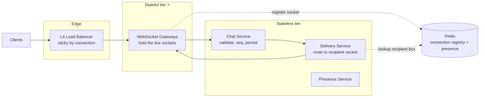
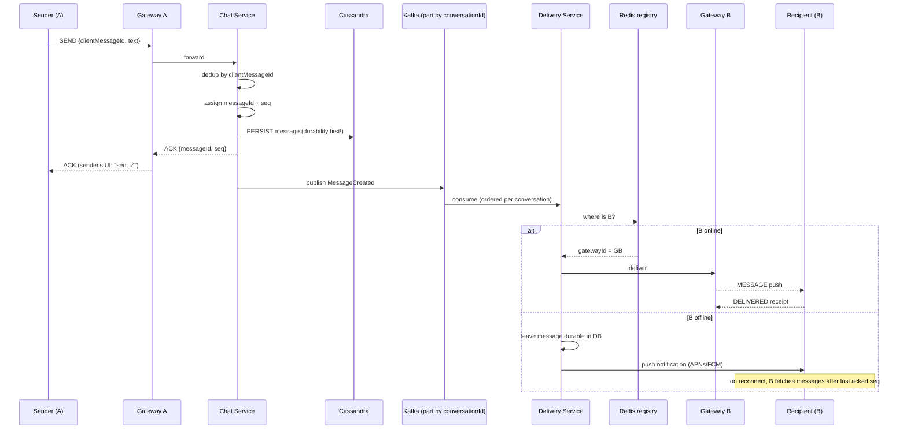
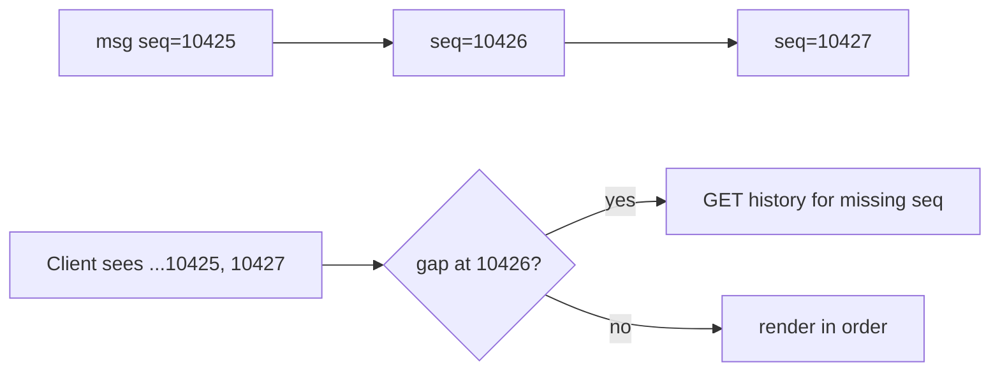
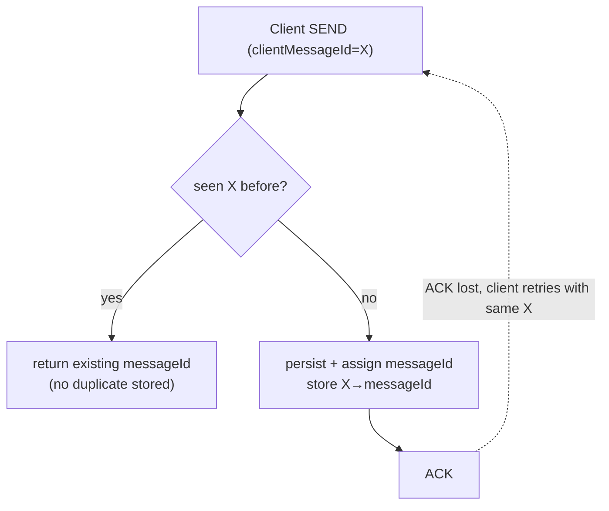
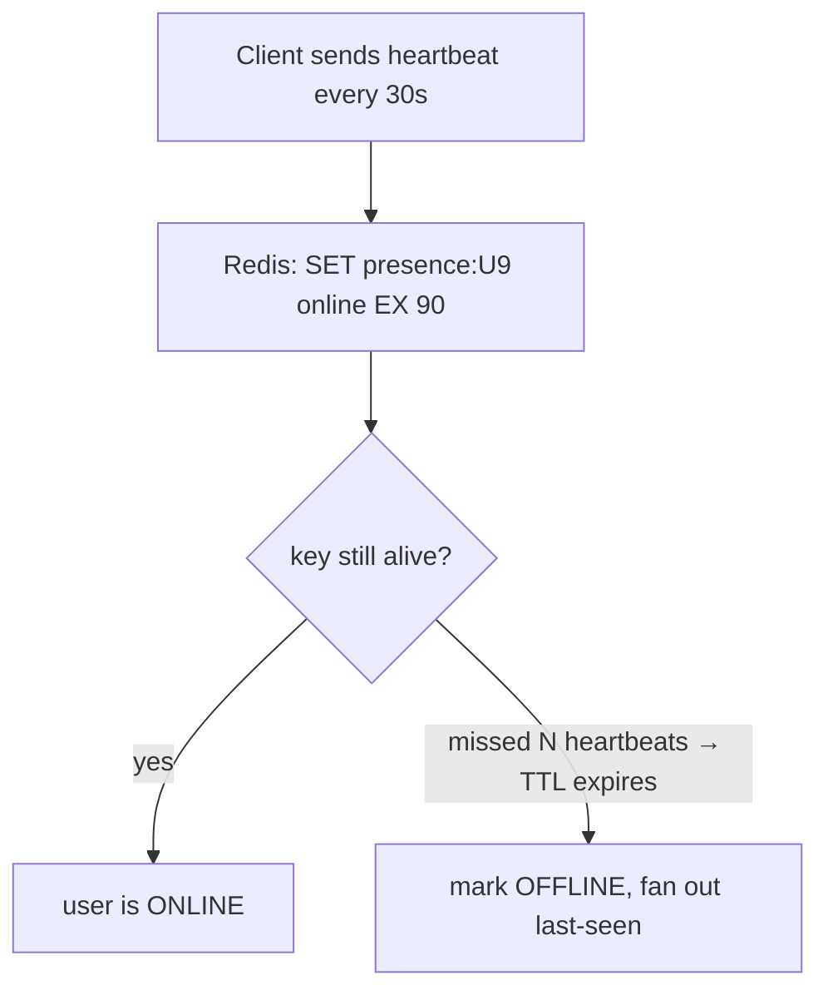
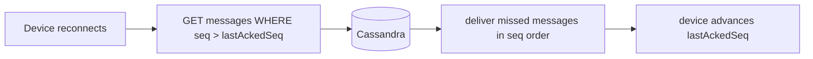
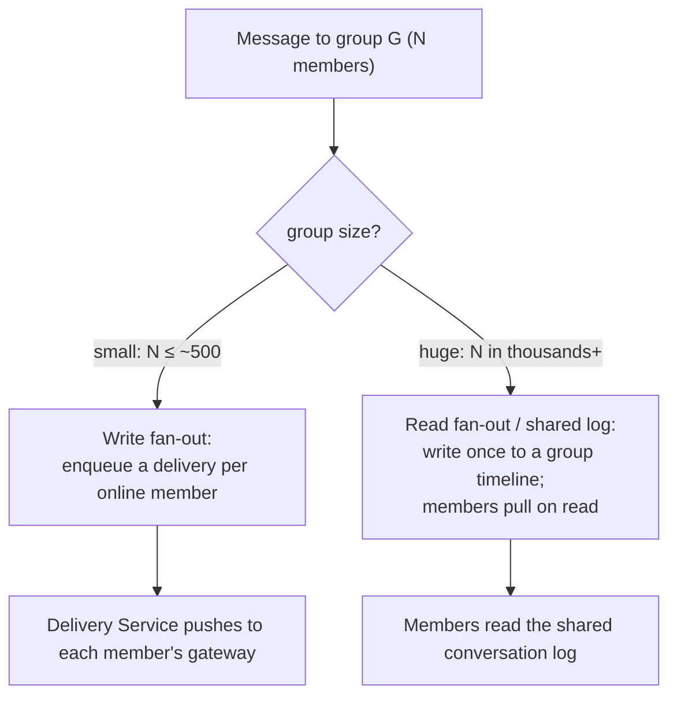
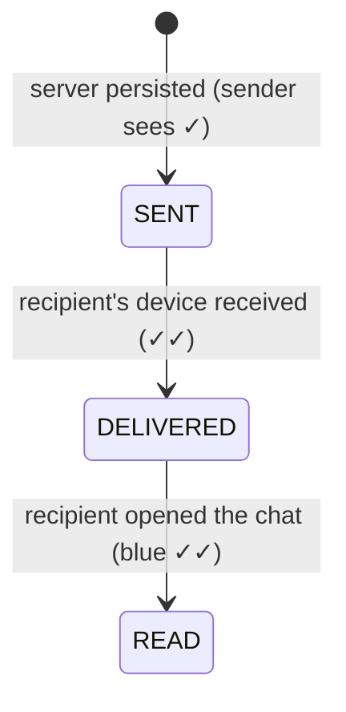

# Chat System — Staff/SSE System Design

**Difficulty:** Advanced
**Interview importance:** ⭐ **Critical** (WhatsApp / Slack / Messenger / Discord — the canonical "real-time + stateful + ordering" question)
**References:** Alex Xu — *System Design Interview* Vol 1, Ch. 12; ByteByteGo — *Design a Chat System*; DDIA Ch. 8–9 (ordering, delivery guarantees, clocks)

---

## 0. Why This Design Matters

Almost every other system-design question is **stateless request/response**: a request comes in, you compute, you reply, you forget the client. A chat system is the one that forces you to reason about a **persistent, stateful connection** that lives for hours, a **push** model instead of pull, and a server that must **find** a specific recipient's live socket among a million open sockets on a thousand machines. On top of that it stacks the three hardest distributed-systems ideas at once: **message ordering**, **exactly-what-delivery-guarantee**, and **fan-out at scale**.

> The one-line thesis: **a chat system is a routing problem over stateful connections — "given a message, which of my thousand gateway boxes holds the recipient's live socket, and how do I get it there in order, exactly once as the user perceives it, even if they were offline?"**

A weak candidate says "client sends to server, server sends to client." A strong candidate separates the **stateful connection tier** from the **stateless logic tier**, uses a **connection registry** to route, persists **before** delivering, picks **per-conversation sequence numbers** for ordering, and knows that "delivered twice on the wire" is fine because the **client dedups on `clientMessageId`**.

---

## 1. Problem Overview — Explain It Simply

Build a system where millions of users keep a live connection open and can send a short message to another user (or a group) and have it appear **near-instantly**, **in order**, **never lost**, and **catch up** anything they missed while their phone was off.

Four jobs, and every one is a distributed-systems trap:

1. **Hold the connection** — keep a socket open per online user (stateful; the hard part).
2. **Route the message** — find the machine holding the recipient's socket and push to it.
3. **Store durably** — write the message so an offline user can fetch it later.
4. **Reconcile** — when a user reconnects, deliver everything since their last acknowledged message.

### Real-world analogy — the old telephone switchboard

Think of a 1920s switchboard operator. Every caller has a **physical cable plugged into a jack** (the open WebSocket). To connect Alice to Bob, the operator doesn't shout across the room — she looks at a **board that says which jack Bob is plugged into** (the connection registry / presence store) and patches the line there. If Bob isn't plugged in, she takes a **written message** (durable store) and hands it to him when he next plugs in. Everything else — Kafka, Cassandra, sequence numbers — is just "how do a thousand operators share one board and never lose a written message?"

---

## 2. Functional Requirements

**Core**
- **1:1 messaging** and **group messaging**.
- **Real-time delivery** to online recipients (server *pushes*, client doesn't poll).
- **Message history** — fetch past messages of a conversation, paginated.
- **Delivery & read receipts** — sent → delivered → read state machine.
- **Presence** — online / offline / last-seen.
- **Offline delivery** — store messages for offline users; deliver on reconnect.
- **Push notifications** — wake the app (APNs / FCM) when the user isn't connected.
- **Typing indicators**.
- **Multi-device** — same account on phone + laptop stays in sync.

**Optional (name them, then defer)**
- Media/attachments (upload to blob store, send a URL — not through the socket), end-to-end encryption, message edit/delete, reactions, threads, search, huge broadcast channels.

---

## 3. Non-Functional Requirements

| Requirement | Target | Why it dominates the design |
|---|---|---|
| Delivery latency | **p99 < 200 ms** end-to-end when both online | It's a live conversation; lag feels broken |
| Availability | **99.99%+** | People rely on it; a dropped socket must silently reconnect |
| Durability | **No message ever lost** once accepted | "Persist before ack" — non-negotiable |
| Ordering | **In order per conversation** | Out-of-order chat is confusing and looks buggy |
| Delivery guarantee | **At-least-once on the wire + client dedup** | Exactly-once end-to-end is impractical; dedup makes it *feel* exactly-once |
| Scale | Tens of millions of concurrent connections | Forces a dedicated stateful connection tier + sharding |
| Connection efficiency | ~1M sockets / gateway box | Memory & FD limits shape box count |

> **Say this out loud:** *"The connection tier is the only stateful part of the system; everything else stays stateless. That single split drives my scaling, routing, and failure story."*

---

## 4. Capacity Estimation (do the math — don't hand-wave)

Assume a large-scale prompt:

```text
DAU                 = 50,000,000 users
Messages/user/day   = 40
Concurrent online   = 10% of DAU  = 5,000,000 concurrent sockets
```

**Messages/sec (write path).**
```text
50M users × 40 msgs/day = 2,000,000,000 messages/day
2,000,000,000 ÷ 86,400  ≈ 23,000 messages/sec average
Peak (5×)               ≈ 115,000 messages/sec
```

**Fan-out amplification.** A message isn't one delivery. A 1:1 message = 2 deliveries (sender's other devices + recipient). A group of 50 = up to 50 deliveries. If average conversation size is ~4 recipients:
```text
23,000 msgs/sec × 4 deliveries ≈ 92,000 deliveries/sec average
Peak ≈ 460,000 deliveries/sec  → the delivery tier is the real load, not ingest
```

**Concurrent connections → gateway box count.** A tuned box (epoll, tuned FD limits, ~10–20 KB/socket) holds ~**1M** idle WebSocket connections.
```text
5,000,000 sockets ÷ 1,000,000 per box ≈ 5 boxes (min)
+ headroom for reconnect storms & failover  → ~15–20 boxes
```
The headline: **connection count, not CPU, sizes the gateway tier**, and a reconnect storm (deploy, network blip) can double it in seconds.

**Storage/day.**
```text
Avg message ≈ 300 bytes (text + metadata + IDs)
2,000,000,000 msgs/day × 300 B ≈ 600 GB/day  ≈ 220 TB/year
```
→ **A single relational DB can't hold this** with the required write rate. You need a horizontally-scalable, write-optimized, time-ordered store → **Cassandra / wide-column KV** (Section 7).

**What the numbers tell us:**
- The **delivery/fan-out tier** carries multiples of the ingest rate — optimize it, not ingest.
- **Connections size the gateway tier**; plan for reconnect storms.
- **Storage is write-heavy and append-only** → wide-column store with a conversation-time key.
- The socket is precious — never push large payloads (media) through it.

---

## 5. API & WebSocket Protocol

**Establish the connection** (upgrade HTTP → WebSocket; auth token in the handshake):
```http
GET wss://chat.example.com/connect
Authorization: Bearer <jwt>
```

**Client → server: send a message** (note the client-generated `clientMessageId` — the idempotency key):
```json
{
  "type": "SEND",
  "conversationId": "C1",
  "clientMessageId": "8f3c-uuid",   // dedup key, generated on the client
  "text": "Hello",
  "sentAt": 1692783600123
}
```

**Server → client: durable ack** (server assigns the authoritative `messageId` + `seq`):
```json
{
  "type": "ACK",
  "clientMessageId": "8f3c-uuid",
  "messageId": "01H...ULID",
  "conversationId": "C1",
  "seq": 10427            // per-conversation sequence number → ordering
}
```

**Server → client: incoming message push:**
```json
{ "type": "MESSAGE", "conversationId": "C1", "messageId": "01H...", "seq": 10427,
  "senderId": "U9", "text": "Hi", "sentAt": 1692783600500 }
```

**Client → server: receipts & typing** (small control frames, often best-effort):
```json
{ "type": "READ",   "conversationId": "C1", "upToSeq": 10427 }
{ "type": "TYPING", "conversationId": "C1", "state": "start" }
```

**REST for history** (not everything belongs on the socket — pagination is a normal HTTP call):
```http
GET /v1/conversations/C1/messages?beforeSeq=10427&limit=50
```

> Two channels, on purpose: the **WebSocket** carries live, ordered, low-latency traffic; **REST** carries bulk history and cold reads. Don't page history over the socket.

---

## 6. Where Do the Pieces Live? (the stateful/stateless split)



- **Load balancer (L4)** — long-lived TCP; can't reshuffle mid-connection, so it's effectively sticky per socket.
- **WebSocket Gateway (the *only* stateful tier ⭐)** — terminates the socket, holds it open, does heartbeats. On connect it **registers `userId/deviceId → gatewayId`** in the registry. This is what makes routing possible.
- **Chat Service (stateless)** — validates, dedups by `clientMessageId`, assigns `messageId` + per-conversation `seq`, **persists**, then emits a delivery event.
- **Delivery Service (stateless)** — for each recipient, looks up their gateway in the registry and pushes; if offline, leaves the message durable and triggers a push notification.
- **Presence Service (stateless)** — heartbeats in, fan-out of online/offline to interested friends.

> **Interview line:** *"I split the system into one stateful tier — the WebSocket gateways that own the sockets — and a stateless logic tier behind it. The gateways register each connection in a routing table so any delivery worker can find the box holding a given user's socket."*

---

## 7. Database Selection — Why Cassandra for Messages

The dominant query is: **"give me the messages of conversation C, in order, most recent first, paginated."** That is a **partition + clustering** access pattern, and the workload is **write-heavy, append-only, enormous, and time-ordered** — the exact shape Cassandra is built for.

| Store | Role here | Why |
|---|---|---|
| **Cassandra / wide-column KV** ⭐ | **Message history (source of truth)** | Massive write throughput, linear horizontal scale, partition-by-conversation + clustering-by-time gives O(1) "recent messages" reads, tunable consistency, no single write master |
| **Redis** | Connection registry, presence, typing, unread counters, dedup cache | Microsecond in-memory lookups, TTL, pub/sub — but **ephemeral**, never the message source of truth |
| **Kafka** | Delivery event bus / fan-out buffer | Ordered per partition, replayable, decouples ingest from delivery, absorbs spikes |
| **Blob store (S3)** | Media/attachments | Big binary blobs don't belong in the message row or the socket |
| **PostgreSQL** | User accounts, group membership, settings | Relational, low-volume, needs constraints/transactions |

**Cassandra table design — model from the query, not from entities:**
```sql
CREATE TABLE messages_by_conversation (
    conversation_id  text,
    seq              bigint,      -- per-conversation sequence (ordering)
    message_id       timeuuid,
    sender_id        text,
    body             text,
    created_at       timestamp,
    PRIMARY KEY ((conversation_id), seq)
) WITH CLUSTERING ORDER BY (seq DESC);
```
Partition key = `conversation_id` (all of one chat's messages colocated), clustering key = `seq DESC` (rows physically stored newest-first → "last 50 messages" is a sequential slice).

**Why not Postgres as the message store?** At 600 GB/day and 100K+ writes/sec, a single-master relational DB hits write-master contention, index bloat, and painful sharding. Postgres is perfect for **the rules of the world** (users, group membership) — never the firehose of messages. This is the classic "consistency should follow the invariant, not the technology" call.

---

## 8. End-to-End Message Flow (the deep-dive diagram)

Draw the HLD first (Section 6), then walk this when asked "trace a message end to end."



**The load-bearing decision: persist before ack, ack before deliver.**
1. **Persist first**, *then* ack the sender. If we crash after ack but before persist, the sender thinks it's saved and it's gone — unacceptable. Order matters.
2. **Ack the sender** so their UI shows "sent" — this is *not* "delivered to B," it's "durably accepted by the system."
3. **Deliver asynchronously via Kafka** — decouples ingest speed from delivery speed and gives replay if the delivery tier hiccups.

---

## 9. Message Ordering — Per-Conversation Sequence Numbers

"In order" means **in order within a conversation** (there's no meaningful global order across all chats, and enforcing one would be a pointless bottleneck).

Two ideas working together:

- **Kafka partitioned by `conversationId`** → all messages of one conversation land on the **same partition**, and a Kafka partition is a **strict ordered log**. One conversation = one ordered stream, but different conversations parallelize across partitions.
- **A monotonic per-conversation `seq`** assigned by the Chat Service. The client renders strictly by `seq`, so even if the network delivers out of order, the UI is correct, and a **gap in `seq` tells the client it missed something** → fetch the gap.



**Why not wall-clock timestamps for ordering?** Clocks on different senders/servers drift (DDIA Ch. 8), so two messages "at the same time" can't be ordered by timestamp reliably. A server-assigned per-conversation counter is a **single source of truth** for order. Timestamps are for *display*, sequence numbers are for *ordering*.

> **Who assigns `seq`?** A per-conversation counter — e.g. an atomic `INCR` in Redis keyed by conversation, or a Cassandra lightweight-transaction / dedicated sequencer. The conversation is the natural serialization point, so contention stays local to one chat.

---

## 10. Delivery Guarantees — At-Least-Once + Idempotent Client Dedup

**Exactly-once delivery over a network is effectively impossible** (the two-generals problem: an ack can always be lost, forcing a retry that may duplicate). So the honest design is:

- **At-least-once on the wire** — the sender retries `SEND` until it gets an `ACK`; the delivery tier retries push until it gets a `DELIVERED`. Duplicates *will* happen.
- **Idempotent dedup** makes it *feel* exactly-once:
  - **Send side:** the server keys on **`clientMessageId`** (generated by the client). A retried send with the same id returns the original `messageId` instead of creating a second message.
  - **Receive side:** the client tracks seen `messageId`/`seq` and **drops duplicates** it already rendered.



> **The staff-level sentence:** *"I don't chase exactly-once delivery — I do at-least-once with idempotency keys on both ends. The client's `clientMessageId` dedups sends, and the client dedups receives by `messageId`, so the user perceives exactly-once even though the wire is at-least-once."*

**Where the dedup state lives:** a short-TTL Redis set (or the message table's unique key on `clientMessageId`) — enough to catch retries, which arrive within seconds, not days.

---

## 11. Presence — Heartbeats with a Grace Window

Naive presence ("mark offline the instant the socket drops") **flaps** — every subway tunnel and app-switch would flip a user offline/online and spam their friends. The fix is **heartbeats + a grace window**:



- Client pings every ~30s; server refreshes a Redis key with a ~90s TTL. Miss ~3 heartbeats → TTL expires → offline. The grace window absorbs brief blips.
- **Presence fan-out doesn't scale to everyone.** You don't broadcast "U9 is online" to all 50M users — only to those **viewing U9 or with the chat open** (subscribe-on-view via pub/sub). Presence is best-effort and eventually consistent; a few seconds of staleness is fine.
- **If Redis presence is down**, presence *degrades* (show last-known or "unknown") but **messaging keeps working** — presence is not on the durability path.

---

## 12. Offline Delivery, Multi-Device Sync & Push

When the recipient is offline (or on a second device that was asleep), we **already persisted the message**, so catch-up is a *read*, not a redelivery:

- Each **device** tracks a **`lastAckedSeq`** (or `cur_max_message_id`) per conversation. On reconnect it asks: *"give me everything after `lastAckedSeq`."* This is the multi-device sync primitive — phone and laptop each keep their own cursor and pull only what they're missing.
- For a truly offline user, the Delivery Service fires a **push notification** via **APNs (iOS) / FCM (Android)** to wake the app, which then reconnects and syncs.



> **Interview line:** *"Offline delivery isn't a special delivery path — because I persist before I deliver, catching up is just a range read after the device's last acknowledged sequence. Multi-device is the same mechanism with one cursor per device."*

---

## 13. Group Chat & Fan-Out (the scaling fork)

1:1 is easy. Groups force a choice, and it's the same **write-fanout vs read-fanout** trade as the Twitter timeline problem.



- **Small groups → write fan-out (push):** the Delivery Service writes/pushes once per member. Simple, low latency, fine up to hundreds.
- **Huge groups / broadcast channels → read fan-out (pull):** writing to millions of members per message is a fan-out explosion. Instead write **once** to a shared conversation log and let members **pull** (or subscribe lazily when they open the channel). Higher read cost, but you don't amplify one message into millions of writes.
- **Hybrid (the mature answer):** push for normal groups, pull for celebrity/broadcast channels — the same "handle the head of the distribution differently" move as hot-key handling.

> Never do **synchronous** fan-out to every member on the send path — the sender would wait for N deliveries. Persist, ack, then fan out asynchronously through Kafka.

---

## 14. Receipts & Typing Indicators

**Delivery/read receipts are a state machine per message per recipient:**

The recipient's client emits `DELIVERED` on receipt and `READ` when the conversation is viewed; these flow back as small control frames and update the sender's UI. At scale, **read receipts are batched** (`READ upToSeq=N` covers everything up to N in one frame) instead of one-per-message.

**Typing indicators are deliberately cheap and lossy:** send a `TYPING start`/`stop` control frame, deliver **best-effort** (never persist, never guarantee, auto-expire after a few seconds). Losing a typing event is invisible; guaranteeing it would waste the durability budget on ephemeral fluff.

---

## 15. Failure Scenarios

| Failure | Handling |
|---|---|
| **Gateway box crashes** | All its sockets drop; clients auto-reconnect (LB routes to a healthy box); on reconnect they sync from `lastAckedSeq`. Registry entries expire by TTL. No message lost — everything was persisted before delivery. |
| **Crash after persist, before delivery** | Kafka still has (or replays) the `MessageCreated` event; delivery retries. At-least-once + client dedup covers duplicates. |
| **Crash after ack, before persist** | Prevented by design: **persist before ack**, so this window doesn't exist. |
| **Redis registry/presence down** | Presence degrades; delivery can fall back to "publish to all gateways / recipient pulls on next poll," or messages simply wait durably until reconnect. Messaging survives. |
| **Kafka down** | Ingest can still persist + ack; live delivery stalls but replays when Kafka recovers; offline sync path is unaffected. |
| **Duplicate send (client retry)** | Idempotent on `clientMessageId` → same `messageId` returned, no duplicate stored. |
| **Duplicate delivery event** | Idempotent consumer + client dedup on `messageId`. |
| **Hot conversation (viral group)** | Read fan-out / shared log; cap push fan-out; rate-limit. |
| **Reconnect storm (deploy/blip)** | Reconnect with **backoff + jitter**; gateway headroom; staggered restarts. |
| **Push provider (APNs/FCM) timeout** | Retry with backoff; message stays durable; user still syncs on next open. |

---

## 16. Trade-Offs to Say Out Loud

| Axis | Option A | Option B | Choose by |
|---|---|---|---|
| Delivery guarantee | Exactly-once (impractical, costly) | **At-least-once + client dedup** | Always B — dedup makes it *feel* exactly-once |
| Ordering | Global order (bottleneck) | **Per-conversation seq** | Conversation is the only order that matters |
| Group fan-out | Write fan-out (push, low latency) | Read fan-out (pull, no amplification) | Group size — hybrid at the extremes |
| Message store | Postgres (transactions) | **Cassandra** (scale, time-ordered) | Volume & access pattern → Cassandra |
| Presence | Strong/instant | **Eventual, heartbeat + grace** | Flapping & fan-out cost → eventual |
| Delivery path | Sync fan-out on send | **Async via Kafka** | Latency & resilience → async |
| Receipts/typing | Guaranteed & persisted | **Best-effort, ephemeral** | Value vs durability budget → best-effort |
| Connection routing | Broadcast to all gateways | **Registry lookup** | Efficiency at scale → registry |

---

## 17. Low-Level Design (clean OO)

```java
interface ConnectionRegistry {              // who holds whose socket
    void register(String userId, String deviceId, String gatewayId);
    List<String> gatewaysFor(String userId); // multi-device → multiple
    void deregister(String userId, String deviceId);
}
// RedisConnectionRegistry

interface MessageStore {                     // durability (source of truth)
    Message persist(Message m);              // idempotent on clientMessageId
    List<Message> after(String conversationId, long seq, int limit);
}
// CassandraMessageStore

interface Sequencer { long next(String conversationId); }   // per-conversation seq

interface DeliveryStrategy { void deliver(Message m, List<String> recipients); }
// PushFanoutStrategy | PullFanoutStrategy   (Strategy pattern by group size)

class Message { String id; String clientMessageId; String conversationId;
                long seq; String senderId; String body; long createdAt; }
```

**Patterns worth naming:**
- **Strategy** — swap push vs pull fan-out by group size (OCP).
- **State Machine** — SENT → DELIVERED → READ receipt lifecycle.
- **Event-driven** — Chat Service emits, Delivery Service consumes (decoupling, replay).
- **DIP** — services depend on `MessageStore` / `ConnectionRegistry` abstractions, not Cassandra/Redis directly (swappable, testable).
- **Idempotent receiver** — dedup on `clientMessageId` / `messageId`.

---

## 18. Observability

| Category | Metrics |
|---|---|
| Connections | concurrent sockets/box, connect/disconnect rate, **reconnect storms** |
| Delivery | end-to-end latency p99, delivered/sec, **undelivered backlog** |
| Correctness | duplicate rate, out-of-order/gap rate, receipt lag |
| Storage | Cassandra write latency, **hot partition** (viral conversation) |
| Kafka | consumer lag per partition, replay events |
| Presence | staleness, heartbeat miss rate |
| Push | APNs/FCM success rate & latency |

Watch **undelivered backlog** and **Kafka consumer lag** — they're the early warning that the delivery tier is falling behind ingest.

---

## 19. Interview Q&A

**Beginner**

**Q: Why WebSocket and not HTTP polling?**
Chat needs the *server* to push to the client the instant a message arrives. Polling wastes requests and adds latency; a persistent bidirectional WebSocket lets the server push immediately. (Long-polling/SSE are fallbacks, but WebSocket is the default.)

**Q: How does message history get stored at this scale?**
A wide-column store like Cassandra, partitioned by `conversationId` and clustered by sequence/time. The dominant query is "recent messages of a conversation," which becomes a sequential slice of one partition. Postgres holds users and group membership, not the message firehose.

**Intermediate**

**Q: A gateway box crashes with a million sockets. What happens?**
Those sockets drop, clients auto-reconnect (with backoff + jitter) and the LB routes them to healthy boxes. On reconnect each device syncs everything after its `lastAckedSeq`. No message is lost because we **persist before we deliver**, and stale registry entries expire by TTL.

**Q: How do you keep messages in order?**
Order only matters *within a conversation*. I partition Kafka by `conversationId` (one ordered log per conversation) and assign a monotonic per-conversation `seq`. Clients render by `seq` and detect gaps to fetch anything missed. Timestamps are for display, not ordering — clocks drift.

**Q: Message delivered twice — is that a bug?**
No, it's expected. Delivery is at-least-once. The client dedups on `messageId`, and sends dedup on the client-generated `clientMessageId`, so the user perceives exactly-once.

**Advanced / Staff**

**Q: How does one server find the recipient's socket among a thousand boxes?**
A **connection registry** (Redis): every gateway registers `userId/deviceId → gatewayId` on connect. The Delivery Service looks the recipient up and pushes to their gateway(s) — multi-device means multiple entries. If the registry is stale/down, we fall back to persist-and-let-them-pull.

**Q: Huge group of 100K members — how do you fan out?**
Not with synchronous per-member push. Small groups use write fan-out (push per member); huge/broadcast groups use read fan-out — write once to a shared conversation log and let members pull or subscribe lazily. Hybrid at the extremes. Same "head of the distribution" move as hot-key handling.

**Q: Where's the exactly-once boundary?**
There isn't a true exactly-once delivery — the two-generals problem forbids it. I do at-least-once with idempotency keys on both ends. Persist-before-ack guarantees durability; `clientMessageId` dedups sends; `messageId` dedups receives. That's the honest, correct answer.

**Q: What's your hottest partition?**
A viral group conversation — all its messages hash to one Cassandra partition and one Kafka partition. Mitigate with read fan-out, and if a single conversation's throughput is extreme, sub-partition its log by a time bucket or shard suffix.

---

## 20. 30-Second Interview Answer

> "I split the system into a **stateful WebSocket gateway tier** that owns the live connections and a **stateless logic tier** behind it. On connect, each gateway registers the user's socket in a **Redis connection registry** so any delivery worker can find which box holds a given user. A send goes gateway → chat service, which **dedups on the client-generated `clientMessageId`**, assigns a **per-conversation sequence number**, **persists to Cassandra**, then acks the sender — persist before ack, always. Delivery is **asynchronous via Kafka partitioned by conversationId**, which gives per-conversation ordering; the delivery service looks up the recipient's gateway and pushes, or if they're offline leaves the message durable and fires a **push notification**. Ordering is by `seq`, delivery is **at-least-once with client-side dedup** so it feels exactly-once, and offline catch-up is just a range read after the device's `lastAckedSeq`. Presence is heartbeat-based with a grace window, and typing indicators are best-effort. For huge groups I switch from push to **read fan-out**."

---

## 21. Mental Model

```text
CONNECT
   ↓ WebSocket to a Gateway (stateful) → register userId→gatewayId in registry
SEND
   ↓ dedup on clientMessageId
   ↓ assign per-conversation seq
   ↓ PERSIST to Cassandra   ── durability FIRST
   ↓ ACK sender ("sent ✓")
   ↓ publish to Kafka (partition = conversationId → ordered)
DELIVER (async)
   ↓ registry lookup: which gateway holds recipient?
   ├── online  → push over their socket → DELIVERED/READ receipts
   └── offline → stays durable + push notification → sync on reconnect

STATEFUL   → WebSocket gateways only
ROUTING    → Redis connection registry (userId → gatewayId)
STORE      → Cassandra (partition=conversation, cluster=seq)
ORDERING   → per-conversation seq + Kafka partition
GUARANTEE  → at-least-once + idempotent dedup (feels exactly-once)
OFFLINE    → range read after lastAckedSeq
PRESENCE   → heartbeat + grace window (eventual, best-effort)
GROUPS     → push (small) | pull/read-fanout (huge)
```

---

## 22. How This Connects to Other Topics

- **Rate limiter** — the connection tier needs per-user connection/message limits, and reconnect storms are a retry-storm problem solved with backoff + jitter (same as the 429 story).
- **Twitter timeline / fan-out** — group delivery is the identical write-fan-out vs read-fan-out trade; celebrity groups are the hot-key/celebrity problem.
- **Message queues (Kafka)** — per-conversation ordering *is* per-partition ordering; at-least-once + idempotent consumers is the canonical Kafka delivery story.
- **Unreliable clocks (DDIA Ch. 8)** — using sequence numbers instead of wall-clock timestamps for ordering is a direct application of "don't trust clocks across machines."
- **Delivery guarantees (DDIA Ch. 9)** — exactly-once is impossible on a lossy network; at-least-once + idempotency is the real-world resolution, here and in payments/webhooks alike.
- **Consistency trade-offs** — durable messages need strong durability; presence, typing, and receipts happily run eventual/best-effort — "consistency follows the invariant, not the technology."
