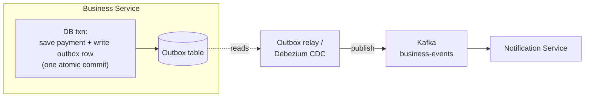
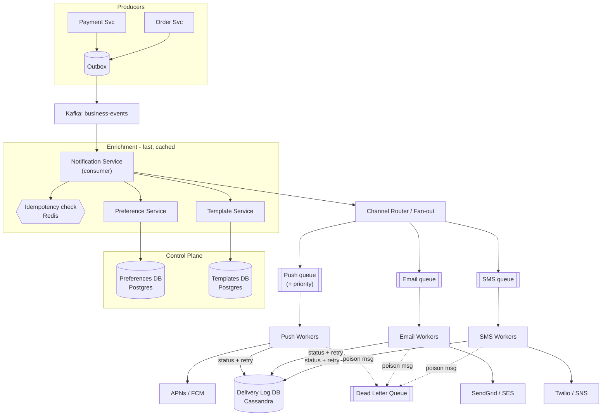
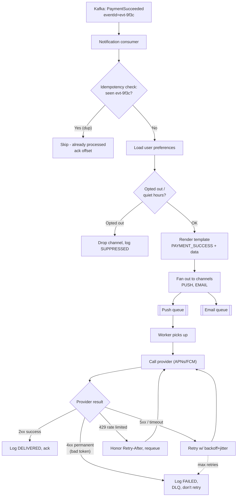
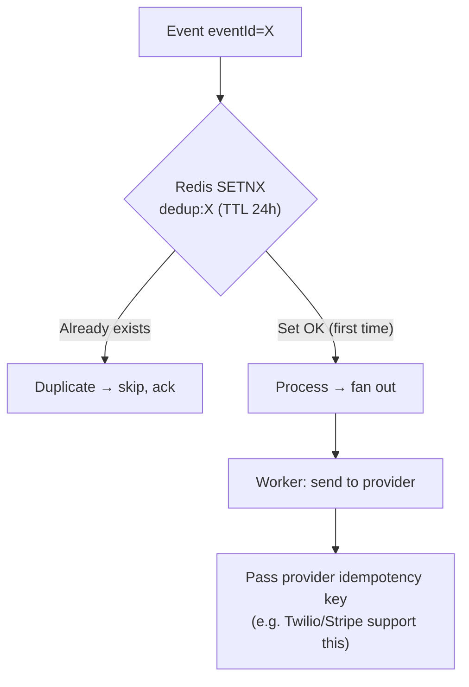
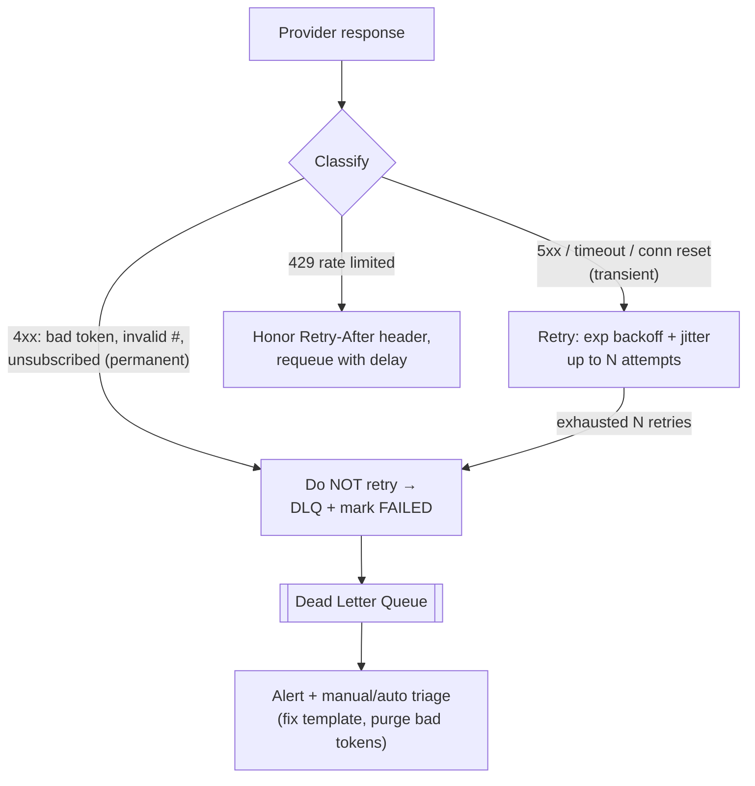
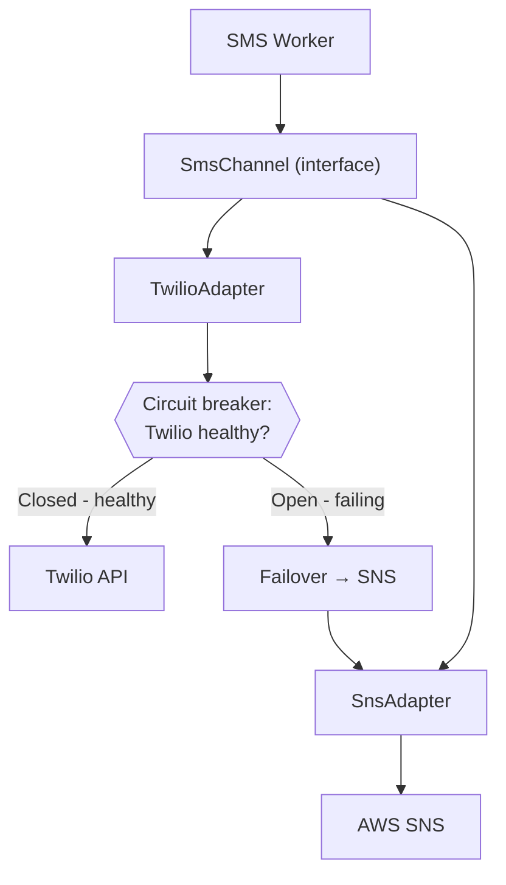
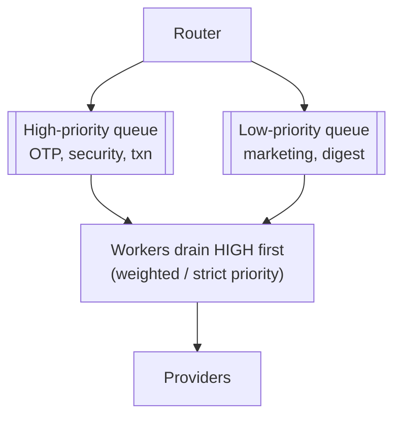
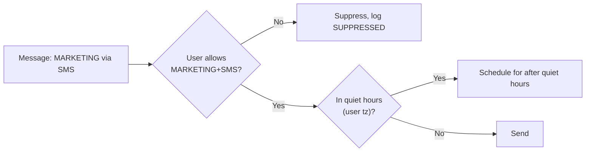
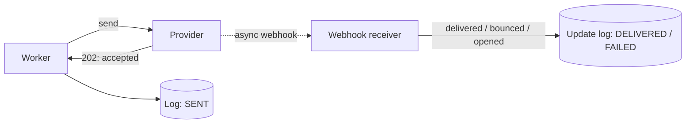

# Notification System — Staff/SSE System Design

**Difficulty:** Intermediate → Advanced
**Interview importance:** ⭐ **Critical** (a fan-out + reliability classic; secretly a masterclass in at-least-once delivery, idempotency, and failure handling)
**References:** Alex Xu — *System Design Interview Vol 1, Ch. 10*; ByteByteGo — *Design a Notification System*; DDIA Ch. 8–11 (delivery guarantees, idempotence, dataflow)

---

## 0. Why This Design Matters

A notification system looks like "call SendGrid in a loop." It is not. It sits **downstream of every important business event** (payment succeeded, order shipped, someone messaged you), it must **never slow down or break the transaction that triggered it**, it fans **one event into many messages across many channels**, and every one of those channels is a **flaky third party you don't control**. That combination is why interviewers love it: a weak candidate writes a synchronous `for channel in channels: provider.send()`; a strong candidate talks about the outbox pattern, per-channel queues, at-least-once delivery, idempotent dedup, retries with backoff, DLQs, and provider failover.

> The one-line thesis: **a notification system turns one durable event into many best-effort deliveries — and the entire design is about staying decoupled from unreliable providers while never sending a duplicate that matters or dropping one that matters.**

---

## 1. Problem Overview — Explain It Simply

Build a service that answers one job, millions of times a day, **without ever blocking the thing that triggered it**:

> **"Something happened. Tell the right user, on the channels they allow, exactly once, even though the email/SMS/push providers are slow and sometimes down."**

It delivers across:

- **Push** — iOS via **APNs**, Android via **FCM**, web push
- **SMS** — Twilio, Nexmo/Vonage, AWS SNS
- **Email** — SendGrid, Mailgun, SES
- **In-app** — a feed/inbox the app reads

Triggered by business events:

```text
PaymentSucceeded    → "Your payment of $42 went through"  (push + email)
OrderShipped        → "Your order is on the way"          (push + SMS)
LoginFromNewDevice  → OTP / security alert                (SMS, high priority)
WeeklyDigest        → marketing summary                   (email, low priority)
```

It must stay correct while the **business services keep running fast** and the **providers keep misbehaving** (timeouts, 429s, outages, at-least-once semantics).

### Real-world analogy — the corporate mailroom

Think of a big company's **mailroom**. A department (business service) drops a memo in the **outbox** and immediately goes back to work — it does **not** wait by the mailbox. The mailroom (notification service) picks it up, checks the recipient's **preferences** ("no marketing mail, courier only for urgent"), fills in a **template** ("Dear {name}…"), and hands it to a **carrier** — post, courier, or email. If a carrier is on strike, the mailroom **retries later** or switches to a **backup carrier**, and keeps a **logbook** so it never sends the same memo twice and can tell you exactly where each one is. Everything else — Kafka, DLQs, idempotency keys — is just "how does one very large, very reliable mailroom work."

---

## 2. Functional Requirements

**Core**
- Accept a **notification request** (or consume a **business event**) and deliver it.
- **Multi-channel**: push, SMS, email, in-app — one event may fan out to several.
- **User preferences**: per-user, per-category opt-in/opt-out; quiet hours; channel choice.
- **Templates**: a `PAYMENT_SUCCESS` template rendered with per-message data, localized.
- **Provider abstraction + failover**: swap/fail over providers without touching business code.
- **Retries** on transient failure with backoff; **DLQ** for poison messages.
- **Deduplication / idempotency**: the same event twice must not double-send.
- **Delivery tracking**: queued → sent → delivered → opened/failed, queryable.
- **Rate limiting**: don't spam a user; respect provider quotas.

**Optional (name them, then defer)**
- **Priority tiers** (OTP beats marketing), **scheduling / send-at**, batching/digest, A/B templates, quiet-hours + timezone, **unsubscribe** handling & compliance (CAN-SPAM/GDPR), delivery-receipt webhooks, analytics.

---

## 3. Non-Functional Requirements

| Requirement | Target | Why it dominates the design |
|---|---|---|
| **Decoupling from producers** | Business txn never waits on delivery | The #1 rule → async, outbox, queues |
| Throughput | 100M+ notifications/day, bursty | Forces queues + horizontal workers |
| **Delivery guarantee** | **At-least-once** (no drops) | Providers give at-least-once; exactly-once is a myth → dedup |
| Latency (by priority) | OTP: seconds; digest: minutes OK | Drives **priority queues** |
| Availability | 99.9%+ for the ingest path | If ingest is down, events are lost — protect it |
| Provider resilience | Survive a provider outage | Retries, failover, circuit breakers, DLQ |
| Ordering | Usually **not required** per user | Lets us parallelize hard; call it out |
| Correctness | No duplicate *critical* sends; no lost sends | Idempotency + durable log |

> **Say this out loud in an interview:** *"The single hardest constraint is that delivery is only **at-least-once** — providers can and will deliver twice, and my system can crash after sending but before recording it. So idempotency and a durable delivery log aren't features, they're the backbone."*

---

## 4. Capacity Estimation (do the math — don't hand-wave)

Assume a large consumer app:

```text
Business events        = 100,000,000 / day
Fan-out               = 1.5 notifications per event (avg across channels)
Notifications         = 150,000,000 / day
```

**Average vs peak throughput:**

```text
Average = 150,000,000 / 86,400 s ≈ 1,736 notifications/sec
Peak    = 5× average             ≈ 8,700 notifications/sec  (flash sale, morning digest burst)
```

**Split by channel (say 60% push / 25% email / 15% SMS):**

```text
Push  ≈ 90M/day  ≈ 1,040/sec avg   (free-ish via APNs/FCM, high volume)
Email ≈ 37M/day  ≈   430/sec avg   (cheap, ~$0.0001 each → ~$3.7K/day)
SMS   ≈ 22M/day  ≈   260/sec avg   ($0.005–0.05 each → SMS is the COST driver)
```

→ **SMS dominates cost even though it's the smallest volume** — a real trade-off to name (batch, prefer push, only SMS for OTP/critical).

**Worker sizing.** If one worker delivers ~50 msgs/sec (network-bound on the provider call):

```text
8,700 peak / 50 per worker ≈ 175 workers at peak (across all channels), autoscaled
```

**Storage — the delivery log.** Each attempt row ≈ 300 B (ids, status, channel, timestamps):

```text
150M/day × 300 B ≈ 45 GB/day → ~16 TB/year
```

→ **Delivery history is a firehose** → wide-column store (Cassandra) or partition-by-time in Postgres + tiered retention (hot 30 days, cold in object storage). It is **write-heavy, append-mostly, queried by userId or notificationId** — that access pattern picks the DB.

**What the numbers tell us:**
- Async + queues are mandatory (bursts of 5× can't hit providers synchronously).
- Workers are **network-bound** on the provider call → scale by adding workers, not CPU.
- **SMS cost**, not volume, is a first-class constraint.
- The delivery log is a high-volume, append-heavy, key-lookup store — not a relational join workload.

---

## 5. API Design

**Send a notification** (the ingest path — for services that call us directly):
```http
POST /v1/notifications
```
```json
{
  "userId": "U123",
  "template": "PAYMENT_SUCCESS",
  "channels": ["PUSH", "EMAIL"],
  "priority": "TRANSACTIONAL",
  "data": { "amount": "42.00", "currency": "USD", "paymentId": "P1" },
  "idempotencyKey": "evt-9f3c-payment-P1"
}
```
```json
{
  "notificationId": "N-abc123",
  "status": "ACCEPTED",
  "acceptedChannels": ["PUSH", "EMAIL"]
}
```
> `202 Accepted`, **not** `200`. We accepted responsibility; delivery is asynchronous. The `idempotencyKey` is what makes a retried publish safe.

**Query delivery status:**
```http
GET /v1/notifications/N-abc123
```
```json
{
  "notificationId": "N-abc123",
  "channels": [
    { "channel": "PUSH",  "status": "DELIVERED", "provider": "FCM",      "attempts": 1 },
    { "channel": "EMAIL", "status": "SENT",      "provider": "SendGrid", "attempts": 2 }
  ]
}
```

**Manage preferences** (control path):
```http
PUT /v1/users/U123/preferences
```
```json
{
  "TRANSACTIONAL": { "PUSH": true, "EMAIL": true,  "SMS": true },
  "MARKETING":     { "PUSH": false, "EMAIL": true, "SMS": false },
  "quietHours":    { "tz": "America/New_York", "from": "22:00", "to": "08:00" }
}
```

**Event-driven ingest (the preferred path).** Most triggers arrive as **Kafka events**, not HTTP:
```text
topic: business-events
{ "type": "PaymentSucceeded", "userId": "U123", "paymentId": "P1", "eventId": "evt-9f3c" }
```
The `eventId` doubles as the idempotency key.

---

## 6. Where Do Notifications Come From? (Ingest & the Outbox)

The first design decision: **how does a business event reach us without coupling us to the business transaction?**



**The naive bug:** the business service does `savePayment()` then `httpPost(notificationService)`. If the process crashes **between** the two, the payment is saved but the notification is lost — or the reverse (notify but payment rolled back). Two systems, no shared transaction → **dual-write problem**.

**The fix — Transactional Outbox.** In the **same DB transaction** that saves the payment, insert a row into an `outbox` table. A separate **relay** (a poller, or **Debezium** reading the DB change log) publishes those rows to Kafka. Now "payment saved" and "event will be published" are **one atomic commit** — if the txn commits, the event is guaranteed to eventually publish; if it rolls back, no event.

> **Say this out loud:** *"I use the transactional outbox pattern so the business write and the 'notify' intent commit atomically. This is how I avoid the dual-write problem — the #1 source of lost or phantom notifications."*

---

## 7. High-Level Architecture



**Read it as three stages:**
1. **Ingest** — durable event lands in Kafka (survives everything downstream being down).
2. **Enrich & fan out** — Notification Service dedups, loads preferences + template, expands one event into per-channel messages, drops each into its **own channel queue**.
3. **Deliver** — per-channel workers call providers, retry transient failures, log every attempt, and shove poison messages to a **DLQ**.

**Why the channel queues are separate:** SMS, email, and push have wildly different throughput ceilings, cost, and failure profiles. If a slow SMS provider shared a queue with push, **head-of-line blocking** would stall push delivery too. Separate queues = independent scaling, independent backpressure, independent failure blast radius.

---

## 8. Deep-Dive Flow — Walk Me Through One Event

When the interviewer says *"trace a PaymentSucceeded end to end,"* draw this:



**Key sequencing decisions baked in:**
- **Dedup FIRST**, before any work — cheap Redis lookup gates everything.
- **Preference + quiet-hours check before send** — never spend a provider call on a message you'll suppress.
- **Distinguish failure classes**: transient (retry), rate-limited (honor `Retry-After`), permanent (DLQ, never retry — retrying a bad phone number forever is a bug).
- **Ack the Kafka offset only after** the message is safely enqueued to channel queues (or after delivery, depending on your consistency posture — see §11).

---

## 9. Datastore & Queue Selection — and Why

| Concern | Choice | Why this, not the alternative |
|---|---|---|
| **Event ingest / buffer** | **Kafka** | Durable, replayable, decouples producers from consumers, partitioned for scale. A plain HTTP call couples the txn to delivery; RabbitMQ works but Kafka's retention + replay is gold for reprocessing. |
| **Per-channel work queues** | **Kafka topics** or **SQS/RabbitMQ** | Need independent backpressure per channel. SQS gives easy visibility-timeout redelivery + DLQ out of the box; Kafka gives replay + ordering. Either is defensible — say why. |
| **Preferences & templates** | **PostgreSQL** | Small, relational, read-heavy, needs consistency (opt-out must take effect). Cache hot rows in Redis. |
| **Idempotency / dedup keys** | **Redis** (with TTL) | Need a fast "have I seen this eventId?" check on the hot path. TTL bounds memory; back it with the durable log for the long tail. |
| **Delivery log / history** | **Cassandra** (or partitioned Postgres) | 45 GB/day, append-heavy, queried by `userId` or `notificationId` — not joins. Wide-column scales writes horizontally; time-bucketed partitions + TTL for retention. |
| **Rate-limit counters** | **Redis** | Per-user "max N/day" and per-provider quota — atomic counters with TTL (see the rate-limiter design). |

> **Never put the delivery log write on the synchronous path to the provider in a way that blocks the send** — log the attempt async or after, and treat the log as the source of truth for reconciliation, not as a lock.

---

## 10. Idempotency & Deduplication — the Heart of the Design

Delivery is **at-least-once** from two independent sources of duplication:

1. **Kafka redelivery** — a consumer crashes after processing but before committing its offset → the event is redelivered.
2. **Provider at-least-once** — you send, the network drops the ack, you retry → the provider may have already delivered.

You **cannot** get true exactly-once end-to-end (the provider is outside your transaction boundary). So the goal is: **at-least-once delivery + idempotent processing = "effectively once" for the messages that matter.**

**Two layers of dedup:**



**Layer 1 — consumer-side dedup.** Before processing, `SETNX dedup:{eventId}` in Redis with a TTL. If the key already exists, it's a duplicate → skip and ack. The TTL bounds memory; for the long tail (duplicate arriving after TTL), the durable **delivery log** has a **unique constraint on `(notificationId, channel)`** so a second insert fails and you skip the send.

**Layer 2 — provider idempotency keys.** Where the provider supports it (Twilio, Stripe, SendGrid), pass a stable idempotency key on the send request so *the provider* dedupes even if you retry. This closes the "sent but ack lost" gap.

> **The staff-level nuance:** *"For a marketing email, a rare duplicate is harmless — I optimize for never dropping. For an OTP or a payment charge notification, a duplicate is costly, so I add the provider idempotency key and a unique constraint in the log. I decide the dedup strength per message class."*

---

## 11. The Crash-After-Send Problem (at-least-once vs the log)

The classic distributed-systems trap:

```text
worker.send(provider)   ✅ provider delivered the SMS
    ...CRASH before...
log.record(DELIVERED)   ❌ never happened
```

On restart, the message is redelivered → we **send again** → duplicate SMS.

**There is no way to make "send" and "record" one atomic transaction** — the provider is a separate system. Options, honest about the trade-off:

| Strategy | Guarantee | Cost |
|---|---|---|
| **Record intent BEFORE send, then update after** | At-least-once; on crash you may resend, but the pre-recorded row + provider idempotency key catch it | One extra write; needs provider idempotency to be truly safe |
| **Send then record** | Simplest; a crash → duplicate | Fine for non-critical (marketing) |
| **Provider idempotency key** | Provider dedupes the retry | Only where provider supports it |

The mature answer combines them: **write a `SENDING` row first (with the idempotency key), send with that key, then update to `SENT`.** A crashed worker's redelivery finds the `SENDING` row and either the provider dedupes it or you can reconcile. This is the notification-system version of "commit intent, then act, then confirm."

---

## 12. Retries, Backoff & the DLQ

Providers fail in three distinct ways — **treat them differently** (the most common candidate mistake is retrying everything):



- **Exponential backoff + jitter**: `1s, 2s, 4s, 8s…` with random jitter so a provider recovering from an outage doesn't get a **synchronized retry thundering herd**.
- **Retry cap**: after N attempts, stop → DLQ. Infinite retries just pile up and hide the problem.
- **DLQ is not a graveyard**: it's a queue you **monitor and drain**. A spike in the DLQ is your early-warning that a provider is down or a template is broken. Messages there can be replayed after a fix.
- **Poison messages** (a malformed payload that crashes the worker every time) go straight to DLQ so they don't block the queue — otherwise one bad message stalls the channel.

---

## 13. Provider Abstraction & Failover

You integrate 2–3 providers **per channel** so no single vendor outage takes down a channel. The **Adapter pattern** hides each provider's quirks behind one interface; a **Factory/Strategy** picks which provider to use.



**Failover mechanics:**
- A **circuit breaker** per provider: after X consecutive failures, "open" the breaker and stop hammering the dead provider (fail fast), routing to the backup. Periodically half-open to test recovery.
- **Health-based routing / weighted split**: send 90% to primary, 10% to secondary to keep it warm and to shed load.
- **Idempotency across failover is critical**: if provider A actually delivered but its ack was lost, and you fail over to B, you double-send. Mitigate with the idempotency key + accepting rare duplicates for non-critical channels.

> **Say this out loud:** *"The provider layer is an Adapter behind a circuit breaker. On a provider outage I fail over to a secondary — but failover reintroduces the duplicate risk, so critical messages carry an idempotency key and I accept that for marketing a rare double-send is fine."*

---

## 14. Priority Queues — OTP Beats the Weekly Digest

Not all notifications are equal. A login OTP must arrive in **seconds**; a marketing digest can wait **minutes**. If they share one FIFO queue, a 10M-message digest blast delays every OTP behind it — a real, dangerous **head-of-line blocking** failure.



Implementations to name:
- **Separate queues per priority** + workers that **drain high-priority first** (strict) or with a **weighted** ratio (e.g. 4:1) so low-priority doesn't starve entirely.
- **Rate-limit the marketing blast** at the producer so it can't monopolize workers.
- Give critical channels **dedicated worker pools** so a marketing surge can't consume all capacity.

---

## 15. User Preferences, Rate Limiting & Quiet Hours

Two different jobs, both gates before send:

**Preferences (per-user opt-in/out, checked on every message):**


- Preferences live in **Postgres**, cached in **Redis** (opt-out must propagate fast — bound the cache TTL or invalidate on write, because sending after opt-out is a compliance problem).
- **Quiet hours** need the user's **timezone** — "10pm" is local, not server time.
- **Transactional messages usually bypass marketing opt-out** (you still get "your payment failed" even if you muted marketing) — but never bypass a hard legal unsubscribe.

**Rate limiting (anti-spam + provider quota):**
- **Per-user**: "at most 5 marketing messages/day" — a Redis counter with a daily TTL (this is exactly the rate-limiter design, applied here).
- **Per-provider**: respect Twilio/SendGrid's account throughput limits so *you* don't get throttled — a token bucket in front of each provider adapter.

---

## 16. Delivery Tracking & Reconciliation

"Sent" ≠ "Delivered" ≠ "Opened." The provider tells you the truth **asynchronously via webhooks**:



- **Status lifecycle**: `QUEUED → SENDING → SENT → DELIVERED → OPENED` (or `FAILED / BOUNCED / SUPPRESSED`).
- **Webhooks are also at-least-once and out-of-order** → dedupe them and never move a status backwards.
- **Reconciliation job**: sweep for messages stuck in `SENDING`/`SENT` past a threshold with no terminal webhook → re-query the provider's status API or retry. This is how you catch the "crashed after send" and "lost webhook" gaps.
- **Bounce handling**: hard bounces (invalid address) → mark the token/address dead so you stop wasting sends and protect sender reputation.

---

## 17. Scaling & Sharding

- **Kafka partitioning**: partition `business-events` by `userId` if you ever need per-user ordering (usually you don't — notifications are independent, so partition by `eventId`/hash for even spread and max parallelism). **Call out that you're giving up global ordering on purpose** — it's the right trade for throughput.
- **Workers are stateless** → autoscale by **queue depth** (lag). Push workers, email workers, SMS workers scale independently.
- **Hot partition / celebrity fan-out**: a broadcast ("all 50M users, service outage alert") is the notification version of the Twitter celebrity problem — one event fanning to millions. Handle it by **expanding the fan-out asynchronously in batches** (chunk the user list into many queue messages) rather than one giant synchronous loop, and rate-limit the expansion so it doesn't starve real-time OTPs.
- **Backpressure**: when a provider slows, its channel queue grows. Autoscaling workers helps, but the queue itself is the shock absorber — the business services keep running regardless. That's the whole point of decoupling.

---

## 18. Low-Level Design (clean OO)

```java
interface NotificationChannel {              // Strategy: one per channel
    DeliveryResult send(RenderedMessage msg);
}
// PushChannel | SmsChannel | EmailChannel | InAppChannel

interface ProviderAdapter {                  // Adapter: hide vendor quirks
    ProviderResult deliver(RenderedMessage msg, IdempotencyKey key);
}
// TwilioAdapter | SnsAdapter | SendGridAdapter | FcmAdapter | ApnsAdapter

interface ProviderSelector {                 // Factory + circuit breaker
    ProviderAdapter pick(Channel channel);   // primary, or failover if breaker open
}

class NotificationService {                  // Orchestrator
    IdempotencyStore idem;                    // Redis SETNX
    PreferenceService prefs;
    TemplateService templates;
    ChannelRouter router;                     // fan-out
    DeliveryLog log;                          // Cassandra
}
```

**Patterns worth naming:**
- **Strategy** — swap channels/algorithms via config (OCP).
- **Adapter** — each provider's SDK behind one interface (swap Twilio↔SNS without touching workers).
- **Factory** — provider selection + failover.
- **Transactional Outbox** — decouple producers reliably.
- **Circuit Breaker** — isolate a failing provider.
- **DIP / SRP** — service depends on `NotificationChannel`/`ProviderAdapter` abstractions; each of dedup, prefs, templates, delivery is its own responsibility.

---

## 19. Failure Scenarios

| Failure | Handling |
|---|---|
| Business service crashes mid-transaction | Transactional outbox → event only published if txn commits (no dual-write) |
| Kafka down | Outbox retains rows; relay retries; producers unaffected (still fast) |
| Notification Service crashes | Kafka redelivers uncommitted offsets; idempotency dedup prevents double-processing |
| Provider timeout / 5xx | Retry with exp backoff + jitter, capped, then DLQ |
| Provider 429 | Honor `Retry-After`, requeue with delay; per-provider rate limiter |
| Provider fully down | Circuit breaker opens → fail over to secondary provider |
| Bad recipient (4xx) | Permanent failure → DLQ, mark FAILED, don't retry; purge dead token |
| Crash after send, before log | Pre-record SENDING row + provider idempotency key; reconciliation sweep |
| Duplicate event (Kafka redelivery) | Redis SETNX dedup + unique constraint on delivery log |
| Poison message | Straight to DLQ so it can't block the channel queue |
| Worker overwhelmed (burst) | Queue absorbs; autoscale workers on lag; priority queues protect OTPs |
| Webhook lost / out of order | Reconciliation job re-queries provider; never move status backward |
| Broadcast to 50M users | Async batched fan-out, rate-limited so it doesn't starve real-time traffic |

---

## 20. Latency Budget (transactional message)

```text
Target: OTP delivered in a few seconds
  Producer commits outbox ......... ~5 ms   (no wait on delivery)
  Outbox relay → Kafka ............ ~50 ms
  Consumer dedup + prefs + render . ~10 ms  (Redis + cached Postgres)
  Enqueue to channel queue ........ ~5 ms
  Worker pickup ................... ~10–100 ms (queue depth)
  Provider call (Twilio/APNs) ..... ~200–800 ms  ← dominated by the provider
  Provider → carrier → device ..... seconds (out of our hands)
```
→ **The provider call dominates our controllable latency.** Corollary: keep dedup/prefs/template on Redis + cached rows (never a cold DB query on the hot path), and use **priority queues** so an OTP isn't stuck behind a digest — that's the one piece of the delay we fully control.

---

## 21. Trade-Offs to Say Out Loud

| Axis | Option A | Option B | Choose by |
|---|---|---|---|
| Ingest coupling | Sync HTTP call (simple) | Outbox + Kafka (decoupled, durable) | Do we tolerate lost/phantom notifications? (almost never) |
| Delivery guarantee | At-least-once + dedup (real) | "Exactly-once" (a myth end-to-end) | Accept at-least-once; add idempotency for critical msgs |
| Dedup strength | Redis TTL only (cheap) | + provider idem key + unique constraint | Cost of a duplicate (OTP vs marketing) |
| Queues | One shared queue (simple) | Per-channel + per-priority (isolated) | Avoiding head-of-line blocking at scale |
| Delivery log DB | Postgres (transactions) | Cassandra (write-scale) | Volume + query-by-key vs joins |
| Ordering | Per-user ordered (partition by user) | Unordered (max parallel) | Do notifications actually need order? (usually no) |
| Retry failure | Fail fast to DLQ | Retry aggressively | Transient vs permanent classification |
| Provider strategy | Single provider (simple) | Multi-provider + circuit breaker | Tolerance for a vendor outage |

---

## 22. Interview Q&A

**Beginner**

**Q: Why is this system asynchronous instead of a direct call?**
Because a business transaction (payment) must never be slowed down or failed by a flaky third-party provider. We publish an event and return immediately (202 Accepted); the notification pipeline delivers on its own time. This decoupling also lets us absorb 5× bursts in a queue instead of overwhelming providers.

**Q: How do you support multiple channels?**
Fan-out. One event expands into per-channel messages, each dropped into its own channel queue (push/SMS/email), with a Strategy per channel and an Adapter per provider. Separate queues so a slow SMS provider can't block push.

**Q: What if the user opted out?**
Check preferences before sending. Preferences live in Postgres (cached in Redis for the hot path); if the user opted out of that category+channel, we suppress and log it. Transactional messages may bypass marketing opt-out but never a hard unsubscribe.

**Intermediate**

**Q: How do you avoid losing an event if the business service crashes mid-transaction?**
Transactional outbox. In the same DB transaction that saves the payment, I insert an outbox row; a relay (or Debezium CDC) publishes it to Kafka. The business write and the "notify" intent commit atomically — no dual-write, so I never save the payment without eventually publishing the event, or vice versa.

**Q: Provider returns a 429 vs a 500 vs a 400 — what do you do?**
Classify. 500/timeout = transient → retry with exponential backoff + jitter, capped. 429 = honor the `Retry-After` header and requeue with delay, plus a per-provider rate limiter so I don't trip it again. 400 (bad token/number) = permanent → DLQ, mark FAILED, never retry. Retrying a permanent error forever is a classic bug.

**Q: How do you prevent duplicate sends?**
Two layers. Consumer-side: `SETNX dedup:{eventId}` in Redis with a TTL, plus a unique constraint on `(notificationId, channel)` in the durable log for the long tail. Provider-side: pass an idempotency key where the provider supports it so it dedupes my retries. Delivery is at-least-once, so idempotent processing is what makes it effectively-once for messages that matter.

**Advanced / Staff**

**Q: The worker sends the SMS, then crashes before recording it. On redelivery you send again. How do you handle that?**
There's no atomic "send + record" because the provider is outside my transaction. I record a `SENDING` row with an idempotency key *before* the send, send with that key, then update to `SENT`. On redelivery, either the provider dedupes via the key or a reconciliation sweep finds the `SENDING` row and re-queries provider status. For marketing I accept the rare duplicate; for OTP/payments I pay for the idempotency key.

**Q: A marketing blast of 10M messages is delaying OTPs. Why, and how do you fix it?**
Head-of-line blocking — the blast is ahead of OTPs in a shared queue. Fix: separate priority queues (high = OTP/security/transactional, low = marketing), workers drain high-priority first (or a weighted ratio to avoid starvation), dedicated worker pools for critical channels, and rate-limit the blast at the producer so it can't monopolize capacity.

**Q: A provider (Twilio) goes fully down. Walk me through failover and its risk.**
A circuit breaker per provider opens after consecutive failures and stops hammering the dead vendor, routing to a secondary (SNS) via the Adapter interface. Periodically half-open to test recovery. The risk: if Twilio actually delivered but its ack was lost and I fail over, I double-send. So critical messages carry an idempotency key, and for non-critical I explicitly accept a rare duplicate — I'd never silently pretend failover is free.

**Q: Why can't you guarantee exactly-once delivery?**
Because the provider and the recipient's device are outside any transaction I control — I can't atomically "send to Twilio" and "record it." The honest guarantee is at-least-once delivery plus idempotent processing, which is effectively-once for the messages where I add dedup keys and unique constraints. Anyone promising true exactly-once across a third party is hand-waving.

---

## 23. 30-Second Interview Answer

> "Business services publish events via a **transactional outbox** into **Kafka**, so a notification is never lost or phantom relative to the business transaction, and the transaction never waits on delivery. A **Notification Service** consumes each event, **dedups** it (Redis SETNX on the eventId), checks **user preferences** and **quiet hours**, renders a **template**, and **fans out** into **per-channel queues** — push, SMS, email — each with its own workers so a slow provider can't block the others. Workers call providers behind an **Adapter + circuit breaker** so I can **fail over** on an outage. Failures are classified: transient → **retry with backoff + jitter**, 429 → honor `Retry-After`, permanent → **DLQ**. Delivery is only **at-least-once**, so I make it effectively-once with **idempotency keys** and a unique constraint in a **Cassandra delivery log**, and reconcile stuck messages. **Priority queues** keep OTPs ahead of marketing. The whole design is about staying decoupled from unreliable providers while never dropping a message that matters or duplicating one that does."

---

## 24. Mental Model

```text
BUSINESS EVENT
   ↓ transactional outbox (atomic with the business write)
KAFKA (durable, replayable)
   ↓ Notification Service
   ├── DEDUP        → Redis SETNX (eventId) + log unique constraint
   ├── PREFERENCES  → opt-out / quiet hours (Postgres + Redis)
   ├── TEMPLATE     → render with data, localized
   └── FAN-OUT      → one event → many channel messages
        ↓
PER-CHANNEL QUEUES (+ priority)  → push | sms | email
        ↓ stateless workers (autoscale on lag)
PROVIDER ADAPTER + CIRCUIT BREAKER → failover on outage
        ↓
   ├── success   → log DELIVERED
   ├── transient → retry (backoff + jitter)
   ├── 429       → honor Retry-After
   └── permanent → DLQ

GUARANTEE   → at-least-once + idempotency = effectively-once
LOG         → Cassandra (write-heavy) + reconciliation sweep
COST DRIVER → SMS
NEVER       → block the business txn; retry permanent errors; trust "exactly-once"
```

---

## 25. How This Connects to Other Topics

- **Rate limiter (05)** — per-user anti-spam and per-provider quota are literally the token-bucket design applied here; the 429/`Retry-After` handshake is the same protocol from the other side.
- **Message queues & Kafka** — this is the canonical fan-out + at-least-once consumer; partitions for parallelism, DLQ for poison messages, replay for reprocessing.
- **Idempotency & exactly-once (DDIA Ch. 11)** — the crash-after-send problem is the textbook "effectively-once via idempotent operations, because true exactly-once across systems is impossible."
- **Transactional outbox / CDC** — the dual-write problem and Debezium show up in any "update DB + publish event" design (order systems, search indexing).
- **Circuit breakers & bulkheads** — provider isolation is the resilience pattern from any microservices design; per-channel queues are bulkheads.
- **Hot keys / celebrity fan-out** — a broadcast to all users is the same skew problem as Twitter timeline fan-out; batch and rate-limit the expansion.
- **Unreliable clocks (DDIA Ch. 8)** — quiet-hours + `send-at` scheduling means reasoning about user timezones, not server wall-clock.
