# Search / Autocomplete — Staff/SSE System Design

**Difficulty:** Intermediate → Advanced
**Interview importance:** ⭐ **Critical** (a top-5 warm-up; deceptively deep because it's read-dominant, latency-brutal, and precomputation-heavy)
**References:** Alex Xu, *System Design Interview* Vol 1 — Ch. 13 *Design a Search Autocomplete System*; ByteByteGo — *Design a Search Autocomplete*; DDIA Ch. 3 (storage & indexes), Ch. 6 (partitioning)

---

## 0. Why This Design Matters

Autocomplete looks like "prefix match in a database." It is not. It fires **on every keystroke**, so one user typing `iphone` can generate 6 requests in under a second. It must return in **under ~100 ms end-to-end**, including network, or the suggestion box lags *behind the user's typing* and feels broken. And the "right" answer isn't just *any* string starting with the prefix — it's the **top few most-popular** completions, ranked, and that ranking changes as the world's search traffic changes.

That combination is why it separates weak from strong candidates. A weak candidate reaches for `SELECT ... WHERE term LIKE 'iph%'` and ships something that melts at scale. A strong candidate talks about a **trie with the top-k pre-computed and cached at every node**, a **read/write split** where the trie is rebuilt offline from aggregated logs, **sharding by prefix with a shard-map**, and **debounce + edge caching** to survive the keystroke firehose.

> The one-line thesis: **autocomplete is a read-optimized, precomputed, ranked prefix lookup — you pay expensive work *once, offline* so that every keystroke is O(1) at read time.**

---

## 1. Problem Overview — Explain It Simply

Build a service that answers one question, on every keystroke, in tens of milliseconds:

> **"Given what the user has typed so far (a prefix), what are the top 5–10 things they most likely want to type next?"**

The user types `di`, we return:

```text
di →  disney+
      directions
      dictionary
      dick's sporting goods
      disney plus
```

Notice what this is *not*:
- It is **not** returning *all* strings that start with `di` (there are millions).
- It is **not** a spellchecker (though we tolerate typos at a high level).
- It is **not** full-text search over documents — that's the *next* step, after the user picks a suggestion and hits enter.

Autocomplete = **prefix → ranked top-k of popular full queries**.

### Real-world analogy — the phone book with sticky notes

Imagine a giant phone book, but before anyone uses it, an assistant walks through it once and, on the tab for every prefix ("Sm", "Smi", "Smit"), writes a **sticky note listing the 10 most-called numbers** under that prefix. Now when you flip to "Smi", you don't scan thousands of Smiths — you just read the sticky note. That sticky note is the **top-k cached at a trie node**. The nightly walk-through is the **offline rebuild**. Everything else — sharding, caching, streaming updates — is "how do we keep those sticky notes fresh and split the phone book across many desks."

---

## 2. Functional Requirements

**Core**
- Given a prefix, return the **top N** (typically 5–10) suggestions, ranked.
- Rank primarily by **popularity** (query frequency), with **recency** as a factor.
- Match on the **prefix** of the query (`di` → `disney+`), not arbitrary substrings.
- Suggestions update over time as query popularity shifts (fresh, not frozen).
- Return fast enough to feel instant as the user types.

**Optional (name them, then defer)**
- **Personalization** (bias toward *this* user's / this region's history).
- **Spell / typo tolerance** (`iphine` still suggests `iphone`).
- **Multi-word / mid-phrase** completion, category-aware suggestions.
- **De-duplication & safety filtering** (no offensive or adult suggestions).
- **Multi-language / Unicode** prefixes.

> **Say this out loud:** *"I'll design for prefix-match on popular queries first — that's 90% of the value — and treat personalization and typo-tolerance as layers I add on top, because they change the ranking, not the core lookup."*

---

## 3. Non-Functional Requirements

| Requirement | Target | Why it dominates the design |
|---|---|---|
| **Latency** | **p99 < 100 ms** end-to-end (server work ~10–20 ms) | Fires per keystroke; slower than typing = broken UX |
| **Read:write ratio** | **Extremely read-heavy** (reads ≫ writes) | Justifies precomputation + heavy caching |
| **Availability** | **99.9%+** | Degrade gracefully (empty box) rather than error |
| **Freshness** | **Minutes to hours is fine** | Suggestions can be slightly stale — *this is the key relaxation* |
| **Throughput** | Very high QPS (keystroke amplification) | Forces debounce, caching, sharding |
| **Scalability** | Billions of prefixes, growing vocabulary | Forces sharded trie + a shard-map |

> **The single most important NFR insight:** autocomplete **tolerates staleness**. Nobody is harmed if `disney+` becomes the #1 suggestion two hours late. That one relaxation is what *permits* the entire "precompute offline, serve O(1) online" architecture. Say this early — it drives everything.

---

## 4. Capacity Estimation (do the math — don't hand-wave)

Assume a large consumer search box:

```text
Daily searches ............ 5,000,000,000  (5B/day) — Google-ish order of magnitude
Assume 10% unique prefixes generate the interesting load
```

**QPS — and the keystroke multiplier (the trap most people miss).**

```text
Average search QPS      = 5,000,000,000 / 86,400 ≈ 57,900 QPS
Peak (×5)               ≈ 290,000 QPS of *searches*

BUT each search is preceded by keystrokes. "iphone" = 6 characters.
Even with debounce (~1 request per typed word, not per char), assume ~5× amplification:
Autocomplete request QPS ≈ 290,000 × 5 ≈ 1,450,000 QPS at peak
```

→ **The read path sees ~1.5M QPS.** That number alone kills any design that does real work per request. It *forces* precomputation + caching + sharding. Debounce and edge caching are what keep this from being 10× larger.

**Prefix cardinality → trie size.** Estimate the vocabulary of "popular" full queries and the prefixes they generate:

```text
Distinct popular queries          ≈ 100,000,000  (100M)
Avg query length                  ≈ 20 chars
Prefixes per query (bounded)      ≈ we cap prefix length at ~20 → ~20 nodes/query, shared

Trie nodes (after prefix sharing) ≈ ~a few billion nodes worst case,
  but shared prefixes collapse this dramatically.
Per node we store: children pointers + a cached top-k list (10 × ~30 bytes ≈ 300 B)
```

```text
Rough trie memory: hundreds of GB → does NOT fit one machine → MUST shard.
```

**Storage of raw logs (for the rebuild pipeline):**

```text
5B queries/day × ~50 bytes/log line ≈ 250 GB/day of query logs to aggregate.
```

**What the numbers tell us:**
- **Reads dominate by orders of magnitude** → precompute, cache aggressively, serve O(1).
- The **keystroke multiplier is the real QPS driver** → debounce + edge cache are non-negotiable.
- The **trie doesn't fit one box** → shard it, and shards are *uneven* (letters aren't uniform).
- **Writes are batched offline** (log aggregation), *not* per-query updates.

---

## 5. API Design

**Get suggestions** (the hot path — 1.5M QPS):
```http
GET /v1/autocomplete?q=di&limit=10&lang=en&region=US
```
```json
{
  "prefix": "di",
  "suggestions": [
    { "text": "disney+",    "score": 0.98 },
    { "text": "directions", "score": 0.91 },
    { "text": "dictionary", "score": 0.87 }
  ],
  "servedFrom": "edge-cache"
}
```

Design notes that signal seniority:
- **`GET`, fully cacheable** — this is deliberate. GET + a short `Cache-Control: max-age` lets CDNs/edge cache identical prefixes for many users. Autocomplete is a *perfect* CDN workload because the same popular prefixes repeat across millions of users.
- **`limit` capped server-side** (e.g. max 10) — never let a caller ask for 10,000.
- **`lang`/`region`** partition the namespace — `di` in the US ≠ `di` in Japan.

**Ingest a query event** (the write/learning path — asynchronous, off the hot path):
```http
POST /v1/events/search     (internal, fire-and-forget → log/stream)
```
```json
{ "query": "disney+", "ts": 1756900000, "region": "US", "userId": "hashed" }
```

This does **not** update the trie synchronously. It appends to a log/stream that the offline (or near-real-time) pipeline aggregates. **The read path never writes.**

---

## 6. The Core Data Structure — The Trie (Prefix Tree)

A **trie** stores strings by shared prefix: each node is a character, each path from root spells a prefix, and marked nodes are complete words.

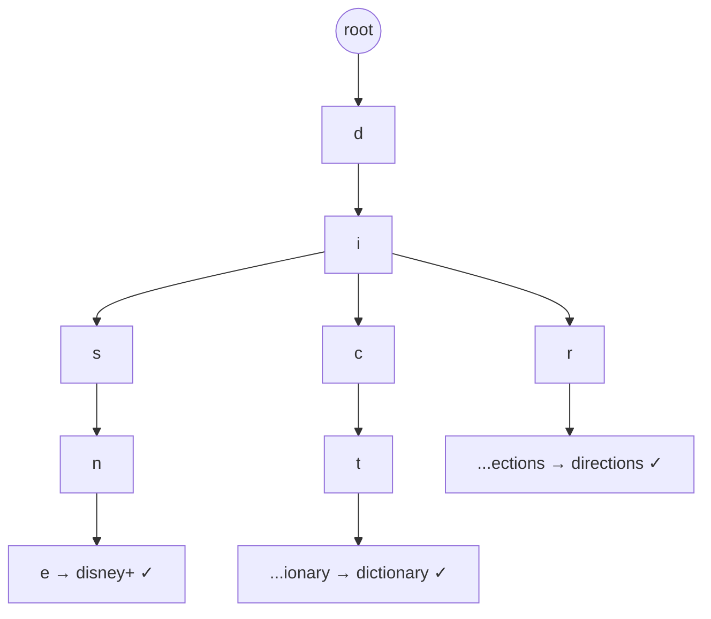

**The naive trie is too slow.** To get the top-k under prefix `di`, a naive trie must:
1. Walk from root to the `di` node (fast, O(prefix length)).
2. **Traverse the *entire subtree*** below `di` to gather every completion.
3. Sort them by score and take the top k.

At `di`, that subtree can hold **millions** of queries. Doing this per keystroke at 1.5M QPS is impossible.

### The two optimizations that make it O(1)

**1. Cache the top-k at every node.** During the offline build, precompute and store the top-k suggestions *directly on each prefix node*. Now a lookup is: walk to the node (O(length of prefix, and prefix is short), then **read the cached list**. No subtree traversal.

**2. Bound the prefix length.** Cap prefixes at, say, 20 characters. Users rarely type longer before selecting, and this bounds the walk and the number of nodes.

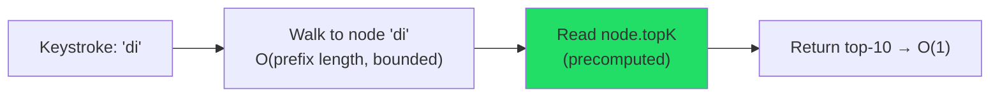

> **This is the single most important thing to say:** *"A raw trie is O(subtree size) per lookup, which is fatal. I precompute the top-k at each node during an offline build and bound prefix length, turning every read into an O(1) list fetch."*

### Trade-off: precompute at build vs walk at query time

| | Precompute top-k per node (chosen) | Walk subtree at query time |
|---|---|---|
| Read latency | **O(1)** — read cached list | O(subtree) — traverses millions |
| Freshness | Stale until next rebuild | Always current |
| Build cost | Heavy offline job | None |
| Memory | +top-k list per node | Minimal extra |
| Verdict | ✅ Autocomplete tolerates staleness → **precompute** | Only if freshness > latency, which it isn't here |

Because we established staleness is acceptable (§3), precomputation is clearly correct.

---

## 7. Ranking — What "Top-K" Actually Means

Autocomplete's value is entirely in *which* completions surface. Ranking factors:

| Signal | What it captures | How it's computed |
|---|---|---|
| **Frequency / popularity** | How often this query is searched | Count from aggregated query logs |
| **Recency** | Rising trends (a new movie, breaking news) | Time-decayed counts (weight recent higher) |
| **Personalization** | This user's / region's affinity | Blend a personal signal on top (§13) |
| **Business rules** | Promote / demote, safety filtering | Rule layer after scoring |

**Time-decay so trends surface.** A raw all-time count would keep stale evergreen queries pinned forever and never surface a query that spiked *today*. Use **exponential time decay**:

```text
score = Σ  weight(age of each occurrence)
      = Σ  e^(−λ · age)     # recent searches count more; old ones fade
```

This is why "avatar" ranks differently the week a new film releases. The decay constant `λ` is a tuning knob: aggressive decay = trend-chasing; gentle decay = stable.

> **Interview line:** *"Score = time-decayed frequency, so trending queries rise without a hard flush. Recency and popularity are the two dials; personalization and business rules are layers on top of that base score."*

---

## 8. High-Level Architecture — The Read/Write Split

The defining structural decision: **completely separate the read path (serve suggestions) from the write path (learn from queries).** This is CQRS applied to autocomplete.

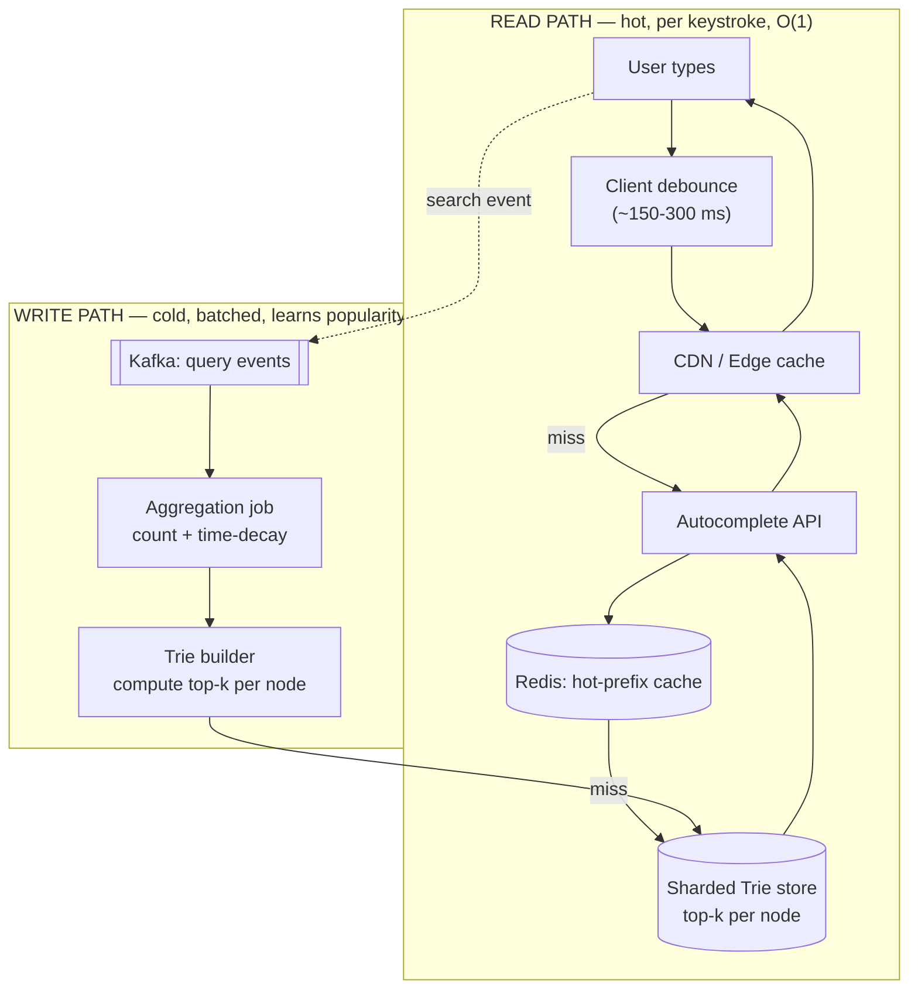

**Two paths, kept separate:**
- **Read path (hot):** debounce → edge cache → Redis → sharded trie. Every layer's job is to answer *before* touching the expensive one below it. Most requests never reach the trie store.
- **Write path (cold):** search events flow into Kafka → aggregated (counted, time-decayed) → a builder recomputes the top-k per node → the new trie is published. **No user keystroke ever writes to the trie.**

### Why this split?
Reads outnumber writes by orders of magnitude and demand <100 ms; writes (learning popularity) can be **batched and delayed by minutes to hours**. Coupling them would force the read path to pay for write consistency it doesn't need. Splitting lets each side optimize independently — the exact reason CQRS exists.

---

## 9. Storage / Index Selection — and Why

The trie's top-k lists must live somewhere queryable at 1.5M QPS. Options:

| Store | Fit for autocomplete | Why / why not |
|---|---|---|
| **In-memory trie in the service** | ✅ Fastest reads | Nanosecond lookups; but big → must shard; rebuild = redeploy/swap |
| **Redis** (per-prefix → top-k list) | ✅ Strong choice | In-memory, O(1) key lookup `prefix → [suggestions]`, TTL, easy to shard; the practical serving layer |
| **Elasticsearch/OpenSearch** *completion suggester* / edge-ngrams | ✅ If you already run ES | Built-in FST-based suggester; convenient, but heavier and less O(1)-predictable than a purpose-built trie |
| **Cassandra / KV store** | ⚠️ For durable trie/top-k tables | Great for the durable, sharded top-k table that the builder writes and services load |
| **PostgreSQL `LIKE 'iph%'`** | ❌ Not at this scale | Prefix `LIKE` can use a B-tree index, but no ranking, no top-k, no typo tolerance, and it collapses under keystroke QPS |
| **Kafka** | ✅ (write path only) | Durable event log of searches; replayable to rebuild the trie |

**The pragmatic serving choice:** treat the trie as a **precomputed `prefix → top-k` map** and serve it from **Redis** (hot layer) backed by a **durable sharded KV store** (e.g. Cassandra) that the builder writes to. Or keep the trie **in-memory inside the service** and hot-swap a freshly built copy — fastest, at the cost of a heavier deploy/rebuild cycle.

> **Why not just Postgres `LIKE`?** It can *match* a prefix, but it can't cheaply return the *ranked top-k*, it has no typo tolerance, and 1.5M QPS of `LIKE` scans will melt it. The interview trap is proposing it and not knowing why it fails.

### Deep-dive: complete request flow

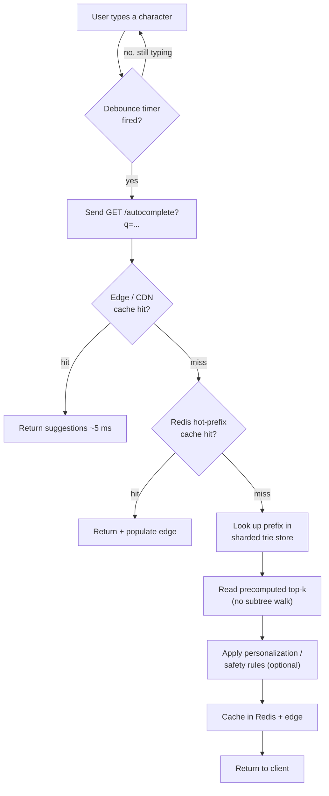

---

## 10. Sharding the Trie — and Why "By First Letter" Is a Trap

The trie doesn't fit one machine (§4), so partition it. The obvious idea — **shard by first letter** (a–z → 26 shards) — is **badly unbalanced**: prefixes starting with `s`, `c`, `a` are enormous; `x`, `z`, `q` are tiny. One shard melts while another idles.

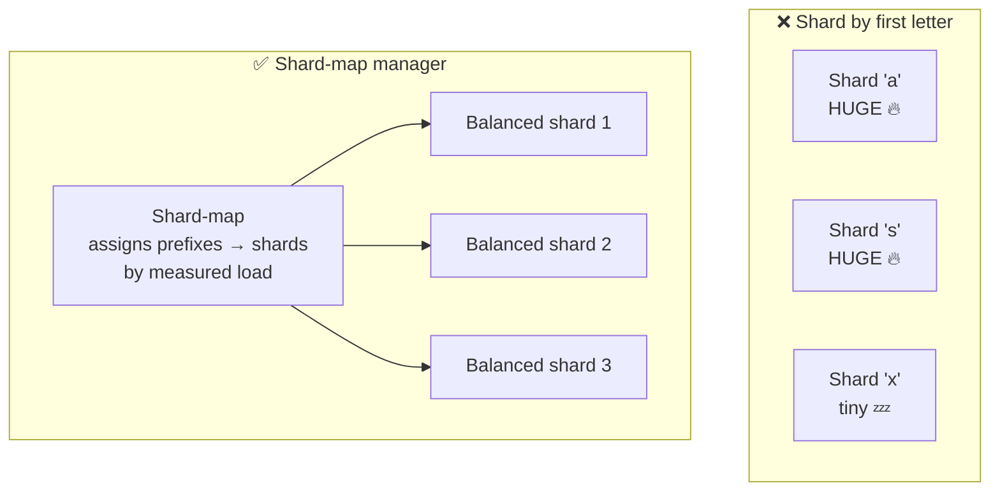

**The fix: a shard-map manager.** A component measures historical load per prefix range and assigns prefix ranges to shards so each shard carries roughly equal traffic — `sa`–`sm` on one shard, `sn`–`sz` on another, tiny letters grouped together. The map is stored (e.g. in ZooKeeper/etcd or a config service) and consulted by the API to route a prefix to the right shard.

**Replicas per shard** give read throughput and availability — since the trie is read-only between rebuilds, replicas are trivial (no write coordination). This is a place where the read/write split pays off: replicating a **read-only** structure is easy.

---

## 11. How Counts Update From a Stream (the write path in depth)

Popularity changes constantly. Two update strategies, and the mature answer uses both:

### Strategy A — Offline batch rebuild (the baseline)

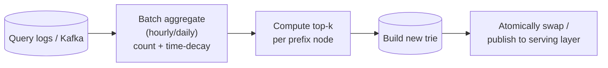

- Aggregate query logs periodically (Xu's book uses a **weekly** rebuild; hourly is common at scale).
- Recompute counts with time-decay, rebuild the trie with fresh top-k lists, then **atomically swap** the live trie for the new one (build offline, flip a pointer — readers never see a half-built trie).
- **Pros:** simple, robust, cheap per-query (zero write cost online). **Cons:** suggestions lag reality by the rebuild interval.

### Strategy B — Near-real-time trending overlay (for spikes)

Batch rebuilds miss a query that **spikes in the last 5 minutes** (breaking news). Add a **stream layer**:

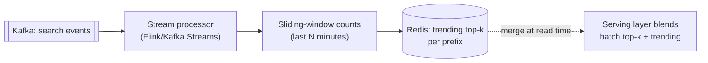

- A stream processor keeps **sliding-window counts** and pushes a small "trending" top-k per hot prefix into Redis.
- At read time the serving layer **merges** the stable batch top-k with the fresh trending list.
- This is the classic **Lambda-style split**: a slow-but-complete **batch layer** + a fast-but-approximate **speed layer**.

> **Why not update the trie live per query?** At 1.5M+ writes/sec, mutating a shared trie in place means lock contention, cache invalidation storms, and readers seeing partial state. Batching + atomic swap sidesteps all of it. The stream overlay handles the *only* case batching can't: sudden spikes.

---

## 11a. Approximate counting at scale — Count-Min Sketch

Keeping an exact count for **every** query is expensive when the vocabulary is huge and mostly long-tail. For the frequency signal you can use a **Count-Min Sketch** — a probabilistic structure that estimates counts in fixed memory (it may *overestimate* rare items but never underestimates), paired with a **heavy-hitters / top-k** structure. You only need exact-ish counts for the *popular* queries that actually surface; the long tail can be approximate. A one-line name-drop ("Count-Min Sketch for frequency, heavy-hitters for top-k") signals depth.

---

## 12. Caching & Debounce — Surviving the Keystroke Firehose

Two cheap client/edge tricks cut the vast majority of load before it reaches the backend.

### Debounce (client-side) — don't fire on every keystroke

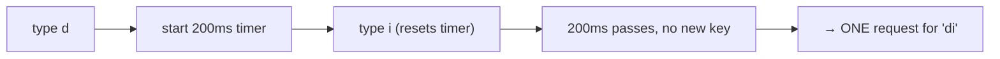

Wait ~150–300 ms after the last keystroke before sending a request; each new keystroke **resets** the timer. A user typing `disney` fast fires **one** request, not six. This alone can cut request volume 3–6×. (Also send only when prefix length ≥ 2–3, and cancel in-flight stale requests.)

### Multi-layer read cache

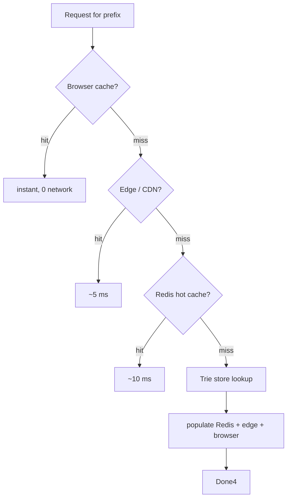

- **Browser cache** — the same user re-typing `di` shouldn't hit the network at all.
- **CDN / edge** — because suggestions are the *same for everyone* per prefix/region and served over `GET`, popular prefixes cache beautifully at the edge. This is where the biggest QPS reduction happens.
- **Redis hot-prefix cache** — absorbs the long tail of prefixes that miss the edge.

Cache TTLs should carry **jitter** to avoid a synchronized expiry (**cache avalanche**), and popular prefixes want **background refresh** to avoid a **stampede** when they expire.

> **Personalization vs cacheability tension (say this):** *"Suggestions are cacheable precisely because they're the same for everyone. The moment I personalize per user, I lose the shared edge cache. So I keep a shared, cacheable base result and blend a small personal signal at the very end — I don't personalize the cacheable core."*

---

## 13. Personalization Basics (without breaking the cache)

Full per-user tries don't scale (you'd need a trie per user). The mature pattern is **blend, don't replace**:

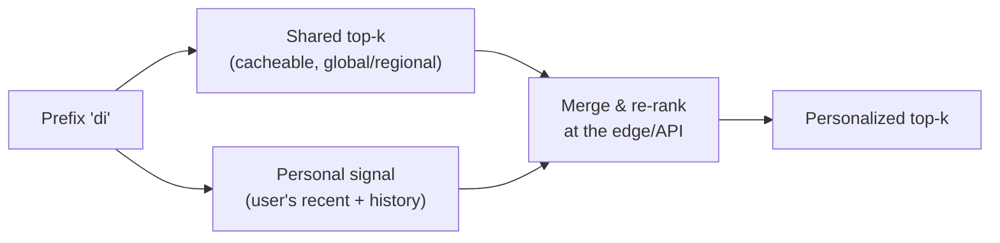

- Keep the **global/regional top-k** shared and cacheable (the expensive part).
- Maintain a **small per-user signal** — recent searches, a handful of affinities — cheap to store.
- **Merge** the two at request time: boost suggestions matching the user's history, otherwise fall back to global.
- **Regional/language partitioning** is the cheap 80% of personalization: `di` in Japan vs the US are different namespaces, still shared within a region → still cacheable.

Trade-off: more personalization = better relevance but **worse cache hit rate and higher cost**. Most systems personalize lightly and lean on regional buckets.

---

## 14. Spell / Typo Tolerance (high level)

Users type `iphine`; we should still suggest `iphone`. Don't over-engineer this in the core lookup — it's a **layered fallback**:

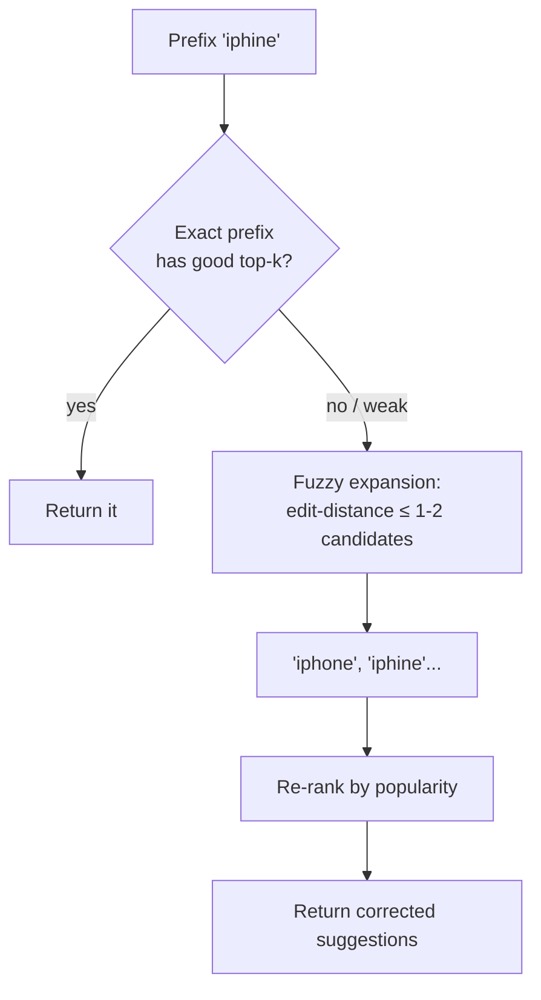

Techniques to name (breadth over depth in an interview):
- **Edit distance (Levenshtein ≤ 1–2)** to generate correction candidates.
- **N-gram / edge-ngram indexes** or a **BK-tree** for efficient fuzzy candidate retrieval.
- **FST-based suggesters** (what Elasticsearch/Lucene use) support fuzzy completion natively.
- Only fall to fuzzy when the exact-prefix result is weak — keep the fast path fast.

> **Interview line:** *"Typo tolerance is a fallback layer: try exact prefix first; if the top-k is weak, generate edit-distance-1 candidates and re-rank by popularity. I wouldn't put fuzzy matching on the hot path for every request."*

---

## 15. Failure Scenarios

| Failure | Handling |
|---|---|
| **Trie shard down** | Serve from **replica**; trie is read-only so replicas are trivial and always consistent |
| **Redis cache down** | Fall through to trie store; latency rises but correctness holds — **degrade, don't fail** |
| **Trie store fully unavailable** | Return **empty suggestions** (blank box), never a 500 — autocomplete is best-effort UX |
| **Build/aggregation job fails** | Keep serving the **last good trie**; suggestions get stale but stay up (atomic swap only on success) |
| **Kafka down (event ingest)** | Reads unaffected; only *learning* pauses — events buffer/retry, replay on recovery |
| **Hot prefix** (e.g. viral term) | Edge/CDN + Redis absorb it; replicate the owning shard; it's a cache problem, not a compute one |
| **Uneven shard load** | Shard-map manager rebalances prefix ranges |
| **Stampede on cache expiry** | Request coalescing + background refresh + TTL jitter |
| **Bad/offensive suggestion surfaces** | Safety-filter layer post-ranking; denylist applied at build and read time |

**Guiding principle:** autocomplete is **best-effort UX**. The right failure mode is almost always **"show fewer / no suggestions,"** never an error dialog. That's a different reflex than a payments system, and worth stating explicitly.

---

## 16. Latency Budget

```text
End-to-end target ............ 100 ms (must beat human typing cadence)
  Client debounce wait ....... ~150-300 ms is UX, not server latency (overlaps typing)
  Network to edge ............ ~10-30 ms
  Edge cache hit ............. ~1-5 ms   ← most requests end here
  Redis lookup (on miss) ..... ~1-5 ms
  Trie store lookup (on miss)  ~5-10 ms  ← O(1), precomputed top-k
  Ranking/personalization .... ~1-5 ms
```
→ The corollary: **do zero heavy work on the read path.** No subtree walks, no live counting, no DB `LIKE`. Everything expensive (aggregation, top-k, trie build) happens **offline**. That's the whole game.

---

## 17. Low-Level Design (clean OO)

```java
interface AutocompleteService {                 // one entry point
    List<Suggestion> suggest(String prefix, Context ctx, int limit);
}

interface TrieStore {                            // DIP: abstraction, not Redis/Cassandra
    List<Suggestion> topK(String prefix, int limit);   // O(1) precomputed read
}
// InMemoryTrieStore | RedisTrieStore | CassandraTrieStore

interface RankingStrategy {                      // Strategy: swap ranking logic
    List<Suggestion> rank(List<Suggestion> base, Context ctx);
}
// PopularityRanking | TimeDecayRanking | PersonalizedRanking

interface SuggestionEnricher {                   // Chain: fuzzy, safety, personalization
    List<Suggestion> apply(List<Suggestion> in, Context ctx);
}
// FuzzyFallbackEnricher → SafetyFilterEnricher → PersonalizationEnricher

// ---- write path ----
class TrieBuilder {                              // offline job
    Trie build(AggregatedCounts counts);         // computes top-k per node
}
class QueryAggregator { AggregatedCounts aggregate(Stream<QueryEvent> events); }  // time-decay
```

**Patterns worth naming:**
- **CQRS** — read model (trie) fully separate from write model (log → aggregation → build).
- **Strategy** — swap ranking (popularity / time-decay / personalized) via config.
- **Chain of Responsibility** — fuzzy fallback → safety filter → personalization, each a link.
- **DIP** — service depends on `TrieStore`, not on Redis/Cassandra directly (swappable, testable).
- **SRP** — `TrieStore`, `RankingStrategy`, `TrieBuilder`, `QueryAggregator` each do one thing.

---

## 18. Observability

| Category | Metrics |
|---|---|
| Latency | p50/p99 per layer (edge, Redis, trie), end-to-end |
| Cache | edge hit rate, Redis hit rate (target very high — low = QPS spike) |
| Freshness | trie build lag, aggregation lag, trending-overlay lag |
| Quality | suggestion **click-through rate**, empty-result rate, avg rank of clicked item |
| Traffic | autocomplete QPS, keystroke amplification factor, hot prefixes |
| Health | shard load balance (skew), replica lag, build job success/failure |

**Quality > availability here:** the metric that actually matters is **CTR / selection rate** — are the suggestions *useful*? A limiter is judged by denied-rate; autocomplete is judged by whether people **click the suggestions**. Falling CTR means your ranking or freshness is off, even if latency is perfect.

---

## 19. Trade-Offs to Say Out Loud

| Axis | Option A | Option B | Choose by |
|---|---|---|---|
| Read strategy | **Precompute top-k** (O(1), stale) | Walk subtree per query (fresh, slow) | Staleness tolerance → precompute wins |
| Freshness | Batch rebuild (simple, laggy) | Batch + streaming overlay (fresh, complex) | Do you need trending? |
| Trie location | In-memory in service (fastest) | External store Redis/Cassandra (flexible) | Deploy model vs raw speed |
| Sharding | By first letter (simple, skewed) | Shard-map by load (balanced, complex) | Scale → shard-map |
| Personalization | Shared/cacheable (fast, generic) | Per-user blend (relevant, low cache hit) | Relevance vs cost/cacheability |
| Counting | Exact counts (accurate, heavy) | Count-Min Sketch (approximate, tiny) | Vocabulary size |
| Typo tolerance | None (fast) | Fuzzy fallback (relevant, slower) | UX bar for messy input |

---

## 20. Interview Q&A

**Beginner**

**Q: What data structure powers autocomplete, and why?**
A **trie** (prefix tree) — strings sharing a prefix share a path, so finding all completions of a prefix is walking to one node. But a naive trie must traverse a huge subtree per lookup, so I **precompute the top-k suggestions at each node** and **bound the prefix length**, making each read O(1).

**Q: Why not just `SELECT ... WHERE q LIKE 'iph%'` in Postgres?**
A B-tree can *match* a prefix, but it can't cheaply return the **ranked top-k**, has no typo tolerance, and won't survive keystroke-level QPS (millions/sec of scans). Postgres is fine as a source of truth for the raw data, never as the autocomplete serving layer.

**Q: How do you handle the flood of requests from typing?**
**Debounce** on the client (fire one request ~200 ms after the last keystroke, not per character) and **cache aggressively** at browser + CDN + Redis. Since suggestions are `GET` and identical across users per prefix, the CDN absorbs most traffic.

**Intermediate**

**Q: How does the trie stay fresh as popularity changes?**
Read/write split. Search events flow into Kafka; an **offline job aggregates counts with time-decay and rebuilds the trie's top-k lists**, then **atomically swaps** the live trie. Keystrokes never write to the trie. For sudden spikes I add a **streaming overlay** that maintains sliding-window trending counts in Redis and merges them at read time.

**Q: How do you shard the trie?**
Not by first letter — that's badly skewed (`s` vs `x`). A **shard-map manager** measures load per prefix range and assigns ranges to shards for balance. Since the trie is read-only between rebuilds, I add **replicas** freely for throughput and availability.

**Q: What do you cache, and what breaks caching?**
Browser → CDN/edge → Redis. Edge caching works because suggestions are shared per prefix/region. **Personalization breaks it** — the moment results differ per user, the shared cache is gone. So I keep a shared cacheable base and blend a small personal signal only at the end.

**Advanced / Staff**

**Q: A query goes viral in the last 5 minutes — batch rebuild won't catch it. What now?**
A **speed layer**: a stream processor (Flink/Kafka Streams) keeps sliding-window counts and pushes a small trending top-k per hot prefix into Redis; the serving layer **merges** batch top-k with trending at read time. Classic Lambda split — complete-but-slow batch plus fresh-but-approximate stream.

**Q: How do you keep counting cheap across a massive long-tail vocabulary?**
**Count-Min Sketch** for frequency estimates in bounded memory (overestimates rare items, never underestimates) plus a **heavy-hitters** structure for top-k. I only need accurate counts for popular queries that actually surface; the tail can be approximate.

**Q: Redis and then the trie store both fail. What does the user see?**
An **empty suggestion box**, never an error. Autocomplete is best-effort UX — the correct failure mode is fewer/no suggestions. I also keep serving the **last successfully built trie** if the build pipeline fails, so staleness degrades gracefully instead of an outage.

**Q: How do you add personalization without destroying cache hit rate?**
Blend, don't replace. Keep the global/regional top-k shared and cacheable; maintain a **small per-user signal**; merge at the edge/API to boost history matches. Regional/language buckets get most of the relevance while staying shared and cacheable.

---

## 21. 30-Second Interview Answer

> "Autocomplete is a **read-optimized, precomputed, ranked prefix lookup**. The core structure is a **trie**, but a naive trie is too slow because it walks a huge subtree per keystroke — so I **precompute the top-k suggestions at every node and bound prefix length**, making each read **O(1)**. Suggestions are ranked by **time-decayed popularity**. I split reads from writes: keystrokes never write to the trie; instead search events flow through **Kafka**, an **offline job aggregates counts and rebuilds the trie**, and I **atomically swap** it in — autocomplete tolerates staleness, which is what makes precomputation legal. For the keystroke firehose I **debounce** on the client and cache at **browser → CDN → Redis**; the same popular prefixes are identical across users, so the edge absorbs most of ~1.5M QPS. I **shard the trie with a shard-map** (not by first letter — that's skewed) and add read replicas freely since it's read-only. For trending spikes I add a **streaming overlay** that merges fresh sliding-window counts at read time. On failure I **degrade to fewer/empty suggestions**, never an error."

---

## 22. Mental Model

```text
KEYSTROKE
   ↓ debounce (client, ~200ms)      ── collapse 6 keystrokes → 1 request
   ↓ browser → CDN → Redis          ── most requests die here (shared per prefix)
   ↓ sharded trie: read node.topK   ── O(1), PRECOMPUTED, no subtree walk
   ↓ blend personal + trending      ── optional, at the edge
   ↓
RANKED TOP-K   or   EMPTY BOX on failure (never an error)

DATA STRUCTURE → Trie + top-k cached per node + bounded prefix length
READ           → O(1) precomputed lookup, heavily cached
WRITE          → Kafka → aggregate (time-decay) → rebuild → atomic swap
FRESHNESS      → batch (baseline) + streaming overlay (trending)
RANKING        → time-decayed frequency (+ recency, personalization, rules)
SHARDING       → shard-map by load (NOT first letter) + read replicas
CACHE          → browser + CDN/edge + Redis (works because shared per prefix)
PERSONALIZE    → blend small personal signal at end (don't kill the cache)
FAILURE        → degrade to fewer/empty suggestions, serve last good trie
```

---

## 23. How This Connects to Other Topics

- **CQRS / read models** — the read/write split *is* CQRS: the trie is a read model rebuilt from an event log, exactly like search indexes and materialized views.
- **Full-text search** — autocomplete is the *prefix* cousin of full-text search; both build a specialized read structure (trie vs inverted index) off the source of truth and tolerate eventual consistency.
- **Trending / Top-K** — "top-k per prefix" is the same heavy-hitters problem as trending topics; Count-Min Sketch and streaming windows show up in both.
- **Rate limiter (hot keys)** — a viral prefix is the celebrity/hot-key problem again; the fix is the same: edge cache + replicate the hot shard.
- **Lambda architecture (DDIA Ch. 11)** — batch trie + streaming trending overlay is textbook batch-layer + speed-layer.
- **Partitioning (DDIA Ch. 6)** — sharding a skewed keyspace (letters aren't uniform) and using a shard-map to rebalance is the general partitioning-with-skew lesson.
- **Caching patterns** — stampede (coalescing/background refresh), avalanche (TTL jitter), and edge cacheability of `GET` responses all appear here in their purest form.
