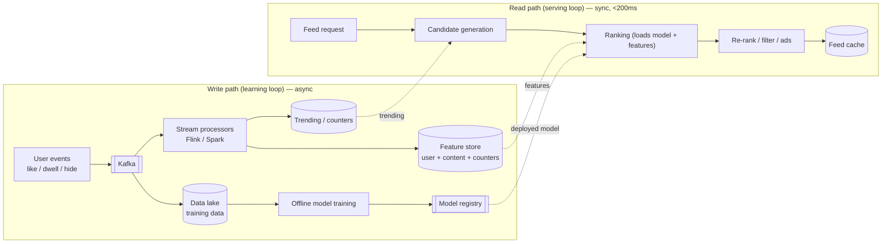
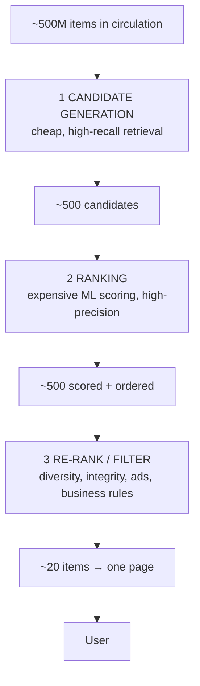
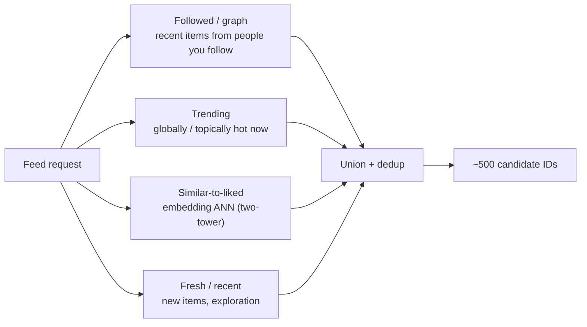
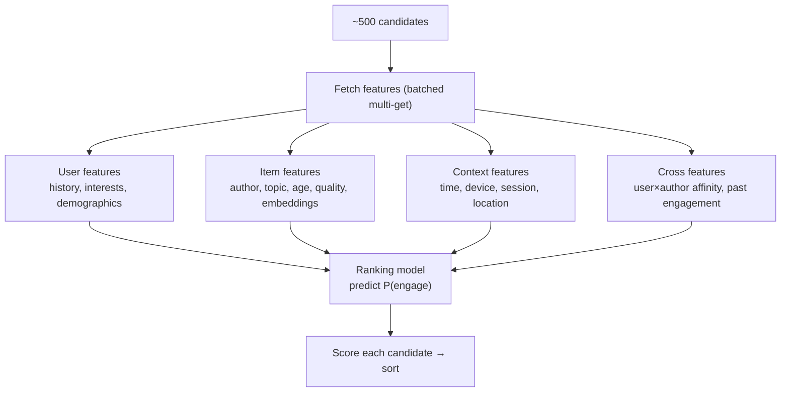
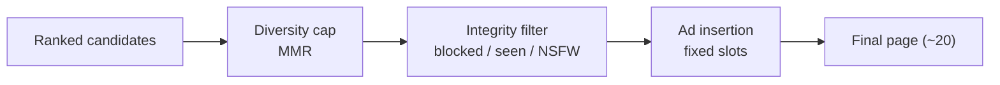
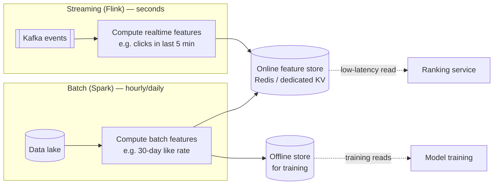
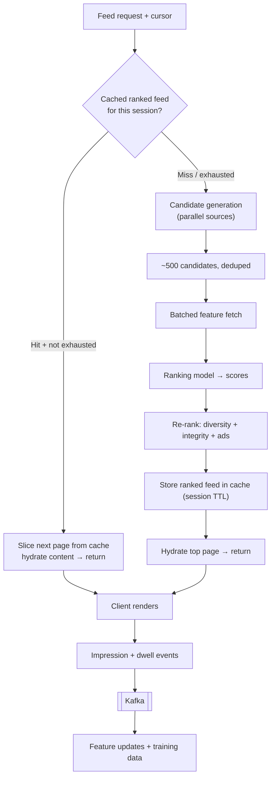
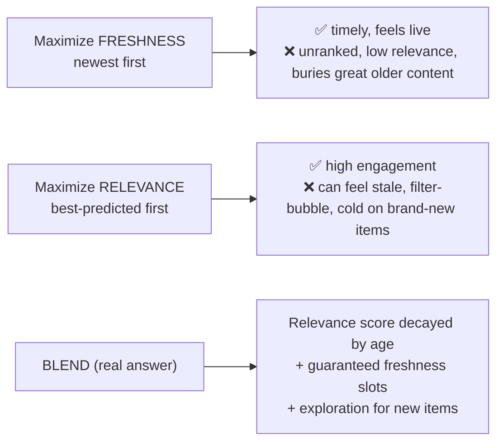
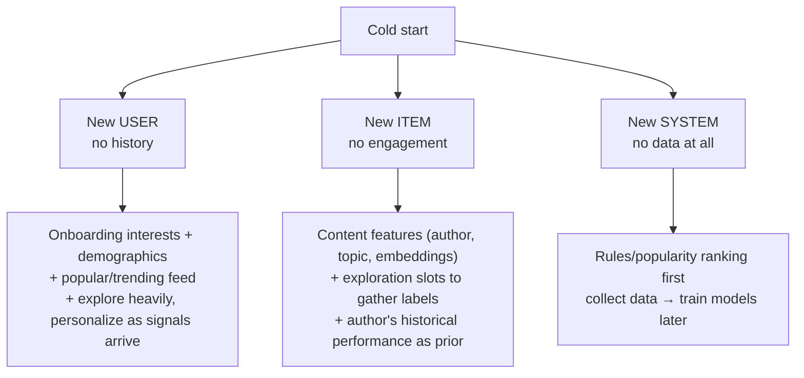
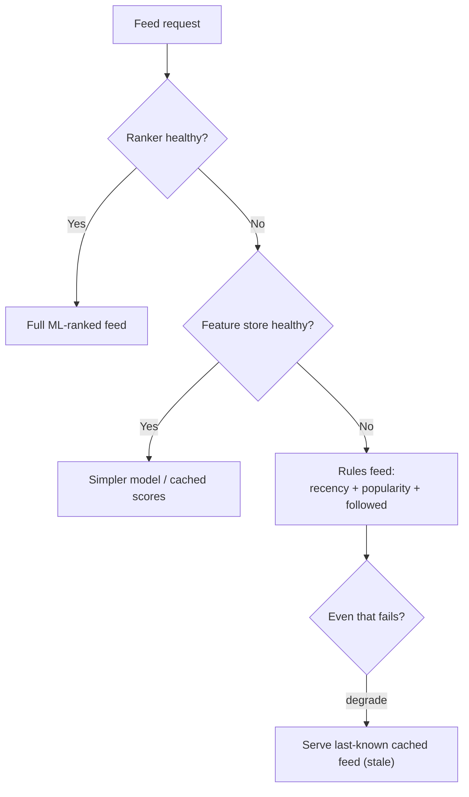

# News Feed / Recommendation — Staff/SSE System Design

**Difficulty:** Advanced
**Interview importance:** ⭐ **Critical** (the canonical ML-systems design; asked at every large consumer company)
**References:** Alex Xu — *System Design Interview* Vol 1, Ch. 11; industry write-ups on YouTube/Instagram/TikTok recommender pipelines; DDIA Ch. 11–12 (stream processing, derived data)

> **Scope note.** This file is the **ranked-recommendation** angle: *how do we pick and order the best content for a user out of millions of items?* The **fan-out / timeline-delivery** mechanics (push vs pull, celebrity write-amplification) live in `03-twitter-social-feed.md`. They're complementary — fan-out decides *what could appear*; this doc decides *what actually appears and in what order*. Keep them distinct in the interview.

---

## 0. Why This Design Matters

A naive feed is `SELECT * FROM posts ORDER BY created_at DESC` — reverse-chronological, no thought. That works until you have 100M users and millions of new items an hour, at which point **the interesting content is buried and the user leaves.** The moment you say the words "show the *best* posts, not the *newest*," you've signed up for a **two-stage retrieval-and-ranking system**: you cannot score every item for every user, so you must **cheaply narrow millions → hundreds (candidate generation)**, then **expensively score hundreds → a ranked page (ranking)**, then **filter for business rules and diversity**, all in **under ~200 ms**, while a **streaming pipeline** keeps the signals fresh.

That is why interviewers love it: a weak candidate describes a sorted SQL query; a strong candidate draws **candidate generation → ranking → re-ranking/filtering**, explains **why two stages** (compute cost), names the **feature store**, handles **cold start**, and articulates the **freshness-vs-relevance** trade-off out loud.

> The one-line thesis: **a recommendation feed is a funnel — get cheap and broad, then expensive and precise — because you can afford accuracy only on a small candidate set.**

---

## 1. Problem Overview — Explain It Simply

Build a service that, for each user, answers:

> **"Out of everything we *could* show you, which ~20 items should be at the top of your feed right now?"**

It must:

- Personalize per user (my feed ≠ your feed).
- Balance **relevance** (what you'll engage with) against **freshness** (recent), **diversity** (not 20 posts from one creator), and **business rules** (no blocked authors, ads slotting, integrity filters).
- Paginate smoothly as the user scrolls.
- Learn from feedback (likes, dwell time, skips) and reflect it reasonably quickly.
- Do all of this in ~150–200 ms, at hundreds of thousands of requests per second.

### Real-world analogy — the newspaper editor with a slush pile

Imagine an editor who receives **millions of articles a day** and must fill **one front page** for **each reader individually**:

1. **Assistants pre-sort the slush pile** into rough buckets — "sports," "from writers you follow," "trending today," "similar to what you liked." Cheap, approximate, high-recall. → **candidate generation**.
2. **The editor reads only the shortlisted ~500** and ranks them by how much *this specific reader* will care. Expensive, precise. → **ranking**.
3. **A final pass** removes duplicates, spreads out topics, drops anything blocked, and slots in the one ad the business requires. → **re-ranking / filtering**.

Everything else — the feature store, Kafka, caching — is just "how do the assistants and editor get the facts they need, fast enough, freshly enough?"

---

## 2. Functional Requirements

**Core**
- Return a **personalized, ranked feed** for a user (a page of ~20 items).
- **Paginate** deterministically as the user scrolls (cursor-based).
- **Candidate generation** from multiple sources (followed, trending, similar-to-liked, recent).
- **Ranking** of candidates by predicted engagement.
- **Filtering / re-ranking**: dedup, diversity, integrity (blocked/muted/NSFW), ad insertion.
- Ingest **user feedback** (impression, like, comment, share, dwell time, "not interested").
- Provide a **fallback feed** when the ranker or feature store is degraded.

**Optional (name them, then defer)**
- Explicit controls ("see less of this"), topic follows, explore/serendipity slots, multi-objective optimization (engagement + creator equity + integrity), on-device re-ranking, real-time counter-based trending.

---

## 3. Non-Functional Requirements

| Requirement | Target | Why it dominates the design |
|---|---|---|
| Feed latency | **p99 < 200 ms** end-to-end | It's the app's first screen; slow feed = churn. Budgets every stage. |
| Throughput | 100K+ feed QPS | Forces candidate generation (can't score everything) + caching |
| Availability | **99.9%+** | Feed must render even if the ranker is down → graceful degradation |
| Freshness | New content visible in **seconds–minutes** | Drives streaming features + short cache TTLs |
| Relevance quality | Optimize engagement (CTR, dwell, retention) | The *product* metric; drives the ML ranking stage |
| Consistency | **Eventual** is fine for the feed | You never need a "correct" feed, just a good one → enables heavy caching |
| Scroll consistency | Stable pagination (no dupes/gaps) | Cursor design, snapshot the candidate set |

> **Say this out loud:** *"A feed is read-heavy, latency-critical, and tolerant of eventual consistency — I never need the 'one true feed,' I need a good-enough feed rendered fast. That single fact lets me cache aggressively and precompute, and it's the opposite of a payments system."*

---

## 4. Capacity Estimation (do the math — don't hand-wave)

```text
DAU                        = 100,000,000
Feed sessions / user / day = 10   (open app, scroll, refresh)
Feed requests / day        = 100M × 10 = 1,000,000,000  (1B/day)
Average QPS                = 1,000,000,000 / 86,400 ≈ 11,600 QPS
Peak (×5)                  ≈ 58,000 QPS
```

**Why candidate generation is mandatory — the killer number.** Suppose there are **500M candidate items** in circulation and the ML ranker scores one item in ~**1 ms** of CPU. Ranking *everything* per request:

```text
500,000,000 items × 1 ms = 500,000 seconds of CPU  PER REQUEST
```

That is ~5.8 **CPU-days** for a single feed load. Utterly impossible. Now cap candidates at **~500** per request:

```text
500 items × 1 ms = 0.5 s of CPU per request   (parallelizable to ~tens of ms)
```

→ **You must retrieve a small candidate set cheaply before ranking.** This one comparison *is* the justification for the two-stage architecture — say it.

**Ranking compute at peak.**
```text
58,000 req/s × 500 candidates = 29,000,000 item-scorings/sec
At ~1 ms CPU each = 29,000 CPU-seconds/sec ≈ 29,000 cores just for ranking
```
→ Ranking is a **fleet of stateless scoring servers**, horizontally scaled, GPU/optimized-CPU, and a hard reason to **cache generated feeds** so repeat scrolls don't re-rank.

**Feature store read volume.**
```text
29M candidate-scorings/sec, each needs content + user + context features
→ tens of millions of feature reads/sec → in-memory KV (Redis/dedicated feature store), batched (multi-get)
```

**Feed cache memory.** Cache **item IDs + scores**, not bodies (hydrate separately):
```text
Per user cached feed ≈ 500 ids × (8 B id + 4 B score) ≈ 6 KB
Cache 20M active users × 6 KB ≈ 120 GB → a modest Redis cluster
```

**What the numbers tell us:**
- **Two stages are non-negotiable** — ranking everything is 6 CPU-days/request.
- **Ranking is the compute bottleneck** → stateless scoring fleet + feed caching.
- **Feature reads are the I/O bottleneck** → in-memory feature store + batched multi-get.
- **Cache IDs, not content** → keeps the feed cache tiny.

---

## 5. API Design

**Get feed** (the hot path, cursor-paginated):
```http
GET /v1/feed?cursor=eyJvZmZzZXQiOjIwfQ&limit=20
```
```json
{
  "items": [
    { "itemId": "P8821", "authorId": "U55", "score": 0.83, "reason": "followed", "type": "post" },
    { "itemId": "AD_912", "type": "ad", "slot": 4 }
  ],
  "nextCursor": "eyJvZmZzZXQiOjQwfQ",
  "servedFrom": "cache"
}
```

**Design notes interviewers probe:**
- **Cursor, never offset.** `OFFSET 40` re-scans and drifts as new items arrive (dupes/gaps on scroll). The cursor encodes a **snapshot of the ranked candidate set** (e.g. a session-scoped feed id + position), so pages 1–5 come from *one* stable ranking.
- Return a `reason` per item — powers explainability and debugging ("why did I see this?").
- `servedFrom: cache | fresh` — cheap observability into cache hit rate.

**Record feedback** (fire-and-forget, fuels the pipeline):
```http
POST /v1/events
```
```json
{ "userId": "U123", "itemId": "P8821", "event": "DWELL", "valueMs": 4200, "ts": 1725345600 }
```
Events: `IMPRESSION`, `CLICK`, `LIKE`, `COMMENT`, `SHARE`, `DWELL`, `HIDE`, `NOT_INTERESTED`. These are the **training labels and real-time features** — the whole system learns from this stream.

---

## 6. Where the Work Happens — Read Path vs Write Path

Two loosely-coupled loops. Keep them separate in your head and on the whiteboard.



- **Write path (warm, async):** events → Kafka → stream processing → feature store + trending + data lake → offline training → model registry. Nothing here is on the user's critical path.
- **Read path (hot, sync):** request → candidate gen → ranking → filtering → cache → client, in ~150 ms.
- The two meet only through **derived data**: the read path *reads* features/models the write path *produced*. This is the DDIA "derived data" pattern — the serving layer never blocks on ingestion.

---

## 7. The Core Pipeline: Candidate Generation → Ranking → Filtering

This is **the** artifact of the whole design. Draw the funnel first, then detail each stage.



The funnel logic: **each stage is more expensive per item but sees fewer items.** Stage 1 touches millions but costs microseconds each; stage 2 touches hundreds but costs milliseconds each; stage 3 touches tens. Total work stays bounded.

### 7.1 Stage 1 — Candidate Generation (recall-optimized)

Goal: from millions, fetch a few hundred **plausibly relevant** items **fast**. We optimize **recall** (don't miss good stuff), not precision (ranking fixes ordering later). Run several **retrieval sources in parallel** and union the results:



| Source | How | Data structure | Why it's here |
|---|---|---|---|
| **Followed / graph** | Recent items from followed authors | Timeline/activity store (Cassandra) or fan-out cache | The user explicitly asked for these |
| **Trending** | Top-K hot items (global + per-topic) | Redis counters / Count-Min-Sketch | Freshness + serendipity, covers cold users |
| **Similar-to-liked** | **Embedding ANN search** | Vector index (HNSW/IVF) | Personalization beyond the follow graph |
| **Fresh / exploration** | New items, random-ish slots | Recency index | Fights filter bubbles; gathers labels on new content |

**The embedding retrieval (two-tower model)** is the piece that signals depth. A **two-tower** network learns a **user embedding** and an **item embedding** in the same vector space, trained so that engaged pairs land close together. At serve time:

```text
user_vec = userTower(user features)              # computed per request (cheap)
candidates = ANN_index.search(user_vec, k=200)   # approximate nearest neighbors, ~ms
```

Item vectors are **precomputed offline** and loaded into an **ANN index** (HNSW). This turns "find items this user will like" into a **nearest-neighbor lookup** — sub-linear, millisecond, and the standard modern candidate-gen technique. Name-drop **two-tower + ANN**; it's the difference between "I've read a blog" and "I've built one."

### 7.2 Stage 2 — Ranking (precision-optimized)

Now score the ~500 candidates precisely for **this** user, **this** context. This is where the heavy ML lives.



- **Model output** is a predicted engagement probability (or a blend: `0.5·P(like) + 0.3·P(comment) + 0.2·P(dwell>t)` — **multi-objective**, because optimizing pure CTR yields clickbait). Modern rankers are gradient-boosted trees (fast, strong on tabular) or deep networks (**DLRM**-style: wide-and-deep, learns feature crosses).
- **Feature fetching dominates latency**, not model math. Hundreds of candidates × dozens of features each = thousands of lookups → **one batched multi-get** to the feature store, not N round-trips. This is the single most important serving-latency optimization to mention.
- The model is **loaded from the model registry** (versioned), served on a **stateless scoring fleet** so you can scale horizontally and roll models via **shadow / canary / A-B**.

### 7.3 Stage 3 — Re-ranking / Filtering (the business layer)

Pure ML scores are not the final feed. A precision-perfect list can still be **terrible product**: 15 posts from one creator, three near-duplicate news items, an author the user muted, no ads where the business needs them. Re-ranking fixes this:

| Concern | Action |
|---|---|
| **Diversity** | Cap items per author/topic; interleave sources; **MMR** (maximal marginal relevance) to penalize redundancy |
| **Integrity / safety** | Drop blocked/muted authors, NSFW, policy-violating, already-seen items |
| **Freshness floor** | Guarantee some recent items so the feed doesn't feel stale |
| **Business rules** | Insert ads at fixed slots; sponsored/creator-equity boosts |
| **Dedup** | Remove items the user already saw this session |



> **Interview line:** *"The ML ranker optimizes engagement, but the feed I actually serve is re-ranked for diversity, integrity, and business rules — because a mathematically optimal list of 20 posts from the same creator is a bad product."*

---

## 8. The Feature Store — What It Is and Why It Exists

The ranking model is only as good as the features feeding it, and those features must be available in **single-digit milliseconds** at the point of scoring. The **feature store** is the low-latency serving layer for exactly that.



- **Two halves, one logical store:**
  - **Online store** (Redis / DynamoDB / Feast-style): serves features to the ranker at read time. Optimized for **latency**.
  - **Offline store** (data lake / warehouse): same feature definitions, full history, feeds **training**. Optimized for **throughput**.
- **Why this split solves train/serve skew.** If training computed "30-day like rate" one way and serving computed it another, the model sees different inputs than it trained on → silently degraded predictions. A feature store enforces **one definition, materialized to both stores** — this is its core reason to exist. Name **"train/serve skew"**; it's a staff-level tell.
- **Feature freshness tiers** (map each feature to how fresh it must be):
  - **Batch** (hourly/daily): user's long-term interests, content quality, author reputation.
  - **Streaming** (seconds): "trending in last 5 min," "this user's current-session clicks."
  - **Request-time**: time of day, device, current location.

---

## 9. Data Store Selection — and Why

| Store | Holds | Why this one |
|---|---|---|
| **PostgreSQL** | Users, follows, content metadata, config | Relational, transactional; the durable source of truth for accounts and the graph |
| **Cassandra / distributed KV** | Activity/timeline data, per-user candidate lists | Massive write volume, horizontal scale, predictable key-based access; feed data is append-heavy and eventually consistent |
| **Redis (feature store online + feed cache)** | Hot features, trending counters, generated feeds | Sub-ms in-memory reads at millions/sec; the ranker's I/O layer and the serving cache |
| **Vector index (HNSW/IVF)** | Item embeddings | ANN candidate retrieval — "find similar" as a nearest-neighbor query |
| **Kafka** | Event stream | Decouples producers from consumers, buffers spikes, enables **replay** for backfills/model retraining |
| **Data lake / warehouse (S3 + Spark)** | Full event history, training data | Cheap durable storage, batch feature computation, offline model training |

> **The rule to voice:** *"No single database wins — I pick per access pattern. Postgres for the transactional graph, Cassandra for high-volume activity, Redis for the millisecond serving layer, a vector index for similarity, Kafka to decouple, and a data lake for training. The feed itself is derived data, so it can be eventually consistent."*

---

## 10. Serving Flow, End to End



The key move: **rank once per session, paginate from cache.** A user scrolling pages 1–5 triggers **one** candidate-gen + ranking pass; subsequent pages are cheap slices of the cached ranked list. This is what makes 58K QPS affordable — most requests are cache reads, not full pipeline runs.

---

## 11. Freshness vs Relevance — the Central Trade-Off

The defining tension of a feed. You cannot maximize both.



**How the blend is implemented:**
- **Time decay in the score:** `final = relevance × e^(−λ·age)` — recent items get a boost, so a slightly-less-relevant fresh item can outrank a stale great one. `λ` is a tunable product knob.
- **Freshness floor:** reserve N slots per page for recent content regardless of score.
- **Exploration for cold items:** brand-new content has no engagement history, so the model can't score it well → deliberately inject some to **gather labels** (the exploration-vs-exploitation trade). Without this, new content never gets a chance and the model can't learn about it — a self-reinforcing bias.

> **Say it:** *"I blend relevance with a recency decay and reserve exploration slots. Pure relevance creates a stale filter bubble and starves new content of the impressions it needs to be learned; pure recency throws away personalization. The blend weights are a product decision I'd A/B test."*

---

## 12. Cold Start — Three Flavors

"No signal yet." Interviewers push on all three:



- **New user:** you have no behavior, so lean on **content/context** (onboarding topic picks, demographics, location, device) and **popularity/trending**, then personalize fast as the first few events arrive. This is why the pipeline *needs* a trending source and a rules fallback.
- **New item:** the ranker has no engagement history for it, so it relies on **content features + author priors** and gets deliberate **exploration impressions** to earn a track record. This is the flip side of the freshness trade in §11.
- **New system:** ship **rules/popularity first**, gather data, add ML later. Never block launch on a trained model.

---

## 13. Caching Strategy — and Its Failure Modes

Caching is what makes the read path affordable. But every cache has a stampede/hot-key story — voice it.

| Layer | What's cached | TTL / invalidation |
|---|---|---|
| **Generated feed** (per session) | Ranked item IDs + scores | Session-scoped or short TTL (minutes); paginate from it |
| **Feature cache** | Hot user/item features | Seconds–minutes; refreshed by stream processors |
| **Content hydration** | Item bodies by ID | Longer TTL; content changes rarely |
| **Trending / counters** | Top-K hot items | Seconds (must stay fresh) |

**Failure modes to name (map to fixes):**
- **Cache stampede** — a popular user's feed expires and 1,000 requests recompute it at once → **request coalescing** (single-flight) or **background async refresh** (serve slightly stale while recomputing).
- **Hot key** — a celebrity's content or a global-trending item is read by everyone → **local in-process cache + replication** of that key across nodes.
- **Cache avalanche** — many feeds expire together → **TTL jitter** so expiries stagger.

> **Interview line:** *"I serve most requests from the cached ranked feed and only run the full pipeline on cache miss. I guard against stampede with single-flight refresh and against hot keys with local caching + replication. Because a feed tolerates staleness, I can even serve a slightly stale feed while refreshing in the background — availability over perfect freshness."*

---

## 14. Failure Scenarios & Graceful Degradation

The feed must **always render something** — degrade in tiers, never blank-screen.



| Failure | Handling |
|---|---|
| **Ranking model / service down** | Fall back to **rules ranking** (recency + popularity + followed) — a feed that's worse but works |
| **Feature store unavailable** | Use **default / cached features** and a simpler model; never block the request |
| **Vector index (ANN) down** | Drop the similar-to-liked source; serve from followed + trending only |
| **Kafka down** | Feed keeps serving with **existing features**; feedback/training just lags — eventually catches up on replay |
| **Feed cache down** | Recompute per request (higher latency); rely on downstream stores; shed load if needed |
| **Cold start user** | Popularity + onboarding (§12) |
| **Duplicate event** | **Idempotent consumers** (dedup by event id); double-counting a like is cosmetic, not correctness-critical |
| **Hot key / hot partition** | Local cache + replication for celebrity/trending items |
| **Downstream store timeout** | Timeout + retry with backoff + jitter; circuit-break to fallback source |

> **The framing that scores:** *"A feed is not correctness-critical, so my failure strategy is graceful degradation: ML feed → simpler model → rules feed → stale cached feed. The user always sees content; quality drops, availability doesn't."*

---

## 15. Latency Budget

```text
Feed p99 target ................... 200 ms
  Gateway / auth .................. 5 ms
  Candidate generation ............ 30 ms  (parallel sources + ANN)
  Feature fetch (batched) ......... 30 ms  ← biggest ranking cost
  Ranking (score ~500) ............ 40 ms
  Re-rank / filter / ads .......... 10 ms
  Content hydration ............... 20 ms
  Network + serialization ......... 15 ms
  Headroom ........................ ~50 ms
```
→ Corollaries: **feature fetch must be batched** (one multi-get, not N calls); **cache-hit requests skip 100+ ms** of pipeline (rank-once-paginate-many); **ranking runs on a scaled stateless fleet** so it parallelizes across the 500 candidates.

---

## 16. Low-Level Design (clean OO)

```java
interface CandidateGenerator {                 // Strategy — one per source
    List<Candidate> generate(FeedContext ctx);
}
// FollowedGenerator | TrendingGenerator | SimilarGenerator | RecentGenerator

interface Ranker {
    List<ScoredItem> rank(List<Candidate> candidates, FeedContext ctx);
}
// MLRanker (loads model + features)  |  RuleBasedRanker (fallback)

interface FeatureStore {                        // DIP: depend on abstraction
    Map<String, Features> multiGet(List<String> keys);
}

interface ReRanker {                            // Chain — diversity, integrity, ads
    List<ScoredItem> apply(List<ScoredItem> items, FeedContext ctx);
}

class FeedService {                             // Facade orchestrating the pipeline
    List<ScoredItem> buildFeed(User u, Cursor c) {
        var candidates = generators.parallelStream()
                                   .flatMap(g -> g.generate(ctx).stream())
                                   .distinct().toList();
        var ranked = ranker.rank(candidates, ctx);        // falls back if ML down
        return reRankers.stream().reduce(ranked, (acc, r) -> r.apply(acc, ctx));
    }
}
```

**Patterns worth naming:**
- **Strategy** — swap candidate sources and rankers via config (add a source without touching the pipeline).
- **Pipeline / Chain of Responsibility** — generation → ranking → filtering stages compose cleanly; re-rankers chain.
- **Facade** — `FeedService` hides orchestration behind one call.
- **DIP** — ranker depends on `FeatureStore`, not on Redis directly (testable, swappable).
- **Cache-aside** — feed and features are read-through with fallback recompute.

---

## 17. Trade-Offs to Say Out Loud

| Axis | Option A | Option B | Choose by |
|---|---|---|---|
| Retrieval | One-stage (rank everything) | **Two-stage (candidate + rank)** | Scale — one-stage is impossible past small catalogs |
| Ordering | Freshness (recency) | Relevance (ML) | Product goal; the real answer is a **blend** |
| Consistency | Strong (always current) | **Eventual (cache + async)** | Feed tolerates staleness → eventual wins |
| Candidate gen | Rule/graph-based (explainable) | Embedding ANN (personalized) | Both — union them |
| Feature freshness | Batch (cheap, stale) | Streaming (fresh, complex) | Per-feature, by business impact |
| Ranker failure | Fail (error) | **Degrade (rules feed)** | Availability — always serve something |
| Objective | Pure CTR (simple) | Multi-objective (engagement+integrity) | CTR alone breeds clickbait → multi-objective |
| Cache scope | Per-request (fresh) | **Per-session (rank once)** | Latency/cost → rank once, paginate from cache |

---

## 18. Interview Q&A

**Beginner**

**Q: Why not just sort all posts by predicted score and return the top 20?**
Because you can't score all posts. With ~500M items and ~1 ms/score, ranking everything is ~5.8 CPU-days per request. You first do cheap, high-recall **candidate generation** to get ~500 items, then expensively rank only those. Two stages.

**Q: Why is eventual consistency acceptable here?**
There's no "correct" feed — only a good-enough one. If your feed is a few seconds stale or misses one just-posted item, nothing breaks. That tolerance is what lets me cache aggressively and precompute, unlike a payments system.

**Q: What's the feature store for?**
It serves the user/item/context features the ranking model needs, in milliseconds, at read time — and it materializes the *same* feature definitions to an offline store for training, preventing train/serve skew.

**Intermediate**

**Q: How does the "similar to what I liked" source work at scale?**
A **two-tower** model learns user and item embeddings in a shared space; engaged pairs sit close together. Item vectors are precomputed into an **ANN index (HNSW)**. At serve time I embed the user and do a **nearest-neighbor search** — sub-linear, millisecond, no scanning millions of items.

**Q: What's the biggest latency cost in ranking, and how do you cut it?**
Not the model math — the **feature fetch**. Hundreds of candidates × dozens of features is thousands of lookups. I do **one batched multi-get** to the feature store instead of N round-trips, and cache hot features.

**Q: How do you keep the feed stable while the user scrolls?**
**Cursor pagination over a snapshot.** I rank once per session and cache the ranked list; the cursor points into that stable list. Offset pagination would drift as new items arrive, causing dupes and gaps.

**Q: Freshness vs relevance — how do you handle it?**
A blend: relevance score with a **recency decay** (`score × e^(−λ·age)`), a **freshness floor** of reserved slots, and **exploration slots** for brand-new items so they can earn engagement data. Pure relevance is a stale filter bubble; pure recency throws away personalization.

**Advanced / Staff**

**Q: Cold start — user *and* item?**
New user: no behavior → lean on onboarding interests, demographics, and popularity/trending, personalize as the first events land. New item: no engagement → use content features + author priors and give it deliberate **exploration impressions** to gather labels. Both are the same exploration-vs-exploitation trade.

**Q: The ranker service falls over during peak. What does the user see?**
A worse feed, never a blank one. I **degrade in tiers**: ML feed → simpler model / cached scores → rules feed (recency + popularity + followed) → last-known stale cached feed. Feed quality drops; availability holds.

**Q: What's train/serve skew and how does the design prevent it?**
When a feature is computed differently in training vs serving, the model sees inputs it wasn't trained on and silently degrades. The feature store enforces **one feature definition materialized to both** an offline (training) and online (serving) store, so the numbers match.

**Q: Optimizing pure click-through-rate — what goes wrong?**
Clickbait and outrage bait — CTR rewards the sensational. I use a **multi-objective** score blending likes, comments, dwell time, and integrity signals, and re-rank for diversity, so the feed optimizes long-term engagement and product health, not raw clicks.

**Q: Where's your hottest key, and how do you protect it?**
A globally trending item or a celebrity's content — read by nearly everyone. I guard it with **local in-process caching + replication of that key**, and I protect against **stampede** on expiry with single-flight refresh and background recompute.

---

## 19. 30-Second Interview Answer

> "A ranked feed is a funnel. First, **candidate generation** cheaply narrows ~500M items to ~500 per request — running followed, trending, and **embedding-ANN 'similar-to-liked'** sources in parallel — because scoring everything is computationally impossible. Then a **ranking model** scores those ~500 for this user using features from a **feature store**, where the dominant cost is a **batched feature fetch**, not the model. Then **re-ranking** applies diversity, integrity filters, and ad slotting. I **rank once per session and paginate from cache** with cursors, so most requests are cheap cache reads. A separate **Kafka + stream-processing** loop keeps features fresh and gathers training labels. The feed tolerates **eventual consistency**, so I cache hard and degrade gracefully — if the ranker dies I fall back to a rules feed — and I blend **relevance with a recency decay plus exploration slots** to balance freshness against personalization and handle cold start."

---

## 20. Mental Model

```text
FEED REQUEST
   ↓ cache hit? → slice next page from cached ranked list (cheap)
   ↓ miss:
   ↓ CANDIDATE GEN  (~500M → ~500)  recall, cheap, parallel sources + ANN
   ↓ RANKING        (~500 scored)   precision, ML, batched features  ← bottleneck
   ↓ RE-RANK        (~20 page)      diversity + integrity + ads
   ↓ cache the ranked list, return page
   →
IMPRESSION/DWELL events → Kafka → stream processing → feature store + training

FUNNEL      → cheap+broad, then expensive+precise (two stages, non-negotiable)
CANDIDATES  → followed | trending | similar (two-tower ANN) | fresh
RANKING     → multi-objective ML, features from feature store, batched
RE-RANK     → diversity (MMR) + integrity + ads
FEATURES    → online store (serve) + offline store (train) → no skew
FRESHNESS   → relevance × recency-decay + exploration slots
COLD START  → popularity + onboarding, personalize as signals arrive
CONSISTENCY → eventual (feed tolerates staleness) → cache hard
FAILURE     → degrade in tiers: ML → simpler → rules → stale cache
```

---

## 21. How This Connects to Other Topics

- **Twitter / social feed (`03`)** — that file is **delivery** (fan-out push vs pull, celebrity write-amplification: *what could appear*); this file is **selection + ordering** (*what actually appears and in what rank*). Real systems do both: fan-out builds the candidate pool, this pipeline ranks it.
- **Rate limiter (`05`)** — same "handle the head of the distribution differently" move: hot trending keys here are the celebrity hot-key problem there; local cache + replication is the shared fix.
- **Stream processing (DDIA Ch. 11)** — the Kafka → Flink → feature-store loop is textbook derived data: the serving layer reads state the streaming layer produces, never blocking on ingestion.
- **Search / retrieval** — candidate generation is retrieval (ANN = the vector-search cousin of an inverted index); ranking is the same two-stage "retrieve then re-rank" pattern as modern search and RAG.
- **Caching patterns** — rank-once-paginate-many, single-flight refresh, TTL jitter, hot-key replication all appear here exactly as in any read-heavy system.
- **Exploration vs exploitation** — the freshness/cold-start slots are a bandit problem; the same tension shows up in A/B rollout and model retraining cadence.
