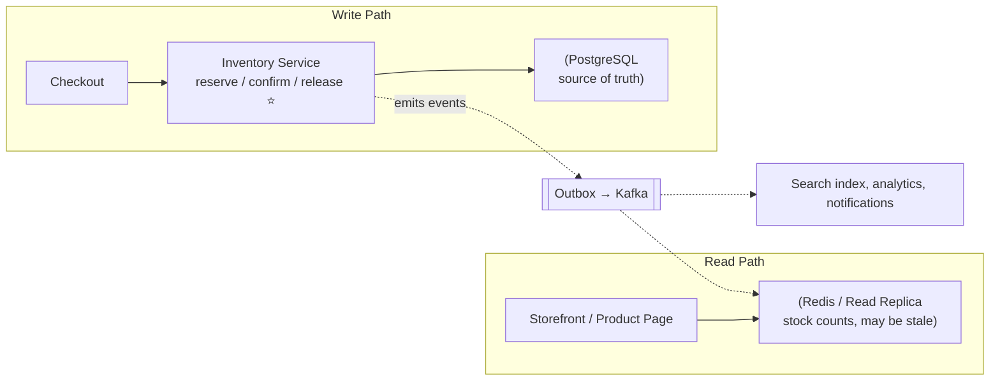
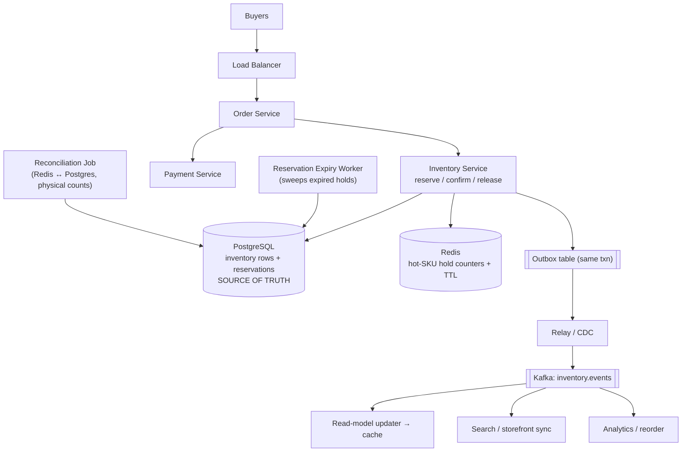
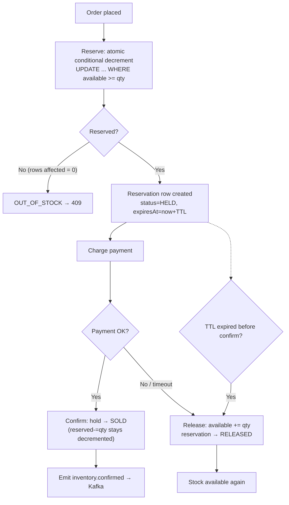
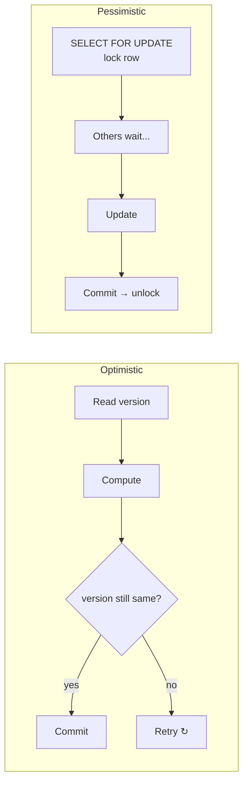
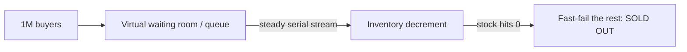
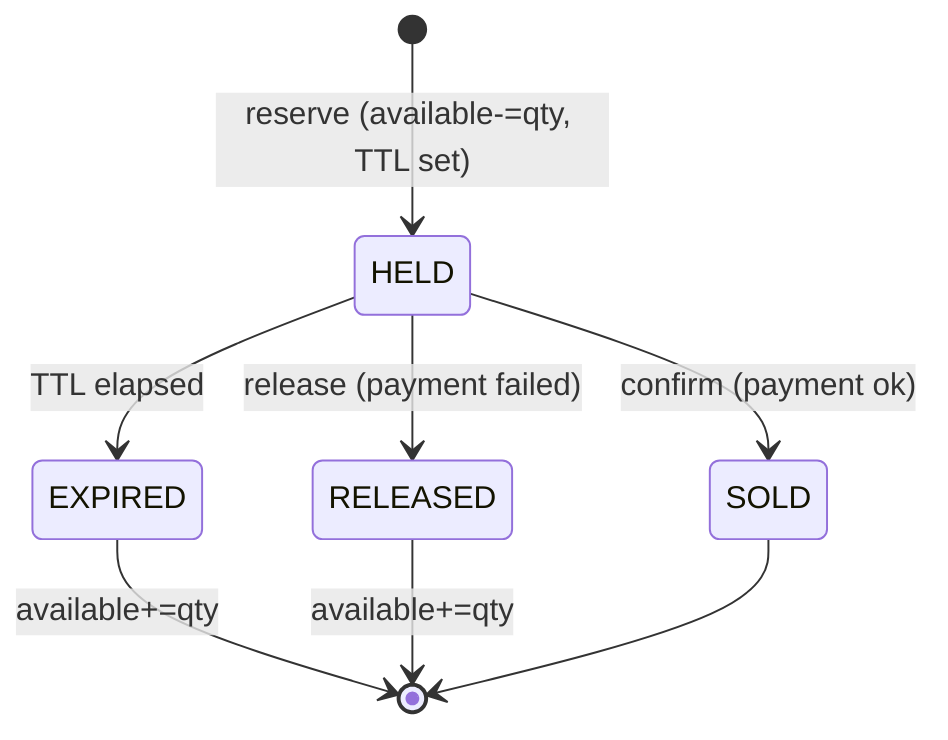
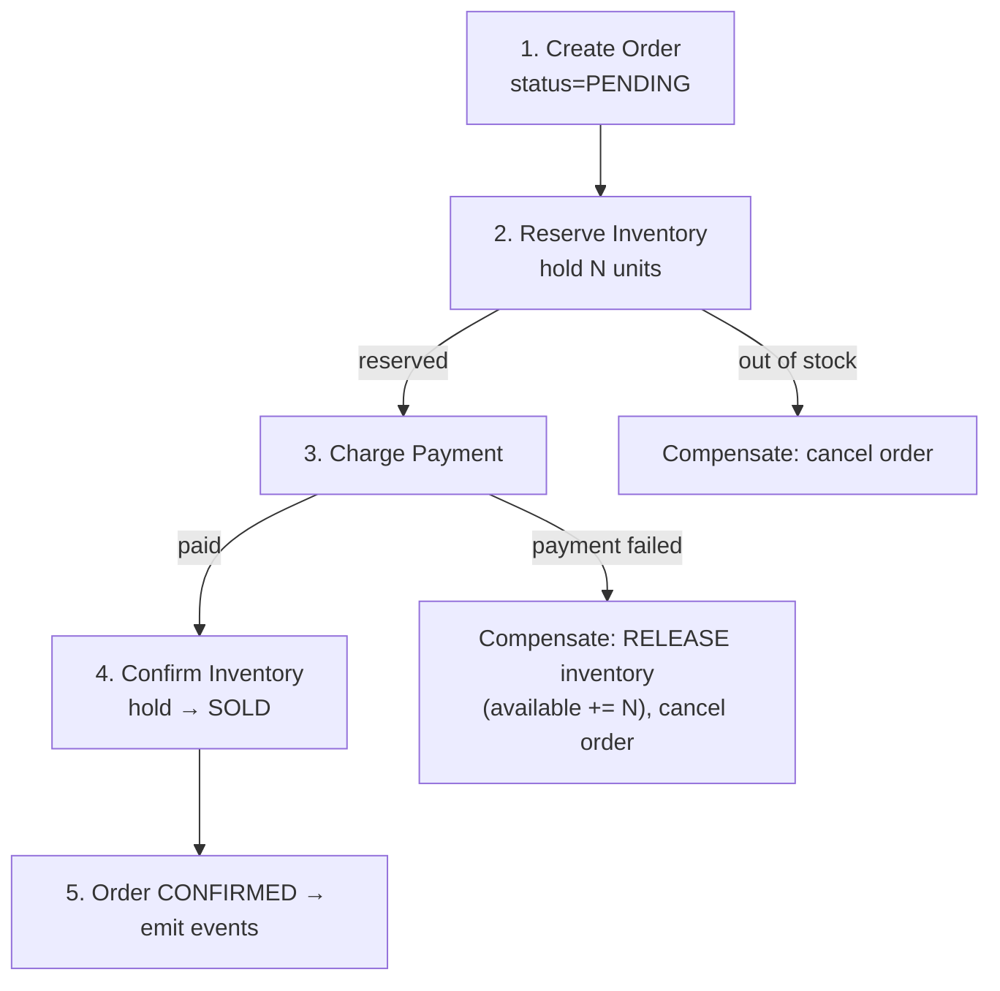
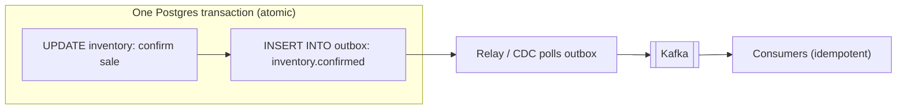

# Inventory Management — Staff/SSE System Design

**Difficulty:** Intermediate → Advanced
**Interview importance:** ⭐ **Critical** (the canonical "concurrency correctness under money" question — every e-commerce/ticketing/booking loop reduces to it)
**References:** DDIA Ch. 7 (transactions, lost updates, write skew), Ch. 9 (linearizability); Saga pattern (Garcia-Molina); Stripe/Shopify flash-sale engineering posts

---

## 0. Why This Design Matters

Inventory looks like `count = count - 1`. It is not. That one decrement sits **on the money path**, must be **atomic while thousands of buyers race for the last unit**, must **never sell what you don't have** (oversell = refunds, angry customers, canceled orders), must **not silently lock stock forever** when a buyer abandons a cart, and it spans **multiple services** (order, payment, warehouse) that fail independently. That combination is why interviewers love it: a weak candidate writes `SELECT then UPDATE` and oversells the last PlayStation to 40 people; a strong candidate talks about conditional atomic decrement, reservation TTLs, optimistic vs pessimistic locking, hot-row contention, and a saga that compensates when payment fails after stock was taken.

> The one-line thesis: **inventory is a correctness problem wearing a scale problem's clothes — you must guarantee "never oversell" as a hard invariant, then make that guarantee survive concurrency, hot SKUs, distributed warehouses, and multi-service failure.**

---

## 1. Problem Overview — Explain It Simply

Build a service that answers one question, correctly, while thousands of people race for the same item:

> **"Is there stock for this SKU right now? Hold it for me, then confirm or release it."**

The lifecycle of one unit of stock:

```text
AVAILABLE  →  (reserve)  RESERVED/HELD  →  (pay)  SOLD
                              │
                              └─(TTL expires / payment fails)→ back to AVAILABLE
```

The system prevents:

- **Overselling** — selling 101 units when only 100 exist (the cardinal sin).
- **Stuck stock** — a buyer reserves, walks away, and that unit is locked forever.
- **Double-decrement** — a retried "reserve" request taking 2 units for 1 order.
- **Lost stock** — payment succeeds but the confirm write is lost, so a real sale never decrements.

### Real-world analogy — the concert ticket hold

You pick seat 14A online. The site puts it in your cart with a **10-minute countdown** — nobody else can grab it (a **reservation with TTL**). You enter your card; if payment clears, the seat is **sold**. If you close the tab, the timer runs out and 14A goes **back on sale**. Overselling would mean two people printing tickets for 14A and one gets turned away at the door — exactly the outcome inventory design exists to prevent.

Everything else — Postgres row locks, Redis holds, sagas, warehouse sharding — is just "how do thousands of buyers agree on one shared count of seat 14A without two of them both getting it?"

---

## 2. Functional Requirements

**Core**
- **Read stock** — how many units of SKU X are available (heavy read traffic).
- **Reserve / hold** — atomically place a hold on N units with a **TTL** (before payment).
- **Confirm** — turn a hold into a permanent sale (after payment succeeds).
- **Release** — return held units to available (payment failed, cart abandoned, TTL expired).
- **Adjust** — receive stock (restock), remove stock (damage, shrinkage), correct counts.
- **Multi-warehouse** — track stock per location; allocate across warehouses.

**Optional (name them, then defer)**
- Backorders / waitlists, oversell-with-reconciliation for low-value goods, per-channel allocation (web vs store vs marketplace), safety stock buffers, promised-delivery-date calculation, real-time stock sync to storefronts.

---

## 3. Non-Functional Requirements

| Requirement | Target | Why it dominates the design |
|---|---|---|
| **Correctness (never oversell)** | **Hard invariant** for critical stock | This is *the* requirement — everything bends to it |
| Reserve/confirm latency | p99 < ~100 ms | On the checkout path; users abandon slow carts |
| Read latency | p99 < ~20 ms | Product pages hit "in stock?" constantly |
| Read throughput | 10–100× writes | Browse >> buy; reads can be cached/stale |
| Availability | 99.99% for writes | If you can't reserve, you can't sell |
| Reservation recovery | Seconds–minutes | Abandoned holds must auto-release or stock "leaks" |
| Consistency | **Strong** on decrement, **eventual** OK on display | The core trade-off |

> **Say this out loud in an interview:** *"The dominant requirement is a hard business invariant — available stock must never go negative. That single sentence forces strong consistency on the decrement path, which drives my database choice and my concurrency-control choice. Reads can be stale; the decrement cannot."*

---

## 4. Capacity Estimation (do the math — don't hand-wave)

Assume a large e-commerce catalog:

```text
SKUs (product variants) ......... 20,000,000
Orders/day (peak season) ........ 5,000,000
Reservations/day (incl. abandoned carts, ~2× orders) ... 10,000,000
Stock reads/day (browse) ........ 2,000,000,000  (2B)
```

**Write QPS (the correctness-critical path).**
```text
Reservations: 10,000,000 / 86,400 ≈ 116 reserve-writes/sec  (average)
Peak (flash sale / 10× spike)     ≈ 1,160 reserve-writes/sec
Each order = reserve + confirm/release ≈ 2–3 row writes → ~3,000 write-ops/sec at peak
```

**Read QPS (the volume path).**
```text
2,000,000,000 / 86,400 ≈ 23,000 reads/sec average
Peak at 5×                       ≈ 115,000 reads/sec
```

**What the numbers tell us:**
- **Writes are modest (~thousands/sec) but must be perfectly correct** → a single strongly-consistent relational DB (Postgres) can handle the write path. Correctness, not write throughput, is the constraint.
- **Reads are ~100× writes** → serve them from a **cache / read replica**; they can be slightly stale ("Only 3 left!" being off by one is fine; overselling is not).
- **The killer is skew, not volume.** During a flash sale, 1M buyers hit **one SKU row**. Average QPS is a lie — the **hot row** is the whole ballgame (see §11).
- **Reservations create a garbage-collection problem** — 10M holds/day, most abandoned, all with TTLs that must reliably fire or stock leaks.

**Storage is trivial:** 20M SKUs × ~a few hundred bytes ≈ single-digit GB. This is a *contention* problem, not a *storage* problem.

---

## 5. API Design

**Read stock** (hot, cacheable):
```http
GET /v1/inventory/{sku}?warehouse=all
```
```json
{ "sku": "PS5-DISC", "available": 42, "reserved": 8, "onHand": 50, "asOf": "2026-09-03T10:00:00Z" }
```

**Reserve / hold** (the correctness-critical write — **must be idempotent**):
```http
POST /v1/inventory/reserve
Idempotency-Key: order-9f3a-attempt-1
```
```json
{ "sku": "PS5-DISC", "quantity": 1, "orderId": "ORD-123", "ttlSeconds": 600 }
```
```json
{ "reservationId": "RSV-777", "status": "HELD", "expiresAt": "2026-09-03T10:10:00Z" }
```
On insufficient stock: `HTTP 409 Conflict` → `{ "status": "OUT_OF_STOCK", "available": 0 }`.

**Confirm** (hold → sold, after payment):
```http
POST /v1/inventory/confirm
```
```json
{ "reservationId": "RSV-777", "orderId": "ORD-123" }
```

**Release** (hold → available, on failure/abandon):
```http
POST /v1/inventory/release
```
```json
{ "reservationId": "RSV-777", "reason": "PAYMENT_FAILED" }
```

**Adjust** (restock / correction — control path):
```http
POST /v1/inventory/adjust
```
```json
{ "sku": "PS5-DISC", "warehouse": "WH-EAST", "delta": +100, "reason": "RESTOCK", "refId": "PO-555" }
```

> **The Idempotency-Key on reserve is a top-3 thing to mention.** Networks retry. Without it, one order's retried "reserve 1" can take 2, 3, N units. The key maps a retry to the *existing* reservation instead of creating a new one.

---

## 6. Where Does the Inventory Decision Live?



- **Read path** — product pages ask "in stock?" billions of times. Serve from **cache or read replica**; tolerate slight staleness. Never make browsing hit the authoritative row.
- **Write path ⭐** — reserve/confirm/release go through the **Inventory Service**, which owns the authoritative rows in Postgres. This is where the invariant is enforced.
- **Two paths, kept separate** — the same "hot data plane vs authoritative decision" split as any read-heavy correctness system. Reads scale horizontally; the decrement is serialized.

> **Say this out loud:** *"I split display stock from authoritative stock. The number on the product page is a cached read model — being off by one is harmless. The decrement at checkout is strongly consistent and serialized per SKU — that's where 'never oversell' is enforced."*

---

## 7. Database Selection — Why Strong Consistency Wins Here

| Store | Fits inventory? | Why |
|---|---|---|
| **PostgreSQL / MySQL** ⭐ | **Yes — the core** | ACID transactions, `SELECT … FOR UPDATE`, conditional `UPDATE … WHERE available >= N`, `CHECK (available >= 0)` constraint. The invariant is *native*. |
| **Redis** | Yes — as a **hold layer / cache**, not source of truth | Atomic `DECR`, µs latency, TTL for reservations. But async replication + no durability guarantees = don't make it the ledger for money-backed stock. |
| **Cassandra / Dynamo** | Only for **history / low-value oversell-tolerant** stock | Last-write-wins and no cross-row transactions make "never oversell" hard. Great for the *audit log* of movements, not the decrement. |
| **MongoDB** | Possible with per-doc atomic `$inc` + condition | One SKU = one document works; multi-item transactions are weaker than Postgres. |

**Why Postgres for the decrement:** the invariant "available never goes negative" is a **transactional integrity constraint**, and relational DBs were built for exactly that. A single `UPDATE inventory SET available = available - 1 WHERE sku = ? AND available >= 1` is atomic, correct under concurrency, and the DB enforces it with a row lock. You get `CHECK (available >= 0)` as a last-line safety net that makes overselling *physically impossible* even if application logic has a bug.

**Why NOT make Redis the source of truth:** Redis is perfect as a **fast reservation/hold layer** (atomic `DECRBY` with TTL for the countdown), but it replicates asynchronously and a failover can lose the last few writes. For a $500 console, losing a decrement means overselling. Pattern: **Redis holds the fast-moving reservation counter for hot SKUs; Postgres is periodically/transactionally reconciled as the durable truth** (see §11).

---

## 8. High-Level Architecture



**Three planes, kept separate:**
- **Write plane (correctness):** Order → Inventory → Postgres, transactional, serialized per SKU. The invariant lives here.
- **Read plane (scale):** Kafka events keep a cache/read-model fresh so product pages never touch the hot row.
- **Recovery plane (durability):** an **expiry worker** releases abandoned holds; a **reconciliation job** repairs drift between Redis, Postgres, and physical warehouse counts.

### The primary interview flow — draw this first



---

## 9. The Oversell Race → Atomic Conditional Decrement

The mistake that fails the interview — read then write:

```sql
-- ❌ TWO buyers both run this concurrently for the last unit
SELECT available FROM inventory WHERE sku = 'PS5';   -- both read: 1
-- ...application checks 1 >= 1, both proceed...
UPDATE inventory SET available = 0 WHERE sku = 'PS5'; -- both write 0 → SOLD TWICE
```

This is a classic **lost update** (DDIA Ch. 7). Two transactions read the same value, both decide "yes, there's stock," and one buyer's decrement is silently clobbered. Result: **oversell**.

**The fix — push the check *into* the write so the DB does it atomically under a row lock:**

```sql
UPDATE inventory
SET    available = available - :qty
WHERE  sku = :sku
AND    available >= :qty;          -- condition + write in one atomic statement
-- if rows_affected = 0  → not enough stock → reject
-- if rows_affected = 1  → reserved successfully
```

Only **one** of the two racing transactions can decrement the last unit; the other sees `available = 0`, the `WHERE available >= qty` fails, `rows_affected = 0`, and it's cleanly rejected. The DB's per-row write lock serializes them.

**Belt-and-suspenders:** add a table constraint so a bug can *never* create negative stock:
```sql
ALTER TABLE inventory ADD CONSTRAINT chk_non_negative CHECK (available >= 0);
```

> **This is *the* thing to say.** "I make the check and the decrement one atomic conditional UPDATE — `WHERE available >= qty` — so the read-modify-write can't be split. Rows-affected = 0 means out of stock. And a `CHECK (available >= 0)` makes overselling physically impossible as a safety net."

---

## 10. Concurrency Control — Optimistic vs Pessimistic

Three ways to serialize concurrent writers to the same SKU. Know when each wins.

| Approach | Mechanism | Best when | Cost |
|---|---|---|---|
| **Atomic conditional UPDATE** ⭐ | `UPDATE … WHERE available >= qty` (single statement) | Simple decrement; **default** | Retries handled by app on rows=0 |
| **Optimistic locking** | Add a `version` column; `WHERE version = :v`; retry on mismatch | **Low contention**; multi-field updates | Wasted work + retries when hot |
| **Pessimistic locking** | `SELECT … FOR UPDATE` locks the row, then update | **High contention**; complex multi-row logic | Lock waits, throughput drops on hot rows |

### Optimistic locking (compare-and-set)
```sql
SELECT available, version FROM inventory WHERE sku = 'PS5';   -- available=5, version=42
-- application computes new value
UPDATE inventory SET available = 4, version = 43
WHERE sku = 'PS5' AND version = 42;    -- if someone else moved version, rows=0 → retry
```
**Optimistic assumes conflicts are rare.** It never blocks; it just detects a conflict at write time and retries. Perfect for a warehouse where each SKU is bought occasionally. **Terrible for a flash sale** — under heavy contention almost every write hits a stale version, retries pile up, and you get a *retry storm* (see §11).

### Pessimistic locking (lock first)
```sql
BEGIN;
SELECT available FROM inventory WHERE sku = 'PS5' FOR UPDATE;  -- other txns block here
UPDATE inventory SET available = available - 1 WHERE sku = 'PS5';
COMMIT;
```
**Pessimistic assumes conflicts are common.** It takes the lock up front so no one wastes work — but everyone **queues on that one row**, so throughput on a hot SKU is bounded by how fast you can process the lock serially.



> **The staff-level line:** *"Optimistic locking is cheap when contention is low but degrades badly on a hot SKU — every writer retries against a moving version. For flash-sale hot rows I switch strategy: either a pessimistic lock to serialize cleanly, or move the hot counter into Redis / sharded sub-counters so I'm not fighting over one Postgres row at all."*

---

## 11. The Hot-Row Problem (Flash Sales) — the real hard part

Average QPS is a lie. In a flash sale, **1 million buyers hit one SKU row in 5 seconds**. Every writer serializes on that single row's lock → the row becomes a throughput bottleneck, latency spikes, and optimistic retries storm.

Four fixes, in increasing sophistication:

### 11.1 Serialize with a queue (admission control)
Put hot-SKU reserve requests on a queue / virtual waiting room. Process them **in order** against the row. Turns a stampede into a line. Buyers see "you're in the queue"; the DB sees a steady, serial stream.



### 11.2 Move the hot counter into Redis
For the *hottest* SKUs, hold the reservation counter in Redis with an **atomic `DECRBY`** (single-threaded, no lock contention, µs latency). Redis absorbs the burst; Postgres is updated **behind** it (write-behind / reconciled). Trade: a Redis failover could lose a few holds → tolerable for many goods, reconciled later; for a strict ledger, keep Postgres authoritative and use Redis only as an admission gate.

```lua
-- Atomic reserve in Redis for a hot SKU
-- KEYS[1] = "stock:{PS5}", ARGV[1] = qty
local stock = tonumber(redis.call('GET', KEYS[1]))
if stock and stock >= tonumber(ARGV[1]) then
  redis.call('DECRBY', KEYS[1], ARGV[1])
  return 1          -- reserved
else
  return 0          -- sold out
end
```

### 11.3 Shard the counter (split the hot row)
Split one SKU's stock into N sub-counters (`stock:PS5:0..9`), each holding `total/N`. A buyer hits a random shard, decrementing only that one → contention drops ~N×. Downside: **fragmentation** — a shard can show 0 while others have stock, so you need fallback ("try another shard") and periodic rebalancing. This is the same "split the celebrity key" move as a rate limiter's hot key.

### 11.4 Pre-allocate / oversell-and-reconcile (business call)
For low-value, restockable goods, some businesses **allow controlled oversell** and reconcile after — cheaper than perfect coordination. For a limited-edition drop, you do the opposite: hard strong consistency, no oversell ever. **The choice is a business decision, not a technical one** — say so.

> **Say this out loud:** *"The flash sale isn't a volume problem, it's a contention problem on one row. I don't try to make one Postgres row take a million writes — I put a queue in front to serialize, or move the hot counter to Redis / sharded sub-counters, and reconcile to the durable store. And I decide up front whether the business tolerates any oversell, because that flips the whole strategy."*

---

## 12. Reservations & TTL — Holds That Auto-Release

A reservation is a **hold with an expiry**. Without one, an abandoned cart locks stock forever ("phantom out-of-stock" — you have units but can't sell them).



**Two ways to expire holds — know both:**

1. **Lazy / on-read (TTL column):** each reservation row has `expires_at`. A background **expiry worker** periodically sweeps `WHERE status='HELD' AND expires_at < now()` and releases them (`available += qty`). Durable, works in Postgres, survives restarts.
2. **Redis TTL + keyspace notifications:** put the hold in Redis with `EXPIRE`; on expiry, an event fires to release. Fast, but Redis expiry isn't guaranteed instant and events can be missed → **still back it with the sweep job** as the source of truth.

**Critical: the release must be idempotent and safe against races.** A hold can expire *while* payment is confirming. Guard the transition with the reservation's current status:
```sql
-- Confirm only if still HELD (loses to a concurrent expiry cleanly)
UPDATE reservations SET status='SOLD'
WHERE reservation_id = :id AND status = 'HELD';
-- rows=0 → it already expired/released → handle (re-check stock or fail order)
```

> **The subtle bug interviewers probe:** the TTL fires and releases the hold at the *same moment* payment confirms. If both blindly write, you can double-release or sell released stock. Fix: make every state transition a **conditional update on current status** so exactly one of {confirm, expire} wins, and the loser is a no-op.

---

## 13. Order → Inventory → Payment: the Saga

Order, inventory, and payment are **separate services** with separate databases. You can't wrap them in one ACID transaction (no distributed 2PC in practice — it's slow and locks across services). Use a **saga**: a sequence of local transactions, each with a **compensating action** if a later step fails.



**The compensation is the whole point:** if payment fails *after* inventory was reserved, you must **release the reservation** — otherwise stock leaks. If a step's outcome is *unknown* (payment timeout — did it charge or not?), you **can't just compensate blindly**; you reconcile against the payment provider (query by idempotency key) before deciding to release or confirm.

**Two saga styles:**
- **Orchestration** (a central Order orchestrator calls each service and drives compensation) — easier to reason about, explicit state machine. Preferred for money flows.
- **Choreography** (services react to each other's events) — more decoupled, but the failure/compensation logic is scattered and hard to follow.

> **Staff-level nuance:** *"The dangerous case isn't 'payment failed' — that's a clean compensate-and-release. It's 'payment timed out, outcome unknown.' There I don't blindly release the stock or blindly confirm; I reconcile with the payment provider using the order's idempotency key, then either confirm the sale or release the hold. Compensation must be idempotent because I might retry it."*

---

## 14. Guaranteeing the Event: the Outbox Pattern

After confirming a sale, you must tell the world (update search index, storefront count, analytics, shipping). The trap: **write to DB, then publish to Kafka** — if the process crashes *between* the two, the sale committed but the event never fired (or fires twice). This is the **dual-write problem**.

**Fix — Transactional Outbox:** in the *same DB transaction* that confirms the sale, insert an event row into an `outbox` table. A separate relay (or CDC like Debezium) reads the outbox and publishes to Kafka **at-least-once**. Because the sale and the outbox row commit atomically, the event can never be lost.



Consumers must be **idempotent** (at-least-once means duplicates) — dedupe on the event's `reservationId` / event id.

---

## 15. Distributed Inventory Across Warehouses

One SKU, stock in many warehouses. Two models:

- **Per-warehouse rows** (`inventory(sku, warehouse, available)`): total availability = `SUM(available)`. Reserving picks a warehouse (nearest, cheapest to ship, most stock). **Naturally shards contention** — 5 warehouses = 5 rows for one SKU = 5× the write throughput before the row is hot.
- **Global logical pool** with allocation: one number, allocated to fulfillment centers on confirm. Simpler total, but recreates the single-hot-row problem.

**Allocation is a strategy** (nearest, load-balanced, split-shipment). Reserving *across* warehouses (2 units here, 1 there) is a **multi-row transaction** — do it in one DB transaction if same DB, or a mini-saga across warehouse services with compensation if separate.

> **Nice framing:** *"Splitting stock across warehouses isn't just for shipping — it's free contention relief. Five warehouse rows for one SKU means five locks instead of one, so a hot SKU is 5× less hot before I need heavier machinery."*

---

## 16. Consistency: Strong Where It Counts, Eventual Where It's Free

The single most important trade-off, stated crisply:

| Path | Consistency | Why |
|---|---|---|
| **Reserve / confirm decrement** | **Strong (linearizable per SKU)** | Overselling is unacceptable; must serialize |
| **Product-page "in stock?"** | **Eventual** (cached, may lag seconds) | Off-by-one on display is harmless |
| **"Only 3 left!" urgency badge** | **Eventual** | Approximate is fine, even desirable |
| **Cross-warehouse total** | Eventual on display, strong on allocate | Sum can lag; the actual take is transactional |
| **Analytics / reorder signals** | Eventual | Not on the money path |

> **The sentence to remember:** *"Consistency follows the business invariant, not the technology. The decrement is strongly consistent because 'never oversell' is a hard invariant. Everything a customer merely *sees* can be eventually consistent — a stale count is a cosmetic bug; a negative count is a financial one."*

---

## 17. Reconciliation — Trust, but Verify

Distributed state drifts: Redis holds diverge from Postgres, warehouse physical counts differ from the system ("shrinkage," miscounts, lost writes on failover). You need a **reconciliation job** — the safety net that makes "eventually correct" true.

- **Redis ↔ Postgres:** periodically compare the hot-SKU counter to the authoritative row; repair drift (Postgres wins for durable truth).
- **System ↔ physical (cycle counts):** warehouses physically recount SKUs on a rotating schedule; corrections flow in as `adjust` events. The system count is *authoritative for selling*, but reality is authoritative overall.
- **Idempotency ledger:** every movement (reserve, confirm, release, adjust) is an append-only event with a unique id, so you can **replay and audit** to explain any count. This is how you observe *correctness*, not just availability.

> **Say this:** *"In distributed inventory, drift is not an if, it's a when. I run reconciliation to detect and repair divergence between Redis, Postgres, and physical counts, and I keep an append-only movement ledger so any stock number is auditable and replayable."*

---

## 18. Failure Scenarios

| Failure | Handling |
|---|---|
| Two buyers, last unit | Atomic conditional `UPDATE … WHERE available >= qty`; only one succeeds, other gets rows=0 → OUT_OF_STOCK |
| Payment fails after reserve | Saga compensation: release the hold, `available += qty` |
| Payment outcome unknown (timeout) | Reconcile with provider by idempotency key before confirm/release — never blind-compensate |
| Reserve request retried | Idempotency-Key maps retry to existing reservation → no double-decrement |
| Expiry worker crashes | Holds have durable `expires_at`; next worker run sweeps them; work is idempotent |
| Confirm write lost after payment | Outbox + retry; reconciliation catches a paid order with no confirmed hold |
| Inventory service crashes mid-saga | Order orchestrator resumes from saga state; each step idempotent |
| Kafka down | Outbox buffers durably in Postgres; relay drains when Kafka recovers |
| Redis (hot counter) fails | Fall back to Postgres for the hot SKU; reconcile Redis on recovery |
| Postgres primary down | Failover to replica; brief write unavailability; **fail closed** on decrement (better to reject a sale than oversell) |
| Hot SKU (flash sale) | Queue/serialize, Redis counter, or sharded sub-counters (§11) |
| TTL fires during confirm | Conditional status transition — exactly one of {confirm, expire} wins |
| Duplicate Kafka event | Idempotent consumers dedupe on event id / reservationId |

> **Note the fail-closed default on the decrement:** unlike a rate limiter (which often fails *open* for availability), inventory usually **fails closed** — if you can't verify stock strongly, **reject the sale**. An oversell is worse than a lost sale.

---

## 19. Data Model (clean, minimal)

```sql
inventory (
  sku          TEXT,
  warehouse    TEXT,
  available    INT NOT NULL,     -- sellable now
  reserved     INT NOT NULL,     -- held, not yet sold
  on_hand      INT NOT NULL,     -- physically present = available + reserved (+sold-not-shipped)
  version      BIGINT NOT NULL,  -- optimistic locking
  PRIMARY KEY (sku, warehouse),
  CHECK (available >= 0)         -- oversell = physically impossible
);

reservations (
  reservation_id  UUID PRIMARY KEY,
  sku             TEXT,
  warehouse       TEXT,
  quantity        INT,
  order_id        TEXT,
  status          TEXT,          -- HELD | SOLD | RELEASED | EXPIRED
  idempotency_key TEXT UNIQUE,   -- retry-safe reserve
  expires_at      TIMESTAMPTZ,   -- TTL
  created_at      TIMESTAMPTZ
);

inventory_ledger (                -- append-only audit / reconciliation
  event_id    UUID PRIMARY KEY,
  sku         TEXT, warehouse TEXT,
  delta       INT,               -- +restock / -sale / ±adjust
  type        TEXT,              -- RESERVE | CONFIRM | RELEASE | ADJUST
  ref_id      TEXT,
  created_at  TIMESTAMPTZ
);

outbox (                          -- transactional event publishing
  id UUID PRIMARY KEY, topic TEXT, payload JSONB, published BOOLEAN, created_at TIMESTAMPTZ
);
```

---

## 20. Low-Level Design (clean OO)

```java
interface InventoryService {
    Reservation reserve(String sku, int qty, String idempotencyKey);  // atomic conditional decrement
    void confirm(String reservationId);                                // HELD → SOLD
    void release(String reservationId, String reason);                 // HELD → RELEASED
    void adjust(String sku, String warehouse, int delta, String reason);
}

interface ConcurrencyStrategy {          // Strategy: swap per SKU heat
    boolean tryDecrement(String sku, int qty);
}
// AtomicConditionalUpdate | OptimisticLock | PessimisticLock | RedisCounter

interface ReservationStore { ... }        // DIP: depend on abstraction, not Postgres/Redis
class ReservationExpiryWorker { ... }     // sweeps expired holds (idempotent)
class SagaOrchestrator { ... }            // drives reserve→pay→confirm + compensation
```

**Patterns worth naming:**
- **State Machine** — reservation lifecycle (HELD → SOLD/RELEASED/EXPIRED) with conditional transitions.
- **Saga** — order→inventory→payment with compensating releases.
- **Strategy** — pick concurrency control (atomic / optimistic / pessimistic / Redis) by SKU heat.
- **Outbox** — atomic DB write + reliable event publish.
- **Idempotency** — retry-safe reserve via unique key.

---

## 21. Trade-Offs to Say Out Loud

| Axis | Option A | Option B | Choose by |
|---|---|---|---|
| Consistency | Strong (serialize decrement) | Eventual (fast, may oversell) | Value of the item / oversell tolerance |
| Concurrency control | Optimistic (no blocking) | Pessimistic (`FOR UPDATE`) | Contention level (cold SKU vs hot) |
| Hot SKU | One Postgres row | Redis counter / sharded sub-counters / queue | Flash-sale scale vs simplicity |
| Source of truth | Postgres (durable, correct) | Redis (fast, lossy on failover) | Money-backed vs cheap/restockable |
| Warehouses | Per-warehouse rows (shards heat) | Global pool (simple total) | Contention relief vs simplicity |
| Failure mode | Fail closed (reject sale) | Fail open (allow, reconcile) | Oversell cost vs lost-sale cost |
| Cross-service txn | Saga (compensations) | 2PC (blocking, strong) | Availability vs coordination |
| Reservation expiry | Sweep job (durable) | Redis TTL (fast, lossy) | Durability vs latency (use both) |

---

## 22. Interview Q&A

**Beginner**

**Q: Two buyers want the last item — how do you prevent overselling?**
One atomic conditional update: `UPDATE inventory SET available = available - 1 WHERE sku = ? AND available >= 1`. The DB row lock serializes them; exactly one gets rows-affected = 1, the other gets 0 and is rejected. I also add `CHECK (available >= 0)` so overselling is physically impossible even with an app bug.

**Q: Why reserve before payment instead of just decrementing at payment?**
Payment can take seconds and can fail. Reserving places a hold so no one else takes that stock while the buyer pays, but a hold has a TTL so abandoned carts release the stock. Reserve → pay → confirm/release is the standard lifecycle.

**Q: Why Postgres and not Redis as the source of truth?**
The invariant "never oversell" is a transactional integrity constraint — relational DBs do that natively with conditional updates, row locks, and CHECK constraints. Redis replicates asynchronously and a failover can lose writes; I use it as a fast hold layer for hot SKUs, not as the durable ledger for money-backed stock.

**Intermediate**

**Q: Optimistic vs pessimistic locking here — when each?**
Optimistic (version column, compare-and-set, retry) is great for low-contention SKUs and never blocks. But on a flash-sale hot row it degrades badly — every writer retries against a moving version, causing a retry storm. There I use pessimistic `SELECT FOR UPDATE` to serialize cleanly, or move the counter out of Postgres entirely.

**Q: The reservation TTL fires at the same moment payment confirms — what breaks?**
A double-release or selling released stock. I guard every transition with a conditional update on current status: `UPDATE reservations SET status='SOLD' WHERE id=? AND status='HELD'`. Exactly one of {confirm, expire} wins; the loser is a no-op with rows=0, which I handle.

**Q: Payment fails after you reserved stock — now what?**
Saga compensation: release the hold, `available += qty`, cancel the order. Compensation must be idempotent since I may retry it.

**Advanced / Staff**

**Q: A flash sale sends a million buyers at one SKU row. How do you survive?**
It's a contention problem, not a volume one. I don't make one Postgres row take a million writes. I put a queue / virtual waiting room in front to serialize into a steady stream, and for the hottest SKUs I move the counter into Redis (atomic DECRBY, no lock contention) or shard the stock into N sub-counters to spread the lock. Postgres is reconciled behind as durable truth. And I decide up front whether the business tolerates any oversell, because that flips the strategy.

**Q: Payment times out — you don't know if the card was charged. Reserve is still held. What do you do?**
The dangerous unknown-outcome case. I don't blindly release (might have paid) or blindly confirm (might not have). I reconcile with the payment provider by the order's idempotency key to learn the real outcome, then confirm or release accordingly.

**Q: The sale committed but the "stock changed" event to Kafka was lost. How do you prevent that?**
Dual-write problem. I use the transactional outbox: in the same transaction that confirms the sale, I insert an event row into an outbox table. A relay/CDC publishes it at-least-once. Since sale and outbox commit atomically, the event can't be lost; consumers are idempotent to tolerate duplicates.

**Q: How do you know your counts are actually correct over time?**
Reconciliation. I compare Redis hot-counters to Postgres and repair drift, run warehouse cycle counts that feed adjust events, and keep an append-only movement ledger so any number is auditable and replayable. I observe correctness (ledger consistency), not just availability.

---

## 23. 30-Second Interview Answer

> "The dominant requirement is a hard invariant — never oversell — so the decrement path is strongly consistent, and I put the source of truth in **Postgres**. The core move is an **atomic conditional update**: `UPDATE … SET available = available - qty WHERE sku = ? AND available >= qty`, plus a `CHECK (available >= 0)` safety net, so two buyers racing for the last unit can't both win. Checkout is **reserve → pay → confirm/release**: reserving places a **hold with a TTL** so abandoned carts auto-release via an expiry worker, and every state transition is a conditional update so a TTL expiry and a payment confirm can't both fire. Across services it's a **saga** — if payment fails after reserving, I compensate by releasing the hold; if payment's outcome is unknown, I reconcile with the provider before deciding. I publish stock-change events via a **transactional outbox** so the sale and its event commit atomically. Reads (product-page stock) come from a **cache/replica** and can be eventually consistent — off-by-one on display is harmless. The real hard part is the **flash-sale hot row**: I serialize with a queue, or move the counter to **Redis / sharded sub-counters**, and reconcile to Postgres. And unlike a rate limiter, inventory **fails closed** — I'd rather reject a sale than oversell."

---

## 24. Mental Model

```text
STOCK UNIT LIFECYCLE
   AVAILABLE ──reserve──▶ HELD ──confirm──▶ SOLD
        ▲                  │
        └──release/expire──┘

INVARIANT   → available never negative (CHECK + atomic conditional UPDATE)
TRUTH       → Postgres (durable); Redis = fast hold layer for hot SKUs
CONCURRENCY → atomic conditional UPDATE (default)
              optimistic (cold) | pessimistic FOR UPDATE (hot) | Redis/shard (flash sale)
RESERVE     → hold + TTL; expiry worker sweeps; conditional status transitions
CROSS-SVC   → Saga (reserve→pay→confirm) with compensating release
UNKNOWN PAY → reconcile with provider, never blind-compensate
EVENTS      → transactional Outbox → Kafka (at-least-once, idempotent consumers)
READS       → cache/replica, eventually consistent (off-by-one is fine)
HOT ROW     → queue | Redis DECRBY | sharded sub-counters | (oversell+reconcile = business call)
DRIFT       → reconciliation job + append-only ledger
FAILURE     → fail CLOSED (reject sale > oversell)
```

---

## 25. How This Connects to Other Topics

- **Rate limiter (hot keys)** — the flash-sale hot SKU is the *exact same* celebrity-key problem: one shared counter under massive concurrency. Sharded sub-counters and local admission are the same "handle the head of the distribution differently" move.
- **Distributed transactions (DDIA Ch. 7–9)** — the oversell race is a textbook **lost update**; the atomic conditional UPDATE is single-row linearizability; the saga is how you get correctness *without* distributed 2PC.
- **Message queues & outbox** — reliable event publishing (dual-write problem) is identical to any "commit DB then emit event" system; outbox + CDC is the standard fix.
- **Idempotency** — retry-safe reserve is the same idempotency-key pattern as payments; at-least-once Kafka forces idempotent consumers everywhere.
- **CAP / consistency trade-offs** — "strong on decrement, eventual on display" is CAP in miniature: you buy availability and scale on the read path by relaxing consistency exactly where the business invariant permits.
- **Booking / ticketing / seat selection** — reservations with TTL are the same mechanism as holding a concert seat, a flight seat, or a hotel room; the whole design transfers directly.
