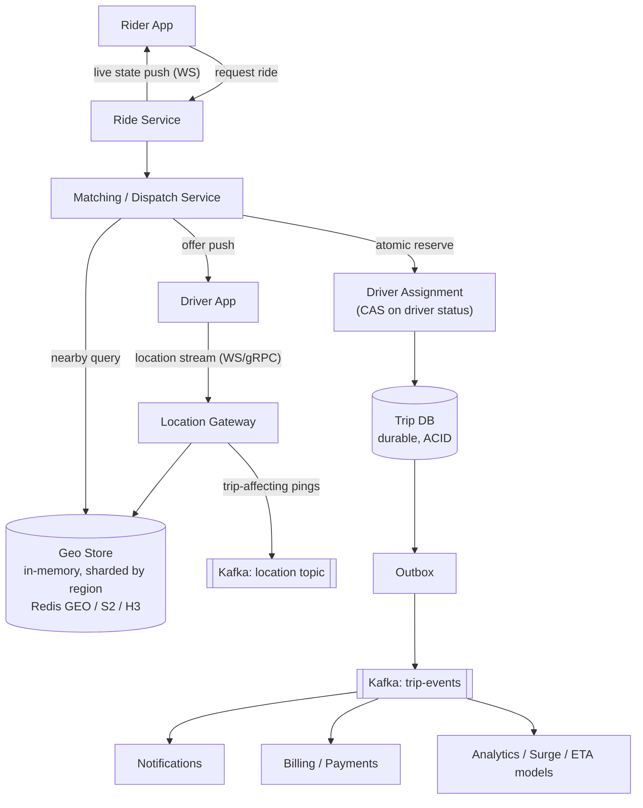
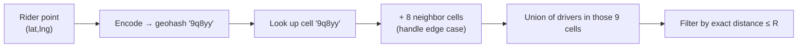
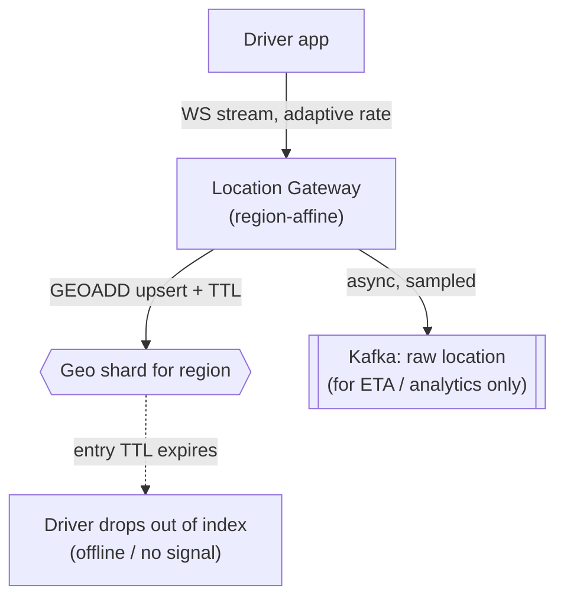
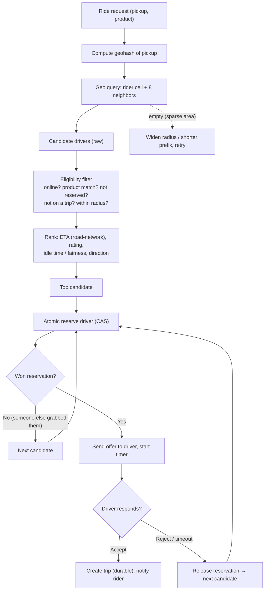
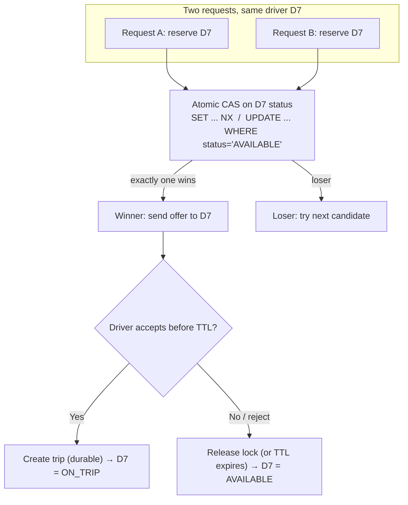
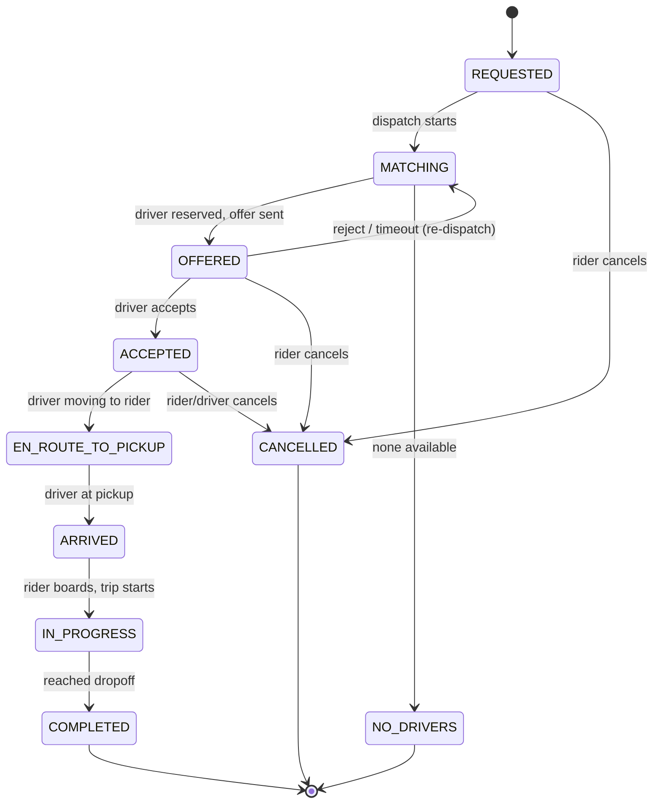
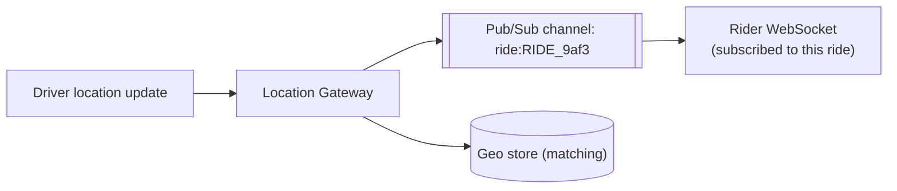
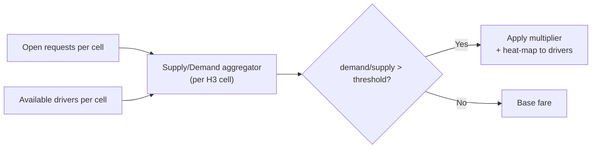
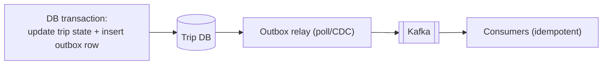

# Ride Matching / Uber — Staff/SSE System Design

**Difficulty:** Advanced
**Interview importance:** ⭐ **Critical** (the canonical geospatial + real-time + concurrency question; tests location indexing, high write ingest, and atomic assignment all at once)
**References:** Alex Xu — *System Design Interview* Vol 2, Ch 1–3 (*Proximity Service*, *Nearby Friends*, *Google Maps*); Uber Engineering blog (H3, Ringpop, Marketplace); DDIA Ch. 5–9 (replication, partitioning, consistency)

---

## 0. Why This Design Matters

Ride matching *looks* like "find the closest driver" — a distance sort. It is not. Three hard problems collide in one system:

1. **A firehose of writes** — millions of drivers each pushing GPS every few seconds. You cannot `UPDATE` a relational row per ping.
2. **A geospatial read** — "who is near this rider *right now*?" over a set that changes every second. A naive `WHERE distance < 3km` scans every driver on Earth.
3. **A correctness invariant** — one driver must never be assigned to two riders at the same instant. That's a distributed race under contention.

A weak candidate stores locations in Postgres and does a full-table distance scan. A strong candidate reaches for a **spatial index** (geohash / S2 / H3 / QuadTree), keeps hot location state **in memory**, and makes the assignment **atomic** with a compare-and-set. Everything else — surge, ETA, streaming — hangs off that spine.

> The one-line thesis: **ride matching is a high-write geospatial index feeding a low-latency nearby-query, terminated by an atomic single-winner assignment.** Get those three right and the rest is plumbing.

---

## 1. Problem Overview — Explain It Simply

Build a system that continuously answers:

> **"A rider is standing here and wants a car. Which nearby driver do we give them — and how do we make sure no one else grabs that driver first?"**

Two populations, moving in opposite directions:

- **Supply (drivers):** constantly *report* where they are. Millions of small writes per second.
- **Demand (riders):** occasionally *ask* for a car. Fewer, but latency-sensitive reads that must return in a second or two.

The system must:
- Ingest driver locations at massive write rate.
- Given a rider's pickup point, find nearby *eligible* drivers fast.
- Rank them (ETA, rating, vehicle type) and **dispatch** one.
- Guarantee **exactly one** driver per request — no double-booking.
- Stream live location so rider and driver see each other move.
- Drive a **trip through a state machine** (requested → matched → arrived → in-progress → completed).

### Real-world analogy — the taxi dispatcher with a pin-board

Imagine an old dispatcher with a **map divided into grid squares** and pins for each free cab. When a call comes in, they don't scan the whole city — they **look only at the caller's square and the eight around it**, pick the nearest cab, and **physically move that pin to "busy"** so no other operator hands out the same cab.

- The **grid squares** = the spatial index (geohash / S2 / H3 cells).
- **Look at my square + neighbors** = the bounded nearby-query.
- **Move the pin to busy, atomically** = the compare-and-set that prevents double-dispatch.

Everything technical below is just "how do thousands of dispatchers share one pin-board that updates a million times a second, without two of them grabbing the same cab?"

---

## 2. Functional Requirements

**Core**
- Drivers go **online / offline** and stream **location updates**.
- Riders **request a ride** from a pickup point (+ destination, vehicle type).
- **Find nearby eligible drivers** and **match** one.
- **Atomic assignment** — a driver can hold at most one active offer/trip.
- Driver **accepts / rejects / times out**; on reject, re-dispatch.
- **Live tracking** — rider sees driver approach; both see route.
- **Trip lifecycle** to completion, then fare + payment.

**Optional (name them, then defer)**
- Surge pricing, pooled/shared rides, scheduled rides, ETA prediction, driver-preference matching, batched (windowed) matching, heat-map for driver repositioning.

---

## 3. Non-Functional Requirements

| Requirement | Target | Why it dominates the design |
|---|---|---|
| Match latency | **p99 < 1–2 s** end-to-end | A rider staring at a spinner churns; matching must feel instant |
| Location ingest | **~1M+ writes/sec** | Forces "don't touch the SQL DB per ping" — in-memory geo store |
| Nearby-query latency | **< 100 ms** | It's inside the match path; must be a bounded index lookup, not a scan |
| Assignment correctness | **Exactly-once per driver** | Double-booking is a business-breaking bug → needs atomicity |
| Availability | **99.99%** for matching | Downtime = no rides = direct revenue loss |
| Location freshness | **Seconds** | Stale driver position → bad ETAs and mis-dispatch |
| Durability | Trip/payment state **must survive crashes** | Location can be lossy; money and trip records cannot |

> **Say this out loud:** *"Two data classes with opposite needs — driver location is high-volume, ephemeral, loss-tolerant; trip and payment state is lower-volume, durable, correctness-critical. I store them in different systems on purpose."* That one sentence frames the entire design.

---

## 4. Capacity Estimation (do the math — don't hand-wave)

Assume a large market:

```text
Online drivers (peak)        = 5,000,000
Location update interval     = every 4 s
→ Location writes/sec        = 5,000,000 / 4 = 1,250,000 writes/sec  (~1.25M/s)
```

**That number is the headline.** 1.25M writes/sec into a relational DB is a non-starter (lock contention, WAL amplification, replication lag). Location must go to an **in-memory geo store** with cheap upserts.

**Batching cuts it further.** If clients batch and send every **8 s** instead of 4 s, ingest halves to ~625K/s. Uber/Maps do exactly this — adaptive reporting frequency (faster when moving/near a job, slower when idle).

**Ride requests are tiny by comparison:**
```text
Daily rides         = 20,000,000
Average requests/sec = 20,000,000 / 86,400 ≈ 230/s
Peak (5×)            ≈ 1,150/s
```
So **reads (matches) are ~1,000/s; writes (locations) are ~1,000,000/s** — a **1000:1 write:read ratio** on the location store. Design for writes.

**Memory for the geo index:**
```text
Per driver: driverId(16 B) + lat/lng(16 B) + geo-cell + status + overhead ≈ ~100 B
5,000,000 drivers × 100 B ≈ 500 MB   → fits comfortably in RAM on a sharded Redis/geo cluster
```

**What the numbers tell us:**
- Location = **in-memory, sharded, TTL'd** (a driver who stops pinging should expire out).
- The nearby-query must be **O(cells) not O(drivers)** — hence a spatial index.
- Assignment volume is small, so we can afford **strong consistency** there (it's ~1K/s, not 1M/s).
- **Shard the geo store by region** so a city's write load spreads across nodes.

---

## 5. API Design

**Driver location update** (the firehose — keep it tiny, fire-and-forget over a persistent connection):
```http
POST /v1/drivers/{driverId}/location      # or a WebSocket/gRPC stream frame
```
```json
{ "lat": 37.7749, "lng": -122.4194, "heading": 210, "speed": 12.4, "ts": 1725350400123 }
```
```json
{ "ack": true }
```

**Rider requests a ride:**
```http
POST /v1/rides
```
```json
{ "riderId": "R42", "pickup": {"lat": 37.776, "lng": -122.417},
  "dropoff": {"lat": 37.802, "lng": -122.448}, "productType": "UBERX" }
```
```json
{ "rideId": "RIDE_9af3", "status": "MATCHING", "etaSeconds": null }
```

**Driver accepts an offer** (the atomic step):
```http
POST /v1/rides/{rideId}/accept
```
```json
{ "driverId": "D7", "offerId": "OFF_1b2c" }
```
```json
{ "accepted": true, "pickupEtaSeconds": 240 }   // or { "accepted": false, "reason": "OFFER_EXPIRED" }
```

**Poll / stream ride state** (rider app; usually a WebSocket, REST shown for clarity):
```http
GET /v1/rides/{rideId}
```
```json
{ "rideId": "RIDE_9af3", "status": "EN_ROUTE_TO_PICKUP",
  "driver": {"lat": 37.774, "lng": -122.420, "etaSeconds": 180} }
```

> **Interview note:** location updates should ride a **persistent connection** (WebSocket/gRPC), not a fresh HTTPS POST each time — at 1M/s, TCP/TLS handshake overhead per ping would dwarf the payload.

---

## 6. High-Level Architecture



**Three planes, kept separate:**
- **Location plane (firehose):** Driver → Location Gateway → in-memory Geo Store. Loss-tolerant, never touches SQL per ping.
- **Matching plane (correctness):** Ride Service → Matching → nearby-query → **atomic assignment** → durable Trip DB.
- **Event plane (async):** Trip DB → Outbox → Kafka → notifications, billing, analytics, surge/ETA models. Nothing on the critical match path blocks on these.

---

## 7. The Geospatial Index — the Heart of the Design

The core problem: **"find drivers within R km of a point"** without scanning every driver. You need a **spatial index** that turns 2-D proximity into a 1-D lookup. Four standard choices:

| Index | Idea | Shape of cells | Adapts to density? | Range query | Where used |
|---|---|---|---|---|---|
| **Geohash** | Interleave lat/lng bits → base-32 string; **shared prefix = nearby** | Fixed grid (rectangles) | No (fixed precision) | Prefix match + 8 neighbors | Redis GEO, many DBs |
| **S2 (Google)** | Project sphere onto cube, Hilbert-curve cell IDs (64-bit) | Near-equal-area cells | Levels give control | Cell-range covering | Google, older Uber |
| **H3 (Uber)** | **Hexagonal** grid, 16 resolutions | Hexagons (uniform neighbor distance) | Yes, by resolution | Ring/disk of hexes | **Uber Marketplace** |
| **QuadTree** | Recursively split space into 4 quadrants until few points per cell | Adaptive rectangles | **Yes** (splits where dense) | Tree descent + neighbor cells | In-memory proximity services |

### 7.1 Geohash — the one to explain first

A geohash encodes `(lat, lng)` into a string like `9q8yy`. Key property: **longer prefix = smaller area**, and **points that share a prefix are physically close**.

```text
9q8yy  ≈ a ~150 m × 150 m cell
9q8y   ≈ a ~1.2 km × 0.6 km cell
9q8    ≈ a ~40 km cell
```

So "drivers near me" ≈ "drivers whose geohash shares my prefix."



**The edge-case bug you must mention:** a rider standing at the *border* of a cell has near drivers just across the line in an adjacent cell. If you query only the rider's own cell, you miss them. **Fix:** always query the rider's cell **plus its 8 neighbors** (a 3×3 block), then filter by true distance. (Hexagons in H3 make this cleaner — 6 uniform neighbors, no corner ambiguity.)

**Choosing precision:** pick a cell size ≈ your search radius. Too coarse → each cell holds thousands of drivers (you scan too many). Too fine → you must union many cells to cover the radius. A common trick: **expand the prefix length until you have enough candidates** (start tight, widen if the cell is sparse — e.g. rural areas).

### 7.2 QuadTree — when density is wildly uneven

Downtown has 10,000 drivers per km²; the suburbs have 5. A fixed grid wastes cells in empty areas and overloads cells downtown. A **QuadTree** splits a cell into 4 children **only when it exceeds a capacity** (say 100 points), so dense areas get deep, fine-grained cells and sparse areas stay coarse. Great adaptive behavior; cost is it's an in-memory tree that must be **rebuilt/rebalanced** as points move — heavier to update than a flat geohash upsert.

### 7.3 Why H3 (hexagons) for a modern answer

Uber uses **H3**. Hexagons have a huge practical win: **every neighbor is equidistant** (6 neighbors, all the same center-to-center distance), whereas a square grid has 4 edge-neighbors (near) and 4 corner-neighbors (farther) — messy for "expand the search ring by one." Hex rings (`k`-ring: all cells within `k` steps) give clean, uniform radius growth for surge zones and supply/demand aggregation.

> **Interview line:** *"I'd index driver locations with geohash for simplicity, or H3 if I want uniform neighbor distance for surge zones. Query the rider's cell plus neighbors to avoid the border miss, then filter by exact haversine distance. For very uneven density I'd consider a QuadTree since it adapts to hot areas."*

---

## 8. High-Write Location Handling — the Firehose

1.25M location writes/sec is the write problem. Principles:

- **Never write locations to the SQL DB.** They're ephemeral (only the *latest* matters) and loss-tolerant (miss one ping, the next arrives in 4 s).
- **In-memory geo store, upsert-in-place.** Redis `GEOADD` (a sorted set keyed by geohash score) or a purpose-built S2/H3 store. Each ping is an O(log n) upsert overwriting the driver's previous position — no history kept in the hot path.
- **Shard the geo store by region.** A driver in SF only ever touches the SF shard, so 1.25M global writes spread across shards; no single node sees the whole firehose. Route by geo-cell prefix → shard.
- **Persistent connections + gateways.** Drivers hold a WebSocket/gRPC stream to a **Location Gateway** that batches and writes to the geo store. This amortizes connection cost and lets you apply **backpressure**.
- **TTL / heartbeat expiry.** Each driver entry has a short TTL (e.g. 30 s). A driver who goes offline or loses signal simply **expires out** of the index — no explicit cleanup, and you never dispatch a ghost driver.
- **Adaptive reporting.** Idle/parked drivers report slowly; drivers en route to a pickup report fast. Cuts ingest by a large factor.



> **Why a copy to Kafka?** The **hot** geo store keeps only *latest* position for matching. But ETA models, heat-maps, and trip-replay want the *history*. Fork a **sampled** stream to Kafka for those consumers — off the match path.

---

## 9. The Matching / Dispatch Flow



**Ranking is not just distance — it's ETA over the road network.** Two drivers 500 m away: one across a river with no bridge nearby (8 min), one on your street (2 min). Straight-line distance lies; rank by **estimated time of arrival** using a routing engine (A\* over road-graph tiles) or a precomputed ETA service. Distance is a cheap pre-filter; ETA is the real ranker.

**Batched (windowed) matching — a staff-level upgrade.** Instead of greedily matching each request the instant it arrives (first-come-first-served, locally optimal), collect requests over a **short window (a few seconds)** and solve a **global assignment** (bipartite matching / Hungarian-style) minimizing total wait. This avoids the greedy trap where an early rider steals the only driver a much closer rider needed. Uber's marketplace does batch-style optimization. Trade-off: adds a few seconds of latency for globally better matches.

---

## 10. Atomic Assignment — No Double-Booking

The invariant: **a driver holds at most one active offer/trip.** Two riders may target the same nearby driver simultaneously. Without atomicity, both offers go out, both drivers "accept," and you've double-booked.

**The race:**
```text
Request A: sees D7 AVAILABLE
Request B: sees D7 AVAILABLE
A: sets D7 = RESERVED
B: sets D7 = RESERVED   ← both "succeed" → D7 double-booked ❌
```

**Fix — compare-and-set (single-winner).** Reserve the driver with a conditional update that only one request can win:

- **Redis:** `SET driver:D7:lock <offerId> NX PX 15000` — `NX` = set only if absent, `PX` = auto-expire (so a crashed matcher's lock frees itself). Exactly one request gets `OK`; the rest get nil and move to the next candidate.
- **SQL:** `UPDATE drivers SET status='RESERVED', ride_id=:r WHERE id='D7' AND status='AVAILABLE'` — the `WHERE status='AVAILABLE'` clause makes it a CAS; `rows_affected = 1` means you won, `0` means you lost.



**Why the TTL matters:** if the matcher crashes after reserving but before the driver responds, a bare lock would strand the driver forever. The `PX`/lease expiry **self-heals** — the reservation auto-releases and the driver returns to the pool. This is the same "lease, don't lock" principle as distributed locks generally.

**Where does the authoritative status live?** The **durable Trip DB** is the source of truth for a *committed* trip (money depends on it). The **Redis lock** is a fast, short-lived *reservation* to win the race cheaply; on accept, you commit the trip to the DB inside a transaction. Redis handles the high-contention reservation; the DB handles durability.

---

## 11. Trip State Machine

A trip is a **finite state machine**. Modeling it explicitly (not as ad-hoc booleans) is what prevents illegal transitions (e.g. completing a trip that was never accepted) and makes recovery deterministic.



**Why this matters in the interview:**
- **Legal transitions only.** Reject nonsense like `COMPLETED → IN_PROGRESS`. Enforce with a transition table + a guarded update (`UPDATE ... WHERE status = <expected>`), which also gives you optimistic concurrency for free.
- **Each transition emits an event** (via the outbox) → billing starts the meter on `IN_PROGRESS`, notifications fire on `ARRIVED`, analytics record dwell times.
- **Cancellation is a first-class path**, allowed only from certain states, sometimes with a fee (state decides).
- **Recovery is deterministic:** on crash, the persisted state tells you exactly where to resume.

---

## 12. Real-Time Location Streaming

Once matched, rider and driver must **see each other move**. This is a fan-out/pub-sub problem, not a matching problem.



- Use **WebSockets** (or SSE) rider↔server — a persistent channel to push driver position without polling.
- **Scope the fan-out to the trip.** During a trip, only *that rider* needs *that driver's* position. One pub/sub channel per active ride (`ride:{id}`) keeps fan-out tiny — unlike "nearby friends," which fans out to many subscribers.
- **Connection routing.** With millions of live sockets, a **gateway layer** (e.g. Ringpop/consistent-hash membership) maps a ride to the server holding both sockets, or a shared pub/sub bus bridges them.
- **Client-side smoothing.** Send position every few seconds; the app **interpolates** movement between points so the car glides instead of teleporting. Saves bandwidth without hurting UX.

---

## 13. ETA & Surge (basics — know the shape, don't over-build)

**ETA** = time to arrival over the *road network*, not straight-line distance.
- Model the map as a **graph** (nodes = intersections, edges = road segments weighted by real-time travel time). Shortest path via **A\*** or precomputed contraction hierarchies over **map tiles**.
- Real systems learn edge weights from historical + live speed data (traffic). For matching, an **approximate ETA service** ranks candidates; exact routing runs once, for the chosen driver.

**Surge (supply/demand balancing)** — a pricing lever, not core to matching, but expect the question:
- Aggregate **supply (available drivers)** and **demand (open requests)** per **geo cell** (H3 hexes are ideal). When demand/supply in a cell exceeds a threshold, apply a **multiplier**.
- Purpose: (1) **ration** scarce supply to highest-value riders, (2) **incentivize** drivers to move toward hot cells (shown as a heat-map). It's a **feedback loop** computed off the analytics stream, pushed to pricing at request time.



---

## 14. Consistency Model — Match It to the Data

The whole design is about giving **each data class the consistency it deserves**:

| Data | Consistency | Store | Why |
|---|---|---|---|
| Driver location | **Eventual / best-effort** | In-memory geo (Redis/S2/H3), TTL'd | Only latest matters; losing a ping is harmless; volume forbids strong consistency |
| Driver reservation | **Strong (single-winner)** | Redis CAS lease / SQL conditional update | Double-booking is unacceptable; low volume so we can afford it |
| Trip & payment state | **Strong, durable (ACID)** | Relational Trip DB | Money and legal record — must survive crashes, no lost writes |
| Trip events (notifs, analytics) | **Eventual** | Kafka + outbox | Async consumers; a few seconds late is fine |
| Surge / ETA / heat-map | **Eventual** | Analytics stream → cache | Approximations refreshed periodically |

> **The staff sentence:** *"Consistency follows the business invariant, not the technology. Location is eventual because it's ephemeral; assignment is strongly consistent because a driver is a unit of inventory that can't be sold twice; trip state is durable ACID because it's money."*

---

## 15. Data Store Selection — Why Each

| Store | Role | Why this one |
|---|---|---|
| **Redis (GEO) / in-memory S2/H3 index** | Live driver locations + nearby-query + reservation locks | µs latency, native geo ops (`GEOADD`/`GEORADIUS`), atomic `SET NX`, TTL expiry, horizontal sharding. Perfect for high-write ephemeral state. |
| **Relational DB (Postgres/MySQL)** | Trips, drivers, riders, payments | ACID transactions + conditional updates enforce the state machine and the single-trip-per-driver invariant durably. |
| **Kafka** | Trip events + sampled location history | Decouples matching from billing/notifications/analytics; replayable; buffers spikes. |
| **Cassandra / time-series (optional)** | Historical trip/location archive | Huge append-only volume, high availability, query-by-partition — good for the write-heavy history the SQL DB shouldn't hold. |
| **Object store + tile service** | Map tiles / road graph | Static-ish, cacheable, served to routing/ETA. |

**Explicitly reject the naive choice:** *"Postgres for live locations"* dies at 1.25M writes/sec (lock contention, WAL, replication lag). Postgres holds the **durable trip record**, never the location firehose.

---

## 16. Scaling & Sharding

- **Shard the geo store by region/geo-cell**, not by driver ID. A driver only touches their region's shard; a rider's nearby-query hits one (or a few, at region borders) shard. This spreads the 1.25M writes and keeps queries local.
- **Cross-shard border queries.** A pickup near a shard boundary must query neighboring shards' cells too — same 3×3-neighbor idea, one level up. Keep shard boundaries coarse relative to search radius so this is rare.
- **Hot cells (a stadium empties, an airport at 5 pm).** One geo cell overloads. Mitigate with **finer sub-cells** (deeper geohash / higher H3 resolution) so the hot area splits across keys, and **batched matching** to smooth the request burst.
- **Matching service is stateless** → scale horizontally behind a load balancer; state lives in Redis/DB.
- **Location gateways** scale by connection count; use **consistent hashing** (Ringpop-style) to keep a driver affine to a gateway/shard.

---

## 17. Failure Scenarios

| Failure | Handling |
|---|---|
| **Geo store (Redis) node down** | Replica failover; matching for that region degrades briefly (staler positions, wider search). Durable trip state unaffected. |
| **Geo store fully down** | Fall back to last-known positions / a secondary index; worst case, matching pauses for the region — but no data corruption. |
| **Location Gateway crashes** | Driver reconnects (WS auto-reconnect); location resumes within seconds; TTL kept the stale entry from being dispatched. |
| **Matcher crashes after reserving, before offer** | Reservation **lease TTL expires** → driver auto-returns to pool. No permanent lock. |
| **Driver rejects / times out** | Release reservation, re-dispatch to next candidate. Offer timer bounds the wait. |
| **Two riders → same driver** | CAS: exactly one wins; loser re-dispatches. |
| **Duplicate ride request (client retry)** | **Idempotency key** on `POST /rides` → same key returns the existing ride, no double-match. |
| **Trip DB commit fails after driver accepted** | Transaction rolls back, release reservation, surface retry; never leave a driver half-assigned. |
| **Kafka down** | **Outbox** retains events in the DB; publish retries when Kafka recovers. Billing/notifications delayed, core trip state safe. |
| **Duplicate trip event** | **Idempotent consumers** (dedupe by event ID) so billing doesn't charge twice. |
| **Hot cell / hot shard** | Finer sub-cells + batched matching + more replicas. |
| **Network partition (driver ↔ server)** | Location goes stale → TTL drops driver from index → not dispatched until reconnect. |

---

## 18. Idempotency & the Outbox (correctness plumbing)

Two patterns carry most of the correctness:

- **Idempotency key on ride creation.** A rider's app retries on a flaky network; without a key you create two rides and match two drivers. `POST /rides` with `Idempotency-Key: <uuid>` → server dedupes, returns the same ride.
- **Transactional outbox for events.** You must not "commit trip AND publish to Kafka" as two separate steps — a crash between them loses or duplicates the event. Instead, **write the event into an `outbox` table in the same DB transaction** as the trip state change; a relay process reads the outbox and publishes to Kafka, marking rows sent. Guarantees **exactly the committed trips produce events**, at-least-once, deduped downstream.



---

## 19. Low-Level Design (clean OO)

```java
interface GeoIndex {                              // Strategy over spatial index
    List<DriverId> nearby(LatLng point, double radiusMeters);
    void upsert(DriverId id, LatLng point);       // O(log n) in-memory upsert
    void remove(DriverId id);
}
// GeohashIndex | S2Index | H3Index | QuadTreeIndex

interface MatchingStrategy {                       // Strategy: greedy vs batched
    Optional<DriverId> pickBest(List<Candidate> candidates, RideRequest req);
}
// GreedyNearestEta | BatchedGlobalOptimal

interface DriverReservation {                      // atomic single-winner
    boolean reserve(DriverId id, OfferId offer, Duration lease);   // CAS
    void release(DriverId id, OfferId offer);
}

class TripStateMachine {                           // guarded, legal transitions only
    Trip transition(Trip t, Event e);              // throws on illegal transition
}

class MatchingService {
    RideResult match(RideRequest r) {
        var cands = geoIndex.nearby(r.pickup(), radius);
        var eligible = filter(cands, r);
        var ranked = rankByEta(eligible, r);
        for (var d : ranked)
            if (reservation.reserve(d, offer, LEASE)) return offer(d);
        return widenOrFail(r);
    }
}
```

**Patterns worth naming:**
- **Strategy** — swap geo index (geohash/S2/H3/quadtree) and matching (greedy/batched) via config.
- **State Machine** — trip lifecycle; guarded transitions prevent illegal states.
- **Lease / CAS** — reservation as a self-expiring single-winner lock.
- **Observer / event-driven** — trip transitions emit outbox events; billing/notify/analytics subscribe.
- **DIP** — `MatchingService` depends on `GeoIndex`/`DriverReservation` abstractions, not on Redis directly.

---

## 20. Latency Budget (the match path)

```text
Rider-perceived match target ...... 1,500 ms
  Request ingress + validation ..... 20 ms
  Geo nearby-query (cell+neighbors)  30 ms
  Eligibility filter ............... 10 ms
  ETA ranking (approx) ............. 100 ms
  Atomic reservation (CAS) ......... 5 ms
  Offer round-trip to driver ....... up to ~1,000 ms (human/app response)
  Trip commit + notify ............. 50 ms
```
→ The **human/driver acceptance** dominates. Everything the *system* controls (geo query, rank, reserve, commit) fits in ~200 ms, so **the index lookup and CAS must stay cheap** — no full scans, no synchronous DB on the nearby-query.

---

## 21. Trade-Offs to Say Out Loud

| Axis | Option A | Option B | Choose by |
|---|---|---|---|
| Spatial index | Geohash (simple, DB-friendly) | H3/S2 (uniform neighbors, area) / QuadTree (adaptive) | Density evenness + surge-zone needs |
| Location store | In-memory geo (fast, ephemeral) | Durable DB (safe, slow) | Freshness/volume vs durability — location wins with memory |
| Matching | Greedy per-request (instant, local) | Batched window (globally optimal, +latency) | Latency sensitivity vs match quality |
| Reservation | Redis CAS lease (fast, self-healing) | SQL conditional update (durable, transactional) | Contention vs durability — usually Redis for the race, DB for commit |
| Cell size | Coarse (fewer cells, more candidates/cell) | Fine (more cells, sparse edges) | ≈ search radius; adapt to density |
| Ranking | Straight-line distance (cheap) | Road-network ETA (accurate) | Accuracy vs cost — distance pre-filters, ETA ranks |
| Reporting rate | Frequent (fresh, expensive) | Adaptive/batched (cheaper, slightly stale) | Ingest cost vs freshness |

---

## 22. Interview Q&A

**Beginner**

**Q: How do you find nearby drivers without scanning everyone?**
A spatial index. Encode each driver's location as a geohash (or S2/H3 cell). "Nearby" = shares a cell prefix, so I query the rider's cell plus its 8 neighbors and filter by exact distance — an O(cells) lookup, not O(all drivers).

**Q: Why not store driver locations in Postgres?**
At ~1.25M updates/sec it would collapse — lock contention, WAL amplification, replication lag. Locations are ephemeral (only the latest matters) and loss-tolerant, so they go in an in-memory geo store with TTL. Postgres holds the durable *trip* record instead.

**Q: How do you stop two riders getting the same driver?**
An atomic compare-and-set: `SET driver:lock NX` in Redis or `UPDATE ... WHERE status='AVAILABLE'` in SQL. Exactly one request wins; the loser tries the next candidate.

**Intermediate**

**Q: A rider at the edge of a geohash cell — nearest driver is just across the border. Bug?**
Yes, the classic border miss. I always query the rider's cell **plus its 8 neighbors** (a 3×3 block), then filter by true haversine distance. H3 hexagons make this cleaner with uniform neighbors.

**Q: The matcher reserved a driver, then crashed. Is the driver stuck?**
No — the reservation is a **lease with a TTL** (`SET ... PX 15000`), not a permanent lock. It auto-expires and the driver returns to the pool. Lease, don't lock.

**Q: How do you handle the ~1M/s location firehose?**
Persistent WebSocket/gRPC streams to region-affine gateways; upsert-in-place into a **geo store sharded by region** so no node sees the whole firehose; short TTLs so offline drivers expire; adaptive reporting rates; and a sampled fork to Kafka for ETA/analytics.

**Advanced / Staff**

**Q: Greedy matching gives a rider the only nearby driver, but a much closer rider requests a second later. Better approach?**
**Batched matching**: buffer requests over a short window and solve a global bipartite assignment minimizing total wait, instead of greedy first-come-first-served. Costs a few seconds of latency for globally better matches — Uber's marketplace does this.

**Q: Where's your strong-consistency boundary, and why isn't it everywhere?**
Only two places need it: the **reservation** (a driver is inventory that can't be double-sold) and the **committed trip/payment** (durable ACID). Location is eventual because it's ephemeral and its volume forbids coordination. Consistency follows the invariant, not the tech.

**Q: A stadium empties — 20,000 requests from one cell. What breaks and how do you fix it?**
The single hot geo cell/shard. I split it into finer sub-cells (deeper geohash / higher H3 resolution) so load spreads across keys, add replicas for that region, and switch to batched matching to smooth the burst and assign supply optimally. Surge also throttles demand by price.

**Q: Driver accepted, but the trip-DB commit failed. What state is everything in?**
The accept commits the trip **and** flips driver status **in one transaction**; if it fails, it rolls back and I release the reservation, so the driver never ends up half-assigned. Events publish via the **outbox** in that same transaction, so only committed trips ever emit events.

---

## 23. 30-Second Interview Answer

> "I split the system into three planes. **Location** is a firehose — millions of GPS pings a second — so drivers stream over WebSockets into an **in-memory geo store sharded by region**, indexed with **geohash or H3**, with short TTLs so offline drivers expire; it never touches SQL. **Matching**: for a ride I geohash the pickup, query that cell plus its neighbors, filter eligibility, rank by **road-network ETA**, then **atomically reserve** the best driver with a Redis `SET NX` lease so two riders can't grab the same driver — the loser just tries the next candidate, and the lease self-expires if the matcher crashes. On accept I commit the **trip to a durable ACID DB** and drive it through a **state machine** (requested→matched→arrived→in-progress→completed), emitting events via a **transactional outbox** to Kafka for billing, notifications, and analytics. Consistency follows the invariant: location is eventual, reservation and trip state are strongly consistent. For hot cells like a stadium letting out, I split into finer sub-cells and use **batched matching** for globally optimal assignment."

---

## 24. Mental Model

```text
DRIVER LOCATIONS (firehose, ~1M/s)
   ↓ WebSocket → region-affine gateway
   ↓ upsert into in-memory GEO store (geohash/S2/H3), TTL
   ↓ (sampled fork → Kafka for ETA/analytics)

RIDE REQUEST
   ↓ geohash pickup → nearby query (my cell + 8 neighbors)
   ↓ eligibility filter → rank by ROAD-NETWORK ETA
   ↓ atomic reserve (CAS / SET NX lease)  ── single winner, self-expiring
   ↓ driver accept
   ↓ commit TRIP (durable ACID) + outbox event (same txn)
   ↓ state machine: REQUESTED→MATCHING→OFFERED→ACCEPTED→…→COMPLETED

INDEX      → geohash / H3 (uniform neighbors) / QuadTree (adaptive)
LOCATION   → in-memory, sharded by region, TTL, eventual
ASSIGNMENT → CAS lease, strongly consistent, single-winner
TRIP       → ACID DB, source of truth for money
EVENTS     → outbox → Kafka → billing / notify / analytics (idempotent)
BORDER     → query neighbor cells; H3 hexes = clean rings
HOT CELL   → finer sub-cells + batched matching
STREAMING  → per-ride pub/sub channel over WebSocket
```

---

## 25. How This Connects to Other Topics

- **Rate limiter / hot keys** — a hot geo cell (stadium) is the same celebrity/skew problem; finer sub-cells is the "split the hot key" move, and batched matching is "handle the head of the distribution differently."
- **Distributed locks & leases** — the reservation CAS is a textbook lease: single-winner, self-expiring on crash (same reasoning as Redlock/lease-based locks).
- **Partitioning (DDIA Ch. 6)** — sharding the geo store by region is range/geo partitioning; border queries are the "cross-partition read" cost you pay for locality.
- **Consistency spectrum (DDIA Ch. 5, 9)** — one system deliberately mixes eventual (location), strong single-winner (reservation), and ACID (trip): consistency chosen per invariant.
- **Message queues & outbox** — trip events via transactional outbox → Kafka is the exact dual-write-avoidance pattern used in payments and order systems; idempotent consumers prevent double-charging.
- **Proximity service / nearby friends (Xu Vol 2)** — same spatial-index core; ride matching adds the *contention* twist (atomic assignment) that pure proximity search doesn't have.
- **Graph shortest path (Google Maps)** — ETA ranking is A\* over road-graph tiles; matching quality depends on real routing, not straight-line distance.
