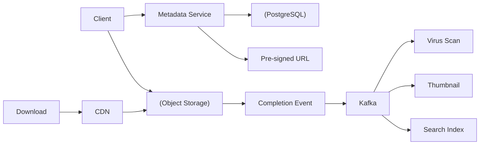
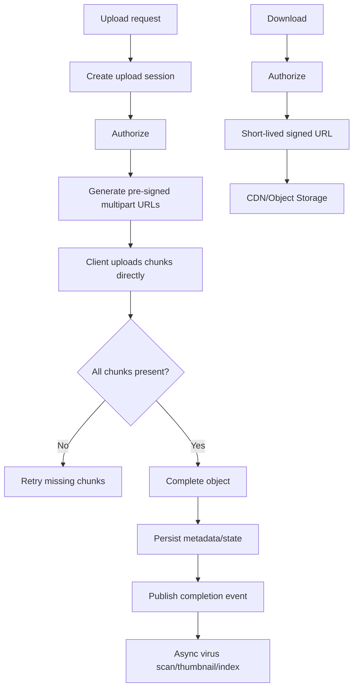
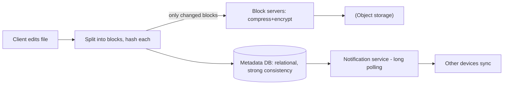

# File Storage / Dropbox

## 0. Why This Design Matters

Covers object storage, pre-signed URLs, multipart upload, metadata separation, CDN, versioning and async processing.

## 1. Problem Overview — Explain It Simply

Store file metadata in a database and the actual bytes in object storage. Let clients upload/download directly using pre-signed URLs so application servers do not become the bottleneck.

## 2. Functional Requirements

- Upload/download
- Folder metadata
- Sharing/permissions
- Versioning
- Delete
- Resume/multipart upload
- Optional deduplication/virus scan

## 3. Non-Functional Requirements

- Large object support
- High durability
- High throughput
- Global download performance
- Secure access

## 4. Capacity Estimation

Example: 10M uploads/day with average 20MB = 200TB/day of raw upload volume. This immediately makes direct object-storage transfer preferable to proxying bytes through application servers.

## 5. API Design

```text
POST /v1/files/uploads
→ returns pre-signed upload URLs

POST /v1/files/{fileId}/complete
GET /v1/files/{fileId}
GET /v1/files/{fileId}/download
DELETE /v1/files/{fileId}
```

## 6. High-Level Architecture

```text
Client
 ↓
Metadata Service
 ↓
PostgreSQL

Client
 ↓
Pre-signed URL
 ↓
Object Storage
 ↓
Upload Complete Event
 ↓
Kafka
 ├── Virus Scan
 ├── Thumbnail
 ├── Search Index
 └── Metadata Processing

Downloads → CDN/Object Storage
```

### HLD Flowchart

The following is the primary interview flowchart. Draw this first, then explain each box.



## 7. Database Selection

PostgreSQL for metadata, permissions, folders and versions. Object storage for bytes. Redis can cache metadata. CDN accelerates popular downloads.

### HLD Deep-Dive Flowchart

Use this second flowchart when the interviewer asks **"walk me through the complete flow"**.



## 8. HLD Deep Dive — Why Each Decision?

### Why Why pre-signed URL?

Client uploads directly to object storage; application servers only authorize and create upload sessions.

### Why Why multipart?

Large files can upload in parallel and failed chunks can retry without restarting the entire file.

### Why How resume?

Track upload session/chunk completion and retry only missing chunks.

### Why Why not store blobs in PostgreSQL?

Large blobs increase DB size, backup cost and I/O pressure; object storage is designed for this.

### Why Deduplication?

Content checksum can identify identical bytes, but authorization/privacy rules must be preserved.

### Why Versioning?

Metadata points to current version while older object versions can be retained according to policy.

## 9. Interview Question & Answer

### Q: Upload chunk fails?

**Answer:** Retry that chunk.

### Q: Metadata service down?

**Answer:** New upload sessions cannot be created; existing object uploads may continue depending on workflow.

### Q: Object storage event lost?

**Answer:** Use durable completion state/reconciliation.

### Q: How secure downloads?

**Answer:** Authorize first, then issue short-lived signed URLs.

## 10. LLD

```text
FileService
 ├── MetadataRepository
 ├── UploadSessionService
 └── PermissionService

ObjectStorage
 ├── S3Adapter
 └── OtherStorageAdapter

Patterns:
- Adapter → storage provider
- Saga-like workflow → metadata/object consistency
- Event-driven → post-upload processing
```

## 11. Failure Checklist

Always walk through:
- Service crash
- Database failure
- Cache/Redis failure
- Kafka/queue failure
- External dependency timeout
- Duplicate request
- Duplicate event
- Hot key/hot partition
- Network partition
- Partial success
- Recovery/reconciliation

## 12. Trade-Offs You Should Say Out Loud

A strong interview answer does not say "this is the only solution."

Instead say:

> "I'm choosing X because of requirement Y. The alternative is Z, which would be better if requirement A were more important."

Typical trade-offs:

| Choice | Benefit | Cost |
|---|---|---|
| Strong consistency | Correctness | Higher latency/coordination |
| Eventual consistency | Scale/availability | Stale reads |
| Redis | Very low latency | Memory/cost/failure considerations |
| PostgreSQL | Transactions | Horizontal write scaling is harder |
| Cassandra | Huge scale/availability | Query-driven modeling, weaker transactions |
| Kafka | Decoupling/replay | Operational complexity |
| Sync processing | Simple response semantics | Higher latency/coupling |
| Async processing | Resilience/scale | Eventual completion |

## 13. Staff-Level Follow-Up Questions

Be ready for these:

1. What breaks first at 10× traffic?
2. What is your hottest key/partition?
3. Can this operation be retried safely?
4. What happens if the service crashes after the external side effect but before the DB update?
5. Which data needs strong consistency?
6. Where can you tolerate eventual consistency?
7. How would you shard it?
8. What happens to a shard becoming hot?
9. How do you recover from a partial failure?
10. How do you observe correctness, not just availability?
11. What would you cache?
12. What would you never cache?
13. Where does backpressure happen?
14. How do you handle replay?
15. Why did you choose this database over the alternatives?

## 14. 2-Minute Interview Explanation

If the interviewer asks you to summarize **File Storage / Dropbox**, use this structure:

> "I'll first separate the read-heavy and correctness-critical paths. The authoritative state lives in the database best suited to the business invariant, while cache and distributed stores handle high-volume/temporary access. Requests that don't need to block the user are moved to an asynchronous queue/event stream. For concurrency, I use atomic updates, constraints, locks or idempotency depending on the invariant. For failures, I use timeout, retry with exponential backoff and jitter, circuit breakers where appropriate, and reconciliation when an external system can have an unknown outcome. At scale, I shard based on the dominant query/access pattern and explicitly handle hot keys and backpressure."


# Interview Framework

Use this exact flow in the interview:

```text
1. Clarify requirements
       ↓
2. Estimate scale
       ↓
3. Define APIs
       ↓
4. Define data model
       ↓
5. Draw HLD
       ↓
6. Explain request/data flow
       ↓
7. Deep dive into the hardest invariant
       ↓
8. Discuss DB/cache/Kafka
       ↓
9. Concurrency + consistency
       ↓
10. Failure handling
       ↓
11. Scaling/sharding
       ↓
12. LLD
       ↓
13. Trade-offs
```

## Universal Scale Formula

```text
Average QPS = daily requests / 86,400
Peak QPS = average QPS × peak factor
```

Start with an assumption such as 5× and say:

> "I'll use 5× as a starting peak multiplier; we can adjust if you give me a traffic pattern."

## Universal Database Cheat Sheet

### PostgreSQL

Use when you need:

- ACID transactions
- Strong consistency
- Relationships
- Constraints
- Conditional updates
- Booking/payment/inventory

### MongoDB

Use when:

- Data is naturally document-shaped
- Flexible schema matters
- Access is mostly by document
- Relationships are not the dominant problem

### Cassandra

Use when:

- Very high write volume
- High availability
- Predictable query patterns
- Massive time-series/activity/message data

Remember:

> Cassandra data modeling starts from queries, not from normalized entities.

### Redis

Use for:

- Cache
- Counters
- Rate limits
- Locks/leases
- Sessions
- Presence
- Temporary state

Do not automatically make Redis the source of truth for critical durable business state.

### Elasticsearch/OpenSearch

Use for:

- Full-text search
- Ranking
- Autocomplete
- Filtering/faceting

Think of it as a read model, not automatically your transactional source of truth.

### Kafka

Use for:

- Async events
- Decoupling
- Buffering
- Replay
- Fanout
- Stream processing

## Universal Reliability

When interviewer asks "what if X fails?":

```text
Timeout
 ↓
Should we retry?
 ↓
Idempotency
 ↓
Exponential backoff + jitter
 ↓
Circuit breaker
 ↓
Fallback?
 ↓
DLQ?
 ↓
Reconciliation?
```

## Universal Cache Problems

```text
Cache Stampede
→ request coalescing / lock / background refresh

Hot Key
→ local cache / CDN / replication / sharding

Cache Penetration
→ negative cache / Bloom filter

Cache Avalanche
→ TTL jitter / staggered expiry
```

## Universal Kafka

```text
Producer
 ↓
Topic
 ↓
Partitions
 ↓
Consumer Group
 ↓
Consumers
```

- Ordering → within a partition
- Scale → partitions
- Parallelism → consumers
- Replay → retention
- Duplicate events → idempotent consumers

## Universal Consistency Rule

Use strong consistency when the business invariant cannot tolerate stale state:

- Payment
- Wallet
- Booking
- Critical inventory
- Ledger

Eventual consistency is often fine for:

- Search index
- Analytics
- Recommendations
- Notifications
- Like/view counters

The best sentence to remember:

> "Consistency should follow the business invariant, not the technology."

## Universal Concurrency

Ask:

> "What happens if two requests execute this operation at exactly the same time?"

Possible tools:

- Atomic DB update
- Optimistic locking
- Pessimistic locking
- Unique constraint
- Distributed lock/lease
- Idempotency key
- Queue serialization

## Universal Idempotency

If the same request can safely be retried:

```text
request
 ↓
idempotency key
 ↓
existing result?
 ├── yes → return existing result
 └── no → process + store result
```

## Universal Staff-Level Thinking

Always discuss:

1. What happens at 10× traffic?
2. What becomes the bottleneck?
3. What is the hot key/hot partition?
4. What if a dependency fails?
5. What happens if the same request arrives twice?
6. Which state must be strongly consistent?
7. What can be eventually consistent?
8. What can be asynchronous?
9. Where does backpressure happen?
10. How do we observe and reconcile failures?

# Final Interview Rule

Do not jump directly into technologies.

First say:

> "Let me clarify the requirements and scale. Then I'll identify the critical business invariant, because that will drive my consistency and database choices."

That sentence alone makes the discussion much more senior.

---

# 📚 Book Cross-Reference & Added Depth

**Source:** Alex Xu, *System Design Interview* Vol 1, Ch 15 — *Design Google Drive*, and Vol 2, Ch 9 — *S3-like Object Storage* (companion notes `Book-System-Design-Vol-1/15-design-google-drive.md`, `Book-System-Design-Vol-2/09-object-storage-s3.md`).

**From Google Drive (the sync side):**
- **Block servers split files into blocks** (~4 MB each). Only **changed blocks** are uploaded — **delta sync** — and blocks are **compressed and encrypted** before storage. This makes edits to large files cheap.
- **Metadata lives in a relational DB** for **strong consistency/ACID** (file tree, versions, sharing); block data lives in object storage (S3).
- **Notification service** tells other clients a file changed — the book uses **long polling** (client holds a connection; server responds when there's a change).
- **Storage savings:** de-duplicate identical blocks by **hash**, cap version history, and move cold data to **archival storage (S3 Glacier)**.

**From S3 (the object-store side):**
- **Separate the (immutable) data store from the (mutable) metadata store** — the classic "inode" split.
- **Durability: replication vs erasure coding.** 3× replication → ~6 nines durability but **200% storage overhead**; **(8+4) erasure coding** → ~11 nines at only **~50% overhead**. Erasure coding trades CPU/rebuild cost for far less space.
- **Versioning** (TIMEUUID + delete markers) and **multipart upload** (uploadID + per-part ETag) for large objects; a **garbage-collection/compaction** job reclaims space.



**Interview line:** *"Block-level delta sync with de-dup by hash, a strongly-consistent relational metadata store separate from the object data store, long-polling change notifications, and erasure coding instead of 3× replication to cut storage overhead ~4×."*
