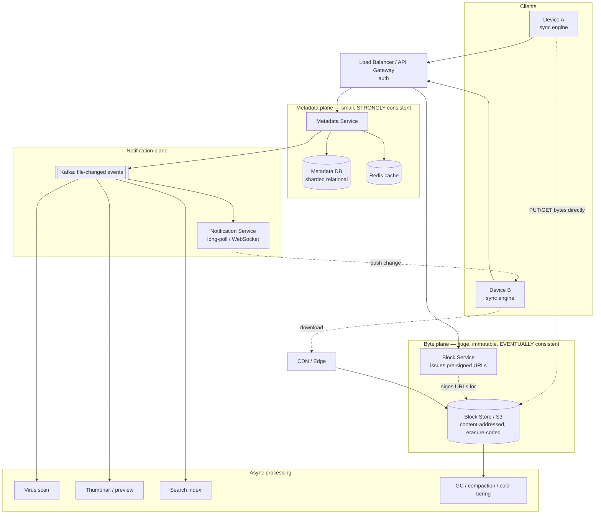
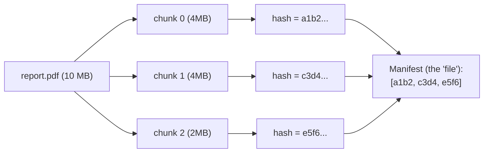
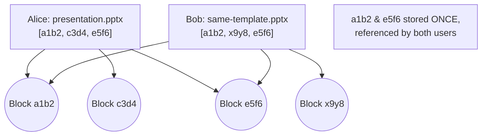
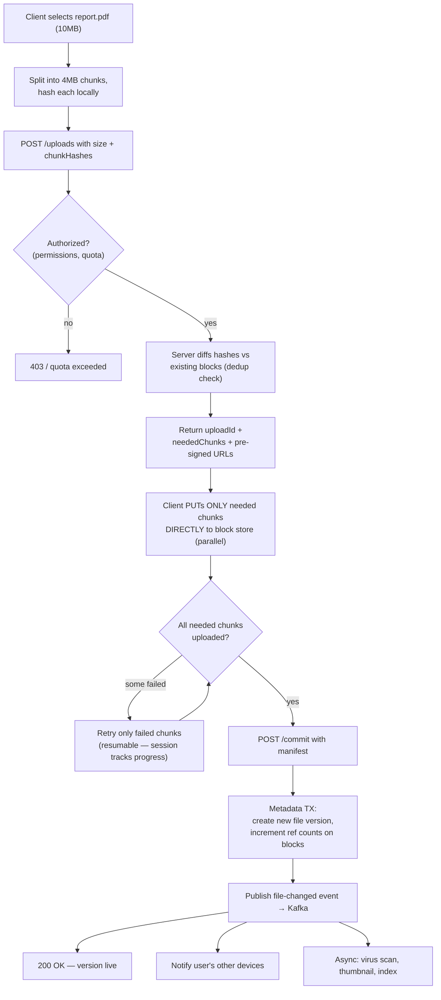
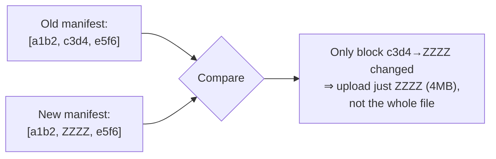
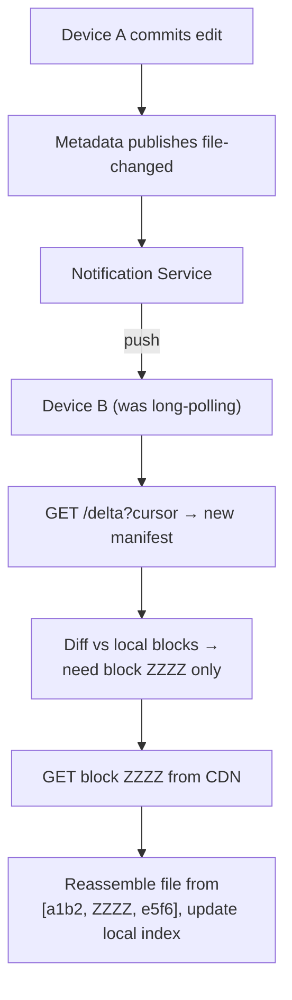
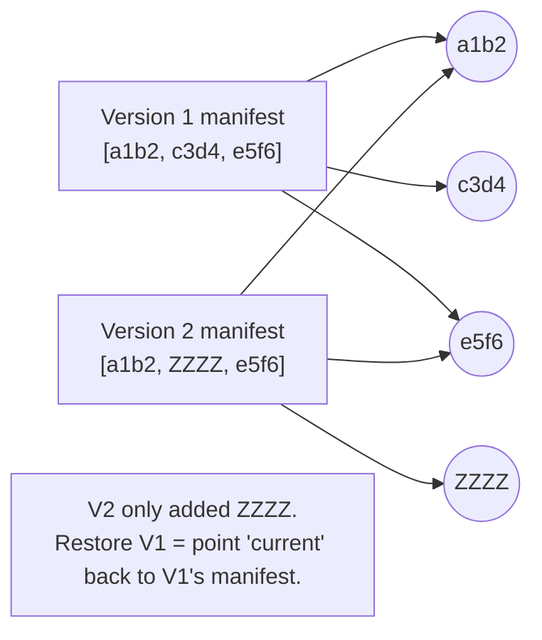
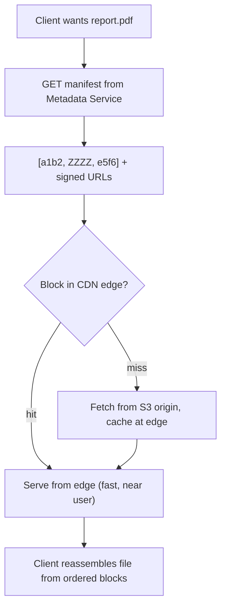
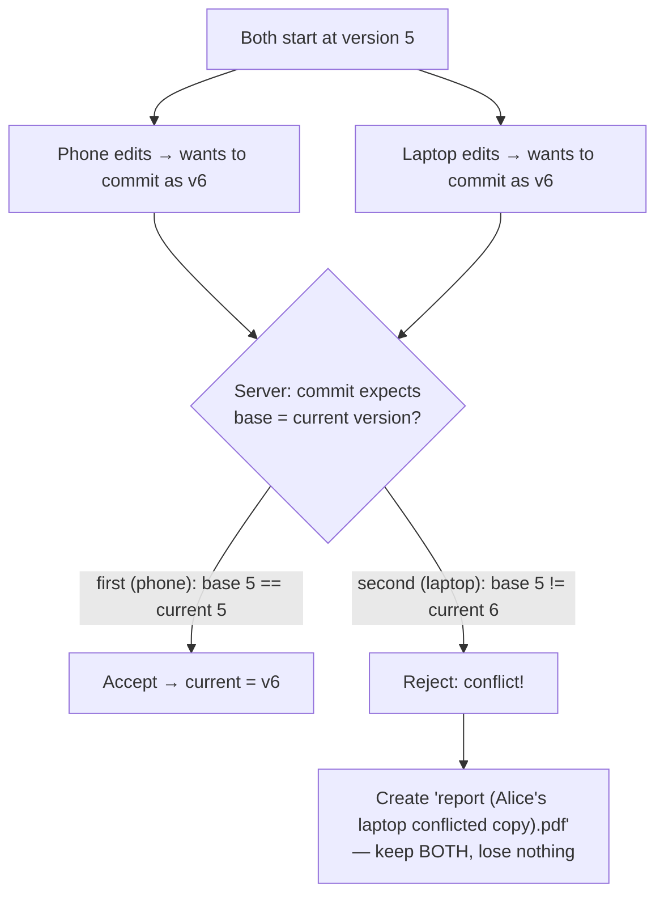
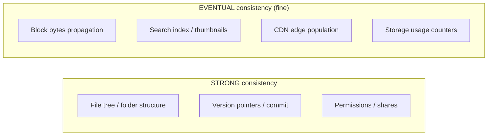

# File Storage / Dropbox — Staff/SSE System Design

**Difficulty:** Advanced
**Interview importance:** ⭐ **Critical** (the classic "sync engine" problem — everyone can draw upload/download; few can explain delta sync, dedup, and conflict resolution)
**References:** Alex Xu, *System Design Interview* Vol 1 Ch. 15 (*Google Drive*) & Vol 2 Ch. 9 (*S3-like Object Storage*); ByteByteGo — *Design Dropbox*; DDIA Ch. 5 (replication), Ch. 9 (consistency)

---

## 0. Why This Design Matters

Everyone can draw "client → server → S3." That is not the interview. The interview is: **a user edits one line in a 2 GB video file on their laptop, and 400 ms later the same edit appears on their phone — without re-uploading 2 GB, without corrupting the file, and without the server ever holding the whole file in memory.** That single sentence forces you to invent **chunking**, **content-addressed blocks**, **delta sync**, a **metadata service separate from the byte store**, and a **conflict-resolution rule** for when two devices edit offline.

The trap most candidates fall into: they treat this as an *object storage* problem (upload a blob, download a blob). Dropbox/Drive is really a **sync problem** — the hard part isn't storing bytes, it's keeping *N devices' views of a file tree consistent* while bytes move lazily and networks drop.

> The one-line thesis: **the file is the metadata; the bytes are a cache.** The authoritative thing you keep consistent is a small, strongly-consistent tree of pointers to immutable, deduplicated, content-addressed blocks — and everything else (upload, download, sync, versioning) falls out of that split.

---

## 1. Problem Overview — Explain It Simply

Build a service where a user can:

> **"Put a file in a folder on one device, and see it — current, correct, and fast — on every other device, even for huge files and flaky networks."**

The system must handle:

- **Upload / download** of files from bytes to gigabytes.
- **Sync** across many devices for one user (and shared folders across users).
- **Offline edits** that reconcile when the device reconnects.
- **Versioning** (restore yesterday's copy) and **conflict resolution** (two devices edited the same file).
- **Huge scale** of bytes (petabytes) while keeping storage cost sane (**dedup**).

### Real-world analogy — the shared warehouse with a card catalog

Think of a giant **warehouse** (block storage) full of identical, sealed, numbered boxes. Each box holds a chunk of file content, and **its number is a fingerprint of its contents** (content-addressed). If two people store the exact same chunk, there is only **one box** in the warehouse — we just write two cards pointing at it (**dedup**).

Separately there is a small, meticulously accurate **card catalog** (metadata DB): "the file `report.pdf` in Alice's `/work` folder is boxes #A, #B, #C, in that order, version 7."

- **Editing a file** = swapping one card, not repacking the whole shelf → you only ship the *changed* box (**delta sync**).
- **Syncing a device** = comparing your catalog to the master catalog and fetching only the boxes you're missing.
- **The warehouse can be eventually consistent and slow; the catalog must be exactly right.**

Everything else — S3, Postgres, CDN, notification service — is just "how do we make the catalog authoritative and the warehouse cheap and durable?"

---

## 2. Functional Requirements

**Core**
- **Upload** a file (small and multi-GB), **resumable** on network failure.
- **Download** a file, fast, from anywhere in the world.
- **Sync** a folder tree across all of a user's devices.
- **Delta sync** — editing a large file uploads/downloads only the changed parts.
- **Versioning** — keep history; restore a previous version.
- **Sharing & permissions** — share a file/folder with other users (view/edit).
- **Conflict resolution** — two devices edit the same file offline; both survive.
- **Delete** (soft delete / trash with retention).

**Optional (name them, then defer)**
- Full-text search over file contents, thumbnails/previews, virus scanning, comments, real-time collaborative editing (that's a *different* problem — Google Docs / OT / CRDT), client-side encryption.

---

## 3. Non-Functional Requirements

| Requirement | Target | Why it dominates the design |
|---|---|---|
| **Durability** | **99.999999999%** (11 nines) | Losing a user's file is unforgivable → replication / erasure coding |
| Metadata consistency | **Strong** (read-your-writes on the tree) | The file tree, versions, permissions must be exactly right |
| Byte-store consistency | **Eventual** OK for propagation | Bytes are immutable & content-addressed → staleness is harmless |
| Upload/download throughput | Saturate the client's link; **never proxy bytes through app servers** | 200 TB/day can't flow through your API tier |
| Sync latency | **Sub-second** change notification | "It appears on my phone instantly" is the product |
| Download latency (global) | Low p99 worldwide | → CDN + edge |
| Availability | 99.9%+ | Sync should survive node loss |
| Storage cost efficiency | High | Dedup + erasure coding + cold tiering — petabytes are expensive |

> **Say this out loud:** *"I'm going to split this into two systems with opposite requirements: a small, strongly-consistent **metadata service** and a huge, eventually-consistent, immutable **block store**. Almost every design decision follows from that split."*

---

## 4. Capacity Estimation (do the math — don't hand-wave)

Assume a Dropbox-scale prompt:

```text
Users                  = 500,000,000
Daily active users     = 100,000,000
Uploads per DAU/day    = 2 files
Avg file size          = 10 MB
```

**Upload volume → why we never proxy bytes.**
```text
Uploads/day  = 100M DAU × 2 = 200,000,000 files/day
Bytes/day    = 200M × 10 MB = 2,000,000 GB/day = 2 PB/day of raw upload
Avg upload QPS = 200M / 86,400 ≈ 2,300 uploads/sec  (×3 peak ≈ 7,000/sec)
```
→ **2 PB/day cannot flow through your application servers.** If each app server proxies 100 MB/s, you'd need ~230+ servers *just moving bytes*, all memory-pressured. Conclusion: **clients transfer bytes directly to the block store** via pre-signed URLs. App servers only touch **metadata**.

**Storage growth → why dedup + erasure coding matter.**
```text
Raw new bytes/day               ≈ 2 PB
Dedup ratio (cross-user, common files, unchanged blocks) ≈ 30–50% saved
After dedup                     ≈ ~1.1 PB/day of unique bytes
```
Durability overhead:
```text
3× replication  → store 3.3 PB/day, 200% overhead, ~6 nines durability
(8+4) erasure   → store ~1.65 PB/day, ~50% overhead, ~11 nines durability
```
→ **Erasure coding stores 11-nines-durable data at ~1/4 the space of 3× replication.** For the warm/cold majority of bytes, that's a massive cost win.

**Chunk size — the central knob.** Pick **4 MB chunks** (Dropbox uses 4 MB, Drive similar).
```text
A 10 MB file  → 3 chunks (2×4MB + 2MB)
A 2 GB file   → 512 chunks
```
Why not tiny (e.g. 64 KB)? → *too many* metadata rows & requests per file (a 2 GB file = 32,768 chunks → metadata explosion, request overhead). Why not huge (e.g. 64 MB)? → **delta sync gets coarse**: editing one byte re-uploads a whole 64 MB block. 4 MB balances **metadata cardinality** vs **delta granularity**.

**Metadata size.** Per chunk row ≈ `file_id + block_hash(32B) + offset + size ≈ ~100 B`.
```text
Total chunks stored (order of magnitude): trillions over years,
but per active file the metadata is tiny → fits a sharded relational store.
```

**What the numbers tell us:**
- **Bytes bypass the app tier** (pre-signed direct-to-storage) — mandatory.
- **Chunk at ~4 MB** — the sweet spot between metadata cardinality and delta granularity.
- **Dedup + erasure coding** are not optional at PB/day; they're the cost model.
- The **metadata** is small and hot — it wants a fast, strongly-consistent, *shardable* DB.

---

## 5. API Design

**Start an upload session** (control path — hits metadata service):
```http
POST /v1/files/uploads
```
```json
{ "path": "/work/report.pdf", "size": 10485760, "chunkHashes": ["a1b2...", "c3d4...", "e5f6..."] }
```
The client **hashes each chunk locally first** and sends the hashes. The server answers with **only the chunks it doesn't already have** (this is where cross-user dedup + delta sync happen):
```json
{
  "uploadId": "up_789",
  "neededChunks": ["c3d4..."],              // server already has a1b2, e5f6
  "presignedUrls": { "c3d4...": "https://blockstore/...&sig=..." }
}
```

**Upload the missing chunks** — client PUTs bytes **directly to the block store**, not through the API:
```http
PUT https://blockstore/...&sig=...        (body = chunk bytes)
```

**Commit the upload** (control path — makes the new version live, atomically):
```http
POST /v1/files/uploads/{uploadId}/commit
```
```json
{ "manifest": ["a1b2...", "c3d4...", "e5f6..."] }   // ordered block list = the file
```

**Download**:
```http
GET /v1/files/{fileId}                     → returns manifest (ordered block hashes) + short-lived signed URLs
GET https://cdn/blocks/{blockHash}         → fetch each block (CDN-cached, immutable)
```

**Sync — the heart of the product.** Client asks "what changed since I last synced?":
```http
GET /v1/delta?cursor={lastCursor}
```
```json
{
  "changes": [
    { "path": "/work/report.pdf", "action": "MODIFIED", "version": 7, "manifest": ["a1b2...","c3d4..."] },
    { "path": "/old/notes.txt",    "action": "DELETED" }
  ],
  "cursor": "c_10293",
  "hasMore": false
}
```

**Metadata/versioning/sharing**:
```http
GET    /v1/files/{fileId}/versions
POST   /v1/files/{fileId}/restore   { "version": 5 }
POST   /v1/shares                   { "fileId": "...", "userId": "...", "role": "EDITOR" }
DELETE /v1/files/{fileId}           (soft delete → trash)
```

> **Interview tell:** the fact that the upload API takes **chunk hashes up front** and returns **only needed chunks** is the single most important API detail — it's what makes dedup and delta sync work. Lead with it.

---

## 6. High-Level Architecture

The whole design is **two subsystems with opposite properties**, plus a notification path:



**Read the diagram as three planes:**
- **Metadata plane (hot, small, strongly consistent):** the file tree, versions, permissions, and the **block manifests** (ordered list of block hashes per file version). This is the source of truth. Never holds bytes.
- **Byte plane (huge, immutable, eventually consistent):** content-addressed blocks in S3-like storage, deduplicated, erasure-coded, CDN-fronted for reads. Clients read/write bytes **directly**, never through the app tier.
- **Notification plane:** when metadata changes, publish an event; the notification service pushes it to the user's *other* devices so they sync in near-real-time.

---

## 7. The Central Idea — Chunking + Content-Addressed Blocks + Dedup

This is the concept that makes the whole product work. Master it and everything downstream (delta sync, dedup, versioning) is easy.

### 7.1 Chunk the file, hash each chunk

Split every file into fixed **~4 MB** chunks. Compute a cryptographic hash (e.g. SHA-256) of each chunk. **The hash IS the block's address** — this is *content addressing*.



The **file is now just an ordered list of block hashes** (the *manifest*). The bytes live once, keyed by hash, in the block store.

### 7.2 Dedup falls out for free

Because a block's key is a hash of its content:

- If **any two files/users** contain an identical 4 MB chunk, its hash is identical → **stored once**. Two manifests just reference the same block.
- On upload, the client sends hashes first; the server replies "I already have `a1b2` and `e5f6`, only send me `c3d4`." → **cross-user, cross-file dedup** and **skip re-uploading unchanged data**.



### 7.3 Immutability — why content addressing is a gift

Content-addressed blocks are **immutable**: block `a1b2` *always* means the same bytes, forever. That gives you, for free:

- **Cacheability** — a block never changes, so CDN/edge caching is trivial (infinite TTL, no invalidation).
- **Safe eventual consistency** — a stale read of a block is impossible-to-be-wrong: either you have `a1b2`'s bytes (correct) or you don't (fetch it). No "old version" hazard.
- **Cheap versioning** — a new version is just a new *manifest*; unchanged blocks are shared with the old version (see §10).

> **Say this out loud:** *"Blocks are content-addressed and immutable, so the byte store can be eventually consistent and aggressively CDN-cached with no invalidation — all the hard consistency work is confined to the tiny metadata layer."*

---

## 8. Deep Dive — Upload Flow (with resumability + dedup)



**Why each decision:**

- **Client hashes first, server diffs** → dedup + skip-unchanged happen *before any bytes move*. This is the whole efficiency story.
- **Pre-signed URLs, direct-to-store** → the 2 PB/day never touches app servers (§4).
- **Resumable = the upload session tracks per-chunk state** → a dropped connection retries only the missing 4 MB chunks, not the whole 2 GB file. This *is* multipart upload, but with content-addressed chunks so it also dedups.
- **Commit is a single metadata transaction** → the new version becomes visible **atomically**. Until commit, uploaded blocks are just orphan bytes (a GC job reclaims uncommitted orphans). This avoids a half-written file ever being visible.
- **Ref-counting on commit** → each block tracks how many manifests reference it; needed later for safe GC (§14).

> **The atomicity insight:** bytes can arrive in any order, over minutes, with retries. The file "becomes real" only at the **commit**, which flips one metadata pointer to the new manifest. That's the moment consistency matters, and it's a small, single-shard transaction.

---

## 9. Deep Dive — Sync Engine & Delta Sync

The sync engine (on each client) is the cleverest part of Dropbox. Its job: **keep the local file tree equal to the server's, moving the minimum bytes.**

### 9.1 The client keeps a local index

Each client stores a local DB: for every file, its path, version, and **block manifest** (list of chunk hashes) from the last sync.

### 9.2 Detecting a *local* change → upload only changed blocks

When a file changes on disk, the client re-chunks it and compares new hashes to the stored manifest:



Editing one line of a 2 GB file changes **one 4 MB block** → you upload **4 MB, not 2 GB**. That's **delta sync**.

> **Rolling-hash nuance (staff-level name-drop):** fixed-offset chunking has a flaw — *inserting* one byte at the front shifts every subsequent chunk boundary, so every block's hash changes and delta sync degrades to a full re-upload. Production systems (rsync, restic, some Dropbox internals) use **content-defined chunking with a rolling hash** (Rabin fingerprint): boundaries are chosen based on content, so an insertion only changes the *one* chunk around it and re-aligns after. Mention this if pressed on "what if the user inserts text in the middle?"

### 9.3 Detecting a *remote* change → download only missing blocks

The client long-polls / holds a WebSocket to the **notification service**. When another device commits a change, the client gets pinged, calls `GET /v1/delta?cursor=...`, receives the new manifest, and **downloads only the blocks it's missing** (diffing new manifest vs local blocks). Unchanged blocks are already on disk.



### 9.4 Why a cursor / delta, not full-tree scans

A device that's been offline for a week must *not* re-scan the whole tree. The server keeps an **ordered change log per user** (a monotonic cursor). Sync = "give me everything after cursor X." This is efficient and idempotent — re-requesting from an old cursor is safe.

### 9.5 Notification transport: long-poll vs WebSocket

- **Long polling** (Alex Xu's choice): client opens a request; server holds it open until there's a change (or a timeout), then responds; client immediately re-polls. Simple, firewall-friendly, but a request per change.
- **WebSocket:** persistent bidirectional connection, lower latency, but more stateful connections to hold (millions of them → connection-management cost).
- Real answer: **a lightweight notification channel that only says "you have changes, go pull the delta."** Keep the notification tiny; the actual data comes over the normal sync API. This decouples "wake up" from "transfer."

---

## 10. Versioning — Cheap Because Blocks Are Shared

A version is **just another manifest**. Unchanged blocks are shared with prior versions, so history is nearly free.



- **Restore** = flip the file's `current_version` pointer to an old manifest. Instant, no byte movement.
- **Retention policy** caps history (e.g. keep 30 days / N versions) so storage doesn't grow unbounded; expired versions release their block references, and GC reclaims blocks whose ref count hits zero.
- **The metadata model:** `file → many versions → each version has an ordered manifest of block hashes → blocks are shared and ref-counted.`

---

## 11. Data Model — Metadata DB vs Block Store

### 11.1 Metadata (relational, strongly consistent, sharded by user)

```text
users(user_id, ...)
files(file_id, owner_id, parent_folder_id, name, current_version_id, is_deleted, ...)
folders(folder_id, owner_id, parent_folder_id, name, ...)
file_versions(version_id, file_id, size, created_at, manifest_ref)
manifest_blocks(version_id, seq_no, block_hash)      -- the ordered chunk list
blocks(block_hash PRIMARY KEY, size, storage_locator, ref_count)
shares(share_id, file_or_folder_id, grantee_user_id, role)  -- view/edit
sync_log(user_id, cursor, change)                    -- ordered change feed per user
```

### 11.2 Why relational (Postgres/MySQL/Spanner), not NoSQL, for metadata

- The file **tree** has real relationships (folder → files, file → versions → blocks) and **invariants** (a version's manifest must be complete; a share must reference a real file). **ACID transactions** make "commit a new version" atomic.
- **Read-your-writes** matters: after you save, *you* must see it immediately on refresh.
- It's **shardable by `user_id`** — one user's tree lives on one shard, so almost every operation (list folder, commit version, get delta) is a **single-shard transaction**. No cross-shard coordination on the hot path.
- **Spanner/CockroachDB** if you need horizontal write scale *with* strong consistency and cross-region; classic Dropbox used sharded MySQL with a metadata service (they built "Edgestore").

### 11.3 Why object storage (S3-like) for blocks, never the DB

- Blobs in a relational DB bloat it, wreck backup/restore times, and thrash I/O. Object stores are **built** for durable, cheap, massive immutable bytes.
- Blocks are **immutable + content-addressed** → object storage's eventual consistency is fine, and dedup/GC operate on the `blocks` table's ref counts.

### 11.4 Selection summary

| Data | Store | Consistency | Why |
|---|---|---|---|
| File tree, versions, permissions, manifests | **Sharded relational** (MySQL/Postgres/Spanner) | **Strong** | Invariants + ACID commit + read-your-writes; shard by user |
| Block bytes | **Object storage** (S3 + erasure coding) | Eventual | Immutable, huge, cheap, durable |
| Hot metadata / manifests | **Redis** cache | — | Cut metadata read latency on popular files |
| Block downloads (reads) | **CDN** | — | Immutable blocks cache forever globally |
| Change events, async work | **Kafka** | — | Decouple sync notify + virus scan/thumbnail/index |

---

## 12. Downloads, CDN & the Immutable-Block Advantage

Downloads are read-heavy and global. Because blocks are **immutable and content-addressed**, CDN caching is almost free:



- **No cache invalidation ever** — block `a1b2` is the same bytes globally, forever. Set effectively-infinite TTL.
- **Signed, short-lived URLs** enforce authorization: metadata service authorizes, then hands out URLs that expire in minutes, so the CDN/store can serve bytes without re-checking permissions per byte.
- **Range/parallel fetch:** the client can pull multiple blocks concurrently to saturate its link, and resume a failed block independently.

---

## 13. Conflict Resolution — Two Devices Edit Offline

This is the discriminator question. Two of Alice's devices both edit `report.pdf` while offline, then both come online.



**The mechanism: optimistic concurrency on commit.** Each commit says "my base version is 5." The server accepts it only if the file is *still* at version 5 (a compare-and-set / conditional update on `current_version_id`). The **first** commit wins and moves it to 6; the **second** sees the version moved and is rejected as a conflict.

**The resolution policy (Dropbox's actual behavior):** rather than silently pick a winner and *lose* someone's edit, create a **"conflicted copy"** — a second file — so **no data is ever lost**. The user reconciles manually.

> **Why not last-write-wins or auto-merge?**
> - **LWW** would silently discard one device's edits → unacceptable for user files (and clocks lie — DDIA Ch. 8).
> - **Auto-merge** requires understanding the file format; you can't merge an arbitrary binary. (Merging *is* possible for structured text — that's the domain of **OT/CRDTs** in Google Docs, a *different* system. Say this to show you know the boundary.)
> - **Conflicted copy** is the safe, format-agnostic default: preserve both, let the human decide.

**Compare the choices out loud:**

| Strategy | Data loss? | Needs to understand file? | Where it's used |
|---|---|---|---|
| Last-write-wins | **Yes (silent)** | No | Caches, non-critical fields — *not* user files |
| Auto-merge (OT/CRDT) | No | **Yes** (structured docs) | Google Docs, Figma, collaborative editors |
| Conflicted copy | No | No | **Dropbox/Drive file sync** ✅ |
| Reject + force re-sync | No (blocks writer) | No | Simple, but bad UX offline |

---

## 14. Garbage Collection, Ref-Counting & Cold Tiering

Dedup + versioning create a bookkeeping problem: **when is a block safe to delete?**

- Each `blocks` row has a **`ref_count`** = number of manifests referencing it. Commit increments; version expiry / file delete decrements.
- A block is deletable only when **`ref_count == 0`**. A background **GC/compaction** job scans for zero-ref blocks (with a grace period to avoid racing an in-flight upload that's about to reference it).
- **Orphan cleanup:** blocks uploaded but never committed (abandoned upload) are reclaimed after a TTL.
- **Cold tiering:** blocks not accessed in N days move from hot S3 to **archival (S3 Glacier)** — cheaper, higher retrieval latency. The manifest still points at the same hash; only the storage tier changes.

> **The subtle race:** dedup lets you *skip* uploading a block you think exists, and GC lets you *delete* a zero-ref block. If those interleave, you could dedup against a block that GC is about to delete → **dangling reference**. Fix: GC uses a **grace period + ref-count check under a lock/transaction**, and the commit that adds a reference is atomic with the ref-count increment. This "dedup vs GC race" is a genuine staff-level detail.

---

## 15. Consistency Model — Where Strong, Where Eventual



- **Strong** on the **metadata**: the commit (version flip), permission checks, and folder moves must be linearizable — a user must never see a half-applied change or read stale permissions. Single-shard transactions make this cheap.
- **Eventual** everywhere in the **byte plane** and derived data: because blocks are immutable + content-addressed, a device that hasn't yet fetched a block simply pulls it — there's no "wrong old value" hazard. Search indexes and thumbnails lag by seconds; nobody cares.

> **The one sentence:** *"Consistency follows the invariant, not the technology. The invariant here is the file tree/version pointer, so that's strongly consistent; bytes are immutable so their propagation can be eventual."*

---

## 16. Failure Scenarios

| Failure | Handling |
|---|---|
| **Upload chunk fails mid-transfer** | Resumable session tracks per-chunk state → retry **only** the failed 4 MB chunk, not the file |
| **Client crashes mid-upload** | Blocks uploaded are orphaned but harmless; no version committed → nothing visible; GC reclaims orphans after TTL |
| **Metadata service down** | New commits & new upload sessions fail (fail-closed on writes); reads can serve from Redis cache; in-flight direct-to-store byte transfers continue |
| **Block store node down** | Erasure coding / replication reconstructs missing shards; durability unaffected |
| **Completion event lost (Kafka)** | Don't rely on the event for correctness — the **commit** is the source of truth; a **reconciliation job** re-derives async work (virus scan/index) from committed versions; consumers are idempotent |
| **Duplicate commit (client retry)** | Idempotent by `uploadId` + optimistic version check → second commit either returns the same result or is a no-op |
| **Two devices commit same version** | Optimistic concurrency → first wins, second becomes a **conflicted copy** (§13) |
| **Notification service down** | Sync degrades to **periodic polling** (client falls back to `GET /delta` on a timer) — slower, still correct |
| **Dedup vs GC race** | Ref-count under transaction + GC grace period (§14) |
| **CDN edge miss / stale** | Blocks immutable → a miss just fetches origin; a "stale" edge is impossible (content-addressed) |
| **Hot file (viral shared link)** | CDN absorbs read fan-out; metadata for it is cached in Redis |
| **Region outage** | Cross-region replicated metadata + geo-replicated blocks; failover to another region |

> **The reconciliation mindset:** the **commit** is the ground truth. Every async effect (thumbnail, index, notification) is *re-derivable* from committed versions, so losing an event is never a correctness bug — it's a "re-run the job" bug.

---

## 17. Scaling & Sharding

- **Metadata: shard by `user_id`.** A user's whole tree lives on one shard → folder listing, commit, and delta are single-shard. Shared folders spanning users are the exception — resolve via a shares table and, if needed, a small cross-shard read (or replicate the shared subtree's metadata).
- **Block store: content-addressed → naturally sharded by hash prefix.** Uniform hash = uniform load; no hot partition from a single big file (its blocks scatter across the keyspace).
- **Notification service: shard connections by `user_id`;** it's stateful (holds long-poll/WebSocket connections) → needs a connection-count-aware balancer and graceful failover.
- **Kafka: partition by `user_id`** so a user's change events stay ordered.
- **Hot-spot analysis:** the classic hot spot is a **widely-shared or viral public file**. Its *bytes* are handled by the CDN (read fan-out ≠ metadata load), and its *metadata* is cached. No single writer, so no write hot spot.

---

## 18. Low-Level Design (clean OO)

```java
interface FileSyncService {
    UploadSession startUpload(String path, List<String> chunkHashes, long size);
    CommitResult  commit(String uploadId, List<String> manifest, int baseVersion); // optimistic
    Delta         getDelta(String userId, String cursor);
}

interface BlockStore {                          // DIP: depend on abstraction
    boolean has(String blockHash);              // dedup check
    PresignedUrl presignPut(String blockHash);
    PresignedUrl presignGet(String blockHash);  // → CDN URL
}
// S3BlockStore | GcsBlockStore  (Adapter per provider)

interface MetadataRepository {                  // sharded by userId
    FileVersion currentVersion(String fileId);
    CommitResult commitIfBaseMatches(String fileId, int base, Manifest m); // compare-and-set
    void incrementRefCounts(List<String> blockHashes);
}

interface Chunker {                             // Strategy: fixed vs content-defined
    List<Chunk> chunk(InputStream file);
}
// FixedSizeChunker(4MB) | RollingHashChunker(Rabin)

class ConflictResolver {                        // policy object
    Resolution resolve(CommitResult rejected);  // → conflicted-copy
}
```

**Patterns worth naming:**
- **Adapter** — swap S3/GCS/Azure block stores behind `BlockStore`.
- **Strategy** — swap fixed-size vs content-defined (rolling-hash) chunking.
- **Saga / atomic commit** — upload blocks (compensatable) then commit metadata (the commit point); orphans compensated by GC.
- **Event-driven** — post-commit fan-out (scan/thumbnail/index) via Kafka, decoupled from the hot path.
- **DIP/SRP** — metadata, block store, chunker, and conflict policy are separate, testable seams.

---

## 19. Latency Budget (sync "instant" feel)

```text
Local edit detected .................. ~instant (filesystem watcher)
  Re-chunk + hash changed blocks ..... tens of ms
  Diff manifests locally ............. ~1 ms
  Upload changed block(s) direct → S3  network-bound (4MB)
  Commit metadata TX ................. ~5–10 ms (single shard)
  Publish + notify other device ...... ~100–300 ms
Other device: pull delta + fetch block network-bound (only the delta)
```
→ The "it appeared on my phone" latency is dominated by **notification + one small block fetch**, not by the file size. That's the payoff of delta sync.

---

## 20. Trade-Offs to Say Out Loud

| Axis | Option A | Option B | Choose by |
|---|---|---|---|
| Chunk size | Small (fine delta, more metadata) | Large (coarse delta, less metadata) | ~4 MB balances both |
| Chunking | Fixed-offset (simple) | Content-defined / rolling hash (insert-robust) | Do users insert into the middle of big files? |
| Durability | 3× replication (simple, 200% overhead) | Erasure coding (50% overhead, CPU/rebuild cost) | Cost vs operational simplicity |
| Metadata store | Relational (ACID, tree) | NoSQL (scale, weaker txns) | You need ACID commit → relational |
| Consistency | Strong metadata | Eventual bytes | Split by invariant, get both |
| Conflict policy | LWW (lossy) / auto-merge (needs format) | **Conflicted copy** (safe, generic) | User files → never lose data |
| Notification | Long-poll (simple) | WebSocket (low latency, stateful) | Connection scale vs latency |
| Dedup scope | Per-user (privacy-safe) | Cross-user (max savings, side-channel risk) | Privacy vs storage cost |

> **Dedup privacy nuance:** cross-user dedup ("I already have this block") can leak *whether a file exists* (a timing/existence side channel). Mitigate by scoping dedup per-user, or per-namespace, when privacy matters — mention this; it's a sharp staff-level point.

---

## 21. Interview Q&A

**Beginner**

**Q: Why not just store the whole file as one blob in S3 and be done?**
That works for pure storage, but Dropbox is a *sync* product. Storing whole blobs means editing one line of a 2 GB file re-uploads 2 GB, versioning duplicates the whole file each save, and identical files across users are stored many times. Chunking into content-addressed blocks gives you delta sync, dedup, and cheap versioning — all from the same idea.

**Q: Why don't bytes go through your application servers?**
At ~2 PB/day, proxying bytes through the app tier would need hundreds of memory-pressured servers just to shuffle bytes. Instead, app servers only handle small **metadata**; clients transfer bytes **directly** to the block store via short-lived **pre-signed URLs**.

**Q: Why split metadata from the byte store?**
They have opposite needs. Metadata is small and must be **strongly consistent** (the file tree/version/permissions must be exactly right). Bytes are huge, immutable, and can be **eventually consistent** and cheap. Splitting lets each use the right store: relational DB vs object storage.

**Intermediate**

**Q: Walk me through delta sync.**
The client keeps each file's block manifest (list of chunk hashes). On a local edit, it re-chunks, compares new hashes to the old manifest, and finds only the changed blocks — uploading just those (4 MB, not the whole file). On a remote change, the notification service pings it; it pulls the new manifest and downloads only the blocks it's missing. The file is an ordered list of immutable blocks, so we only ever move the diff.

**Q: How does dedup work, and where's the risk?**
Blocks are keyed by a hash of their content, so identical chunks — across files or users — are stored once. On upload the client sends hashes first; the server replies with only the blocks it lacks. Risk: (1) **cross-user dedup can leak file existence** (side channel) → scope dedup per-namespace when privacy matters; (2) a **dedup-vs-GC race** where you dedup against a block GC is about to delete → guard with ref-counts under a transaction plus a GC grace period.

**Q: How do you handle huge files and flaky networks?**
Multipart + resumable: the file is 4 MB chunks with an upload session tracking per-chunk state. A dropped connection retries only the failed chunks. The file becomes visible only at **commit**, so a half-uploaded file is never seen; abandoned uploads' orphan blocks are GC'd.

**Q: How do other devices learn about a change so fast?**
A notification service (long-poll or WebSocket) holds a channel per device. On commit, metadata publishes a change event; the notification service pings the user's other devices, which then call `GET /delta?cursor` and fetch only the changed blocks. If notifications are down, clients fall back to periodic polling — slower but still correct.

**Advanced / Staff**

**Q: Two devices edit the same file offline. What happens?**
Optimistic concurrency on commit: each commit declares its base version, and the server accepts it only if the file is still at that version (compare-and-set on the version pointer). The first commit wins; the second is rejected as a conflict. Rather than silently discard either edit, we create a **conflicted copy** (a second file) so no data is lost. LWW would silently drop edits; auto-merge needs to understand the file format (that's OT/CRDT territory for structured docs like Google Docs) — for arbitrary user files, conflicted copy is the safe, generic default.

**Q: When is a block safe to delete, given dedup and versioning?**
Each block has a **ref count** = number of manifests pointing at it. Commit increments; version expiry/file delete decrements. A block is deletable only at ref_count 0, via a GC job with a **grace period** to avoid racing an in-flight dedup that's about to reference it. Uncommitted orphan blocks are reclaimed after a TTL. Cold blocks tier down to Glacier.

**Q: What if the user inserts a byte in the middle of a big file?**
With fixed-offset chunking, an insertion shifts every downstream boundary, so all subsequent block hashes change and delta sync degrades to a near-full re-upload. Fix with **content-defined chunking** using a rolling hash (Rabin fingerprint): boundaries are chosen by content, so an insertion changes only the chunk around it and re-aligns after — delta stays small.

**Q: Where is strong consistency required, and where can you relax it?**
Strong on the **metadata**: commit (version flip), permissions, folder moves — a user must never see a half-applied change or stale permissions; single-shard transactions make this cheap. Eventual everywhere in the **byte plane** and derived data (block propagation, search index, thumbnails, CDN) — because blocks are immutable and content-addressed, a not-yet-fetched block is simply fetched; there's no stale-value hazard. Consistency follows the invariant, not the technology.

---

## 22. 30-Second Interview Answer

> "I split this into two systems with opposite properties. A small, **strongly-consistent metadata service** (sharded relational, keyed by user) owns the file tree, versions, permissions, and per-version **block manifests**. A huge, **eventually-consistent block store** (S3 + erasure coding, CDN-fronted) holds the bytes. The trick is **chunking**: files are split into ~4 MB **content-addressed blocks** (block key = hash of its bytes), so identical chunks are stored once (**dedup**) and editing a large file only moves the **changed blocks** (**delta sync**). Clients transfer bytes **directly** to the store via pre-signed URLs — the app tier never proxies petabytes. A file version is just an ordered list of block hashes, so **versioning is nearly free** and blocks are immutable, making CDN caching trivial with no invalidation. Uploads are **resumable multipart** and become visible atomically at **commit**. Other devices sync via a **notification service + delta cursor**, fetching only missing blocks. Conflicts use **optimistic concurrency**: first commit wins, the loser becomes a **conflicted copy** so no edit is ever lost. GC uses **ref-counting** to reclaim zero-reference blocks."

---

## 23. Mental Model

```text
FILE = ordered list of content-addressed BLOCK HASHES (the "manifest")

  ┌─ METADATA PLANE (small, STRONG, sharded by user) ─┐
  │  tree • versions • permissions • manifests        │  ← the source of truth
  └───────────────────────────────────────────────────┘
  ┌─ BYTE PLANE (huge, IMMUTABLE, eventual, CDN) ─────┐
  │  4MB blocks, keyed by hash, deduped, erasure-coded│  ← a durable cache of bytes
  └───────────────────────────────────────────────────┘

CHUNK       → ~4 MB, hash each  (metadata-cardinality vs delta-granularity)
ADDRESS     → block key = hash of content  → dedup + immutability for free
DELTA SYNC  → diff manifests, move only changed blocks
UPLOAD      → hashes first → server says what's needed → direct-to-S3 → COMMIT (atomic)
DOWNLOAD    → manifest + signed URLs → CDN (immutable, no invalidation)
SYNC        → notification ping → GET /delta?cursor → fetch missing blocks
VERSION     → new manifest, blocks shared  → restore = flip pointer
CONFLICT    → optimistic commit; loser → "conflicted copy" (never lose data)
GC          → ref-count blocks; 0 refs + grace period → delete; cold → Glacier
CONSISTENCY → STRONG metadata, EVENTUAL bytes  (follow the invariant)
```

---

## 24. How This Connects to Other Topics

- **Object storage / S3 design** — this *is* an object store plus a sync layer; the immutable-data / mutable-metadata split (the "inode" idea) and erasure-coding-vs-replication trade-off come straight from S3 design.
- **Content-addressed storage & Git** — Git is the same idea: files are blobs keyed by hash, trees are manifests, commits share unchanged blobs. Dropbox is "Git for arbitrary files with a sync engine."
- **Replication & consistency (DDIA Ch. 5, 9)** — strong metadata vs eventual bytes is the classic "put coordination only where the invariant needs it." Conflicted copies are a concrete take on conflict resolution vs LWW.
- **CRDTs / Operational Transform (collaborative editing)** — the *boundary* case: Dropbox punts to conflicted copies; Google Docs/Figma auto-merge with OT/CRDTs because they understand the document structure. Knowing where sync ends and collaborative editing begins is a strong signal.
- **Rate limiting & hot keys** — the viral-shared-file hot spot is the same "handle the head of the distribution differently" move (CDN for the hot bytes) seen in rate-limiter hot keys and Twitter fan-out.
- **Message queues / event-driven** — post-commit fan-out (scan/thumbnail/index) via Kafka, with the commit as the replayable source of truth, is the standard "async, re-derivable side effects" pattern.
- **Unreliable clocks (DDIA Ch. 8)** — why we use **version pointers / compare-and-set**, not wall-clock last-write-wins, to order concurrent commits.
