# Analytics / Event Tracking — Staff/SSE System Design

**Difficulty:** Advanced
**Interview importance:** ⭐ **Critical** (the canonical "high-volume pipeline" question — Mixpanel/Amplitude/Segment/ad-click aggregation all reduce to this)
**References:** Alex Xu — *System Design Interview* Vol 2, Ch. 6 *Ad Click Event Aggregation*; DDIA Ch. 10–11 (batch & stream processing); Kleppmann on Kappa; Cloudflare/Confluent engineering blogs

---

## 0. Why This Design Matters

An analytics pipeline looks like "POST an event, count it later." It is not. It is the purest test of whether you understand **the whole data-in-motion stack**: you must **absorb a firehose without dropping data**, **decouple a spiky producer from a slow consumer**, decide **at-least-once vs exactly-once counting** (the difference between "roughly right" and "provably right" numbers a CFO reports), handle **events that arrive out of order and hours late**, and store results so a dashboard scans **billions of rows in a second** — all while keeping storage cost sane over years of retention.

That is why interviewers reach for it: a weak candidate draws `SDK → API → database` and gets destroyed the moment you ask "what happens when the OLAP store is down for 20 minutes?" A strong candidate leads with **Kafka as a durable shock absorber**, names **event-time windowing with watermarks**, explains **why exactly-once needs the offset and the aggregate committed atomically**, and reaches for a **columnar OLAP store** for the read side.

> The one-line thesis: **an analytics pipeline decouples a bursty firehose from slow analytical storage using a durable log, then trades counting-accuracy against latency and cost — and the whole design is about *where* you buffer and *how exactly* you count.**

---

## 1. Problem Overview — Explain It Simply

Build a system that answers, at massive volume, two very different questions:

> **Write side:** "A user just did *something* (viewed, clicked, purchased). Record it — never lose it, even during a spike."
> **Read side:** "How many users did *that thing*, sliced by country / time / campaign, over the last hour / 30 days?"

It powers product analytics (funnels, retention, DAU/MAU), ad-click aggregation (billing advertisers), and real-time dashboards. The application's transactional database must **never** run these giant scans — it would fall over.

### Two philosophies to name early

- **Raw event log first (event sourcing):** store every immutable event forever (cheaply), and *derive* every metric from it. If a metric is wrong or new, **recompute from raw**. Maximum flexibility, more storage/compute.
- **Aggregate-on-write:** roll up into counters as events arrive; keep only aggregates. Cheap and fast to read, but you can't answer a question you didn't pre-aggregate, and a bug means permanently wrong numbers.

The mature design keeps **both**: cheap immutable raw archive (the source of truth) **plus** fast pre-aggregated read models — the raw log is the backstop that lets you recompute when the fast path is wrong.

### Real-world analogy — the mail sorting facility

Think of a national postal sorting center:

- **Mailboxes everywhere (SDKs)** drop letters (events) at wildly varying rates — quiet at 3 a.m., a flood at Christmas.
- **The intake dock (Kafka)** is a huge conveyor belt that *accepts everything immediately* and holds it in order. It doesn't matter that the sorters are slower than the morning rush — the belt buffers.
- **Sorters (stream processors)** pull mail off the belt at a steady pace, group it by destination (aggregate), and stamp it.
- **The warehouse (OLAP store)** files sorted mail so any query ("how much mail to Berlin last week?") is answered by pulling one labeled shelf, not searching every letter.
- **The archive basement (object storage)** keeps a copy of every original letter, cheaply, for years — in case the sorters made a mistake and you must re-sort.

Everything else — partitioning, watermarks, exactly-once — is just "how do the sorters handle late mail, duplicate letters, and a belt that never stops?"

---

## 2. Functional Requirements

**Core**
- **Ingest** events from many client SDKs (web, mobile, server) at high volume.
- **Validate** and **enrich** events (schema, GeoIP, bot filtering).
- **Durably store raw events** (immutable, replayable source of truth).
- **Aggregate** into metrics: counts, unique users, sums, by dimension and time bucket.
- **Query** aggregates fast for dashboards (near-real-time + historical).
- Support **funnels**, **retention**, **segmentation**.
- **Retention & lifecycle**: age out or downsample old data.

**Optional (name, then defer)**
- Real-time alerting, session stitching, cohort analysis, data export to warehouse, GDPR/PII deletion by user, A/B test metrics.

---

## 3. Non-Functional Requirements

| Requirement | Target | Why it dominates the design |
|---|---|---|
| Ingestion throughput | **Millions of events/sec** at peak, lossless | Forces a durable buffer (Kafka), not synchronous DB writes |
| Ingestion availability | **99.99%** — accepting events must never block | A dropped event is lost forever; the write path must degrade gracefully |
| Read latency | **p95 < 1 s** for dashboard aggregates | Forces columnar/OLAP + pre-aggregation, not raw scans |
| Freshness | Near-real-time (**seconds to low minutes**) | Drives *stream* processing, not nightly batch |
| Counting accuracy | **Exact for billing**, approximate OK for product metrics | The core trade-off (exactly-once vs at-least-once) |
| Durability | No event loss once acked | Kafka replication + raw archive |
| Cost efficiency | Cheap PB-scale historical storage | Tiered storage: hot OLAP → cold object storage |
| Correctness under lateness | Handle hours-late & out-of-order events | Event-time windowing + watermarks |

> **Say this out loud:** *"The write path optimizes for **never dropping an event under load**; the read path optimizes for **scanning billions of rows fast**. They have opposite characteristics, so I separate them with a durable log in the middle. That one sentence drives the whole design."*

---

## 4. Capacity Estimation (do the math — don't hand-wave)

Assume a large product-analytics workload:

```text
Events per day        = 10,000,000,000   (10B/day)
Average events/sec    = 10e9 / 86,400    ≈ 115,700/sec   (~116K/s)
Peak-to-average       = 5×               ≈ 580,000/sec    (~580K/s peak)
Average event size    = 1 KB (JSON: ids, props, ua, geo)
```

**Ingest bandwidth.**
```text
116K/s × 1 KB ≈ 116 MB/s average   →  ~580 MB/s at peak
Per day: 10B × 1 KB = 10 TB/day raw (before replication)
```

**Kafka storage (the buffer).** With replication factor 3 and, say, 3 days of retention on the hot topic:
```text
10 TB/day × 3 (replicas) × 3 (days) = 90 TB on the Kafka cluster
```
→ Kafka holds *days*, not years. Long-term history lives cheaply elsewhere.

**Kafka partitions (throughput → parallelism).** A partition sustains ~10 MB/s comfortably:
```text
580 MB/s peak ÷ 10 MB/s per partition ≈ 60 partitions minimum
```
→ Round up to **128+ partitions** for headroom and consumer parallelism.

**Raw archive (object storage, columnar Parquet, compressed).** ~5× compression on 1 KB JSON → ~200 B/event:
```text
10B/day × 200 B = 2 TB/day compressed  →  ~730 TB/year
```
At ~$0.02/GB-month cold storage that's cheap enough to keep years of history — the whole point of tiered storage.

**OLAP store (aggregates + recent raw).** You do **not** store 10B rows/day forever in the OLAP store; you store pre-aggregated rollups (per-minute/hour by dimension). If a metric has ~10K dimension combinations × 1,440 minutes/day:
```text
10K × 1,440 ≈ 14.4M aggregate rows/day  → orders of magnitude smaller than 10B raw
```

**What the numbers tell us:**
- A synchronous DB write per event is **impossible** — 580K writes/sec of small rows would melt any OLTP DB. You **must** buffer in a log.
- **Throughput drives partition count**; parallelism, not any single node, absorbs the firehose.
- **Kafka is a buffer (days), object storage is the archive (years), OLAP holds aggregates (fast reads).** Three stores, three jobs.
- **Pre-aggregation shrinks the read set by ~1000×** — that's what makes sub-second dashboards possible.

---

## 5. API Design

**Ingest (the hot path)** — accepts a batch, returns fast, does minimal work:
```http
POST /v1/events
```
```json
{
  "batch": [
    {
      "eventId": "8f3c...-uuid",        // client-generated, for dedup
      "projectId": "P1",
      "userId": "U123",
      "anonId": "anon-abc",
      "event": "purchase",
      "eventTime": "2026-09-03T10:00:03.120Z",  // when it HAPPENED (client)
      "props": { "amount": 49.9, "sku": "X1", "campaign": "fall" }
    }
  ]
}
```
```json
{ "accepted": 1, "rejected": 0, "status": "buffered" }   // 202 Accepted
```

Design notes that signal seniority:
- **`202 Accepted`, not `200 OK`** — the event is *buffered*, not yet processed. Never make the client wait for aggregation.
- **`eventId` is client-generated** — the idempotency key for deduplication.
- **`eventTime` (event-time) is separate from server-receive time** — this distinction is the entire basis of late-event handling (§10).
- **Batching** amortizes the HTTP/TLS cost; SDKs buffer locally and flush every N events or T seconds.

**Query (the read path):**
```http
GET /v1/metrics?project=P1&event=purchase&groupBy=country&from=...&to=...&interval=1h
```
```json
{ "series": [ { "country": "US", "buckets": [ {"t":"10:00","count":9182,"uniq":7714}, ... ] } ] }
```

**Ingest failure contract** — when the buffer is unavailable, tell the SDK to retry, don't 500 silently:
```text
HTTP 503 Service Unavailable
Retry-After: 5
```
The SDK then keeps events in its local queue and retries with backoff — the first line of defense against data loss.

---

## 6. Where Does Ingestion Live? (Layered Write Path)

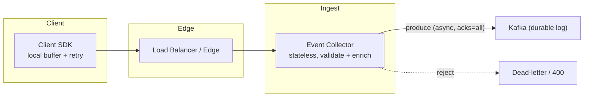

- **Client SDK** — buffers events locally, batches, retries on failure. **Never trust it for correctness**, but it's your first buffer against blips.
- **Load balancer / edge** — spreads the firehose across collectors; can shed bot traffic early.
- **Event Collector (stateless) ⭐** — the default answer. Validates schema, enriches (GeoIP, bot flags, server timestamp), and **produces to Kafka as fast as possible**. Stateless → scale horizontally behind the LB. It does the *minimum* work so it can keep up.
- **Dead-letter** — malformed events go to a DLQ/`400`, never block the pipeline.

> **The key move:** the collector's only job is *"get it into Kafka durably, then get out of the way."* All heavy processing happens **downstream, asynchronously**. This is what lets the write path stay available under a 5× spike.

---

## 7. High-Level Architecture

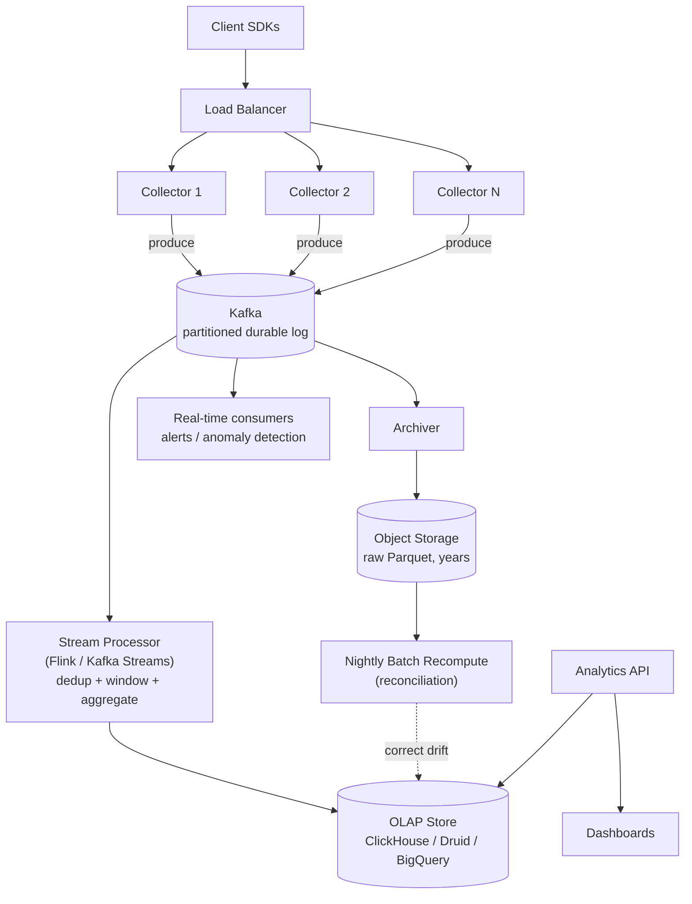

**The three consumers of the Kafka log — this is the heart of the design:**
1. **Stream processor** → aggregates in near-real-time → **OLAP store** (fast, fresh, *approximate-until-reconciled*).
2. **Archiver** → dumps raw events to **object storage** (the immutable source of truth).
3. **Real-time consumers** → alerting/anomaly detection off the same log.

Kafka's superpower: **one durable log, many independent consumers**, each at its own pace, each replayable. Add a new consumer (a new metric, a new team) without touching producers.

### Why separate write and read stores?

The write side needs **high-throughput sequential appends** (a log). The read side needs **fast columnar scans over billions of rows** (OLAP). No single store is great at both — so we use the log for ingest and the OLAP store for query, connected by stream processing. This is **CQRS at planetary scale**: the raw log is the command/write model, the OLAP aggregates are the read model.

---

## 8. Lambda vs Kappa — Two Architectures, One Choice

The classic question: how do you get **both** fast-but-approximate real-time numbers **and** accurate historical numbers?

### Lambda architecture (batch layer + speed layer)

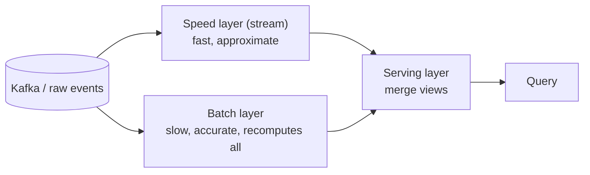

- **Speed layer** gives you numbers in seconds (maybe slightly wrong).
- **Batch layer** reprocesses everything periodically and produces the authoritative answer.
- **Serving layer** merges: recent data from speed, older data from batch.
- **Cost:** you maintain **two codebases** (stream + batch) that must produce the *same* result — a notorious source of bugs and drift.

### Kappa architecture (stream-only) ⭐ — the modern default

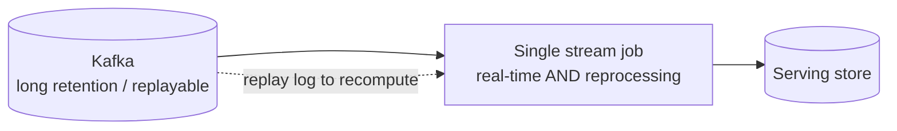

- **One code path** for real-time and reprocessing. To fix a bug or add a metric, you **replay the Kafka log** through the (new) stream job — no separate batch pipeline.
- Requires Kafka retention long enough (or a replay from the object-storage archive) to reprocess history.
- **Trade-off:** simpler and DRY, but reprocessing huge histories through a stream engine can be slower/costlier than a purpose-built batch job.

### The pragmatic hybrid (what most real systems do)

Kappa-style stream for freshness **+ a nightly batch reconciliation** that recomputes from the raw object-storage archive and **corrects any drift** in the OLAP store. You get real-time numbers *and* a nightly accuracy backstop, without maintaining two full pipelines.

> **Interview line:** *"I'd default to **Kappa** — one stream job, reprocess by replaying the log — and add a nightly batch reconciliation from the raw archive as an accuracy backstop. Full Lambda's dual codebase is a maintenance tax I'd avoid unless batch has to do something the stream fundamentally can't."*

---

## 9. Partitioning — The Decision That Makes or Breaks Scale

Kafka ordering and parallelism are **per partition**. The partition **key** is a high-stakes choice.

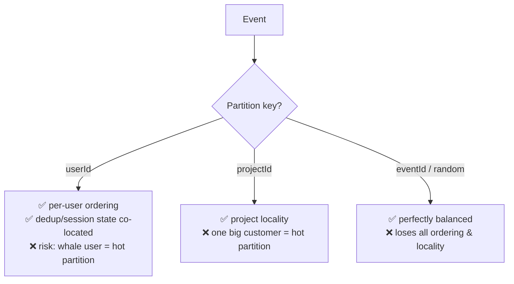

| Key | Ordering guarantee | Locality benefit | Hot-partition risk |
|---|---|---|---|
| **userId** ⭐ | Per-user event order (needed for sessions, dedup) | Same user's events land on one consumer → stateful dedup/sessionization is easy | A single "whale" user or bot can overload one partition |
| **projectId** | Per-project order | Good if queries/tenancy are per-project | One huge customer overloads a partition |
| **eventId / round-robin** | None | None | None — perfectly balanced, but you lose everything ordering gives you |

**Default: partition by `userId`** — most dedup and sessionization logic needs all of a user's events together, and per-user ordering is usually what matters. Then **handle the hot partition explicitly** (next).

### Hot partition mitigation

- **Composite key:** `userId:bucket` where `bucket = hash(eventId) % N` — spreads a whale across N partitions. You lose strict per-user ordering, so only do this when the downstream logic tolerates it (e.g., pure counting) or you re-merge downstream.
- **Salting only the offenders:** detect high-cardinality producers and salt just those keys, leaving normal users cleanly partitioned.
- **Right-size partition count up front** — repartitioning a live Kafka topic is painful; over-provision partitions early (you can add consumers later, but not easily reduce partitions).

> **Staff-level nuance to say:** *"Partition count is a semi-permanent decision — adding partitions later reshuffles keys and breaks per-key ordering for in-flight data, so I size generously from day one."*

---

## 10. Event Time, Watermarks & Windowing (the deepest part)

The single hardest concept — and the one that separates senior from staff.

### The problem: three different clocks

- **Event time** — when it *actually happened* on the client (in the payload).
- **Ingestion time** — when Kafka received it.
- **Processing time** — when the stream job got to it.

A phone goes into a tunnel, buffers events offline for 2 hours, then reconnects and flushes. Those events *happened* at 10:00 but *arrive* at 12:00. If you bucket by processing time, your 10:00 count is permanently wrong and your 12:00 count is inflated. **Correct time-based analytics must use event time.**

### Windowing

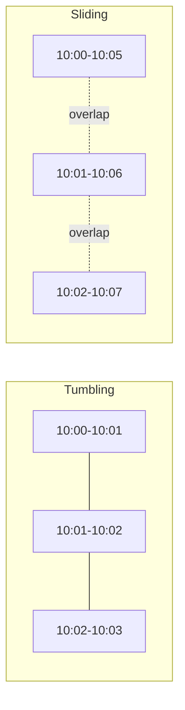

- **Tumbling window** — fixed, non-overlapping (per-minute, per-hour counts). Each event lands in exactly one window. This is your default for "count per interval."
- **Sliding window** — overlapping (5-minute moving average, updated every minute). Each event lands in several windows. For smoothed trend lines.
- **Session window** — dynamic, closes after a gap of inactivity (e.g., 30 min idle = session end). For "how long was the user active?"

### Watermarks — deciding when a window is "done"

You can't wait forever for late events, but you can't emit too early either. A **watermark** is the pipeline's assertion: *"I believe I've seen all events up to time T; windows ending at or before T can be finalized."*

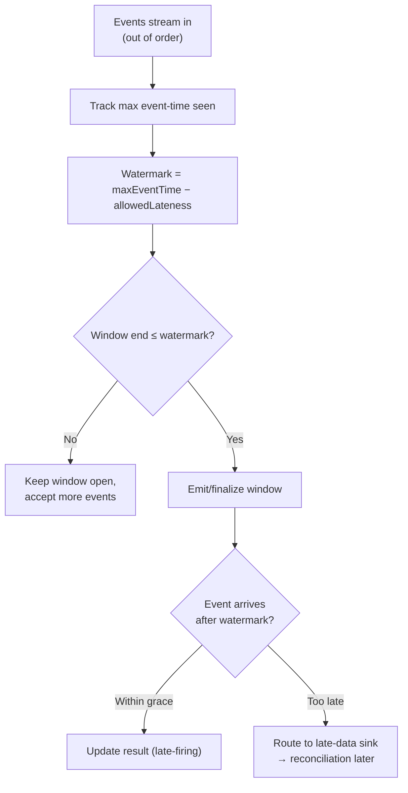

**The trade-off is explicit and adjustable:**
- **Longer allowed-lateness** → more correct (captures stragglers) but **higher latency** (windows stay open longer, results appear later) and more state held in memory.
- **Shorter allowed-lateness** → fresher results but you drop late events → numbers are slightly wrong until batch reconciliation fixes them.

> **Interview line:** *"I bucket by **event time**, use **tumbling windows** for per-interval counts, and a **watermark = max-seen-event-time minus an allowed-lateness** (say 5 minutes) to decide when to finalize. Stragglers beyond that go to a late-data sink and get folded in by the **nightly reconciliation** from raw. So freshness and completeness are a dial I set per metric."*

---

## 11. Counting Accuracy — At-Least-Once vs Exactly-Once

The trade-off that decides whether your numbers are "roughly right" or "provably right."

### Why duplicates happen (at-least-once is the default)

Kafka and stream engines guarantee **at-least-once** by default: if a consumer crashes after processing but *before* committing its offset, it reprocesses on restart → **double counting**. Producers retrying on a network blip also create duplicate events.

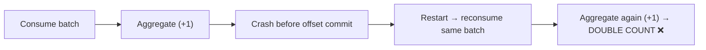

### Three levels of accuracy (choose by metric criticality)

| Approach | Accuracy | Cost | Use when |
|---|---|---|---|
| **At-least-once + accept drift** | Slightly over-counts | Cheapest | Product metrics where ±0.1% is fine |
| **At-least-once + idempotent dedup** ⭐ | Effectively exact | Medium (needs a dedup store) | Most metrics; the pragmatic default |
| **True exactly-once (transactional)** | Provably exact | Highest (coordination) | Billing / ad-click revenue |

### Dedup: the pragmatic path

Deduplicate on the client-generated **`eventId`**. Because we partitioned by `userId`, all of a user's events (and their dedup state) live on one consumer — so the dedup lookup is local and fast.

- **Bounded-window dedup:** keep seen `eventId`s in a fast store (RocksDB state in Flink, or Redis) with a **TTL matching your allowed-lateness window** (e.g., a few hours). You can't remember every ID forever, so you only dedup within the window where duplicates realistically occur.
- **Probabilistic dedup at extreme scale:** a **Bloom filter** per window catches ~all duplicates with tiny memory, accepting a minuscule false-positive rate (drops a real event rarely) — reconciliation catches the rest.

### True exactly-once (for billing)

Exactly-once requires the aggregation update and the Kafka offset commit to be **atomic** — either both happen or neither:

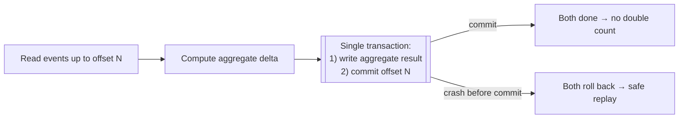

Flink does this via **checkpointing** (aligned barriers snapshot state + offsets together); Kafka Streams via **transactional producers** (`read-process-write` in one transaction). The principle to state: **"exactly-once means the result and the offset are committed as one atomic unit, so a replay can never double-count."**

### Counting *unique* users (cardinality)

"Unique visitors" is a `COUNT(DISTINCT userId)` — exact counting needs storing every id (huge). Use **HyperLogLog**: ~1.5 KB of state estimates cardinality of billions with ~2% error, and HLL sketches are **mergeable** across partitions/windows. OLAP stores (ClickHouse `uniqCombined`, BigQuery `APPROX_COUNT_DISTINCT`, Druid HLL) have this built in.

> **Interview line:** *"Default to at-least-once with `eventId` dedup in a windowed state store — effectively exact for product metrics. For revenue/billing I use true exactly-once by committing the aggregate and the offset in one transaction. For unique counts I use HyperLogLog sketches — approximate but mergeable and tiny."*

---

## 12. OLAP Store Selection — Why Columnar

The read side must scan billions of rows and `GROUP BY` in under a second. That rules out row-oriented OLTP databases.

### Row store vs column store — the core insight

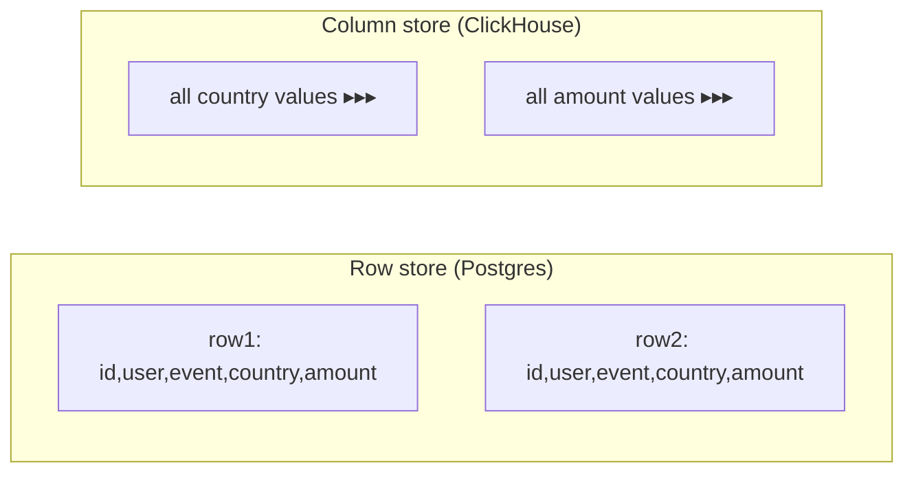

An analytics query like `SUM(amount) GROUP BY country` touches **2 of 10 columns**. A **column store** reads only those two columns' contiguous blocks — 5× less I/O — and compresses them brutally well (a `country` column is a few repeated strings → tiny after dictionary + RLE encoding). A **row store** must read every full row. Columnar is **10–100× faster** for aggregations, which is the entire read workload here.

| Store | Model | Sweet spot | Watch out |
|---|---|---|---|
| **ClickHouse** ⭐ | Columnar, self-hosted | Blazing scans, real-time inserts, cost control | Ops-heavy; not for high-concurrency point lookups |
| **Apache Druid / Pinot** | Columnar + time-series, pre-aggregation | Real-time ingest + sub-second slice/dice dashboards | More moving parts |
| **BigQuery / Snowflake** | Columnar, serverless/managed | Zero-ops, elastic, huge historical scans | Per-query cost; higher query latency |
| **PostgreSQL** | Row store | ❌ Not the analytical store at this scale | Dies on billion-row scans |

**Why not just Postgres?** It's a row store with B-tree indexes tuned for point reads and transactions. A `GROUP BY country` over a billion rows reads every row and can't exploit columnar compression — minutes, not milliseconds, and it competes with your OLTP traffic. Postgres can hold *rules/metadata*, never the analytical fact table.

### Pre-aggregation (rollups) is what makes it sub-second

Even a fast columnar store shouldn't scan 10B raw rows per dashboard load. The stream job writes **rollup tables** (per-minute/hour counts by dimension). Queries hit the ~14M-row rollup, not the 10B-row raw table — the ~1000× reduction from §4. Druid/Pinot do this natively; in ClickHouse you use materialized views / `AggregatingMergeTree`.

---

## 13. Backpressure — When the Consumer Can't Keep Up

The read side (stream processor / OLAP) is slower than the write side (firehose). What happens when it falls behind?

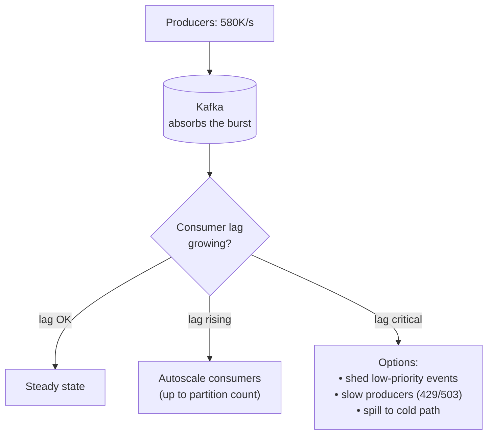

**Kafka *is* the backpressure buffer** — its entire reason for existing here. Because it's durable disk-backed storage, a slow consumer just means **growing lag**, not lost data. The consumer catches up when the spike passes; nothing is dropped.

**Layers of backpressure handling, in order:**
1. **Buffer in Kafka** — absorbs bursts up to retention limit. This is the default and usually enough.
2. **Autoscale consumers** — add stream-processor instances, up to the partition count (you can't parallelize beyond partitions — another reason to over-provision them).
3. **If lag is unrecoverable** — shed load: drop/sample low-priority event types, or tell collectors to return `503 Retry-After` so SDKs buffer locally and retry.
4. **Monitor consumer lag as the #1 health metric** — rising lag is the earliest signal the pipeline is falling behind.

> **Key line:** *"Backpressure is handled by Kafka acting as a durable shock absorber — a slow consumer produces lag, not data loss. I monitor consumer lag as my primary SLO signal and autoscale consumers up to the partition count; only if lag becomes unrecoverable do I shed or sample low-priority events."*

---

## 14. Data Retention & Tiered Storage

You cannot keep everything hot forever — cost explodes. Age data through tiers matching access frequency.

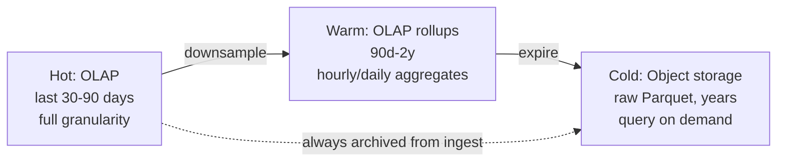

- **Raw events → object storage (Parquet) from ingest** — cheap, immutable, the recompute source of truth, kept for years (or compliance-driven duration).
- **Hot OLAP (30–90 days)** — full-granularity aggregates for fast recent dashboards.
- **Downsampling** — older data kept at coarser granularity (per-second → per-hour → per-day). Nobody needs per-second data from 18 months ago.
- **GDPR/PII deletion** — because raw is immutable, "delete user X" means either tombstone-based compaction or storing PII separately (a `userId → PII` table you can purge) while events keep only the opaque id. Name this as a real design constraint.

---

## 15. Schema Evolution

Events evolve — teams add fields constantly. A rigid schema breaks producers; no schema means garbage downstream.

- **Schema registry (Avro/Protobuf)** — producers register schemas; the registry enforces **backward/forward compatibility** (you can add optional fields, not remove/rename required ones). Prevents a bad deploy from poisoning consumers.
- **Compatibility rules:** *backward* = new consumer reads old data; *forward* = old consumer reads new data. Enforce both for a shared event bus.
- **Malformed / unknown events → dead-letter queue**, never dropped silently — you can inspect and replay them after a fix.

---

## 16. Failure Scenarios

| Failure | Handling |
|---|---|
| **Collector crashes** | Stateless + behind LB → traffic reroutes; SDK retries buffered events |
| **Kafka broker down** | Replication factor 3 + `acks=all`; another broker's replica takes over; no data loss |
| **Kafka fully unavailable** | Collector returns `503 Retry-After`; SDKs buffer locally and retry (bounded local loss only if outage exceeds SDK buffer) |
| **Stream processor crashes** | Restart, resume from last committed offset/checkpoint; at-least-once + dedup prevents double count |
| **OLAP store down** | Kafka retains events; consumer lag grows but nothing lost; catches up on recovery. Dashboards read stale-but-available data |
| **Duplicate event** | `eventId` dedup within window; reconciliation as backstop |
| **Hot partition** | Composite/salted key; salt only offenders; right-size partitions upfront |
| **Late / out-of-order events** | Event-time windows + watermark + allowed-lateness; stragglers → late sink → reconciliation |
| **Bad aggregation logic deployed** | Fix job, **replay Kafka / raw archive** (Kappa) to recompute — the raw log is the safety net |
| **Poison / malformed event** | Schema registry rejects → dead-letter queue, pipeline keeps flowing |

The unifying principle: **the immutable raw log makes almost every failure recoverable** — if a derived result is wrong, recompute it from raw. That's why we pay to archive everything.

---

## 17. Trade-Offs to Say Out Loud

| Axis | Option A | Option B | Choose by |
|---|---|---|---|
| Architecture | Lambda (batch + speed) | Kappa (stream-only + replay) | DRY/maintenance vs batch-only needs |
| Counting | At-least-once + dedup | True exactly-once (transactional) | Metric criticality (product vs billing) |
| Unique counts | Exact `COUNT(DISTINCT)` | HyperLogLog (approximate, mergeable) | Precision need vs memory/scale |
| Freshness vs completeness | Short allowed-lateness (fresh) | Long allowed-lateness (complete) | Per-metric SLA (set the watermark dial) |
| Partition key | userId (ordering/locality) | random (balanced) | Need for ordering/stateful dedup vs balance |
| Storage | Keep raw forever (flexible) | Aggregate-only (cheap) | Reprocessing flexibility vs cost |
| Read store | ClickHouse (fast, ops) | BigQuery (zero-ops, per-query cost) | Ops capacity vs cost model |
| Processing | Stream (fresh, complex) | Batch (simple, delayed) | Freshness requirement |

---

## 18. Low-Level Design (clean OO)

```java
interface EventCollector {                 // ingest entry point
    IngestResult accept(List<Event> batch);
}

interface Validator { ValidationResult validate(Event e); }   // schema + enrich

interface EventPublisher {                 // DIP: depend on abstraction, not Kafka
    void publish(Event e);                 // → Kafka producer, acks=all
}

interface StreamJob {
    void process(EventStream in);          // dedup → window → aggregate → sink
}

interface Deduplicator { boolean isDuplicate(String eventId); }   // windowed state / Bloom
interface Aggregator   { void add(Event e, Window w); }           // Strategy per metric
interface OlapSink     { void writeRollup(Aggregate a); }

class TumblingWindow  { long startMs; long endMs; long allowedLatenessMs; }
```

**Patterns worth naming:**
- **Pipeline / dataflow** — collect → buffer → process → serve, each stage independently scalable.
- **CQRS** — raw log is the write model; OLAP rollups are the read model.
- **Event sourcing** — the immutable raw log is the source of truth; state is derived and rederivable.
- **Strategy** — swap aggregation logic (count, sum, HLL uniques) per metric without touching the pipeline.
- **DIP / SRP** — `EventPublisher` abstracts Kafka; `Validator`, `Deduplicator`, `Aggregator`, `OlapSink` each own one responsibility.

---

## 19. Observability

| Category | Metrics |
|---|---|
| Ingest | events/sec accepted, rejected/sec, collector p99, 503 rate |
| Kafka | **consumer lag (⭐ primary SLO)**, partition skew, under-replicated partitions, throughput |
| Processing | window fire rate, **late-event rate**, dedup hit rate, checkpoint duration |
| Correctness | **stream vs batch drift** (reconciliation delta), DLQ size |
| OLAP | query p95, ingest rate, storage growth, rollup freshness |
| Cost | bytes/day per tier, archive growth, per-query cost (managed OLAP) |

The staff-level insight: **observe correctness, not just availability.** Consumer lag tells you if you're keeping up; the **reconciliation drift metric** tells you if your fast numbers are actually *right*. Both matter.

---

## 20. Interview Q&A

**Beginner**

**Q: Why put Kafka in the middle — why not write straight to the database?**
The producer is bursty (5× spikes) and the analytical store is slow at high-volume small writes. A synchronous write per event would drop data or fall over under load. Kafka is a durable, replayable buffer that decouples a fast producer from a slower consumer — it absorbs bursts as lag, not loss, and lets many consumers read the same events independently.

**Q: Why an OLAP/columnar store instead of Postgres?**
Dashboards scan billions of rows and `GROUP BY`. A columnar store reads only the columns a query touches and compresses them heavily — 10–100× faster for aggregations. Postgres is a row store tuned for point reads and transactions; a billion-row `GROUP BY` reads every row and competes with OLTP traffic. Postgres holds metadata, never the fact table.

**Q: How do you not lose events?**
Kafka with replication factor 3 and `acks=all` (ack only after replicas persist), plus archiving every raw event to object storage. If a consumer is down, Kafka retains the data and it catches up. The SDK also buffers and retries on ingest failure.

**Intermediate**

**Q: An event that happened at 10:00 arrives at 12:00. How do you count it correctly?**
Bucket by **event time**, not arrival time. Use tumbling windows plus a **watermark** = max-event-time-seen minus an allowed-lateness (say 5 min) to decide when to finalize a window. Events later than that go to a late-data sink and are folded in by nightly reconciliation. Freshness vs completeness is a dial I set per metric.

**Q: How do you avoid double-counting?**
At-least-once is the default — a consumer that crashes after processing but before committing its offset reprocesses. I dedup on the client-generated `eventId` in a windowed state store (TTL = allowed-lateness). For billing I go further: true exactly-once by committing the aggregate result and the Kafka offset in one atomic transaction, so a replay can't double-count.

**Q: One customer sends 100× the traffic — what breaks?**
Hot partition, if I keyed by projectId/userId. Kafka ordering and parallelism are per-partition, so one partition becomes the bottleneck. Fix: a composite/salted key (`userId:hash%N`) to spread that producer across partitions — accepting weaker per-key ordering where the logic tolerates it — and right-sizing partition count upfront since repartitioning live is painful.

**Advanced / Staff**

**Q: Lambda or Kappa, and why?**
Kappa by default — one stream job for real-time and reprocessing, and to recompute you replay the log. Lambda's separate batch and speed layers mean two codebases that must produce identical results, which drifts and is a maintenance tax. I add a nightly batch reconciliation from the raw archive as an accuracy backstop — the freshness of stream with a correctness net, without a full second pipeline.

**Q: How do you guarantee exactly-once for ad-click billing?**
Exactly-once means the aggregation update and the offset commit are one atomic unit. Flink does this with aligned checkpoint barriers snapshotting state and offsets together; Kafka Streams with transactional read-process-write. On crash, both roll back and the replay is safe — never double-counted. And I keep the raw log so I can prove and recompute the numbers.

**Q: How do you count unique users at billions/day without storing every id?**
HyperLogLog sketches — ~1.5 KB estimates cardinality of billions with ~2% error, and sketches are mergeable across partitions and time windows, so I can roll up "uniques this week" from per-hour sketches. Exact `COUNT(DISTINCT)` would need storing every id — only worth it when a metric legally must be exact.

**Q: The OLAP store is down for 30 minutes. What happens to the data?**
Nothing is lost. Kafka retains events for days, so the stream consumer just accrues lag; when OLAP recovers, it drains the backlog and catches up. Dashboards read slightly stale but available data. This is the whole point of buffering in a durable log — availability of the read store is decoupled from durability of the data.

---

## 21. 30-Second Interview Answer

> "I split the write and read paths because they have opposite needs. Events from SDKs hit **stateless collectors** that validate, enrich, and produce to **Kafka** — a durable, replayable log that absorbs 5× bursts as lag, not loss. Three consumers read that log: a **stream processor** (Flink) that dedups on `eventId`, aggregates in **event-time tumbling windows** with **watermarks** for late events, and writes rollups to a **columnar OLAP store** (ClickHouse) for sub-second dashboards; an **archiver** dumping raw Parquet to **object storage** as the immutable source of truth; and real-time alerting. I partition by **userId** for ordering and local dedup, and salt hot keys. Counting is **at-least-once + dedup** for product metrics, **true exactly-once** — offset and aggregate committed atomically — for billing, and **HyperLogLog** for uniques. Architecture is **Kappa** (replay the log to reprocess) plus a nightly **reconciliation** from raw as the accuracy backstop. Backpressure is Kafka itself; I watch **consumer lag** as my primary SLO. Old data ages from hot OLAP to cold object storage."

---

## 22. Mental Model

```text
EVENT
   ↓ SDK (local buffer + retry)
   ↓ Collector (stateless: validate + enrich)         ── minimum work, get out of the way
   ↓ KAFKA (durable, partitioned, replayable log)     ── the shock absorber
   ├──► Stream processor → dedup → event-time window → OLAP rollups  (fast, fresh)
   ├──► Archiver → object storage raw Parquet                        (source of truth, cheap)
   └──► Real-time alerting

QUERY → OLAP rollups (columnar, pre-aggregated) → Dashboard

BUFFER      → Kafka (days) | Object storage (years) | OLAP (aggregates)
PARTITION   → userId (ordering + local dedup); salt hot keys
TIME        → event-time + watermark + allowed-lateness (freshness ⇄ completeness dial)
COUNTING    → at-least-once + dedup | exactly-once (offset+result atomic) | HLL for uniques
ARCH        → Kappa (replay to reprocess) + nightly reconciliation
READ STORE  → columnar OLAP + pre-aggregation (~1000× smaller than raw)
BACKPRESSURE→ Kafka lag; autoscale to partition count; shed low-priority last
FAILURE     → raw log makes everything recomputable
RETENTION   → hot OLAP → downsample → cold object storage
```

---

## 23. How This Connects to Other Topics

- **Rate limiter** — same accuracy-vs-speed trade: exact counting needs coordination (exactly-once), approximate scales (at-least-once + HLL). Token-bucket counters are a tiny cousin of these aggregations.
- **Message queues / Kafka deep-dive** — this *is* the canonical Kafka use case: durable buffer, per-partition ordering, consumer groups, replay. Backpressure = consumer lag.
- **Batch & stream processing (DDIA Ch. 10–11)** — Lambda/Kappa, event-time vs processing-time, watermarks all come straight from Kleppmann.
- **CQRS & event sourcing** — the raw immutable log is the write model / event store; OLAP rollups are the read model; derived state is rederivable by replay.
- **Data-intensive storage** — row vs column store, dictionary/RLE compression, pre-aggregation are the OLAP fundamentals behind ClickHouse/Druid/BigQuery.
- **Idempotency & exactly-once** — `eventId` dedup is idempotency by another name; atomic offset+result commit is the distributed-transaction pattern.
- **Distributed clocks (DDIA Ch. 8)** — event-time vs ingestion-time vs processing-time is exactly "don't trust that clocks agree across machines," applied to windowing.
- **Trending / Top-K & counting** — HyperLogLog, sketches, and windowed aggregation reappear directly in trending-topics and heavy-hitter designs.
