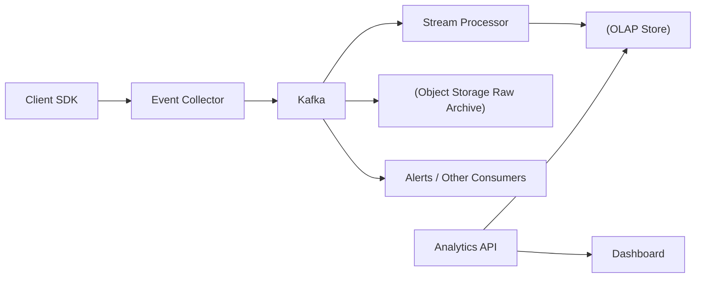
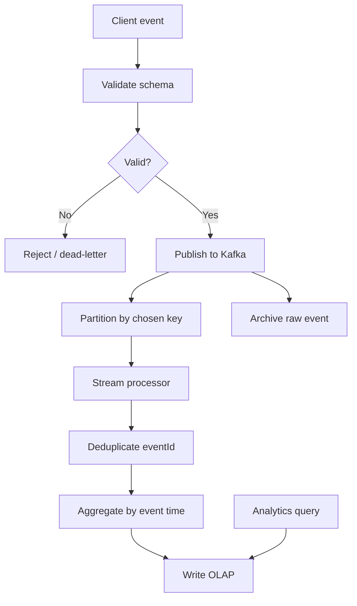
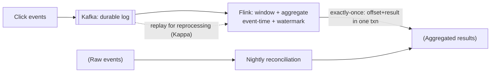

# Analytics / Event Tracking

## 0. Why This Design Matters

Covers Kafka ingestion, partitioning, stream processing, OLAP, event-time, deduplication, schema evolution and hot partitions.

## 1. Problem Overview — Explain It Simply

Collect product events at huge volume, put them into a durable event stream, process them into analytical storage, and expose fast dashboards without making the transactional application database do large scans.

## 2. Functional Requirements

- Event ingestion
- Validation
- Durable raw events
- Near-real-time aggregation
- Funnels
- Retention
- Segmentation
- Export

## 3. Non-Functional Requirements

- Very high ingestion throughput
- Durable events
- Near-real-time analytics
- Horizontal scalability
- Cost-efficient historical storage

## 4. Capacity Estimation

Example: 1B events/day ≈ 11.6K events/sec average and ≈ 58K/sec at 5×. If each event averages 1KB, raw payload is about 1TB/day before replication/overhead.

## 5. API Design

```text
POST /v1/events
{
  "eventId":"E123",
  "projectId":"P1",
  "userId":"U1",
  "event":"purchase",
  "eventTime":"..."
}
```

## 6. High-Level Architecture

```text
Client SDK
 ↓
Event Collector
 ↓
Kafka
 ├── Stream Processor → OLAP
 ├── Raw Archive → Object Storage
 └── Alerts/Other Consumers

Analytics API
 ↓
OLAP
 ↓
Dashboard
```

### HLD Flowchart

The following is the primary interview flowchart. Draw this first, then explain each box.



## 7. Database Selection

Kafka for durable streaming/buffering. OLAP systems such as ClickHouse/BigQuery/Snowflake-like stores for analytical scans/aggregations. Object storage for cheap raw history. PostgreSQL is not the primary analytical store at this scale.

### HLD Deep-Dive Flowchart

Use this second flowchart when the interviewer asks **"walk me through the complete flow"**.



## 8. HLD Deep Dive — Why Each Decision?

### Why Why Kafka?

High-throughput append log with partitions, retention, consumer groups and replay.

### Why How partition?

projectId preserves project locality; userId can preserve per-user ordering. Choose based on required query/order semantics.

### Why Why OLAP?

Columnar/analytical engines are optimized for large scans and aggregations.

### Why Exactly once?

Avoid claiming end-to-end exactly once. Use unique event IDs and idempotent consumers/aggregations.

### Why Late events?

Use event time, windows and watermarks where the product needs correct time-based aggregation.

### Why Schema evolution?

Version schemas and maintain compatibility; a schema registry can enforce contracts.

## 9. Interview Question & Answer

### Q: Processor crashes?

**Answer:** Kafka replay/reconsume.

### Q: Duplicate event?

**Answer:** eventId-based deduplication.

### Q: One project is huge?

**Answer:** Avoid a single hot partition; add buckets/suffixes if ordering requirements allow.

### Q: How reduce storage cost?

**Answer:** Move older raw events to object storage and retain aggregates in OLAP.

## 10. LLD

```text
EventCollector
 ├── Validator
 └── KafkaProducer

StreamProcessor
 ├── Deduplicator
 ├── Aggregator
 └── OLAPWriter

Patterns:
- Event-driven
- Pipeline
- CQRS/read model
- Strategy → aggregation
```

## 11. Failure Checklist

Always walk through:
- Service crash
- Database failure
- Cache/Redis failure
- Kafka/queue failure
- External dependency timeout
- Duplicate request
- Duplicate event
- Hot key/hot partition
- Network partition
- Partial success
- Recovery/reconciliation

## 12. Trade-Offs You Should Say Out Loud

A strong interview answer does not say "this is the only solution."

Instead say:

> "I'm choosing X because of requirement Y. The alternative is Z, which would be better if requirement A were more important."

Typical trade-offs:

| Choice | Benefit | Cost |
|---|---|---|
| Strong consistency | Correctness | Higher latency/coordination |
| Eventual consistency | Scale/availability | Stale reads |
| Redis | Very low latency | Memory/cost/failure considerations |
| PostgreSQL | Transactions | Horizontal write scaling is harder |
| Cassandra | Huge scale/availability | Query-driven modeling, weaker transactions |
| Kafka | Decoupling/replay | Operational complexity |
| Sync processing | Simple response semantics | Higher latency/coupling |
| Async processing | Resilience/scale | Eventual completion |

## 13. Staff-Level Follow-Up Questions

Be ready for these:

1. What breaks first at 10× traffic?
2. What is your hottest key/partition?
3. Can this operation be retried safely?
4. What happens if the service crashes after the external side effect but before the DB update?
5. Which data needs strong consistency?
6. Where can you tolerate eventual consistency?
7. How would you shard it?
8. What happens to a shard becoming hot?
9. How do you recover from a partial failure?
10. How do you observe correctness, not just availability?
11. What would you cache?
12. What would you never cache?
13. Where does backpressure happen?
14. How do you handle replay?
15. Why did you choose this database over the alternatives?

## 14. 2-Minute Interview Explanation

If the interviewer asks you to summarize **Analytics / Event Tracking**, use this structure:

> "I'll first separate the read-heavy and correctness-critical paths. The authoritative state lives in the database best suited to the business invariant, while cache and distributed stores handle high-volume/temporary access. Requests that don't need to block the user are moved to an asynchronous queue/event stream. For concurrency, I use atomic updates, constraints, locks or idempotency depending on the invariant. For failures, I use timeout, retry with exponential backoff and jitter, circuit breakers where appropriate, and reconciliation when an external system can have an unknown outcome. At scale, I shard based on the dominant query/access pattern and explicitly handle hot keys and backpressure."


# Interview Framework

Use this exact flow in the interview:

```text
1. Clarify requirements
       ↓
2. Estimate scale
       ↓
3. Define APIs
       ↓
4. Define data model
       ↓
5. Draw HLD
       ↓
6. Explain request/data flow
       ↓
7. Deep dive into the hardest invariant
       ↓
8. Discuss DB/cache/Kafka
       ↓
9. Concurrency + consistency
       ↓
10. Failure handling
       ↓
11. Scaling/sharding
       ↓
12. LLD
       ↓
13. Trade-offs
```

## Universal Scale Formula

```text
Average QPS = daily requests / 86,400
Peak QPS = average QPS × peak factor
```

Start with an assumption such as 5× and say:

> "I'll use 5× as a starting peak multiplier; we can adjust if you give me a traffic pattern."

## Universal Database Cheat Sheet

### PostgreSQL

Use when you need:

- ACID transactions
- Strong consistency
- Relationships
- Constraints
- Conditional updates
- Booking/payment/inventory

### MongoDB

Use when:

- Data is naturally document-shaped
- Flexible schema matters
- Access is mostly by document
- Relationships are not the dominant problem

### Cassandra

Use when:

- Very high write volume
- High availability
- Predictable query patterns
- Massive time-series/activity/message data

Remember:

> Cassandra data modeling starts from queries, not from normalized entities.

### Redis

Use for:

- Cache
- Counters
- Rate limits
- Locks/leases
- Sessions
- Presence
- Temporary state

Do not automatically make Redis the source of truth for critical durable business state.

### Elasticsearch/OpenSearch

Use for:

- Full-text search
- Ranking
- Autocomplete
- Filtering/faceting

Think of it as a read model, not automatically your transactional source of truth.

### Kafka

Use for:

- Async events
- Decoupling
- Buffering
- Replay
- Fanout
- Stream processing

## Universal Reliability

When interviewer asks "what if X fails?":

```text
Timeout
 ↓
Should we retry?
 ↓
Idempotency
 ↓
Exponential backoff + jitter
 ↓
Circuit breaker
 ↓
Fallback?
 ↓
DLQ?
 ↓
Reconciliation?
```

## Universal Cache Problems

```text
Cache Stampede
→ request coalescing / lock / background refresh

Hot Key
→ local cache / CDN / replication / sharding

Cache Penetration
→ negative cache / Bloom filter

Cache Avalanche
→ TTL jitter / staggered expiry
```

## Universal Kafka

```text
Producer
 ↓
Topic
 ↓
Partitions
 ↓
Consumer Group
 ↓
Consumers
```

- Ordering → within a partition
- Scale → partitions
- Parallelism → consumers
- Replay → retention
- Duplicate events → idempotent consumers

## Universal Consistency Rule

Use strong consistency when the business invariant cannot tolerate stale state:

- Payment
- Wallet
- Booking
- Critical inventory
- Ledger

Eventual consistency is often fine for:

- Search index
- Analytics
- Recommendations
- Notifications
- Like/view counters

The best sentence to remember:

> "Consistency should follow the business invariant, not the technology."

## Universal Concurrency

Ask:

> "What happens if two requests execute this operation at exactly the same time?"

Possible tools:

- Atomic DB update
- Optimistic locking
- Pessimistic locking
- Unique constraint
- Distributed lock/lease
- Idempotency key
- Queue serialization

## Universal Idempotency

If the same request can safely be retried:

```text
request
 ↓
idempotency key
 ↓
existing result?
 ├── yes → return existing result
 └── no → process + store result
```

## Universal Staff-Level Thinking

Always discuss:

1. What happens at 10× traffic?
2. What becomes the bottleneck?
3. What is the hot key/hot partition?
4. What if a dependency fails?
5. What happens if the same request arrives twice?
6. Which state must be strongly consistent?
7. What can be eventually consistent?
8. What can be asynchronous?
9. Where does backpressure happen?
10. How do we observe and reconcile failures?

# Final Interview Rule

Do not jump directly into technologies.

First say:

> "Let me clarify the requirements and scale. Then I'll identify the critical business invariant, because that will drive my consistency and database choices."

That sentence alone makes the discussion much more senior.

---

# 📚 Book Cross-Reference & Added Depth

**Source:** Alex Xu, *System Design Interview* Vol 2, Ch 6 — *Ad Click Event Aggregation* (companion note `Book-System-Design-Vol-2/06-ad-click-event-aggregation.md`).

Book specifics for the aggregation pipeline:

- **Kafka + Flink stream pipeline.** Raw events → **Kafka** (durable buffer) → **Flink** (stream aggregation) → aggregated results DB. Scale in the book: ~**1B clicks/day**, **~50K peak QPS**.
- **Kappa architecture** (stream-only): one code path for real-time *and* reprocessing — to fix a bug or recompute, you **replay the Kafka log** rather than maintaining a separate batch pipeline (contrast Lambda's dual batch+stream paths).
- **Event time + watermarks** handle **late/out-of-order events** (a click's server-receive time ≠ its event time); a **watermark** decides when a window is "closed enough" to emit.
- **Windowing:** **tumbling** (fixed, non-overlapping — for per-minute counts) vs **sliding** (overlapping — for moving averages).
- **Exactly-once** aggregation via **distributed transactions committing the Kafka consumer offset together with the aggregation result**, plus idempotency — so a replay/crash doesn't double-count.
- **Reconciliation:** a nightly batch job recomputes from raw events and corrects any drift in the stream results (accuracy backstop).



**Interview line:** *"Kafka for durable ingest, Flink for windowed aggregation with event-time + watermarks for late events, Kappa so reprocessing is just a replay, exactly-once by committing the offset and result in one transaction, and a nightly reconciliation job as the accuracy backstop."*
