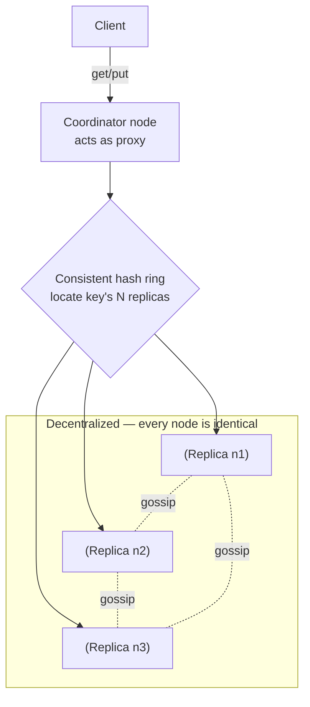
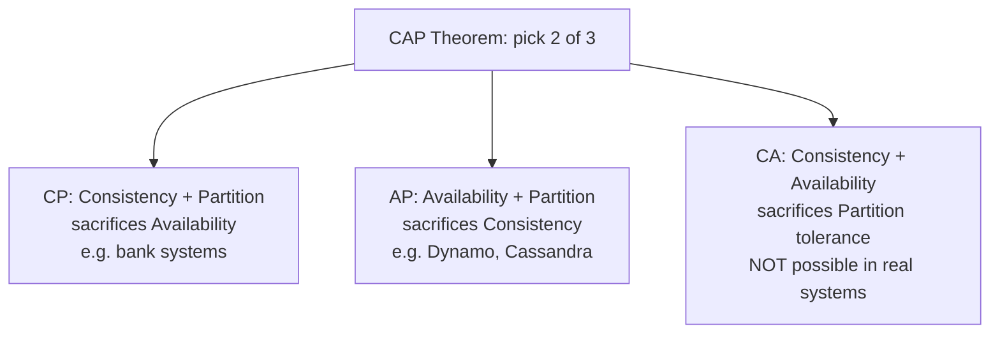
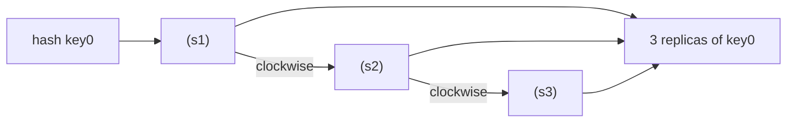
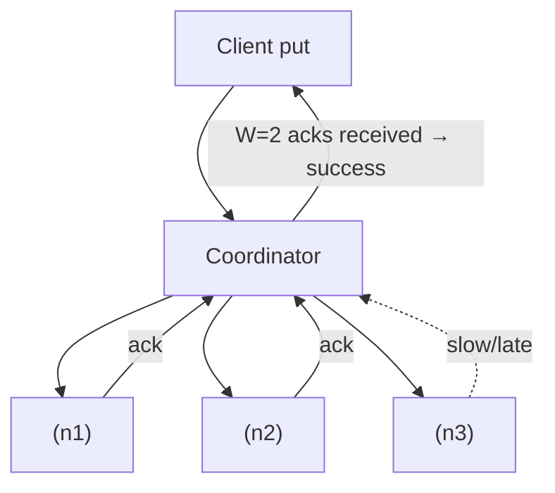
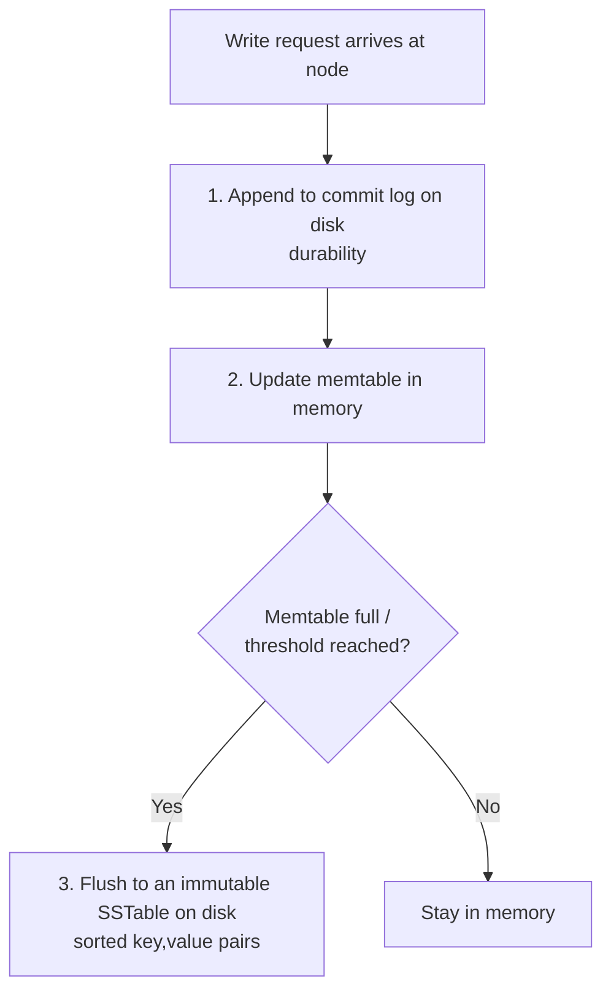
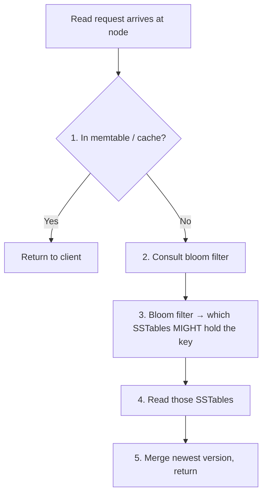
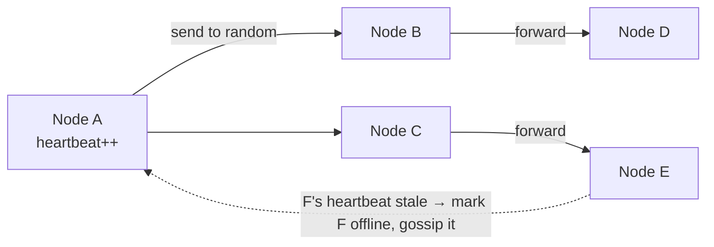

# Distributed Key-Value Store — System Design

**Difficulty:** Advanced (this is the "boss level" — it ties together consistent hashing, replication, quorums, versioning, and failure handling)
**Interview importance:** ⭐ **Critical** (the canonical Dynamo/Cassandra question; a magnet for CAP, quorum, and vector-clock follow-ups)
**References:** ByteByteGo Vol. 1 Ch. 6 — *Design a Key-Value Store*; Amazon Dynamo paper; Cassandra & BigTable internals; DDIA Ch. 5–6, 9

---

## 0. Why This Design Matters

A key-value store is the simplest possible database — `put(key, value)` and `get(key)` — and yet building a *distributed*, *highly available*, *scalable* one forces you to confront **every** hard problem in distributed systems at once: how to partition data, how to replicate it, what happens during a network partition (CAP), how to reconcile conflicting writes, how to detect dead nodes, and how to re-sync a replica that fell behind. There is **no perfect design** — every choice trades read speed against write speed against consistency against availability.

That's exactly why interviewers love it: the API is trivial, so all the signal is in the *internals*. A weak candidate describes a hash map. A strong candidate walks the ring, picks an N/W/R quorum, explains why `W + R > N` gives strong consistency, resolves a conflict with a vector clock, detects failure with gossip, and re-syncs a replica with a Merkle tree.

> The one-line thesis: **a distributed KV store is consistent hashing for *placement*, tunable quorums for *consistency*, and gossip + hinted handoff + Merkle trees for *surviving failure* — all sitting on the AP side of CAP.**

---

## 1. Problem Overview — in Plain English

A **key-value store** is a non-relational database. Each item is a **key** (a unique name) paired with a **value** (the data). You read a value by its key. The store treats the value as an **opaque object** — it never looks inside it. Real examples: Amazon Dynamo, Cassandra, Redis, Memcached.

- The **key** is unique — plain text (`last_logged_in_at`) or a hash (`253DDEC4`). Short keys are faster.
- The **value** is a string, list, or object — opaque to the store.

We support exactly two operations:

```text
put(key, value)   → save a value under a key
get(key)          → return the value for a key
```

The hard part isn't the API — it's making those two operations **fast, always-available, and correct** across hundreds of servers, some of which are always broken at any given moment.

### Real-world analogy — a global chain of coat-check counters

Imagine a worldwide chain of coat-check counters. You hand over a coat (value) and get a ticket (key); later you get the coat back with the ticket. To scale, you open **many counters** and split coats among them (partitioning). So a lost counter never loses a coat, each coat is stored at **three** counters (replication). If the network between cities breaks, each city keeps operating on its own copies and reconciles later (**availability over consistency** — the AP choice). If two clerks edited the same coat's tag simultaneously, you need a rule to reconcile the two tags (**versioning / vector clocks**). And to check that a backup counter is up to date without re-reading every coat, you compare a short summary hash (**Merkle tree**). That's the whole system.

---

## 2. Functional Requirements

**Core**
- `put(key, value)` — write a value (each pair **< 10 KB**).
- `get(key)` — read the value.
- Store **big data** — far more than one machine holds.
- **Replicate** each item to survive node loss.
- **Tunable consistency** — dial consistency up or down per workload.

**Optional (name, then defer)**
- Range scans / secondary indexes (most pure KV stores skip these).
- TTL/expiry, compaction tuning, cross-region replication policy.

---

## 3. Non-Functional Requirements

| Requirement | Target | Why it dominates the design |
|---|---|---|
| **High availability** | Responds even during failures | Drives the AP choice + sloppy quorum |
| **High scalability** | Grows to huge datasets | Drives consistent-hashing partitioning |
| **Automatic scaling** | Nodes join/leave on their own | Decentralized, gossip-based membership |
| **Tunable consistency** | N/W/R configurable | The central knob; `W+R>N` ⇒ strong |
| **Low latency** | Small reads/writes fast | Hot data in memory, bloom filters on disk |
| **Item size** | < 10 KB per pair | Keeps memtables/SSTables efficient |
| **No single point of failure** | Every node equal | Fully decentralized architecture |

> **Say this out loud in an interview:** *"The dominating decision is CAP. A real distributed system must tolerate network partitions, so I'm choosing between CP and AP — and like Dynamo and Cassandra, I'll pick **AP with eventual consistency** and make the exact consistency tunable per request via N/W/R."*

---

## 4. Capacity Estimation (do the math — don't hand-wave)

This design is mechanism-heavy rather than number-heavy, but the sizing facts still matter:

```text
Item size            < 10 KB each
Replication factor   N = 3 (typical)      → 3× raw storage
```

**Storage.** For 100 billion items at ~1 KB average:

```text
100,000,000,000 items × 1 KB      = 100 TB raw
× N=3 replicas                    = 300 TB stored
```

→ Impossible on one machine → **partition across many nodes** (consistent hashing).

**Merkle tree sizing (for anti-entropy).** Buckets trade granularity against tree size:

```text
1,000,000 buckets  for  1,000,000,000 keys
→ ~1,000 keys per bucket
```

Comparing two replicas then costs **~log(#buckets)** hash comparisons to *locate* differences, and transfers data proportional to the **differences only**, not the 300 TB.

**Quorum latency.** With N=3, W=2, R=2 the coordinator waits for the **2nd-fastest** replica, not the slowest — so a single slow/dead node doesn't stall the request. That's the latency payoff of quorums over "wait for all."

**What the numbers tell us:**
- Partitioning is mandatory (storage, and later throughput).
- N=3 is the default replication factor; storage cost is `N ×` raw.
- Merkle trees make re-sync cost scale with *divergence*, not dataset size.
- Quorums buy latency insurance against the slowest replica.

---

## 5. API Design

```http
GET  /v1/kv/{key}          → { "value": ..., "version": "[Sx:2, Sy:1]" }
PUT  /v1/kv/{key}          body: { "value": ..., "context": "<opaque version token>" }
```

The **context/version token** is the vector clock the client got on the last read and echoes back on write — that's how the store detects concurrent modifications.

Per-request consistency knobs (Cassandra-style):

```text
PUT ?w=2        # write ack from at least 2 replicas
GET ?r=2        # read from at least 2 replicas
consistency = ONE | QUORUM | ALL
```

---

## 6. High-Level Architecture



The design borrows from **Dynamo, Cassandra, and BigTable**. Key properties:
- Clients use only `get(key)` / `put(key, value)`.
- Any node can be the **coordinator** (proxy) for a request.
- Nodes sit on a ring via **consistent hashing**; membership is **decentralized** — nodes join/leave automatically.
- Data is replicated to **N** nodes.
- **No single point of failure** — every node has the same responsibilities.

---

## 7. Deep Dive — The Six Mechanisms

### 7.1 CAP Theorem — the choice that shapes everything

**CAP** says a distributed system can guarantee at most **two** of:
- **Consistency (C):** every client sees the same data at the same time.
- **Availability (A):** every request gets a response even if nodes are down.
- **Partition tolerance (P):** the system keeps working when the network between nodes breaks.



Networks *always* partition eventually, so **CA is impossible in the real world** — a real system must be CP or AP. Concretely, with replicas n1, n2, n3 and n3 partitioned off:
- **CP:** block writes to n1/n2 so nobody reads stale data → system goes **unavailable**.
- **AP:** keep serving n1/n2 (possibly stale), sync n3 when the partition heals → stays **available**.

Dynamo/Cassandra (and this design) choose **AP + eventual consistency**.

### 7.2 Data Partition — consistent hashing

Split data over nodes s0…s7 on a **hash ring**. Hash the key onto the ring, store it on the **first node clockwise** (e.g. `key0 → s1`). This gives:
- **Automatic scaling** — nodes join/leave by load, moving only ~k/n keys.
- **Heterogeneity** — a stronger node gets **more virtual nodes** (proportional capacity).

### 7.3 Data Replication — walk clockwise for N

Copy each item to **N nodes**: hash the key to a ring spot, then walk **clockwise** and take the **first N nodes**. With N=3, `key0 → s1, s2, s3`.



Two subtleties:
- Because of virtual nodes, the first N ring points may map to **fewer than N physical servers** — so count **distinct physical servers** only.
- For safety, place replicas in **different data centers** so one DC outage can't lose every copy.

### 7.4 Consistency via Quorum (N / W / R)

Replicas must agree. **Quorum consensus** uses three numbers:
- **N** = number of replicas.
- **W** = write quorum — a write succeeds after **W** replicas ack.
- **R** = read quorum — a read succeeds after **R** replicas respond.

A **coordinator** proxies between client and nodes. Note: **W=1 does *not* mean "written to one server"** — it means the coordinator needs one ack before returning; data still replicates to all N.



The magic inequality: **if `W + R > N`, you get strong consistency** — the read set and write set must overlap by at least one node, so at least one responding replica has the latest write.

Common setups:

| Config | Meaning |
|---|---|
| R=1, W=N | Fast reads, slow/strict writes |
| W=1, R=N | Fast writes, slow reads |
| **N=3, W=2, R=2** | `W+R=4 > 3` → **strong consistency**, balanced (the default) |
| W+R ≤ N | Strong consistency **not** guaranteed |

**Consistency models:** *strong* (read always sees latest write), *weak* (may miss it), *eventual* (a weak model where, given time, all replicas converge). Strong consistency blocks reads/writes until every replica agrees, hurting availability — so Dynamo/Cassandra use **eventual consistency**: inconsistent values are allowed in, and the **client reconciles on read**.

### 7.5 Inconsistency Resolution — versioning & vector clocks

Replication creates conflicts. If n1 and n2 both hold the same item and, concurrently, one sets the name to `johnSanFrancisco` and the other to `johnNewYork`, you have conflicting versions v1 and v2 with no automatic winner.

**Versioning** treats every change as a new **immutable version**. A **vector clock** is a list of `[server, version]` pairs attached to the item, written `D([S1, v1], [S2, v2], …])`. When item D is written via server Si:
- **Increment vi** if `[Si, vi]` already exists.
- Otherwise **add a new `[Si, 1]`**.

```mermaid
flowchart TD
    D1["D1 ["Sx:1"]"] -->|update via Sx| D2["D2 ["Sx:2"]"]
    D2 -->|update via Sy| D3["D3 ["Sx:2, Sy:1"]"]
    D2 -->|update via Sz| D4["D4 ["Sx:2, Sz:1"]"]
    D3 --> CFLICT{"D3 vs D4<br/>CONFLICT — siblings"}
    D4 --> CFLICT
    CFLICT -->|"client merges, write via Sx"| D5["D5 ["Sx:3, Sy:1, Sz:1"]"]
```

Rules for comparing versions X and Y:
- **X is an ancestor of Y (no conflict)** if every counter in X ≤ the matching counter in Y. e.g. `([s0,1],[s1,1])` precedes `([s0,1],[s1,2])`.
- **X and Y are siblings (conflict)** if any counter in one is *less* than its match in the other. e.g. `([s0,1],[s1,2])` vs `([s0,2],[s1,1])` conflict — neither descends from the other.

**Downsides:** (1) the **client** must implement conflict resolution — added complexity; (2) the `[server:version]` list can grow long. Fix: cap the list length by a **threshold** and drop the oldest pairs — slightly less accurate, but Amazon reports it hasn't been a problem in production.

### 7.6 Write and Read Paths (LSM-tree, Cassandra-style)

**Write path** — durability first, then memory, then disk:



An **SSTable** (Sorted-String Table) is a sorted, immutable list of `<key, value>` pairs on disk. Writes are fast because they're just an append + an in-memory update.

**Read path** — memory, then a bloom filter to avoid scanning every SSTable:



A **bloom filter** is a space-efficient probabilistic membership test: it can say "*maybe present*" (check that SSTable) or "*definitely absent*" (skip it) — never a false "absent." That keeps disk reads cheap even with many SSTables.

---

## 8. Comparison / Trade-off Table

| Axis | Option A | Option B | Choose by |
|---|---|---|---|
| CAP side | **CP** (strong, may reject) | **AP** (available, eventual) | Bank ledger vs shopping cart |
| Read tuning | R=1 (fast, maybe stale) | R=N (fresh, slow) | Freshness need |
| Write tuning | W=1 (fast) | W=N (durable, slow) | Durability need |
| Consistency | Strong (`W+R>N`, coordination) | Eventual (scales, may conflict) | Correctness vs availability |
| Conflict handling | Last-write-wins (simple, loses data) | Vector clocks (correct, client merges) | Tolerance for lost updates |
| Storage engine | In-place B-tree (fast reads) | LSM/SSTable (fast writes) | Read- vs write-heavy |

---

## 9. Failure Scenarios

| Failure | Mechanism | How it's handled |
|---|---|---|
| **Detecting a dead node** | **Gossip protocol** | Each node keeps a membership list of heartbeat counters, bumps its own, and periodically sends heartbeats to random nodes that forward them on. If a node's heartbeat stops increasing for a set period, it's marked **offline** and that spreads. (One node's word isn't enough — need ≥2 independent sources; all-to-all multicast doesn't scale.) |
| **Temporary node outage** | **Sloppy quorum + hinted handoff** | Instead of strict replicas, pick the first **W healthy** nodes for writes and first **R healthy** for reads, skipping the down node. A substitute node (e.g. s3) temporarily takes s2's writes with a "hint"; when s2 returns, s3 **hands the data back**. Keeps reads/writes flowing during a blip. |
| **Permanent replica loss** | **Anti-entropy + Merkle trees** | Re-sync replicas by comparing **Merkle trees** (each non-leaf node = hash of its children). Compare root hashes; if equal, identical. If not, drill into mismatched children to find only the differing buckets and sync **just those** — data transferred ∝ differences, not total size (1M buckets / 1B keys ≈ 1000 keys/bucket). |
| **Data-center outage** | **Cross-DC replication** | Place replicas across multiple data centers so a full DC outage still lets clients read from another. |
| **Concurrent conflicting writes** | **Vector clocks** | Detect siblings vs ancestors; client reconciles on read. |
| **Read after node lag** | **Read repair / quorum** | With `W+R>N` the read set overlaps the write set, so a stale replica is detected and repaired. |

### Gossip, visualized



---

## 10. Common Mistakes

- **Claiming CA.** A distributed store can't have consistency + availability *and* survive partitions — partitions are inevitable, so it's CP or AP. Saying "CA" signals you don't get the theorem.
- **Thinking W=1 means one copy.** W is the *ack threshold* the coordinator waits for; the data still replicates to all N.
- **Forgetting `W + R > N`.** This is the single most-tested formula; it's the condition for strong consistency via quorum.
- **Last-write-wins without saying so.** LWW is simple but silently drops concurrent updates; if you use it, name the data-loss trade-off. Vector clocks are the "correct" answer.
- **Counting virtual nodes as physical replicas.** When walking clockwise for N replicas, collect **distinct physical servers**, or all copies could land on one machine.
- **Putting the DB itself on the write hot path with in-place updates.** LSM/SSTable (append + memtable) is why writes are fast; describing random in-place disk writes misses the engine design.
- **Skipping bloom filters** on the read path — without them a read may scan every SSTable.

---

## 11. Interview Q&A

**Beginner**

**Q: What is a key-value store and what's the API?**
A non-relational DB mapping unique keys to opaque values, with just `get(key)` and `put(key, value)`. It never inspects the value. Examples: Dynamo, Cassandra, Redis.

**Q: Why can't one server do it?**
Memory and disk fill up, and one node is a single point of failure. You partition data across many nodes (a distributed hash table) and replicate for availability.

**Intermediate**

**Q: Explain CAP and your choice.**
Pick two of Consistency, Availability, Partition tolerance. Partitions are unavoidable, so CA is impossible; you choose CP or AP. Like Dynamo/Cassandra I choose **AP with eventual consistency**, and make it tunable per request with N/W/R.

**Q: What does `W + R > N` guarantee?**
Strong consistency. The write set and read set overlap by at least one node, so any read includes at least one replica holding the latest write. Common: N=3, W=2, R=2.

**Q: How do you place replicas?**
Hash the key onto the ring and walk clockwise, taking the first N **distinct physical** servers — ideally spread across data centers.

**Advanced / Staff**

**Q: Two clients write the same key concurrently — how do you resolve it?**
Versioning with **vector clocks**: each write carries `[server, version]` pairs. If one version's counters all ≤ another's, it's an ancestor (safe overwrite). If neither dominates, they're **siblings** — a conflict — and the client reconciles on read, writing back a merged version. The clock list is capped by a threshold to bound its length.

**Q: How do you detect failure and handle temporary vs permanent loss?**
Detection is decentralized **gossip** (heartbeat counters spread to random nodes). Temporary outages use **sloppy quorum + hinted handoff** — a substitute holds writes and hands them back on recovery. Permanent loss uses **anti-entropy with Merkle trees** — compare root hashes, drill into mismatched buckets, sync only the diffs.

**Q: Walk the write and read paths.**
Write: append to the **commit log** (durability) → update the **memtable** → flush to an immutable **SSTable** when full. Read: check memtable/cache → use the **bloom filter** to find which SSTables might hold the key → read and merge the newest version. It's an LSM-tree: fast appends, cheap reads via bloom filters.

---

## 12. 30-Second Interview Answer

> "I'd build it like Dynamo/Cassandra. Data is partitioned across nodes with **consistent hashing**, and each item is replicated to the next **N distinct nodes clockwise** — N=3 typically, across data centers. On CAP I choose **AP with eventual consistency**, and expose a tunable **N/W/R quorum**: with `W+R>N` — say N=3, W=2, R=2 — I get strong consistency when I want it. Concurrent writes are reconciled with **vector clocks**, resolved by the client on read. For failures: **gossip** detects dead nodes, **sloppy quorum + hinted handoff** ride out temporary outages, and **anti-entropy with Merkle trees** re-syncs replicas after permanent loss by transferring only the diffs. Storage is an LSM engine — writes go **commit log → memtable → SSTable**, and reads use a **bloom filter** to avoid scanning every SSTable. It's fully decentralized, so there's no single point of failure."

---

## 13. Mental Model

```text
PLACE     → consistent hashing ring (key → first node clockwise)
REPLICATE → next N DISTINCT nodes clockwise (N=3, across DCs)
CONSISTENCY→ tunable N/W/R;  W + R > N  ⇒  strong
CAP       → AP + eventual consistency (real systems can't be CA)
CONFLICT  → vector clocks (ancestor vs sibling); client merges on read
DETECT    → gossip (heartbeat counters, random spread)
TEMP FAIL → sloppy quorum + hinted handoff (substitute, then hand back)
PERM FAIL → anti-entropy + Merkle trees (sync only the diffs)
STORAGE   → write: commit log → memtable → SSTable
            read:  memtable → bloom filter → SSTable
```

---

## 14. How This Connects to Other Topics

- **Consistent Hashing** — this is where it pays off: `getNodes(key, N)` (next N distinct nodes clockwise) *is* replica placement, and virtual nodes give even distribution and heterogeneity.
- **CAP / Replication (DDIA Ch. 5, 9)** — the KV store is the textbook example of leaderless replication, quorums, and read repair.
- **Rate Limiter** — the accuracy-vs-availability trade there is CAP in miniature; here it's the whole system.
- **Unique ID Generator** — a KV store needs unique keys, and time-sortable IDs make good partition keys.
- **Bloom filters & LSM-trees** — the read/write path here is the same engine under RocksDB, LevelDB, Cassandra, and HBase.
- **Message queues / gossip** — gossip is the same "eventually everyone knows" pattern used for membership everywhere.
