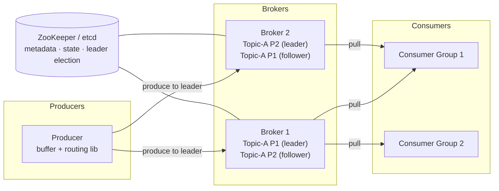
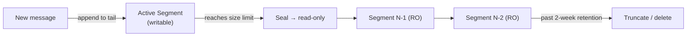
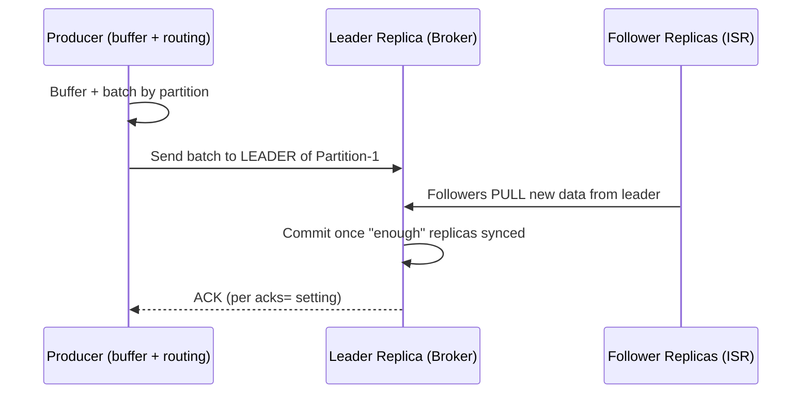
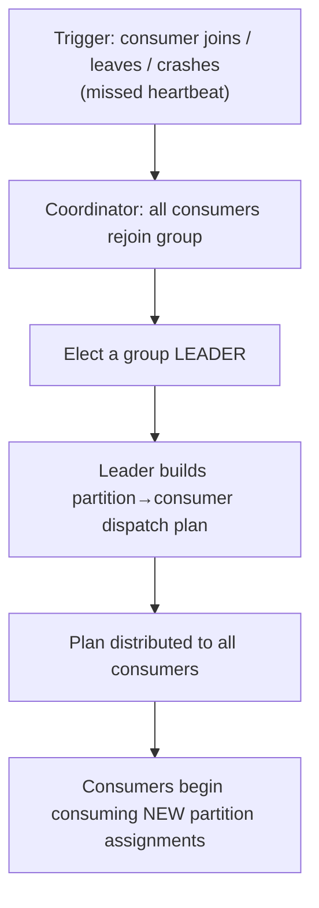
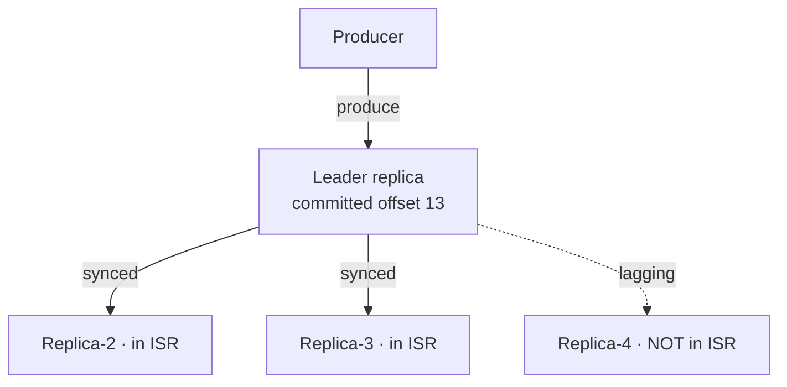

# Distributed Message Queue — System Design

**Difficulty:** Advanced
**Interview importance:** ⭐ **Critical** (Kafka-shaped questions appear in nearly every senior/staff loop)
**References:** *System Design Interview Vol. 2*, Ch. 4 — *Distributed Message Queue*; DDIA Ch. 5, 7, 8, 11 (replication, logs, transactions, stream processing)

---

## 0. Why This Design Matters

A message queue is the load-bearing beam of modern architecture — it's the thing that lets a hundred services talk without knowing about each other. And it's where the *hard* distributed-systems questions all converge in one design: **durability** (don't lose data), **ordering** (deliver in sequence), **replication** (survive node death), **delivery semantics** (at-most / at-least / exactly-once), and the eternal **throughput-vs-latency** trade.

Interviewers love it because the naive answer — "an in-memory list with `push` and `pop`" — collapses the instant you add a second consumer, a crash, or a durability requirement. The strong candidate reaches for the one idea that makes the whole thing work at scale: **an append-only write-ahead log on sequential disk**, partitioned for horizontal scale, replicated with a leader and ISR for durability, and consumed via pull with offsets so consumers control their own destiny.

> The one-line thesis: **a distributed message queue is a partitioned, replicated append-only log — sequential disk writes give it throughput, offsets give consumers control, and the leader/ISR/ACK knobs let you dial the exact durability-vs-latency point each use case needs.**

---

## 1. Problem Overview — in plain English

Build a system that sits **between** the parts of an application so they can communicate **asynchronously**. **Producers** put messages in; **consumers** take them out — and the two never have to be online at the same time or know about each other.

Why bother? Four benefits:
- **Decoupling** — producer and consumer evolve independently.
- **Scalability** — scale producers and consumers separately.
- **Availability** — if the consumer is down, messages wait; the producer isn't blocked.
- **Performance** — the producer fires and forgets instead of waiting for the work to finish.

We're designing the **event-streaming flavor** (Kafka/Pulsar-style): long retention, **repeated** consumption, **ordering** guarantees, replication, and **configurable delivery semantics**. A *traditional* queue (RabbitMQ-style) is a simplification of this — keep messages in memory just long enough to be consumed, small disk overflow, no ordering guarantee.

Popular examples: **Kafka, Pulsar** (event streaming); **RabbitMQ, ActiveMQ, RocketMQ, ZeroMQ** (traditional). Features are converging.

### Real-world analogy — the restaurant order rail

Picture the **spike rail** (order ticket rail) in a restaurant kitchen.

- **Waiters (producers)** clip order tickets onto the rail and immediately walk away — they don't wait for the food.
- **Cooks (consumers)** pull tickets off in order and cook them.
- The rail is an **append-only line** — new tickets always go on the end, and each has a position (**offset**).
- If you have too many orders for one rail, you add **more rails** (**partitions**) and split tickets across them by table number (**message key**).
- A **team of cooks (consumer group)** divides the rails among themselves — one cook per rail, no two cooks fighting over the same ticket.
- The kitchen keeps a **carbon copy** of every rail in the back office (**replication**) so if a rail is knocked over, nothing is lost.

Everything else — WAL segments, ISR, long polling — is just *"how do we make that rail durable, fast, and shareable across a hundred cooks in ten kitchens?"*

---

## 2. Functional Requirements

**Core**
- Producers **send** messages to a queue; consumers **consume** them.
- Messages can be consumed **repeatedly** (streaming) or **once** (point-to-point).
- Historical data can be **truncated** (retention).
- Deliver messages **in order** (within a partition).
- **Configurable delivery semantics:** at-most-once, at-least-once, exactly-once.
- Message size in the **kilobyte** range (text).

**Optional (name them, then defer)**
- Broker-side **message filtering** (by tag).
- **Delayed / scheduled** messages.
- Dead-letter / **retry topics** for failed processing.

---

## 3. Non-Functional Requirements

| Requirement | Target | Why it dominates the design |
|---|---|---|
| **Throughput OR latency** | Configurable per use case | Batching + ACK settings trade one for the other → the central knob |
| **Scalability** | Horizontal; absorb sudden surges | Forces **partitions** as the unit of scale |
| **Durability / persistence** | On disk, **replicated** across nodes | Losing committed data is unacceptable → WAL + leader/ISR |
| **Retention** | **2 weeks** | Enables replay/repeated consumption → append-only log, not delete-on-read |
| **Ordering** | In-order **within a partition** | Global ordering is impractical; per-partition is the pragmatic guarantee |
| **Availability** | Survive broker crashes | Replication + controller-driven failover |

> **Say this out loud in an interview:** *"The single most important lever is throughput-vs-latency, and it's not one setting — it's batch size, ACK level, and replica count together. I'd expose it as a per-use-case config rather than baking in one answer."*

---

## 4. Capacity Estimation & the Three Throughput Decisions

The book deliberately skips heavy number-crunching here and instead frames **three throughput-driven design choices** — which is exactly what an interviewer wants to hear, because they *are* the design:

**1. Use an on-disk structure that exploits sequential access.**
```text
Rotational disk, RANDOM access ..... ~100s of IOPS (slow)
Rotational disk, SEQUENTIAL access . several HUNDRED MB/sec (fast!)
+ OS page cache absorbs reads/writes in memory
```
→ An **append-only log** turns every write into a sequential write. This is the whole foundation.

**2. Design the message so it passes producer → queue → consumer with no modification.**
```text
Same byte layout end-to-end → no re-serialization, no copying → zero-copy possible
```

**3. Batch everywhere.**
```text
Producer batches → fewer network round-trips
Broker persists batches → larger sequential disk writes / fewer OS-cache pages
Consumer fetches batches → amortized fetch cost
Small random I/O is THE enemy of throughput.
```

**A rough sizing sanity check** (to show you *can* do the math): 1 KB messages at, say, 1M msgs/sec = **~1 GB/sec** ingest. Over **2 weeks** retention that's `1 GB/s × 86400 × 14 ≈ 1.2 PB` raw, ×3 for replication ≈ **3.6 PB** across the cluster → clearly a **partitioned, multi-broker** system with **retention-based truncation**, not a single node.

---

## 5. API Design

**Produce (send messages):**
```http
POST /v1/topics/{topic}/messages
```
```json
{ "records": [
    { "key": "user-42", "value": "clicked-checkout", "headers": { "tag": "billing" } }
  ],
  "acks": "all" }
```
```json
{ "partition": 3, "baseOffset": 105823, "committed": true }
```

**Consume (pull from an offset):**
```http
GET /v1/topics/{topic}/partitions/{p}/records?group=g1&offset=105823&maxBytes=1048576&waitMs=500
```
```json
{ "records": [ { "offset": 105823, "key": "user-42", "value": "..." } ],
  "nextOffset": 105901, "highWatermark": 106000 }
```
`waitMs` enables **long polling** — the broker holds the request open up to that long if no data is ready.

**Commit offset (consumer progress):**
```http
POST /v1/groups/{group}/offsets
```
```json
{ "topic": "clicks", "partition": 3, "offset": 105901 }
```

**Admin (control path):**
```http
PUT  /v1/topics/{topic}   { "partitions": 32, "replicationFactor": 3, "retentionDays": 14 }
```

---

## 6. High-Level Architecture



**Two messaging models, one design:**
- **Point-to-point:** a message is consumed by exactly **one** consumer, then effectively done. Simulated by putting all consumers **in one consumer group**.
- **Publish-subscribe:** a message on a **topic** is received by **all** subscribing consumer groups. This is the native model.

**Core concepts:**
- **Topic** — a named category of messages.
- **Partition** — a topic is split into partitions spread across brokers; **each partition is a FIFO log**, and a message's position in it is its **offset**. Partitions are the **unit of scale**.
- **Broker** — a server that holds partitions.
- **Message key** — optional; `hash(key) % numPartitions` routes same-key messages to the **same partition** (preserving their order). No key → round-robin/random.
- **Consumer group** — consumers cooperating; each group tracks its **own offsets**. **Within a group, a partition is consumed by exactly one consumer.** More consumers than partitions → some sit idle.

**Storage & coordination split into four:**
- **Data storage** — the messages (the WAL).
- **State storage** — consumer offsets and partition→consumer mapping.
- **Metadata storage** — topic config (partition count, retention, replica placement).
- **Coordination service** — broker liveness (service discovery) and **leader election** (elects an **active controller** that assigns partitions/replicas). **ZooKeeper or etcd.**

---

## 7. Deep Dive

### 7.1 Data storage — the Write-Ahead Log (WAL)

The access pattern is unusual: **write-heavy AND read-heavy, no updates, no deletes, mostly sequential.** A general database fits neither heavy pattern at this scale. The answer is a **WAL** — an append-only log file (the same idea as MySQL's redo log or ZooKeeper's WAL).

- New messages **append to the tail** of a partition, each getting a monotonically increasing **offset** (the line number is the simplest possible offset).
- A single file can't grow forever, so a partition is split into **segments**. Only the **active segment** takes writes; when it hits a size limit, it's sealed **read-only** and a fresh active segment opens. Segments past **retention** are **truncated**.
- Segments live in a folder per partition: `Partition-{id}/`.



**The disk myth, debunked (say this):** rotational disks are slow only for *random* access. For *sequential* access, disks in **RAID** hit **several hundred MB/sec**, and the OS **caches disk pages aggressively in memory**. An append-only log is *all* sequential — that's why a "disk-based" queue outruns many "in-memory" designs.

### 7.2 Message structure

Schema: `key, value, topic, partition, offset, timestamp, size, CRC`.
- **Key** decides the partition (not the partition number; **need not be unique** — unlike a KV-store key).
- **Value** is the payload (text or compressed binary).
- **Offset** = position in the partition; a message is located by **(topic, partition, offset)**.
- **CRC** (cyclic redundancy check) guards integrity.
- Optional **tags** enable broker-side filtering.
- Keeping this contract **identical across producer/queue/consumer** avoids expensive re-copying — a message flows through untouched.

### 7.3 Producer flow — batch in the client, write to the leader

Rather than a separate routing layer (extra hops, no batching), **fold routing + a buffer into the producer client library.** Benefits: fewer hops (lower latency), custom partitioning logic, and **in-memory batching**.



### 7.4 Consumer flow — push vs pull

| Model | Pros | Cons | Verdict |
|---|---|---|---|
| **Push** (broker → consumer) | Low latency | Overwhelms slow consumers; hard with diverse consumer speeds | Rejected |
| **Pull** (consumer → broker) | Consumer controls rate; batch or real-time; scale out to catch up; fetch all available at once | Consumer may poll an empty broker (wasteful) | **Chosen** |

The pull downside — busy-polling an empty broker — is fixed with **long polling**: the broker holds the fetch request open for a set time, returning as soon as data arrives or the timer expires. The consumer says "give me from offset X," and gets back a **chunk** of events.

### 7.5 Consumer group coordination & rebalancing

A **coordinator** tracks group members via **heartbeats**. When a consumer **joins**, **leaves**, or **crashes** (missed heartbeats), the coordinator triggers a **rebalance**:



Because each group persists its **offsets**, a crashed consumer's partitions are reassigned and the replacement **resumes exactly where the last one committed** — no data lost, no manual intervention.

### 7.6 State storage & metadata storage

- **State storage** — partition→consumer mapping and each group's **last-committed offset per partition** (e.g., group-1 at offset 6, group-2 at offset 13). Access is frequent, small, random, needs consistency → a KV store like **ZooKeeper**. *(Kafka later moved offsets into the brokers themselves — a good "how would this evolve?" note.)*
- **Metadata storage** — topic config (partition count, retention, replica distribution). Small, rarely changed, high consistency → **ZooKeeper**.
- **ZooKeeper's role:** holds metadata + state and runs broker **leader election**, so brokers only have to manage **message data storage**.

### 7.7 Replication & In-Sync Replicas (ISR) — the durability core

Each partition has multiple **replicas** on different brokers: one **leader**, the rest **followers**. **Producers write only to the leader; followers pull from it.** The **replica distribution plan** (which broker holds which replica) is generated by the elected controller and stored in metadata.

**In-Sync Replicas (ISR)** = the replicas caught up with the leader (within a configured lag, e.g. `replica.lag.max.messages`). The leader is always in the ISR. A replica that falls behind **drops out** of the ISR and **rejoins** when it catches up. The **committed offset** is the point up to which all messages are synced to **all** ISRs — only committed messages are safe to consume.



**ISR is the durability-vs-performance knob:** waiting for *all* replicas is safest but one slow replica stalls the whole partition; a smaller ISR requirement is faster but riskier.

**ACK settings — the latency-vs-durability dial:**

| ACK | Producer waits for | Durability | Latency | Use when |
|---|---|---|---|---|
| **ACK=all** | all ISRs to receive | **Strongest** | Highest | Financial, critical events |
| **ACK=1** | leader persists only | Medium (lost if leader dies pre-replication) | Lower | General, tolerate rare loss |
| **ACK=0** | nothing (fire-and-forget) | **Weakest** (possible loss) | Lowest | High-volume metrics/logs |

Consumers usually read from the **leader** (simpler; connection count bounded by partitions-per-group). Reading from the **closest ISR** is an option when consumers live in a different data center.

### 7.8 Delivery semantics — the three guarantees

```mermaid
flowchart TD
    subgraph AMO["At-most-once (≤1, may lose)"]
      A1["Producer: ACK=0, no retry"] --> A2["Consumer: commit offset BEFORE processing"]
      A2 --> A3["Crash after commit, before work → message LOST"]
    end
    subgraph ALO["At-least-once (≥1, may dup)"]
      B1["Producer: ACK=1/all, RETRIES"] --> B2["Consumer: commit offset AFTER processing"]
      B2 --> B3["Crash after work, before commit → REPROCESS → duplicate"]
    end
    subgraph EO["Exactly-once (exactly 1)"]
      C1["Idempotent producer + transactional commit"] --> C2["Dedup / atomic offset+result"]
      C2 --> C3["Hardest + most expensive"]
    end
```



- **At-most-once** — delivered ≤ once; may be lost, never redelivered. Producer ACK=0, no retry; consumer commits offset **before** processing. Fine for metrics where a little loss is acceptable.
- **At-least-once** — never lost, may be delivered more than once. Producer ACK=1/all with **retries**; consumer commits **only after** successful processing (crash-after-work-before-commit → reprocess → duplicate). Fine when duplicates are tolerable or **dedupable** (e.g., a unique DB key rejects the duplicate write / idempotent handler).
- **Exactly-once** — each message processed exactly once. Hardest and most expensive; needed for **payments/trading** where duplication is unacceptable and downstream isn't idempotent. Achieved with idempotent producers + transactional offset-and-result commits.

### 7.9 Scalability — what's easy, what's hard

- **Producers:** trivial — add/remove instances, no coordination.
- **Consumers:** add/remove groups freely; within a group, **rebalancing** absorbs adds/removes/crashes.
- **Brokers — failure recovery:** when a broker crashes, its partitions are lost on that node; the **controller detects it** and issues a new replica distribution plan so surviving brokers spin up new **follower replicas** that catch up to the leader. Guidelines: keep a healthy **minimum ISR**, never place two replicas of a partition on the **same node**, and spread across data centers for safety (costlier; mirroring helps).
- **Adding a broker:** temporarily allow **more replicas than configured** — the newcomer copies from the leader, and once caught up, redundant old replicas are removed gracefully (no data loss). Removal is the mirror image.
- **Partitions:**
  - **Increase:** old messages stay put (no migration); new messages spread across all partitions. Safe.
  - **Decrease:** hard — a decommissioned partition stops taking new messages but **can't be deleted immediately** (consumers may still be reading it); only after **retention** passes can it be truncated. **Reducing partitions is not a way to reclaim space quickly.**

### 7.10 Advanced features

- **Broker-side filtering:** don't make consumers fetch everything and filter (wasteful). Filter on the **broker** using **tags in message metadata** — *not* the payload, which avoids decrypt/deserialize cost and keeps sensitive data unreadable. A tag list covers most needs; arbitrary formula filtering would need a parser (too heavy).
- **Delayed / scheduled messages:** route to **temporary storage** on the broker instead of the topic, then deliver when the timer fires. Timing via **predefined delay levels** (RocketMQ: 1s, 5s, 10s, … 1h, 2h) or a **hierarchical time wheel**.
- **Retry topic:** on failed consumption, forward the message to a dedicated **retry topic** to reprocess later without blocking the main partition.

---

## 8. Design Trade-offs to Say Out Loud

| Axis | Option A | Option B | Choose by |
|---|---|---|---|
| Throughput vs latency | Big batches, ACK=all, many replicas | Small batches, ACK=1/0, fewer replicas | Use-case criticality |
| Delivery semantics | Exactly-once (costly, complex) | At-least-once + idempotent consumer | Is downstream idempotent? |
| Storage | Append-only WAL on disk | In-memory (traditional queue) | Need retention/replay? |
| Consumer model | Pull + long polling | Push | Diverse/slow consumers? (pull) |
| Ordering | Per-partition (keyed) | No ordering | Need order? use keys → 1 partition/key |
| Replica placement | Spread across DCs (safe) | Same DC (cheap, low-latency) | Cost vs disaster tolerance |
| Offset storage | ZooKeeper (external) | Brokers (Kafka's evolution) | Coupling vs simplicity |

---

## 9. Failure Scenarios

| Failure | Handling |
|---|---|
| **Broker crash** | Controller rebuilds replica distribution plan; new followers catch up to leader |
| **Consumer crash** | Missed heartbeats → **rebalance**; another consumer resumes from stored offset |
| **Leader dies with ACK=1** before replication | That message is **lost** (the ACK=1 risk) |
| **Slow replica** | Drops out of **ISR**, rejoins once caught up (doesn't stall the partition) |
| **Consumer commits before processing, then crashes** | Message **lost** (at-most-once behavior) |
| **Consumer processes, fails to commit, crashes** | Message **reprocessed** (at-least-once duplicate) |
| **Decommissioned partition** | Can't delete until **retention** passes; stops taking new writes meanwhile |
| **Failed consumption** | Route to a **retry topic**; reprocess later without blocking |
| **ZooKeeper/controller failure** | New controller elected; brokers keep serving existing metadata |
| **Disk fills** | Retention-based **segment truncation** reclaims oldest segments |

---

## 10. Common Mistakes

- **"An in-memory list with push/pop"** — no durability, no replay, no scale, no ordering across consumers.
- **Using a general database for storage** — it fits neither the write-heavy nor read-heavy pattern at scale; a **WAL** does.
- **"Disks are slow"** — only for *random* access; **sequential** append is hundreds of MB/s.
- **Push instead of pull** — overwhelms slow consumers; pull + long polling is the standard.
- **Global ordering** — impractical; the realistic guarantee is **per-partition** order, achieved via keys.
- **Claiming exactly-once is free** — it's the hardest, most expensive mode; prefer **at-least-once + idempotent consumers** unless payments demand it.
- **Consuming from followers by default** — read from the leader; followers are for durability/failover (closest-ISR only for cross-DC).
- **Reducing partitions to reclaim space** — you can't delete a partition until retention expires.
- **Ignoring batching** — small random I/O is the throughput killer.
- **Filtering on the consumer** — filter broker-side by tags to avoid shipping/decrypting useless data.

---

## 11. Interview Q&A

**Beginner**

**Q: Why use a message queue at all?**
Decoupling, independent scaling, availability, and async performance. The producer fires and forgets; the consumer works at its own pace; neither has to be online at the same time or know the other exists.

**Q: What's a partition and why does it matter?**
A partition is a shard of a topic and a FIFO log with per-message offsets. It's the unit of scale — you add partitions to add capacity — and it's the unit of ordering: messages are ordered *within* a partition, not across them.

**Q: Point-to-point vs pub-sub?**
Point-to-point = one consumer gets each message (simulated by putting all consumers in one group). Pub-sub = every subscribing consumer group gets the message. This design does both via topics + consumer groups.

**Intermediate**

**Q: Why an append-only log on disk instead of a database?**
The workload is write-heavy and read-heavy with no updates/deletes and mostly sequential access — a database fits neither at scale. A WAL turns every write into a fast sequential disk write, exploits OS page caching, and naturally supports retention/replay by segmenting and truncating.

**Q: Push or pull, and why?**
Pull. Consumers control their own rate, can batch or go real-time, and scale out to catch up. The only downside — polling an empty broker — is solved with long polling, where the broker holds the request open until data arrives.

**Q: How do consumer groups give both scaling and fault tolerance?**
Within a group, each partition is owned by exactly one consumer, so adding consumers (up to the partition count) parallelizes consumption. If one crashes, the coordinator detects the missed heartbeat, rebalances the partitions to survivors, and they resume from the last committed offset — no loss, no manual work.

**Advanced / Staff**

**Q: Walk me through the durability path and the ACK knob.**
Producers write only to the partition leader; followers pull from it. The ISR is the set of replicas caught up within a lag bound, and the committed offset is what's synced to all ISRs. ACK=all waits for all ISRs (strongest, slowest), ACK=1 waits for the leader only (fast, but a leader crash before replication loses the message), ACK=0 is fire-and-forget (fastest, lossy). I'd pick per use case: ACK=all for payments, ACK=0 for metrics.

**Q: How do you get exactly-once, and would you?**
Exactly-once needs an idempotent producer (dedup on the broker via sequence numbers) plus transactional commits that make "write result + advance offset" atomic. It's the most expensive mode. In practice I'd usually choose **at-least-once with an idempotent consumer** — dedup on a unique key or make the handler idempotent — and reserve true exactly-once for cases like payments where the downstream genuinely can't tolerate a duplicate.

**Q: A broker holding partition leaders dies — what happens?**
The controller (elected via ZooKeeper/etcd) detects the failure, promotes in-sync followers to leaders using the ISR, and generates a new replica distribution plan so surviving brokers create new followers that catch up. Producers and consumers get updated metadata and reconnect to the new leaders. The guardrails that make this safe: a minimum-ISR requirement, replicas never co-located on one node, and DC-aware placement.

**Q: How do you scale partitions safely?**
Increasing is safe — old messages stay put, new ones spread across all partitions; producers and consumers just rebalance. Decreasing is hard — a removed partition stops taking writes but can't be deleted until its data ages past retention, since consumers may still be reading it. So partitions should be over-provisioned up front; you scale consumers, not partitions, day to day.

---

## 12. 30-Second Interview Answer

> "I'd build it as a **partitioned, replicated append-only log** — Kafka-style. A **topic** splits into **partitions** across **brokers**; each partition is a FIFO **WAL** written **sequentially** (which is why disk is fast), split into **segments** that truncate past a **2-week retention**. Producers batch in the client library and write to the partition **leader**; **followers pull** to stay in the **ISR**, and the **ACK** setting (0/1/all) dials **latency vs durability**. Consumers **pull** with **long polling**, tracking their own **offsets**, and a **consumer group** with **rebalancing** gives parallelism and fault tolerance — a crashed consumer's partitions are reassigned and resume from the committed offset. **Ordering** is per-partition via **message keys**. Delivery is **configurable** — at-most-once (ACK=0, commit before), at-least-once (retries, commit after — my default with an idempotent consumer), or exactly-once for payments. **ZooKeeper/etcd** handles metadata, offsets, and leader election so brokers only manage data. Throughput comes from **sequential I/O + batching**; small random I/O is the enemy."

---

## 13. Mental Model

```text
PRODUCER (batch + route in client lib)
   ↓ write to LEADER only
PARTITION = append-only WAL, sequential disk, segmented, offset per message
   ↓ followers PULL → ISR → committed offset
   ↓
CONSUMER (PULL + long polling, tracks OFFSET)
   ↓ consumer GROUP: 1 partition ↔ 1 consumer, rebalance on change

SCALE       → partitions (unit of scale + ordering)
STORAGE     → WAL on sequential disk + OS cache + segments/retention
DURABILITY  → leader + followers + ISR; ACK = 0 / 1 / all
LATENCY↔THROUGHPUT → batch size + ACK + replica count
ORDERING    → per-partition, via message KEY
DELIVERY    → at-most (commit-before) | at-least (retry, commit-after) | exactly (txn)
COORDINATION→ ZooKeeper/etcd: metadata, offsets, leader election, rebalancing
FAILURE     → controller reassigns replicas; consumers resume from committed offset
```

---

## 14. How This Connects to Other Topics

- **Write-ahead logs & storage engines (DDIA Ch. 3)** — the queue *is* a WAL; the same append-only, sequential-write idea powers LSM-trees and database redo logs.
- **Replication (DDIA Ch. 5)** — leader/follower + ISR is single-leader replication with a tunable sync quorum; ACK levels are the sync-vs-async replication choice.
- **Consensus & coordination (DDIA Ch. 9)** — ZooKeeper/etcd for leader election and metadata is the canonical use of a consensus service; controller election is Raft/ZAB in practice.
- **Exactly-once & transactions (DDIA Ch. 11)** — exactly-once semantics reduce to idempotence + atomic commit, the same machinery as stream-processing frameworks.
- **Rate limiter** — a leaky bucket *is* a bounded queue drained at a fixed rate; back-pressure via pull and long polling is the same "let the consumer set the pace" idea.
- **Web crawler** — the URL Frontier is a specialized priority queue with per-host serialization; real crawlers often sit on top of Kafka.
- **Idempotency & retries** — at-least-once delivery forces idempotent consumers, the same pattern every payments/webhooks system needs.
