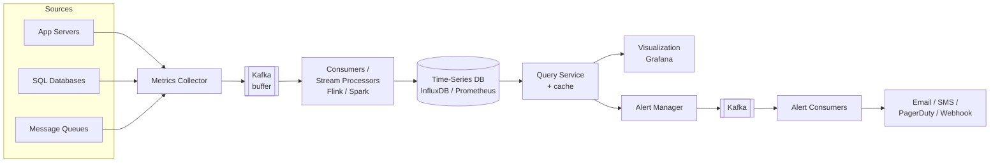
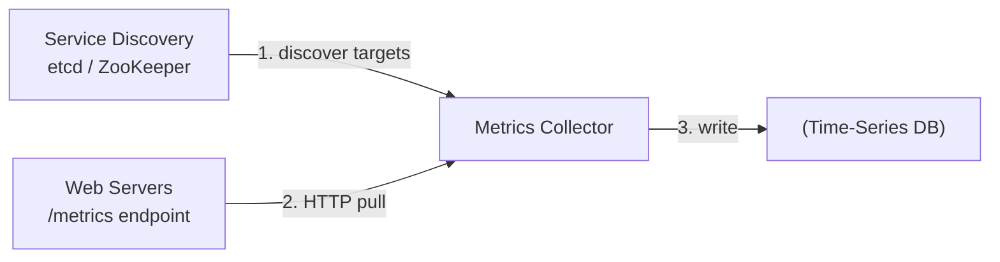
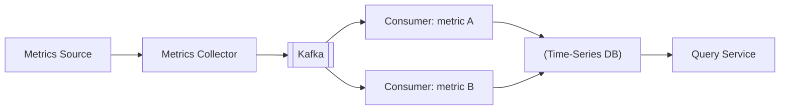
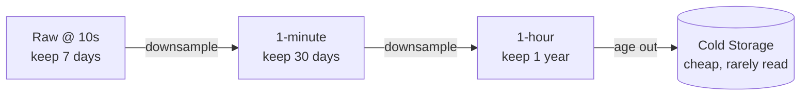
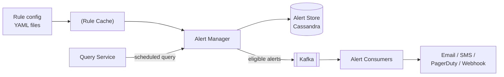

# Metrics Monitoring & Alerting System — System Design

**Difficulty:** Intermediate → Advanced
**Interview importance:** ⭐ **High** (the "observability" round; every infra/platform team asks a version of it)
**References:** ByteByteGo Vol. 2 Ch. 5 — *Design a Metrics Monitoring and Alerting System*; Facebook *Gorilla* paper; Prometheus / InfluxDB docs

---

## 0. Why This Design Matters

Every large system you have ever designed needs *this* system watching it. A monitoring platform is the thing that pages a human at 3 a.m. before customers notice. That makes it deceptively hard: it is **write-heavy at brutal scale** (millions of data points streaming in every second, forever), it must stay up **precisely when everything else is falling over** (a monitoring system that dies during an incident is worse than useless), and it forces an honest conversation about **how long you keep data and at what resolution** — because storing a year of raw metrics at full fidelity will bankrupt you.

> The one-line thesis: **a monitoring system is a specialized write-optimized time-series pipeline that trades storage fidelity for cost via downsampling, and trades a little data loss for availability — because the pipeline must survive the outage it is reporting on.**

---

## 1. Problem Overview — in plain English

Build an internal system that answers, continuously, for thousands of servers:

> **"Is everything healthy? And if not, who do I wake up?"**

It has to do five jobs:

1. **Collect** operational metrics from everywhere — low-level (CPU load, memory, disk usage) and high-level (requests/sec, count of running servers).
2. **Transmit** them reliably to storage without losing them when the database hiccups.
3. **Store** them efficiently for a long time (1 year) without going broke.
4. **Alert** a human (or robot) when a value crosses a threshold — via email, phone/SMS, PagerDuty, or an HTTP webhook.
5. **Visualize** them on dashboards so engineers can see trends and debug.

**Explicitly out of scope** (say this — scoping is a signal): **log** aggregation (that's the ELK stack) and **distributed tracing** (that's Dapper/Zipkin). We monitor *numbers over time*, not log lines or request traces.

### Real-world analogy — the hospital patient monitor

A monitoring system is the bank of bedside monitors in an ICU. Each machine (server) has sensors (metrics) streaming heart rate, blood pressure, oxygen (CPU, memory, QPS). A central station **collects** every reading, keeps a **rolling history** (recent readings in high detail, older ones summarized on the chart), shows **live graphs** to the nurses (dashboards), and — the whole point — **sounds an alarm** and calls the on-call doctor when a vital crosses a danger line (alerting). You don't keep every millisecond of every heartbeat forever; you summarize. That summarizing is downsampling.

---

## 2. Functional Requirements

**Core**
- Collect operational metrics from a large fleet (app servers, SQL DBs, message queues, etc.).
- Store metrics as **time series** for **1 year**.
- Serve **dashboards** (visualization) over arbitrary time ranges.
- Evaluate **alerting rules** and fire notifications to **email, SMS/phone, PagerDuty, and HTTP webhooks**.
- **Retention / roll-up policy:** raw for **7 days** → **1-minute** resolution for **30 days** → **1-hour** resolution for **1 year**.

**Optional (name them, then defer)**
- Business/product metrics (out of scope here — we do *operational* metrics only), anomaly detection / ML-based alerting, log correlation, tracing integration, multi-tenancy.

---

## 3. Non-Functional Requirements

| Requirement | Target | Why it dominates the design |
|---|---|---|
| Scalability | Grow with metric & alert volume | ~10M metrics today; must not require a redesign at 10× |
| Write throughput | Constant, heavy | Millions of data points/sec → purpose-built TSDB, not a relational DB |
| Read pattern | Bursty / spiky | Dashboards + alert evaluations query in waves → caching helps |
| Query latency | Low | Dashboards must feel live; alerts must evaluate on time |
| Reliability | **Never miss a critical alert** | A dropped page is the worst failure mode of the whole system |
| Availability | Must survive partial outages | The system has to work *during* the incident it reports |
| Flexibility | Easy to swap components | Buy-vs-build; you'll want to drop in Grafana, a new TSDB, etc. |

> **Say this out loud:** *"Metrics tolerate occasional data loss — it's fire-and-forget. But alerting does NOT: a missed page is unacceptable. Those two facts drive opposite consistency choices in the same system."*

---

## 4. Capacity Estimation (do the math)

The classic prompt's numbers:

```text
Monitored infra:
  DAU of the product ........ 100,000,000
  Server pools .............. 1,000
  Machines per pool ......... ~100
  → Total metrics ........... ~10,000,000  (10M distinct time series)
```

**Write load.** ~10M operational metrics collected at high frequency. If each series is sampled every 10 seconds:

```text
10,000,000 series ÷ 10 s = 1,000,000 data points/sec written
```

→ **Write-heavy, constant, non-stop.** This single number kills the relational database idea.

**Benchmark reality check.** A cited benchmark: one **InfluxDB** node with **8 cores + 32 GB RAM** sustains **> 250,000 writes/sec** and **> 1,000,000 unique series**. So 1M writes/sec ⇒ roughly a **handful of TSDB nodes**, not one — sharding/clustering is expected.

**Read load.** Reads are **bursty**, not constant: they spike when dashboards refresh and when alert rules evaluate on their schedule. So the profile is **constant heavy writes + spiky reads** — the exact shape a TSDB (and a query cache) is built for.

**Storage → why downsampling is mandatory.** Storing a year of raw 10-second data:

```text
1M points/sec × 86,400 s/day × 365 days ≈ 3.15 × 10^13 points/year
```

Tens of trillions of points at, say, ~2–16 bytes each after compression is still an enormous, expensive volume. **You cannot keep it all at raw resolution.** Hence the tiered policy:

```text
raw (10s)   → keep 7 days
1-minute    → keep 30 days   (6× fewer points than 10s)
1-hour      → keep 1 year    (60× fewer points than 1-minute)
```

**What the numbers tell us:**
- **Purpose-built TSDB, sharded** — throughput and storage both forbid a general DB.
- **Compression is not optional** — double-delta encoding shrinks points to a few bits.
- **Downsampling + retention tiers** are the only way to afford a year of history.
- **A buffer (Kafka)** is needed so a 1M-writes/sec firehose survives a TSDB blip.

---

## 5. API Design

The system is mostly internal, but it has clear interfaces.

**Ingest a metric** (push model / line protocol):
```text
CPU.load host=webserver01,region=us-west 1613707265 50
```
Format: `<metric_name> <label=value,...> <timestamp> <value>` (Prometheus / OpenTSDB line protocol).

**Pull a metric** (pull model — the collector scrapes each target):
```http
GET /metrics        # exposed by each monitored app; returns current metric values
```

**Query for a dashboard** (via the query service / TSDB query language):
```text
# Flux (InfluxDB) — 5-minute exponential moving average of CPU on prod hosts
from(bucket:"metrics")
  |> range(start: -1h)
  |> filter(fn: (r) => r._measurement == "cpu.load" and r.env == "prod")
  |> exponentialMovingAverage(n: 5)
```
Note: TSDBs **don't use SQL** — a moving average in SQL is a deeply nested query; Flux/PromQL express it in a few readable lines.

**Define an alert rule** (YAML — the standard):
```yaml
groups:
  - name: instance-health
    rules:
      - alert: InstanceDown
        expr: up == 0          # metric 'up' equals 0
        for: 5m                # must hold for 5 minutes before firing
        labels: { severity: page }
        annotations: { summary: "Instance {{ $labels.instance }} down" }
```

---

## 6. High-Level Architecture

Five fundamental components: **collection → transmission → storage → (alerting + visualization)**.



- **Metrics source** — anything emitting numbers: app servers, DBs, queues.
- **Metrics collector** — gathers metrics and forwards them into the pipeline.
- **Kafka** — a durable buffer that decouples collection from storage (survives a TSDB outage).
- **Time-series database** — stores series, indexes labels, handles retention/downsampling.
- **Query service** — thin wrapper over the TSDB with a result cache (optional — often the TSDB's own interface is enough).
- **Visualization** — dashboards (Grafana).
- **Alerting** — evaluates rules, dedupes, and delivers notifications.

### The data model — a time series

A **time series** is uniquely identified by a **metric name + a set of labels/tags**, holding an array of **(value, timestamp)** pairs:

```text
metric_name : cpu.load
labels      : host=i631, env=prod
data points : (0.29, 1613707265), (0.31, 1613707275), (0.28, 1613707285), ...
```

The **name + label set** is the *identity* of a series. That is why **label cardinality** matters so much — every distinct combination of label values is a *new series* to index and store.

### Why a purpose-built TSDB (not MySQL, not plain NoSQL)?

| Option | Verdict | Why |
|---|---|---|
| **Relational (MySQL/Postgres)** | ❌ | Not optimized for time-series ops (a moving average is ugly SQL); needs an index per tag; buckles under constant heavy writes |
| **NoSQL (Cassandra, Bigtable)** | ⚠️ Possible | Can work, but designing a good time-series schema needs deep expertise |
| **Purpose-built TSDB** ⭐ | ✅ | InfluxDB, Prometheus, OpenTSDB, Twitter MetricsDB, Amazon Timestream — fewer servers, easy query language, built-in retention/aggregation, label indexes |

> **Cardinality warning to say out loud:** *"Keep labels low-cardinality. A label like `user_id` or `request_id` explodes the number of series and overloads the TSDB's index — that's the #1 way people melt a Prometheus."*

---

## 7. Deep Dive

### 7.1 Collection — Pull vs Push

The first real design fork. First, a freeing observation: **occasional metric loss is acceptable** — metrics are fire-and-forget, so we don't need bulletproof delivery at the edge.

**Pull model (Prometheus).** A collector periodically *scrapes* each app's `/metrics` HTTP endpoint.



- The collector must know all endpoints → use **Service Discovery** (etcd/ZooKeeper) so services register and the collector is notified when the fleet changes. **Don't hardcode a target list.**
- One collector can't scrape thousands of servers → use a **pool of collectors**. To avoid two collectors scraping the same target, put them on a **consistent hash ring**: each collector owns an arc, each monitored server maps to the ring by name → exactly one owner.

**Push model (Amazon CloudWatch, Graphite).** An **agent** on each server pushes metrics to the collector and can **pre-aggregate locally** (reducing volume).

- The collector is an **auto-scaling cluster behind a load balancer**, scaling on CPU.
- If the collector is overwhelmed, the agent buffers locally and resends — **but** in auto-scaling groups (servers rotated out constantly) local buffering risks losing data when the host disappears.

**The comparison table — memorize this:**

| Dimension | Pull wins | Push wins |
|---|---|---|
| **Debugging** | ✅ hit `/metrics` from your laptop | |
| **Health check** | ✅ no scrape response ⇒ target is down | |
| **Short-lived jobs** | | ✅ job may end before it's scraped (pull needs a **push gateway**) |
| **Firewalls / complex networks** | | ✅ collector + LB receives from anywhere |
| **Performance** | | ✅ often UDP (lower latency); pull uses TCP |
| **Data authenticity** | ✅ targets pre-defined in config | (push must whitelist/authenticate) |

> **No clear winner.** Large orgs support **both** — pull for standard services, push for serverless/short-lived jobs where there's no agent to scrape.

### 7.2 Scaling the transmission pipeline — insert Kafka

The risk: if the TSDB is down, that 1M-points/sec firehose is **lost**. Put a **queue (Kafka)** between collector and TSDB.



- Kafka is a **reliable, scalable buffer** that **decouples** collection from processing and **prevents data loss** when the DB is down or slow.
- **Scale via partitions:** set partition count by throughput; **partition by metric name** (consumers aggregate per metric), further partition by tags; **prioritize** important metrics so they're processed first.
- **Alternative to Kafka:** running production Kafka is heavy operationally. Facebook's **Gorilla** in-memory TSDB stays highly available for writes even during partial network failure — arguably as reliable as an intermediate queue, without the extra system.

### 7.3 Where does aggregation happen?

A three-way trade-off worth naming explicitly:

| Where | Pro | Con |
|---|---|---|
| **Collection agent (client)** | Cheap, reduces volume at the source | Only simple aggregation (e.g. a per-minute counter) |
| **Ingestion pipeline (before storage)** | Greatly cuts write volume | Loses raw precision; struggles with **late-arriving** events |
| **Query side (after storage)** | No data loss; full precision | Slow queries — computed over the whole raw dataset |

There's no free lunch: **aggregate early = cheaper storage but lost fidelity; aggregate late = full fidelity but slower reads.**

### 7.4 Storage layer — compression, downsampling, cold storage

The insight that unlocks TSDB performance: per a Facebook paper, **≥ 85% of queries hit data from the past 26 hours.** A TSDB that keeps recent data hot (in-memory) and older data on disk exploits this.

**Double-delta encoding (compression).** Store *deltas of deltas* instead of absolute values. Data points 10 seconds apart have a near-constant delta, needing only **~4 bits instead of 32**:

```text
timestamps: 1610087371, +10, +10, +9, +11   ← store the small differences, not the big numbers
```

**Downsampling (retention roll-up).** Convert high-resolution to low-resolution as data ages, matching the policy — e.g. roll 10-second data up to 1-minute averages, then to 1-hour averages:



**Cold storage.** Move rarely-accessed, inactive data to cheaper storage.

### 7.5 Alerting system — the part that must never fail



The flow:

1. Load alert **rules** (YAML — e.g. `expr: up == 0`, `for: 5m`) into a **cache**.
2. The **alert manager** reads rules from cache.
3. On a schedule it calls the **query service**; if a value violates a threshold, it creates an alert event. The manager also:
   - **Filters, merges, and dedupes** — e.g. merge three "disk_usage > 90%" events on the same instance into **one** alert (this is how you avoid an alert storm burying the real signal).
   - Enforces **access control**.
   - **Retries** to guarantee **at-least-once** delivery.
4. **Alert store** (a KV DB like **Cassandra**) persists each alert's **state** — `inactive → pending → firing → resolved` — which is what makes at-least-once possible across restarts.
5. Eligible alerts are pushed to **Kafka**.
6. **Alert consumers** pull from Kafka and deliver to email, SMS, PagerDuty, or webhooks.

> **Why the state machine matters:** without persisted state, a manager restart could either drop a firing alert (missed page — unacceptable) or re-send an already-resolved one (alert fatigue). The alert store is what turns "best effort" into "at least once."

### 7.6 Query service and visualization

- A **query service** cluster can sit between the TSDB and the front-ends, decoupling them (swap the TSDB without touching Grafana) and adding a **result cache** to cut TSDB load.
- **The case against building it:** most industrial dashboards/alerting tools already have first-class plugins for popular TSDBs, and a good TSDB has its own cache — so you may not need this layer at all.
- **Visualization** is genuinely hard to build well. **Grafana** is the strong off-the-shelf answer and integrates with many TSDBs.

> **Buy-vs-build, the mature framing:** *"For query, alerting, and visualization I'd lean heavily toward off-the-shelf tools — Grafana, Prometheus Alertmanager. The differentiated engineering is in collection and the storage/retention pipeline; the rest is a solved problem I shouldn't reinvent."*

---

## 8. Trade-Offs to Say Out Loud

| Axis | Option A | Option B | Choose by |
|---|---|---|---|
| Collection | **Pull** (easy debug, health check, authentic) | **Push** (short-lived jobs, firewalls, UDP speed) | Environment; big orgs do both |
| Buffer | **Kafka** (reliable, decoupled) | **Gorilla-style in-memory TSDB** (fewer moving parts) | Operational appetite vs simplicity |
| Aggregation | **Early** (cheap storage) | **Late / at query** (full precision) | Storage cost vs query fidelity |
| Storage DB | **Purpose-built TSDB** | Relational / NoSQL | Almost always TSDB |
| Query layer | **Build a query service + cache** | Use TSDB's native interface | Need to swap TSDBs vs simplicity |
| Everything else | **Build** | **Buy (Grafana, Alertmanager)** | Buy unless it's your differentiator |

---

## 9. Failure Scenarios

| Failure | Handling |
|---|---|
| TSDB unavailable | **Kafka** retains data until the DB recovers → no loss |
| Push collector overwhelmed | Agent buffers locally and resends (risky in auto-scaling groups) |
| Duplicate pulls from multiple collectors | **Consistent hash ring** assigns each target to exactly one collector |
| Short-lived batch job ends before scrape (pull) | **Push gateway** collects its metrics |
| Alert storm / duplicate alerts | **Filter / merge / dedupe** in the alert manager |
| Missed alert notification | **Retry** + **alert-store state** guarantee at-least-once |
| Occasional metric loss | Acceptable — metrics are fire-and-forget |
| Query overload from dashboards | Query-result **cache**; TSDB keeps recent (26h) data hot |
| Storage growth | **Double-delta compression + downsampling + cold storage** |

---

## 10. Common Mistakes

- **Using a relational DB for metrics.** It cannot survive constant heavy writes and needs an index per tag. Purpose-built TSDB, every time.
- **High-cardinality labels.** Putting `user_id`, `request_id`, or a raw URL in a label multiplies your series count and melts the TSDB index. Keep labels low-cardinality.
- **No buffer between collector and TSDB.** A single TSDB blip then loses the firehose. Kafka (or a Gorilla-style HA writer) absorbs it.
- **Keeping everything at raw resolution.** Financially impossible for a year. Downsample on a retention schedule.
- **Treating alerting as best-effort.** No state machine, no dedupe, no retries → missed pages *and* alert fatigue. Alerting needs persisted state and at-least-once delivery.
- **Building your own dashboards and alert routing.** Grafana and Alertmanager exist and are excellent. Reinventing them is where projects die.
- **Confusing metrics with logs and traces.** Different data shapes, different systems. Scope it.

---

## 11. Interview Q&A

**Beginner**

**Q: What is a "metric" here, exactly?**
A time series: a **metric name plus a set of labels** identifies the series, which holds **(value, timestamp)** pairs. E.g. `cpu.load{host=i631,env=prod}` = 0.29 at t=1613707265. Labels are indexed for lookup and must be low-cardinality.

**Q: Why not just use MySQL?**
Metrics are a constant heavy write stream (~1M points/sec) and time-series queries like moving averages are painful in SQL. A relational DB buckles on writes and needs an index per tag. Purpose-built TSDBs (InfluxDB, Prometheus) are designed for exactly this and use far fewer servers.

**Intermediate**

**Q: Pull or push for collection?**
Neither is strictly better. Pull (Prometheus) is easier to debug (scrape `/metrics` from anywhere), gives a free health check, and keeps targets authentic via config; it needs service discovery to find targets and a push gateway for short-lived jobs. Push (CloudWatch) handles firewalls, serverless, and short-lived jobs, and can pre-aggregate. Large orgs run both.

**Q: How do you keep a year of data affordable?**
Three levers: **double-delta encoding** (10s-apart points cost ~4 bits, not 32), **downsampling** on a retention schedule (raw 7 days → 1-minute 30 days → 1-hour 1 year), and **cold storage** for inactive data. Also exploit that ~85% of queries hit the last 26 hours — keep that hot, push the rest to disk.

**Q: Why put Kafka in the middle?**
To decouple collection from storage and survive a TSDB outage. Without it, a DB blip loses the firehose. Kafka buffers durably, lets consumers scale independently, and can be partitioned by metric name and prioritized. The alternative is a Gorilla-style HA in-memory TSDB, trading a system for operational simplicity.

**Advanced / Staff**

**Q: How do you guarantee a critical alert is never missed?**
Persist each alert's state (`inactive → pending → firing → resolved`) in a durable store (Cassandra), dedupe/merge in the alert manager, deliver via Kafka to consumers, and **retry to guarantee at-least-once**. The persisted state machine is what survives a manager restart without dropping a firing alert or re-paging a resolved one.

**Q: Two collectors scrape the same server — how do you prevent that?**
Put the collector pool on a **consistent hash ring**. Each collector owns an arc of the ring; each target maps to the ring by name, so exactly one collector owns it. Adding/removing collectors only reshuffles a fraction of targets.

**Q: Where should aggregation live?**
It's a fidelity-vs-cost trade. Aggregating in the ingestion pipeline slashes write volume but loses raw precision and mishandles late events. Aggregating at query time preserves everything but is slow. I'd downsample old data for storage economy while keeping recent raw data for precise debugging — and push heavy roll-ups off the query hot path.

**Q: Would you build this or buy it?**
Buy the commodity parts — Grafana for dashboards, Alertmanager for routing, an off-the-shelf TSDB. The differentiated engineering is the collection topology and the storage/retention pipeline. Building your own visualization and alert routing is rarely justified and is where these projects sink.

---

## 12. 30-Second Interview Answer

> "It's a five-stage pipeline: **collect → transmit → store → alert + visualize**. Metrics are **time series** — name plus labels plus (value, timestamp) — so I store them in a **purpose-built TSDB** like InfluxDB or Prometheus, never a relational DB, because it's ~1M writes/sec constant. Collection is **pull or push** — pull for standard services with **service discovery** and a **consistent-hash collector pool**, push for serverless; big orgs do both. I put **Kafka** between collector and TSDB so a DB outage doesn't lose data. To afford a year of history I use **double-delta compression, downsampling** (raw 7 days → 1-min 30 days → 1-hour 1 year), and **cold storage**. Alerting is the part that can't fail: an **alert manager** dedupes and merges, an **alert store** in Cassandra tracks state for **at-least-once** delivery, and consumers fan out to email/SMS/PagerDuty/webhooks. For dashboards and routing I'd **buy** — Grafana and Alertmanager — and focus my engineering on collection and storage."

---

## 13. Mental Model

```text
SOURCES  → collector (pull: SD + hash ring | push: LB + autoscale)
   ↓
KAFKA    → durable buffer (survive TSDB outage; partition by metric)
   ↓
TSDB     → time series (name+labels+value+ts); double-delta compress
   ↓        downsample: raw 7d → 1-min 30d → 1-hr 1y → cold storage
   ├── QUERY SERVICE (+cache) → GRAFANA dashboards
   └── ALERT MANAGER (dedupe/merge/retry) → ALERT STORE (Cassandra, state)
                                          → Kafka → consumers → page a human

METRICS  → tolerate loss (fire-and-forget)
ALERTS   → must NOT lose (at-least-once, persisted state)
BUILD    → collection + storage pipeline
BUY      → query, alerting routing, visualization
```

---

## 14. How This Connects to Other Topics

- **Rate Limiter** — both live on/near the hot path and both trade a little accuracy for availability; the "fire-and-forget, loss-tolerant" nature of metrics mirrors approximate rate counting.
- **Message queues (Kafka)** — the buffer here is the same decoupling pattern used everywhere: absorb a firehose, let producers and consumers scale independently, survive downstream outages.
- **Consistent hashing** — the collector pool uses the exact ring technique from caching and sharding designs to assign each target to one owner.
- **LSM-trees / write-optimized storage** — a TSDB's on-disk layout and compression are cousins of the LSM structures used in Cassandra/RocksDB and in the email-search design.
- **CAP / consistency trade-offs** — metrics choose availability (tolerate loss); alerting moves toward durability (persisted state, at-least-once) — two different points on the spectrum inside one system.
- **Downsampling & retention** — the same "keep recent data hot, summarize/archive the rest" idea appears in logging, analytics, and cold-storage tiering across many designs.
