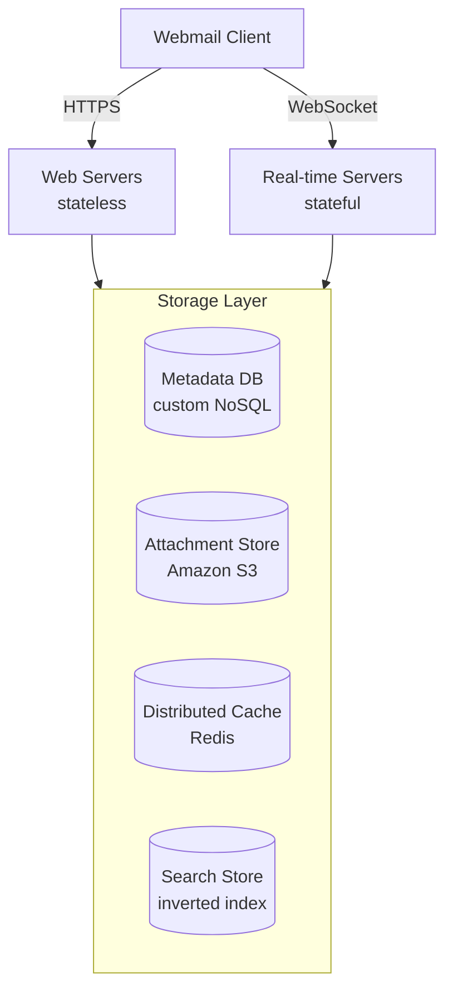
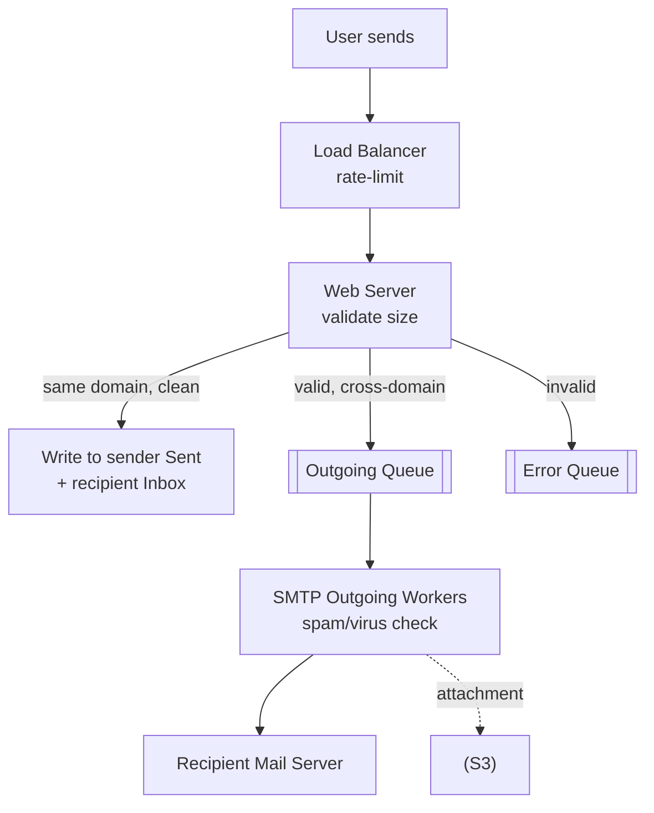
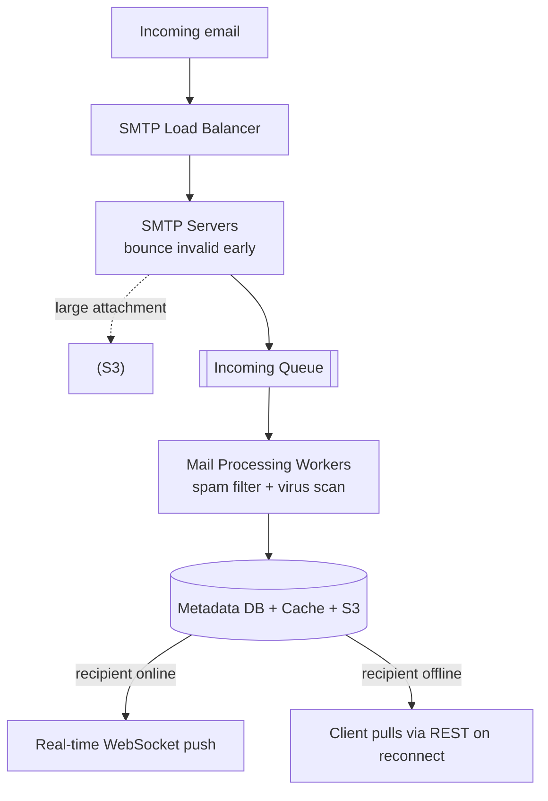
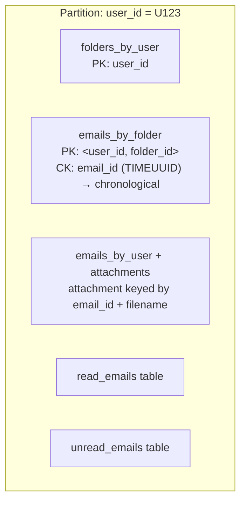
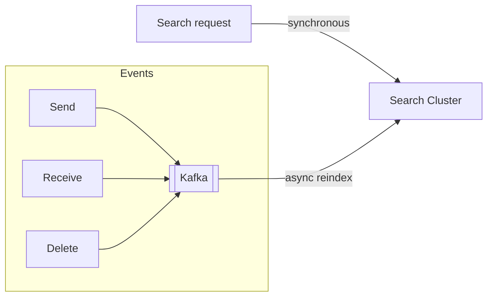

# Distributed Email Service — System Design

**Difficulty:** Advanced
**Interview importance:** ⭐ **High** (a "storage-at-planet-scale" round; tests protocols, NoSQL modeling, and search)
**References:** ByteByteGo Vol. 2 Ch. 8 — *Design a Distributed Email Service*; RFC 1939 (POP), RFC 6154 (folders); Apache James (JMAP)

---

## 0. Why This Design Matters

Email looks boring — until you realize you're being asked to store **hundreds of petabytes**, guarantee **zero data loss** on a billion mailboxes, deliver mail across **untrusted servers you don't control**, and make a user's entire multi-year archive **searchable in milliseconds**. It's the interview that punishes hand-waving: you have to know real protocols (SMTP/IMAP/POP), justify a **custom NoSQL data model with denormalization**, keep giant blobs *out* of your database, and reason about **deliverability** — the dark art of not landing in the spam folder. Get storage and search right and you've shown you can build a system where losing one byte is a headline.

> The one-line thesis: **email is a storage-and-delivery problem where the metadata is small and hot, the attachments are huge and cold, and the hard parts are modeling NoSQL for per-user access, making search near-real-time, and actually getting mail delivered — all while never, ever losing data.**

---

## 1. Problem Overview — in plain English

Build a Gmail/Outlook/Yahoo-scale mail service. Users need to:

> **"Send mail, receive mail, read/organize it, and search my own history — instantly, from any device, forever."**

Concretely:
- **Send** and **receive** email (with attachments).
- **Fetch** all emails and **filter** by read/unread.
- **Search** by subject, sender, or body.
- Get **anti-spam** and **anti-virus** protection.

Traditionally, native clients speak **SMTP, POP, IMAP** to mail servers. For this design we assume clients talk over **HTTP** (web-based mail). **Authentication is out of scope.**

### Real-world analogy — the national postal service

Think of running a country's postal system. Every citizen has a **mailbox** (their inbox). Letters are tiny compared to **parcels** (attachments), so you store letters in fast local sorting offices (metadata DB) but bulky parcels in a big cheap warehouse (S3). Mail from *your own city* you deliver directly; mail to *another city* you hand to that city's post office and hope they accept it (SMTP server-to-server, with **retries** if they're closed). You keep a **card catalog** so anyone can find an old letter fast (search index). And a huge amount of what arrives is **junk mail** you must filter before it hits the mailbox (spam). The postal analogy even covers reputation: a sketchy new sender gets their mail scrutinized until they prove themselves (**IP warm-up**).

---

## 2. Functional Requirements

**Core**
- Send email (To / Cc / Bcc), with attachments.
- Receive email; store it durably.
- Fetch all emails; list folders; filter by **read/unread**.
- Full-text **search** by subject, sender, body.
- **Anti-spam** and **anti-virus** scanning.

**Optional (name them, then defer)**
- Conversation **threading**, labels/filters/rules, snooze, confidential mode, end-to-end encryption. (Threading is a great "bonus" to mention — rebuilt from `Message-Id` / `In-Reply-To` / `References` headers, e.g. the JWZ algorithm.)

---

## 3. Non-Functional Requirements

| Requirement | Target | Why it dominates the design |
|---|---|---|
| **Reliability** | **Never lose email data** | Losing a user's mail is catastrophic and unforgivable |
| **Availability** | Keep working during partial failures | Multi-DC replication; read from another DC during a partition |
| **Scalability** | Grow users/emails with no perf loss | 1B+ users, PB-scale storage |
| **Consistency** | Strong per mailbox | A read email must not reappear as unread; single primary per mailbox |
| **Flexibility** | Custom protocols possible | POP/IMAP are limited; need custom features (threading, labels, search) |
| **Search freshness** | Near-real-time | A just-received email should be findable almost immediately |

> **Say this out loud:** *"Email's non-negotiable is zero data loss, and its access pattern is almost entirely per-user. Those two facts push me to a strongly-consistent, NoSQL metadata store partitioned by user_id — and to keeping the huge attachment blobs out of that DB entirely."*

---

## 4. Capacity Estimation (do the math)

```text
Users ................................ 1,000,000,000  (1B)
Emails sent   / user / day ........... 10
Emails received / user / day ......... 40
Avg metadata size .................... 50 KB
Attachment: 20% of emails, avg ....... 500 KB
```

**Send QPS:**
```text
1B users × 10 sent/day ÷ 86,400 s/day ≈ 100,000 sends/sec
```

**Metadata storage for 1 year:**
```text
1B × 40 received/day × 365 days × 50 KB ≈ 730 PB
```

**Attachment storage for 1 year:**
```text
1B × 40 × 365 × 20% × 500 KB ≈ 1,460 PB  (~1.46 EB)
```

**What the numbers tell us:**
- **Storage-heavy, and then some** — ~730 PB metadata + ~1.46 EB attachments/year. This is a *distributed database* problem, no debate.
- **Attachments dwarf metadata (~2×)** and are large blobs → they belong in **object storage (S3)**, not the metadata DB.
- **100K sends/sec** with fan-out to receiving servers → decouple sending from delivery via a **queue** so SMTP workers scale independently.
- **Per-user, recency-skewed access** (see §7.1) → partition by `user_id`; cache recent mail.

---

## 5. API Design

Webmail over HTTP (RESTful):

**Send an email:**
```http
POST /v1/messages
```
```json
{ "to": ["bob@gmail.com"], "cc": [], "bcc": [],
  "subject": "Lunch?", "body": "12:30 works?", "attachments": ["s3://.../deck.pdf"] }
```

**List folders** (defaults per RFC 6154: All, Archive, Drafts, Flagged, Junk, Sent, Trash):
```http
GET /v1/folders
```

**List messages in a folder** (needs pagination — a folder can have hundreds of thousands):
```http
GET /v1/folders/{folder_id}/messages?limit=50&cursor=...
```

**Get a full message:**
```http
GET /v1/messages/{message_id}
```
```json
{ "from": "alice@out.com", "to": ["bob@gmail.com"], "subject": "Lunch?",
  "body": "...", "is_read": false, "attachments": [ { "filename": "deck.pdf", "size": 512000 } ] }
```

**Search:**
```http
GET /v1/search?q=subject:invoice from:acme has:attachment
```

---

## 6. High-Level Architecture

### Email knowledge 101 (know these cold — interviewers test them)

| Protocol | What it does |
|---|---|
| **SMTP** | Sends mail **server-to-server** (Simple Mail Transfer Protocol) |
| **POP** | Downloads mail to **one device** and **deletes it from the server** (single-device; downloads whole email; RFC 1939) |
| **IMAP** | Downloads a message **only when opened**, **keeps mail on the server** (multi-device; headers first; great on slow links) — most popular for individuals |
| **HTTPS** | Not a mail protocol, but used for webmail (e.g. Outlook's ActiveSync) |
| **DNS / MX record** | Sender looks up recipient domain's **MX record**; **lower priority number = more preferred**; tries next-lowest on failure |
| **MIME / Base64** | Attachments are Base64-encoded and carried via MIME; size limits (Outlook 20 MB, Gmail 25 MB) |

**Why the old single-server design fails:** old servers stored mail as one file per email in local directories (**Maildir**). At scale that's a disk-I/O bottleneck, impossible to back up billions of emails, and has no high availability. And old protocols weren't built for multimedia, threading, search, labels, or a billion users — hence webmail over HTTP with a custom backend.

### The distributed architecture



- **Web servers** — stateless request/response: login, send, load folders/mails.
- **Real-time servers** — **stateful**; push new mail to online clients via **WebSocket** (fall back to **long polling** for old browsers). Apache James does **JMAP over WebSocket**.
- **Metadata DB** — subject, body, from/to, read state.
- **Attachment store** — **Amazon S3** (attachments up to 25 MB). **Cassandra is a poor fit** — its practical blob limit is <1 MB and big blobs kill the row cache.
- **Distributed cache** — **Redis** for recently/repeatedly loaded emails.
- **Search store** — a distributed document store with an **inverted index** for fast full-text search.

### Sending flow



The web server validates (size limit) and checks whether the recipient's domain equals the sender's. If **same domain** and spam/virus-free, it writes directly to the sender's **Sent** and recipient's **Inbox**. Otherwise valid mail goes to an **outgoing queue** (large attachments to S3, a reference in the message); invalid mail goes to an **error queue**. **SMTP outgoing workers** pull from the queue, re-verify clean, store in Sent, and transmit to the recipient server. **The queue decouples sending from delivery** so SMTP workers scale independently. Watch the queue depth: if it grows, either the recipient server is down (**retry with exponential backoff**) or there aren't enough consumers (add workers).

### Receiving flow



Incoming mail hits the SMTP load balancer → SMTP servers bounce invalid mail early → large attachments to S3 → **incoming queue** (buffer/decouple) → **mail processing workers** run spam+virus checks → store in metadata DB + cache + object store → if the recipient is online, push via **real-time servers**; if offline, store it and let the client pull on reconnect.

---

## 7. Deep Dive

### 7.1 Metadata database — modeling NoSQL for per-user access

**The access characteristics that drive everything:**
- Headers are **small and frequently accessed**; bodies vary and are **read once**.
- Almost all operations are **per-user** — a user's mail is only ever seen by that user.
- **Recency matters:** **82% of read queries are for data <16 days old.**
- **Zero data loss** allowed.

**Choosing a DB:**

| Option | Verdict | Why |
|---|---|---|
| Relational | ❌ | Emails often >100 KB with HTML; BLOB search is inefficient |
| Pure object storage (S3) | ❌ | Can't easily do read-marking, search, or threading |
| **NoSQL** ✅ | Chosen | Gmail uses **Bigtable** (closed); Cassandra possible; big providers **build custom** |

The custom DB's needed traits: a single column up to single-digit MB, **strong consistency**, designed to **minimize disk I/O**, highly available/fault-tolerant, easy **incremental backups**.

**The data model** uses a **partition key** (distributes data across nodes) and a **clustering key** (sorts within a partition). Crucially, **`user_id` is the partition key** so a user's entire mailbox lives on one shard — matching the per-user access pattern.



- **Query 1 — folders for a user:** `folders_by_user`, partition key `user_id`.
- **Query 2 — emails in a folder:** `emails_by_folder` with **composite partition key `<user_id, folder_id>`**; clustering key `email_id` is a **TIMEUUID** so emails sort chronologically.
- **Query 3 — get an email:** `emails_by_user` + an `attachments` table (keyed by `email_id` + `filename`).
- **Query 4 — read/unread — the denormalization trick:** NoSQL usually **can't filter on a non-key column** like `is_read`. So **denormalize into two tables**: `read_emails` and `unread_emails`. Marking an email read = **delete from unread, insert into read**. Denormalization complicates the code but delivers fast reads at scale.

> **Denormalization is the staff-level point here:** *"NoSQL can't do `WHERE is_read = false` efficiently, so I maintain two tables and move the row between them on read. I trade write complexity and a small consistency window for O(1) unread listing."*

**Consistency trade-off:** keep a **single primary per mailbox** for correctness. During failover the mailbox is briefly unavailable — **trading availability for consistency**. (You never want a read email popping back as unread because two replicas disagreed.)

### 7.2 Attachments — why S3, not the database

Attachments are large blobs (up to 25 MB), ~2× the metadata volume, and read rarely. They go to **Amazon S3**:
- Cassandra's practical blob limit is <1 MB and blobs **evict the row cache**, poisoning performance for everyone.
- The metadata row stores only a **reference** (S3 key); the body/headers stay small and hot.
- **Dedup optimization:** the same attachment sent to many recipients is **stored once** — check existence in S3 before the expensive save.

### 7.3 Search — write-heavy, near-real-time

Email search differs from web search: the scope is the **user's own mailbox**, sorted by attributes (time, has-attachment, unread), and needs **near-real-time, accurate** indexing. It's **write-heavy** (reindex on every send/receive/delete) but **read-light** (only when the user searches).



| Option | Verdict | How it works |
|---|---|---|
| **Elasticsearch** | ✅ smaller scale | Searches are synchronous; reindexing is async via **Kafka** (decouples the trigger from the reindex job). *Cons:* two systems to keep in sync, two copies of data, harder consistency — but no data loss (rebuildable from primary). |
| **Custom engine (LSM-tree)** | ✅ Gmail scale | Built into the datastore. The bottleneck is **disk I/O** (PB/day; mailboxes with 500K+ emails). A **Log-Structured Merge-Tree** makes writes sequential (new email → in-memory level-0 → merged down on threshold). LSM powers Bigtable, Cassandra, RocksDB, and lets you separate rarely-changing email data from frequently-changing folder info. Better at extreme scale, but needs a dedicated team. |

> **The search trade-off in one line:** *"Elasticsearch for easy integration at moderate scale, at the cost of syncing two systems; a custom LSM-tree engine at Gmail scale, at the cost of a dedicated team — because the real enemy is disk I/O, and LSM turns random writes into sequential ones."*

### 7.4 Deliverability — the dark art of reaching the inbox

Getting mail into the inbox (not spam) is the *hard* part — **>50% of all email is spam**, and new servers have **no reputation**. Techniques:

- **Dedicated IPs** and **email classification** — send marketing vs important mail from **different IPs** so one doesn't taint the other.
- **IP warm-up** — ramp new IPs slowly (**2–6 weeks per Amazon SES**) to build **sender reputation**.
- **Ban spammers quickly.**
- **Feedback processing** — ISP feedback loops with **separate queues** for:
  - **Hard bounce** — invalid address.
  - **Soft bounce** — temporary failure.
  - **Complaint** — user hit "report spam."
- **Authentication against phishing** (phishing/pretexting = **93% of breaches**): **SPF**, **DKIM**, **DMARC**.

### 7.5 Scalability & availability

Because per-user access patterns are independent, **most components scale horizontally**. For availability, **replicate across multiple data centers**; users hit the nearest one; during a **network partition** they can still **read from other data centers**.

---

## 8. Trade-Offs to Say Out Loud

| Axis | Option A | Option B | Choose by |
|---|---|---|---|
| Metadata store | **Custom NoSQL** (I/O-minimized, control) | Off-the-shelf Cassandra | Scale vs engineering budget |
| Consistency | **Strong** (single primary/mailbox) | High availability | Correctness of read-state matters most |
| Attachments | **S3** (cheap, big blobs) | In the DB | Blob size — always S3 |
| Read/unread | **Denormalize** (two tables) | Filter column | NoSQL can't filter non-keys → denormalize |
| Search | **Elasticsearch** (easy, two systems) | **Custom LSM** (single system, team-heavy) | Scale: moderate vs Gmail-scale |
| Real-time | **WebSocket** (efficient push) | Long polling | Browser support (fall back to polling) |
| Delivery | **Queue + SMTP workers** (decoupled) | Direct send | Independent scaling + retry needs |

---

## 9. Failure Scenarios

| Failure | Handling |
|---|---|
| Recipient server down | Retry from the **outgoing queue** with **exponential backoff** |
| Not enough consumers | Outgoing queue grows → **add SMTP workers** |
| Invalid recipient address | **Hard bounce** — bounce early at the SMTP-connection level |
| Temporary ISP issue | **Soft bounce** — retry later |
| Spam complaints | Process via feedback loops; **ban spammers fast** |
| Node / network partition | **Multi-DC replication** keeps mail readable from another DC |
| TSDB/DB unavailable during delivery | Incoming queue buffers; workers retry |
| Mailbox failover | Single primary/mailbox → brief unavailability (consistency chosen) |
| Duplicate attachment sent widely | Store **once** in S3 (existence check before save) |
| Compliance | Handle EU **PII** per **GDPR**; support **legal intercept** |

---

## 10. Common Mistakes

- **Putting attachments in the database.** Cassandra blobs >1 MB evict the row cache and kill performance. Attachments go to S3; the DB holds only a reference.
- **Expecting `WHERE is_read = false` to work in NoSQL.** It can't filter non-key columns efficiently. Denormalize into `read_emails` / `unread_emails`.
- **Choosing availability over consistency per mailbox.** A read email reappearing as unread is a data-integrity bug. Single primary per mailbox, accept brief failover downtime.
- **Sending mail synchronously.** Cross-domain delivery to servers you don't control must be **queued** with retries + backoff, and workers must scale independently.
- **Ignoring deliverability.** A technically perfect system whose mail lands in spam is a failure. Know IP warm-up, dedicated IPs, SPF/DKIM/DMARC, bounce/complaint handling.
- **Forgetting search is write-heavy.** Reindex on every send/receive/delete; decouple the reindex with Kafka; at extreme scale use an LSM-tree engine to fight disk I/O.
- **Not knowing the protocols.** SMTP sends, IMAP keeps mail on the server (multi-device), POP deletes it (single-device). MX records route. Interviewers ask.

---

## 11. Interview Q&A

**Beginner**

**Q: SMTP vs IMAP vs POP?**
SMTP *sends* mail server-to-server. IMAP downloads a message only when opened and **keeps it on the server** — great for multiple devices. POP downloads the whole email to **one device** and **deletes it from the server**. Webmail wraps all this behind HTTP.

**Q: Where do attachments go, and why not the database?**
Amazon S3. Attachments are large blobs up to 25 MB — Cassandra's practical blob limit is under 1 MB and big blobs evict the row cache, hurting everyone. The metadata row stores only an S3 reference, keeping headers/body small and hot.

**Intermediate**

**Q: How do you model read/unread in NoSQL?**
NoSQL can't efficiently filter a non-key column like `is_read`, so I denormalize into two tables: `read_emails` and `unread_emails`. Marking read = delete from unread, insert into read. I trade write complexity for O(1) unread listing.

**Q: How do you pick the partition and clustering keys?**
`user_id` is the partition key so a user's whole mailbox lives on one shard — access is almost entirely per-user. For emails in a folder I use a composite partition key `<user_id, folder_id>` and a clustering key of `email_id` as a **TIMEUUID** to sort chronologically.

**Q: Why a queue in the send path?**
Cross-domain delivery goes to servers I don't control, which may be down. Queuing decouples the user's send from actual delivery, lets SMTP workers scale independently, and enables retries with exponential backoff. Queue depth is my signal for "recipient down" or "need more workers."

**Advanced / Staff**

**Q: Elasticsearch or a custom search engine?**
Elasticsearch at moderate scale — synchronous search, async reindex via Kafka, easy integration — at the cost of syncing two systems and holding two copies. At Gmail scale I'd build a custom engine on an **LSM-tree** inside the datastore, because the bottleneck is disk I/O and LSM turns random writes into sequential ones; the price is a dedicated team.

**Q: Consistency or availability for a mailbox?**
Consistency. I keep a single primary per mailbox so read-state and threading stay correct; during failover the mailbox is briefly unavailable, which I accept. A read email reappearing as unread — or a lost email — is far worse than a short outage.

**Q: How do you keep mail out of the spam folder?**
Deliverability engineering: dedicated IPs, classify marketing vs important onto different IPs, warm up new IPs over 2–6 weeks to build sender reputation, ban spammers fast, run ISP feedback loops with separate hard-bounce/soft-bounce/complaint queues, and authenticate with SPF, DKIM, and DMARC.

**Q: How does search stay near-real-time given it's write-heavy?**
Every send/receive/delete emits an event to Kafka, which drives asynchronous reindexing decoupled from the user action. Searches themselves are synchronous against the index. Kafka absorbs the write burst and lets reindex workers scale, so a just-received email becomes findable almost immediately without blocking anything.

---

## 12. 30-Second Interview Answer

> "It's a storage-and-delivery problem at petabyte scale with a hard zero-data-loss constraint. Clients hit **stateless web servers** over HTTPS and **stateful real-time servers** over WebSocket for push. Storage splits four ways: a **custom NoSQL metadata DB** partitioned by `user_id` (per-user access, strong consistency, single primary per mailbox), **S3** for big attachment blobs, **Redis** for recent mail, and an **inverted-index search store**. Because NoSQL can't filter non-key columns, I **denormalize read/unread into two tables**. Sending goes through an **outgoing queue** so SMTP workers deliver to external servers independently and **retry with backoff**; receiving goes through an **incoming queue** into spam/virus workers, then push if online or pull on reconnect. Search is write-heavy, reindexed async via **Kafka** — Elasticsearch at moderate scale, a custom **LSM-tree** engine at Gmail scale to fight disk I/O. And I'd invest in **deliverability**: dedicated IPs, IP warm-up, SPF/DKIM/DMARC, bounce/complaint handling."

---

## 13. Mental Model

```text
CLIENT ──HTTPS──> WEB SERVERS (stateless)
       ──WS─────> REAL-TIME SERVERS (stateful push; long-poll fallback)
                          │
        ┌─────────────────┼──────────────────┬───────────────┐
   METADATA DB          S3               REDIS           SEARCH STORE
   custom NoSQL     attachments        recent mail     inverted index
   PK=user_id       (>1MB blobs)                       reindex via Kafka
   strong consist.  dedup once                         ES | custom LSM
   read/unread = 2 denormalized tables

SEND    → outgoing queue → SMTP workers → external server (retry+backoff)
RECEIVE → SMTP → incoming queue → spam/virus workers → store → push/pull

INVARIANTS: never lose data · per-user access · consistency > availability
DELIVERABILITY: dedicated IPs · warm-up · SPF/DKIM/DMARC · bounce/complaint queues
```

---

## 14. How This Connects to Other Topics

- **NoSQL data modeling** — the partition-key/clustering-key + denormalization approach is the same discipline used in the gaming leaderboard's DynamoDB design and any Cassandra schema.
- **LSM-trees** — email's custom search engine and the write-optimized storage in the metrics/TSDB design share the same sequential-write structure.
- **Message queues** — outgoing/incoming/reindex queues are the same decoupling + retry + independent-scaling pattern as Kafka in the metrics pipeline.
- **Blob storage separation** — "big blobs in object storage, references in the DB" recurs in video, chat-with-media, and file-storage designs.
- **CAP / consistency trade-offs** — single-primary-per-mailbox is a deliberate C-over-A choice, the mirror image of the metrics system's A-over-C for metric data.
- **WebSocket real-time push** — the online/offline push-or-pull pattern is shared with chat and notification systems.
