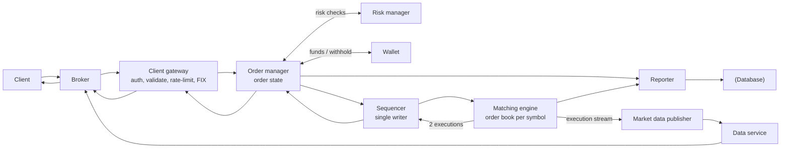
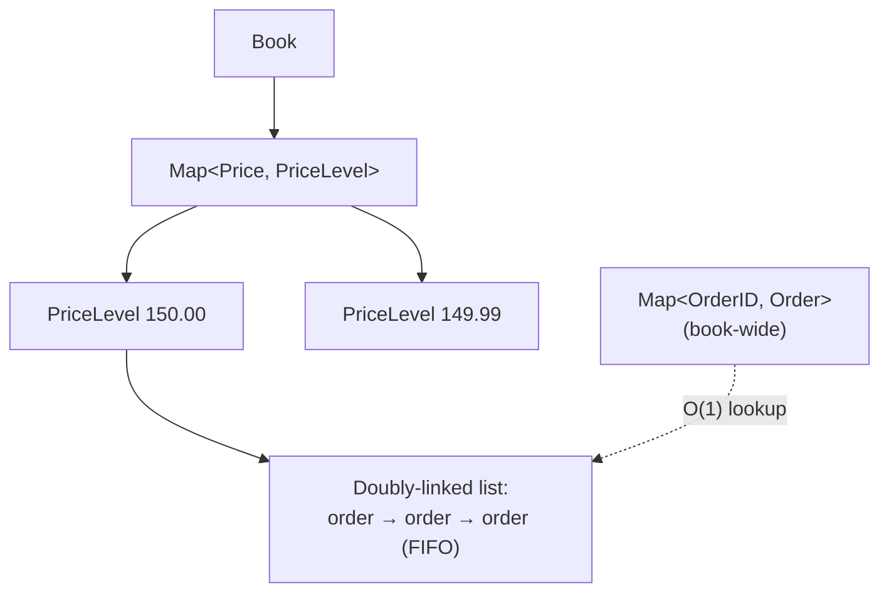
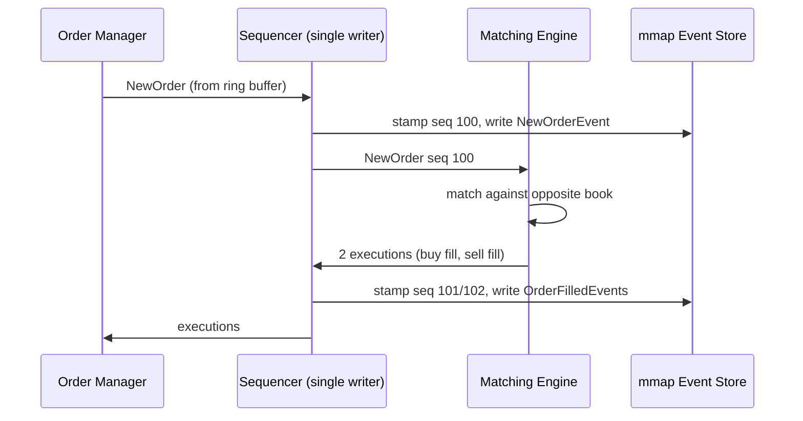
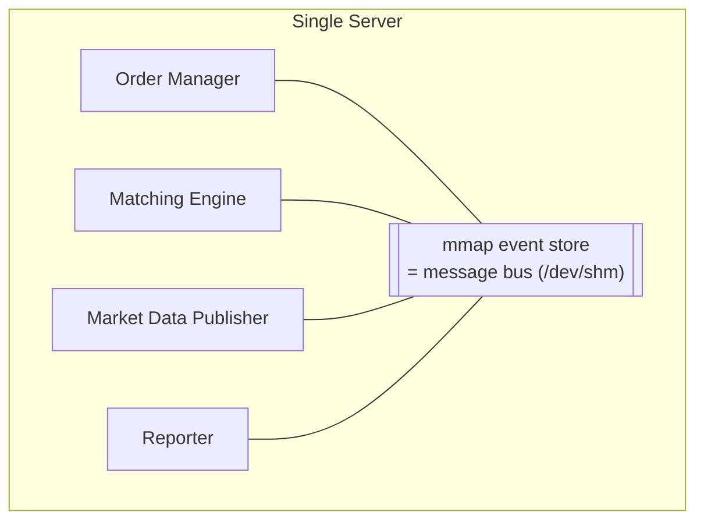
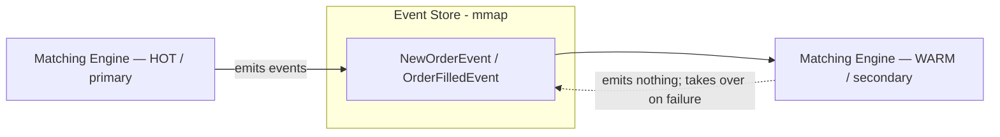
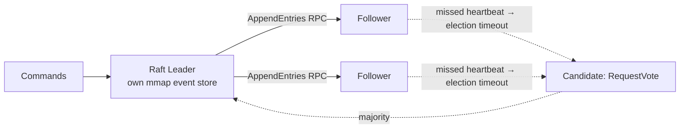

# Stock Exchange — System Design

**Difficulty:** Advanced
**Interview importance:** ⭐ **Critical** (the ultimate "low-latency + determinism" problem — where "just add more servers" is the *wrong* answer and interviewers watch to see if you know that)
**References:** ByteByteGo *System Design Interview Vol. 2* — Ch. 13 *Design a Stock Exchange*; DDIA Ch. 8–9 (ordering, consensus); Aeron / LMAX Disruptor (mmap message bus, ring buffers)

---

## 0. Why This Design Matters

A stock exchange is the rare system where the instinct that solves *every other* interview — **"shard it, add more servers"** — is exactly wrong. Adding a network hop adds ~500 µs; your whole latency budget is *tens of microseconds*. So the surprising, staff-level answer is to put **everything on one server** and talk to yourself through memory.

It forces two requirements that usually pull in opposite directions to both hold at once: **extremely low, extremely *stable* latency** (measured at the 99th/99.99th percentile, not the average) and **hard determinism** (replay the same orders → get the same trades, provably, for a regulator). The techniques that make this work — a **single-writer sequencer**, **event sourcing**, **mmap over `/dev/shm`**, **CPU-pinned single-thread loops**, an **O(1) order book**, and **Raft** for HA — are the crown jewels of high-performance systems design.

> The one-line thesis: **an exchange doesn't scale *out*, it scales *down* — one deterministic thread, one server, memory instead of network, and consensus only for the event log.**

---

## 1. Problem Overview — in plain English

A stock exchange matches buyers and sellers. A client places an order through a **broker** (Robinhood, Fidelity); the exchange finds a matching order and produces a **trade** (two "fills" — one for the buyer, one for the seller). We must:

> **"Match buy and sell orders in real time, fairly, with microsecond latency — and be able to prove afterward that the exact same orders would produce the exact same trades."**

- Place and cancel **limit orders** (a fixed price; may partially fill).
- Show the **order book** (all resting buy/sell orders) and matched trades in real time.
- Run **risk checks** (it's a regulated facility) and **wallet** checks (enough funds; withhold funds while an order rests).

The two defining challenges are **very low, very stable latency** and **correctness/determinism**.

### Real-world analogy — the auction house with a single, meticulous auctioneer

Picture a physical trading pit — but instead of a chaotic crowd, there's **one auctioneer** who takes every bid and offer, in the exact order received, and calls matches. Why *one*?

- **Fairness & determinism:** if two auctioneers took bids simultaneously, the outcome would depend on who shouted louder — non-deterministic, unfair, and impossible to audit. One auctioneer, one strict queue, means the *order* of events is the only thing that matters — replay the tape and you get the identical result.
- **Speed:** the auctioneer keeps everything in their head (memory), never walking to a filing cabinet (disk) or phoning another room (network). That's mmap-over-`/dev/shm` and a CPU-pinned loop.
- **Resilience:** a silent apprentice (the *warm* auctioneer) watches every call and can instantly take over — that's hot-warm HA.

Everything else — the sequencer, event sourcing, Raft — is just "how do we make this single auctioneer never lose a bid, and instantly replace them if they collapse?"

---

## 2. Functional Requirements

**Core**
- Place a **limit order** and **cancel** an order (limit only; normal trading hours only).
- Clients receive **matched trades in real time** and can view the **real-time order book**.
- **Risk checks** (simple, e.g. max 1M shares of a symbol per user per day).
- **Wallet**: ensure sufficient funds; **withhold** funds for resting orders.

**Optional (name, then defer)**
- Market orders, stop orders, more matching algorithms, FX, options/derivatives, after-hours. Scope to **limit orders during trading hours** — that's the deterministic core.

---

## 3. Non-Functional Requirements

| Requirement | Target | Why it dominates the design |
|---|---|---|
| Latency | Round-trip at **ms → tens of µs**, measured at **p99 / p99.99** | The whole reason exchanges avoid network/disk; average is meaningless, tails kill |
| Latency *stability* | Deterministic per-trade latency | A fair market can't have some traders randomly 100× slower |
| Availability | **≥ 99.99%** (4 nines ≈ 8.64 s/day) | Downtime destroys reputation and breaks a regulated market |
| Determinism | Same order sequence → same trades on replay | Regulatory audit + fast recovery |
| Fault tolerance | Fast failover, **RPO ≈ 0**, **second-level RTO** | It's money; you cannot lose a trade |
| Scale | Tens of thousands of users, **≥100 symbols**, **billions of orders/day** | Sizes the estimation below |
| Security | KYC before account; DDoS protection on public market-data pages | Regulated + public-facing |

> **Say this out loud:** *"Only the trading path is latency-critical. Market data and reporting can trade latency for completeness. I spend my entire latency budget on the order-entry-to-fill path and strip everything else off it — even logging."*

---

## 4. Capacity Estimation (do the math)

```text
Symbols             = 100
Orders/day          = 1,000,000,000   (1 billion)
Trading hours       = 6.5 h/day       (NYSE: 9:30 am – 4:00 pm ET)
```

**Average QPS:**
```text
QPS = 1,000,000,000 ÷ (6.5 × 3,600 s) ≈ 43,000 orders/sec
```

**Peak QPS** — traffic spikes at the open and just before the close (~5×):
```text
Peak QPS = 5 × 43,000 ≈ 215,000 orders/sec
```

**What the numbers tell us:**
- **215k peak QPS is *not* the hard part** — a single well-tuned server handles that. The hard part is the **microsecond latency** on each of those orders, at the tail.
- Because raw throughput is modest, **there's no reason to shard the hot path** — and every reason not to (each network hop is ~500 µs, blowing the budget). This is what justifies the single-server design.
- Orders and executions live **in memory**; disk is only for recovery, and the DB is off the critical path.

---

## 5. API Design

RESTful for retail; institutions use faster binary protocols (FIX/SBE).

```http
POST /v1/order
```
```json
{ "symbol": "AAPL", "side": "BUY", "price": "150.00", "orderType": "LIMIT", "quantity": 100 }
```
```json
{ "id": "ord_123", "creationTime": "...", "filledQuantity": 0,
  "remainingQuantity": 100, "status": "NEW" }
```

Other endpoints (not latency-critical):
```http
GET /v1/execution?...                                  # query fills
GET /v1/marketdata/orderBook/L2?symbol=AAPL&depth=10   # L2 book (bids/asks arrays)
GET /v1/marketdata/candles?symbol=AAPL&resolution=1m&startTime=&endTime=
```

**Market data levels** interviewers expect you to name: **L1** = best bid/ask + quantity; **L2** = several price levels; **L3** = full depth per price level. Retail may get 5 L2 levels free, pay for 10.

---

## 6. High-Level Architecture

Three flows — **only the first is latency-critical**:



- **Trading flow (critical path ⭐):** gateway → order manager → sequencer → matching engine. A match emits **two executions (fills)** — one buy, one sell — sequenced for determinism, returned to the client.
- **Market data flow (not critical):** matching engine → **market data publisher (MDP)** builds order books + candlesticks → data service → brokers.
- **Reporting flow (not critical):** the **reporter** merges order + execution attributes and writes consolidated records to the DB for history, tax, compliance, settlement.

### The components that matter

- **Matching engine (cross engine):** maintains the **order book per symbol**, matches buy/sell (each match → **two fills**), distributes the execution stream. **Must be deterministic.**
- **Sequencer:** what *makes* matching deterministic. It stamps every inbound order and every outbound execution pair with **sequential IDs** (separate in/out sequences, so a gap is instantly detectable). It gives **timeliness/fairness, fast recovery/replay, and exactly-once**. It's simultaneously a **message queue** and an **event store** — conceptually two Kafka streams, but **Kafka's latency is too high/unpredictable** for the critical path.
- **Order manager:** tracks order state — the biggest source of complexity (tens of thousands of state-transition cases). **Event sourcing fits it perfectly.**
- **Client gateway:** lightweight gatekeeper (auth, validation, rate limiting, normalization, FIX). Different gateways for retail vs institutional. Extreme case: a **colocation (colo) engine** — the broker's software runs on rented servers *inside the exchange's data center*, so latency ≈ speed of light down the cable.

---

## 7. Deep Dive

### 7.1 The O(1) Order Book

The order book must do add / cancel / execute **and** best-bid/ask lookup all in **O(1)**. The structure: `Book` → `Map<Price, PriceLevel>`, where each `PriceLevel` holds a **doubly-linked list** of orders, plus a book-wide `Map<OrderID, Order>`.



- **Place** = append to the tail of the price level's list → **O(1)**.
- **Match** = remove from the head (FIFO) → **O(1)**.
- **Cancel** = find the node via `orderMap` in **O(1)**, then unlink using the node's `prev` pointer (that's *why* it's doubly-linked) → **O(1)** instead of O(n).

### 7.2 The Sequencer + Event Sourcing = Determinism

Instead of storing only current state, keep an **immutable log of all state-changing events** as the source of truth (e.g. `NewOrderEvent` seq 100 → `OrderFilledEvent` seq 101). Current state is recoverable by **replaying events**.



- The **sequencer is a single writer** — multiple sequencers would fight over the write position, wasting time on contention. Backup sequencers exist for HA. It pulls events from each component's **ring buffer**, stamps a sequence ID, and writes to the mmap event store.
- The external domain speaks **FIX** (Financial Information eXchange, 1991, vendor-neutral); the gateway converts to **FIX over Simple Binary Encoding (SBE)** for compact, fast encoding.
- The **order manager is embedded in the matching engine** (avoids a network hop).

### 7.3 From Milliseconds to Microseconds

`Latency = Σ executionTime along the critical path`. Two levers: **fewer tasks** on the path and **less time per task** (cut network/disk). With components on separate servers over a network, a round trip ≈ **500 µs** and disk (even sequential) adds tens of ms → tens of ms total. Modern exchanges hit **tens of µs** by putting **everything on one server** talking through **mmap**.



- **mmap:** POSIX `mmap(2)` maps a file into process memory. Backed by **`/dev/shm`** (a memory-backed filesystem) there is **no disk access at all** — a send takes **sub-microsecond**. This is the message bus between critical-path components.
- **Application loop:** a `while` loop polling for tasks, **single-threaded and pinned to a fixed CPU core** → **no context switches, no lock contention** → low p99. Trade-off: harder to code — each task must stay short so it never blocks the loop.
- **Logging is removed from the critical path** entirely.

### 7.4 High Availability — Hot-Warm

Stateless services (gateway) scale horizontally. Stateful ones (order manager, matching engine) need state mirrored via a **hot-warm** design:



- The **hot** engine is primary and emits events. The **warm** engine processes the *exact same events* but emits nothing. On primary failure the warm instance takes over **instantly**; a restarted warm instance recovers all state by replaying the event store.
- **Heartbeats** detect failure.
- Hot-warm only works within one server → extend it across machines/data centers by **replicating the whole event store** (e.g. **reliable UDP** — see **Aeron**).

### 7.5 Fault Tolerance — Raft, RTO, RPO

If warm instances also fail (rare but catastrophic), replicate core data to data centers in **multiple cities**.



- **Raft leader election:** 5-node cluster, each with its own mmap event store; leader replicates via **AppendEntries RPC**; quorum = **n/2 + 1** (here 3). A follower that misses heartbeats hits an **election timeout**, becomes a **candidate**, sends **RequestVote**; a majority wins (a **split vote** restarts the election). Time is divided into **terms**.
- **RTO (Recovery Time Objective):** how long the app can be down → need **second-level RTO** via automatic failover + service priority/degradation.
- **RPO (Recovery Point Objective):** acceptable data loss → **near zero** for an exchange. Raft keeps many consensus-agreed copies, so a new leader works immediately.
- **When to fail over:** a bug can crash the primary *and then* the backups after failover — so release with **manual failover first**, automate later after operational confidence; use **chaos engineering**.

### 7.6 Determinism — Two Kinds

- **Functional determinism:** sequencer + event sourcing guarantee that replaying events **in the same order** yields the same results — **order of events matters, not their wall-clock time**, so uneven timestamps can be *compressed* to speed up replay/recovery.
- **Latency determinism:** nearly identical latency per trade, measured at the **99th / 99.99th percentile** (use **HdrHistogram**). Investigate spikes — e.g. in Java, **HotSpot JVM Stop-the-World GC** at safe points.

### 7.7 Matching Algorithm

Default is **FIFO**: at a price level, the first order in is matched first. The engine checks the **sequence ID** (returns `OUT_OF_ORDER` on a gap), validates, then handles `NEW` (match against the opposite book) or `CANCEL` (find via `orderMap`, remove, mark `CANCELED`). Other algorithms: **FIFO with LMM (Lead Market Maker)** — pre-allocates a negotiated ratio to the LMM ahead of the FIFO queue (CME); also used in **dark pools**.

### 7.8 Market Data Publisher, Fairness, Multicast

- **MDP** rebuilds order books + candlesticks from the execution stream and publishes to tiered subscribers. It uses **ring buffers** — fixed-size, pre-allocated, **lock-free** circular queues with **cache-line padding** (keeps the sequence number off shared cache lines) — and caps candlesticks in memory, persisting the rest.
- **Candlestick chart:** open/close/high/low/volume over an interval, held in a `LinkedList`; memory optimizations are **pre-allocated ring buffers** and **limit in memory, persist rest to disk**. Stored in an in-memory columnar DB like **KDB** for real-time analytics, then a historical DB after close.
- **Fairness:** all subscribers should receive data **at the same time**. If MDP sent in connection order, smart clients would race to connect first — mitigate with **random ordering** + **reliable-UDP multicast**.
- **Multicast:** unicast (1→1), broadcast (1→subnet), **multicast (1→a group across subnets)**. Exchanges use multicast so a group receives simultaneously; UDP is unreliable → add **retransmission**.
- **Colocation:** client servers in the exchange's data center; latency ∝ cable length — a fair **paid VIP service**.
- **DDoS / security:** isolate public from private (read-only copies), add a **caching layer**, **harden URLs** (`/data/recent` instead of query-string URLs so they're CDN-cacheable), safelist/blocklist, rate limiting, **KYC** before account opening.

---

## 8. Trade-Offs to Say Out Loud

| Axis | Option A | Option B | Choose by |
|---|---|---|---|
| Topology | **Single server** (mmap, no hops) | Distributed/sharded (network) | Latency need vs horizontal scale |
| Message bus | **Custom sequencer over mmap** | Kafka | Latency: Kafka too slow/jittery for the hot path |
| Threading | **Single CPU-pinned loop** (no locks) | Multi-threaded pool | p99 stability vs coding ease |
| Storage on path | In-memory + mmap `/dev/shm` | Disk / remote DB | Only recovery/reporting touch disk |
| HA | **Hot-warm + Raft** | Active-active | Determinism needs a single writer |
| Market data delivery | **Multicast (simultaneous, fair)** | Unicast (per client) | Fairness in a regulated market |
| Failover | **Manual first, automate later** | Auto from day one | Risk of cascading backup crashes |

---

## 9. Failure Scenarios

| Failure | Handling |
|---|---|
| Out-of-order event (sequence gap) | Matching engine returns **OUT_OF_ORDER**; gap detection via sequential IDs |
| Cancel of an already-matched order | Error **CANNOT_CANCEL_ALREADY_MATCHED** |
| Primary matching engine crash | **Warm** instance takes over instantly; restarted node replays event store |
| Both hot *and* warm down | **Multi-city replication** + **Raft** new-leader election |
| False failure alarm / bug crashes primary then backups | **Manual failover** first, automate after confidence; **chaos engineering** |
| Latency spike (e.g. JVM GC Stop-the-World) | Monitor **p99.99 with HdrHistogram**; tune/avoid GC on the loop |
| UDP multicast packet drop | **Retransmission** on top of unreliable UDP |
| Clients racing to connect first for data | **Random subscriber ordering** + simultaneous **multicast** |
| Sequencer failure | Single writer with **backup sequencers**; sequence gaps make recovery detectable |

---

## 10. Common Mistakes

- **Reaching for "shard it / add servers."** For 215k QPS at microsecond latency, sharding the hot path *adds* ~500 µs per hop. The right move is to scale **down** to one server.
- **Using Kafka on the critical path.** Same pub-sub idea, but its latency is too high and jittery — build a custom mmap sequencer.
- **Multi-threading the matching engine.** Locks and context switches wreck p99. Single CPU-pinned thread, keep each task short.
- **Optimizing the average latency.** Markets care about **tails** — measure p99 / p99.99 (HdrHistogram), and hunt spikes (GC, page faults).
- **Multiple sequencers.** They contend over the write position. There is exactly **one writer**; that's what makes replay deterministic.
- **Leaving logging on the hot path.** Even logging is stripped from the critical path.
- **Ignoring fairness.** Sending market data in connection order invites a connect-race; use random order + multicast.
- **Automating failover on day one.** A bug can crash primary then the backups; start manual, earn automation with chaos testing.

---

## 11. Interview Q&A

**Beginner**

**Q: What's the heart of the system?**
The **matching engine**, which holds a per-symbol **order book** and matches buy/sell orders. Each match produces **two fills** — one for the buyer, one for the seller.

**Q: What data structure is the order book?**
A map from price to price-level, where each price level is a **doubly-linked list** of orders (FIFO), plus a book-wide `Map<OrderID, Order>`. Place (append tail), match (remove head), and cancel (lookup + unlink via prev pointer) are all **O(1)**.

**Intermediate**

**Q: Why a sequencer, and what does it buy you?**
It's a **single writer** that stamps sequential IDs on every inbound order and outbound execution. That gives **determinism** (replay the same sequence → same trades), **fast recovery** (a gap in the numbers is instantly detectable), **exactly-once**, and fairness. It doubles as an in-memory message queue and event store — like Kafka, but low-latency.

**Q: How do you get from milliseconds to microseconds?**
Two levers: fewer tasks on the critical path and less time per task. Put **everything on one server** communicating via **mmap over `/dev/shm`** (sub-µs, no disk, no network), run the engine as a **single CPU-pinned thread** (no context switches or locks), and strip everything non-essential — including logging — off the path.

**Q: How do you make it highly available?**
Stateless services scale horizontally. For the stateful matching engine, use **hot-warm**: the hot instance emits events, the warm instance replays the identical events but emits nothing and takes over instantly on failure. Extend across machines/data centers by replicating the event store (reliable UDP / Aeron) and using **Raft** for leader election.

**Advanced / Staff**

**Q: What exactly makes matching deterministic, and why does it matter that it's the *order* of events, not the time?**
Sequencer + event sourcing: an immutable event log with sequential IDs, replayed by a deterministic engine, yields identical trades. Because only the *order* matters — not wall-clock time — you can **compress uneven timestamps** during replay to recover far faster than real time. Determinism is also a regulatory requirement: you can prove the same orders would produce the same trades.

**Q: RTO vs RPO for an exchange, and how does Raft serve them?**
RPO — acceptable data loss — must be **near zero**; you can't lose a trade. RTO — tolerable downtime — must be **second-level**. Raft keeps multiple consensus-agreed copies of the event log across nodes/cities, so on leader failure a follower with a majority becomes leader and works immediately: near-zero data loss (RPO) and fast automatic failover (RTO).

**Q: Why not shard the matching engine like every other high-scale system?**
Because throughput isn't the bottleneck — 215k peak QPS fits one server — **latency** is, and every network hop adds ~500 µs against a tens-of-µs budget. Sharding would also fracture the single-writer determinism. Determinism plus latency both push toward a single deterministic writer on one machine, made reliable with hot-warm + Raft rather than horizontal sharding.

**Q: How do you keep market-data distribution fair?**
Deliver simultaneously via **multicast** (one send reaches a whole group across subnets at once), add **retransmission** because UDP is unreliable, and **randomize subscriber ordering** so no one gains an edge by connecting first. Colocation is offered as a transparent, equally-priced VIP service.

---

## 12. 30-Second Interview Answer

> "The surprise is that you *don't* scale a stock exchange out — 215k peak QPS fits one server, and every network hop costs ~500 µs against a tens-of-µs budget. So I put **everything on one server** talking through **mmap over `/dev/shm`** as a sub-microsecond message bus, and run the matching engine as a **single CPU-pinned thread** — no locks, no context switches, stable p99. Determinism comes from a **single-writer sequencer** that stamps sequential IDs plus **event sourcing**: replay the same event order and you get the same trades, which regulators require. The order book is **O(1)** — a doubly-linked list per price level plus an order map — so place, match, and cancel are all constant time. For HA I use **hot-warm**: the hot engine emits events, the warm one replays them silently and takes over instantly; across data centers I replicate the event store and use **Raft** for leader election, targeting near-zero RPO and second-level RTO. The trading path is the only latency-critical one — market data and reporting trade latency for completeness. Market data goes out fairly via **multicast** with retransmission, and I measure the **99.99th percentile with HdrHistogram**, hunting spikes like JVM GC."

---

## 13. Mental Model

```text
ORDER (limit)
   ↓ gateway (auth, validate, FIX→SBE)
   ↓ order manager (state) + risk + wallet
   ↓ SEQUENCER (single writer) → stamp seq ID → mmap event store
   ↓ MATCHING ENGINE (O(1) book, FIFO) → 2 fills
   ↓ sequenced executions → client   +   MDP → multicast market data

DETERMINISM → single-writer sequencer + event sourcing (order, not time)
SPEED       → one server + mmap(/dev/shm) + CPU-pinned single thread
BOOK        → Map<Price,PriceLevel> + doubly-linked list + orderMap = O(1)
HA          → hot-warm (warm replays, emits nothing) + heartbeats
FAULT TOL   → Raft across cities, RPO≈0, second-level RTO, manual→auto failover
FAIRNESS    → multicast (simultaneous) + random order + colo as fair VIP
MEASURE     → p99 / p99.99 (HdrHistogram); strip logging off the path
```

---

## 14. How This Connects to Other Topics

- **Digital Wallet (Ch. 12)** — the *same core toolkit*: **event sourcing + a single deterministic writer + Raft**. There it buys reproducibility and audit; here it buys deterministic matching and microsecond latency. The wallet **scales out** (shard into Raft groups) because throughput is the constraint; the exchange **scales down** (one server) because latency is. Same tools, opposite topologies — a great compare-and-contrast.
- **Distributed Rate Limiter** — the gateway does rate limiting; and the "measure tails, not averages" and "mmap/lock-free" performance mindset carries straight over.
- **Consensus / Raft (DDIA Ch. 9)** — leader election, terms, quorum n/2+1, AppendEntries — the canonical mechanism for keeping the event log durable across data centers.
- **Ordering & total order (DDIA Ch. 8–9)** — the sequencer *is* a total-order broadcast; "order matters, not wall-clock time" is the deep idea behind deterministic replay.
- **Message queues** — the sequencer is a low-latency message queue + event store; ring buffers (LMAX Disruptor) are the lock-free version of that pattern.
- **CDN / DDoS protection** — public market-data pages use cacheable hardened URLs, read-only replicas, and edge caching — the same edge-defense playbook as any public high-traffic read path.
