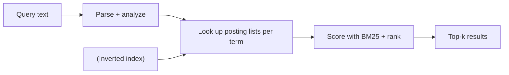
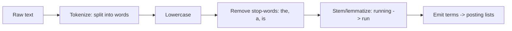
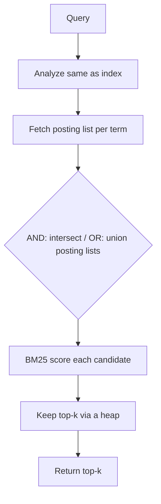
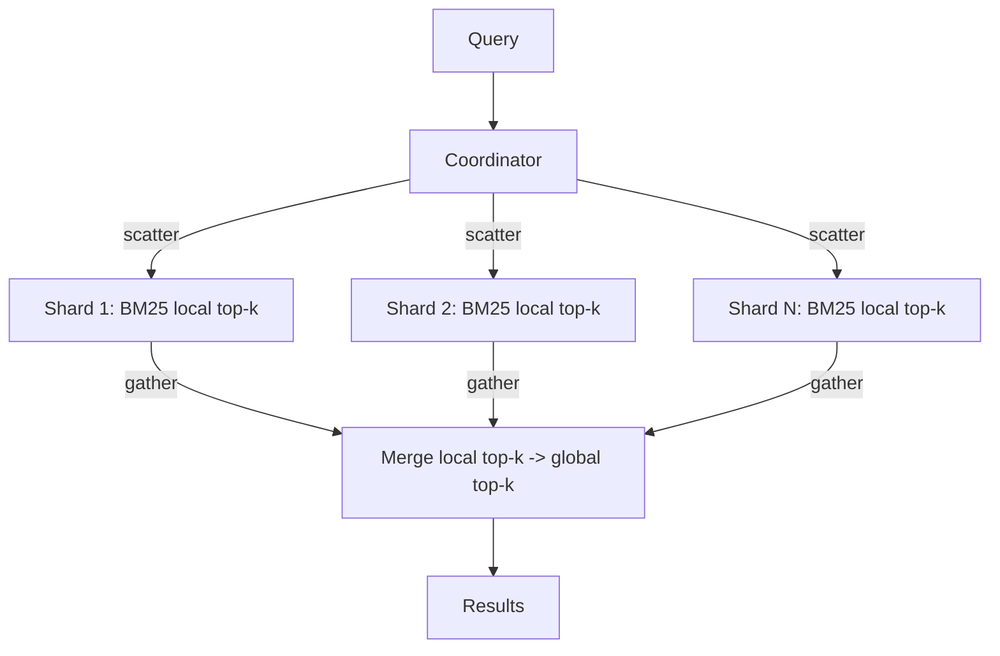

# Full-Text Search Engine — System Design

**Difficulty:** Advanced
**Interview importance:** ⭐ **Critical** — "design search" (Elasticsearch/Google-like) is a top question and the single biggest gap most candidates have. It teaches a data structure and scoring model nothing else does.
**Core new tech:** the **inverted index**, **BM25/TF-IDF relevance scoring**, Lucene-style segments, and **scatter-gather over shards**.

---

## 0. Why This Design Matters

Search looks like "find documents containing these words" but the *how* is a whole discipline: you can't scan every document per query, so you invert the problem with an **inverted index**; you can't return matches in arbitrary order, so you **score relevance** (BM25); and you can't fit a web-scale index on one machine, so you **shard and scatter-gather**. It's distinct from every other design in your set — a trie (autocomplete) does *prefix* matching; a DB does *exact* lookups; this does *ranked full-text* retrieval.

> Thesis: **invert the data (term → documents), score matches by relevance (BM25 = term frequency saturated + length-normalized + rarity-weighted), and shard the index so queries scatter to shards and gather the merged top-k.**

---

## 1. Problem Overview — in Plain English

Build a service where users type a text query ("best noise cancelling headphones") and get back the most **relevant** documents, fast, ranked best-first — across millions/billions of documents that are constantly being added and updated.

**Real-world analogy — the index at the back of a textbook.** To find every page about "mitochondria," you don't read all 900 pages — you flip to the index, which maps the *word* → the *list of pages*. A search engine builds that index for every word in every document (the **inverted index**), and then, when a query matches many documents, it ranks them so the most relevant appear first — the way a good index might bold the primary reference.



---

## 2. Functional Requirements

**Core**
- **Index** documents (add / update / delete) — text fields + metadata.
- **Query** with free text; return the **top-k most relevant** documents, ranked.
- Support **multi-term** queries (AND/OR semantics), phrases, and basic filters (by field/date/category).
- **Near-real-time** freshness — a newly indexed doc becomes searchable within seconds.
- Pagination / "more results."

**Optional / advanced**
- Typo tolerance / fuzzy matching, autocomplete/suggestions, faceted search, highlighting snippets, personalization/learning-to-rank, synonyms, multi-language analysis.

---

## 3. Non-Functional Requirements

| Requirement | Target | Why it drives the design |
|---|---|---|
| **Query latency** | p99 low (tens–low-hundreds ms) | Search is interactive; drives caching + index design |
| **Relevance quality** | Right docs at the top | The whole point — drives BM25 / ranking |
| **Scale** | Millions–billions of docs | Single machine can't hold the index → sharding |
| **Freshness** | Seconds (near-real-time) | New docs searchable quickly → segment strategy |
| **Read-heavy** | Reads ≫ writes | Optimize for query; replicate for read throughput |
| **Availability** | High | Replication of shards |

---

## 4. Capacity Estimation

(Illustrative assumptions.) Say **1B documents**, avg **1 KB** of text, **10K queries/sec**.

- **Index size:** the inverted index is roughly proportional to the number of unique (term, doc) postings. A common rule of thumb: the index is a *fraction* of the raw text (postings are compact IDs), but with positions/metadata it can approach the raw text size. 1B × 1 KB = **~1 TB raw text** → index in the same order → **doesn't fit on one node** → shard.
- **Sharding:** if one node holds ~50–100 GB of index comfortably, 1 TB → **~10–20 primary shards**, each replicated (×2–3 for read throughput + HA).
- **Read-heavy:** 10K QPS of reads vs. a much lower write/index rate → replicate shards to scale reads; cache hot queries.

**Conclusion:** the index must be **sharded** (partition documents across nodes) and **replicated** (copies per shard for throughput/HA); optimize the query path and cache popular queries.

---

## 5. The Inverted Index (the core data structure)

Instead of `document → words`, store `word → documents`. Each term maps to a **posting list**: the documents containing it, plus per-doc data used for scoring and phrases.

```text
Term "headphones" → [ (doc=12, tf=3, positions=[4,19,88]),
                      (doc=57, tf=1, positions=[7]),
                      (doc=93, tf=5, positions=[...]) , ... ]
```
- **`tf`** (term frequency) → how often the term appears in the doc (for scoring).
- **positions** → where it appears (for phrase queries "noise cancelling" as adjacent words).
- Posting lists are **sorted by doc id** and **compressed** (delta-encoding of doc ids + variable-length ints) so intersections are fast and storage is small.

### Building it — the analysis pipeline
A document's text is **analyzed** into terms before indexing (and the same analysis is applied to the query, so they match):


Tokenize → normalize (lowercase, remove punctuation) → drop **stop-words** → **stem/lemmatize** (so "running"/"ran"/"runs" match "run"). *Query and document must use the same analyzer* or they won't match.

### Segments (Lucene model) — how writes + freshness work
The index is built from **immutable segments**:
- New/updated docs are buffered and flushed into a **new small immutable segment** (fast writes, near-real-time searchability).
- A **delete** doesn't rewrite a segment — it marks the doc in a **tombstone/liveness bitset**; the doc is filtered out of results and physically removed later.
- A background **merge** process combines small segments into larger ones (and drops tombstoned docs) — like LSM-tree compaction (which you know from DDIA).
- A query searches **all current segments** and merges the results.

This immutable-segment design is why search engines can be near-real-time *and* read-optimized: writes append tiny segments; reads never block on writes.

---

## 6. Relevance Scoring — TF-IDF → BM25

When a query matches thousands of docs, order matters. Scoring ranks them.

**TF-IDF intuition (the classic starting point):**
- **TF (term frequency):** a doc mentioning "headphones" 5× is more about headphones than one mentioning it once.
- **IDF (inverse document frequency):** a rare word ("hemidemisemiquaver") is more discriminating than a common one ("good"), so rare terms weigh more.
- Score ≈ Σ over query terms of `TF × IDF`.

**BM25 (the modern standard — what Elasticsearch/Lucene use):** a refinement of TF-IDF that fixes two flaws:
1. **Term-frequency saturation** — 100 mentions isn't 100× more relevant than 1; BM25 makes TF's contribution level off (controlled by **`k1`**, typically ~1.2–2.0).
2. **Document-length normalization** — a long document naturally contains a term more often; BM25 penalizes length so long docs don't unfairly win (controlled by **`b`**, typically ~0.75, relative to the average doc length `avgdl`).

The scoring shape (know the *intuition*, not memorized constants):
```text
score(D, Q) = Σ_terms  IDF(term) · [ tf · (k1 + 1) ] / [ tf + k1 · (1 - b + b · |D|/avgdl) ]
```
- `IDF(term)` ↑ for rarer terms.
- The fraction ↑ with `tf` but **saturates** (via `k1`) and is **length-normalized** (via `b`).

> Interview line: *"I'd score with BM25 — it's TF-IDF plus term-frequency saturation and length normalization, which is why it beats raw TF-IDF and is the Lucene/Elasticsearch default."*

Beyond BM25, production systems add a **second ranking stage** (learning-to-rank / an ML model using signals like click-through, freshness, popularity) on the top-N BM25 candidates — a two-phase retrieve-then-rerank (same shape as the RAG reranker).

---

## 7. Query Execution


1. **Analyze** the query with the *same* pipeline as indexing.
2. **Fetch** the posting list for each term.
3. **Merge**: intersect (AND) or union (OR) the sorted lists — fast because they're doc-id sorted.
4. **Score** candidates with BM25; for phrases, check **positions** are adjacent.
5. Keep the **top-k** with a bounded min-heap; return them (then hydrate titles/snippets).

---

## 8. Sharding & Scatter-Gather (scaling to billions)

One node can't hold the index, so **partition documents across shards** — each shard is a *complete inverted index over its subset of documents* (document-based partitioning, the standard for search).


- **Scatter:** the coordinator sends the query to **every shard** (each holds different docs).
- Each shard computes its **local top-k** with BM25.
- **Gather:** the coordinator merges the shards' local top-ks into the **global top-k**.
- **Replicas per shard** serve reads in parallel (throughput) and provide HA.

*(Contrast: term-based partitioning — split by term instead of document — makes multi-term queries hit fewer nodes but creates hot terms and hard writes; document-based is the usual choice. This is exactly the "local vs global secondary index" trade-off from DDIA.)*

**IDF caveat:** IDF is a global statistic, but each shard only sees its own docs. Engines approximate per-shard IDF (usually fine) or gather document-frequency stats first for exactness — worth mentioning.

---

## 9. Architecture (end to end)

```mermaid
flowchart TD
    subgraph Indexing (write path)
      Docs[Documents] --> IngQ[[Index queue]]
      IngQ --> IW["Indexer: analyze -> segments"]
      IW --> Shards[("Sharded + replicated index")]
    end
    subgraph Query (read path)
      U[User query] --> QC[Query coordinator]
      QC --> Cache{"Query cache?"}
      Cache -->|hit| Ret[Return]
      Cache -->|miss| Scatter[Scatter to shards] --> Shards
      Shards --> Gather["Gather + merge top-k"] --> Ret
    end
```
- **Write path async** via a queue (indexing is heavier; decouple from ingestion).
- **Query cache** for popular queries (huge win — query distribution is Zipfian; a few queries dominate).
- The document store (for titles/snippets) can be separate; the index stores just what's needed to match + score.

---

## 10. Failure & Edge Cases

| Scenario | Handling |
|---|---|
| A shard is down | Serve from a replica; degrade to partial results if all replicas down (flag "incomplete") |
| Index lag / stale results | Near-real-time via segment flush; accept small delay; monitor indexing lag |
| Hot query (viral term) | Query-result cache; replicate hot shards |
| Deleted docs still appear | Liveness bitset filters them; merge physically removes later |
| Query with only stop-words | Fallback handling; don't return everything |
| Very long posting list (common word) | Skip lists / early termination (WAND algorithm) to avoid scoring everything |
| Analyzer mismatch (query vs index) | Enforce the same analyzer on both paths |

---

## ❌ 11. Common Mistakes
- **Proposing a full DB scan / `LIKE '%term%'`** — doesn't scale and can't rank; the inverted index is the whole point.
- **Forgetting relevance scoring** — returning matches unordered. Name BM25.
- **Not applying the same analyzer** to query and documents → they silently don't match.
- **Ignoring sharding/scatter-gather** for scale, or proposing term-partitioning without knowing the hot-term downside.
- **Treating deletes as rewrites** — use tombstones + background merge (segments are immutable).
- **No query cache** despite a Zipfian query distribution.
- **Confusing this with autocomplete** (trie/prefix) — different problem, different structure.

---

## 12. Trade-offs to Say Out Loud

| Axis | A | B | Choose by |
|---|---|---|---|
| Partitioning | Document-based (scatter-gather) | Term-based | Doc-based default; term-based has hot terms |
| Scoring | BM25 only | BM25 + ML rerank | Quality vs cost/complexity |
| Freshness | Batch rebuild | Segment flush (near-real-time) | Latency of updates |
| Consistency | Strong | Eventually consistent index | Search tolerates seconds of lag |
| Store | Index holds docs | Index + separate doc store | Index size / snippet needs |

---

## 13. LLD
```java
interface Indexer { void index(Doc d); void delete(String id); }        // analyze -> segment
interface Analyzer { List<Term> analyze(String text); }                 // tokenize/normalize/stem — same for query & doc
interface InvertedIndex { PostingList postings(Term t); }               // term -> sorted, compressed postings
interface Scorer { double score(Query q, DocId d); }                    // BM25
interface QueryCoordinator { List<Hit> search(Query q, int k); }        // scatter-gather + merge
interface Shard { List<Hit> localTopK(Query q, int k); }
```
**Patterns:** scatter-gather (coordinator/shards), Strategy (analyzers, scorers), LSM-like segment merge, two-phase retrieve-then-rerank.

---

## 14. Interview Q&A

**Beginner**
**Q: Why not just scan documents for the query words?**
Scanning every document per query is O(all documents) and can't scale to millions. Instead you invert the data once into an inverted index — term → the list of documents containing it — so a query is a fast lookup of a few posting lists, not a full scan. It's the textbook-index idea: look up the word, get the pages.

**Q: A query matches 10,000 docs — how do you decide the order?**
Relevance scoring. BM25 ranks by how often the terms appear in a doc (term frequency, but saturating so 100 mentions isn't 100× better), normalized by document length, and weighted by how rare each term is (IDF). Rarer, more-frequent-in-this-doc terms push a document up.

**Intermediate**
**Q: What's in a posting list and why?**
For each term, the sorted list of doc ids that contain it, plus per-doc term frequency (for BM25) and positions (for phrase queries like "noise cancelling" needing adjacent words). Sorted-by-doc-id lets you intersect/union lists fast, and they're delta-compressed to save space.

**Q: How do you handle updates and deletes given millions of docs?**
Lucene-style immutable segments: new/updated docs flush into a new small segment (near-real-time, fast writes); deletes just mark the doc in a liveness bitset and are filtered from results; a background merge compacts small segments and physically drops tombstoned docs — the same append-and-compact idea as an LSM-tree.

**Advanced / Staff**
**Q: How do you scale to a billion documents?**
Shard by document — each shard is a full inverted index over a subset of docs — and replicate each shard. A query scatters to all shards, each returns its local top-k with BM25, and the coordinator merges those into the global top-k (scatter-gather). Replicas serve reads in parallel for throughput and HA. I'd avoid term-based partitioning as the default because it creates hot terms and hard writes.

**Q: BM25 needs global IDF but each shard only sees its docs — problem?**
Yes — IDF (term rarity) is a corpus-wide statistic, but a shard only knows its local document frequencies, so per-shard BM25 scores aren't perfectly comparable. In practice engines use per-shard IDF as an approximation (usually fine with enough docs per shard) or do a first round to gather global document-frequency stats before scoring for exactness. Worth calling out as a subtlety.

---

## 🎯 15. 30-Second Answer

> "Search is three ideas. First, the inverted index: instead of scanning documents, you invert to term → posting list of documents (with term frequency and positions), built through an analysis pipeline — tokenize, lowercase, remove stop-words, stem — applied identically to documents and queries. Second, relevance: when many docs match, rank with BM25, which is TF-IDF plus term-frequency saturation and document-length normalization — the Lucene/Elasticsearch default — optionally with an ML rerank on the top candidates. Third, scale: shard by document, replicate each shard, and scatter-gather — the coordinator queries all shards, each returns a local top-k, and it merges the global top-k. Writes use immutable segments (LSM-style) for near-real-time freshness, deletes are tombstones, and popular queries are cached."

---

## 🧠 16. Mental Model

```
INDEX: doc → analyze (tokenize/lowercase/stopword/stem) → INVERTED INDEX (term → postings: docId, tf, positions)
       writes = immutable SEGMENTS (LSM-style) · deletes = tombstone bitset · background MERGE
QUERY: analyze (same pipeline) → fetch posting lists → intersect/union → BM25 score → top-k heap → [ML rerank]
SCORE: BM25 = IDF (rarity) × saturated TF (k1) × length-norm (b)   ← beats raw TF-IDF
SCALE: shard BY DOCUMENT + replicate → SCATTER to shards → each local top-k → GATHER global top-k
CACHE popular queries (Zipfian) · IDF is global (per-shard approx)
```

---

## 🔗 17. How This Connects
- **Segments = LSM-trees** (DDIA Ch 3 / `04-book-vol-1/07`) — same append-immutable + compaction idea.
- **Scatter-gather + doc-vs-term partitioning** = the "partitioning secondary indexes" trade-off (DDIA / `02-distributed-data`).
- **Two-phase retrieve → rerank** mirrors the **RAG reranker** (`33`, `09-agentic-ai/06`).
- **Query cache + hot keys** reuse the caching lessons from `04-url_shortener` and the distributed-cache design (`39`).
- Distinct from **autocomplete** (`10`), which is a *prefix/trie* problem, not ranked full-text.
