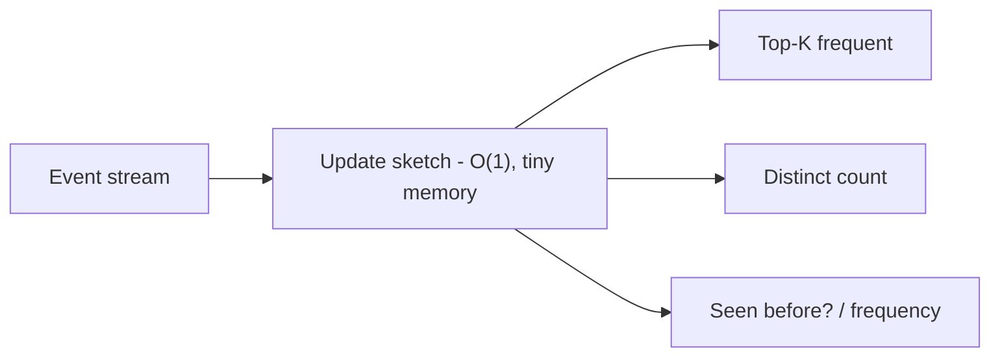
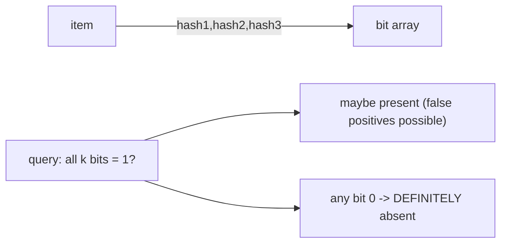
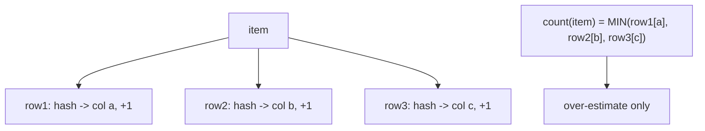
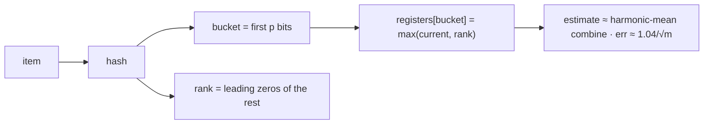
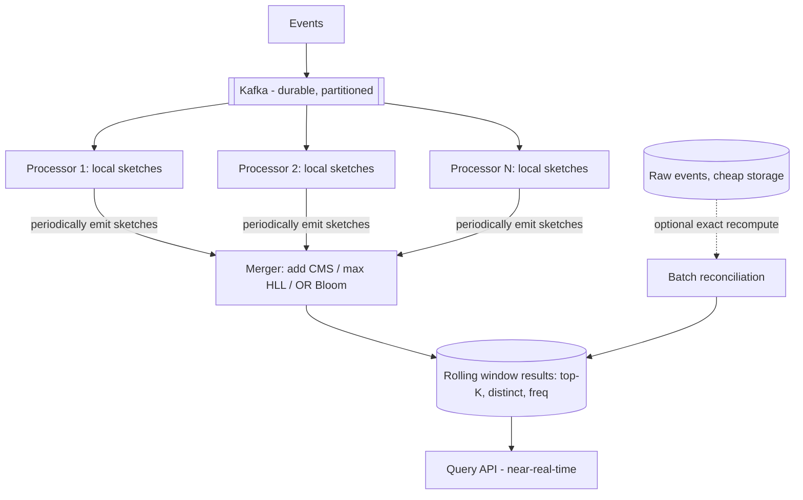
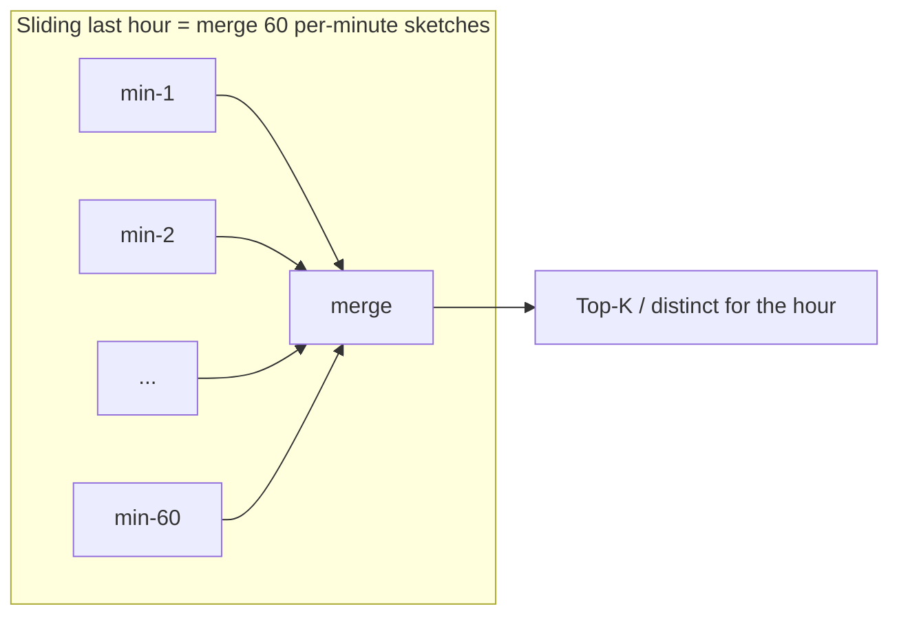

# Trending / Top-K at Scale (Probabilistic Data Structures) — System Design

**Difficulty:** Advanced
**Interview importance:** ⭐ High — "top-K trending" / "count unique visitors" is common, and it teaches **probabilistic data structures** (Count-Min Sketch, HyperLogLog, Bloom filter) that appear nowhere else. **Directly relevant to an analytics/events background.**
**Core new tech:** approximate, **sub-linear-memory**, **mergeable** stream algorithms — trading a little accuracy for enormous memory savings.

---

## 0. Why This Design Matters

At scale you *cannot* keep an exact count for every item. "Top 10 trending hashtags right now" over billions of events, or "unique visitors today" over hundreds of millions — an exact hash map would need memory proportional to the number of distinct items, which is impossible in real time. The insight that separates a senior answer: **you don't need exact — you need approximately right, in tiny fixed memory, and mergeable across machines.** That's what probabilistic data structures give you, and knowing them is a genuine differentiator (Redis ships them as `PFCOUNT`/HyperLogLog and Count-Min-Sketch modules for exactly this).

> Thesis: **trade exactness for sub-linear memory. Count-Min Sketch for approximate frequencies, HyperLogLog for approximate distinct-counts, Bloom filter for approximate membership — all with tiny fixed memory and the crucial property that partial results from many machines *merge*.**

---

## 1. Problem Overview — in Plain English

Build a system that, over a massive high-velocity event stream (clicks, views, searches, tweets), answers in real time:
- **Top-K:** the K most frequent items in a window ("top 10 trending topics in the last hour").
- **Distinct count (cardinality):** how many *unique* items ("unique visitors today").
- **Membership/frequency:** "have we seen this before?" / "roughly how often has X occurred?"

...over so many events that keeping exact per-item state is infeasible.

**Real-world analogy — a stadium turnstile counter.** To count *unique* attendees exactly you'd need to remember every face (huge memory). Instead you use a clever statistical trick: watch a property of each ticket's random barcode (e.g. "the most leading zeros I've seen"), and from that *estimate* the crowd size to within a couple percent — using a scrap of paper, not a database of faces. Probabilistic structures are that trick, formalized.



---

## 2. Functional Requirements

**Core**
- Ingest a high-throughput event stream.
- Answer **top-K** most frequent items over a time window.
- Answer **distinct/unique counts** over a window.
- Answer approximate **frequency** ("count of X") and **membership** ("seen X?").
- Support **time windows** (last hour / day) and **rolling** results in near-real-time.

**Optional / advanced**
- Exact top-K fallback for the true heavy hitters; per-dimension breakdowns (by country/device); configurable accuracy; historical rollups.

---

## 3. Non-Functional Requirements

| Requirement | Target | Why it drives the design |
|---|---|---|
| **Memory** | Sub-linear, fixed (KB–MB, not GB) | Can't store per-item state → probabilistic structures |
| **Throughput** | Millions of events/sec | O(1) per-event updates |
| **Latency** | Near-real-time answers | Streaming, not batch |
| **Accuracy** | Approximate, bounded error (e.g. ±1–2%) | Trade exactness for memory — state the bound |
| **Mergeable** | Combine partial results across shards | Distributed → sketches must merge |
| **Windowing** | Correct time windows, expire old | Trending is time-bounded |

---

## 4. Why Exact Doesn't Scale (the motivation)

Exact approaches and why they fail at scale:
- **Exact frequency (hash map item→count):** memory ∝ number of *distinct items* → billions of distinct URLs/hashtags = impossible in RAM.
- **Exact distinct count (a Set):** same problem — store every unique id.
- **Sort to get top-K:** O(N log N) over the whole stream, and you still stored everything.

At small scale, exact is fine and correct — **say that** (don't over-engineer). Probabilistic structures earn their keep only when the *distinct* cardinality is too large for memory. That framing ("exact until it doesn't fit, then approximate + mergeable") is the senior answer.

---

## 5. The Probabilistic Toolkit

### 5.1 Bloom filter — approximate set membership
A bit array + k hash functions. **Add:** set the k bits the item hashes to. **Query:** if *any* of the k bits is 0 → **definitely not present**; if all 1 → **probably present** (small false-positive rate). **No false negatives.** Can't delete (use a counting Bloom filter for that). Tiny memory for "have I seen this key?" (e.g. dedup, cache-penetration guard).



### 5.2 Count-Min Sketch (CMS) — approximate frequency
A 2D array of counters: **d rows** (each with its own hash function) × **w columns**. **Increment item:** for each row, hash the item to a column and `+1`. **Query count:** hash into each row and take the **minimum** of those d counters. It can **over-count** (hash collisions add to a counter) but **never under-counts** → the min is the tightest estimate. Fixed memory `d×w` regardless of how many distinct items. Error bound is tunable: wider `w` → smaller over-estimate; more rows `d` → higher confidence. **Mergeable:** add two sketches cell-by-cell.



### 5.3 HyperLogLog (HLL) — approximate distinct count (cardinality)
Estimate *how many unique* items with ~**12 KB** for billions of distinct, at ~**2% error**. Intuition: hash each item to a uniform bit string; track the **maximum number of leading zeros** seen. Seeing a hash with *n* leading zeros suggests you've observed roughly 2ⁿ distinct items (rare patterns imply many draws). To reduce variance, split into **m registers** (buckets, chosen by the first few hash bits), keep the max leading-zero count per bucket, then combine with a **harmonic mean**. Standard error ≈ **1.04/√m**. **Mergeable:** union two HLLs by taking the max of each register. (This is Redis's `PFADD`/`PFCOUNT`.)



### 5.4 Top-K — CMS + heap, or Space-Saving
Two standard approaches:
- **CMS + min-heap:** maintain a small heap of the current top-K candidates; for each event, update the CMS, then if the item's estimated count exceeds the heap's minimum, insert/update it in the heap. Approximate but simple and mergeable.
- **Space-Saving (Stream-Summary):** keep a fixed set of K (or a bit more) counters; on a new item not tracked, replace the currently-smallest counter and inherit its count. Deterministic bounded error for heavy hitters — the classic dedicated top-K algorithm.

| Structure | Answers | Memory | Error type | Mergeable |
|---|---|---|---|---|
| **Bloom filter** | Seen X? (membership) | tiny (bits) | false positives, no false negatives | yes (OR) |
| **Count-Min Sketch** | Frequency of X | fixed d×w | over-estimate only | yes (add) |
| **HyperLogLog** | # distinct | ~12 KB | ~±2% | yes (max) |
| **CMS+heap / Space-Saving** | Top-K frequent | small | approximate heavy hitters | yes |

**Mergeability is the killer property** for distributed systems: each machine keeps its own small sketch; a coordinator merges them (add CMS, OR Bloom, max HLL) into a global answer — no need to ship raw events.

---

## 6. Architecture


- **Kafka** buffers and partitions the stream (durability + parallelism).
- **Stream processors** (Flink/Spark Streaming or custom) each maintain **local sketches** per window — O(1) per event, tiny memory.
- A **merger** periodically combines the shards' sketches (they're mergeable!) into global window results.
- Optional **batch reconciliation** recomputes exact numbers from raw events to bound drift (Lambda-style) — or stay pure-streaming (Kappa) and accept the bound. (Same choice as the ad-click aggregation design.)

---

## 7. Time Windows

Trending is time-bounded, so results must **expire**:
- **Tumbling windows** (fixed, non-overlapping — "each hour"): keep one sketch per bucket; drop old buckets.
- **Sliding windows** (last 60 min, updated each minute): keep a series of small sub-window sketches (e.g. per-minute) and **merge the relevant ones** for the query — since sketches merge, a sliding window is "sum the last N minute-sketches." Old sub-windows expire.



---

## 8. Accuracy, Tuning & Correctness Notes
- **State the error bound.** CMS: over-estimate bounded by ε with confidence 1−δ (wider/more rows → tighter). HLL: ~1.04/√m standard error (~2% at 16K registers). Bloom: false-positive rate from bits/hashes. Being able to *quote* these is the differentiator.
- **Hash quality matters** — use a good, uniform hash (e.g. MurmurHash) or the guarantees break.
- **Heavy-hitter accuracy is best** — these structures estimate the *frequent* items well (top-K), while rare items have relatively larger error — which is fine because top-K only cares about the frequent ones.
- **Exact fallback:** for a small set of critical items, keep exact counters alongside the sketch.

---

## 9. Failure & Edge Cases

| Scenario | Handling |
|---|---|
| One item is astronomically frequent | Heavy hitters are exactly what these estimate best; optional exact counter |
| Late / out-of-order events | Assign to window by event time; watermark to close windows (stream processing) |
| Processor crash | Kafka replay + rebuild sketches (or checkpoint sketch state) |
| Need exact numbers for billing | Reconcile from raw events in batch — don't bill on an estimate |
| Accuracy too low | Increase sketch width/registers (memory ↔ accuracy knob) |
| Merging sketches with different sizes/hashes | Enforce identical sketch config across shards (else can't merge) |

---

## ❌ 10. Common Mistakes
- **Proposing an exact hash map / Set at scale** — memory ∝ distinct items → doesn't fit. (But *do* use exact at small scale.)
- **Sorting the whole stream for top-K** — O(N log N) and stores everything.
- **Not knowing the three structures** or mixing them up (CMS = frequency, HLL = distinct count, Bloom = membership).
- **Forgetting mergeability** — the property that makes distributed aggregation possible.
- **Not stating the error bound** — "approximate" without a number is hand-waving.
- **Billing/critical decisions on an estimate** — reconcile exact for those.
- **Ignoring windowing/expiry** — trending must be time-bounded.
- **Bad hash function** — breaks the statistical guarantees.

---

## 11. Trade-offs to Say Out Loud

| Axis | A | B | Choose by |
|---|---|---|---|
| Exactness | Exact (map/set) | Probabilistic sketch | Distinct cardinality vs memory |
| Frequency structure | CMS (over-count) | Space-Saving (top-K) | General freq vs dedicated top-K |
| Architecture | Kappa (stream only) | Lambda (+ batch exact) | Tolerate drift vs need exact reconcile |
| Accuracy | More memory (wider sketch) | Less memory | Error budget |
| Windows | Tumbling (simple) | Sliding (smooth, more state) | UX vs cost |

---

## 12. LLD
```java
interface Sketch<T> { void add(T item); Sketch<T> merge(Sketch<T> other); } // mergeable is core
interface FrequencyEstimator { void add(String item); long estimate(String item); }   // Count-Min
interface CardinalityEstimator { void add(String item); long distinctCount(); }        // HyperLogLog
interface MembershipFilter { void add(String item); boolean mightContain(String item);}// Bloom
interface TopK { void offer(String item); List<Item> topK(int k); }                    // CMS+heap / Space-Saving
interface WindowManager { Sketch current(); Sketch forWindow(TimeRange r); void expire(); }
```
**Patterns:** mergeable-sketch aggregation (per-shard local + coordinator merge), Lambda/Kappa reconciliation, windowing via per-sub-window sketches.

---

## 13. Interview Q&A

**Beginner**
**Q: Why not keep an exact count per item for "top 10 trending"?**
Because memory grows with the number of *distinct* items — billions of hashtags/URLs won't fit in RAM, and sorting the whole stream is O(N log N) over everything you stored. At small scale exact is fine, but at stream scale you switch to probabilistic structures that use tiny fixed memory for an approximate-but-bounded answer.

**Q: Which structure answers "how many unique visitors today"?**
HyperLogLog — it estimates cardinality (distinct count) in about 12 KB for billions of uniques with ~2% error, versus a Set that would store every id. Redis exposes it as PFADD/PFCOUNT.

**Intermediate**
**Q: How does Count-Min Sketch estimate a frequency, and what's the error direction?**
It's a d×w grid of counters with one hash per row. To add an item you increment one counter per row (the column its hash picks); to query, you hash into each row and take the minimum of those counters. Collisions can only *add* to a counter, so it never under-counts — the min is the tightest over-estimate. Memory is fixed d×w regardless of distinct items, and wider rows shrink the error.

**Q: Why does mergeability matter here?**
Because the system is distributed: each processor keeps its own small sketch over its share of the stream, and a coordinator merges them into a global result — add Count-Min sketches cell-by-cell, OR Bloom filters, take the max of HyperLogLog registers. You ship tiny sketches, not billions of raw events. It also makes sliding windows easy: a "last hour" answer is just the merge of the last 60 per-minute sketches.

**Advanced / Staff**
**Q: How do you build real-time top-K trending end to end?**
Events land in Kafka (partitioned, durable). Stream processors each maintain, per time window, a Count-Min Sketch plus a small min-heap of top-K candidates — O(1) per event. Periodically they emit their sketches to a merger that combines them (sketches are mergeable) into the global top-K for the window. Windows are per-minute sub-sketches so a sliding hour is a merge of 60. If exact numbers are ever needed (e.g. billing), I reconcile from raw events in a batch job — Lambda-style — otherwise stay pure-streaming and accept the bounded error. Space-Saving is an alternative to CMS+heap when I want a dedicated bounded-error top-K.

**Q: What accuracy can you promise, and how do you tune it?**
Concrete bounds: HyperLogLog standard error ≈ 1.04/√m (about 2% at ~16K registers, ~12 KB); Count-Min over-estimate shrinks with wider rows and the confidence rises with more rows; Bloom's false-positive rate follows from bits-per-item and hash count. Each is a memory↔accuracy knob — widen the structure to tighten the bound. I'd keep exact counters for a handful of business-critical items and reconcile exact in batch where correctness is non-negotiable.

---

## 🎯 14. 30-Second Answer

> "At stream scale you can't keep exact per-item state — memory grows with distinct items — so you trade exactness for tiny fixed memory using probabilistic structures: Count-Min Sketch for approximate frequencies (increment one counter per hash-row, query the min, over-counts only), HyperLogLog for distinct counts (~12 KB, ~2% error, via leading-zero statistics), and Bloom filters for membership. For top-K, a Count-Min Sketch plus a min-heap, or the Space-Saving algorithm. The killer property is mergeability: each shard keeps a local sketch and a coordinator merges them — add CMS, max HLL, OR Bloom — so a sliding hour is just the merge of per-minute sketches. Events flow through Kafka to stream processors; if exact numbers are needed for billing I reconcile from raw events in batch. And I always state the error bound — approximate with a number, not hand-waving."

---

## 🧠 15. Mental Model

```
CAN'T store exact (memory ∝ distinct items) → APPROXIMATE + tiny fixed memory + MERGEABLE
  BLOOM        → seen X?      (no false negatives; false positives)          merge = OR
  COUNT-MIN    → freq of X    (min of d hash-rows; over-counts only)         merge = add
  HYPERLOGLOG  → # distinct   (leading-zeros stat; ~12KB, err ≈ 1.04/√m)     merge = max-per-register
  TOP-K        → CMS + min-heap, or Space-Saving (bounded heavy hitters)
ARCH: Kafka → per-shard local sketches (O(1)/event) → coordinator MERGES → windowed results
WINDOWS: per-minute sub-sketches → sliding hour = merge last 60
STATE THE ERROR BOUND · exact-reconcile in batch for billing (Lambda) · good hash fn
```

---

## 🔗 16. How This Connects
- **Bloom filters** also appear in `04-url_shortener` (collision checks) and LSM-trees (DDIA) — same structure, membership use.
- **Streaming + windows + watermarks + Lambda/Kappa** = the **ad-click aggregation** (`14`) and **metrics monitoring** (`23`) designs — this adds the *sub-linear-memory* layer under them.
- **Mergeable partial aggregation** is the map-reduce/DDIA dataflow idea, and the scatter-gather-merge shape from the **search engine** (`36`).
- Redis ships HLL (`PFADD`/`PFCOUNT`) — connects to the **distributed cache** (`39`) and leaderboard (`25`).
