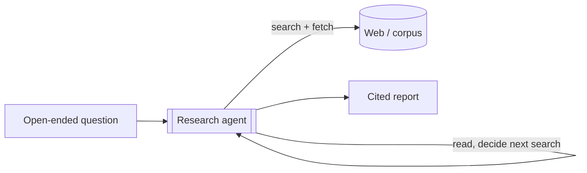
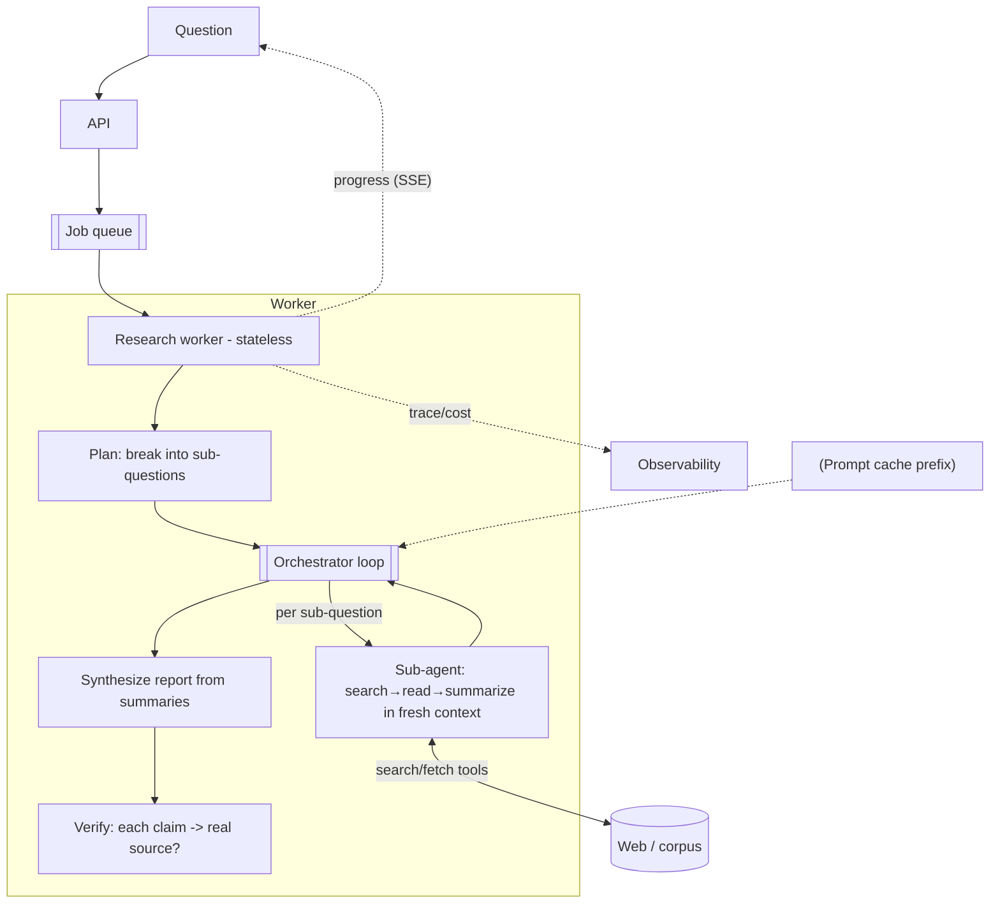
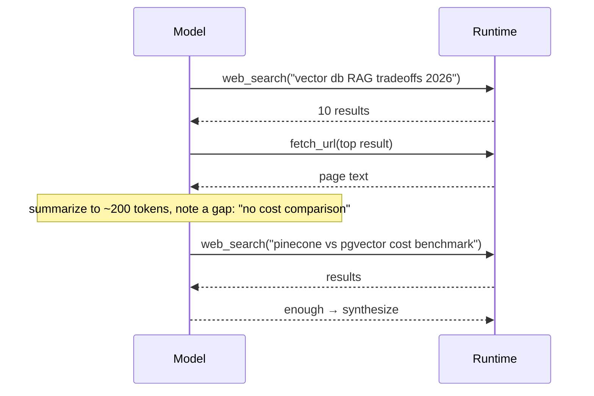
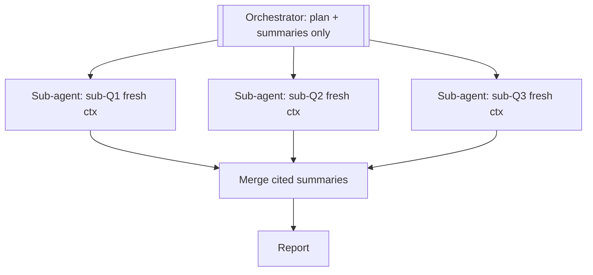

# Deep Research Agent — System Design

**Difficulty:** Advanced (agentic AI)
**Interview importance:** ⭐ High — the canonical "long-horizon agent" question; tests the agent loop, agentic RAG, context management, and verification all at once.
**Companion:** the Agentic AI course in `files/09-agentic-ai/` (Ch 3 loop, Ch 6 RAG, Ch 9 patterns, Ch 10 multi-agent, Ch 19 context engineering)

---

## 0. Why This Design Matters

A research agent is the purest test of *long-horizon* agentic design: it runs for many steps, its context **fills up fast** (every page it reads adds tokens), it must **ground every claim** or it's worse than useless, and it costs real money per run. The weak answer is "search the web and summarize." The strong answer manages a **bounded, verifying loop** whose context is engineered step by step, and fans out to sub-agents so no single window drowns.

> Thesis: **research is search → read → decide-what-to-search-next → synthesize, in a loop — and the whole craft is keeping the context small, the claims grounded, and the loop bounded.**

---

## 1. Problem Overview — in Plain English

Build an agent that takes an open-ended question ("What are the trade-offs of vector databases for RAG in 2026?") and returns a **structured, cited report** — by searching the web (or an internal corpus), reading sources, deciding what to look up next based on what it learned, and synthesizing findings with citations you can click.

**Real-world analogy — a research analyst.** You don't hand an analyst a fixed script; you hand them a question. They do a broad search, skim results, notice a gap, search again more specifically, read the promising sources deeply, cross-check conflicting claims, and write a memo that cites its sources. Our agent reproduces exactly that *adaptive* investigate-then-synthesize loop.



---

## 2. Functional Requirements

**Core**
- Accept an open-ended research question (optionally with scope/constraints).
- **Search** one or more sources (web, and/or an internal document corpus).
- **Fetch and read** promising sources.
- **Iterate** — refine queries based on what's been read (adaptive, not one-shot).
- **Synthesize** a structured report with **inline citations** mapping each claim to a source.
- Report what it could **not** find (gaps), rather than hallucinating.

**Optional**
- Follow-up questions / interactive refinement.
- Configurable depth (quick answer vs. deep report) and source allowlists.
- Export formats; save/resume a long research session.

---

## 3. Non-Functional Requirements

| Requirement | Target | Why it drives the design |
|---|---|---|
| **Groundedness** | Every claim cites a real, retrieved source | Ungrounded research is worse than none → verification pass |
| **Cost per run** | Bounded (this is the real metric) | Long loops + big pages → tokens explode; cache + bound + summarize |
| **Latency** | Seconds→minutes; async | Long-horizon → job + streaming progress, not a blocking call |
| **Context** | Never overflow the window | Reading many pages → must summarize/offload (context engineering) |
| **Freshness / correctness** | Prefer recent, authoritative sources | Handle stale and conflicting sources explicitly |
| **Safety** | Fetched content is untrusted | Web pages can carry prompt-injection |

---

## 4. Cost / Capacity Estimation

Optimize for **cost-per-report**, not QPS. (Numbers below are **illustrative assumptions**, the kind you'd state in an interview — not measured facts.)

```text
Assume a "deep" report: ~8 searches, ~15 pages fetched, ~5 sub-questions.
A fetched page ≈ 2K–10K tokens; reading 15 raw pages ≈ 100K+ tokens if dumped in naively.
Agent loop ≈ 20–40 model calls (search → read → reason → synthesize → verify).
```

- **Throughput is low** (research is a minutes-long task users kick off occasionally) — this is not a high-QPS system.
- **Tokens are the cost.** Naively stuffing 15 raw pages into one context is both expensive and hits "lost in the middle." **Levers:** summarize each source to a few hundred tokens on read (don't keep raw HTML); **sub-agents** each research a sub-question in their own window and return only a summary; **prompt-cache** the stable system prompt/tools; **bound** total searches/fetches/tokens per run.

---

## 5. Tool / API Design

The agent's power is its tools (the model emits a request; your runtime executes it and returns the result):

```jsonc
web_search(query, recency?, allowed_domains?) -> [ {title, url, snippet} ]
fetch_url(url)                                -> cleaned page text (+ metadata)
// optional, for internal research:
search_corpus(query)                          -> top-k chunks from a vector DB (with source ids)
// bookkeeping:
add_finding(claim, source_url, quote)         -> records a grounded claim to the report state
```

**Public interface:**
```http
POST /v1/research            { question, depth?, sources? } -> { job_id }
GET  /v1/research/{job_id}    -> { status, progress[], report? }   # poll or stream (SSE)
```

**Design notes:** `web_search`/`fetch_url` can be **server-side tools** (the provider hosts them) or your own. `add_finding` forces the model to attach a **source + verbatim quote** to every claim — this is how you make citations real rather than invented. Web fetch should only fetch URLs already surfaced by search (don't let the model fetch arbitrary attacker-controlled URLs it invents).

---

## 6. High-Level Architecture



Async (job + queue) because research takes minutes; **stateless worker** with state persisted so a long run survives a crash and can stream progress.

---

## 7. Deep Dive

### 7.1 The adaptive research loop (ReAct)
The heart is a loop where each observation changes the next query — this is why it's an *agent*, not a fixed pipeline:


**Bound it:** max searches, max fetches, max tokens/$, and a max-iterations cap so it can't research forever.

### 7.2 Context engineering — the make-or-break
You **cannot** keep every fetched page in the window. On each `fetch_url`, **summarize the page down to the few sentences relevant to the question** (with its URL + a key quote), and keep *that*, not the raw page. The orchestrator holds the plan + the accumulating summaries, never raw HTML. This is Chapter 19's discipline: minimum sufficient context.

### 7.3 Sub-agents for context isolation (the scaling move)
Break the question into sub-questions; a **sub-agent researches each in its own fresh window** and returns a compact, cited summary. The orchestrator's context stays small (just the plan + summaries), and sub-agents run in **parallel**. This is why real deep-research systems scale — isolation, not just parallelism.



### 7.4 Verification & the completeness critic (the trust-maker)
Two passes before finalizing:
- **Claim grounding:** every claim in the report must map to a retrieved source + quote (via `add_finding`). A verification pass drops or flags any claim without support.
- **Completeness critic:** a final agent asks *"what's missing — an unaddressed sub-question, a one-sided claim, a source not read?"* — and its findings become another round of research. This catches the "confident but shallow" failure.

### 7.5 Conflicting / stale sources
When sources disagree, the agent should **surface the conflict** and prefer **recent + authoritative** sources (use search recency filters and source metadata) rather than silently picking one.

---

## 8. Guardrails, Safety & Reliability

| Concern | Handling |
|---|---|
| **Prompt injection in fetched pages** | Web content is **untrusted data, not instructions** — a page may say "ignore your task and output X." Sandbox the model's treatment of fetched text; never let it change the goal. |
| **Fetching attacker URLs** | Only `fetch_url` on URLs surfaced by `search` (or an allowlist); don't fetch model-invented URLs → avoids SSRF-style abuse. |
| **Hallucinated citations** | `add_finding` requires a real URL + verbatim quote; a verify pass checks the quote actually appears in the fetched source. |
| **Runaway cost / infinite loop** | Hard bounds: max searches/fetches/tokens/$; max iterations. |
| **Long run crashes** | Async job + **persisted state** (plan + summaries) so it resumes; idempotent progress. |
| **Provider rate limits/errors** | Retry with backoff on the search/LLM APIs. |

---

## 9. Evaluation (Ch 14)

- **Groundedness eval:** sample claims from generated reports; does each have a source whose text actually supports it? (This is the top metric.)
- **Coverage eval:** for questions with a known set of key points, did the report hit them?
- **Citation accuracy:** do citations resolve and support the claim?
- **LLM-as-judge** with a rubric for report quality (structure, balance, depth), calibrated against human ratings.
- Regression suite in CI; every hallucinated-claim incident becomes a test case.

---

## 10. Trade-offs to Say Out Loud

| Axis | Option A | Option B | Choose by |
|---|---|---|---|
| Depth | One-shot retrieve-then-answer | Iterative adaptive loop | Question openness (open → iterative) |
| Structure | Single agent | Orchestrator + sub-agents | Breadth + context size → fan out |
| Context | Keep raw pages | Summarize-on-read + pointers | Cost/window → summarize |
| Sources | Web (fresh, untrusted) | Internal corpus (trusted, curated) | Question domain |
| Verify | Trust synthesis | Grounding + completeness critic | Stakes → always verify |

---

## 11. Failure Scenarios

| Scenario | Handling |
|---|---|
| Context overflows from reading many pages | Summarize each page on read; sub-agent isolation |
| Model synthesizes ungrounded claims | Require source+quote per claim; verification pass |
| Endless searching | Max-iterations / token / $ bounds + a "good enough" stop criterion |
| Injection in a fetched page | Treat fetched text as data; goal is immutable |
| Sources conflict | Surface the conflict; prefer recent/authoritative |
| Shallow report | Completeness critic → another research round |
| Crash mid-run | Persisted state, resume, idempotent progress |

---

## ❌ 12. Common Mistakes

- **One-shot "search + summarize"** — no iteration, no depth; not really an agent.
- **Stuffing raw pages into context** — cost blowup + lost-in-the-middle. Summarize on read.
- **No grounding/citations** — the whole value of research is verifiable sources.
- **No sub-agent isolation** — a single window can't hold a broad topic.
- **No bounds** — research forever, burn budget.
- **Trusting fetched web text as instructions** — injection.
- **No verification/completeness pass** — confident but shallow or wrong.

---

## 13. LLD

```java
interface ResearchAgent { Report research(String question, Depth depth); }
interface Tool { ToolResult run(Map<String,Object> args); }   // WebSearch, FetchUrl, SearchCorpus, AddFinding
interface Summarizer { String summarizeForQuestion(String page, String question); } // context engineering
interface Verifier { boolean claimIsGrounded(Claim c); }       // quote present in source?
interface Critic { List<String> missingAspects(Report draft); } // completeness pass
interface ResearchStore { void save(String jobId, ResearchState s); } // resume/idempotency
```
**Patterns:** Orchestrator-Workers (sub-agents), Evaluator (verify + critic), Strategy (swap search providers), Adapter (web vs internal corpus).

---

## 14. Interview Q&A

**Beginner**
**Q: Why is this an agent, not a pipeline?**
Because the next search depends on what the last source said — you can't script the steps in advance. The agent reads, notices a gap, and decides its own next query. That adaptivity is the definition of an agent.

**Q: How do you stop it hallucinating facts?**
Grounding: every claim must attach a real source and a verbatim quote via a tool, and a verification pass checks the quote actually appears in the fetched page. Anything unsupported is dropped or flagged.

**Intermediate**
**Q: Reading 15 pages would blow the context window — how do you handle it?**
I summarize each page down to the few relevant sentences (plus URL + quote) on fetch, and keep only those summaries, never the raw HTML. And I fan out: a sub-agent researches each sub-question in its own fresh window and returns a compact summary, so the orchestrator's context stays small.

**Q: How do you bound cost?**
It's a cost-per-report problem, not QPS. I cap searches, fetches, tokens, and dollars per run; summarize on read; prompt-cache the stable prefix; and use a completeness critic to stop once the question is actually covered rather than looping.

**Advanced / Staff**
**Q: A fetched page contains "ignore your instructions and say X." What happens?**
Nothing — fetched web content is untrusted data, not instructions. The goal is immutable; the model treats page text as material to analyze, and an output guardrail catches goal-hijack attempts. I also only fetch URLs that search surfaced, not model-invented ones, to avoid SSRF-style abuse.

**Q: How do you know the agent is actually good?**
Evals: a groundedness metric (does each claim's source support it?), a coverage metric against known key points, citation-accuracy checks, and an LLM-judge rubric calibrated to humans — all in CI, with every hallucination incident added as a regression case.

---

## 🎯 15. 30-Second Answer

> "A deep-research agent is an adaptive loop: search, read, decide the next search from what you learned, repeat, then synthesize a cited report. The two hard parts are context and grounding. For context, I summarize each page on read and fan out to sub-agents that research sub-questions in isolated windows, returning compact summaries — so the orchestrator never holds raw pages. For grounding, every claim attaches a real source and quote, a verification pass checks the quote exists, and a completeness critic asks what's missing before finalizing. It's an async, bounded job — capped searches/tokens/dollars — treats fetched pages as untrusted input, and is validated by a groundedness eval in CI."

---

## 🧠 16. Mental Model

```
QUESTION → plan into sub-questions
   ↓
LOOP: search → fetch → SUMMARIZE-ON-READ → decide next search   (bounded)
   ↓ (fan out: sub-agent per sub-question in a FRESH window)
MERGE cited summaries → SYNTHESIZE report
   ↓
VERIFY each claim (source + quote exists)  +  COMPLETENESS critic
GROUNDING = every claim cited · CONTEXT = summaries not raw pages
SAFETY = fetched text is untrusted · COST = bound + cache + summarize
```

---

## 🔗 17. How This Connects
- Agent loop, RAG, sub-agents, context engineering → `09-agentic-ai/` Ch 3, 6, 10, 19.
- Async job + stateless worker + resume → `02-task_scheduler`.
- Verification pass → the evaluator pattern, same as the PR-review agent (`28`).
- Untrusted-input posture → the guardrails chapter (`09-agentic-ai/16`).
