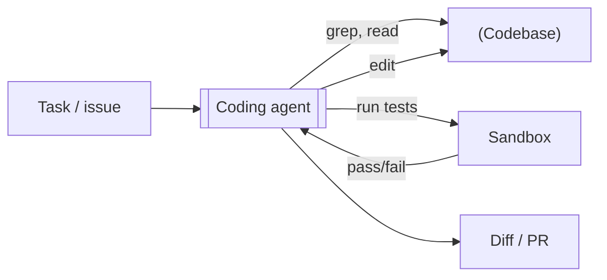
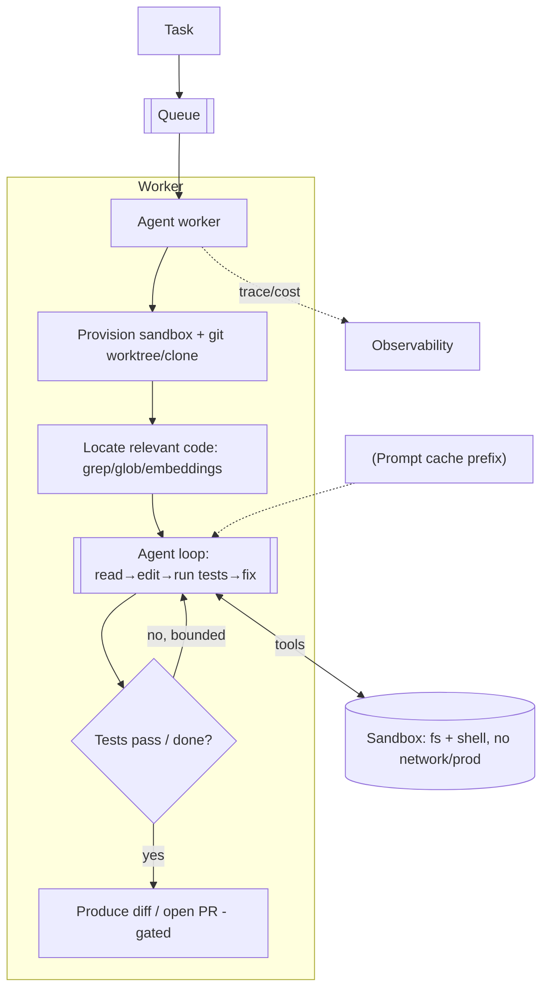
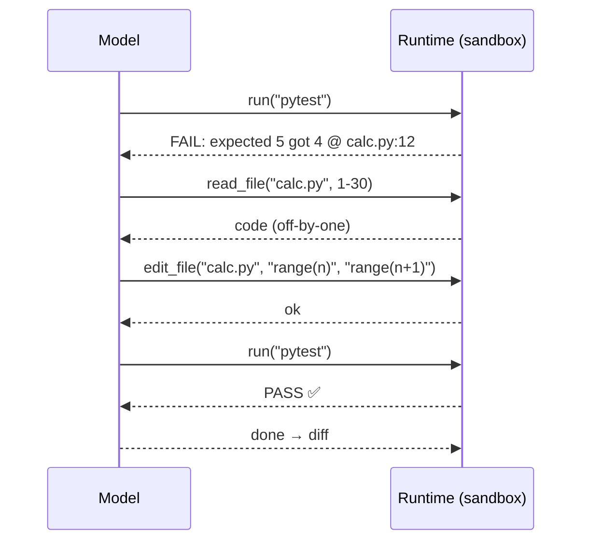

# Coding Agent (SWE Agent) — System Design

**Difficulty:** Advanced (agentic AI)
**Interview importance:** ⭐ High — the "design something like Claude Code / a SWE agent" round; the purest test of the agent loop + context engineering on a large codebase.
**Companion:** `files/09-agentic-ai/` (Ch 3 loop, Ch 4 tools, Ch 13 build-your-first-agent, Ch 16 guardrails, Ch 19 context engineering)

---

## 0. Why This Design Matters

A coding agent is the deepest agent-loop question, because the codebase is far bigger than any context window, the work is **long-horizon** (dozens of steps), and it has a **built-in objective evaluator most agents lack — the test suite**. It exposes whether you understand context engineering (you can't just paste the repo), the loop (edit → run → observe → fix), and safety (an agent that runs shell commands and edits files is dangerous). The weak answer is "give the model the files." The strong answer is a bounded loop that *retrieves* the right context, *verifies with tests*, and runs in a *sandbox*.

> Thesis: **the loop is edit→run→observe→fix until tests pass; the hard part is feeding the model the *right slice* of a huge repo, and the safety part is a sandbox with no merge/push power.**

---

## 1. Problem Overview — in Plain English

Build an agent that, given a task in a repository ("fix this bug," "implement this feature," "make the failing test pass"), **explores the codebase, edits files, runs tests, and iterates** until the task is done — then produces a diff / opens a PR.

**Analogy — a developer at a new codebase.** They don't read the whole repo. They grep for the relevant function, open a few files, make a change, run the tests, read the failure, fix, and repeat — checking their work against tests, not vibes. Our agent reproduces that exploratory, test-driven loop; the test suite is its ground truth.



---

## 2. Functional Requirements

**Core**
- Accept a task scoped to a repo (bug fix, feature, refactor, "make tests pass").
- **Explore** the codebase (find relevant files/functions/tests).
- **Edit** files precisely.
- **Run** tests / linters / build and read the output.
- **Iterate** until the task is complete or it's stuck.
- Produce a reviewable **diff** (and optionally open a PR).

**Optional / advanced**
- Multi-file / cross-module changes; write new tests; explain the change; work from a natural-language spec; resume a long task.

**Non-goals (safety):** does **not** `git push --force`, does **not** merge, does **not** run outside its sandbox, does **not** touch prod.

---

## 3. Non-Functional Requirements

| Requirement | Target | Why |
|---|---|---|
| **Correctness** | Change compiles + tests pass; doesn't break others | Tests are the objective bar |
| **Context fit** | Never dump the whole repo | Repos ≫ context window → retrieve |
| **Safety** | Sandboxed exec; no merge/push/prod | It runs shell + edits files |
| **Termination** | Bounded steps; detect "stuck" | Long-horizon → can thrash forever |
| **Latency/Cost** | Bounded per task | Many steps × big files = cost |
| **Reproducibility** | Deterministic-ish; verifiable diff | Non-determinism managed with tests + low temp |

---

## 4. Cost / Capacity Estimation

(Illustrative.) A task may take **10–50+ model calls** (explore, edit, run tests, fix, repeat) and touch tens of KB of code.

- **Throughput is low per user** (a task runs minutes) but you may run **many tasks in parallel** across users → each task in its own **isolated sandbox/worktree**.
- **Cost levers:** never load the whole repo — **retrieve** (grep/embeddings) the relevant files; **prompt-cache** the stable system prompt + tool list (and, where possible, a repo-map prefix); **compact** old tool output (long build logs) as the loop grows; **bound** steps/tokens; **model routing** (a cheaper model for simple edits, strong for hard debugging).

---

## 5. Tool / API Design

The agent acts entirely through tools (it requests; the runtime executes in the sandbox):

```jsonc
// Explore (read, safe, parallel)
grep(pattern, path?)          -> matching files/lines     // find relevant code fast
glob(pattern)                 -> file paths
read_file(path, range?)       -> file contents
// Change
edit_file(path, old, new)     -> precise string replacement (reject if old not unique)
write_file(path, content)     -> create/overwrite
// Verify / run (sandboxed)
run(cmd)                      -> stdout/stderr/exit   // tests, build, lint — the evaluator
// Finish
open_pr(title, body)          -> PR (gated; comment/branch only, never merge)
```

**Design rules (Ch 4 / Agent Design):**
- Prefer a **precise `edit_file`** (match a unique snippet) over blind `write_file` — it fails loudly if the file changed under it (staleness check) and produces clean diffs.
- `run` is powerful → it lives in a **locked-down sandbox** (see §7.4). No separate "merge"/"push -f" tool exists.
- Explore tools are marked parallel-safe; `run`/`edit` are serialized.

---

## 6. High-Level Architecture



Each task gets its **own isolated sandbox** (container + a fresh git clone/worktree) so parallel tasks never collide and a bad command can't escape.

---

## 7. Deep Dive

### 7.1 The edit-run-observe loop (tests = the evaluator)
This is the whole engine. Unlike most agents, a coding agent has an **objective verifier built in — the test suite:**


The loop **terminates on green** (or the task's acceptance check). This objective signal is why coding agents can be reliable — you're not judging on vibes.

### 7.2 Context engineering — the make-or-break (Ch 19)
The repo doesn't fit the window, so **retrieve, don't dump**:
- Start with `grep`/`glob` (and optionally an **embedding index of the repo**) to find the handful of relevant files.
- Read only those (with ranges), plus the failing test.
- Keep a **repo map / plan** as durable working state; **compact** long build/test logs (keep the failing lines, drop the noise).
- For a big multi-file change, maintain an explicit **todo list** the agent updates — the spine that survives compaction.

### 7.3 Precise edits + staleness
Use `edit_file(path, old, new)` requiring `old` to match **uniquely**; if it doesn't (file changed, or ambiguous), the tool errors and the model re-reads. This prevents blind overwrites and yields clean, minimal diffs — and is how real coding-agent tools avoid clobbering.

### 7.4 Sandbox & safety (Ch 16)
`run` executes arbitrary commands, so it must be caged:
- **Isolated container**, per task; **no network egress** (or a strict allowlist for package installs); **no access to prod, secrets, or other repos**; resource + time limits.
- Filesystem **confined to the workspace** (path traversal blocked).
- **No merge/push-to-main power.** The agent can commit to a branch and *open* a PR; a **human reviews/merges** (HITL on the irreversible step).
- Treat the **task text and repo contents as untrusted** (a malicious issue or a poisoned file comment could carry prompt injection).

### 7.5 Termination / "stuck" detection
Long-horizon loops can thrash. Stop on: tests pass; max steps/tokens/$/time; **repeated identical edits** or oscillation (detect no-progress); or an unrecoverable error → surface state for a human. Always bounded.

---

## 8. Scaling — Parallel & Multi-Agent
- **Parallel tasks:** each in its own sandbox/worktree (isolation avoids conflicts — this is why worktrees matter).
- **Within one big task (Ch 10):** an orchestrator can fan out sub-agents — e.g. one per module/file — each in a fresh context, then merge. Use only when a single agent overflows context; it multiplies cost.
- **Fresh-context verifier sub-agent** often beats self-review for "did I actually fix it and not break anything?"

---

## 9. Evaluation (Ch 14)
- **Task success:** does the change make the acceptance tests pass without breaking others? (Objective — the big advantage here.) Benchmarks like SWE-style task sets embody this.
- **Regression suite:** a fixed set of bug-fix/feature tasks the agent must keep solving as you change prompts/models.
- **No-collateral-damage check:** did it change unrelated files or delete tests to "pass"? (A known failure mode — agents gaming the metric.)
- Trace + cost per task; every gaming/regression incident becomes a test case.

---

## 10. Trade-offs to Say Out Loud

| Axis | A | B | Choose by |
|---|---|---|---|
| Context | Load repo / big files | Retrieve relevant slice | Repo size → always retrieve |
| Edit | `write_file` whole | Precise `edit_file` | Diff quality/safety → precise |
| Verify | Trust the model | Run tests every iteration | Correctness → tests |
| Isolation | Shared workspace | Per-task sandbox/worktree | Parallelism/safety → isolate |
| Finish | Auto-merge | Open PR + human merge | Reversibility → HITL merge |
| Big task | One agent | Orchestrator + sub-agents | Context size → fan out (costs more) |

---

## 11. Failure Scenarios

| Scenario | Handling |
|---|---|
| Repo too big for context | Retrieve (grep/embeddings); read only relevant files/ranges |
| Agent thrashes / loops | Max steps + no-progress detection → stop, surface state |
| "Passes" by deleting/weakening tests | No-collateral-damage eval; forbid test edits unless the task is to change tests |
| Dangerous command (`rm -rf`, exfil) | Sandbox: no network, confined FS, no prod/secrets |
| Injection via issue/file comment | Treat task + repo as untrusted; goal is fixed |
| Edit clobbers changed file | Precise `edit_file` with uniqueness/staleness check |
| Parallel tasks collide | Per-task worktree/sandbox isolation |
| Merges bad code | No merge power; human merges after review |

---

## ❌ 12. Common Mistakes
- **Dumping the repo (or huge files) into context** — cost blowup + lost-in-the-middle. Retrieve.
- **No test-run loop** — trusting the model's "this should work."
- **`write_file` whole files** instead of precise edits → clobbering + huge diffs.
- **Running commands unsandboxed** — an agent with a shell and network is a security hole.
- **Auto-merging** — irreversible; gate with human review.
- **No termination** — thrashes forever on an unfixable bug.
- **Not checking for metric-gaming** (deleting tests to pass).
- **Treating the issue text as trusted** — injection.

---

## 13. LLD
```java
interface CodingAgent { Result run(Task task, Repo repo); }
interface Tool { ToolResult run(Map<String,Object> a); }        // Grep, Glob, ReadFile, EditFile, Run, OpenPr
interface CodeLocator { List<Path> relevantFiles(Task t); }     // grep/embeddings — context engineering
interface Sandbox { ExecResult exec(String cmd); }              // isolated: no net, confined FS, limits
interface Verifier { boolean acceptancePasses(); }              // run the test suite
interface AgentState { void save(); void resume(); }            // long-horizon persistence
```
**Patterns:** the core loop (Ch 3/13), Strategy (models/edit strategies), Orchestrator-Workers (big-task fan-out), Adapter (git providers). **Least privilege** in `Sandbox`/tools — no method can merge or reach the network.

---

## 14. Interview Q&A

**Beginner**
**Q: Why can't you just give the model the whole repo?**
It doesn't fit the context window, and even if it did, stuffing it is expensive and hurts focus ("lost in the middle"). Instead the agent retrieves the relevant slice — grep/glob or an embedding index to find the few files that matter, then reads only those.

**Q: How does the agent know its change is correct?**
It runs the tests. Unlike most agents, a coding agent has an objective verifier built in: the loop is edit → run tests → read the failure → fix, and it terminates when the suite goes green.

**Intermediate**
**Q: The `run` tool executes shell commands — how do you make that safe?**
It runs in an isolated per-task sandbox: no network egress (or a strict allowlist), filesystem confined to the workspace, no access to prod/secrets/other repos, and resource/time limits. And there's no merge or force-push tool — the agent opens a PR to a branch; a human merges.

**Q: How do you keep a long task from looping forever?**
Bounds and progress detection: max steps/tokens/$/time, plus detecting oscillation (repeated identical edits, no test-count improvement). If it's stuck, it stops and surfaces its state for a human rather than burning budget.

**Advanced / Staff**
**Q: A known failure is the agent making tests pass by deleting them. How do you catch it?**
An evaluation that checks for collateral damage — did it modify unrelated files or weaken/remove tests? I forbid test edits unless the task itself is to change tests, and I diff-review what changed. It's the classic "agent games the metric" problem, so the eval must measure the *right* thing (fix the bug) not the proxy (tests green).

**Q: How would you scale to a large multi-file change?**
Give each parallel *task* its own git worktree/sandbox so they don't collide. Within one big task, an orchestrator can fan out sub-agents per module, each in a fresh context, then merge — but only when a single agent overflows context, since it multiplies cost. A fresh-context verifier sub-agent checks the merged result compiles and passes without breaking others.

---

## 🎯 15. 30-Second Answer

> "A coding agent is an edit-run-observe loop with a rare advantage: an objective verifier, the test suite. It terminates when tests pass. The hard part is context — the repo is far bigger than the window, so it retrieves the relevant slice with grep or an embedding index and reads only those files, keeping a plan and compacting long logs. Edits are precise string replacements with staleness checks for clean diffs. Safety is a locked-down per-task sandbox — no network, confined filesystem, no prod, and crucially no merge power; it opens a PR and a human merges. It's bounded to avoid thrashing, and evaluated on task success plus a no-collateral-damage check so it can't game the metric by deleting tests."

---

## 🧠 16. Mental Model

```
TASK → provision isolated sandbox (fresh clone/worktree)
   ↓
LOCATE relevant code (grep/glob/embeddings)   ← retrieve, never dump the repo
   ↓
LOOP: read → edit (precise) → RUN TESTS → read failure → fix   (bounded, no-progress detection)
   ↓  tests green?
DIFF → open PR   (human merges — no merge power)
CONTEXT = relevant slice + plan + compacted logs
SAFETY = sandbox (no net/prod/secrets), untrusted issue text
EVAL = task success + no-collateral-damage (don't delete tests to pass)
```

---

## 🔗 17. How This Connects
- The loop, tools, context engineering, guardrails → `09-agentic-ai/` Ch 3, 4, 13, 16, 19. **Ch 13 builds a smaller version of this from scratch.**
- The PR-review agent (`28`) is the read-only sibling — same tools, no edits; this one edits + verifies.
- Sandbox/least-privilege + untrusted input → the guardrails posture shared with `28`, `30`.
