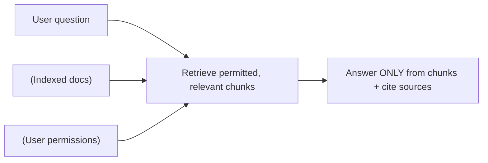
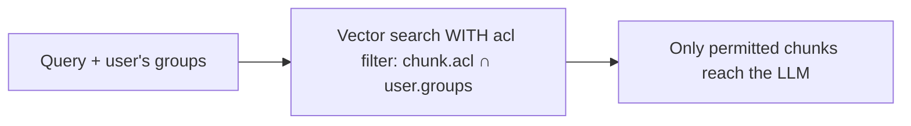

# RAG Q&A over Enterprise Docs ("Chat with your Knowledge") — System Design

**Difficulty:** Advanced (agentic AI)
**Interview importance:** ⭐ **Critical** — the most-built enterprise LLM system; tests retrieval *quality*, freshness, **access control**, and grounded citation. "Just use a vector DB" is the answer that fails.
**Companion:** `files/Agentic-AI/` (Ch 6 RAG — the core, Ch 2 context, Ch 16 guardrails)

---

## 0. Why This Design Matters

RAG-over-docs looks simple ("embed docs, search, answer") but the *quality and safety* details are where it's won or lost: retrieval that misses the right passage, chunking that cuts ideas in half, a **stale index**, **hallucinated citations**, and — the one candidates forget — **access control** (returning a doc the user isn't allowed to see is a data leak). This question tests whether you understand RAG as an *information-retrieval + security* problem, not a one-liner.

> Thesis: **retrieval quality + freshness + per-user access control + grounded citations. The LLM is the easy part; getting the right, permitted chunks into the prompt is the hard part.**

---

## 1. Problem Overview — in Plain English

Build a system where employees ask questions in natural language and get answers grounded in the company's internal knowledge — wikis, PDFs, Google Docs, Slack, tickets, code docs — **with citations**, and **only from documents the asking user is allowed to see**.

**Analogy — a librarian with a security clearance.** You ask a question; they find the exact relevant passages across the whole library, but they only hand you documents your clearance permits, and they tell you which book each fact came from so you can verify. Our system is that librarian: retrieval finds the passages, access control enforces clearance, citations enable verification.



---

## 2. Functional Requirements

**Core**
- Ingest heterogeneous docs (wiki, PDF, Docs, Slack, tickets…) and keep them **fresh**.
- Answer NL questions **grounded** in retrieved content, with **citations**.
- Enforce **per-user access control** — never surface a doc the user can't see.
- Say **"I don't know"** when the answer isn't in the corpus (no guessing).
- Support **follow-up / conversational** questions.

**Optional / advanced**
- Multi-modal (tables, images); multi-language; feedback (thumbs) to improve retrieval; "show sources" UI; agentic multi-hop retrieval.

**Non-goals:** it is **not** a search of the public web (that's a different tool); it does **not** answer from the model's training memory.

---

## 3. Non-Functional Requirements

| Requirement | Target | Why |
|---|---|---|
| **Retrieval quality** | High recall of the *right* passages | The bottleneck — a great LLM can't answer from bad retrieval |
| **Access control** | User only ever retrieves permitted docs | Leaking a restricted doc is a serious breach |
| **Freshness** | New/edited docs answerable within minutes–hours | Stale answers erode trust |
| **Groundedness** | Answers cite real retrieved chunks; "don't know" otherwise | Hallucination = wrong internal decisions |
| **Latency** | Interactive (1–3 s); stream | It's a chat |
| **Cost** | Bounded per query | Embedding + LLM + storage |

---

## 4. Cost / Capacity Estimation

(Illustrative.) Two pipelines: **ingestion (offline, bulk)** and **query (online, per request)**.

- **Ingestion:** N documents → chunks → embeddings. E.g. 1M docs × ~10 chunks = **10M vectors**; at ~1–3 KB/vector that's tens of GB in the vector store — modest. Cost is the one-time (+ incremental) **embedding** of changed docs.
- **Query:** embed the question (cheap) + a vector search + rerank + **one LLM call** with the top-k chunks. Dominated by the LLM call on the retrieved context (a few K tokens) → **cheap and cacheable**.
- **Levers:** incremental re-indexing (only changed docs), **prompt-cache** the stable system prompt, retrieve *few but relevant* chunks (rerank), cache answers to common questions.

---

## 5. The Two Pipelines (this is the design)

RAG-over-docs is fundamentally **an offline ingestion pipeline + an online query pipeline.** State both explicitly.

```mermaid
flowchart TD
    subgraph Ingestion (offline, incremental)
      D["Docs: wiki/PDF/Slack/..."] --> Load["Connectors + change detection"]
      Load --> Chunk["Chunk on structure + overlap"]
      Chunk --> Embed[Embed each chunk]
      Embed --> Store[("Vector DB + metadata: source, date, ACL")]
    end
    subgraph Query (online, per request)
      Q["Question + user"] --> EQ[Embed query]
      EQ --> Search["Vector search + KEYWORD (hybrid)"]
      Store --> Search
      Search --> ACLf[Filter by user's ACL]
      ACLf --> Rerank[Rerank top candidates]
      Rerank --> Gen["LLM answers ONLY from chunks + cite"]
      Gen --> Ans["Answer + citations"]
    end
```

---

## 6. Deep Dive

### 6.1 Chunking (Ch 6 — the underrated decision)
Don't embed whole docs — split into passages. Trade-off: too small loses context, too large blurs retrieval and wastes tokens. **Split on structure** (headings/paragraphs), use **overlap** so ideas straddling a boundary aren't lost, and store **metadata per chunk** (source URL, section, last-modified, and the **ACL** — who may see it). Metadata powers citations, freshness filters, and access control.

### 6.2 Retrieval quality — beyond "use a vector DB"
The single biggest quality lever. Techniques, in order of impact:
- **Hybrid search:** combine **semantic** (embeddings) with **keyword/BM25** — pure vectors miss exact names, IDs, error codes; keyword catches those.
- **Reranking:** retrieve a broad top-N, then re-score with a more precise **cross-encoder reranker** and keep the best few — big precision gain.
- **Query rewriting:** expand/clarify the question (and resolve follow-ups: "what about last year?" → rewrite with the prior context) before retrieving.
- **Right k:** few *relevant* chunks beat many noisy ones (cost + "lost in the middle").

### 6.3 Access control — the one people forget (critical)
A user must **only retrieve documents they're permitted to see.** Enforce at **retrieval time** by filtering on the ACL metadata stored with each chunk (a metadata filter in the vector search scoped to the user's groups/permissions). **Do not** retrieve broadly and filter in the prompt — that leaks restricted content into the model and risks exposure. Keep ACLs **in sync** as source permissions change (re-index on permission change, or check live at query time).



### 6.4 Grounding & citations (Ch 6)
System prompt: *"Answer only from the provided context; cite the source doc for each claim; if the answer isn't in the context, say you don't know."* Return **citations that map to the retrieved chunk's source** (not model-invented). This makes answers verifiable and is the antidote to hallucination.

### 6.5 Freshness
Docs change constantly. **Incremental ingestion:** connectors detect new/edited/deleted docs (webhooks or polling) and re-chunk/re-embed just those; deletions remove vectors. Store `last_modified`; prefer recent versions; expire stale ones.

### 6.6 Agentic (multi-hop) RAG — when one retrieval isn't enough
For complex questions, make retrieval a **tool the agent calls repeatedly**: it retrieves, sees it needs more, rewrites the query, retrieves again — the loop from Ch 3 applied to retrieval. Use when questions require combining multiple documents; a single retrieve-then-answer suffices for most.

---

## 7. Guardrails & Safety
- **Access control** (above) is the headline safety property.
- **Grounding** prevents fabricated internal facts; **"I don't know"** beats a confident wrong answer.
- **Prompt injection via documents:** a malicious doc could contain "ignore your instructions…" — treat retrieved content as **data, not instructions**; an output guardrail catches hijack attempts.
- **PII / sensitivity:** respect classification; optionally redact; log access for audit.

---

## 8. Reliability & Production
- **Ingestion as a durable pipeline** (queue + workers); idempotent per-doc so re-processing is safe; dead-letter for failed docs.
- **Query path stateless** behind a load balancer; conversation state in a store.
- **Vector DB** replicated/sharded for scale (this is a datastore — apply normal replication/partitioning).
- **Caching:** embeddings cache, and answer cache for common questions (respect ACLs in the cache key!).
- **Observability:** log question → retrieved chunks → answer; track retrieval hit quality and "I don't know" rate.

---

## 9. Evaluation (Ch 14) — evaluate retrieval AND generation separately
- **Retrieval eval:** for labeled (question → relevant docs), measure **recall@k / precision@k** — is the right passage even retrieved? (If not, the LLM can't succeed.)
- **Groundedness/faithfulness:** does the answer's every claim follow from the retrieved chunks? (LLM-as-judge.)
- **Answer correctness:** vs. gold answers.
- **Access-control eval:** users must never retrieve unpermitted docs — a hard safety gate.
- **"I don't know" calibration:** does it abstain when the corpus lacks the answer?
- Regression suite in CI; every bad/leaky answer → a new case.

---

## 10. Trade-offs to Say Out Loud

| Axis | A | B | Choose by |
|---|---|---|---|
| Retrieval | Pure vector | Hybrid + rerank | Quality → hybrid+rerank |
| Chunking | Fixed size | Structure-aware + overlap | Quality → structure-aware |
| Access control | Filter in prompt | Filter at retrieval (ACL metadata) | Security → at retrieval |
| Freshness | Rebuild index | Incremental re-index | Scale → incremental |
| Retrieval flow | One-shot | Agentic multi-hop | Question complexity |
| Knowledge method | RAG | Fine-tuning / long context | Changing/large corpus → RAG |

---

## 11. Failure Scenarios

| Scenario | Handling |
|---|---|
| Right passage not retrieved | Hybrid search + rerank + query rewrite; better chunking |
| User sees a doc they shouldn't | ACL filter **at retrieval**; sync perms; access-control eval |
| Stale answer from old doc | Incremental re-index on change; date filters/prefer recent |
| Hallucinated citation/fact | Ground strictly; citations map to retrieved chunks; "I don't know" |
| Injection inside a document | Retrieved text = data, not instructions; output guardrail |
| Follow-up loses context | Query rewriting with conversation history |
| Ingestion fails on some docs | Idempotent pipeline + dead-letter; alert |

---

## ❌ 12. Common Mistakes
- **"Just embed and search"** — ignores rerank, hybrid, chunking, freshness, ACLs. The LLM is the *easy* part.
- **No access control** (or filtering in the prompt) → data leak. The #1 real-world RAG failure.
- **Naive fixed-size chunking** that splits ideas; no overlap.
- **Retrieving too many chunks** → noise + cost + lost-in-the-middle.
- **No citations / no "I don't know"** → unverifiable, hallucinated internal facts.
- **Static index** → stale answers.
- **Trusting document text as instructions** → injection.
- **Evaluating only the final answer** — you must eval retrieval (recall@k) separately.

---

## 13. LLD
```java
interface RagQA { Answer ask(String question, UserCtx ctx); }
interface Ingestor { void upsert(Doc d); void delete(String id); }     // incremental, idempotent
interface Chunker { List<Chunk> split(Doc d); }                        // structure-aware + overlap + ACL metadata
interface Retriever { List<Chunk> retrieve(String q, UserCtx ctx); }   // hybrid + ACL filter
interface Reranker { List<Chunk> rerank(String q, List<Chunk> c); }
interface Answerer { Answer generate(String q, List<Chunk> ctx); }     // grounded + cited
```
**Patterns:** two-pipeline (ingest/query), Strategy (embedders/rerankers), Adapter (doc connectors), RAG. **Access control** enforced in `Retriever` via ACL metadata — never in the prompt.

---

## 14. Interview Q&A

**Beginner**
**Q: What's the basic RAG flow?**
Offline: load docs, chunk them, embed each chunk, store in a vector DB with metadata. Online: embed the question, search for the nearest chunks, put them in the prompt, and have the model answer *only* from them with citations. "Retrieve → augment the prompt → generate."

**Q: How do you stop it making up internal facts?**
Grounding: instruct it to answer only from the retrieved chunks and cite the source, and to say "I don't know" if the answer isn't there. Citations map to real retrieved chunks so answers are verifiable.

**Intermediate**
**Q: Retrieval quality is the bottleneck — how do you improve it beyond a vector DB?**
Hybrid search (semantic + keyword, so exact names/IDs/error codes aren't missed), a reranker to re-score a broad candidate set down to the few most relevant, query rewriting (including resolving follow-ups with conversation context), structure-aware chunking with overlap, and tuning k so it's few-but-relevant rather than many-but-noisy.

**Q: How do you keep the index fresh?**
Incremental ingestion: connectors detect new/edited/deleted docs via webhooks or polling and re-chunk/re-embed only those; deletions remove their vectors. I store last-modified and prefer recent versions. A full rebuild doesn't scale.

**Advanced / Staff**
**Q: How do you enforce that a user only sees documents they're allowed to?**
Access control at retrieval time: each chunk stores an ACL in its metadata, and the vector search is filtered by the authenticated user's groups/permissions, so unpermitted chunks never reach the model. I never retrieve broadly and filter in the prompt — that leaks restricted content into the context. ACLs stay in sync via re-index on permission change, and there's an access-control eval that must pass in CI.

**Q: How do you evaluate this system?**
Separately for retrieval and generation. Retrieval: recall@k / precision@k on labeled question→relevant-doc pairs — if the right passage isn't retrieved, nothing else matters. Generation: faithfulness (does the answer follow from the chunks, via LLM-judge), answer correctness vs gold, and "I don't know" calibration. Plus a hard access-control eval. All in CI, with every bad answer added as a regression case.

---

## 🎯 15. 30-Second Answer

> "RAG-over-docs is two pipelines: an offline ingestion pipeline (load → structure-aware chunk with overlap → embed → store with metadata including ACLs) and an online query pipeline (embed the question → hybrid semantic+keyword search → **filter by the user's permissions** → rerank → answer only from the chunks with citations). The LLM is the easy part; the hard parts are retrieval quality (hybrid + rerank + query rewrite), freshness (incremental re-indexing), grounding (cite sources, say 'I don't know'), and access control — enforced at retrieval via ACL metadata, never in the prompt, because leaking a restricted doc is a breach. I evaluate retrieval (recall@k) and generation (faithfulness) separately, with an access-control eval as a gate."

---

## 🧠 16. Mental Model

```
INGEST (offline, incremental): load → CHUNK (structure + overlap) → embed → store (+ metadata: source, date, ACL)
QUERY (online): embed Q → HYBRID search → FILTER by user ACL → RERANK → answer ONLY from chunks + CITE / "don't know"
QUALITY = hybrid + rerank + chunking + query rewrite   (retrieval is the bottleneck)
SECURITY = ACL filter AT RETRIEVAL (not prompt) · retrieved text = untrusted data
FRESH = incremental re-index on doc/permission change
EVAL = retrieval recall@k + generation faithfulness + access-control gate (in CI)
```

---

## 🔗 17. How This Connects
- Core RAG mechanics, embeddings, rerankers, chunking → `Agentic-AI/06`; context limits → `Agentic-AI/02`; injection/guardrails → `Agentic-AI/16`.
- The vector store is a datastore → replication/partitioning from DDIA and `18-consistent_hashing`.
- The two-pipeline (offline build + online serve) shape mirrors `10-search_autocomplete` (offline trie build + online lookup) and analytics aggregation (`14`).
