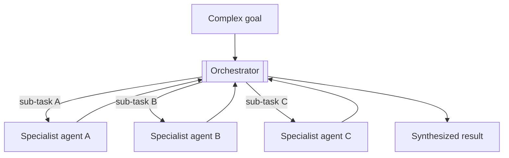
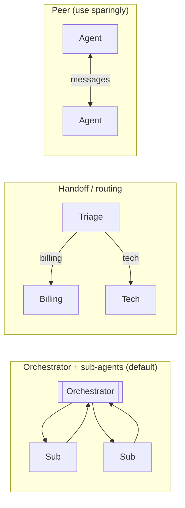
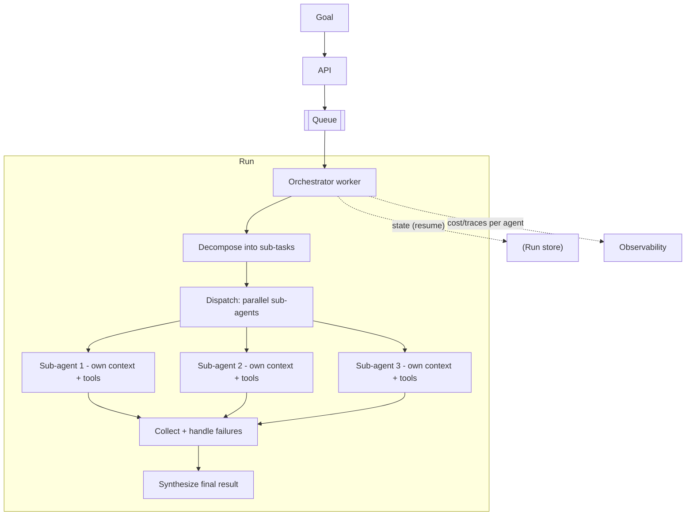
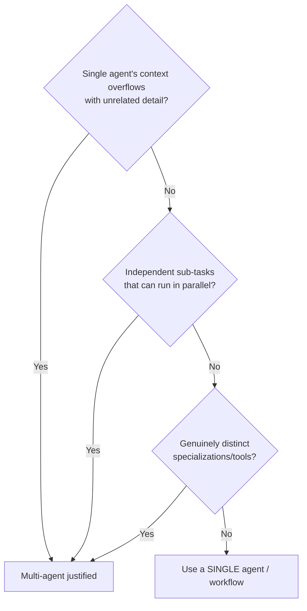
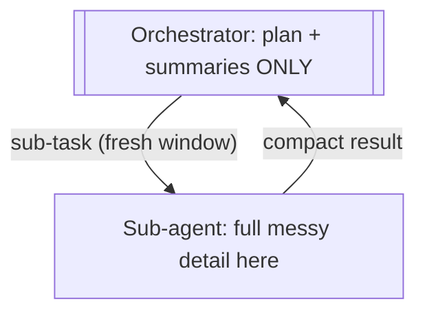

# Multi-Agent Orchestrator — System Design

**Difficulty:** Advanced (agentic AI)
**Interview importance:** ⭐ High — "design a system of collaborating agents"; tests when multi-agent is justified, orchestration, context isolation, and cost — and whether you know *not* to over-use it.
**Companion:** `files/09-agentic-ai/` (Ch 9 workflow patterns, Ch 10 multi-agent, Ch 19 context engineering)

---

## 0. Why This Design Matters

Multi-agent is the most *over-reached-for* pattern in agentic AI. Junior answers jump straight to "a swarm of agents"; senior answers know it **multiplies cost 5–15×, adds coordination failure modes, and is only justified when a single agent genuinely can't cope.** This question tests judgment (when to fan out vs. stay single), orchestration mechanics (delegate → collect → synthesize), the real win (**context isolation**, not just parallelism), and the discipline to bound it.

> Thesis: **an orchestrator decomposes a goal, delegates sub-tasks to specialized agents each in an isolated context, and synthesizes their results — but you reach for it only when one agent overflows context, needs parallelism, or needs distinct specializations. Otherwise, don't.**

---

## 1. Problem Overview — in Plain English

Build a system where a **coordinator (orchestrator) agent** breaks a complex goal into sub-tasks, hands each to a **specialized sub-agent**, and combines their outputs into a final result. Examples: a "plan my trip" system (flights agent + hotels agent + activities agent), a "build this feature" crew (planner + coder + reviewer), or a research system (a researcher per sub-topic).

**Analogy — a project manager and a team.** A one-person shop handles a small job alone. A big project needs a PM who splits the work, assigns each piece to the right specialist, lets them work independently, then integrates their deliverables. The PM doesn't do everything — and crucially, doesn't hire a 10-person team for a task one person could do. Multi-agent design is org design: right-size the team.



---

## 2. Functional Requirements

**Core**
- Accept a complex, multi-part goal.
- **Decompose** it into sub-tasks (statically or dynamically).
- **Delegate** each sub-task to an appropriate agent (with the right tools/prompt/model).
- Let sub-agents work **independently** (often in **parallel**), each in its **own context**.
- **Collect** sub-agent results and **synthesize** a final answer.
- Handle a sub-agent **failing** or returning poor output.

**Optional / advanced**
- Dynamic team composition (orchestrator decides which specialists to spawn); iterative rounds; sub-agents calling sub-agents (bounded depth); shared workspace for artifacts.

**Non-goal (the discipline):** don't use multi-agent when a single agent or a simple workflow suffices.

---

## 3. Non-Functional Requirements

| Requirement | Target | Why |
|---|---|---|
| **Justified fan-out** | Only when single-agent can't cope | Multi-agent multiplies cost + failure modes |
| **Context isolation** | Each sub-agent has a clean, focused window | The main win; avoids overflow/distraction |
| **Cost control** | Bounded per run; measured | 5–15× a single agent — must justify & cap |
| **Reliability** | A sub-agent failure ≠ whole-run failure | More parts = more failure modes |
| **Latency** | Parallelism where possible | Fan-out should buy wall-clock, not just cost |
| **Coherence** | Synthesis preserves all sub-results | Don't drop a sub-agent's findings |

---

## 4. Cost / Capacity Estimation

(Illustrative.) The headline number is the **cost multiplier**.

- A single agent uses one context + its turns. A multi-agent run = **orchestrator turns + Σ(each sub-agent's full context and turns)**. With 5 sub-agents each doing real work, that's easily **5–15× the tokens** of a single agent on the same task.
- **So the estimation *is* the justification:** you must be able to say why the quality/latency/scale gain is worth 5–15× the cost. If you can't, use a single agent.
- **Levers:** cheap model for simple sub-agents (orchestrator on a strong model — Ch 17 routing); prompt-cache shared prefixes; bound the number of sub-agents and the depth of delegation; parallelize to convert the cost into *latency savings* at least.
- **Latency:** independent sub-agents run **concurrently** → wall-clock ≈ the slowest sub-agent + synthesis, not the sum. That's the payoff for the cost.

---

## 5. Topologies (pick deliberately)



- **Orchestrator + sub-agents (default):** coordinator delegates, sub-agents report back, they don't talk to each other. Controllable — start here.
- **Handoff/routing:** control passes between agents by situation (support triage → specialist). Good for "one active agent at a time."
- **Peer collaboration:** agents message each other (debate/critique). Powerful but loop-prone and hard to control — use sparingly and bound turns.

---

## 6. High-Level Architecture



The orchestrator run is an async job (long-running). Each sub-agent is itself a full agent loop (Ch 3) in **its own isolated context**, possibly on its own model, with its own tools.

---

## 7. Deep Dive

### 7.1 When to fan out (the judgment the interviewer wants)

Say this explicitly: **default to a single agent; fan out only for context overflow, parallelism, or distinct specializations.** Naming the *no* branch is what marks seniority.

### 7.2 Context isolation — the real win (Ch 19)
The deepest reason to fan out isn't parallelism — it's **context isolation**. Each sub-agent works in a **fresh window** containing only *its* sub-task's information; its noisy intermediate steps (tool calls, dead ends) never pollute the orchestrator. The orchestrator holds only the **plan + each sub-agent's compact result**, staying small and coherent even for a huge overall task.


This is why deep-research and large-codebase systems scale — isolation, not headcount.

### 7.3 Communication — context is NEVER shared automatically
Sub-agents don't share a mind. They exchange **explicit messages**:
- **Delegation:** the orchestrator must put *everything the sub-agent needs* into the sub-task message — a sub-agent knows nothing the orchestrator didn't tell it. ("Assume shared context" is the #1 multi-agent bug.)
- **Result return:** sub-agents return **structured, compact summaries** (not raw walls of text that re-pollute the orchestrator). Treating a sub-agent as **a tool the orchestrator calls** (Ch 4/10) is the cleanest interface.
- **Shared workspace (optional):** for artifacts (files, a scratchpad), agents read/write a common store — but then you need ownership/locking to avoid conflicts.

### 7.4 Decomposition: static vs dynamic
- **Static:** the sub-tasks are known (trip = flights + hotels + activities) → a fixed fan-out (parallelization pattern, Ch 9). Simpler, predictable.
- **Dynamic (orchestrator-workers, Ch 9):** the orchestrator *decides* the sub-tasks at runtime based on the goal (e.g. "research this" → it figures out the sub-questions). More flexible, less predictable, more cost.

### 7.5 Synthesis & failure handling
- **Synthesis:** the orchestrator merges sub-results into a coherent whole — explicitly instruct it to **incorporate all findings** and **dedup/resolve conflicts**, not just concatenate.
- **Partial failure:** a sub-agent may fail or return junk. The orchestrator must detect nulls/errors and **retry, reassign, or proceed with a noted gap** — one sub-agent failing shouldn't sink the run.
- **Bounded delegation depth:** sub-agents spawning sub-agents can explode; cap the depth (often one level) and the total agent count.

---

## 8. Guardrails, Reliability & Cost
- **Bounds everywhere:** max sub-agents, max delegation depth, max total tokens/$/time per run (a runaway orchestrator is expensive).
- **No unbounded peer chatter:** prefer the orchestrator topology; if peers message, cap turns and add a terminator.
- **Reliability:** async job + **persisted run state** (plan + collected results) so a long multi-agent run resumes after a crash; idempotent sub-task dispatch.
- **Least privilege per sub-agent:** each gets only the tools its role needs (a "research" sub-agent has no write tools).
- **Untrusted inputs:** the same injection/guardrail posture as any agent (Ch 16), applied to each sub-agent.
- **Observability:** trace **per sub-agent** — cost, latency, tokens — so you can see *which* agent is expensive and whether the fan-out paid off.

---

## 9. Evaluation (Ch 14)
- **Did multi-agent beat a single agent** on this task (quality/latency/scale)? If not, you over-engineered — the key eval.
- **Sub-agent success rate** and synthesis quality (did the final result use all sub-results?).
- **Cost vs. a single-agent baseline** — is the multiplier justified?
- Failure-mode evals: a sub-agent returns garbage / times out → does the run degrade gracefully?

---

## 10. Trade-offs to Say Out Loud

| Axis | A | B | Choose by |
|---|---|---|---|
| Structure | Single agent | Multi-agent | Context/parallelism/specialization — else single |
| Topology | Orchestrator+subs | Peer collaboration | Control → orchestrator |
| Decomposition | Static fan-out | Dynamic (runtime) | Predictability vs flexibility |
| Sub-agent interface | Free-form messages | Sub-agent as a tool | Cleanliness → tool |
| Depth | One level | Nested | Cost/complexity → keep shallow |
| Model | All strong | Orchestrator strong, subs cheap | Cost → route |

---

## 11. Failure Scenarios

| Scenario | Handling |
|---|---|
| Over-used multi-agent | Downgrade to single agent/workflow (justify fan-out) |
| Sub-agent lacks context | Orchestrator must pass all needed info in the sub-task |
| Sub-agent returns a wall of text | Require compact structured summaries |
| One sub-agent fails | Detect + retry/reassign/note-gap; don't sink the run |
| Peer chatter loops | Orchestrator topology; bound turns; terminator |
| Cost blowup | Bound agent count/depth/tokens; route cheap subs; measure |
| Conflicting sub-results | Synthesis step resolves conflicts explicitly |
| Nested delegation explosion | Cap delegation depth (usually 1) |

---

## ❌ 12. Common Mistakes
- **Reaching for multi-agent by default** — it's the last resort, not the first. Try single agent / workflow.
- **Assuming shared context** — sub-agents only know what you tell them.
- **Sub-agents dumping raw detail back** — re-pollutes the orchestrator; require summaries (context isolation is the point).
- **Unbounded peer conversation** — loops and cost. Prefer orchestrator; bound turns.
- **No cost bound / not measuring the multiplier** — 5–15× is easy to hit.
- **No partial-failure handling** — one bad sub-agent kills the run.
- **Nested delegation with no depth cap** — combinatorial explosion.
- **Not proving it beat a single agent** — over-engineering with no eval.

---

## 13. LLD
```java
interface Orchestrator { Result run(Goal g); }
interface Planner { List<SubTask> decompose(Goal g); }              // static or dynamic
interface SubAgent { SubResult run(SubTask t); }                     // full agent loop, own context + tools
interface Dispatcher { List<SubResult> dispatch(List<SubTask> ts); } // parallel, with failure handling
interface Synthesizer { Result merge(List<SubResult> rs); }          // incorporate all, dedup/resolve
interface RunStore { void save(RunState s); }                        // resume long runs
```
**Patterns:** Orchestrator-Workers (core), Parallelization (static fan-out), Router (handoff), Strategy (per-role prompts/models), sub-agent-as-Tool. **Bounds** (agent count, depth, budget) are first-class, enforced in `Dispatcher`/`Orchestrator`.

---

## 14. Interview Q&A

**Beginner**
**Q: What is a multi-agent system?**
A coordinator (orchestrator) agent breaks a complex goal into sub-tasks and delegates each to a specialized sub-agent, then combines their results. Each sub-agent is a full agent with its own tools and context, focused on one piece of the problem.

**Q: Why not always use multiple agents — isn't more better?**
No — it's usually worse. Multi-agent multiplies cost 5–15×, adds coordination and failure modes, and is harder to debug. You use it only when a single agent genuinely can't cope: its context overflows, sub-tasks can run in parallel, or the work needs distinct specializations. Otherwise a single agent or a plain workflow is cheaper and more reliable.

**Intermediate**
**Q: What's the *real* benefit of sub-agents — parallelism?**
Parallelism is a bonus; the deeper benefit is **context isolation**. Each sub-agent works in a fresh window with only its sub-task's information, so its messy intermediate steps never pollute the orchestrator, which holds just the plan and each sub-agent's compact summary. That's what lets the system handle a task far bigger than one context window.

**Q: How do sub-agents share information?**
They don't automatically — context is never shared. The orchestrator must put everything a sub-agent needs into the delegation message, and sub-agents return compact structured summaries. The cleanest interface is treating a sub-agent as a tool the orchestrator calls. "Assume shared context" is the classic multi-agent bug.

**Advanced / Staff**
**Q: How do you decide to fan out, and how do you bound the cost?**
I default to a single agent and fan out only for context overflow, genuine parallelism, or distinct specializations — and I say the "no" branch out loud, because over-using multi-agent is the common mistake. To bound cost: cap the number of sub-agents and delegation depth (usually one level), put simple sub-agents on a cheap model with the orchestrator on a strong one, prompt-cache shared prefixes, and set a hard token/$ budget per run. Then I evaluate whether it actually beat a single-agent baseline — if not, I collapse it back.

**Q: How do you handle a sub-agent failing or returning garbage?**
The orchestrator treats sub-results defensively: detect nulls/errors/low-confidence, then retry, reassign to another agent, or proceed while noting the gap in the synthesis — one sub-agent must not sink the whole run. State is persisted so a long run resumes after a crash, and dispatch is idempotent so a retried sub-task doesn't double-execute side effects. I also trace per sub-agent so I can see which one failed and what it cost.

---

## 🎯 15. 30-Second Answer

> "A multi-agent system is an orchestrator that decomposes a goal, delegates sub-tasks to specialized agents each running in its own isolated context, and synthesizes their results. The senior point is restraint: it multiplies cost 5–15× and adds failure modes, so I default to a single agent and only fan out for context overflow, parallelism, or distinct specializations — and I say why. The real win is context isolation: sub-agents keep their messy detail out of the orchestrator, which holds only the plan and compact summaries, so the system scales past one context window. Context is never shared automatically — the orchestrator passes each sub-agent what it needs, and sub-agents return summaries, ideally as a tool call. I bound agent count, depth, and budget, handle partial failures gracefully, and evaluate that it actually beat a single agent."

---

## 🧠 16. Mental Model

```
GOAL → DECOMPOSE (static or dynamic)
   ↓
DELEGATE to specialists (each: own context + tools + maybe cheaper model)   ← context ISOLATION is the win
   ↓ (parallel where independent)
COLLECT (handle partial failures) → SYNTHESIZE (incorporate all, dedup)
JUDGMENT = default single agent; fan out only for overflow / parallelism / specialization
RULES = context never shared (pass it explicitly) · sub-agent = a tool · return summaries not walls
BOUND = agent count + depth + budget · MEASURE = did it beat a single agent? (5–15× cost)
```

---

## 🔗 17. How This Connects
- Workflow patterns (parallelization, orchestrator-workers, routing) → `09-agentic-ai/09`; multi-agent mechanics → `09-agentic-ai/10`; context isolation → `09-agentic-ai/19`.
- This is the *scaling layer* for the other agent designs: the **Deep Research agent (29)**, **Coding agent (31)**, and **PR-review agent (28)** all fan out to sub-agents by sub-topic/file/dimension using exactly this pattern.
- Async job + persisted state + idempotent dispatch → `02-task_scheduler` reliability patterns.
