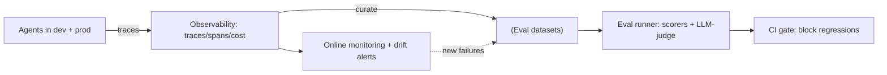
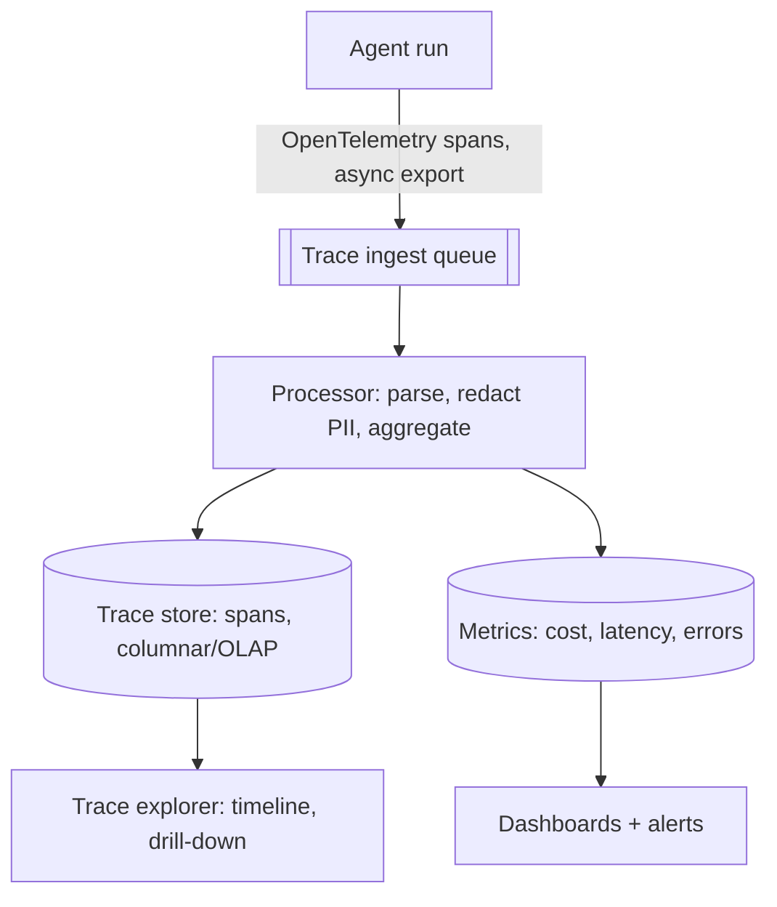
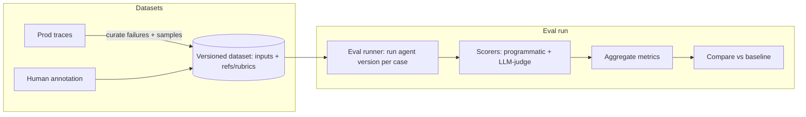
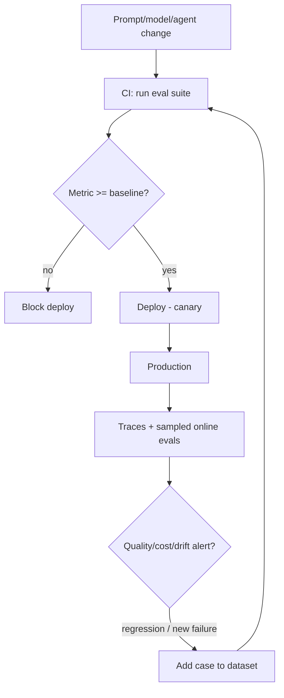
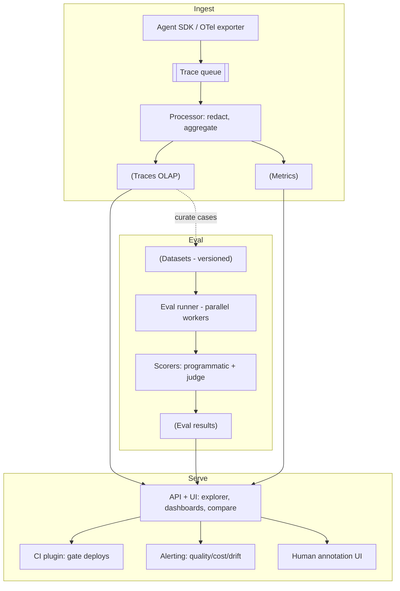

# Agent Evaluation & Observability Platform — System Design

**Difficulty:** Advanced (AI infrastructure / platform)
**Interview importance:** ⭐ High (staff-level) — the *meta* question: "how do you test and monitor agents at scale?" It's a platform-design problem, which favors a backend/staff engineer.
**Core new tech:** **eval dataset management + eval runners (LLM-as-judge + programmatic scorers), trace/span ingestion (OpenTelemetry), CI regression gating, online monitoring + drift detection, and human annotation.**

---

## 0. Why This Design Matters

You cannot ship agents you can't measure — and agents are **non-deterministic** with **fuzzy correctness**, so classic unit tests don't apply (Ch 14/15 of the Agentic AI course). Every serious AI org therefore builds (or buys) a platform that does two intertwined jobs: **observability** (trace every agent run so you can debug and monitor) and **evaluation** (score quality on datasets, gate regressions in CI, and watch quality in production). This is the system *under* all the other agents (28–41) — the thing that lets you improve them safely. It's a pure platform/data-pipeline design.

> Thesis: **capture every run as traces, turn real runs into eval datasets, score them with programmatic + LLM-judge scorers, gate prompt/model changes in CI against a baseline, and monitor quality + cost + drift online — closing the loop from production back into tests.**

---

## 1. Problem Overview — in Plain English

Build the platform that AI teams use to know their agents work: it **records** what every agent did (traces), **evaluates** agent versions against test datasets (offline evals), **blocks regressions** before deploy (CI gating), and **monitors** quality, cost, and latency in production (online), feeding real failures back into the test sets.

**Real-world analogy — a hospital's monitoring + clinical-trials department.** Observability is the patient monitors and charts (every vital recorded, replayable when something goes wrong). Evaluation is the clinical trials + QA lab (before a new treatment/version ships, test it against known cases and compare to the current standard). Together they let you change treatment safely and catch problems early. This platform is both, for agents.



---

## 2. Functional Requirements

**Core**
- **Trace ingestion:** capture each agent run as a trace of spans (LLM calls, tool calls, retrievals) with inputs/outputs/tokens/latency.
- **Dataset management:** create/version eval datasets (inputs + optional reference answers/rubrics), including **curating cases from production traces**.
- **Eval execution:** run an agent version over a dataset and **score** each output (programmatic checks + LLM-as-judge).
- **Compare vs baseline:** show quality deltas between versions/prompts/models.
- **CI gating:** run evals on every change; **block** if a metric regresses.
- **Online monitoring:** dashboards + alerts for quality, cost, latency, error rate in production; sample production traffic for live evals.
- **Human annotation:** UI for humans to label/score outputs (ground truth + judge calibration).

**Optional / advanced**
- A/B testing of agent versions, drift detection, prompt/version registry, guardrail-violation tracking, cost attribution, PII redaction.

---

## 3. Non-Functional Requirements

| Requirement | Target | Why |
|---|---|---|
| **Trace throughput** | Ingest high-volume traces without slowing agents | Instrumentation must be async, low-overhead |
| **Low agent overhead** | Tracing adds ~nothing to the hot path | Fire-and-forget span export |
| **Eval scalability** | Run large datasets fast | Parallel eval execution |
| **Reproducibility** | Deterministic scoring given inputs | Trust the metrics |
| **Retention/privacy** | Store enough to debug; redact PII | Traces contain full prompts/data |
| **Correlation** | Link a prod complaint → exact trace | request/trace IDs everywhere |

---

## 4. Capacity Estimation

(Illustrative.) Traces are the high-volume stream; evals are heavy compute bursts.

- **Traces:** every agent run emits many spans; at scale that's a **high-volume append stream** → ingest via a queue into columnar/time-series + object storage. **Sample in production** (100% of errors, a % of successes) to bound cost.
- **Evals:** running a 1,000-case dataset × N agent versions × (agent call + judge call per case) is a **compute burst** → parallelize across workers; cache where inputs are unchanged.
- **Cost:** LLM-as-judge calls cost money; batch and cache them. Trace storage grows fast → tiered retention (hot recent, cold archive).

This is fundamentally a **data pipeline** (ingest → store → query → aggregate) plus a **batch eval engine** — classic backend design.

---

## 5. Observability Half — Traces & Spans

(Same trace/span model as `Agentic-AI/15`, productized.)


- A **trace** = one agent run; **spans** = each step (LLM call, tool call, retrieval) with inputs/outputs/tokens/latency/model/errors.
- **Instrumentation is async + low-overhead** (fire-and-forget span export, often via **OpenTelemetry**) so it never slows the agent.
- Ingest through a **queue** → processor (parse, **redact PII**, compute metrics) → **trace store** (columnar/OLAP for queryability) + **metrics store**.
- **Trace explorer** UI (timeline + drill-down) is how you debug a bad run; **dashboards/alerts** on cost, latency, error rate, quality.
- **Correlation:** every span carries a trace/request id so a production complaint maps to the exact run.

---

## 6. Evaluation Half — Datasets, Scorers, Runs



**Datasets:** versioned sets of inputs, optionally with reference answers or **rubrics**. The best cases come from **real production traces** — especially failures — curated in (closing the loop). Human annotation provides ground truth and calibrates judges.

**Scorers (from objective to flexible — Ch 14):**
- **Programmatic:** exact/structural match, "does it compile / tests pass / valid JSON / contains required field" — objective, cheap, preferred when possible.
- **LLM-as-judge:** score against an explicit rubric for subjective quality; must use a sharp rubric, structured output, and be **calibrated against human labels**.
- **Human:** the ground-truth gold standard for calibration and high-stakes cases.

**Eval run:** execute the agent version over the dataset (parallelized), score each case, aggregate to metrics (pass rate, avg score, % criteria met), and **compare against the baseline version** — the delta is the whole point.

---

## 7. Closing the Loop — CI Gating + Online Monitoring

The platform's value is that **offline and online reinforce each other**:


- **CI regression gating:** every prompt/model/agent change runs the eval suite; a metric regression **blocks the deploy** (agents' unit-test equivalent). Because outputs vary, run each case a few times and gate on **rates/thresholds**, not exact strings.
- **Canary + A/B:** roll a new version to a slice, compare live metrics vs the current version.
- **Online monitoring:** sample production traffic through evals (and heuristics/guardrail checks) to catch quality drops the offline set missed; alert on **drift** (quality trending down, input distribution shifting).
- **Feedback loop:** every production failure/complaint → curated into the dataset as a **regression case** so it can't recur. This is the flywheel.

---

## 8. Architecture (whole platform)


Tech in this space: **LangSmith, Langfuse, Braintrust, Arize Phoenix**; ingestion via **OpenTelemetry**; storage in a columnar/OLAP store (traces) + time-series (metrics) + object store (payloads). Build-vs-buy is itself a valid answer to state.

---

## 9. Failure & Edge Cases

| Scenario | Handling |
|---|---|
| Tracing slows the agent | Async fire-and-forget export; sample in prod |
| Trace volume explodes / storage cost | Sampling (all errors, % success) + tiered retention |
| PII in traces | Redact at ingestion; access controls; retention limits |
| LLM judge is noisy/miscalibrated | Sharp rubric, binary criteria, calibrate vs human labels |
| Eval set overfit / unrepresentative | Continuously curate from prod; hold-out test set |
| Non-determinism flakes CI | Run N times; gate on pass-rate thresholds |
| "Green offline, broken in prod" | Online sampled evals + drift alerts feed new cases back |
| Judge/eval cost | Batch + cache judge calls; programmatic scorers first |

---

## ❌ 10. Common Mistakes
- **Treating agents like deterministic code** (exact-match CI) — score properties/rates, not strings.
- **Synchronous, heavy tracing** on the hot path — must be async/low-overhead.
- **No sampling** → trace cost/volume explodes.
- **Un-calibrated LLM judge** → metrics you can't trust; calibrate against humans, prefer binary criteria.
- **Static, hand-made eval set** — the best cases come from production; curate continuously.
- **Only offline OR only online** — the power is the loop between them.
- **Storing raw PII** in traces without redaction/retention limits.
- **No baseline comparison / no CI gate** — then every change is a gamble.

---

## 11. Trade-offs to Say Out Loud

| Axis | A | B | Choose by |
|---|---|---|---|
| Build vs buy | Build in-house | LangSmith/Langfuse/etc. | Control/scale vs speed |
| Scoring | Programmatic (objective) | LLM-judge (flexible) | Correctness vs subjectivity |
| Prod tracing | 100% | Sampled (errors + %) | Debuggability vs cost |
| Gating | Strict thresholds | Advisory | Risk tolerance |
| Eval timing | Offline (CI) | Online (sampled) | Both — they cover different gaps |

---

## 12. LLD
```java
interface Tracer { Span start(String name); }                       // OTel; async export
interface TraceStore { void ingest(Trace t); List<Trace> query(Filter f); }
interface Dataset { String version(); List<Case> cases(); void addCase(Case c); } // versioned
interface Scorer { Score score(Output out, Case c); }               // programmatic | LLM-judge | human
interface EvalRunner { EvalResult run(AgentVersion v, Dataset d); } // parallel
interface Comparator { Delta compare(EvalResult a, EvalResult baseline); }
interface Monitor { void watch(Metric m); void alert(Condition c); } // drift, cost, quality
```
**Patterns:** data pipeline (ingest→store→query), batch eval engine (parallel), scorer Strategy, closed-loop (prod → dataset → CI), OTel instrumentation.

---

## 13. Interview Q&A

**Beginner**
**Q: Why do agents need a special eval/observability platform — why not unit tests and normal logging?**
Because agents are non-deterministic and "correct" is often a judgment call, so exact-match unit tests don't fit — you evaluate quality across many cases and score properties or rates. And a single log line can't explain a multi-step run, so you need structured traces (spans per LLM/tool call) to replay and debug. The platform provides both, at scale.

**Q: What's the difference between the observability half and the evaluation half?**
Observability records what actually happened — traces/spans with inputs, outputs, tokens, latency — so you can debug and monitor. Evaluation measures how good the agent is — running it over datasets and scoring the outputs, comparing versions. Observability is "what happened," evaluation is "was it good," and they feed each other.

**Intermediate**
**Q: How do you score outputs at scale?**
A ladder: programmatic scorers first (exact/structural match, does-it-compile, valid-JSON) because they're objective and cheap; LLM-as-judge with a sharp rubric for subjective quality, calibrated against human labels and using binary criteria for consistency; and human annotation as ground truth for calibration and high-stakes cases. I run each case several times and aggregate to rates because of non-determinism.

**Q: How does this gate a prompt or model change?**
Every change triggers the eval suite in CI over a versioned dataset; the runner executes the new agent version per case, scores it, and compares to the baseline version. If a key metric regresses beyond a threshold, the deploy is blocked — it's the agents' equivalent of a failing test. Because outputs vary, the gate is on pass-rate thresholds, not exact matches, and I canary the change and compare live metrics too.

**Advanced / Staff**
**Q: What's the flywheel between offline and online?**
Production traces are the richest source of eval cases — especially failures — so I continuously curate them (with human labels) into the versioned datasets. Offline evals then gate changes in CI; online I sample production traffic through evals and watch for drift (quality trending down, input distribution shifting). When something slips past offline into production, it becomes a new regression case. Offline catches known issues before deploy; online catches the unknowns; each feeds the other. That closed loop is the whole point.

**Q: How do you keep tracing from hurting the agents or blowing up cost?**
Instrumentation is async and fire-and-forget (OpenTelemetry export off the hot path), so it adds negligible latency. Volume is controlled by sampling — 100% of errors, a small percentage of successes — plus tiered retention (hot recent traces queryable, older archived cheaply). PII is redacted at ingestion with retention limits. Judge-based eval cost is bounded by preferring programmatic scorers, and batching/caching judge calls.

---

## 🎯 14. 30-Second Answer

> "It's two halves that form a loop. Observability: agents export traces (spans per LLM/tool call with inputs, outputs, tokens, latency) asynchronously via OpenTelemetry into a queue → processor that redacts PII → an OLAP trace store and metrics, with a trace explorer for debugging and dashboards for cost/latency/quality. Evaluation: versioned datasets — best sourced from curated production traces — scored by programmatic checks and calibrated LLM-as-judge, run per agent version and compared to a baseline. The loop: evals gate every prompt/model change in CI (block on regression, on pass-rate thresholds since it's non-deterministic), canary/A-B in prod, and online sampled evals plus drift alerts feed new failures back into the datasets. It's fundamentally a trace data-pipeline plus a parallel batch eval engine; build in-house or use LangSmith/Langfuse/Braintrust."

---

## 🧠 15. Mental Model

```
OBSERVABILITY: agent → async OTel spans → queue → redact/aggregate → OLAP trace store + metrics → explorer + dashboards
EVALUATION:    versioned datasets (curated from PROD traces + human labels) → eval runner (parallel) → scorers (programmatic > LLM-judge > human) → compare vs BASELINE
LOOP:          evals GATE changes in CI (pass-rate thresholds) → canary/A-B → online sampled evals + DRIFT alerts → new failures → back into datasets
COST/PRIVACY:  sample prod traces (all errors, % success) · tiered retention · redact PII · batch/cache judge calls
= a trace DATA PIPELINE + a batch EVAL ENGINE, closing prod→test
```

---

## 🔗 16. How This Connects
- Productizes `Agentic-AI/14` (evaluation) and `15` (observability) into a platform.
- It's the system that **operates every other agent** (28–41): it traces the PR-review/coding/voice/computer-use agents and gates their prompt/model changes.
- The trace pipeline = a **streaming/OLAP** design like analytics (`14`) and metrics monitoring (`23`); parallel eval = map-reduce/orchestrator-workers (`35`).
- Naturally co-located with the **LLM gateway** (`34`) — the gateway is where org-wide LLM calls are captured.
