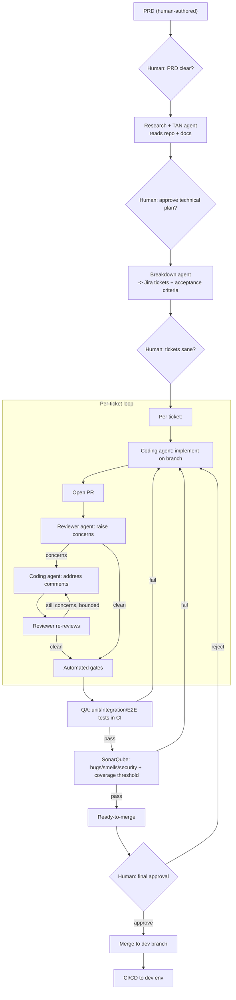
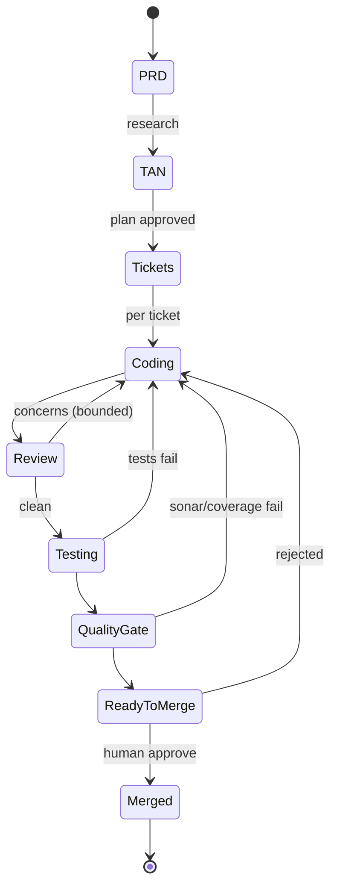
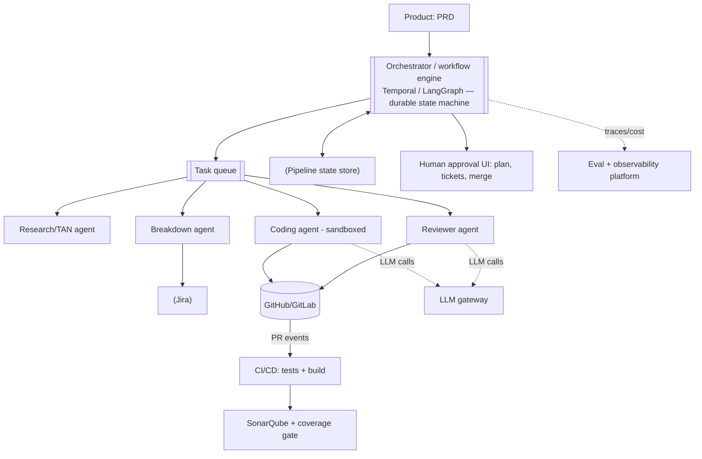

# Autonomous Engineering Pipeline (AI SDLC Orchestrator) — System Design

**Difficulty:** Expert (agentic AI + platform + SDLC)
**Interview importance:** ⭐ High and very topical — "automate the whole software delivery pipeline with agents." It's the *capstone* agentic design: it composes several agents you already have into an end-to-end system.
**Core idea:** an **orchestrated pipeline** — PRD → research/TAN → ticket breakdown → coding agent (dev + PR) → reviewer agent → fix loop → QA tests → Sonar + coverage → ready-to-merge → merge to `dev` — with **objective quality gates** and **human approval gates** at high-leverage points.

---

## 0. Why This Design Matters

This is the "holy grail" pitch: describe a feature and agents ship it. The design tests whether you can (a) **compose multiple agents** (coding, review) into a reliable pipeline, (b) use **objective gates** (tests, Sonar, coverage) as verifiers so you're not trusting the model's word, (c) place **human-in-the-loop** correctly (autonomy where errors are cheap/recoverable, humans where they're expensive), and (d) be **honest about the limits** — full unattended PRD→prod is aspirational; the senior answer is *agents do the heavy lifting inside a gated, bounded, observable workflow*, not "fire and forget."

> Thesis: **it's a stage-gated workflow (not one autonomous mega-agent) where each stage is an agent or tool, every stage has an objective and/or human gate, loops are bounded, nothing auto-merges to a protected branch, and the whole run is traced, evaluated, and reversible.**

---

## 1. Problem Overview — in Plain English

Build a system where a product requirement (a **PRD**) flows through the engineering lifecycle largely automatically: it's researched into a technical plan, broken into tickets, implemented by a coding agent that opens a PR, reviewed by a reviewer agent that raises concerns, fixed by the coding agent in a loop until clean, verified by automated tests + SonarQube + coverage, and — once all gates pass and a human approves — merged into the `dev` branch.

**Real-world analogy — a factory assembly line with QA stations and a foreman.** Each station does one job (research, code, review, test) and hands off to the next; QA stations (tests/Sonar) reject defects back up the line for rework; and a **foreman signs off** at the critical checkpoints (is the plan right? ship it?). It's not a magic box — it's a disciplined line with inspection gates and human oversight where it counts.

```mermaid
flowchart LR
    PRD[PRD] --> TAN["Research + TAN"]
    TAN --> Tix[Ticket breakdown - Jira]
    Tix --> Dev["Coding agent -> PR"]
    Dev --> Rev[Reviewer agent]
    Rev -->|concerns| Dev
    Rev -->|clean| QA[QA tests]
    QA --> SQ["Sonar + coverage"]
    SQ --> RM[Ready-to-merge]
    RM -->|human approve| Merge[Merge to dev]
```



---

## 2. Functional Requirements

**Core (the pipeline stages)**
- Ingest a **PRD**; produce a **Technical Analysis Note (TAN)** (approach, impact, risks) via a research agent that reads the codebase + docs.
- **Break down** the work into **Jira tickets** (scoped, ordered, with acceptance criteria).
- Per ticket: a **coding agent** implements the change on a branch and **opens a PR**.
- A **reviewer agent** reviews the PR and raises concerns (correctness, security, style).
- A **fix loop**: the coding agent addresses review comments; the reviewer re-reviews; repeat until clean or bounded.
- Run **QA / automated tests** (unit, integration, E2E) via CI.
- Run **SonarQube** static analysis + enforce a **test-coverage** threshold (quality gate).
- Transition to **ready-to-merge** when all gates pass; **merge into `dev`** after human approval.

**Cross-cutting**
- Human approval gates at high-leverage points; full traceability (PRD → ticket → PR → merge); cost + time tracking; rollback.

---

## 3. Non-Functional Requirements

| Requirement | Target | Why it drives the design |
|---|---|---|
| **Correctness / quality** | Objective gates must pass (tests/Sonar/coverage) | Never trust the agent's word — verify with gates |
| **Safety** | No auto-merge to protected branches; sandboxed exec | It writes and ships code — blast radius is prod |
| **Bounded loops** | Review↔fix loop can't run forever | Agents thrash; cost/time blowup |
| **Observability** | Every stage + decision traced | Debug failures; accountability |
| **Cost** | Bounded per feature | Many agents × many LLM calls |
| **Reversibility** | Merge to `dev` (not `main`); easy revert | Errors must be recoverable |
| **Human oversight** | Gates at PRD/plan/merge | Errors compound across stages |

---

## 4. The Full Flow (stage by stage)

Each stage is an **agent** (LLM doing open-ended work) or a **tool/CI job** (deterministic), followed by a **gate** (objective check and/or human approval).



### Stage details + tech

| Stage | Type | What it does | Gate | Tech |
|---|---|---|---|---|
| **PRD intake** | Human | Product writes the requirement | Human: is it clear/complete? | Doc store / PRD template; the LLM can *critique* the PRD for gaps |
| **Research + TAN** | Agent | Reads the codebase + docs, produces a Technical Analysis Note: approach, affected modules, risks, alternatives | **Human approves the plan** (highest-leverage gate) | LLM + code retrieval (RAG/grep over repo), doc search |
| **Ticket breakdown** | Agent | Decomposes into small, ordered Jira tickets with **acceptance criteria** | Human: tickets scoped right? | LLM + **Jira API** |
| **Coding** | Agent | Implements a ticket on a branch, writes tests, opens a **PR** | (produces artifact for gates) | **Coding agent** (design `31`): sandbox, repo tools, tests; **GitHub/GitLab API** |
| **Review** | Agent | Reviews the PR, posts inline concerns + verdict | Reviewer verdict | **PR-review agent** (design `28`) |
| **Fix loop** | Agent | Coding agent addresses review comments; reviewer re-reviews | **Bounded** (max N rounds → escalate to human) | Coding + reviewer agents |
| **QA tests** | Tool/CI | Runs unit/integration/E2E | **Objective gate:** all pass | CI (GitHub Actions/Jenkins), test runners |
| **Sonar + coverage** | Tool/CI | Static analysis (bugs, code smells, security hotspots) + coverage ≥ threshold | **Objective gate:** Sonar quality gate green, coverage ≥ X% | **SonarQube**, coverage tools (JaCoCo/Istanbul) |
| **Ready-to-merge** | State | All gates green | **Human final approval** | State machine |
| **Merge to `dev`** | Tool | Merge PR into `dev` (not `main`) | (post-merge CI/CD) | Git provider API; CI/CD |

**The two verifier types are the backbone:** *objective gates* (tests, Sonar, coverage — deterministic, un-gameable-ish) catch what agent self-assessment can't, and *human gates* (plan approval, final merge) catch the expensive, judgment-heavy decisions.

---

## 5. Deep Dive — The Hard Parts

### 5.1 It's a workflow, not one autonomous agent
Model the whole thing as a **stage-gated workflow / state machine** (an orchestrator, e.g. Temporal / a workflow engine / LangGraph) where each stage is an agent or CI job. This gives you **durability** (survive crashes mid-feature), **retries**, **visibility**, and **gates between stages** — none of which a single free-roaming agent gives you. (Ch 9: workflow with agentic steps > one big agent.)



### 5.2 The review↔fix loop must be bounded (the thrash risk)
The coding-agent ↔ reviewer-agent loop is powerful but can **oscillate** (fix A breaks B, reviewer nitpicks forever, two agents disagree endlessly). Controls:
- **Max N rounds** (e.g. 3) → then **escalate to a human**, don't loop forever.
- **Detect no-progress** (same concern reappears, or the diff ping-pongs).
- **Objective gates end debate:** once tests + Sonar + coverage are green, style nitpicks shouldn't block — the machine gates are the real bar.
- Keep tickets **small** so each PR is reviewable and the loop converges.

### 5.3 Objective gates as the un-gameable verifier
LLM review can be talked into "looks good." **Tests, Sonar, and coverage are deterministic** — they don't hallucinate. So the pipeline's trust comes from these gates, not from an agent saying it's done. Watch the classic gaming failure: a coding agent that **weakens/deletes tests or games coverage** to pass — so forbid test deletion (unless the ticket is to change tests), review coverage *quality* not just the number, and treat "coverage went up but assertions are empty" as a review finding.

### 5.4 Error compounding across stages
Each stage's output feeds the next, so a bad TAN → bad tickets → wrong code → wasted review/QA. That's *why* the **early human gates (PRD, plan) matter most** — catching a wrong plan costs one approval; catching it after code+review+QA costs the whole pipeline. Invest oversight **upstream**.

### 5.5 Traceability & accountability
Link **PRD → TAN → ticket → branch → PR → review → merge** as one traceable thread (Jira ↔ Git ↔ pipeline run id). When something breaks in `dev`, you can trace exactly which requirement/agent/PR caused it — essential for debugging *and* for the "who's accountable?" question.

---

## 6. Architecture


- **Orchestrator** owns the state machine, gates, retries, and durability (survives a crash mid-feature).
- **Agents** run as workers (coding agent in an **isolated sandbox/worktree** per ticket — design `31`).
- **Git provider + CI/CD + SonarQube** are the objective-gate infrastructure, driven by PR/webhook events.
- **Human approval UI** for the plan/ticket/merge gates.
- Cross-cutting: **LLM gateway** (`34`) for model calls, **eval/observability platform** (`42`) for tracing every stage, **Jira** for tickets.

---

## 7. ✅ Pros / ❌ Cons

### ✅ Pros
- **Speed & throughput:** parallelizes across tickets; agents work 24/7; slashes cycle time for well-specified, routine work.
- **Consistency:** every PR gets the same rigorous review, tests, and Sonar gate — no "reviewer was busy."
- **Frees senior engineers** from boilerplate/routine tickets to focus on architecture and the hard 20%.
- **Objective quality floor:** nothing merges without tests + Sonar + coverage passing — arguably *more* disciplined than many human teams.
- **Full traceability:** PRD→merge is one auditable thread.
- **Scales elastically:** more tickets → more agent workers.

### ❌ Cons / Risks
- **Error compounding:** a wrong TAN cascades into wrong code; small upstream mistakes get expensive downstream.
- **Hallucinated requirements/APIs:** the agent may invent behavior or use non-existent APIs — needs grounding + tests to catch.
- **Metric gaming:** agents can "pass" by weakening tests or padding coverage with assertion-free tests.
- **Review-loop thrash:** unbounded coding↔review loops oscillate and burn cost/time.
- **Cost:** many agents × many LLM calls per feature — can be expensive; must bound and measure.
- **Accountability gap:** when agent-written code breaks prod, *who owns it?* Ownership/sign-off must be explicit (a human approves the merge).
- **Security:** agents with repo write access + CI access are a supply-chain risk (a compromised/injected agent could ship malicious code); prompt injection via ticket/PRD/code comments.
- **Over-trust / skill atrophy:** teams rubber-stamping agent PRs stop scrutinizing → bugs slip; the human gate must stay meaningful.
- **Not good at the ambiguous 20%:** genuinely novel/architectural work still needs humans; the system shines on well-scoped, routine changes.

---

## 8. 💡 Suggestions / Best Practices (the senior take)

1. **Don't aim for fire-and-forget.** Ship it as **assist-then-autonomy**: start with agents *proposing* (plan, tickets, PRs) and humans approving; expand autonomy only where you've measured it's reliable.
2. **Put humans at the high-leverage, cheap-to-review gates:** PRD clarity, **TAN/plan approval**, and **final merge**. Skip human review on low-risk mechanical steps once trusted.
3. **Never auto-merge to a protected branch.** Merge to `dev` (or a staging branch) behind branch protection + human approval; `main`/prod stays human-gated. Reversibility is the rule.
4. **Lean on objective gates as the source of truth** — tests, Sonar quality gate, coverage threshold — not the agent's self-assessment. Make the pipeline *fail closed* if a gate fails.
5. **Bound every loop** (max review↔fix rounds, max cost/time per ticket) with **escalation to a human** on exhaustion.
6. **Keep tickets small.** Small PRs are reviewable, converge faster in the fix loop, and limit blast radius.
7. **Guard against metric gaming:** forbid test deletion/weakening unless that's the ticket; review coverage *quality*; flag assertion-free tests.
8. **Sandbox + least privilege:** coding agent in an isolated worktree; scoped tokens (no force-push/merge-to-main power); CI secrets not exposed to the model.
9. **Treat PRD/tickets/code/PR text as untrusted** (prompt-injection surface).
10. **Trace and evaluate everything** (via the eval/observability platform `42`): per-stage success, cost, cycle time, human-override rate — so you know where autonomy is/ isn't working.
11. **Keep a human owner per feature** for accountability; the approver is responsible, not "the AI."
12. **Start on the routine 80%** (well-specified CRUD, refactors, bug fixes with a repro); route the ambiguous/architectural work to humans.

---

## 9. Failure Scenarios

| Scenario | Handling |
|---|---|
| Wrong TAN → wrong everything | Human plan-approval gate upstream; cheap to catch early |
| Review↔fix loop oscillates | Max-rounds bound → escalate to human; no-progress detection |
| Agent games coverage / deletes tests | Forbid test edits (unless ticket is tests); review coverage quality |
| Hallucinated API/behavior | Grounding (repo RAG) + tests + Sonar catch it; human plan review |
| Prompt injection via ticket/code comment | Treat all text as untrusted; guardrails; sandbox |
| Agent-written code breaks `dev` | Merge to `dev` not `main`; easy revert; post-merge CI + rollback |
| Cost blowup on one feature | Per-feature token/$ bound; alert; escalate |
| Two agents deadlock (coder vs reviewer disagree) | Objective gates end the debate; human tie-breaker |
| Orchestrator crash mid-feature | Durable workflow engine resumes from last completed stage |
| Security: compromised agent ships bad code | Least-privilege tokens, human merge gate, CI security scans, audit log |

---

## ❌ 10. Common Mistakes
- **"One autonomous agent does it all"** — no gates, no durability, no visibility. It's a *workflow with agentic stages*.
- **Auto-merging to `main`/prod** — irreversible; always human-gate the merge and target `dev`.
- **Trusting the agent's "looks good"** instead of objective gates (tests/Sonar/coverage).
- **Unbounded review↔fix loop** → thrash and cost.
- **Ignoring metric gaming** (deleted/empty tests to pass).
- **Oversight in the wrong place** — reviewing every line of generated code but rubber-stamping the *plan*; put humans upstream where errors are cheapest to catch.
- **Big tickets** → unreviewable PRs, non-converging loops.
- **Over-privileged agents** (merge/force-push/prod access) — supply-chain risk.
- **No traceability** → can't tell which requirement/PR broke `dev`, and no accountability.

---

## 11. Trade-offs to Say Out Loud

| Axis | A | B | Choose by |
|---|---|---|---|
| Autonomy | Fully autonomous PRD→merge | Agents propose + human gates | Reliability/trust → gated (start here) |
| Merge target | `main`/prod | `dev`/staging + human approval | Reversibility → `dev` |
| Trust source | Agent self-assessment | Objective gates (tests/Sonar/coverage) | Correctness → gates |
| Oversight placement | Every line of code | Upstream (plan) + final merge | Cost of error → upstream |
| Orchestration | Ad-hoc scripts | Durable workflow engine | Reliability/visibility → engine |
| Ticket size | Large | Small | Reviewability/convergence → small |
| Scope | All work | Routine 80% | Capability → routine first |

---

## 12. LLD
```java
interface Pipeline { Run start(PRD prd); }                          // durable state machine
interface Stage { StageResult run(Context ctx); }                    // research, breakdown, code, review...
interface Gate { Decision evaluate(Artifact a); }                    // objective (tests/sonar/coverage) or human
interface CodingAgent { PR implement(Ticket t); PR fix(PR pr, List<Comment> c); }  // design 31
interface ReviewerAgent { Review review(PR pr); }                    // design 28
interface QualityGate { boolean pass(PR pr); }                       // CI tests + Sonar + coverage threshold
interface HumanApproval { Decision await(GateType g, Artifact a); }  // plan / tickets / merge
interface Jira { Ticket create(TicketSpec s); }
interface GitProvider { PR openPr(Branch b); void mergeToDev(PR pr); }// NO merge-to-main capability
```
**Patterns:** durable **workflow/state-machine** orchestration (Temporal/LangGraph), **orchestrator-workers** (per-ticket agents), **evaluator-optimizer** (review↔fix loop), objective gates as verifiers, HITL gates, least-privilege git access.

---

## 13. Interview Q&A

**Beginner**
**Q: Is this one big autonomous agent?**
No — that's the trap. It's a stage-gated workflow (a durable state machine) where each stage is an agent or a CI job: research→tickets→code→review→test→Sonar→merge. Modeling it as a workflow gives gates between stages, retries, durability, and visibility that a single free-roaming agent can't provide.

**Q: How do you know the agent's code is actually good — do you trust its review?**
Not on its word. The trust comes from objective gates that don't hallucinate: the automated test suite must pass, SonarQube's quality gate must be green, and coverage must meet a threshold. The reviewer agent adds a judgment layer, but the machine gates are the real bar, and nothing merges until they pass.

**Intermediate**
**Q: The coding-agent ↔ reviewer-agent fix loop — what could go wrong and how do you control it?**
It can oscillate — a fix breaks something else, or the reviewer nitpicks endlessly, or the two disagree forever. I bound it to a few rounds and escalate to a human on exhaustion, detect no-progress (the same concern recurring or the diff ping-ponging), and let the objective gates end stylistic debate: once tests/Sonar/coverage are green, nits don't block. Keeping tickets small makes the loop converge.

**Q: Where do you put the humans?**
Upstream and at the exit. The highest-leverage, cheapest-to-review gate is the technical plan (TAN) — catching a wrong approach there costs one approval, versus catching it after code+review+QA which wastes the whole pipeline. The other essential human gate is final merge approval. Errors compound across stages, so I invest oversight where a mistake is cheapest to catch, not by reading every generated line downstream.

**Advanced / Staff**
**Q: What are the real risks, and would you actually ship fully autonomous PRD→prod?**
No, not fire-and-forget. The risks: error compounding (bad plan → bad code), metric gaming (agents deleting tests or padding coverage), review-loop thrash, cost, security (over-privileged agents are a supply-chain risk; ticket/code text is a prompt-injection surface), an accountability gap when agent code breaks prod, and over-trust causing rubber-stamping. So I ship assist-then-autonomy: agents propose, humans approve at plan and merge, it merges to `dev` not `main` (reversible), agents run least-privilege in sandboxes with no merge-to-main power, objective gates are the source of truth, loops are bounded, and every stage is traced and evaluated so I can see where autonomy is reliable and expand it there. It excels on the routine 80%; the ambiguous 20% stays human-led.

**Q: How do you handle accountability when agent-written code causes an incident?**
Traceability plus a human owner. The pipeline links PRD→TAN→ticket→PR→review→merge as one thread with a run id, so I can trace exactly which requirement and PR caused the incident. And a human approves the merge and owns the feature — accountability rests with the approver, not "the AI." Merging to `dev` (not prod) with post-merge CI and easy revert keeps it recoverable, and an audit log records who/what approved each gate.

---

## 🎯 14. 30-Second Answer

> "I'd build it as a durable, stage-gated workflow — not one autonomous agent — where each stage is an agent or a CI job: a research agent produces a technical plan (TAN), a breakdown agent creates small Jira tickets, a coding agent implements each and opens a PR, a reviewer agent raises concerns, and a bounded coding↔review fix loop resolves them. The trust comes from objective gates that can't hallucinate — the test suite, SonarQube, and a coverage threshold — and nothing merges until they're green. Humans gate the high-leverage cheap points: approving the plan and approving the final merge, which targets `dev`, never `main` directly. Agents run least-privilege in sandboxes with no merge-to-main power, loops are bounded with human escalation, everything is traced and cost-bounded, and I guard against metric gaming like deleted tests. Realistically it's assist-then-autonomy on the routine 80%, with humans owning ambiguity and accountability — a disciplined line with inspection gates, not a magic box."

---

## 🧠 15. Mental Model

```
WORKFLOW (durable state machine), NOT one mega-agent:
PRD →[human] Research/TAN →[HUMAN approve plan] tickets(Jira) → per-ticket:
   Coding agent → PR → Reviewer agent →(concerns→fix, BOUNDED)→ clean
→ QA tests → Sonar + coverage  (OBJECTIVE gates = the real bar, un-gameable)
→ ready-to-merge →[HUMAN approve] MERGE TO DEV (never main; reversible)

TRUST   = objective gates (tests/Sonar/coverage), not agent "looks good"
HUMANS  = upstream (plan) + exit (merge) — where errors are cheapest to catch
BOUND   = review↔fix rounds, cost/time per ticket → escalate on exhaustion
SAFETY  = sandbox + least-privilege git (no merge-to-main) + untrusted text
WATCH   = metric gaming (deleted/empty tests), error compounding, accountability
REALITY = assist→autonomy on the routine 80%; humans own the ambiguous 20%
TECH    = orchestrator (Temporal/LangGraph) + coding agent(31) + reviewer(28) + Jira + Git + CI + SonarQube + LLM gateway(34) + eval/obs(42)
```

---

## 🔗 16. How This Connects
- **Composes existing designs:** the coding stage is the **Coding Agent** (`31`), the review stage is the **PR Review Agent** (`28`), the fan-out is the **Multi-Agent Orchestrator** (`35`), model calls go through the **LLM Gateway** (`34`), and every stage is traced by the **Eval/Observability Platform** (`42`).
- **Workflow-with-agentic-steps + evaluator-optimizer + HITL** = `09-agentic-ai/` Ch 9, 16; **durable orchestration + idempotency** = `02-task_scheduler`.
- **Objective gates as verifier** = the same "tests are the built-in evaluator" insight as the coding agent, applied across the whole SDLC.
