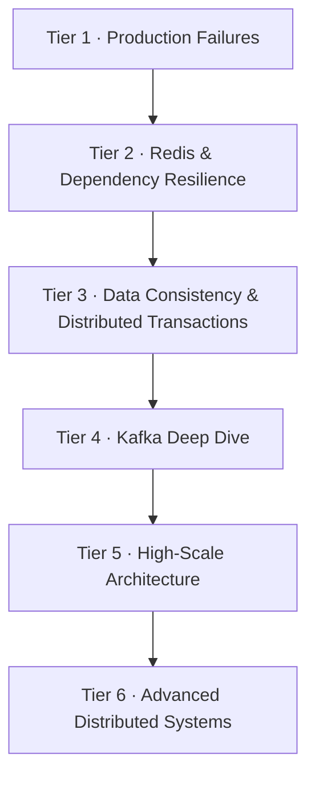

# Edge Cases — Resilience & Failure-Mode Deep Dives

Six tiers of production-failure reasoning. This is **not** a separate topic set — it's the failure-mode layer that applies to *every* design in `07-design-questions`. Learn a design there, then come here and ask "how does this break, and how do I defend it?"

> Read `07-design-questions` first for the happy path. Read these tiers to learn what happens when things are slow, duplicated, unavailable, partially failed, or recovering.

---

## The six tiers

| Tier | Covers | Read it alongside these `07` designs |
|------|--------|--------------------------------------|
| **1 · Production Failures** | incident framework, slow/down/corrupt DB, connection-pool exhaustion, retry storms, cascading failure, dual-write, duplicate events, crash-mid-request | 01 Payment, 04 Task Scheduler, 24 Digital Wallet |
| **2 · Redis & Dependency Resilience** | cache-aside, hot key, stampede, penetration, avalanche, eviction, timeout/bulkhead/circuit-breaker, backpressure | 05 Rate Limiter, 07 URL Shortener, 30 Distributed Cache, 03 Twitter Feed |
| **3 · Data Consistency & Distributed Transactions** | race conditions, optimistic/pessimistic locking, idempotency, saga, 2PC, outbox, inbox, exactly-once, reconciliation | 01 Payment, 02 Ticket Booking, 12 Inventory, 24 Digital Wallet |
| **4 · Kafka Deep Dive** | partitions, consumer groups, ordering, ISR, offsets, rebalancing, lag, DLQ, poison messages, transactions | 08 Notification, 15 Analytics, 20 Message Queue |
| **5 · High-Scale Architecture** | estimation, statelessness, sharding, hot rows, distributed counters, rate limiting, load shedding, CDN | 03 Twitter Feed, 10 News Feed, 23 Leaderboard, 26 Video Streaming |
| **6 · Advanced Distributed Systems** | CAP, quorum, leader election, split brain, fencing, clock skew, consensus, multi-region, RPO/RTO, DR | 04 Task Scheduler, 17 Key-Value Store, 25 Stock Exchange |

---

## How this connects to the rest of the guide

- The **theory** underneath these tiers (why quorums, why isolation levels, why you can't trust clocks) lives in **Track 1**: `02-distributed-data` (replication, transactions, linearizability, consensus) and `03-derived-data` (streams, exactly-once).
- The **happy-path designs** these failures apply to live in `07-design-questions`.
- The `07-design-questions/00-index.md` "Universal Reliability / Cache / Kafka / Consistency" cheat-sheets are the one-line summaries; these six tiers are their full expansion.

---

## The senior-level principle

> A distributed system is not designed only for the happy path. It's designed around what happens when things are slow, duplicated, unavailable, partially failed, or recovering.

For any component, always ask: What if it crashes? What if it's 10× slower? What if a request/event arrives twice? What if the operation succeeded but the response was lost? What if the network partitions? What if traffic is 10×? **And — most forgotten — what happens when the failed component comes back?**
