# Tier 1 — Production Failure Scenarios

## Purpose

This document is a study guide for senior backend/system-design interviews. The goal is not merely to memorize technologies, but to learn how to reason when a production system becomes slow, unavailable, inconsistent, or overloaded.

## The universal incident framework

Whenever an interviewer gives you a production failure, think:

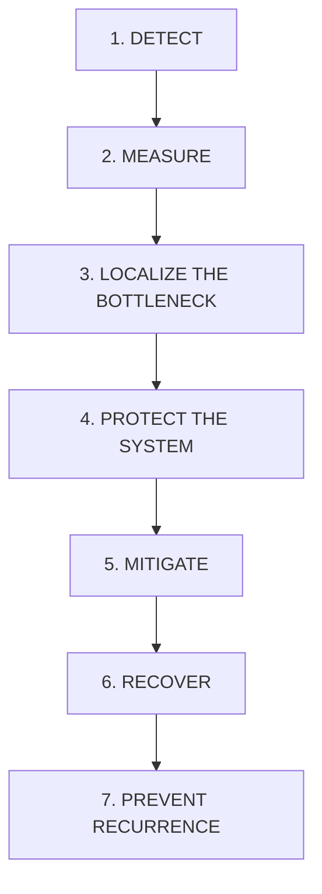

A senior engineer should avoid jumping directly to "scale it." First identify what is actually saturated.

---

# 1. Database Query Suddenly Becomes Slow

## Scenario

Normally:

```text
API P99 = 200 ms
DB query P99 = 30 ms
```

Suddenly:

```text
API P99 = 2.5 sec
DB query P99 = 1.8 sec
```

The database is likely contributing directly to the latency.

## What to measure

### Application side

Measure every DB operation as a latency histogram:

- P50
- P90
- P95
- P99
- P99.9
- error rate
- connection acquisition time

Do not rely only on average latency.

### Database side

Check:

- slow queries
- CPU
- memory
- disk I/O
- buffer/cache hit ratio
- locks
- active connections
- connection pool
- query execution plans
- rows scanned vs returned
- recent schema/index changes
- data growth
- recent deployments

## Important latency decomposition

An API can show 2 seconds while the SQL itself takes only 20 ms.

Possible breakdown:

```text
Request
  ↓
Connection acquisition = 1.7 sec
  ↓
Network = 5 ms
  ↓
DB execution = 20 ms
  ↓
Result transfer = 10 ms
  ↓
Application processing = 200 ms
```

So "DB query is slow" may actually mean "application waited to obtain a DB connection."

## Debugging sequence

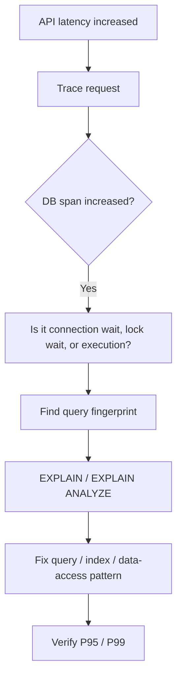

## Common causes

### Missing index

```sql
SELECT *
FROM orders
WHERE customer_id = 123;
```

If `customer_id` isn't indexed, a large table may be scanned.

### Bad execution plan

Statistics can become stale or data distribution can change.

### Lock contention

One transaction may hold a lock while many others wait.

### Data growth

A query that was fine at 1 million rows may become expensive at 500 million rows.

### Connection pool exhaustion

Example:

```text
Pool = 100 connections

95 connections already busy
5 available

100 new requests arrive
```

Most requests may wait for a connection even if the SQL itself is fast.

## Strong interview answer

> "I would first decompose the latency into connection acquisition, lock wait, query execution, network and application processing. Then I'd identify the query fingerprint and inspect its execution plan, while checking CPU, I/O, locks, connection pool and data growth. I would fix the actual bottleneck rather than simply increasing the DB size."

---

# 2. Database Goes Down

## Scenario

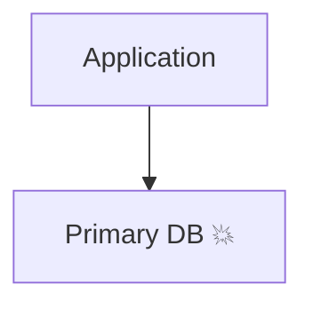

The first question is:

> Is this a single-node failure, an availability-zone failure, or a larger disaster?

## High availability

Typical architecture:

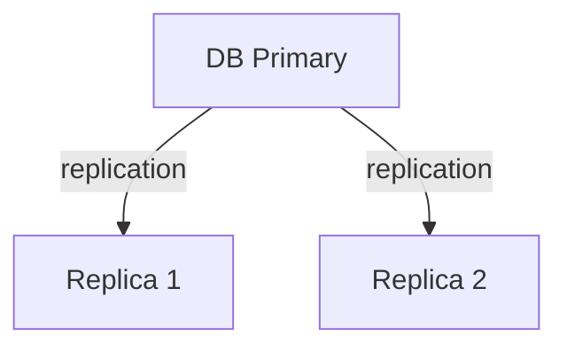

If primary fails:

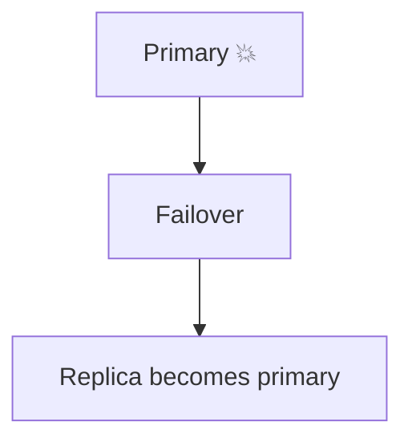

## Important distinction

Replication is mainly an **availability mechanism**.

It is not a complete disaster-recovery strategy.

If bad data is written:

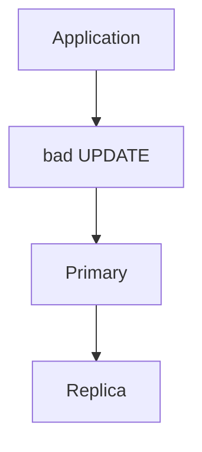

The bad update may replicate too.

Therefore:

```text
HA replication ≠ backup
```

## Protect the application

When DB is unavailable:

- use bounded DB timeouts
- fail fast where appropriate
- avoid unlimited retries
- use circuit breakers for repeated failures
- queue work if business semantics permit
- return controlled errors
- protect thread/connection pools

Do not allow every request to wait indefinitely.

## Recovery

After failover:

1. Verify new primary.
2. Verify application connectivity.
3. Check replication health.
4. Check error rate.
5. Gradually restore traffic if necessary.
6. Verify data consistency.

---

# 3. Database Corruption

This is different from a normal DB outage.

## Types

### Logical corruption

Example:

```text
Correct balance = ₹10,000

Buggy deployment:
UPDATE accounts
SET balance = 0;
```

The DB is operational but the data is wrong.

### Physical/storage corruption

Examples:

- corrupted pages
- damaged storage
- filesystem issues
- hardware problems

### Index corruption

The underlying data may be correct while an index is damaged.

### Catastrophic corruption

Large portions of the database become unusable.

## Core protection architecture

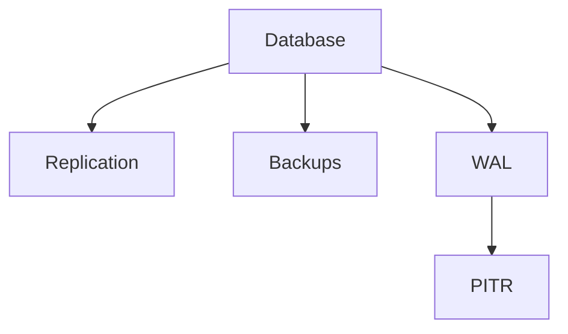

### Full backups

Periodic complete database backups.

### Incremental/differential backups

Reduce backup cost and time.

### WAL / transaction logs

Allow recovery to a particular point in time for databases that support this mechanism.

### PITR

Point-in-time recovery lets you restore to a point before corruption.

Example:

```text
10:00 healthy
10:10 healthy
10:20 buggy deployment
10:25 corruption
```

Restore to:

```text
10:19:59
```

instead of losing the whole day.

## Backup requirements

A production backup strategy should consider:

- independent storage
- cross-region copies where required
- retention
- encryption
- integrity checks
- immutable/WORM storage where appropriate
- restore testing

The key principle:

> A backup that has never been restored is only a theory.

## Recovery procedure

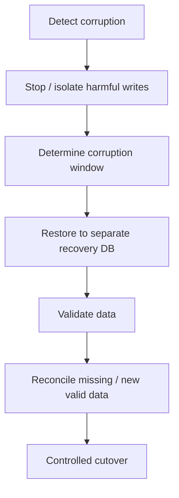

## Strong interview answer

> "Replication protects availability, but it won't necessarily protect us from logical corruption because bad writes can replicate. I would use independent backups plus transaction logs/PITR, retention and regular restore tests. During an incident I'd isolate writes, determine the corruption window, restore to a separate recovery environment, validate and reconcile, then perform a controlled cutover."

---

# 4. Database Connection Pool Exhaustion

## Scenario

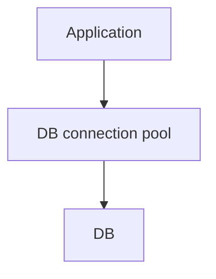

Suppose:

```text
Max connections = 100
Active = 100
Pending = 3,000
```

The DB query may be fast, but application requests wait for connections.

## Common causes

### Long-running queries

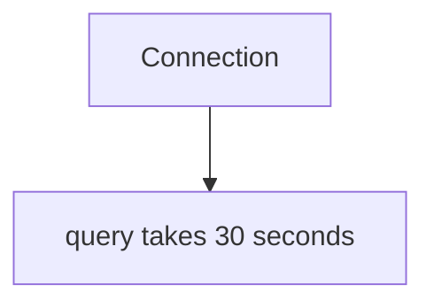

### Long transactions

A connection remains occupied because the transaction remains open.

### Connection leak

Application obtains a connection and doesn't release it correctly.

### External call while holding DB connection

Very dangerous:

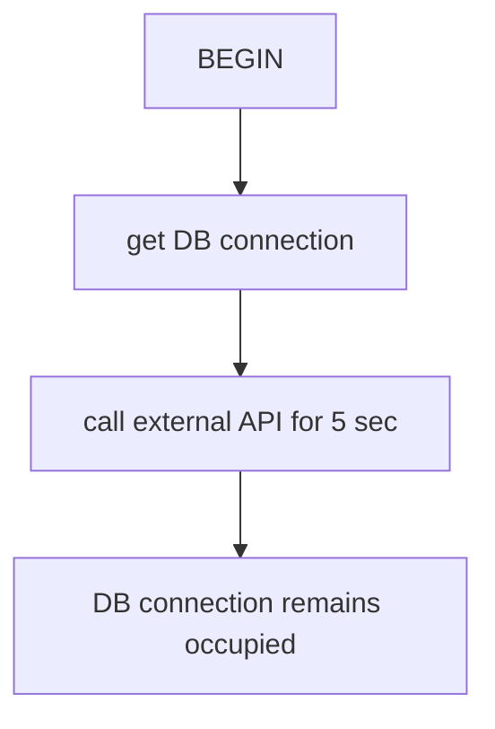

### Pool too small

Possible, but don't immediately increase it.

## Debugging

Measure separately:

```text
connection acquisition
query execution
```

Example:

```text
DB call = 2 sec
Connection wait = 1.8 sec
SQL execution = 20 ms
```

The problem is pool contention, not SQL.

## Fixes

- close resources correctly
- shorten transactions
- don't call external services inside DB transactions unless necessary
- optimize slow queries
- use bounded pool sizes
- monitor active/idle/pending
- investigate connection leaks
- tune pool only after understanding DB capacity

---

# 5. Kafka Traffic / Topic Explosion

## Scenario

You have:

```text
100 topics
```

Suddenly:

```text
1,000 topics
```

Do not immediately scale consumers.

Ask:

1. Why did topic count increase?
2. How many partitions per topic?
3. Messages/sec?
4. Consumer lag?
5. Broker resource usage?

Kafka assigns **partitions**, not topics, to consumers.

If:

```text
1,000 topics × 1 partition = 1,000 partitions
```

that is very different from:

```text
1,000 topics × 10 partitions = 10,000 partitions
```

## Consumer scaling

If:

```text
Topic = 100 partitions
Consumers = 10
```

you can increase consumers.

But:

```text
Partitions = 10
Consumers = 20
```

does not give 20-way active consumption. At most 10 consumers can have partitions assigned in that group.

## Topic-per-customer warning

If you have:

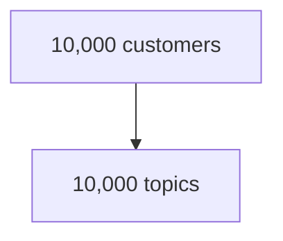

challenge the architecture.

Often:

```text
Shared topic
   +
partition key = customerId
```

is easier to operate.

## Separate workloads

If payment and analytics have different SLAs, don't necessarily put them in the same processing path.

Use separate consumer groups/services where appropriate.

## Strong interview answer

> "I wouldn't scale based on topic count alone. I'd inspect partitions, message rate, consumer lag and broker metadata/resource usage. Kafka parallelism is bounded by partitions. I'd scale consumers when partitions and downstream capacity allow it, and I'd challenge a topic-per-tenant design if the topic count is exploding."

---

# 6. Retry Storm

## Scenario

Dependency normally responds in:

```text
100 ms
```

Now it responds in:

```text
2 seconds
```

Client timeout:

```text
1 second
```

Requests timeout and retry.

If one logical request generates four physical attempts:

```text
1 original + 3 retries = 4 attempts
```

Then:

```text
1,000 logical requests/sec
→ potentially 4,000 physical requests/sec
```

## Positive feedback loop

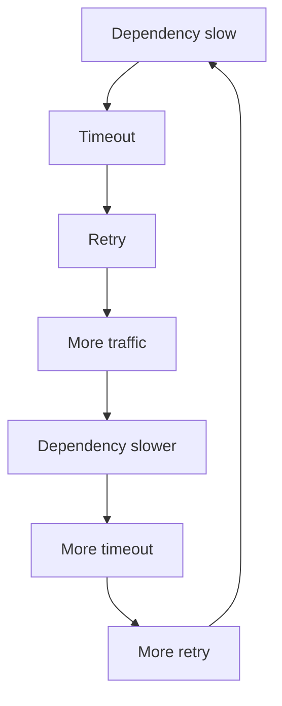

## Protection

### Bounded retries

Never retry forever.

### Exponential backoff

```text
100 ms
200 ms
400 ms
800 ms
```

### Jitter

Add randomness:

```text
100ms + random
200ms + random
400ms + random
```

This prevents synchronized retry waves.

### Circuit breaker

If dependency is clearly unhealthy:

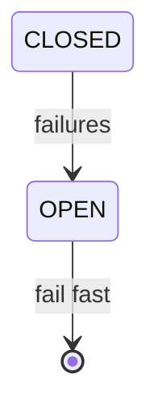

### Idempotency

Critical for operations such as payment creation.

---

# 7. Cascading Failure

## Scenario

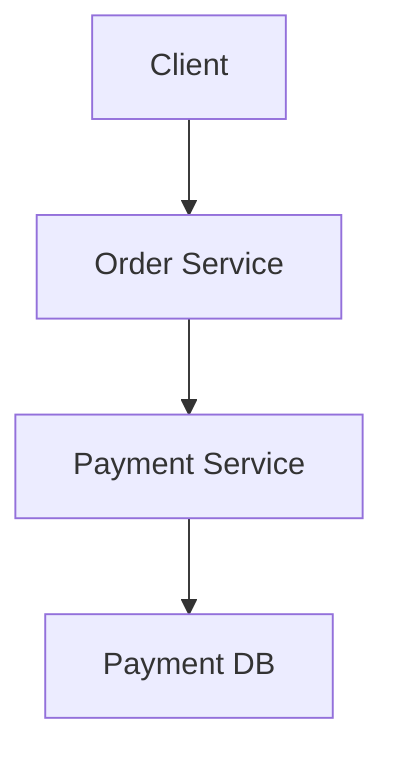

Payment DB becomes slow:

```text
20 ms → 5 sec
```

Then:

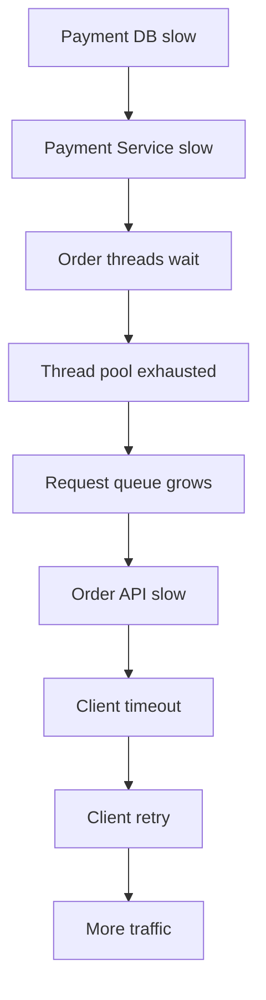

## Protection

### Timeout

Limits how long a request waits.

### Bulkhead

Limit how much of your service can be consumed by one dependency.

Example:

```text
100 Order threads

Payment concurrency = 20
```

Payment can consume at most 20 concurrent slots.

### Circuit breaker

Stops calls to an unhealthy dependency.

### Rate limiting

Protects downstream capacity.

### Async processing

If business semantics allow:

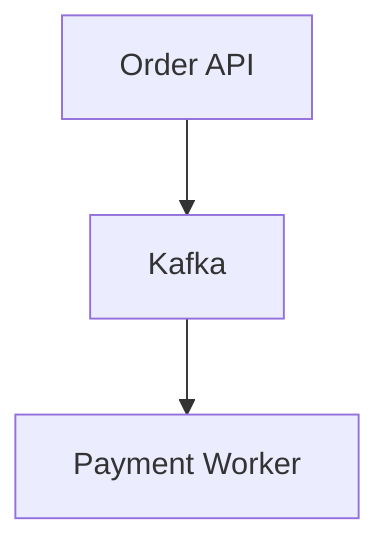

The request thread isn't held while Payment executes.

### Load shedding

Reject/deprioritize non-critical work when the system is overloaded.

## Memorize

> Timeout limits waiting. Bulkhead limits resource consumption. Circuit breaker stops calls. Backoff controls retries. Async removes synchronous waiting.

---

# 8. DB + Kafka Dual Write

## Scenario

Payment success requires:

```text
1. Update DB
2. Publish Kafka event
```

Naive:

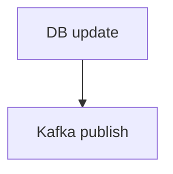

### Failure A

```text
DB SUCCESS
Kafka FAILURE
```

DB says success but consumers don't know.

### Failure B

```text
Kafka SUCCESS
DB FAILURE
```

Kafka says success but DB doesn't.

This is the **dual-write problem**.

## Transactional Outbox

Use:

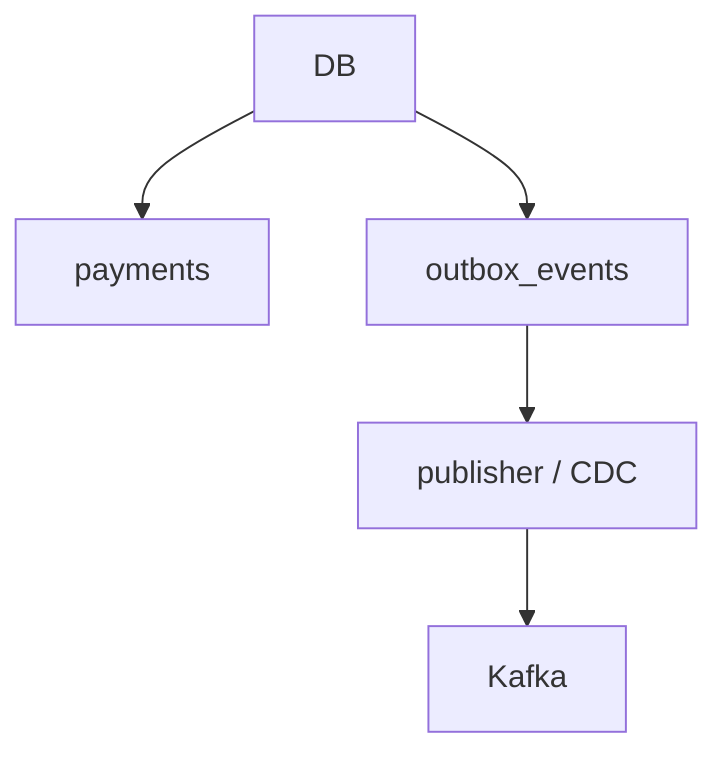

Within one DB transaction:

```sql
BEGIN;

UPDATE payments
SET status = 'SUCCESS'
WHERE payment_id = 123;

INSERT INTO outbox_events(...)
VALUES (...);

COMMIT;
```

Now business state and event intent are atomic.

## Kafka failure

The event stays pending:

```text
Outbox = PENDING
```

Publisher retries later.

## Publisher crash

Potential failure:

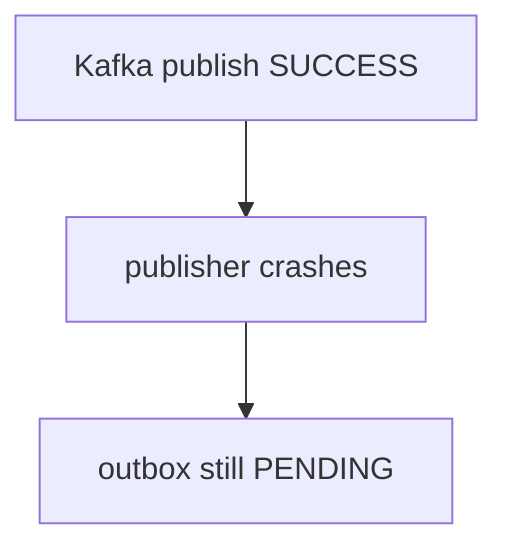

Publisher retries.

Duplicate delivery can occur.

Therefore:

> Transactional outbox + idempotent consumer.

## CDC

Instead of polling:

```mermaid
flowchart TD
    A["DB WAL"] --> B["CDC"]
    B --> C["Kafka"]
```

can be used.

---

# 9. Duplicate Kafka Events

Kafka systems commonly need to tolerate duplicate processing.

## Classic failure

```mermaid
flowchart TD
    A["Consumer receives event"] --> B["DB transaction commits"]
    B --> C["Consumer crashes"]
    C --> D["Offset not committed"]
    D --> E["Kafka redelivers"]
```

## Idempotency

Event:

```json
{
  "eventId": "evt-123",
  "paymentId": "pay-456"
}
```

Use:

```text
processed_events
----------------
event_id UNIQUE
```

Process in one DB transaction:

```text
BEGIN

insert eventId
update business state

COMMIT
```

If duplicate arrives:

```mermaid
flowchart TD
    A["eventId already exists"] --> B["ignore business operation"]
```

## Ordering

Kafka guarantees ordering within a partition.

For entity-specific ordering:

```text
key = paymentId
```

Then events for the same payment go to the same partition.

## Strong interview answer

> "I assume at-least-once processing and make the business operation idempotent. I use a unique event ID or business key, and commit the idempotency record and business update atomically."

---

# 10. Service Crashes Mid-Request

## Scenario

```mermaid
flowchart TD
    A["Client"] --> B["Payment Service"]
    B --> C["Payment Gateway"]
```

Gateway says:

```text
SUCCESS
```

Then service crashes before responding.

Client sees:

```text
TIMEOUT
```

The client doesn't know whether payment succeeded.

This is an **ambiguous outcome**.

## Idempotency key

Client sends:

```text
Idempotency-Key: abc123
```

First request:

```mermaid
flowchart TD
    A["abc123"] --> B["process"]
    B --> C["store result"]
```

Retry:

```mermaid
flowchart TD
    A["abc123"] --> B["existing result"]
    B --> C["return previous result"]
```

No second payment.

## External side effect + local DB

If:

```text
Gateway succeeds
DB update doesn't happen
```

you need reconciliation.

For example:

```mermaid
flowchart TD
    A["Gateway webhook"] --> B["Payment Service"]
    B --> C["DB"]
```

and:

```mermaid
flowchart TD
    A["Reconciliation job"] --> B["find stuck PENDING payments"]
    B --> C["query gateway"]
    C --> D["repair local state"]
```

## Key principle

For external systems, your local DB cannot always know the outcome immediately.

Design for:

- idempotency
- retries
- webhooks
- reconciliation
- explicit state machines

---

# Tier 1 Quick Revision

| Failure | Core idea |
|---|---|
| DB slow | Find exact latency component |
| DB down | HA/failover |
| DB corrupt | Backup + WAL/PITR |
| DB pool exhausted | Separate pool wait from query time |
| Kafka lag | Find consumer bottleneck before scaling |
| Kafka broker failure | Replication + ISR + leader election |
| Retry storm | Backoff + jitter + bounded retries |
| Cascading failure | Timeout + bulkhead + circuit breaker |
| DB + Kafka | Transactional outbox |
| Kafka duplicates | Idempotent consumer |
| Service crash | Idempotency + reconciliation |

## Tier 1 interview mantra

> Detect → Measure → Localize → Protect → Mitigate → Recover → Prevent.
