# Tier 1 — Production Failure Scenarios

## Purpose

This is a teaching guide, not a cheat sheet. The goal is that a junior engineer who has **never been paged at 3 a.m.** can read it top to bottom and understand *why* production systems break, *how* to reason about a failure while it's happening, and *what* the standard defences actually do.

Each scenario follows the same arc:

1. **In plain English** — what the failure is.
2. **Why it happens** — the short story of how a healthy system slides into this state.
3. **A real-world analogy** — something from everyday life, then mapped back.
4. **What's actually happening** — the mechanism, with diagrams.
5. **How to fix / protect** — every defence explained, not just named.
6. **Trade-offs** — what each fix costs.
7. **Strong interview answer** — how to say it out loud.
8. **Remember this** — one line to carry away.

The single most important habit: **do not jump to "scale it."** First find out what is actually saturated.

## The universal incident framework

Whenever an interviewer (or a real pager) throws a production failure at you, walk this loop in your head. Do not skip steps — most bad incident responses come from someone "fixing" step 5 before they understood step 3.

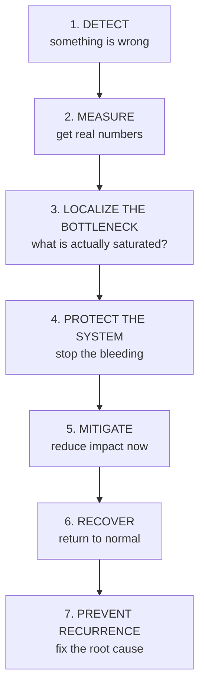

Why each step matters:

- **Detect** — you can't fix what you don't know is broken. Alerts and dashboards exist so a human learns before customers do.
- **Measure** — "it feels slow" is not actionable. "P99 went from 200 ms to 2.5 s" is.
- **Localize** — this is where seniority shows. A slow API can be caused by a slow DB, a slow *dependency of* the DB, a full connection pool, or a downstream service. Guessing wrong wastes the whole incident.
- **Protect** — before you fix the root cause, stop the failure from spreading (circuit breakers, load shedding). A small fire is easier to fight than a building on fire.
- **Mitigate** — reduce customer pain right now (failover, cache, degrade gracefully) even if the real fix comes later.
- **Recover** — bring things back deliberately, verifying as you go, not by flipping everything on at once.
- **Prevent** — the incident isn't over until it can't happen the same way again.

A senior engineer should avoid jumping directly to "add more servers." First identify what is actually saturated — CPU, disk, locks, a connection pool, a single hot partition, a fragile downstream. The rest of this document is ten concrete examples of doing exactly that.

---

# 1. Database Query Suddenly Becomes Slow

## In plain English

Yesterday your API was snappy. Today the same endpoint takes ten times longer, and every sign points at the database. Nothing in your code changed. What happened?

## Why it happens

Databases are fast until they aren't, and the tipping point is usually invisible until you cross it. A query that scanned 1 million rows in 30 ms will scan 500 million rows much more slowly — but the *code* is identical, so nobody suspects it. Or a competing transaction grabbed a lock and now everyone waits behind it. Or — the sneakiest one — the query itself is still fast, but your app can't even *get* a database connection to run it, so it sits in a queue.

The healthy-to-broken story is almost always one of: **data grew**, **a plan changed**, **something is holding a lock**, or **you ran out of connections**.

## A real-world analogy

Think of a busy restaurant kitchen.

- The **chef cooking a dish** is the SQL query executing.
- The **waiter waiting to hand the order to a chef** is your app waiting for a database connection.
- A dish that "takes forever" might mean the chef is slow — *or* it might mean every chef is busy and the order sat on the pass for two minutes before anyone even picked it up.

If you only measure "time from order to plate," you can't tell these apart. You have to measure each leg separately. That's the whole game here: **decompose the latency**.

## What's actually happening

Normally:

```text
API P99 = 200 ms
DB query P99 = 30 ms
```

Suddenly:

```text
API P99 = 2.5 sec
DB query P99 = 1.8 sec
```

The database is clearly contributing. But "the database is slow" is not one thing — it's a chain of stages, and you must find which stage grew.

### Latency decomposition — the key insight

An API can report 2 seconds even when the SQL itself runs in 20 ms. Here's a realistic breakdown:

```text
Request
  ↓
Connection acquisition = 1.7 sec   ← waited here for a free connection
  ↓
Network = 5 ms
  ↓
DB execution = 20 ms               ← the SQL was actually fast!
  ↓
Result transfer = 10 ms
  ↓
Application processing = 200 ms
```

So "DB query is slow" often really means "**the application waited to obtain a DB connection.**" If you jump to optimizing SQL, you've misdiagnosed the patient.

### Debugging sequence

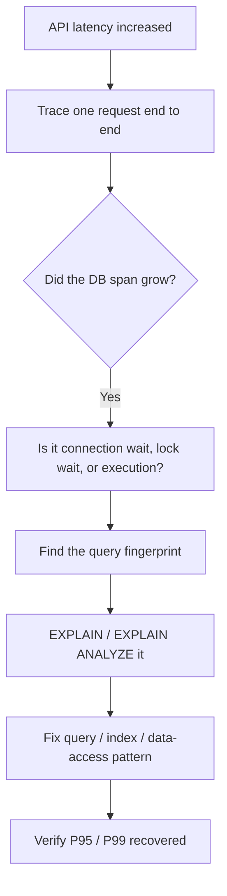

## How to fix / protect

### What to measure — application side

Record every DB operation as a **latency histogram**, not just an average, because averages hide the tail (a 5% slow rate is invisible in a mean but murders your P99):

- **P50 / P90 / P95 / P99 / P99.9** — the shape of the distribution tells you whether *everything* is slow or just the unlucky tail.
- **error rate** — a spike in errors alongside latency points at a different root cause than latency alone.
- **connection acquisition time** — the single most under-measured number; this is how you catch "the pool, not the query."

Do **not** rely on average latency alone — it lies by smoothing over the exact requests that are hurting.

### What to measure — database side

Each of these narrows down *which* kind of slow you have:

- **slow-query log** — tells you *which* statements are expensive.
- **CPU** — high CPU means the DB is compute-bound (bad plans, missing indexes).
- **memory / buffer cache hit ratio** — a falling cache hit ratio means the DB is going to disk more, which is orders of magnitude slower.
- **disk I/O** — saturated disk means every query waits on storage.
- **locks** — long lock waits mean one transaction is blocking others.
- **active connections / connection pool** — near the max means contention, not slow SQL.
- **query execution plans** — the actual strategy the DB chose; a changed plan is a common silent regression.
- **rows scanned vs returned** — scanning a million rows to return ten screams "missing index."
- **recent schema/index changes, data growth, recent deployments** — the "what changed?" trio; failures rarely appear from nowhere.

### Common causes, explained

**Missing index.**

```sql
SELECT *
FROM orders
WHERE customer_id = 123;
```

If `customer_id` isn't indexed, the DB reads the *whole* `orders` table to find matching rows. Fine at 10,000 rows, catastrophic at 500 million.

**Bad execution plan.** The optimizer picks a strategy based on statistics about your data. When those statistics go stale, or the data distribution shifts (e.g. one customer suddenly has 90% of the rows), it can pick a terrible plan for a query that used to be fine.

**Lock contention.** One long transaction holds a lock; everyone who needs that row queues behind it. The queued queries look slow, but the real culprit is the one hogging the lock.

**Data growth.** The quiet killer. Nothing changed except time and success — you just have more rows now.

**Connection pool exhaustion.**

```text
Pool = 100 connections
95 busy, 5 free
100 new requests arrive
```

95 of those requests wait for a connection **even though the SQL is fast**. (This is important enough to get its own section — see #4.)

## Trade-offs

- **Adding an index** speeds reads but slows every write (the index must be updated too) and costs disk space.
- **Increasing the connection pool** can help — or can *overwhelm* the database with more concurrent work than it can handle, making things worse. Tune it only after you understand DB capacity.
- **Optimizing a query** takes engineering time; sometimes the honest fix is caching or denormalization, which adds its own consistency complexity.

## Strong interview answer

> "I'd first decompose the latency into connection acquisition, lock wait, query execution, network, and application processing — because an API showing 2 seconds might have 20 ms of actual SQL. Then I'd identify the query fingerprint and inspect its execution plan, while checking CPU, I/O, cache hit ratio, locks, connection pool, and data growth. I'd fix the actual bottleneck rather than blindly increasing the DB size."

## Remember this

> "The database is slow" is a hypothesis, not a diagnosis. Measure each leg — the SQL is often the innocent one.

---

# 2. Database Goes Down

## In plain English

The database your whole application depends on stops answering. Every request that needs data now fails or hangs. This is one of the scariest pages because it can take everything down with it.

## Why it happens

A single database node is a single point of failure: hardware dies, disks fill, an availability zone loses power, a bad config gets deployed. A healthy system that ran on one primary DB for years is *fine right up until the moment the machine dies* — and then it's completely down, because there was nothing to fall over to.

The mature response starts with a question, not an action: **how big is this?**

> Is this a single-node failure, an availability-zone failure, or a larger disaster?

The blast radius determines the response.

## A real-world analogy

Imagine a shop with one cashier. If that cashier goes on break with no replacement, the entire checkout line stops — nobody can pay. High availability is **having a second trained cashier standing by** who can take over the register within seconds. Backups are something different: they're the **written record of every sale**, so that even if the register is destroyed, you know what was sold. Confusing these two is the classic mistake (more below).

## What's actually happening

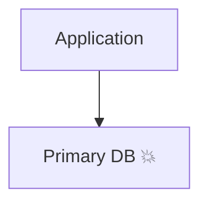

The standard defence is **replication**: the primary continuously copies its data to one or more replicas.

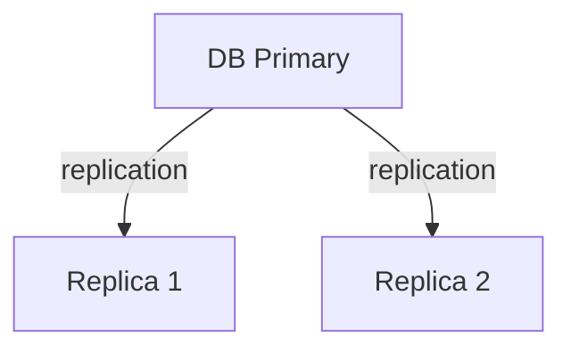

When the primary fails, a **failover** promotes a replica to become the new primary:

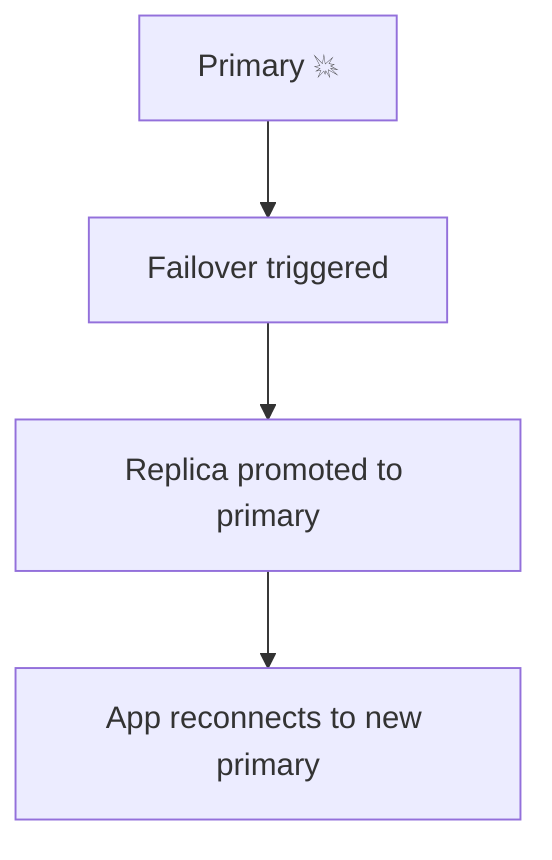

### The distinction that trips people up

Replication is an **availability** mechanism — it keeps you *serving* when a node dies. It is **not** a backup, and not a disaster-recovery strategy. Why? Because replication copies *everything*, including your mistakes.

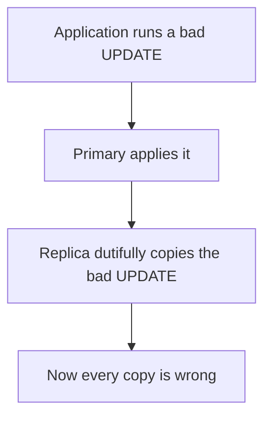

If you delete or corrupt data on the primary, the replicas cheerfully replicate that corruption. So:

```text
HA replication ≠ backup
```

You need *both*: replication for availability, independent backups for recovering from bad data (that's scenario #3).

## How to fix / protect the application

When the DB is unavailable, your job is to **fail gracefully instead of hanging**. Each of these prevents one request's problem from becoming the whole service's problem:

- **Bounded DB timeouts** — so a request gives up after (say) 2 seconds instead of waiting forever and holding a thread hostage.
- **Fail fast where appropriate** — returning an error quickly frees resources; a slow failure ties up threads and connections.
- **Avoid unlimited retries** — retrying a dead database just piles on load (see the retry storm, #6).
- **Circuit breakers** — after enough failures, stop calling the DB entirely for a while, so you don't waste resources on calls that will fail anyway.
- **Queue work if business semantics permit** — for writes that can be processed later, park them and return, instead of blocking the user.
- **Return controlled errors** — a clean 503 with a retry hint is far better than a hung request or a stack trace.
- **Protect thread/connection pools** — the whole point: don't let requests to a dead DB drain the resources your healthy paths need.

Do **not** allow every request to wait indefinitely — that's how a database outage becomes a total service outage.

## Recovery

After failover, restore trust step by step rather than flipping everything on:

1. **Verify the new primary** is actually accepting writes.
2. **Verify application connectivity** — the app must be talking to the new primary, not the dead one.
3. **Check replication health** — the surviving replicas should be re-syncing.
4. **Check error rate** — is it actually recovering?
5. **Gradually restore traffic** — ramp up so you don't slam a freshly promoted node.
6. **Verify data consistency** — confirm nothing was lost or duplicated in the failover.

## Trade-offs

- **Replicas cost money** — you're paying for standby capacity you hope never to use.
- **Automatic failover can misfire** — a network blip can trigger an unnecessary failover, or worse, a "split brain" where two nodes both think they're primary.
- **Synchronous replication** (safest, no data loss) adds write latency; **asynchronous replication** (faster) can lose the last few writes on failover. That's a real availability-vs-durability choice.

## Strong interview answer

> "First I'd scope it: single node, whole AZ, or a broader disaster. For availability I rely on replication with automated failover, but I'm careful to say replication is *not* a backup — a bad write replicates too. On the app side I bound timeouts, fail fast, cap retries, and use circuit breakers so a DB outage can't drain my thread and connection pools. On recovery I verify the new primary and replication health, then restore traffic gradually while checking consistency."

## Remember this

> Replication keeps you *up*; backups keep you *correct*. You need both, and they are not the same thing.

---

# 3. Database Corruption

## In plain English

The database is running fine — it answers queries, it's fast — but the **data inside it is wrong**. A balance that should be ₹10,000 now reads ₹0. This is scarier than an outage, because outages are obvious and corruption can go unnoticed while it spreads.

## Why it happens

Corruption comes in two flavours. **Logical corruption** is caused by *us*: a buggy deployment runs `UPDATE accounts SET balance = 0` with a missing `WHERE` clause, or a migration goes sideways. The database faithfully does what it was told — the data is wrong, but the DB is healthy. **Physical corruption** is caused by the *machine*: a failing disk, a bad memory chip, a filesystem bug flips bits on storage.

The dangerous part of logical corruption is that, as we saw in #2, **replication spreads it**. Every replica now has the wrong balance too, so you can't just fail over.

## A real-world analogy

Your bank's ledger is intact and perfectly legible — but someone erased the last three months of deposits with correction fluid. The book *works*; the *contents* are wrong. Having a photocopy of the same corrected page (a replica) doesn't help. What helps is an **older, untouched copy of the ledger** (a backup) plus a **journal of every transaction since** (the transaction log), so you can rebuild the correct state up to the moment just before the mistake.

## What's actually happening

### Logical corruption

```text
Correct balance = ₹10,000

Buggy deployment runs:
UPDATE accounts
SET balance = 0;     -- forgot the WHERE clause
```

The DB is operational; the data is destroyed.

### Physical / storage corruption

Corrupted pages, damaged storage, filesystem issues, hardware faults. The bytes on disk no longer represent valid data.

### Index corruption

The underlying table data is correct, but an index pointing into it is damaged — queries return wrong or missing results even though the "truth" is intact. Often fixable by rebuilding the index.

### Catastrophic corruption

Large portions of the database become unusable at once.

## How to fix / protect

The core protection architecture layers several independent safety nets:

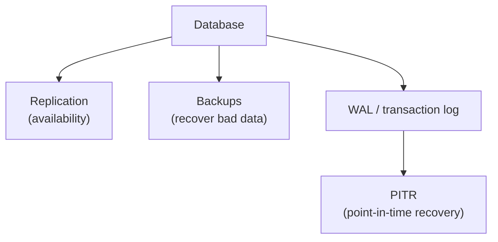

- **Full backups** — a complete periodic snapshot; your baseline to restore from.
- **Incremental / differential backups** — capture only what changed since the last backup, so you can back up frequently without huge cost or time.
- **WAL / transaction logs** — the database's running journal of every change. Combined with a backup, it lets you replay history up to a chosen instant.
- **PITR (point-in-time recovery)** — the payoff: restore to a specific moment *before* the corruption.

### PITR in action

```text
10:00 healthy
10:10 healthy
10:20 buggy deployment goes out
10:25 corruption detected
```

Instead of losing the whole day, you restore to:

```text
10:19:59
```

— the last healthy instant before the bad deploy.

### Backup requirements — and why each matters

- **Independent storage** — a backup on the same disk as the DB dies *with* the DB. It must live elsewhere.
- **Cross-region copies** — protects against an entire region/datacenter loss.
- **Retention** — you may not detect corruption for days, so backups must go back far enough.
- **Encryption** — backups contain all your data; they're a juicy target.
- **Integrity checks** — verify the backup itself isn't corrupt.
- **Immutable / WORM storage** — so ransomware or a bad actor can't delete or alter your backups.
- **Restore testing** — the whole point below.

The single most important principle:

> A backup that has never been restored is only a theory.

Many teams discover during a real incident that their backups were empty, unreadable, or missing a critical table. **Test restores regularly.**

### Recovery procedure

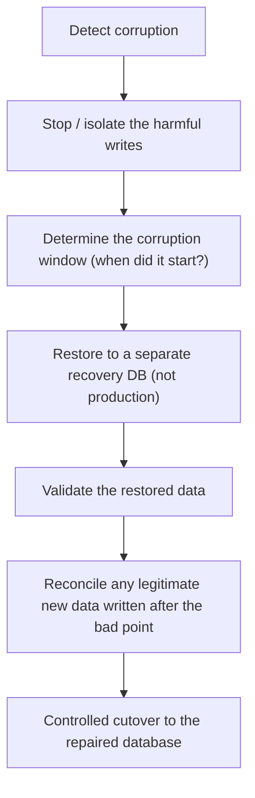

The tricky middle step: any *good* data written between the corruption and detection (10:20–10:25) isn't in your 10:19:59 restore. You have to reconcile it back in — that's why you restore to a *separate* environment first and validate before cutting over.

## Trade-offs

- **More frequent backups + longer retention** = more storage cost, but a smaller data-loss window.
- **PITR** requires keeping WAL, which consumes space and adds operational complexity.
- **Restoring** is slow; a large database can take hours to restore, which is real downtime you must plan for (this is your RTO/RPO conversation).

## Strong interview answer

> "Replication protects availability, but it won't protect us from logical corruption, because a bad write replicates. So I rely on independent backups plus transaction logs and PITR, with retention, immutability, and — crucially — regular restore tests, since an untested backup is just a theory. During an incident I isolate the harmful writes, determine the corruption window, restore to a *separate* recovery environment, validate and reconcile any good data written after the bad point, then do a controlled cutover."

## Remember this

> Replication copies your mistakes. Only backups + transaction logs let you rewind time to just before the mistake.

---

# 4. Database Connection Pool Exhaustion

## In plain English

Your database is healthy and your queries are fast, yet requests are timing out. The bottleneck isn't the database — it's that your application has run out of *connections* to talk to the database, and everyone is queued up waiting for one.

## Why it happens

Opening a database connection is expensive, so applications keep a fixed **pool** of them (say 100) and share them. This works beautifully until connections stop being returned quickly enough. A single slow query, a transaction left open too long, a leaked connection that never gets closed, or an external API call made *while holding* a connection — any of these ties up a connection far longer than it should, and the pool drains.

The trap: the symptom ("requests slow") looks identical to "the database is slow," but the fix is completely different.

## A real-world analogy

A pharmacy has 100 pickup counters. If each customer collects their prescription in 30 seconds, the line moves fast. But if one customer stands at a counter for 30 *minutes* arguing with the pharmacist, that counter is dead. Ten such customers and you've lost 10 counters; the rest of the line crawls — not because the pharmacists are slow, but because the **counters are all occupied**. The connection pool is the set of counters. A slow query, a long transaction, or a leak is the customer who won't leave.

## What's actually happening

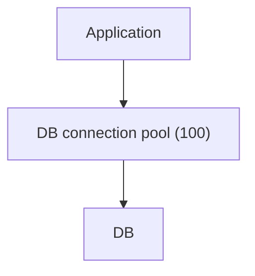

```text
Max connections = 100
Active = 100
Pending = 3,000   ← 3,000 requests all waiting for a free connection
```

The query might take 5 ms, but a request could wait 1.8 seconds just to *get* a connection.

### Common causes, explained

**Long-running queries** — a connection is held for the whole query, so a 30-second query occupies its connection for 30 seconds.

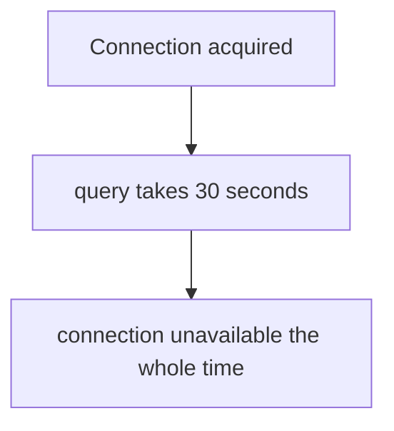

**Long transactions** — even if individual statements are fast, a connection stays checked out from `BEGIN` to `COMMIT`. Long transactions = long occupancy.

**Connection leak** — the app grabs a connection and never returns it to the pool (a missing `finally`/`close`). Every leak permanently shrinks the pool until you restart.

**External call while holding a DB connection** — the dangerous one:

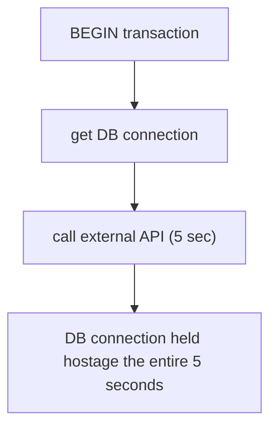

You've coupled your DB pool's health to a *third party's* latency. If that API slows down, your pool drains — and you didn't even change your database.

**Pool too small** — genuinely possible, but resist increasing it first; it's usually the *symptom's* scapegoat, not the cause.

### Debugging — measure the two legs separately

```text
DB call = 2 sec
  Connection wait = 1.8 sec   ← the real problem
  SQL execution   = 20 ms     ← perfectly healthy
```

When connection-wait dwarfs execution time, the diagnosis is **pool contention, not slow SQL**.

## How to fix / protect

- **Close resources correctly** (use `try-with-resources` / `finally` / context managers) — plugs leaks, the most common root cause.
- **Shorten transactions** — do the minimum inside `BEGIN…COMMIT`; every millisecond inside a transaction is a millisecond a connection is unavailable.
- **Don't call external services inside DB transactions** — decouples your pool from third-party latency.
- **Optimize slow queries** — shorter queries free connections sooner.
- **Use bounded pool sizes** — an unbounded pool just moves the contention onto the database itself.
- **Monitor active / idle / pending counts** — pending climbing while active sits at max is the signature of exhaustion.
- **Investigate connection leaks** — a slowly shrinking effective pool that only a restart fixes is a leak until proven otherwise.
- **Tune the pool only after understanding DB capacity** — a pool bigger than the DB can handle just relocates the pain.

## Trade-offs

- **A bigger pool** helps contention but can overload the database (more concurrent queries than it can serve) and consume more DB memory. The pool should be sized to the *database's* capacity, not the app's optimism.
- **Shortening transactions** sometimes means giving up the convenience of doing everything in one atomic block, forcing you to handle partial-failure cases explicitly.

## Strong interview answer

> "I'd measure connection-acquisition time separately from execution time — a 2-second DB call is often 1.8 seconds of waiting for a connection and 20 ms of actual SQL, which means the problem is pool contention, not the query. Then I'd hunt the cause: leaks from unclosed connections, long transactions, slow queries, or the classic anti-pattern of calling an external API while holding a DB connection. I'd fix those and monitor active/idle/pending, and only resize the pool once I understand the database's real capacity."

## Remember this

> A full pool with fast queries means the problem is *holding time*, not query time. Find who won't let go of the connection.

---

# 5. Kafka Traffic / Topic Explosion

## In plain English

Your Kafka setup suddenly has ten times as many topics (or messages) as before. Consumers are falling behind. The tempting reaction — "add more consumers!" — is often exactly wrong until you understand *why* it grew and *how* Kafka actually parallelizes work.

## Why it happens

Topic counts explode for a reason, and the reason usually reveals the real fix. The most common culprit is a **topic-per-tenant** design: someone decided every customer gets their own topic, so 10,000 customers means 10,000 topics — and now Kafka is groaning under metadata it was never meant to hold. Alternatively, message *rate* spiked, or partitions were over-provisioned. The point is: the number of topics tells you almost nothing on its own.

## A real-world analogy

Kafka is a postal sorting office. **Topics** are like mailboxes, but the actual unit of work is the **partition** — think of it as a conveyor belt. A **consumer** is a worker, and each worker can be assigned one or more belts, but **a single belt is only ever worked by one worker in a group.** So if you have 10 belts and hire 20 workers, 10 of them stand idle — you can't split a belt. Adding workers only helps if you have belts for them to stand at. "1,000 mailboxes" is meaningless; "how many conveyor belts?" is the real question.

## What's actually happening

You had:

```text
100 topics
```

Suddenly:

```text
1,000 topics
```

Before scaling, ask:

1. **Why did the topic count increase?** (Often a design smell like topic-per-customer.)
2. **How many partitions per topic?** (Partitions, not topics, drive parallelism.)
3. **Messages/sec?** (Throughput, not topic count, drives load.)
4. **Consumer lag?** (Are consumers actually behind, or just numerous?)
5. **Broker resource usage?** (CPU, disk, network, and metadata pressure.)

The critical fact:

> Kafka assigns **partitions** to consumers, not topics.

So these two are wildly different situations:

```text
1,000 topics × 1  partition =  1,000 partitions
1,000 topics × 10 partitions = 10,000 partitions
```

### Consumer scaling — bounded by partitions

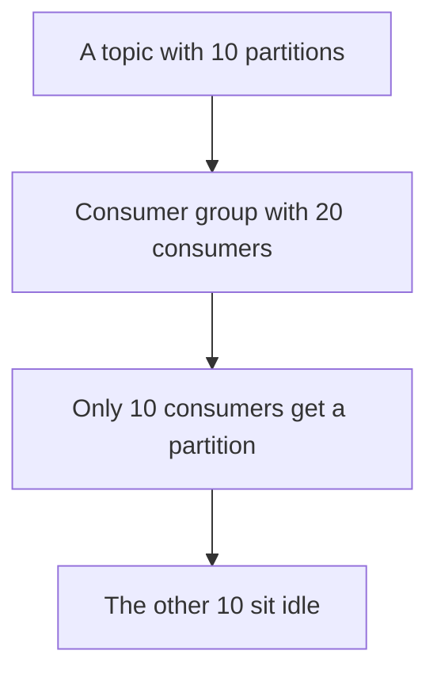

If you have 100 partitions and 10 consumers, you *can* usefully scale up — there's room. But:

```text
Partitions = 10
Consumers = 20
```

does **not** give 20-way parallelism. At most 10 consumers in that group can be assigned a partition; the rest are dead weight.

### The topic-per-customer warning

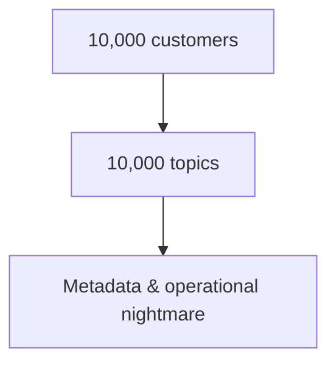

When you see this, **challenge the architecture**. Usually the better design is:

```text
One shared topic
   +
partition key = customerId
```

Now all of one customer's messages land on the same partition (preserving their order), but you operate a handful of topics instead of thousands.

### Separate workloads by SLA

If payments and analytics flow through Kafka but have very different urgency, don't force them down the same processing path — a flood of analytics events shouldn't delay a payment. Use **separate consumer groups or services** so a slow, low-priority workload can't starve a critical one.

## How to fix / protect

- **Diagnose before scaling** — establish partitions, message rate, lag, and broker health first.
- **Add consumers only up to the partition count** — beyond that, they're idle.
- **Add partitions if you need more parallelism** — but note repartitioning can disturb ordering and key distribution.
- **Collapse topic-per-tenant into shared topics + partition keys** — fixes the root cause of explosion.
- **Isolate workloads by SLA** — separate consumer groups keep critical paths fast.

## Trade-offs

- **More partitions** = more parallelism, but also more open files, more rebalancing cost, and more end-to-end latency overhead per partition on the brokers.
- **Shared topic + partition key** simplifies operations but means a single hot customer can overload one partition (a hot-key problem).
- **Separate consumer groups** improve isolation but add deployment and monitoring surface area.

## Strong interview answer

> "I wouldn't scale on topic count alone. I'd inspect partitions, message rate, consumer lag, and broker resource/metadata usage — because Kafka parallelism is bounded by *partitions*, not topics: 20 consumers on 10 partitions leaves 10 idle. I'd add consumers only up to the partition count, add partitions if I truly need more parallelism, and if topics are exploding I'd challenge a topic-per-tenant design in favour of a shared topic keyed by customerId. I'd also isolate workloads with different SLAs into separate consumer groups."

## Remember this

> Kafka's unit of parallelism is the partition, not the topic. More consumers than partitions just buys you idle consumers.

---

# 6. Retry Storm

## In plain English

A dependency gets a little slow, so clients time out and retry. Those retries pile *more* load onto the already-struggling dependency, making it slower, causing more timeouts, causing more retries. The system attacks itself. A minor blip snowballs into a full outage.

## Why it happens

Retries are usually a *good* thing — they paper over transient blips. But retries have a dark side: they only help if the failure is transient. When the dependency is genuinely overloaded, every retry is extra load on the exact thing that's drowning. Without limits, backoff, or jitter, well-intentioned retry logic becomes a self-inflicted denial-of-service attack.

## A real-world analogy

Everyone's calling a customer-support line. The line is busy, so callers immediately hang up and redial — all at once, over and over. Now the phone system is flooded not with *new* callers but with the *same* callers redialing furiously, and it can never catch up. The fix isn't more phone lines; it's telling callers "wait a bit before redialing, and don't all redial at the same instant."

## What's actually happening

```text
Dependency normally responds in 100 ms
Now it responds in 2 seconds
Client timeout = 1 second
```

Requests hit the 1-second timeout and retry. If each logical request becomes four physical attempts:

```text
1 original + 3 retries = 4 attempts
```

then:

```text
1,000 logical requests/sec
→ up to 4,000 physical requests/sec hitting the struggling dependency
```

You just *quadrupled* load on the thing that was already too slow.

### The positive feedback loop

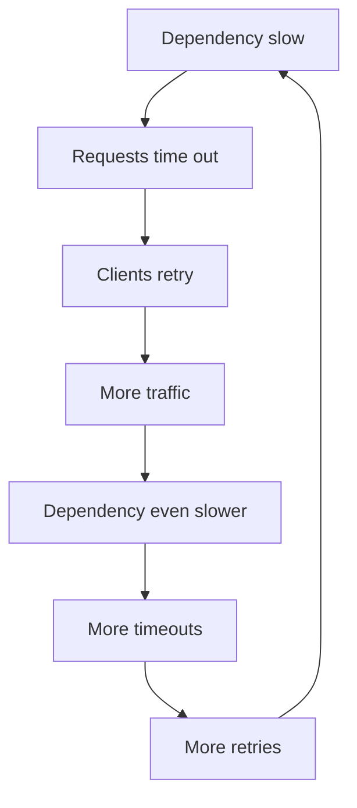

This loop has no natural brake. Something must interrupt it.

## How to fix / protect

**Bounded retries.** Never retry forever — cap it at, say, 3 attempts. This puts a ceiling on the amplification factor.

**Exponential backoff.** Wait longer between each retry so you give the dependency room to recover instead of hammering it:

```text
100 ms → 200 ms → 400 ms → 800 ms
```

**Jitter.** Add randomness to those waits so that all your clients don't retry in synchronized waves:

```text
100ms + random
200ms + random
400ms + random
```

Without jitter, a thousand clients that failed at the same instant will all retry at the same instant — a "thundering herd." Jitter smears them out.

**Circuit breaker.** When a dependency is clearly unhealthy, stop calling it entirely for a while and fail fast — don't waste effort on calls that will fail anyway.

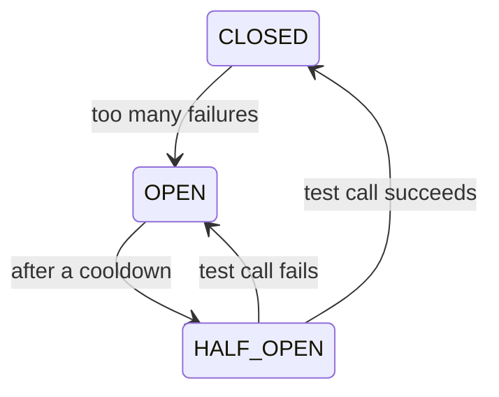

In the OPEN state, calls fail immediately without touching the dependency, giving it space to recover. After a cooldown it lets a trickle through (HALF_OPEN) to test the waters.

**Idempotency.** Retries mean the same operation may run more than once. For anything with side effects (creating a payment!), you *must* make repeated attempts safe, or a retry storm becomes a *double-charge* storm (see #9 and #10).

## Trade-offs

- **Backoff adds latency** — a legitimately transient error now takes longer to recover from because you deliberately waited.
- **Circuit breakers can be too eager** — trip on a brief blip and you reject requests that would have succeeded.
- **Bounded retries mean some requests fail** that an infinite retry might eventually have served — you trade a little success rate for system stability.

## Strong interview answer

> "Retries help with transient failures but amplify overload — if one logical request becomes four attempts, 1,000 rps can become 4,000 rps against a dependency that's already struggling, creating a feedback loop. So I bound retries, add exponential backoff to give the dependency room to recover, and jitter so clients don't retry in synchronized waves. I add a circuit breaker to fail fast when the dependency is clearly down, and I make operations idempotent so retries don't cause duplicate side effects."

## Remember this

> Naive retries turn a small slowdown into a self-inflicted DDoS. Bound them, back off, and jitter.

---

# 7. Cascading Failure

## In plain English

One component gets slow, and the slowness *spreads upstream* — service by service — until the whole system is down. It's a chain reaction: the failure of one part exhausts the resources of the part that calls it, which exhausts *its* caller, and so on.

## Why it happens

Services call other services synchronously, and a caller holds a thread (and often a connection) while it waits for a reply. When the callee slows down, those threads pile up waiting. Threads are finite — once the caller's thread pool is full, *it* can't serve anyone, so it looks broken to *its* caller. The failure climbs the call graph like a rising flood. And clients retrying (scenario #6) pour more water in.

## A real-world analogy

Highway traffic. One stalled car in the rightmost lane makes cars merge left. That slows the left lane, so cars behind slow, so cars behind *them* slow — and soon there's a jam stretching miles back from a single stalled car. The original problem is tiny; the *propagation* is what causes the gridlock. Timeouts, bulkheads, and circuit breakers are the guardrails that keep one stalled car from jamming the whole highway.

## What's actually happening

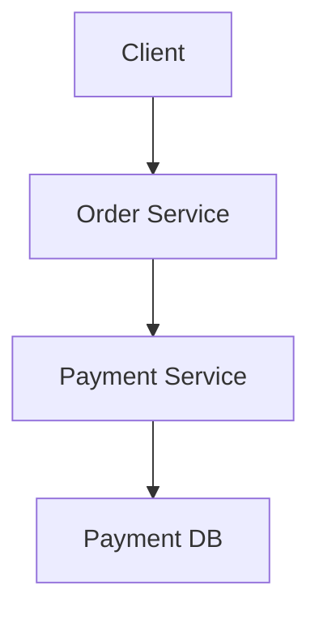

The Payment DB slows down:

```text
20 ms → 5 sec
```

And the flood rises upstream:

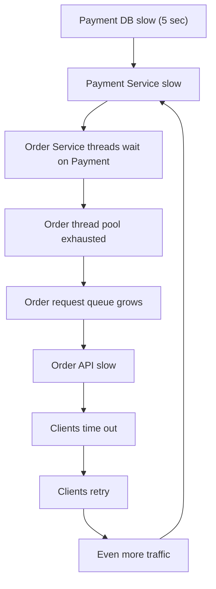

Notice the loop at the end — the retry storm (#6) feeds the cascade.

## How to fix / protect

Each defence stops the flood at a different point:

**Timeout** — limits *how long* a request will wait. Without it, an Order thread waits 5 seconds on Payment; with a 500 ms timeout, it gives up fast and frees the thread. This is the single most important guardrail.

**Bulkhead** — limits *how much* of your service one dependency can consume, like watertight compartments in a ship so one flooded compartment doesn't sink the whole vessel.

```text
100 Order threads total
Payment calls limited to 20 concurrent slots
```

Now even if Payment hangs completely, it can tie up at most 20 threads — the other 80 keep serving traffic that doesn't need Payment.

**Circuit breaker** — *stops* calling an unhealthy dependency entirely, so you're not spending threads on calls that will fail anyway.

**Rate limiting** — caps the load reaching a downstream so it can't be pushed past its capacity in the first place.

**Async processing** — removes the synchronous wait altogether. If the business allows it, hand the work to a queue and return immediately:

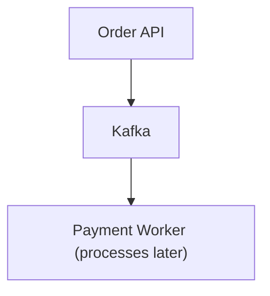

Now the Order request thread isn't held hostage while Payment runs — it publishes an event and moves on.

**Load shedding** — when overloaded, deliberately reject or deprioritize non-critical work to protect the critical paths. Better to serve 80% of important traffic than to fail 100% of everything.

## Trade-offs

- **Tight timeouts** can abandon requests that were *just about* to succeed.
- **Bulkheads** mean you provision capacity per-dependency, which can leave some capacity idle when only one dependency is busy.
- **Async processing** changes the user experience (the result is no longer immediate) and requires idempotency and status-tracking machinery.
- **Load shedding** means *someone* gets rejected on purpose — you must choose whom, which is a product decision.

## Memorize

> **Timeout** limits waiting. **Bulkhead** limits resource consumption. **Circuit breaker** stops calls. **Backoff** controls retries. **Async** removes synchronous waiting.

## Strong interview answer

> "Cascading failure is a slow dependency exhausting its caller's threads, which exhausts *its* caller, propagating up the call graph — often amplified by client retries. I contain it with timeouts so threads don't wait indefinitely, bulkheads so one dependency can only consume a bounded slice of my thread pool, and circuit breakers so I stop calling something that's clearly down. Where the business allows, I make the call async through a queue so the request thread isn't held at all, and I add load shedding to protect critical paths under overload."

## Remember this

> One slow dependency can sink everything above it. Timeouts and bulkheads are the watertight doors that stop the flood from spreading.

---

# 8. DB + Kafka Dual Write

## In plain English

A single business action needs to do *two* things: update your database **and** publish an event to Kafka. But these are two separate systems, and you can't wrap them in one transaction. If one succeeds and the other fails, your database and your event stream disagree about what happened.

## Why it happens

The naive code writes to the DB, then publishes to Kafka, as two independent steps. There is *always* a moment between them where a crash or a network failure can strike. There's no way to make "write DB" and "publish Kafka" atomic across two systems — so any code that just does them one after the other has a lurking inconsistency bug.

## A real-world analogy

You mail a cheque to a friend and also text them "I sent it." If the text fails to send but the cheque was mailed, your friend gets money they didn't expect. If the text sends but the cheque gets lost, your friend waits for money that never arrives. You wanted both to happen together, but the mailbox and the phone network are separate systems with no shared "commit." The fix, as we'll see, is to write the *intent to text* on the same cheque envelope — one atomic action — and have a helper send the text later.

## What's actually happening

A payment success requires:

```text
1. Update the DB (mark payment SUCCESS)
2. Publish a Kafka event (so downstream systems react)
```

The naive approach:

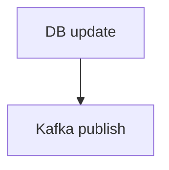

**Failure A:**

```text
DB SUCCESS
Kafka FAILURE
```

The DB says the payment succeeded, but no event was published — so downstream systems (fulfillment, notifications) never find out.

**Failure B:**

```text
Kafka SUCCESS
DB FAILURE
```

An event says the payment succeeded, but the DB never recorded it — downstream acts on a payment your own database doesn't believe in.

This is the **dual-write problem**: two systems, no shared transaction, guaranteed inconsistency window.

## How to fix / protect: the Transactional Outbox

The trick: make the event *part of the same database transaction* as the business change. Instead of publishing to Kafka directly, you **insert the event into an `outbox_events` table in the same DB transaction**. A separate publisher reads that table and sends to Kafka afterward.

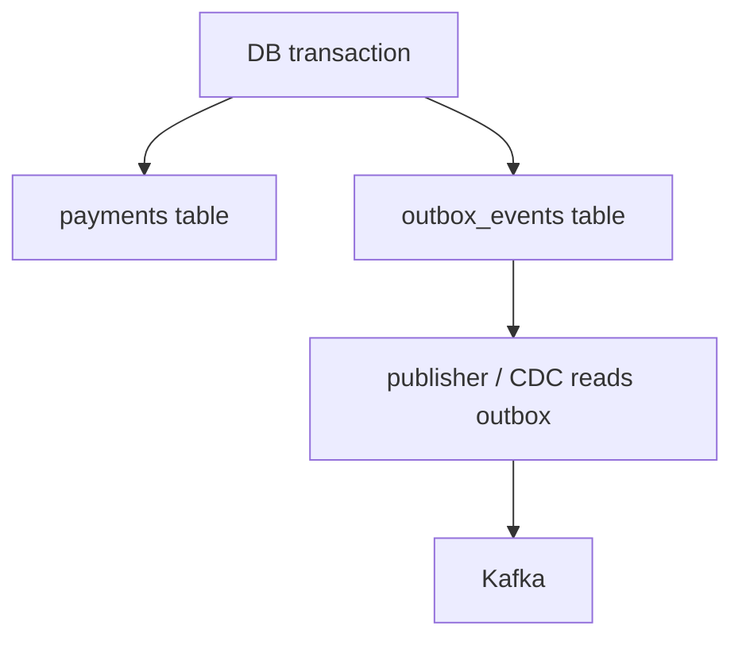

Within one atomic DB transaction:

```sql
BEGIN;

UPDATE payments
SET status = 'SUCCESS'
WHERE payment_id = 123;

INSERT INTO outbox_events(...)
VALUES (...);

COMMIT;
```

Now the business state *and* the intent to publish an event commit together — they can't diverge. Either both are written or neither is.

### What if Kafka is down when the publisher runs?

No problem — the event simply stays in the outbox:

```text
Outbox row = PENDING
```

The publisher retries later. The event is safely persisted; it will get out eventually.

### What if the publisher crashes after publishing but before marking the row sent?

```mermaid
flowchart TD
    A["Publisher sends to Kafka: SUCCESS"] --> B["Publisher crashes before marking row 'sent'"]
    B --> C["Outbox row still says PENDING"]
    C --> D["Publisher restarts and sends it AGAIN"]
```

So you can get a **duplicate delivery**. This is fine — you plan for it — but it means the recipe is two parts:

> **Transactional outbox** (never lose an event) **+ idempotent consumer** (tolerate duplicates). See #9.

### CDC — an alternative to polling the outbox

Instead of a publisher polling the outbox table, you can read the database's own write-ahead log directly with **Change Data Capture**:

```mermaid
flowchart TD
    A["DB WAL (write-ahead log)"] --> B["CDC connector (e.g. Debezium)"]
    B --> C["Kafka"]
```

CDC streams committed changes straight to Kafka with no polling and no separate outbox writes — though it adds its own infrastructure to run and monitor.

## Trade-offs

- **The outbox adds a table and a publisher process** — more moving parts and a small publish latency (the event goes out *after* the transaction, not during).
- **Polling the outbox** adds DB load; too-frequent polling is wasteful, too-infrequent adds latency.
- **CDC** removes polling but couples you to database internals and requires operating a CDC pipeline.
- **Either way you inherit duplicates**, so consumers *must* be idempotent — that's non-negotiable, not optional.

## Strong interview answer

> "You can't make a DB write and a Kafka publish atomic across two systems, so a naive write-then-publish leaves an inconsistency window. I use the transactional outbox: within the same DB transaction I update the business row *and* insert an event into an outbox table, so they commit together. A separate publisher (or CDC off the WAL) ships those events to Kafka and retries if Kafka is down. Because the publisher can crash after publishing, delivery is at-least-once, so I pair the outbox with idempotent consumers."

## Remember this

> Two systems can't share a transaction — so write the event into the *one* system that can (your DB), and ship it out afterward.

---

# 9. Duplicate Kafka Events

## In plain English

Kafka (and most messaging systems) will sometimes deliver the same event more than once. If your consumer naively acts on every delivery, you'll process the same payment twice, send two emails, or double-count. You must design so that receiving an event twice has the same effect as receiving it once.

## Why it happens

Kafka's default guarantee is **at-least-once** delivery. A consumer reads an event, does its work, then commits its "offset" (its bookmark saying "I've processed up to here"). If the consumer crashes *after* doing the work but *before* committing the offset, Kafka has no record that the work was done — so on restart it redelivers the same event. Combine that with the outbox's at-least-once publishing (#8), and duplicates are simply a fact of life, not an edge case.

## A real-world analogy

The post office sometimes delivers two copies of the same bill (a re-send crossed in the mail with the original). A careful person checks the invoice number: "I already paid invoice #4471 — ignore this second copy." A careless person pays it twice. The invoice number is the **idempotency key**; checking it before acting is what makes duplicate delivery harmless.

## What's actually happening

The classic duplication path:

```mermaid
flowchart TD
    A["Consumer receives event"] --> B["Business DB transaction commits"]
    B --> C["Consumer crashes before committing offset"]
    C --> D["Offset was never committed"]
    D --> E["Kafka redelivers the same event on restart"]
```

The work was done, but Kafka doesn't know it, so it sends the event again.

## How to fix / protect: idempotency

Every event carries a stable unique identifier:

```json
{
  "eventId": "evt-123",
  "paymentId": "pay-456"
}
```

Keep a table of already-processed events with a **unique constraint**:

```text
processed_events
----------------
event_id  UNIQUE
```

Then process the event and record its ID **in the same DB transaction**:

```text
BEGIN

INSERT event_id INTO processed_events   -- fails if already present
UPDATE business state

COMMIT
```

If a duplicate arrives, the `INSERT` violates the unique constraint, the transaction rolls back, and the business update is skipped:

```mermaid
flowchart TD
    A["Duplicate event arrives"] --> B["event_id already in processed_events"]
    B --> C["Unique constraint blocks the insert"]
    C --> D["Skip the business operation — no double effect"]
```

Doing the dedup-record insert and the business update **atomically** is what makes this bulletproof — you can't end up having done one but not the other.

### Ordering — a related concern

Kafka only guarantees ordering *within a single partition*. If order matters for a given entity (e.g. all events for one payment must be processed in sequence), route them to the same partition by using that entity as the key:

```text
key = paymentId
```

Now every event for `pay-456` lands on the same partition and is delivered in order.

## Trade-offs

- **The dedup table grows** — you need a retention/cleanup strategy (e.g. TTL on old event IDs) or it balloons.
- **The extra insert + uniqueness check** adds a little write cost to every event.
- **Keying by entity for ordering** can create hot partitions if one entity is far busier than others.

## Strong interview answer

> "I assume at-least-once delivery, so I make the business operation idempotent. Each event has a stable unique ID or business key; I insert that ID into a `processed_events` table with a unique constraint *and* apply the business update in the same DB transaction. A duplicate fails the uniqueness check and rolls back harmlessly. Where per-entity ordering matters, I key the events by that entity so they share a partition."

## Remember this

> Assume every event can arrive twice. Make "process it again" a no-op by committing a dedup key and the business change together.

---

# 10. Service Crashes Mid-Request

## In plain English

Your service calls an external system (say a payment gateway), the external system succeeds — and then your service crashes *before* it can record the result or reply to the client. The client sees a timeout and has no idea whether the payment went through. This is an **ambiguous outcome**: you genuinely don't know the state.

## Why it happens

The moment you make a side effect happen in a *system you don't control* (charging a card, sending money), there's a window where that effect has occurred but your own records haven't caught up. A crash, a network drop, or a timeout in that window leaves you unable to tell "it succeeded, I just didn't hear back" from "it never happened." Distributed systems can't make a remote side effect and a local record atomic, so this ambiguity is fundamental, not a bug you can code away.

## A real-world analogy

You tap your card at a shop. The terminal beeps "approved," then the shop's till loses power before printing the receipt. Did the payment go through? From the shop's side, unknown — their record didn't save, but your bank may have already moved the money. The resolution the shop uses is the same one we use in software: a **unique transaction reference** so a re-attempt can be recognized as the *same* payment rather than a new one, plus **reconciliation** against the bank later to settle the truth.

## What's actually happening

```mermaid
flowchart TD
    A["Client"] --> B["Payment Service"]
    B --> C["Payment Gateway"]
```

The gateway returns:

```text
SUCCESS
```

Then the Payment Service crashes before responding. The client sees:

```text
TIMEOUT
```

The client cannot tell whether the payment succeeded. If it blindly retries, it may pay **twice**.

## How to fix / protect

### Idempotency key

The client attaches a unique key to the request:

```text
Idempotency-Key: abc123
```

On the **first** request, the service processes it and stores the result under that key:

```mermaid
flowchart TD
    A["Request with key abc123"] --> B["Process the payment"]
    B --> C["Store result under abc123"]
```

On a **retry** with the same key, the service recognizes it and returns the *stored* result instead of charging again:

```mermaid
flowchart TD
    A["Retry with key abc123"] --> B["Key already exists → look up stored result"]
    B --> C["Return the previous result — no second charge"]
```

The client can now safely retry an ambiguous request: worst case, it gets back the answer to the original attempt.

### External side effect + local DB mismatch

Even with an idempotency key, you can end up in this state:

```text
Gateway succeeded (money moved)
Local DB update didn't happen (we crashed before writing it)
```

The card was charged but your records show nothing. You cannot fix this from the request path alone — you need **out-of-band repair**:

**Webhooks** — the gateway calls you back with the outcome, so you learn about the charge even if your original request died:

```mermaid
flowchart TD
    A["Gateway sends webhook: payment succeeded"] --> B["Payment Service"]
    B --> C["Update local DB to match reality"]
```

**Reconciliation job** — a background process that finds transactions stuck in limbo and settles them against the source of truth:

```mermaid
flowchart TD
    A["Reconciliation job (runs periodically)"] --> B["Find payments stuck in PENDING"]
    B --> C["Query the gateway for their real status"]
    C --> D["Repair local state to match the gateway"]
```

## The key principle

For external systems, **your local database cannot always know the outcome immediately.** So you design for that reality rather than pretending it away, using:

- **Idempotency** — so retries of an ambiguous request are safe.
- **Retries** — so transient failures self-heal.
- **Webhooks** — so the external system can tell you the outcome you missed.
- **Reconciliation** — so nothing stays stuck in limbo forever.
- **Explicit state machines** — model PENDING/SUCCESS/FAILED explicitly so "we don't know yet" is a first-class state, not an accident.

## Trade-offs

- **Idempotency keys require storage** and a lookup on every request, plus the client must actually generate and reuse them.
- **Webhooks add complexity** — they can arrive out of order, be duplicated (hello, #9), or be spoofed, so they need verification and idempotent handling too.
- **Reconciliation** means eventual, not immediate, consistency: a payment can sit in PENDING for a while before the job fixes it — you must communicate that to users honestly.

## Strong interview answer

> "A crash after an external side effect but before recording it leaves an ambiguous outcome — the client times out but the charge may have gone through. I give the client an idempotency key so a retry returns the original result instead of charging twice. For the case where the external effect happened but my local write didn't, I don't rely on the request path: I use gateway webhooks and a reconciliation job that finds PENDING payments, queries the gateway for the truth, and repairs local state. I model the payment as an explicit state machine so 'unknown' is a real state I handle deliberately."

## Remember this

> When a side effect lives in someone else's system, you can't know the outcome instantly — design for ambiguity with idempotency keys, webhooks, and reconciliation.

---

# Tier 1 Quick Revision

| Failure | Core idea |
|---|---|
| DB slow | Find the exact latency component (connection wait ≠ query time) |
| DB down | HA/failover — but replication is not backup |
| DB corrupt | Backup + WAL/PITR; test your restores |
| DB pool exhausted | Separate pool-wait time from query time |
| Kafka lag | Find the consumer bottleneck (partitions!) before scaling |
| Kafka broker failure | Replication + ISR + leader election |
| Retry storm | Backoff + jitter + bounded retries |
| Cascading failure | Timeout + bulkhead + circuit breaker |
| DB + Kafka | Transactional outbox + idempotent consumer |
| Kafka duplicates | Idempotent consumer (dedup key + business update, atomically) |
| Service crash | Idempotency + reconciliation + explicit state machine |

## Tier 1 interview mantra

> Detect → Measure → Localize → Protect → Mitigate → Recover → Prevent.
