# Tier 2 — Redis, Caching & Dependency Resilience

## Purpose

Tier 2 builds on Tier 1. Tier 1 was about *your own* service falling over. Tier 2 is about the two things that live *around* your service and can drag it down with them:

1. **Your cache** (usually Redis) — the fast layer that shields your database.
2. **Your dependencies** (payment, inventory, recommendations, third parties) — the other services you call.

The single big idea that ties this whole chapter together:

> A helper that makes you fast can also make you fail. When the cache breaks or a dependency slows down, the failure doesn't stay contained — it *spreads backwards* into you and then into everything that depends on you.

So this chapter teaches two survival skills:

- **Cache failures must not become database failures.**
- **Slow dependencies must not consume all your application's resources.**

We'll cover: Redis as a cache, cache-aside, hit ratio, Redis going down, the four famous cache problems (hot key, stampede, penetration, avalanche — kept crystal-clear and contrasted), eviction, L1/L2 layering, slow downstream services, timeouts, bulkheads, circuit breakers, retries with backoff, rate limiting, async processing, backpressure, and dependency isolation.

Read it top to bottom once. Each topic follows the same shape: plain English → why it happens → analogy → what's actually happening (with flowcharts) → how to fix → trade-offs → interview answer → one-line takeaway.

---

# 1. Redis as a Cache

## In plain English

A cache is a small, very fast memory store that keeps copies of answers you've already computed, so you don't have to compute them again. Redis is the most common tool for this: it lives in RAM, so reads come back in well under a millisecond. Your **database** is the slow, authoritative source of truth; **Redis** sits in front of it holding recent, popular answers.

## Why you need it

Databases are the most expensive, hardest-to-scale part of most systems. Every read hits disk, parses SQL, checks locks. If a million users all ask "what's the price of product 123?", asking the database a million times is wasteful — the answer is the same every time. A cache lets you answer it once, remember it, and serve the memory for the next million requests.

## A real-world analogy

Think of a busy coffee shop. The **database** is the storeroom in the back — everything is there, but walking to it takes time. The **cache** is the small shelf behind the counter with the popular items already out. When someone orders a latte, the barista grabs it from the shelf (fast). Only when the shelf is empty do they walk to the storeroom (slow), and while they're there they restock the shelf so the next customer is served quickly.

## What's actually happening

Typical architecture:

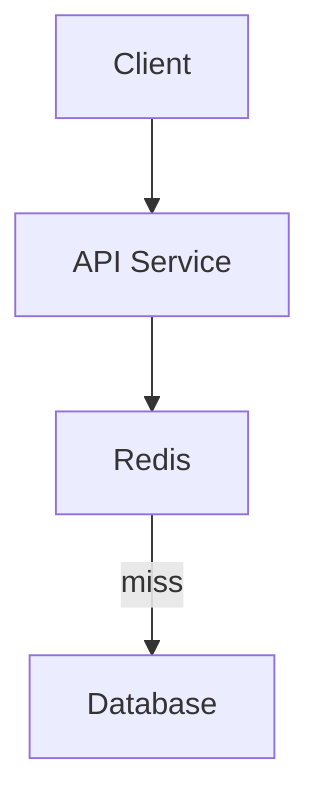

When the answer is already on the shelf, it's a **cache hit** — fast path:

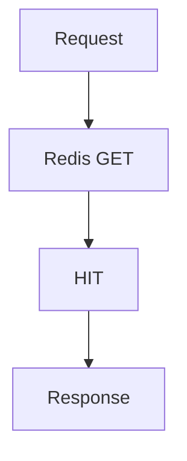

When the shelf is empty, it's a **cache miss** — the app walks to the database, gets the answer, *and puts a copy on the shelf* before returning it:

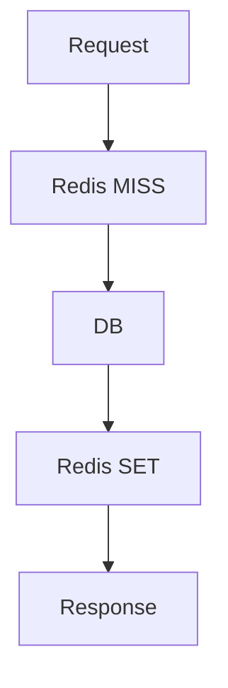

This "check cache, fall back to DB, then fill the cache" pattern is so common it has a name: **cache-aside** (covered in detail next).

## Why caching pays off

Caching can reduce:

- DB reads (the scarce, expensive resource)
- network latency
- expensive computation (e.g. a report that takes seconds to build)
- repeated identical queries

The speed difference is stark:

```text
DB query = 20 ms
Redis = sub-millisecond to low milliseconds depending on deployment
```

But here's the subtle part most beginners miss: **at scale, reducing DB traffic matters more than shaving milliseconds.** Even if the database were fast, it can only handle so many queries per second before it falls over. The cache's real job is often *protecting the database from load*, not just making individual requests quick. Keep that in mind — it's why a cache outage is dangerous, which we hit in Section 4.

## Trade-offs

- **Staleness.** A cached copy can be out of date. If someone changes the price in the DB, the shelf still has the old price until you refresh it. Caching trades *perfect freshness* for *speed*.
- **Memory cost.** RAM is more expensive than disk. You can't cache everything, so you cache what's popular.
- **Complexity.** Now you have two places data can live, and they can disagree. That disagreement is the source of half the problems in this chapter.

## Remember this

> A cache is a fast copy that protects a slow source of truth — and every copy can go stale.

---

# 2. Cache-Aside Pattern

## In plain English

"Cache-aside" means **the application code is in charge of the cache** — the cache doesn't magically populate itself. Your code checks the cache, and if the answer isn't there, your code fetches it from the DB and stores it. The cache sits "aside" from the main data flow, and you wire it in yourself.

## Why you need it

It's the simplest, most predictable caching strategy and it degrades gracefully: if the cache is empty or down, your code just goes to the DB. Because you own the logic, you can decide exactly what to cache, for how long, and when to throw it away.

## A real-world analogy

You keep a personal notebook of phone numbers (the cache) but the official phone directory (the DB) is the real source. When you need a number, you check your notebook first. If it's not there, you look it up in the directory *and jot it into your notebook* for next time. The notebook never updates itself — you do.

## What's actually happening

### Read path

```text
1. GET Redis
2. If hit → return
3. If miss → DB
4. SET Redis
5. return
```

In code:

```java
value = redis.get(key);

if (value != null) {
    return value;
}

value = database.get(id);

redis.set(key, value, ttl);

return value;
```

Notice the `ttl` (time-to-live) on the `SET`. That's a self-destruct timer on the cached copy — after `ttl` seconds it vanishes, forcing a fresh read from the DB eventually. TTLs are how you bound staleness.

### Write path — the hard part

When data *changes*, you have two choices for keeping the cache honest:

**Option A — invalidate (delete) the cache entry:**

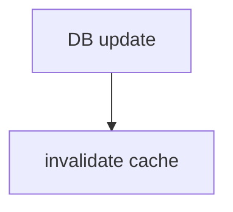

Next reader gets a miss, refetches from DB, and repopulates. Simple and safe — the worst case is one extra DB read.

**Option B — update the cache with the new value directly:**

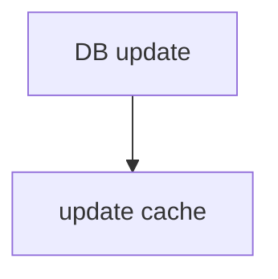

Avoids the extra DB read, but is riskier: if two writes race, the cache can end up holding the *older* value.

Which one is correct depends on your consistency requirements. Most teams default to **invalidate**, because "delete and let it refill" is much harder to get subtly wrong than "write the exact right value into two places in the right order."

## The classic bug this causes

If you update the DB but forget (or fail) to touch the cache:

```text
DB = new value
Redis = old value
```

Now readers get stale data until the TTL expires. This is *the* recurring headache of caching. There is no free lunch — you must pick and implement a cache invalidation/update strategy, and know how stale your data is allowed to get.

## Trade-offs

- **Invalidate** → an extra DB read on the next request, but simple and hard to corrupt.
- **Update-in-place** → no extra read, but ordering/race bugs can leave stale data.
- **Longer TTL** → fewer DB reads, more staleness. **Shorter TTL** → fresher data, more DB load. The TTL knob *is* the freshness-vs-load trade-off.

## Strong interview answer

> "I'd use cache-aside: read from Redis, on a miss read the DB and backfill the cache with a TTL. On writes I'd invalidate the cache entry rather than update it in place, because delete-and-refill is far less prone to ordering bugs than writing the correct value into two stores. The TTL is my staleness bound — I'd size it based on how fresh this particular data needs to be."

## Remember this

> Cache-aside = your code owns the cache; on writes, prefer to delete the entry and let the next read rebuild it.

---

# 3. Cache Hit Ratio

## In plain English

The hit ratio is the fraction of requests that were answered *from the cache* instead of falling through to the database. A 90% hit ratio means 9 out of 10 requests never touched the DB. It's the single most important number for understanding how much protection your cache is actually giving you.

## Why it matters

Your database is sized for the *miss* traffic, not the total traffic. If the hit ratio drops, more requests fall through to the DB — and a small drop in hit ratio can be a *huge* jump in DB load. Watch this number; it's an early warning that trouble is coming.

## A real-world analogy

The shelf behind the coffee counter again. If the shelf is well-stocked, the barista rarely walks to the storeroom. If the shelf keeps running empty (low hit ratio), the barista is constantly running to the back, the line backs up, and the whole shop slows down.

## What's actually happening

```text
Hit ratio =
cache hits / total cache requests
```

Worked example:

```text
1,000,000 requests
900,000 hits
100,000 misses

Hit ratio = 90%
```

Now feel the leverage. At 90% hit ratio, the DB sees 100,000 requests. Drop to 80% and the DB sees 200,000 — the hit ratio fell by a ninth but **DB load doubled**. This non-linear relationship is why a "small" cache problem can become a database outage.

## What to monitor

Don't watch hit ratio alone. Watch the whole health picture of the cache:

- **hit rate** — is the cache doing its job?
- **miss rate** — how much is leaking to the DB?
- **Redis latency** — is the cache itself slow?
- **errors** — are calls to Redis failing?
- **memory** — are you close to full (and about to evict)?
- **evictions** — are you throwing away useful data?
- **per-shard traffic** — is one shard hotter than the rest (see hot keys, Section 5)?

## Trade-offs

- Raising hit ratio usually means caching *more* data or for *longer* → more memory, more staleness.
- A very high hit ratio can hide a fragile situation: if that cache disappears, the DB was never sized for 100% of traffic. High hit ratio and Redis-down risk go hand in hand.

## Remember this

> Hit ratio is leverage: a small drop can multiply DB load, so treat a falling hit ratio as an early smoke alarm.

---

# 4. Redis Goes Down

## In plain English

What happens when the cache — the thing shielding your database — suddenly disappears? Every request that would have been a cache hit now becomes a database query. If your DB was only ever built to handle the *misses*, it's about to get hit with the *total* traffic.

## Why it happens / why it's dangerous

This is the chapter's headline failure and the reason caching is a double-edged sword. A cache is meant to *protect* the DB, but by protecting it you also *hide how much load there really is*. Remove the shield and the full load lands instantly on a database that was never provisioned for it.

## A real-world analogy

Imagine a dam holding back a river, feeding a small, steady stream to a village downstream. The village built its channels for that gentle stream. If the dam suddenly bursts, the *entire river* rushes through at once and floods the village. The cache is the dam; the DB is the village. Losing the cache doesn't just remove a nice-to-have — it releases a flood.

## What's actually happening

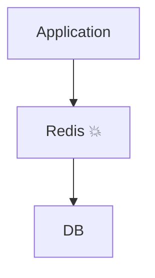

Do the math. Normal steady state:

```text
Normal:
10K requests/sec
Redis hit ratio = 90%

DB = 1K/sec
```

The DB comfortably handles 1K/sec. Now Redis dies and every request goes straight to the DB:

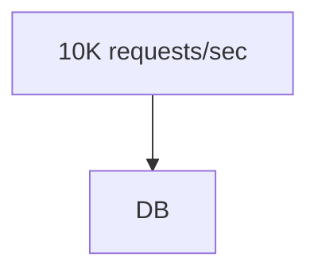

DB traffic jumps to 10K/sec — a **10x increase**, instantly. Very few databases survive a 10x spike.

### The failure chain (why it snowballs)

It doesn't stop at "DB is busy." It cascades and *feeds on itself*:

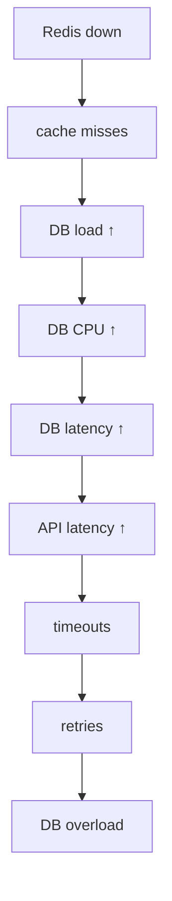

Read that loop carefully. Slow DB → slow API → clients time out → clients **retry** → *more* load on the already-overloaded DB. The retries make it worse, not better. This is how **a cache outage becomes a database outage**, which becomes a full outage.

## How to protect against it

You can't prevent Redis from ever failing, but you can stop its failure from cascading:

- **Redis HA/failover** — run Redis in a replicated, highly-available setup so a single node dying promotes a replica instead of dropping the whole cache.
- **Bounded Redis timeout** — if Redis is slow or unreachable, give up quickly and go to the DB, rather than hanging (a slow cache is almost as bad as a dead one).
- **Circuit breaker where appropriate** — if Redis is clearly down, stop hammering it and fail fast (Section 15).
- **DB concurrency limits** — cap how many queries can hit the DB at once, so the flood is throttled to a survivable rate instead of drowning it.
- **Rate limiting** — shed excess incoming traffic at the edge so it never reaches the DB.
- **Load shedding** — deliberately reject some requests to keep the system alive for the rest ("serve some, not none").
- **Graceful degradation** — serve a simpler or stale response instead of a perfect one (e.g. a default recommendations list).
- **Local cache for suitable data** — keep a small in-process cache so even with Redis gone you still absorb some load (Section 11).

## The one question you must always ask

> Is Redis only a cache, or is it the source of truth?

This changes everything:

- If Redis is **only a cache**, losing it should be *recoverable* — painful, but the DB still has all the data, and you can rebuild.
- If Redis **stores critical state you can't get anywhere else** (sessions, counters, queues), then losing it is *data loss*, and you must design durability, persistence, and recovery accordingly.

Many outages come from a team *thinking* Redis was "just a cache" when in fact some critical state only lived there.

## Trade-offs

- **HA/replication** costs money and adds complexity (failover isn't instant or free).
- **DB concurrency limits and load shedding** mean some users get errors during the incident — but the alternative is *everyone* getting errors when the DB dies. Shedding is choosing who to disappoint on purpose.

## Strong interview answer

> "My first question is whether Redis is just a cache or the source of truth. If it's a cache, the danger is that losing it dumps full traffic onto a DB sized only for misses — at a 90% hit ratio that's a 10x spike, and retries can turn it into a cascading outage. I'd run Redis in HA, put a bounded timeout on cache calls, and cap DB concurrency plus rate-limit/load-shed at the edge so the DB gets a survivable amount of the flood rather than all of it. If Redis holds critical state, then it isn't 'just a cache' and I'd design persistence and recovery for it."

## Remember this

> A cache hides the true load; when it dies, the full flood hits a DB that was never built for it — so cap the flood, never let it in raw.

---

# 5. Redis Hot Key

## In plain English

A **hot key** is one single cache key that everybody wants at the same time. Redis spreads keys across many shards (servers) by hashing the key name — but one specific key always lands on one specific shard. If that one key is wildly popular, its shard gets crushed while all the others sit nearly idle.

## Why it happens

Popularity is never evenly distributed. A celebrity posts, one product goes viral, one config value is read on every request. Sharding balances load *only if load is spread across many keys*. A single super-popular key defeats sharding entirely, because hashing sends it all to one place.

## A real-world analogy

A supermarket has 100 checkout lanes (shards). Normally shoppers spread out and every lane is busy but fine. Then a celebrity walks in and everyone crowds the *one* lane the celebrity is standing in. Opening more lanes (adding shards) doesn't help — the crowd is around the celebrity, not spread across the store.

## What's actually happening

You have 100 Redis shards. One key:

```text
celebrity:123
```

gets 500K requests/sec. Hashing maps that key name to exactly one shard:

```text
Shard 1 → normal
Shard 2 → normal
...
Shard 73 → celebrity:123 → 500K/sec
...
Shard 100 → normal
```

The crucial insight: **adding more shards doesn't help**, because the same key name still hashes to the same single shard. You have a distribution problem, not a capacity problem.

## How to fix / protect

### L1 local cache — the first thing to reach for

Keep a tiny copy *inside each application instance's own memory*, so most requests never even reach Redis:

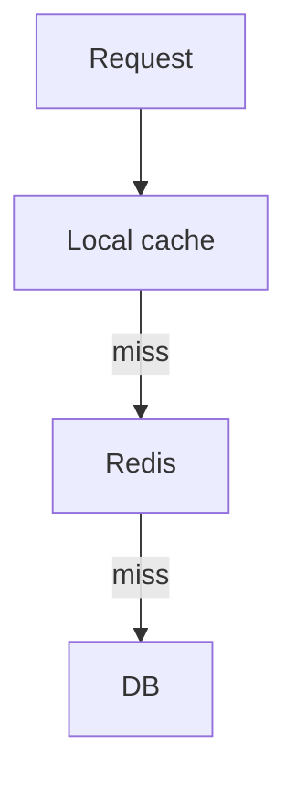

Very effective for **popular, slowly-changing** data — which is exactly what hot keys usually are. The celebrity's profile is read constantly but changes rarely, so a 5-second local copy absorbs almost all of the 500K/sec before it ever hits the shard.

Trade-off:

- stale values (each instance may hold a slightly old copy)
- memory used on *every* application instance
- invalidation complexity (how do you tell 100 instances to drop their copy?)

### Key replication (split one hot key into many)

Instead of one key:

```text
celebrity:123
```

use several copies with different suffixes:

```text
celebrity:123:1
celebrity:123:2
...
celebrity:123:10
```

Each suffix hashes to a *different* shard, so reads spread across ten shards instead of one. On read, pick a random suffix.

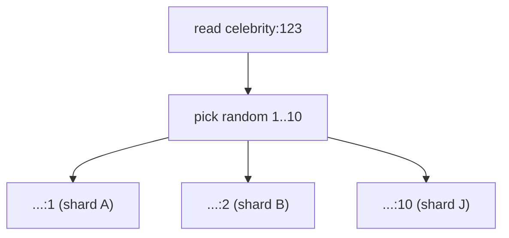

Trade-off:

- **writes must update all copies** (change once, write ten times)
- keeping ten copies consistent is harder than keeping one

### Request coalescing (single-flight)

If 10,000 requests want the same key at the same moment, don't fire 10,000 fetches — fire **one** and share its answer with all 10,000 waiters:

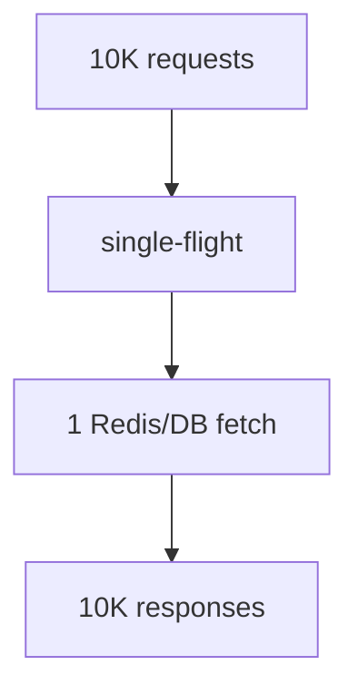

This is the same idea we'll use against cache stampede in Section 6.

### CDN (push it even further out)

For **public, cacheable** data, put a CDN in front of your app so the request is answered at the edge and never reaches Redis at all:

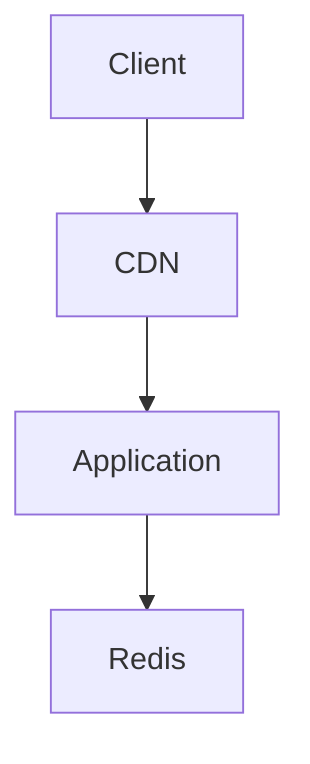

## Trade-offs (summary)

Every hot-key fix trades **freshness or consistency for load reduction**. Local caches and CDNs are the most powerful but the most stale; key replication spreads load but multiplies write cost; coalescing is nearly free but only helps when requests arrive in tight bursts.

## Strong interview answer

> "A hot key is a single key so popular that its one shard gets overwhelmed while the rest idle — and adding shards doesn't help because the key still hashes to the same place. Since hot keys are usually popular-but-slow-changing data, my first move is a short-TTL L1 local cache in each app instance to absorb most reads before Redis. If I need more, I replicate the key across N suffixes so reads spread across shards, coalesce concurrent misses into a single fetch, and for public data push it to a CDN. The trade is always a bit of staleness for a lot of load relief."

## Remember this

> A hot key is a distribution problem, not a capacity problem — copy it closer (local cache/CDN) or split it across shards; more shards alone won't help.

---

# 6. Cache Stampede / Thundering Herd

## In plain English

A **stampede** happens when a popular cache entry *expires*, and in the instant it's gone, a flood of requests all miss the cache at once and all rush to the database to rebuild the same value simultaneously. One expiry, a thousand DB queries for the identical thing.

## Why it happens

TTLs mean cached values die on a schedule. For a popular key, at the exact moment it expires there might be tens of thousands of in-flight requests wanting it. Each one independently sees "not in cache" and independently decides "I'll fetch it from the DB." They don't know about each other, so they all do the same expensive work at the same time.

## A real-world analogy

A popular exhibit at a museum closes for a 1-minute cleaning (the TTL expiry). A crowd builds at the rope. The instant the rope drops, everyone stampedes toward the same exhibit at once — even though only *one* person needed to go in and report back what's there. The stampede tramples the doorway (the database).

## What's actually happening

```text
product:123
TTL = 60 seconds
```

At the 60-second mark it expires. If 50,000 requests are in flight:

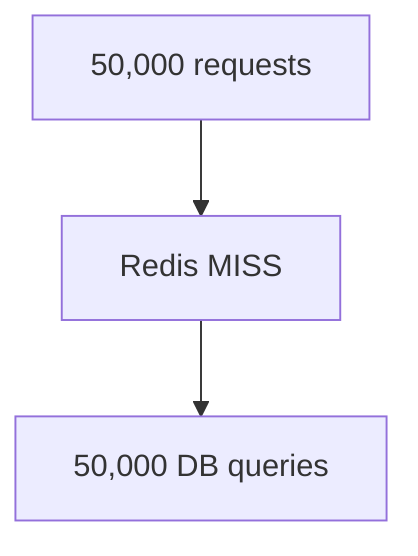

All 50,000 miss, all 50,000 hit the DB — for the *same* value. The DB gets overwhelmed rebuilding one key.

## How to fix / protect

### Single-flight (let one rebuild, make the rest wait)

Only the **first** request that sees the miss is allowed to rebuild; it "acquires a rebuild slot." Everyone else waits for that one rebuild to finish and then reads the fresh value.

First request:

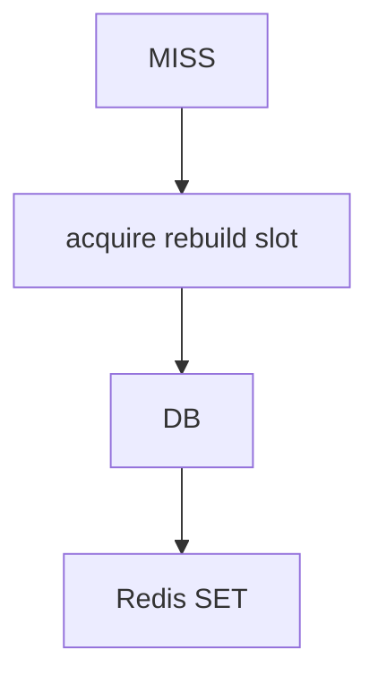

All the others:

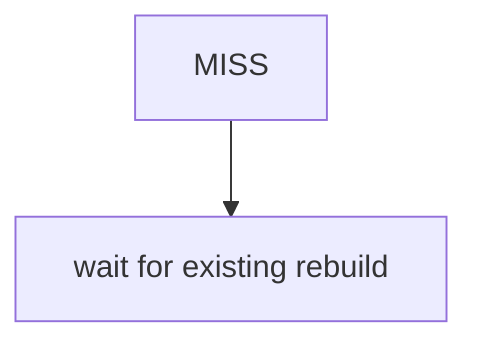

50,000 misses collapse into **1** DB query. This is the core fix.

### Distributed single-flight (the catch)

A normal in-process lock (like a JVM lock) only protects **one** application instance. If you have 100 instances:

```text
App 1
App 2
...
App 100
```

then a local lock still lets 100 rebuilds through (one per instance) — better than 50,000, but still a spike. To truly limit it to *one* rebuild across the whole fleet you need a **distributed coordination mechanism** (e.g. a lock in Redis). But be aware of its failure modes: what if the lock holder crashes mid-rebuild? What if the lock expires before the rebuild finishes? A safe design must handle lock expiry and holder failure.

### TTL jitter (stop keys from expiring in lockstep)

Instead of giving every key the exact same TTL:

```text
all TTL = 60 sec
```

add a random spread:

```text
60 + random(0..30) sec
```

Now keys expire at scattered times instead of all at once. (This also defends against avalanche — Section 8.)

### Proactive refresh (rebuild before it dies)

Don't wait for expiry. Refresh the value in the background *before* the TTL runs out, so it's never actually missing:

```text
TTL = 60 sec

At 50 sec:
background refresh
```

Readers always hit a warm cache; the rebuild happens quietly in the background.

### Stale-while-revalidate (serve old, refresh behind)

If a little staleness is acceptable, keep serving the *old* value instantly while asynchronously fetching a fresh one:

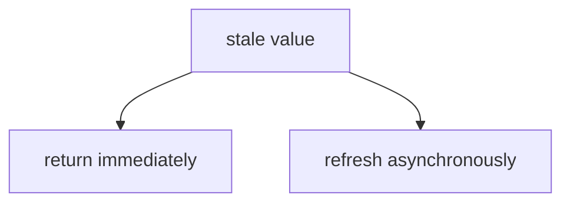

No user ever waits, and the backend is protected during bursts because only one background refresh runs.

## Trade-offs

- **Single-flight** adds latency for the waiters (they wait for the one rebuild) and, in distributed form, needs a lock with careful failure handling.
- **Proactive refresh / stale-while-revalidate** cost you some freshness (you may serve a value that's a few seconds old) and some extra background work.
- **TTL jitter** is nearly free but only spreads the problem out; it doesn't eliminate the single-key stampede.

## Strong interview answer

> "A stampede is when a hot key expires and thousands of concurrent requests all miss and rebuild it against the DB at once. The primary fix is single-flight: only the first miss rebuilds, everyone else waits and then reads the fresh value, collapsing thousands of DB hits into one. Across a fleet I'd use a distributed lock in Redis, handling lock expiry and holder crashes. To make expiry less violent I'd add TTL jitter, and for data that tolerates slight staleness I'd use stale-while-revalidate or proactive background refresh so readers never hit an empty cache at all."

## Remember this

> Stampede = many requests rebuild the *same expired* key at once; let exactly one rebuild it while the rest wait or serve stale.

---

# 7. Cache Penetration

## In plain English

**Penetration** is when requests keep asking for data that **doesn't exist**. Because there's no value, nothing ever gets cached — so every single request "penetrates" straight through the cache to the database, only to be told "not found" again and again.

## Why it happens

A cache only stores *answers*. If the answer is "this doesn't exist," a naive cache stores nothing, so the next identical request misses again. This happens with buggy clients requesting bad IDs, or — dangerously — with **attackers** who deliberately request random nonexistent IDs precisely to bypass your cache and pound your DB.

## A real-world analogy

Someone keeps phoning the coffee shop asking for a drink that isn't on the menu. The barista checks the storeroom every time (there's nothing to put on the shelf, because it doesn't exist) and comes back to say "we don't sell that." If they never write down "we don't sell that" on a note, they'll keep walking to the storeroom for every prank call.

## What's actually happening

A caller repeatedly requests IDs that don't exist:

```text
product:999999
product:888888
product:777777
```

Every request:

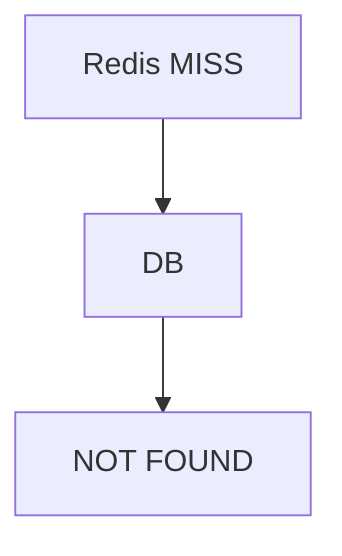

Nothing gets cached (there's no value), so the DB keeps receiving the same futile lookups. Unlike a stampede (one key, briefly), penetration can be a *sustained* drain, and it's the one that's often malicious.

## How to fix / protect

### Negative caching (cache the "not found")

Store the fact that something doesn't exist, with a short TTL:

```text
product:999999 → NULL
TTL = 30 sec
```

Now the second request gets an instant "doesn't exist" from the cache instead of hitting the DB. Keep the TTL short so that if the item *does* get created later, you'll notice reasonably soon.

### Bloom filter (a cheap "definitely doesn't exist" check)

A Bloom filter is a tiny, probabilistic data structure that can answer "have I ever seen this key?" using very little memory. You check it *before* going to the DB:

- If the Bloom filter says **"no"**, the item definitely doesn't exist → reject immediately, skip the DB.
- If it says **"maybe yes"**, then you go check.

The important property: it can have **false positives** (says "maybe" when the answer is no) but, under standard use, **never false negatives** (it never wrongly says "no" for something that exists). So it's safe as a pre-filter — it might occasionally let a nonexistent key through, but it will never block a real one.

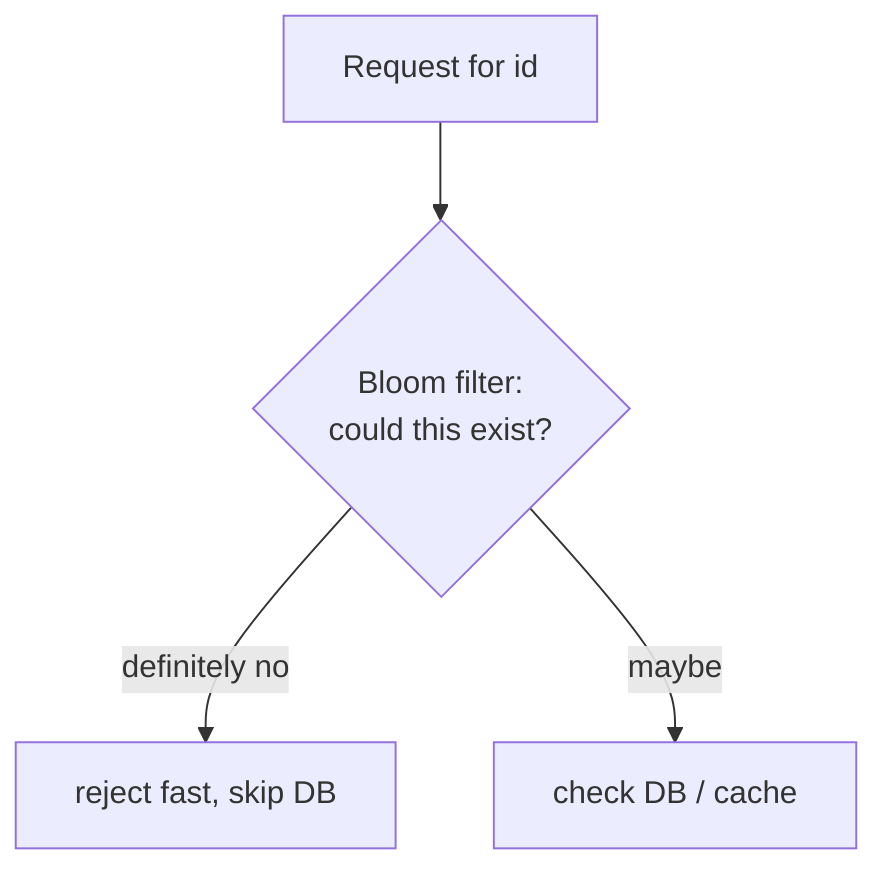

### Validation and rate limiting

Reject obviously-invalid IDs (wrong format, out of range) at the edge before they ever reach the DB, and rate-limit callers showing abusive patterns (thousands of nonexistent lookups from one source is a red flag).

## Trade-offs

- **Negative caching** uses cache space for non-answers and adds a small delay (the short TTL) before newly-created items become visible.
- **Bloom filters** need to be built and kept in sync with real data, and their false-positive rate must be tuned (smaller filter = more false positives = more wasted DB checks).

## Strong interview answer

> "Penetration is requests for data that doesn't exist — nothing caches, so every request hits the DB, and it's often malicious. I'd add negative caching: cache the 'not found' with a short TTL so repeated lookups are cheap. For a large key space I'd front the DB with a Bloom filter that cheaply rules out keys that definitely don't exist — it can false-positive but never false-negative, so it's safe. And I'd validate ID formats and rate-limit abusive callers at the edge."

## Remember this

> Penetration = requests for keys that *don't exist* (often an attack); cache the "not found" and use a Bloom filter to reject the impossible before the DB.

---

# 8. Cache Avalanche

## In plain English

An **avalanche** is when a *large number of different cache entries* become unavailable at roughly the same time — either because they all expire together, or because a chunk of the cache goes down — so a mass of misses hits the database all at once.

## Why it happens

The most common cause is accidental synchronization: you warm the cache by loading a million keys at startup, all with the *same 60-second TTL*, so a minute later they *all expire in the same second*. It can also happen when a cache node fails and everything it held vanishes simultaneously.

## A real-world analogy

Picture a mountain slope where all the snow was laid down at once and is held by the same thin crust. When that crust gives way, it doesn't slide gently — the *entire slope* lets go at the same moment. That's an avalanche: not one snowball, but the whole hillside at once. Here, the "whole hillside" is a million cache entries expiring together, and the village below is your database.

Contrast with a **stampede** (Section 6): a stampede is *many people rushing the same single door*; an avalanche is *many different doors all opening at once*.

## What's actually happening

```text
1 million keys
TTL = 60 sec
```

They were all loaded together, so they all expire together:

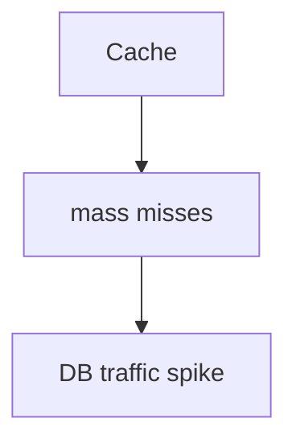

The DB is suddenly asked to rebuild a huge number of *different* values simultaneously — a broad, brutal traffic spike.

## How to fix / protect

- **TTL jitter** — the primary defence. Add randomness to every TTL so keys expire at scattered times, not in one synchronized wave. (Same tool as stampede, doing a slightly different job here: spreading *many different keys* instead of taming *one hot key*.)
- **Staggered expiration** — deliberately assign different expiry times to different groups of keys.
- **Proactive refresh** — refresh keys in the background before they expire so they're never all missing at once.
- **Cache warming** — after a cache restart, pre-load popular keys gradually rather than letting a cold cache take full traffic instantly.
- **Multi-layer cache** — an L1 local cache (Section 11) absorbs some of the flood even when L2/Redis entries expire.
- **Backend concurrency limits** — cap how many rebuilds hit the DB at once, so even a wave gets metered into a survivable trickle.

## Trade-offs

- **Jitter and staggering** cost nothing but require you to remember to apply them everywhere (the default of "same TTL for all" is the trap).
- **Proactive refresh and warming** cost background work and some complexity.
- **Concurrency limits** mean some requests wait or fail during the wave — again, the deliberate choice to disappoint a few to save the many.

## Strong interview answer

> "Avalanche is many *different* entries expiring or disappearing at once, versus a stampede which is many requests for one *same* key. The usual cause is a batch of keys sharing an identical TTL, so they expire in the same second. The main fix is TTL jitter so expirations scatter, plus proactive refresh and gradual cache warming after a restart. As a safety net I'd cap backend rebuild concurrency so a wave gets metered instead of drowning the DB, and lean on an L1 layer to absorb part of the miss storm."

## Remember this

> Avalanche = many *different* keys vanish together (usually identical TTLs); scatter expirations with jitter and meter the rebuilds.

---

# 9. Hot Key vs Stampede vs Penetration vs Avalanche

These four get confused constantly in interviews because they all end in "the database gets hammered." The difference is **what causes the flood** and therefore **what fixes it**. Here's the clean mental separation:

| Problem | What's really happening | One-line distinction | Main protection |
|---|---|---|---|
| **Hot key** | One key receives huge traffic | One key, *too popular* (its shard melts) | Local cache, key replication, coalescing, CDN |
| **Stampede** | Many requests rebuild the *same expired/missing* key at once | One key, *just expired* (herd rebuilds it) | Single-flight, distributed lock, proactive refresh |
| **Penetration** | Requests target keys that *don't exist* | Keys that *never existed* (often an attack) | Negative cache, Bloom filter, validation |
| **Avalanche** | Many *different* entries expire/disappear together | Many keys, *all at once* | TTL jitter, staggering, warming, concurrency limits |

The fastest way to keep them straight — ask two questions:

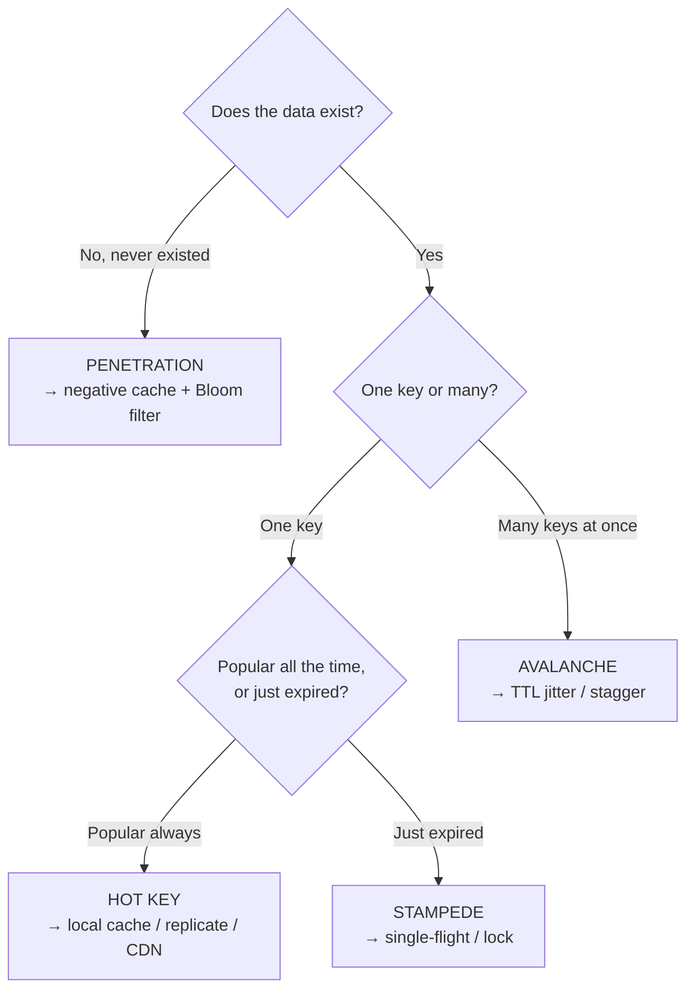

Two contrasts worth saying out loud:

- **Hot key vs stampede:** both are about *one* key. Hot key = that key is *always* popular (a distribution problem — spread it out). Stampede = that key just *expired* and the herd all rebuilds it (a timing problem — coordinate one rebuild).
- **Stampede vs avalanche:** stampede = many requests, *one* key. Avalanche = many keys, *many* requests. Stampede is a spike on one thing; avalanche is a broad spike across many things.

## Remember this

> Ask "does it exist?" (no → penetration), then "one key or many?" (many → avalanche), then "always popular or just expired?" (always → hot key, expired → stampede).

---

# 10. Redis Eviction

## In plain English

Redis lives in RAM, and RAM is finite. When Redis fills up, it has to make room for new data by **evicting** (throwing away) some existing keys. The **eviction policy** is the rule that decides *which* keys get thrown out.

## Why it happens

You almost always store more data than fits, on purpose — you cache aggressively and trust Redis to keep the useful stuff and discard the rest. But eviction is only safe if losing a key is harmless. If Redis is holding something you *can't* rebuild, eviction is silent data loss.

## A real-world analogy

The shelf behind the coffee counter has limited space. When a new item needs a spot and the shelf is full, the barista removes something to make room. A *good* rule removes the item nobody's asked for in ages (least-recently-used). A *bad* situation is if the shelf was secretly the only place a one-of-a-kind item lived — then removing it loses it forever.

## What's actually happening

```mermaid
flowchart TD
    MF["Memory full"] --> EP["eviction policy"]
    EP --> KR["some keys removed"]
```

Common policy families:

- **no eviction** — refuse new writes when full (returns errors instead of dropping data). Right when you *cannot* afford to lose anything.
- **all-keys LRU/LFU variants** — evict the **L**east **R**ecently **U**sed or **L**east **F**requently **U**sed keys. Great for caches: keep the popular stuff, discard the cold stuff.
- **TTL-aware variants** — only evict keys that already have an expiry set, preferring those closest to expiring.

## How to choose / protect

For **cache workloads**, eviction is usually *fine* — the DB is still the source of truth, so an evicted key just becomes a cache miss and gets rebuilt. Pick an LRU/LFU policy and move on.

For **critical state** (data that only lives in Redis), eviction may be *unacceptable* — you'd use `no eviction` and/or persistence, and treat Redis as more than a cache (back to the Section 4 question).

The interview-critical question:

> What happens to the system when the key disappears?

If the answer is "a harmless cache miss," evict freely. If the answer is "we lose data," you have a design problem to fix *before* you worry about the policy.

## Trade-offs

- **LRU/LFU** keep the useful data but cost a little bookkeeping to track usage.
- **no eviction** guarantees no data loss but turns a full cache into *write failures* — you've traded silent loss for loud errors.
- Aggressive caching + eviction = high hit ratio but a churn of evictions; watch the eviction metric (Section 3) to catch a cache that's too small.

## Remember this

> Eviction is only safe if a missing key is just a cache miss — always ask "what breaks when this key disappears?"

---

# 11. Local Cache + Redis L1/L2

## In plain English

Instead of one cache layer, use **two**: a tiny **L1 cache inside each application process** (in local memory, no network hop) backed by a bigger **L2 cache in Redis** (shared across all instances), backed by the DB. Check L1 first, then L2, then DB. Each layer catches what the one before it missed.

## Why you need it

Even a Redis call costs a network round trip (a millisecond or so) and load on the shared Redis cluster. An L1 local cache serves the hottest data with *zero* network — nanoseconds — and takes pressure off Redis (which helps with hot keys, Section 5). It's the multi-layer defence that keeps working even when a lower layer struggles.

## A real-world analogy

Three levels of storage in the coffee shop: the barista's **apron pockets** (L1 — instant, tiny, personal to each barista), the **shelf behind the counter** (L2 — shared, bigger, a few steps away), and the **storeroom** (DB — everything, but a long walk). You reach into your pocket first, glance at the shelf next, and only trek to the storeroom as a last resort.

## What's actually happening

```mermaid
flowchart TD
    Client --> App[Application]
    App --> L1["L1 Local Cache"]
    L1 -->|miss| L2["Redis L2"]
    L2 -->|miss| DB
```

Benefits:

- **L1 avoids the network hop** — fastest possible reads for the hottest data.
- **Redis (L2) protects the DB** — the shared layer still shields the source of truth.
- **DB remains the source of truth** — both cache layers are disposable copies.

## Trade-offs

Two cache layers means two places data can be stale, so this is the *most* staleness-prone pattern:

- **Stale data** — each app instance's L1 may hold an old copy; different instances can briefly disagree with each other.
- **Invalidation complexity** — telling *every* instance to drop its L1 copy is genuinely hard (there's no single place to invalidate).
- **Memory duplication** — the same hot value is copied into every instance's memory.
- **Consistency challenges** — the more layers, the more your users can see slightly different values at the same moment.

The rule of thumb: only put **popular, slowly-changing, staleness-tolerant** data in L1. A short L1 TTL (a few seconds) usually gives you most of the load relief while bounding how stale things get.

## Strong interview answer

> "For very high read volume I'd layer caches: an in-process L1 with a short TTL for the hottest, slowly-changing keys, backed by Redis as a shared L2, backed by the DB. L1 eliminates the network hop and shields Redis from hot keys; Redis shields the DB. The cost is staleness and invalidation — with L1 there's no single place to invalidate, so I keep only staleness-tolerant data there and rely on a short TTL rather than trying to purge every instance."

## Remember this

> L1 (in-process) + L2 (Redis) + DB gives you the fastest reads and the strongest DB protection — at the price of the most staleness, so L1 is only for popular, slow-changing data.

---

# 12. Downstream Service Becomes Slow

## In plain English

This is the pivot from *caches* to *dependencies*. Your service calls another service (say, Payment). Payment doesn't crash — it just gets **slow**. Counterintuitively, a slow dependency can be *more* dangerous than a dead one, because a dead one fails instantly (freeing you up) while a slow one *holds your resources hostage* while you wait.

## Why it happens / why it's dangerous

When you call Payment, one of your threads is stuck waiting for the reply. If Payment normally replies in 50 ms, that thread is busy for 50 ms. If Payment slows to 5 seconds, that same thread is now busy for 5 seconds — 100x longer. You only have so many threads. Do the math and they *all* end up stuck waiting, and now *your* service can't answer *anyone*, even callers who don't need Payment at all.

## A real-world analogy

You run a restaurant kitchen with 100 cooks (threads). Each cook who makes a dish has to wait at the pass for the wine pairing from the sommelier (the Payment service). Normally the sommelier is instant. Tonight the sommelier is dazed and takes 5 minutes per pairing. One by one, all 100 cooks end up standing at the pass waiting for wine — and now *nobody* is cooking anything, including the salads that never needed wine. The kitchen is fully staffed and completely stuck.

## What's actually happening

```mermaid
flowchart TD
    OS["Order Service"] --> PS["Payment Service"]
    PS --> PDB["Payment DB"]
```

Normally:

```text
Payment = 50 ms
```

Now:

```text
Payment = 5 sec
```

Payment is *not down* — it's answering — but each call ties up an Order Service resource 100x longer than usual.

### Failure propagation

```mermaid
flowchart TD
    A["Payment slow"] --> B["Order threads wait"]
    B --> C["thread pool exhausted"]
    C --> D["queue grows"]
    D --> E["API latency increases"]
    E --> F["client timeout"]
    F --> G[retries]
    G --> H["more Payment traffic"]
```

Follow it: Payment slow → Order threads all stuck waiting → thread pool exhausted → new requests queue up → your latency climbs → clients time out → clients **retry** → even more traffic hammering the already-slow Payment. This is **cascading failure** — the same retry-amplification loop we saw with Redis, now flowing through a dependency.

The rest of this chapter (Sections 13–20) is the toolkit for breaking this loop.

## Remember this

> A *slow* dependency is often worse than a dead one — it doesn't fail you fast, it holds your threads hostage until you have none left.

---

# 13. Timeout

## In plain English

A timeout is a hard limit on how long you're willing to wait for a call before giving up. It's the most basic protection against a slow dependency: never let an external call wait forever, because "forever" means "until all your threads are stuck."

## Why you need it

Without a timeout, a slow dependency (Section 12) can pin every one of your threads indefinitely. A timeout puts a ceiling on how long each thread can be held hostage. It's fundamentally a **resource-protection mechanism** — it protects *you*, not the dependency.

## A real-world analogy

You're on hold with a call centre. Without a timeout, you'd stay on the line for hours, unable to do anything else. A timeout is you deciding "if they don't pick up in 60 seconds, I hang up and get on with my day." You'd rather not get the answer than lose your whole afternoon waiting.

## What's actually happening

Every external call should fit within your overall latency budget. Example:

```text
Order API budget = 2 sec
Payment timeout = 1 sec
```

If the whole Order API must respond within 2 seconds, the Payment call can't be allowed to eat more than 1. The exact value depends on your end-to-end latency budget — pick it deliberately, don't leave it at the library default (which is often "infinite").

### Why a longer timeout is not "safer"

It's tempting to think a generous timeout is kinder. It's the opposite. The timeout is how long each thread stays occupied on a failing call:

```text
100 threads occupied
```

If 100 threads each wait 30 seconds, they're all held for 30 seconds. A 5-second timeout already holds resources — 30 seconds holds them *six times longer*, giving the failure six times as long to exhaust your pool. **A shorter timeout fails faster and frees the thread sooner.**

## Trade-offs

- **Too short** → you give up on calls that would have succeeded, causing spurious failures on a merely-sluggish (but working) dependency.
- **Too long** → threads stay pinned during an incident, accelerating pool exhaustion.
- The right value comes from the dependency's *normal* latency (e.g. p99) plus headroom, capped by your overall budget — not from wishful thinking.

## Strong interview answer

> "Every external call gets an explicit timeout derived from my latency budget — never the library's infinite default. The timeout is a resource-protection mechanism: it caps how long a thread is held by a slow dependency. A longer timeout isn't safer, it's worse, because it lets a failing dependency pin my threads longer and exhaust the pool faster. I'd set it just above the dependency's normal p99, within my end-to-end budget."

## Remember this

> A timeout protects *you*, not the dependency — set it from your latency budget, and remember shorter fails faster and frees threads sooner.

---

# 14. Bulkhead

## In plain English

A bulkhead **partitions your resources** so that one misbehaving dependency can only consume its own slice, never your whole pool. You cap how many threads (or connections) can be tied up talking to any single dependency at once.

## Why you need it

A timeout limits how long *each* call waits, but with enough traffic even short waits can eventually consume every thread. A bulkhead limits *how many* calls to a given dependency can be in flight at all — so a slow Payment can occupy at most, say, 20 threads, leaving the other 80 free to serve everything else.

## A real-world analogy

The name comes from ships. A ship's hull is divided into sealed **bulkhead** compartments. If one compartment floods (a slow dependency), the watertight walls stop the water from spreading, and the ship stays afloat. Without bulkheads, one breach floods the entire hull and the ship sinks. Same idea: wall off the flood so it can't take the whole vessel.

## What's actually happening

Suppose:

```text
Order Service = 100 threads
```

You cap concurrent Payment calls:

```text
Payment concurrency = 20
```

```mermaid
flowchart TD
    OS["Order Service<br/>100 threads"] --> PB["Payment bulkhead = 20"]
    OS --> OA["other APIs"]
    OS --> IW["internal work"]
```

Now even if Payment goes catastrophically slow, it can tie up at most 20 threads. The remaining 80 keep serving other APIs and internal work. **The failure is isolated** — Payment being sick no longer means the whole Order Service is sick.

## Trade-offs

- **Bulkhead too small** → you throttle a healthy dependency and reject/queue requests you could have served.
- **Bulkhead too large** → less isolation; a slow dependency can still grab most of your pool.
- The isolation isn't free: capping concurrency means during a Payment slowdown, Payment requests beyond the cap get rejected or queued — but that's the whole point (fail the Payment calls, keep the rest of the service alive).

## Strong interview answer

> "I'd wrap each dependency in a bulkhead — a concurrency cap — so a slow one can only consume its slice of the thread pool, not all of it. If Order has 100 threads and Payment is capped at 20, a Payment meltdown still leaves 80 threads serving everything else. It's the ship's watertight-compartment idea: isolate the flood so one breach can't sink the vessel. The trade is that during a slowdown, Payment calls beyond the cap get rejected — which is exactly what I want."

## Remember this

> A bulkhead caps how many threads one dependency can hold, so its failure floods only its compartment — not the whole ship.

---

# 15. Circuit Breaker

## In plain English

A circuit breaker watches calls to a dependency and, when it sees too many failures, **stops sending traffic** for a while — failing fast instead of waiting on a call that's almost certainly going to fail. After a cooldown it cautiously tests whether the dependency has recovered.

## Why you need it

Timeouts and bulkheads limit the damage of *each* failing call, but if a dependency is clearly down, why keep calling it at all? Every attempt still costs a timeout's worth of waiting and adds load to a struggling dependency. A circuit breaker recognises "this is broken right now" and skips the doomed calls entirely — freeing your resources instantly and giving the dependency room to recover.

## A real-world analogy

It's literally an electrical circuit breaker in your home. When there's a fault (a short), the breaker *trips* and cuts the power to that circuit, preventing a fire. It doesn't try forever — it stays **open** (no power) until you reset it. Modern breakers even let you flip them back and see if the fault is gone. Same three states as the software version below.

## What's actually happening — the state machine

```mermaid
stateDiagram-v2
    [*] --> CLOSED
    CLOSED --> OPEN: failures exceed threshold
    OPEN --> HALF_OPEN: cooldown elapsed
    HALF_OPEN --> CLOSED: test succeeds
    HALF_OPEN --> OPEN: test fails
```

### CLOSED (normal)

Requests flow through to the dependency as usual. The breaker just counts failures in the background. ("Closed" = the circuit is complete, current flows — think of the electrical metaphor.)

### OPEN (tripped)

Too many recent failures crossed the threshold, so the breaker **opens** and requests **fail fast** *without even calling* the dependency. This is the key benefit: no waiting on timeouts, no piling load onto a sick service. Callers get an immediate error (or a fallback), and your threads stay free.

### HALF-OPEN (testing recovery)

After a cooldown, the breaker lets a **small number of test requests** through to probe whether the dependency has recovered:

- If the tests **succeed** → the dependency is healthy again → go back to **CLOSED** (full traffic).
- If the tests **fail** → still broken → go back to **OPEN** and wait another cooldown.

This cautious probing avoids slamming a just-recovering dependency with the full firehose the instant it comes back.

## Trade-offs

- **Threshold too sensitive** → the breaker trips on a brief blip and needlessly cuts off a working dependency.
- **Threshold too lax** → it waits too long to trip, so you keep hammering a dead dependency.
- When OPEN, callers get fast failures — so pair it with a **fallback** (a default response, cached value, or graceful degradation) if you don't want users to see raw errors.

## Strong interview answer

> "A circuit breaker stops calling a dependency that's clearly failing. In CLOSED it passes traffic and counts failures; once failures cross a threshold it goes OPEN and fails fast without calling the dependency at all — freeing my threads and giving the sick service breathing room. After a cooldown it goes HALF-OPEN, lets a few probe requests through, and returns to CLOSED if they succeed or back to OPEN if they don't. I'd tune the threshold to avoid tripping on blips, and pair OPEN with a fallback so users get graceful degradation rather than errors."

## Remember this

> A circuit breaker fails fast when a dependency is clearly down (OPEN), then cautiously re-tests (HALF-OPEN) before trusting it again (CLOSED).

---

# 16. Retry with Backoff and Jitter

## In plain English

Retrying a failed call *can* help when the failure was a momentary blip — but retrying **wrong** turns a small problem into a stampede. The right way is to wait a bit before retrying, wait *longer* each time (**backoff**), and add a little randomness to those waits (**jitter**) so all your retries don't fire in lockstep.

## Why you need it done carefully

Some failures are transient (a brief network hiccup) and a retry succeeds. But if a dependency is overloaded and *everyone* retries *immediately*, you've just doubled or tripled the traffic to a service that was already drowning — the retries become a self-inflicted DDoS. This is the same retry-amplification loop from Sections 4 and 12.

## A real-world analogy

You call a friend and the line is busy. Redialling instantly, over and over, just keeps the line jammed. Sensible behaviour: wait a bit, and if it's still busy wait a bit *longer* (backoff). And if ten people are all trying to reach the same friend, they should each wait *slightly different* amounts (jitter) so they don't all redial at the exact same second and re-jam the line together.

## What's actually happening

The wrong way — retry storms:

```text
retry immediately
retry immediately
retry immediately
```

The right way — exponential backoff with jitter:

```text
Attempt 1 → fail
wait 100ms + jitter

Attempt 2 → fail
wait 200ms + jitter

Attempt 3 → fail
wait 400ms + jitter
```

The wait **doubles** each time (100 → 200 → 400), giving the dependency progressively more room to recover. The **jitter** (a small random offset) is what prevents a synchronized "thundering herd" of retries all landing at the same instant.

### Two more rules

- **Use bounded retries.** Retry a *fixed small number* of times, then give up. Infinite retries just prolong the pain.
- **Retry only when it's safe and the failure looks transient.** A validation error won't fix itself on retry — don't bother. And crucially, **for anything that changes state — like creating a payment — idempotency is essential.** If your retry succeeds but you never saw the first response, you must not create *two* payments. An idempotency key lets the dependency recognise "I've already done this one" and return the same result instead of doing it twice.

## Trade-offs

- **Retries improve success rates** on transient failures but **add load** — always a tension. Backoff and bounds keep that load in check.
- **More retries** → higher chance of eventual success, but more traffic and higher latency for the caller. **Fewer retries** → faster failure, less amplification.
- Retrying non-idempotent operations without an idempotency key risks **duplicate side effects** (double charges) — worse than the original failure.

## Strong interview answer

> "Retries help with transient failures but are dangerous if naive — immediate retries by everyone become a self-inflicted DDoS on an already-struggling dependency. I use exponential backoff so waits double each attempt, jitter so retries don't synchronize into a thundering herd, and a bounded retry count so I eventually give up. I only retry safe, likely-transient failures, and for state-changing calls like creating a payment I require an idempotency key so a retry can't double-charge."

## Remember this

> Retry only transient failures, back off exponentially with jitter, bound the attempts — and make state-changing calls idempotent so a retry can't double-do it.

---

# 17. Rate Limiting

## In plain English

Rate limiting caps how fast you send requests to a dependency, so you never push it past what it can safely handle. If Payment can process 100 requests/sec and your service can *generate* 1,000/sec, you deliberately throttle yourself down to 100 so you don't crush it.

## Why you need it

Your service and your dependency may have very different capacities. Left unchecked, a burst from you can overwhelm a slower downstream — and an overwhelmed downstream gets slow, which (Section 12) cascades right back into you. Rate limiting is *being a good citizen* toward your dependencies, and it protects you too.

## A real-world analogy

A highway on-ramp with a metering traffic light that releases one car every few seconds. The highway (the dependency) can only absorb so many cars per minute before it jams. The ramp meter (rate limiter) holds back the flood so the highway keeps flowing, instead of letting everyone merge at once and gridlocking it.

## What's actually happening

If Payment can safely process:

```text
100 requests/sec
```

but your service can generate:

```text
1,000/sec
```

you put a limiter between them:

```mermaid
flowchart TD
    Order --> RL["Rate limiter"]
    RL --> T["100/sec"]
    T --> Payment
```

What happens to the excess 900/sec depends on your business needs:

- **queued** — held and released later at the allowed rate (good if the work can wait)
- **rejected** — turned away immediately (good if freshness matters more than completeness)
- **deferred** — pushed to async/background processing (Section 18)

## Trade-offs

- **Queue the excess** → nothing is lost, but latency grows and the queue can back up (see backpressure, Section 19).
- **Reject the excess** → the system stays responsive, but some requests fail and must be retried.
- **Limit too low** → you underuse a healthy dependency. **Limit too high** → you fail to protect it. Size the limit to the dependency's real, safe capacity.

## Strong interview answer

> "If I can generate more traffic than a dependency can safely absorb, I rate-limit myself to its safe capacity — otherwise a burst from me overwhelms it and cascades back as latency. The excess is queued, rejected, or deferred to async depending on whether the work can wait. Queuing preserves work but risks backlog; rejecting preserves responsiveness but drops requests. I size the limit to the dependency's real safe throughput, not its theoretical max."

## Remember this

> Rate limiting throttles *you* down to what the dependency can safely take — queue, reject, or defer the excess based on the business need.

---

# 18. Async Processing

## In plain English

If the caller doesn't need the answer *right now*, don't make them wait for it. Accept the request, hand it to a background worker via a queue, and reply "got it, I'll process this shortly." The caller's thread is freed instantly instead of being held for the whole operation.

## Why you need it

Synchronous calls hold a thread for the entire duration of the work — the root cause of the thread-exhaustion cascade in Section 12. Going async breaks that coupling: the API thread returns in milliseconds, and the slow work happens elsewhere, at a controlled pace, buffered by a queue. It also naturally gives you buffering, concurrency control, and backpressure for free.

## A real-world analogy

A dry cleaner. You don't stand at the counter while they clean your suit (synchronous, holding you hostage for hours). They take it, give you a ticket, and you leave (async). You come back later with the ticket, or they text you when it's ready (webhook/event). The counter stays free to serve the next customer immediately.

## What's actually happening

```mermaid
flowchart TD
    Client --> OA["Order API"]
    OA --> Kafka
    Kafka --> PW["Payment Worker"]
    PW --> PS["Payment Service"]
```

The API thread is released quickly, because all it does is drop a message on the queue and return. The slow Payment work happens later in a worker.

The caller gets an immediate acknowledgement:

```text
POST /payment
→ 202 Accepted
→ paymentId=123
```

(`202 Accepted` literally means "I've accepted this and will work on it" — not "it's done.") The client later checks the result:

```text
GET /payment/123
```

or receives a **webhook/event** when it's finished.

Async processing gives you:

- **decoupling** — caller and worker aren't chained together
- **buffering** — the queue absorbs bursts
- **controlled concurrency** — workers process at a safe, fixed rate
- **backpressure** — the queue is the shock absorber (Section 19)

## Trade-offs

Async is not a free win — it changes the *user experience and the consistency model*:

- The caller no longer gets an immediate result — they must poll or wait for a webhook, and your UI/flow has to handle "pending."
- You now have an "in flight" state to track and reconcile.
- **Don't make a business-critical synchronous operation async without checking the required UX and consistency semantics.** If the user genuinely needs to know *right now* whether their payment succeeded, "202 Accepted, check back later" may be unacceptable.

## Strong interview answer

> "If the caller doesn't need the result immediately, I make the operation async: the API drops a message on a queue, returns 202 with an id in milliseconds, and a worker processes it at a controlled rate. That frees the API thread instantly — breaking the thread-exhaustion cascade — and the queue gives me buffering, concurrency control, and backpressure. The trade is a changed UX and consistency model: the client must poll or get a webhook, and there's a pending state to reconcile, so I wouldn't do it for an operation where the user truly needs a synchronous yes/no."

## Remember this

> If the caller can wait, go async: return 202 fast, do the slow work in a worker behind a queue — but only if the UX and consistency can tolerate "pending."

---

# 19. Backpressure

## In plain English

**Backpressure** is what a system does when it's receiving work faster than it can process it: it pushes back — buffering, slowing, or rejecting — instead of accepting everything and collapsing. A queue in front of a slow consumer *is* backpressure in action: the queue absorbs the difference between how fast work arrives and how fast it can be handled.

## Why you need it

If a producer sends 50K/sec at a consumer that can only handle 10K/sec, forcing all 50K through will destroy the consumer. Backpressure lets the fast producer and slow consumer coexist: the queue soaks up the surplus and feeds the consumer at its own sustainable pace. Without it, the mismatch is fatal.

## A real-world analogy

A sink with the tap running faster than the drain empties it. The basin (the queue) holds the surplus water, absorbing the mismatch — that's backpressure. But the basin isn't infinite: if the tap keeps outrunning the drain, the basin *overflows and floods the kitchen*. A queue buys you time; it doesn't repeal the fact that, long-term, you can't drain faster than you fill.

## What's actually happening

```text
Producer = 50K/sec
Consumer capacity = 10K/sec
```

A queue (like Kafka) absorbs the difference as a growing backlog:

```mermaid
flowchart TD
    Producer --> Kafka["Kafka<br/>(backlog buffer)"]
    Kafka --> Consumer["Consumer<br/>10K/sec"]
```

That backlog *is* backpressure in action — the system is coping with overload by buffering rather than exploding.

### But a queue is not infinite

This is the critical caveat. A queue smooths *temporary* bursts. If the producer *sustainably* outruns the consumer, the backlog grows forever and eventually you hit the sink-overflow moment. You must watch it:

- **queue depth** — how much backlog is sitting there?
- **lag** — how far behind is the consumer?
- **oldest message age** — how stale is the work at the front of the queue?
- **processing rate** — how fast is the consumer actually draining?
- **retry rate** — are failures adding extra load?

If the backlog keeps growing indefinitely, no queue will save you — you must add consumer capacity or change the architecture. The queue bought you time to react; it didn't fix the underlying imbalance.

## Trade-offs

- **Buffering (queue)** → absorbs bursts and decouples producer/consumer, but adds latency and can hide a growing imbalance until it's a crisis.
- **Rejecting/shedding** → keeps the system healthy and honest, but drops work.
- The queue trades *immediate failure* for *delayed failure* — which is a win only if you use the delay to actually fix the imbalance.

## Strong interview answer

> "Backpressure is how a system copes when work arrives faster than it can process it — it buffers, slows, or rejects instead of accepting everything and collapsing. A queue like Kafka in front of a slow consumer is backpressure in action: it absorbs a fast producer and feeds the consumer at its sustainable rate. But a queue isn't infinite — if the producer sustainably outruns the consumer, the backlog grows without bound, so I monitor queue depth, consumer lag, and oldest-message age. A persistently growing backlog means I need more capacity or a different design; the queue only bought me time."

## Remember this

> Backpressure = buffer or push back instead of collapsing — but a queue only survives *temporary* overload; a sustained imbalance always needs more capacity.

---

# 20. Dependency Isolation

## In plain English

Dependency isolation is the mindset that pulls the whole second half of this chapter together: **treat every dependency as unreliable, and wrap each one in its own complete failure strategy.** Not a single global policy — a *tailored* set of protections per dependency, because a payment call and a recommendation call have completely different risk profiles.

## Why you need it

A mature service assumes its dependencies *will* be slow, will fail, will misbehave — and makes sure that when they do, the blast radius is contained. Every technique in Sections 13–19 is one layer of this; isolation is about applying the *right combination* to *each* dependency so no single one can take you down.

## A real-world analogy

A well-run hospital doesn't treat every patient identically. Each gets a chart with their own dosage, monitoring, and contingency plan based on their condition. A critical patient is watched closely with strict limits; a stable one needs less. Your dependencies are patients: each gets its own chart of timeout, retry, breaker, limits, and fallback based on how critical and how flaky it is.

## What's actually happening

For **each** dependency, define the full protection set:

```text
Timeout
Retry policy
Circuit breaker
Concurrency limit
Rate limit
Fallback
Monitoring
```

And crucially, give **different dependencies different budgets** based on their role and reliability:

```mermaid
flowchart TD
    OS["Order Service"] --> P["Payment<br/>timeout 1s<br/>concurrency 20<br/>circuit breaker"]
    OS --> R["Recommendation<br/>timeout 100ms<br/>concurrency 10"]
    OS --> I["Inventory<br/>timeout 500ms<br/>bounded retries"]
```

Read the differences: Payment is critical and gets a generous timeout plus a circuit breaker; Recommendation is optional and gets a *tight* 100 ms timeout (if it's slow, just skip it and show nothing — it's not worth waiting for); Inventory sits in between with bounded retries. Each dependency's protection reflects **how critical it is and how much you can afford to wait for it.**

## Trade-offs

- **Per-dependency tuning** is more work to set up and maintain than one global policy — but a global policy is always wrong for *some* dependency (too strict for the critical one, too lax for the optional one).
- The fallback choice per dependency encodes a product decision: skip recommendations silently, but never silently skip a payment.

## Strong interview answer

> "I treat every dependency as unreliable and wrap each in its own failure strategy — timeout, bounded retries, circuit breaker, concurrency bulkhead, rate limit, fallback, and monitoring — tuned to that dependency's criticality and latency. A payment call gets a real timeout, a breaker, and a strict fallback because correctness matters; a recommendation call gets a tight 100 ms timeout and just renders nothing if it's slow, because it's optional. The point is that no single dependency's failure can consume the whole service or take it down."

## Remember this

> Treat every dependency as unreliable and give each its own tuned failure strategy — one global policy is always wrong for someone.

---

# Tier 2 Interview Checklist

When Redis is involved, ask:

```text
Is Redis cache or source of truth?
What is cache hit ratio?
What happens on Redis failure?
Can DB handle cache-miss traffic?
Do we have hot keys?
Can many keys expire together?
How do we prevent stampede?
How stale can data be?
```

When a downstream service is involved:

```text
What is its SLA?
What timeout do we have?
Can it consume all threads?
Can it consume all connections?
Are retries bounded?
Is the operation idempotent?
Do we have circuit breaker?
Can we make it async?
How do we shed load?
```

## Tier 2 mantra

> Cache failures must not become database failures.

> Slow dependencies must not consume all application resources.

> Every dependency needs a bounded failure strategy.
