# Tier 2 — Redis, Caching & Dependency Resilience

## Purpose

Tier 2 builds on Tier 1 and focuses on:

- Redis
- cache design
- cache failures
- hot keys
- cache stampede
- cache penetration
- downstream dependency failures
- backpressure
- resilience patterns

The goal is to understand not only how caching makes a system faster, but also how a cache failure can take down the database.

---

# 1. Redis as a Cache

Typical architecture:

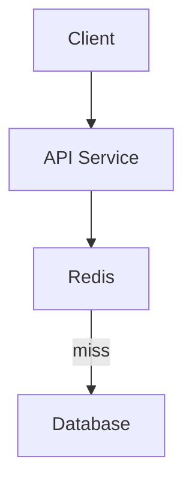

Normal cache hit:

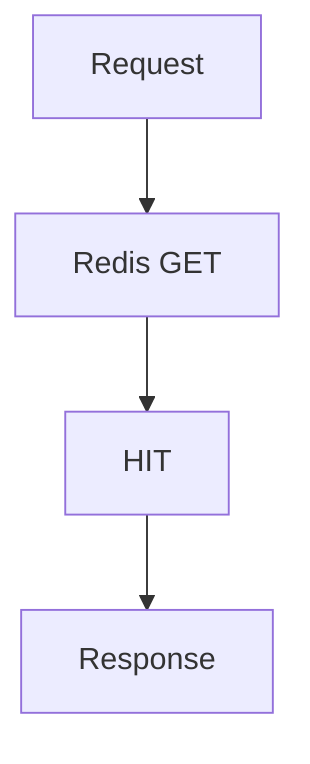

Cache miss:

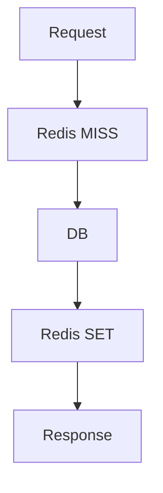

This is commonly called **cache-aside**.

## Why caching?

Caching can reduce:

- DB reads
- network latency
- expensive computation
- repeated queries

Example:

```text
DB query = 20 ms
Redis = sub-millisecond to low milliseconds depending on deployment
```

At scale, reducing DB traffic can be more important than shaving a few milliseconds.

---

# 2. Cache-Aside Pattern

Application owns the cache logic.

### Read

```text
1. GET Redis
2. If hit → return
3. If miss → DB
4. SET Redis
5. return
```

Pseudo-code:

```java
value = redis.get(key);

if (value != null) {
    return value;
}

value = database.get(id);

redis.set(key, value, ttl);

return value;
```

### Write

Often:

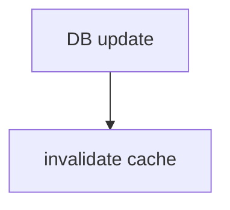

or:

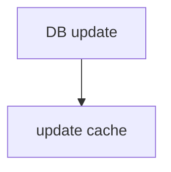

Which one is correct depends on consistency requirements.

## Common problem

DB succeeds:

```text
DB = new value
Redis = old value
```

You need a cache invalidation/update strategy.

---

# 3. Cache Hit Ratio

A key metric:

```text
Hit ratio =
cache hits / total cache requests
```

Example:

```text
1,000,000 requests
900,000 hits
100,000 misses

Hit ratio = 90%
```

A falling hit ratio can dramatically increase DB load.

Monitor:

- hit rate
- miss rate
- Redis latency
- errors
- memory
- evictions
- per-shard traffic

---

# 4. Redis Goes Down

Architecture:

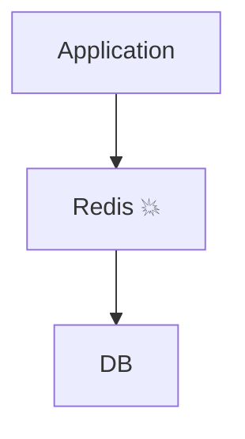

If Redis is only a cache, the application should ideally fall back to DB.

But:

```text
Normal:
10K requests/sec
Redis hit ratio = 90%

DB = 1K/sec
```

Redis fails:

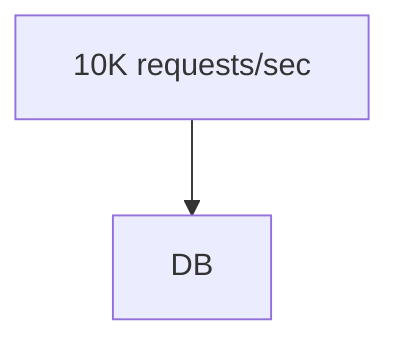

DB traffic becomes 10K/sec.

That's a 10x increase.

## Failure chain

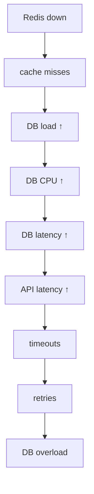

So a cache outage can become a DB outage.

## Protection

- Redis HA/failover
- bounded Redis timeout
- circuit breaker where appropriate
- DB concurrency limits
- rate limiting
- load shedding
- graceful degradation
- local cache for suitable data

## Critical question

Ask:

> Is Redis only a cache, or is it the source of truth?

If it is only a cache, losing it should be recoverable.

If it stores critical state, design durability/recovery accordingly.

---

# 5. Redis Hot Key

## Scenario

You have 100 Redis shards.

One key:

```text
celebrity:123
```

gets 500K requests/sec.

Hashing maps the key to one shard:

```text
Shard 1 → normal
Shard 2 → normal
...
Shard 73 → celebrity:123 → 500K/sec
...
Shard 100 → normal
```

Adding more shards doesn't automatically help because the same key still maps to the same shard.

## Solutions

### L1 local cache

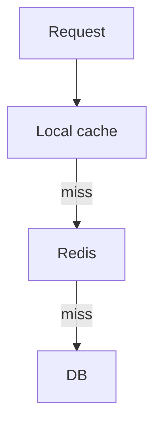

Very effective for popular, slowly changing data.

Trade-off:

- stale values
- memory on every application instance
- invalidation complexity

### Key replication

Instead of one key:

```text
celebrity:123
```

use:

```text
celebrity:123:1
celebrity:123:2
...
celebrity:123:10
```

Distribute reads across replicas/shards.

Trade-off:

- writes must update multiple copies
- consistency becomes harder

### Request coalescing

10,000 identical requests:

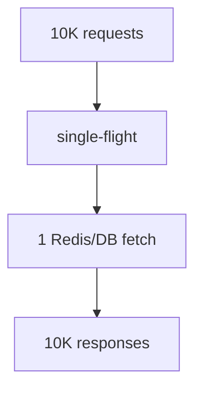

### CDN

For public cacheable data:

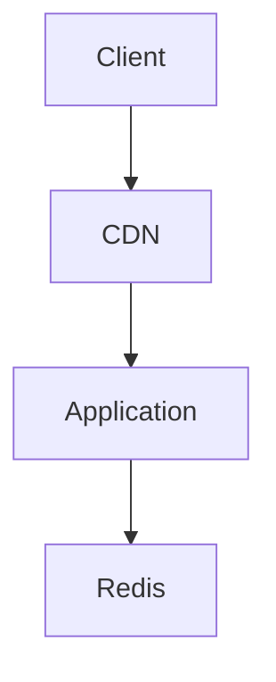

---

# 6. Cache Stampede / Thundering Herd

## Scenario

```text
product:123
TTL = 60 seconds
```

At expiry:

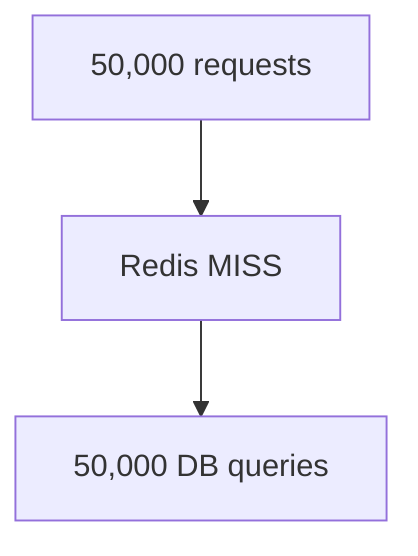

The DB gets overwhelmed.

## Solution: single-flight

First request:

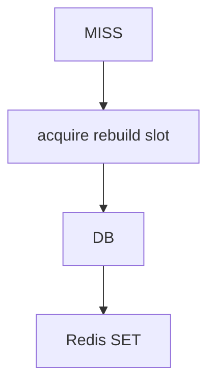

Others:

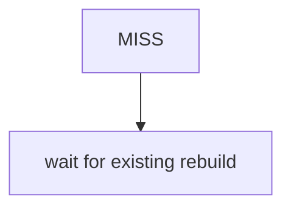

Only one backend request rebuilds the value.

## Distributed application

A JVM lock only protects one application instance.

If you have:

```text
App 1
App 2
...
App 100
```

use a suitable distributed coordination mechanism if required, while understanding lock expiry and failure modes.

## TTL jitter

Instead of:

```text
all TTL = 60 sec
```

use:

```text
60 + random(0..30) sec
```

This reduces synchronized expiration across many keys.

## Proactive refresh

Refresh before expiry:

```text
TTL = 60 sec

At 50 sec:
background refresh
```

## Stale-while-revalidate

For data where staleness is acceptable:

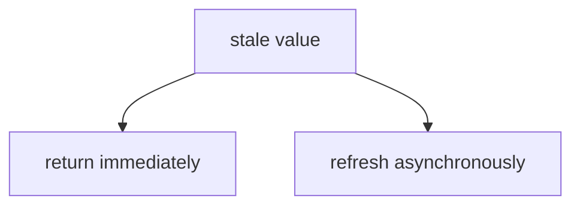

This protects the backend during bursts.

---

# 7. Cache Penetration

A user repeatedly requests nonexistent data:

```text
product:999999
product:888888
product:777777
```

Every request:

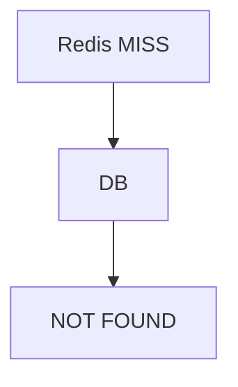

Nothing is cached, so DB keeps receiving the same invalid lookups.

## Solutions

### Negative caching

Cache "not found":

```text
product:999999 → NULL
TTL = 30 sec
```

### Bloom filter

A Bloom filter can cheaply indicate that an item definitely doesn't exist before querying DB.

It can have false positives, but not false negatives under standard use.

### Validation/rate limiting

Reject clearly invalid IDs or abusive patterns before they reach DB.

---

# 8. Cache Avalanche

Cache avalanche usually refers to many cache entries becoming unavailable/expiring around the same time.

Example:

```text
1 million keys
TTL = 60 sec
```

Many expire together:

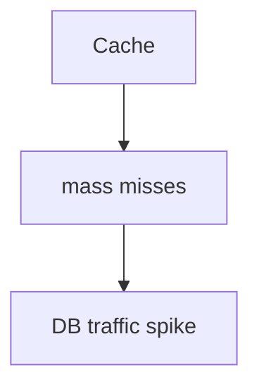

Solutions:

- TTL jitter
- staggered expiration
- proactive refresh
- cache warming
- multi-layer cache
- backend concurrency limits

---

# 9. Hot Key vs Stampede vs Penetration vs Avalanche

| Problem | Meaning | Main protection |
|---|---|---|
| Hot key | One key receives huge traffic | Local cache, replication, coalescing |
| Stampede | Many requests rebuild same expired/missing key | Single-flight, lock, refresh |
| Penetration | Requests target nonexistent keys | Negative cache, Bloom filter |
| Avalanche | Many cache entries disappear together | TTL jitter, warming, refresh |

These are often confused in interviews.

---

# 10. Redis Eviction

Redis may need to evict keys when memory limits are reached.

The appropriate eviction policy depends on workload.

Conceptually:

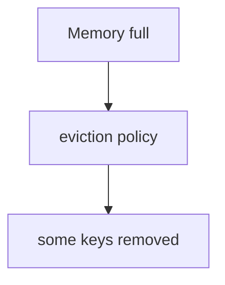

Possible strategies include:

- no eviction
- all-keys LRU/LFU variants
- TTL-aware variants

For cache workloads, eviction is often acceptable because DB remains the source of truth.

For critical state, eviction may be unacceptable.

The important interview question is:

> What happens to the system when the key disappears?

---

# 11. Local Cache + Redis L1/L2

A high-scale read architecture:

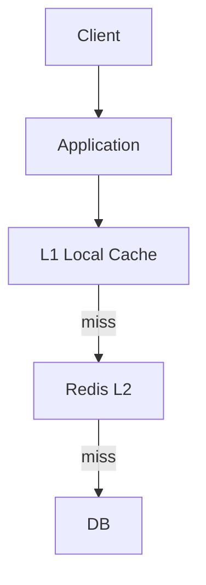

Benefits:

- L1 avoids network hop
- Redis protects DB
- DB remains source of truth

Trade-offs:

- stale data
- invalidation complexity
- memory duplication
- consistency challenges

---

# 12. Downstream Service Becomes Slow

Architecture:

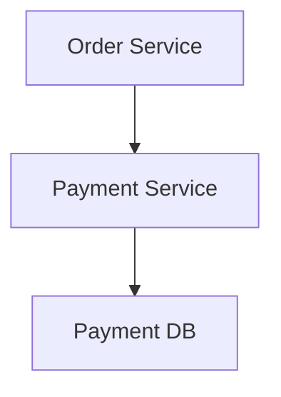

Normally:

```text
Payment = 50 ms
```

Now:

```text
Payment = 5 sec
```

Payment is not down, but it is consuming resources for much longer.

## Failure propagation

```mermaid
flowchart TD
    A["Payment slow"] --> B["Order threads wait"]
    B --> C["thread pool exhausted"]
    C --> D["queue grows"]
    D --> E["API latency increases"]
    E --> F["client timeout"]
    F --> G[retries]
    G --> H["more Payment traffic"]
```

This is cascading failure.

---

# 13. Timeout

Never allow an external call to wait forever.

Example:

```text
Order API budget = 2 sec
Payment timeout = 1 sec
```

The exact value depends on your end-to-end latency budget.

A timeout is a **resource-protection mechanism**.

Longer timeout is not automatically better.

If 100 threads each wait 30 seconds:

```text
100 threads occupied
```

A 5-second timeout already holds resources; 30 seconds holds them even longer.

---

# 14. Bulkhead

Suppose:

```text
Order Service = 100 threads
```

Limit Payment calls:

```text
Payment concurrency = 20
```

Architecture:

```mermaid
flowchart TD
    OS["Order Service<br/>100 threads"] --> PB["Payment bulkhead = 20"]
    OS --> OA["other APIs"]
    OS --> IW["internal work"]
```

Payment cannot consume all 100 slots.

This isolates failures.

---

# 15. Circuit Breaker

States:

```mermaid
stateDiagram-v2
    [*] --> CLOSED
    CLOSED --> OPEN: failures exceed threshold
    OPEN --> HALF_OPEN: cooldown elapsed
    HALF_OPEN --> CLOSED: test succeeds
    HALF_OPEN --> OPEN: test fails
```

### CLOSED

Requests flow normally.

### OPEN

Requests fail fast without calling dependency.

### HALF-OPEN

Small number of test requests determine whether dependency recovered.

---

# 16. Retry with Backoff and Jitter

Bad:

```text
retry immediately
retry immediately
retry immediately
```

Better:

```text
Attempt 1 → fail
wait 100ms + jitter

Attempt 2 → fail
wait 200ms + jitter

Attempt 3 → fail
wait 400ms + jitter
```

Use bounded retries.

Retry only when the operation is safe and failure is likely transient.

For payment creation, idempotency is essential.

---

# 17. Rate Limiting

If Payment can safely process:

```text
100 requests/sec
```

but your service can generate:

```text
1,000/sec
```

protect it:

```mermaid
flowchart TD
    Order --> RL["Rate limiter"]
    RL --> T["100/sec"]
    T --> Payment
```

Excess traffic can be:

- queued
- rejected
- deferred

depending on business requirements.

---

# 18. Async Processing

If the caller does not need the result immediately:

```mermaid
flowchart TD
    Client --> OA["Order API"]
    OA --> Kafka
    Kafka --> PW["Payment Worker"]
    PW --> PS["Payment Service"]
```

The API thread is released quickly.

Example:

```text
POST /payment
→ 202 Accepted
→ paymentId=123
```

Client later checks:

```text
GET /payment/123
```

or receives a webhook/event.

Async processing provides:

- decoupling
- buffering
- controlled concurrency
- backpressure

But don't make a business-critical synchronous operation async without checking the required user experience and consistency semantics.

---

# 19. Backpressure

Suppose:

```text
Producer = 50K/sec
Consumer capacity = 10K/sec
```

Trying to force 50K/sec into the consumer can destroy the downstream system.

Kafka can absorb the difference:

```mermaid
flowchart TD
    Producer --> Kafka["Kafka<br/>(backlog buffer)"]
    Kafka --> Consumer["Consumer<br/>10K/sec"]
```

The backlog is **backpressure** in action.

But a queue is not an infinite solution.

Monitor:

- queue depth
- lag
- oldest message age
- processing rate
- retry rate

If backlog continues indefinitely, capacity or architecture must change.

---

# 20. Dependency Isolation

A mature service treats dependencies as unreliable.

For each dependency define:

```text
Timeout
Retry policy
Circuit breaker
Concurrency limit
Rate limit
Fallback
Monitoring
```

Example:

```mermaid
flowchart TD
    OS["Order Service"] --> P["Payment<br/>timeout 1s<br/>concurrency 20<br/>circuit breaker"]
    OS --> R["Recommendation<br/>timeout 100ms<br/>concurrency 10"]
    OS --> I["Inventory<br/>timeout 500ms<br/>bounded retries"]
```

Different dependencies get different budgets.

---

# Tier 2 Interview Checklist

When Redis is involved, ask:

```text
Is Redis cache or source of truth?
What is cache hit ratio?
What happens on Redis failure?
Can DB handle cache-miss traffic?
Do we have hot keys?
Can many keys expire together?
How do we prevent stampede?
How stale can data be?
```

When a downstream service is involved:

```text
What is its SLA?
What timeout do we have?
Can it consume all threads?
Can it consume all connections?
Are retries bounded?
Is the operation idempotent?
Do we have circuit breaker?
Can we make it async?
How do we shed load?
```

## Tier 2 mantra

> Cache failures must not become database failures.

> Slow dependencies must not consume all application resources.

> Every dependency needs a bounded failure strategy.
