# Tier 3 — Data Consistency & Distributed Transactions

## Goal

This chapter teaches you how to keep business state **correct** when many things touch it at once: concurrent requests, several services, multiple databases, and asynchronous events flying around on a message bus.

You have never built a distributed transaction before. That's fine. We will start from a single bank balance and two users clicking at the same time, and end at multi-service workflows that recover from crashes on their own. Every topic follows the same seven-step arc:

1. **In plain English** — what it is.
2. **Why it happens / why you need it** — the failure story.
3. **A real-world analogy** — an everyday comparison.
4. **What's actually happening** — the mechanism, step by step.
5. **Trade-offs / when to use which**.
6. **Strong interview answer** — how to say it out loud.
7. **Remember this** — one line to burn into memory.

> **The one-line thesis of the whole chapter:** you cannot make many independent systems behave like one perfect database, so instead you make each **local** change safe, publish your **intent** reliably, make every consumer **idempotent**, **compensate** when a step fails, and run a **reconciliation** job to clean up whatever still slips through.

Core topics:

1. Concurrency and race conditions
2. Optimistic locking
3. Pessimistic locking
4. Idempotency
5. Duplicate requests
6. State machines
7. Eventual consistency
8. Strong vs eventual consistency
9. Distributed transactions
10. Two-phase commit
11. Saga pattern (choreography vs orchestration)
12. Saga trade-offs
13. Transactional Outbox
14. Inbox / idempotent consumers
15. Exactly-once misconceptions
16. Ordering and versioning
17. Reconciliation

---

# 1. Race Condition

**In plain English.** A race condition is what happens when two operations touch the same piece of data at nearly the same time, and the final answer depends on who happens to win the "race." Run it twice and you can get two different results — one of them wrong.

**Why it happens.** Most updates are secretly *three* steps, not one: **read** the current value, **change** it in your program's memory, then **write** it back. This is called read–modify–write. If two requests interleave those three steps, one silently overwrites the other's work. This is the classic **lost update**.

Suppose an account balance is ₹1,000. Two requests arrive simultaneously:

```text
Request A reads 1000
Request B reads 1000

A adds 500 → 1500
B subtracts 300 → 700
```

Both read the *same* starting value of 1000, because neither had written its result yet. A computes 1500 and writes it. B computes 700 (from the stale 1000 it read) and writes it *last*, clobbering A's 1500. Expected:

```text
1000 + 500 - 300 = 1200
```

But without concurrency control, the final state becomes ₹700. A's ₹500 deposit simply vanished. This is a race condition.

**A real-world analogy.** Two editors open the same Google Doc *before it had live sync*. Both download the file, both make edits, both hit save. Whoever saves second wins — the first person's paragraphs are gone. The document didn't "merge" the edits; it just kept the last write.

**What's actually happening — the interleaving.**

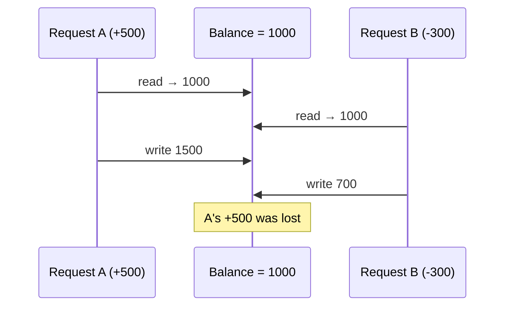

The bug is not in the arithmetic — each request did its math correctly. The bug is that they both read **before** either wrote. The fix is always the same idea: make the read-modify-write behave as one indivisible unit, so a second writer either waits or is forced to notice it was working on stale data. The next two topics are the two ways to do exactly that.

**Trade-offs.** You cannot just "add more servers" to fix a race condition — more concurrency makes it *worse*. You need an actual concurrency-control strategy: optimistic locking (Section 2) or pessimistic locking (Section 3).

**Strong interview answer.**
> "The danger with a balance update is a lost update: two requests both read the old value, each computes on stale data, and the second write silently overwrites the first. I'd protect the read-modify-write with either optimistic locking using a version column, or a pessimistic `SELECT ... FOR UPDATE`, depending on how often these requests actually collide."

**Remember this.** *A race condition is a lost update: two readers, one stale write. Never let read-modify-write run unprotected.*

---

# 2. Optimistic Locking

**In plain English.** Optimistic locking means you **don't** lock the row up front. You assume conflicts are rare (you're being "optimistic"), let everyone read freely, and only at write time do you check: *"has anyone changed this row since I read it?"* If someone did, your write fails and you retry.

**Why you need it.** Locking a row for the entire duration of a request is expensive and hurts throughput. If collisions are rare — most of the time nobody else is touching that exact row — paying for a lock every single time is wasteful. Optimistic locking lets the common (no-conflict) case run at full speed and only pays a price in the rare case where two writers actually clash.

**A real-world analogy.** Wikipedia editing. Anyone can open an article and start editing — no reservation, no lock. When you click save, Wikipedia checks whether the article changed since you opened it. If it didn't, your edit lands. If someone else saved in the meantime, you get an "edit conflict" and must redo your change on top of the new version. Nobody was blocked; the conflict was only *detected* at save time.

**What's actually happening.** You add a `version` column to the row:

```text
id | balance | version
123| 1000    | 5
```

When you read the row, you remember `version = 5`. When you write, you include that version in the `WHERE` clause and bump it:

```sql
UPDATE accounts
SET balance = 1200,
    version = 6
WHERE id = 123
  AND version = 5;
```

Now think about two racing requests. Both read version 5. The first one to commit changes the row to version 6. The second request runs its `UPDATE ... WHERE version = 5` — but there is no longer a row with version 5, so the update matches **zero rows**. The database reports "0 rows affected."

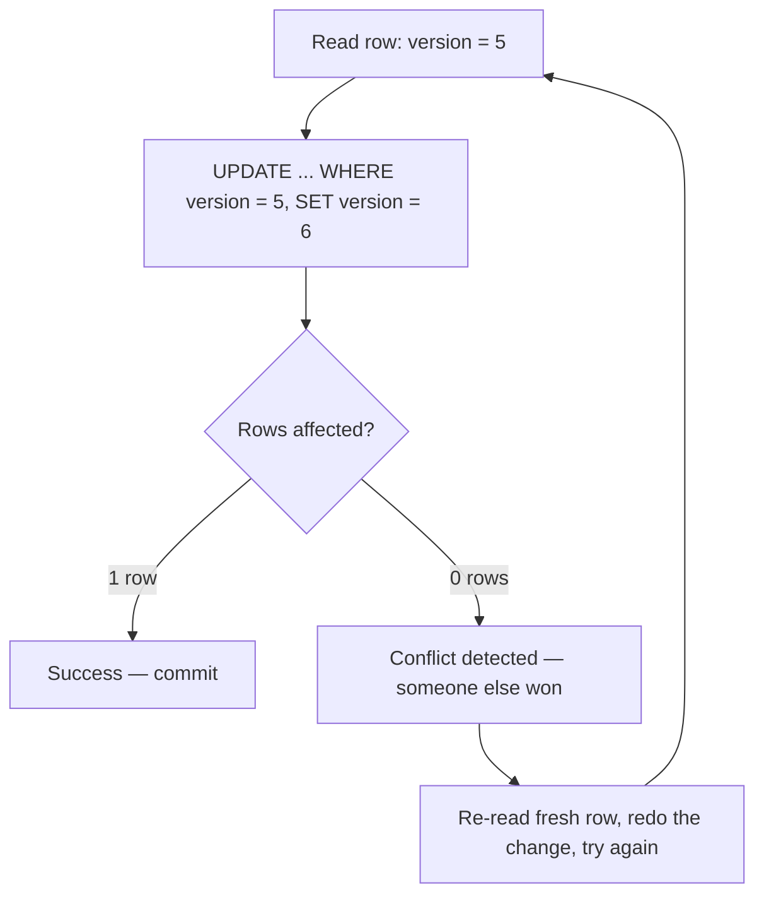

That "0 rows affected" is the whole trick: it is how the application *detects* a conflict without ever holding a lock. The application then re-reads the fresh row, recomputes on top of the new value, and retries (or gives up and returns an error to the user).

**Trade-offs / when to use which.**

- **Use optimistic when conflicts are rare.** Product catalog edits, user profile updates, most CRUD. The retry almost never fires.
- **Downside:** under high contention (many writers hitting the *same* row), you get a storm of failed updates and retries — wasted work. At that point pessimistic locking is cheaper.
- **You must handle the retry** in code. Forgetting to retry means silently dropping the user's write.

**Strong interview answer.**
> "For low-contention updates I prefer optimistic locking: a version column, and an `UPDATE ... WHERE version = N`. If it affects zero rows, someone beat me to it, so I re-read and retry. It avoids holding locks and keeps the happy path fast. If the same row gets hammered by many concurrent writers, I'd switch to pessimistic locking because the retry storm would be worse than just waiting."

**Remember this.** *Optimistic locking = don't lock, just detect. `WHERE version = N` returning 0 rows means "you lost the race — retry."*

---

# 3. Pessimistic Locking

**In plain English.** Pessimistic locking is the opposite bet: you assume conflicts are **likely** (you're "pessimistic"), so you grab an exclusive lock on the row *before* you touch it. Anyone else who wants that row has to wait in line until you're done.

**Why you need it.** When many requests genuinely fight over the same row — a flash-sale product with 5 units left, a hot ledger account — optimistic retries would fail over and over, burning CPU on doomed attempts. It's cheaper to just serialize: make writers take turns, one at a time, guaranteed.

**A real-world analogy.** A single bathroom with a lock on the door. Whoever gets in locks it; everyone else waits in the hallway. There is zero chance of two people using it simultaneously — but if one person takes forever, the queue backs up. That queue is **lock contention**, and if two people are each waiting for a room the other is holding, that's a **deadlock**.

**What's actually happening.** You use `SELECT ... FOR UPDATE`, which reads the row **and** locks it in the same statement:

```sql
SELECT *
FROM accounts
WHERE id = 123
FOR UPDATE;
```

From this moment until your transaction commits or rolls back, no other transaction can `SELECT ... FOR UPDATE` or modify row 123 — they block and wait.

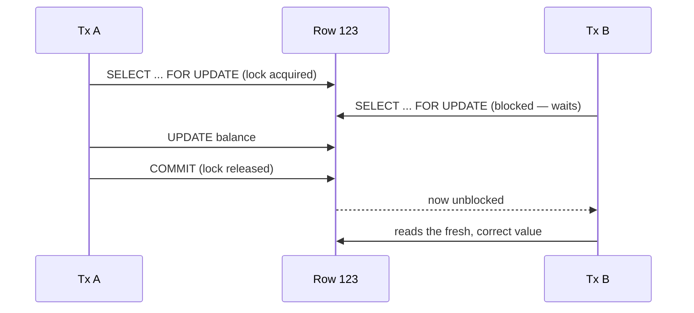

Because B is forced to wait until A commits, B reads A's *result*, not stale data. There is no lost update — the writes are serialized.

**Trade-offs / when to use which.**

Good when:

- conflicts are frequent (the same rows are contended constantly)
- correctness absolutely requires serialized updates (money, inventory counts)

Trade-offs to say out loud:

- **lock contention** — waiters pile up behind a slow holder
- **deadlocks** — two transactions each hold a lock the other wants; the DB kills one
- **reduced concurrency** — you deliberately serialized, so throughput drops
- **long transactions are dangerous** — a lock held across a network call or user think-time can freeze a whole table's worth of traffic

**Optimistic vs pessimistic — the decision.**

| | Optimistic | Pessimistic |
|---|---|---|
| Assumes conflicts are… | rare | common |
| Locks up front? | no | yes (`FOR UPDATE`) |
| Cost of a conflict | a retry | a wait |
| Fails at… | high contention (retry storms) | low contention (needless waiting) |
| Best for | CRUD, catalogs, profiles | hot rows: inventory, ledgers, seat booking |

Rule of thumb: **rare conflicts → optimistic; frequent conflicts → pessimistic.**

**Strong interview answer.**
> "For a hot row that many requests contend over — say the last few units of inventory — I'd use pessimistic locking with `SELECT ... FOR UPDATE` so writes serialize and nobody over-sells. I keep the locked transaction as short as possible — never a network call while holding the lock — to limit contention, and I'm aware of deadlock risk, so I lock rows in a consistent order."

**Remember this.** *Pessimistic locking = lock first, ask questions never. Great for hot rows; keep the transaction tiny or you'll strangle throughput.*

---

# 4. Idempotency

**In plain English.** An operation is **idempotent** if doing it once and doing it five times produce the same final result. "Set balance to ₹0" is idempotent (run it 100 times, balance is still ₹0). "Subtract ₹100" is **not** (run it 5 times and you've charged ₹500). Idempotency is the property that makes it safe to *retry* without fear.

**Why you need it.** In a distributed system, a request can be delivered **more than once**, through no bug of yours:

- **client timeout** — the client gave up waiting and resent, but the first request actually succeeded
- **network failure** — the response was lost, so the client retries
- **service retry** — your own retry logic fires again
- **user double-click** — impatient human clicks "Pay" twice
- **message redelivery** — the queue re-delivers after a consumer crash

Without idempotency, a retried "charge ₹500" charges the customer twice. This is one of the most common real-world production incidents.

**A real-world analogy.** An elevator call button. You press it, then press it three more times because you're impatient. The elevator still comes exactly **once**. The button "remembers" the request is already registered and ignores the extra presses. That memory of "I've already handled this request" is exactly what an idempotency key gives you.

**What's actually happening.** The client attaches a unique **idempotency key** to the operation:

```text
Idempotency-Key = ABC123
```

The server keeps a table mapping each key to the result of the first time it processed that key:

```text
ABC123 → paymentId + result
```

On the very first request with `ABC123`, the server does the work, stores the result under `ABC123`, and returns it. On any *repeat* of `ABC123`, the server sees the key already exists and returns the **stored** result instead of doing the work again.

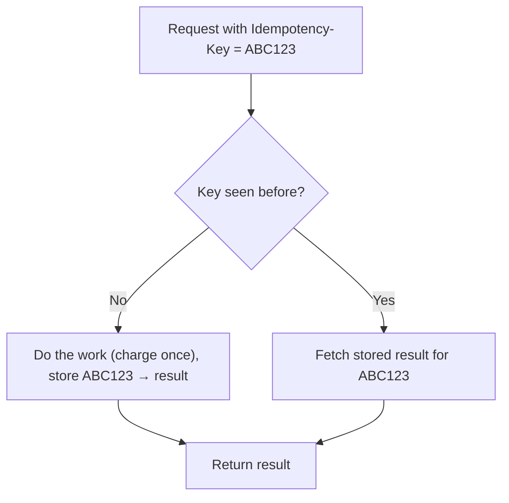

The client can safely retry as many times as it likes; only the **first** attempt has an effect.

**The key mental model.**

> One *logical* operation may have many *physical* attempts.

Your job is to make sure the logical operation happens exactly once even though the physical request may arrive many times. Idempotency is how you turn an unreliable "at-least-once" world into a reliable "effectively-once" world.

**Trade-offs.** You must **store** the key + result somewhere durable, and decide how long to keep it (a TTL). You also have to handle the concurrent-duplicate case: two copies of `ABC123` arriving *at the same time* — usually solved with a unique constraint on the key so the second insert fails and you return the first result.

**Strong interview answer.**
> "I assume every request can arrive more than once — timeouts, retries, double-clicks, message redelivery. So I make write operations idempotent with a client-supplied idempotency key. The first time I see the key I do the work and store the key with its result; every repeat returns the stored result. One logical operation, many physical attempts, exactly one effect."

**Remember this.** *Idempotency = "do it again, get the same result." Store the key, return the stored result on repeats. It's the antidote to retries and duplicates.*

---

# 5. State Machine

**In plain English.** A state machine is a rulebook that says which states an entity can be in (`CREATED`, `PROCESSING`, `SUCCESS`, `REFUNDED`) and exactly which transitions between them are legal. Instead of letting code set `status` to any value at any time, you only ever allow moves the rulebook permits.

**Why you need it.** Without a state machine, concurrent or out-of-order events can drive an entity into nonsense. Imagine a refund event and a "mark as processing" event arriving out of order — you could flip a `REFUNDED` payment back to `PROCESSING`, then charge it again. A state machine makes that impossible by **rejecting** the illegal transition.

**A real-world analogy.** A traffic light. It goes green → yellow → red → green. It is physically wired so it can **never** jump green → red directly, and never red → yellow. The "impossible" transitions simply aren't reachable. Your payment status should be just as disciplined.

**What's actually happening.** You define the legal states and transitions:

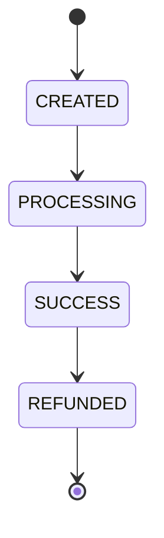

Then, on every state change, you check: *is this transition allowed from the current state?* If not, reject it:

```text
SUCCESS → PROCESSING ❌
REFUNDED → SUCCESS ❌
```

Two more things fall out of this design for free:

- **Idempotency by state.** If an event says "move to `SUCCESS`" and you're *already* `SUCCESS`, you can safely ignore it — that's a duplicate, not an error.
- **Out-of-order protection.** A stale event trying to move you *backwards* is simply an illegal transition, so it's dropped.

**Trade-offs / when to use which.** State machines shine anywhere an entity has a **lifecycle**: payments, orders, shipments, subscriptions, KYC verification, support tickets. The cost is up-front modeling — you must enumerate the states and legal moves. For a value with no meaningful lifecycle (a user's display name), it's overkill.

**Strong interview answer.**
> "For anything with a lifecycle — a payment or order — I model an explicit state machine and only allow legal transitions. It prevents illegal jumps like `REFUNDED → SUCCESS`, and it gives me idempotency and out-of-order protection almost for free: a duplicate event that would move me to a state I'm already in is a no-op, and a stale event that moves me backwards is an illegal transition I can safely reject."

**Remember this.** *A state machine is a rulebook of legal transitions. Reject the illegal ones — you get correctness, idempotency, and out-of-order safety in one move.*

---

# 6. Eventual Consistency

**In plain English.** Eventual consistency means different parts of the system are allowed to disagree *for a little while*, as long as they **converge** to the same answer once all the in-flight work finishes. It is the opposite of "everything updates atomically the instant I write."

**Why it happens.** The moment you split a system into multiple services connected by a message bus, updates propagate **asynchronously**. Service A commits, publishes an event, and Service B processes it a few milliseconds (or seconds) later. In that gap, A and B disagree. You didn't choose inconsistency on purpose — it's the natural consequence of async communication.

**A real-world analogy.** You post a photo to social media. You see it instantly. Your friend on another continent doesn't see it for a few seconds while it replicates to their region's servers. The system isn't broken — it's **eventually** consistent. Given a moment, everyone sees the same photo.

**What's actually happening.** Consider a payment that publishes an event to an order service:

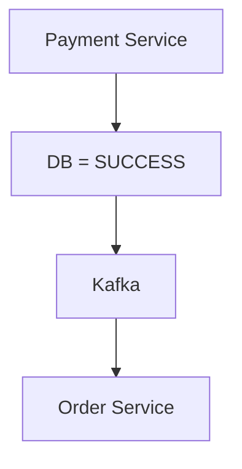

For a short window after the payment commits but before the order service consumes the event:

```text
Payment = SUCCESS
Order = PENDING
```

The two services disagree. Once the order service processes the `PaymentCompleted` event, it catches up and both read `SUCCESS`. The system has become **eventually consistent**.

**Trade-offs / when it's acceptable.** The critical design question — and a favorite interview probe — is:

> What inconsistency window is acceptable?

For a "like" count, a few seconds of staleness is invisible and totally fine. For "did this ₹50,000 transfer complete," a stale read could be dangerous, so you'd want stronger guarantees on the read path. Eventual consistency is a **business decision**, not a technical default: you accept a bounded disagreement window in exchange for availability, scalability, and decoupling.

**Strong interview answer.**
> "Once state spans multiple services over a message bus, there's an unavoidable window where they disagree before the event is processed — that's eventual consistency. The real question isn't whether it exists, it's how long a window the business can tolerate. For a like count, seconds are fine; for a financial confirmation, I'd read from the source of truth or use stronger consistency on that path."

**Remember this.** *Eventual consistency = "disagree now, converge soon." The interview question is always: how big a window can the business tolerate?*

---

# 7. Strong vs Eventual Consistency

**In plain English.** These are the two ends of the consistency spectrum. **Strong** consistency guarantees that once a write succeeds, every subsequent read sees it — no stale data, ever. **Eventual** consistency (Section 6) allows temporary disagreement that resolves over time. Strong is stricter and slower; eventual is looser and faster.

**Why the choice matters.** Strong consistency requires coordination (waiting for replicas to agree, or reading from one authoritative place), which costs latency and availability. Eventual consistency skips that coordination, so it's faster and stays available even when parts of the system are slow — but you can read stale data. You can't have maximum strictness *and* maximum speed/availability at the same time, so you must choose per use case.

**A real-world analogy.** Two ways to check your bank balance:

- **Strong:** the ATM asks the central ledger directly and waits. Slower, but the number is authoritative — you can't overdraw based on stale data.
- **Eventual:** a cached "estimated balance" in your mobile app that lags real-time by a bit. Instant to show, occasionally behind.

Both are useful — for *different* jobs.

**What's actually happening.**

### Strong consistency

A read after a successful write always observes the new state. Achieved by reading from the leader/source of truth, or by waiting for a quorum of replicas to acknowledge. Use it for:

- critical financial state (balances, ledgers)
- operations where stale data is unacceptable (has this coupon already been redeemed?)

### Eventual consistency

Replicas and downstream services converge over time. Cheaper, faster, more available. Use it for:

- search indexes (a new product appearing a second late is fine)
- notifications
- analytics
- recommendations

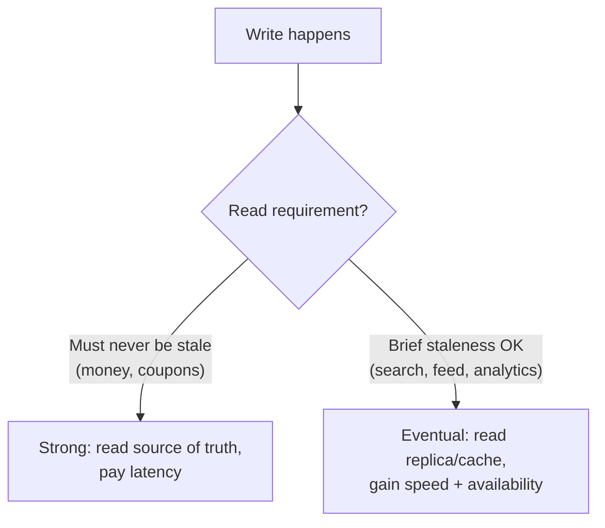

**Trade-offs / when to use which.** Choose based on **business requirements, not personal preference.** A common mature pattern is to mix them: strong consistency on the narrow slice that must be exact (the payment write), eventual consistency on everything downstream (the search index, the analytics pipeline, the email notification).

**Strong interview answer.**
> "I don't pick one globally — I pick per operation. Financial writes and 'has this been used already' checks get strong consistency, even at a latency cost. Search indexes, feeds, notifications, and analytics get eventual consistency because a second of staleness is invisible and I gain availability and scale. The driver is the business requirement, not a blanket preference."

**Remember this.** *Strong = never stale, but slower and more fragile. Eventual = fast and available, but briefly stale. Choose per use case; most systems mix both.*

---

# 8. Distributed Transaction Problem

**In plain English.** A distributed transaction is when you need **two or more independent systems** to either all succeed together or all fail together — but they're separate databases (or services), and no single database transaction can span them.

**Why it's hard.** A normal DB transaction gives you ACID: everything inside `BEGIN ... COMMIT` is atomic — all or nothing. But that guarantee lives *inside one database*. The moment your operation touches two databases, or a database plus an external payment API, there's no `BEGIN` that wraps both. If you commit the first and the second fails, you're stuck with half-done state.

Suppose you have:

```text
Order DB
+
Payment DB
```

And you want:

```text
Order created
AND
Payment successful
```

as **one atomic transaction**. But they are independent systems. A normal DB transaction cannot span them. So what actually happens on failure? You create the order, then the payment call fails — now you have an order with no payment. Or you charge the payment, then the order insert fails — now the customer paid for nothing.

**A real-world analogy.** Buying a house and getting the mortgage are handled by two different offices — the seller's lawyer and the bank. There is no single "commit" button that finalizes both at the exact same instant. So the industry invented **escrow**: a coordinated, staged process with a trusted middleman and defined steps for what happens if either side backs out. Distributed transactions are software's version of escrow.

**What's actually happening — your options.** Since one big transaction is impossible, you pick a strategy:

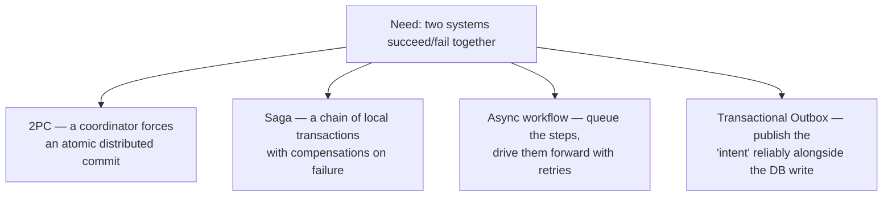

- **2PC** (Section 9): strict atomic commit via a coordinator — strong but blocking.
- **Saga** (Section 10): break it into local transactions, undo with compensations — scalable but eventually consistent.
- **Async workflow**: model it as steps on a queue, retry until done.
- **Transactional Outbox** (Section 12): the plumbing that makes "commit + publish event" reliable.

**Trade-offs.** At small scale with two databases you control, 2PC is tempting. At large scale, across services owned by different teams and third-party APIs, 2PC's blocking and coordination cost pushes almost everyone toward **saga + outbox + idempotency**.

**Strong interview answer.**
> "The core problem is that ACID stops at the boundary of a single database. Once an operation spans an order DB and a payment provider, no single transaction wraps both, so a crash between the two leaves half-done state. My options are 2PC for a strict atomic commit, or — far more common at scale — a saga of local transactions with compensating actions, made reliable with a transactional outbox and idempotent consumers."

**Remember this.** *ACID stops at one database's edge. Spanning two systems atomically is impossible, so you choose: 2PC (strict, blocking) or saga (scalable, eventually consistent).*

---

# 9. Two-Phase Commit (2PC)

**In plain English.** Two-phase commit is a protocol where a **coordinator** gets every participant to agree to commit *before* anyone actually commits. Phase 1: "Can you all commit?" Phase 2: "OK, everyone commit now." It gives you a genuine atomic commit across multiple databases — all or nothing.

**Why you'd want it.** It's the one option that truly delivers ACID-like atomicity across systems: either every participant commits, or every participant rolls back. No half-done state. For a small number of databases you fully control, that's a strong guarantee.

**A real-world analogy.** A wedding officiant. Phase 1 (the "prepare"): the officiant asks each party "do you take...?" and each says "I do" — a promise, but not yet final. Phase 2 (the "commit"): "I now pronounce you married" — only after *both* said yes. If either had said no during phase 1, the whole thing is called off and nobody is married. The officiant is the coordinator; the two "I do"s are the prepare votes.

**What's actually happening.**

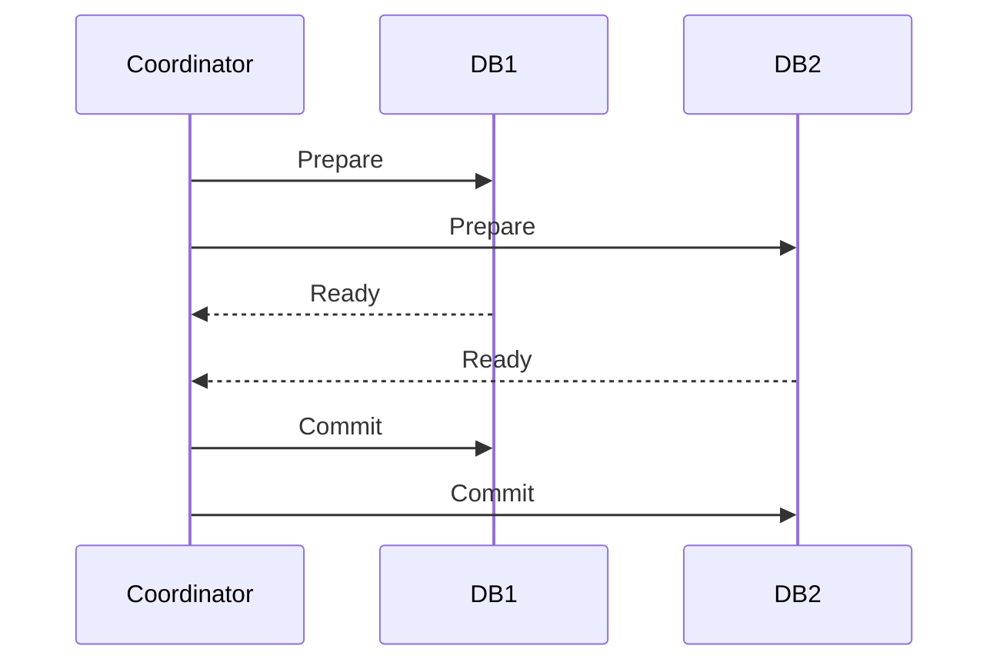

- **Phase 1 — Prepare/Vote.** The coordinator asks each participant to *prepare*. Each participant does everything short of committing — writes the changes to durable storage, takes locks — and replies "Ready" (a promise it *can* commit) or "No."
- **Phase 2 — Commit/Abort.** If **all** voted Ready, the coordinator tells everyone to Commit. If **any** voted No (or timed out), it tells everyone to Abort. Because everyone already promised in phase 1, the commit can't fail.

**Advantages:**

- atomic distributed commit — real all-or-nothing across systems

**Problems (why big systems avoid it):**

- **coordination overhead** — two round trips to every participant
- **blocking** — here's the killer: a participant that voted "Ready" is now holding locks and **must wait** for the coordinator's decision. If the coordinator crashes after phase 1, that participant is stuck holding locks indefinitely, unable to commit or abort. This is the infamous 2PC blocking problem.
- **availability impact** — one slow or dead participant stalls everyone
- **operational complexity** — you need a reliable, recoverable coordinator

**Trade-offs / when to use which.** 2PC is reasonable for a **small, controlled set of databases** where correctness beats availability and the participants are fast and reliable (some XA-transaction setups, some distributed databases use it internally). At scale — many services, third-party APIs, teams that deploy independently — the blocking and coordination cost is unacceptable, and modern architectures prefer **saga / event-driven** approaches instead.

**Strong interview answer.**
> "2PC gives a true atomic commit across databases via a coordinator: a prepare phase where everyone votes, then a commit phase once all vote yes. The problem is it's blocking — a participant that voted 'ready' holds locks until the coordinator decides, and if the coordinator dies, that participant is stuck. That fragility and the availability hit are why at scale I reach for sagas instead, accepting eventual consistency in exchange for resilience."

**Remember this.** *2PC = coordinator asks 'ready?' then says 'commit.' Truly atomic, but a crashed coordinator leaves participants blocked holding locks. Great in the small, avoided at scale.*

---

# 10. Saga Pattern

**In plain English.** A saga breaks one big distributed transaction into a **sequence of small local transactions**, one per service. Each step commits on its own immediately. If a later step fails, you don't roll back (you can't — earlier steps already committed); instead you run **compensating actions** that undo the earlier steps' effects.

**Why you need it.** 2PC's blocking makes it a poor fit at scale. A saga never holds a distributed lock — each service does its own quick local transaction and moves on. The price is that you give up instantaneous atomicity: for a while the overall operation is half-done, and if something fails you must actively *undo* rather than magically roll back.

**A real-world analogy.** Booking a vacation: flight, then hotel, then rental car — three separate companies, three separate confirmations. There's no single "book the whole trip atomically" button. If the car rental fails, you don't get an automatic rollback of the flight and hotel; you **cancel** them yourself. Those cancellations are compensating actions. A saga is exactly this: do each booking, and if a later one fails, cancel the earlier ones.

**What's actually happening.** The forward path is a chain of local transactions:

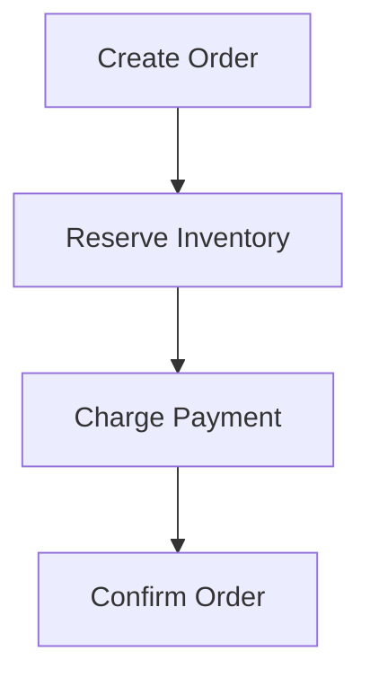

If Payment fails, you run the compensations for the steps that already succeeded:

```text
Cancel Order
+
Release Inventory
```

These are **compensating actions** — semantic undos. (You don't "un-charge"; you *refund*. You don't delete the order; you *cancel* it.)

There are two ways to coordinate the chain.

## Choreography

Services react to each other's **events** — no central brain. Each service listens for the event that means "your turn," does its local transaction, and emits the next event:

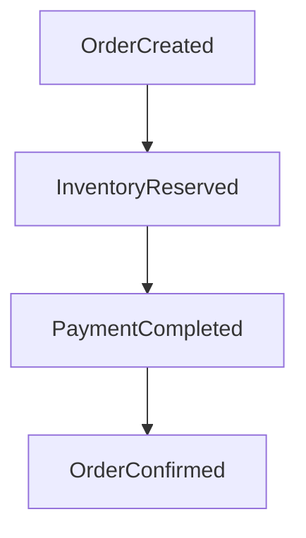

No central coordinator. The workflow is *emergent* — it lives in the wiring of who-listens-to-what.

## Orchestration

A dedicated **saga orchestrator** explicitly tells each service what to do and listens for the reply, driving the workflow from one place:

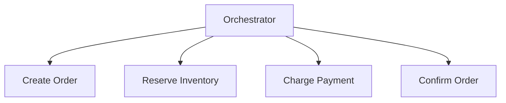

Easier to visualize and control, and the compensation logic lives in one place — but you've added a coordinator component you have to build and run.

**Choreography vs orchestration — when to use which.**

| | Choreography (events) | Orchestration (central) |
|---|---|---|
| Coordinator | none | a saga orchestrator |
| Workflow lives… | spread across services | in one place |
| Best for | simple, few-step flows | complex, many-step flows |
| Downside | hard to see the whole flow; easy to create hidden event loops | the orchestrator is a component to build, scale, and not make a bottleneck |
| Debugging | "where did this flow go?" is painful | one place to look |

Rule of thumb: **few simple steps → choreography; complex multi-step workflow with lots of branching and compensation → orchestration.**

**Strong interview answer.**
> "A saga replaces one distributed transaction with a chain of local transactions, each committing immediately, and compensating actions to undo earlier steps if a later one fails. For a simple flow I'd use choreography — services react to each other's events, no coordinator. For a complex workflow with lots of branches and compensations, I'd use orchestration so the logic lives in one visible, debuggable place. Either way it's eventually consistent and every step and compensation must be idempotent."

**Remember this.** *Saga = many local transactions + compensations, not one atomic commit. Choreography = services react to events (no brain); orchestration = one coordinator drives it.*

---

# 11. Saga Trade-offs

**In plain English.** A saga is powerful but it is **not** free ACID across services. You are explicitly trading away instant atomicity and isolation in exchange for scalability and resilience. This section is about being honest with yourself (and the interviewer) about what you gave up.

**Why this matters.** Beginners reach for sagas thinking "great, now I have transactions across services." You don't. You have a *choreographed cleanup protocol*. If you don't design the compensations and intermediate states carefully, the saga leaves corrupt state behind.

Saga does **not** magically provide ACID across services. What you accept instead:

- **intermediate states** — for a while the system is visibly half-done (order created, not yet paid). Other reads can *see* that in-between state (no isolation).
- **eventual consistency** — the whole operation settles over time, not instantly.
- **compensating actions** — you must design a semantic undo for every step.
- **more complex failure handling** — there are many more failure branches than a single transaction.

**A concrete failure story.** Consider:

```text
Payment succeeds
Inventory fails
```

Payment already committed. Now you must compensate:

```text
Refund Payment
```

But here's the trap that catches people: **a compensation can itself fail.** The refund call might time out or the refund service might be down. So a compensation is not fire-and-forget — it needs **retries** and it must be **idempotent** (retrying the refund must not refund twice). Compensations are just as much "real distributed work" as the forward steps.

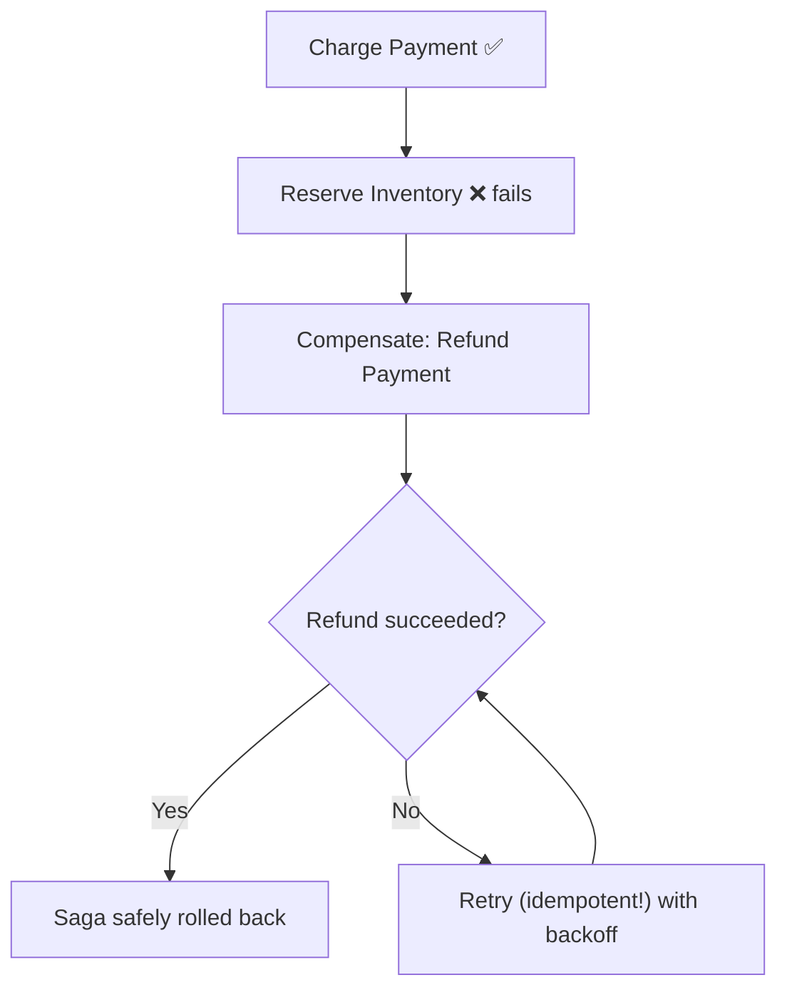

**Trade-offs / the honest summary.** Use a saga when the business can tolerate eventual consistency and visible intermediate states, and when you can define a sensible semantic undo for each step. Do **not** use a saga where you need strict isolation (nobody may ever observe the half-done state) or where some step is genuinely un-compensatable (you truly cannot undo it). In those cases you need stronger coordination or a redesign.

**Strong interview answer.**
> "A saga isn't ACID across services — I'm trading isolation and instant atomicity for scale. I accept visible intermediate states and eventual consistency, and I design an idempotent compensating action for every step. The subtle part is that compensations can fail too, so they need retries with backoff and must be idempotent — a refund that runs twice can't refund twice. If a step is truly un-undoable, a saga is the wrong tool."

**Remember this.** *A saga is a cleanup protocol, not free cross-service ACID. Every compensation can fail — so make compensations retryable and idempotent too.*

---

# 12. Transactional Outbox

**In plain English.** The outbox pattern solves one narrow but vicious problem: how do you **update your database AND publish an event, atomically**, when the database and the message broker are two separate systems? The trick: don't publish directly. Instead, write the event into an "outbox" table *in the same DB transaction* as your business change, then a separate process reads that table and publishes to Kafka.

**Why you need it.** The naive approach — commit to the DB, then publish to Kafka — has a fatal gap. What if the DB commit succeeds but the process crashes before the Kafka publish? You've changed state but the rest of the world never hears about it. (And if you publish *first*, you can publish an event for a transaction that then rolls back — a phantom event.) This "dual write" problem has no safe ordering: two independent systems, no shared transaction.

**A real-world analogy.** You want to guarantee that "record the sale" and "notify the warehouse" both happen or neither does. Instead of phoning the warehouse the instant you ring up the sale (a call that might drop right after the cash register logs it), you write the shipping order into an **outbox tray** *as part of* logging the sale — one atomic act at your desk. A mail clerk empties the outbox tray and delivers the orders later. The sale and the intent-to-ship are recorded together; delivery is decoupled and retryable.

**What's actually happening.** Inside a single DB transaction you do **two** writes — the business change and an outbox row:

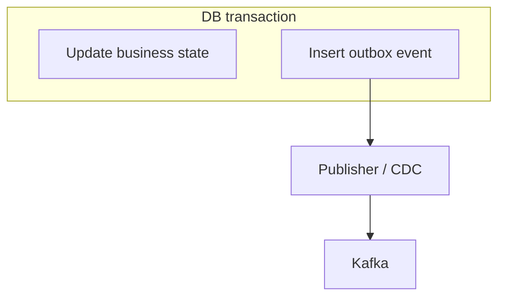

Because both writes are in the same transaction, they commit together or not at all. There is no window where the state changed but the event intent didn't get recorded. A separate **publisher** — either a poller that reads new outbox rows, or a **CDC** (Change Data Capture) process tailing the DB's write-ahead log — then delivers those rows to Kafka and marks them sent.

This prevents the classic failure:

```text
DB success + event lost
```

when implemented correctly.

**Trade-offs.** The publisher can crash *after* sending to Kafka but *before* marking the outbox row as sent — so on restart it re-sends. That means delivery is **at-least-once**: an event can be published more than once. Therefore:

> Consumers of outbox events **must be idempotent** (see the Inbox pattern, next).

You also add a little latency (the poll interval or CDC lag) and an outbox table to maintain. The upside — never silently losing an event after a committed state change — is almost always worth it for anything money- or order-related.

**Strong interview answer.**
> "The dual-write problem is that a DB commit and a Kafka publish are two systems with no shared transaction — commit-then-publish can lose the event on a crash, and publish-then-commit can emit a phantom. I solve it with a transactional outbox: I insert the event into an outbox table in the same transaction as the business change, so they're atomic. A publisher or CDC process then ships those rows to Kafka. Delivery is at-least-once, so consumers must be idempotent."

**Remember this.** *Outbox = write the event into an outbox table in the same transaction as the state change, publish it separately. Fixes the dual-write problem; delivery is at-least-once, so consumers must be idempotent.*

---

# 13. Inbox Pattern (Idempotent Consumer)

**In plain English.** The inbox pattern is the consumer-side twin of the outbox. Because events can be delivered more than once (at-least-once delivery), a consumer must be able to recognize "I've already processed this event" and skip it. The inbox does that by recording each processed event's ID in a table, **in the same transaction** as the business change it triggers.

**Why you need it.** The outbox (and Kafka, and most brokers) give you at-least-once delivery — duplicates are guaranteed to happen eventually. If a consumer processes "PaymentCompleted" twice, it might ship the order twice or credit an account twice. The inbox makes the consumer idempotent so duplicates are harmless.

**A real-world analogy.** A bouncer with a guest list who marks off each name as people enter. If someone already stamped tries to walk in again, the bouncer sees the mark and turns them away — "you're already in." The list of marked-off names is the inbox / processed-events table.

**What's actually happening.** The consumer receives an event carrying a unique ID:

```text
eventId = E123
```

It stores that ID in an inbox (a "processed-events" table) **in the same transaction** as the business change. Because the two are one atomic unit, you can never end up having applied the change without recording the ID, or vice versa:

```text
BEGIN
insert E123
update business state
COMMIT
```

The `insert E123` has a unique constraint on the event ID. So when a **duplicate** arrives:

```text
E123 already exists
→ ignore
```

The insert fails (or you check first), you recognize it as a duplicate, and you skip the work entirely.

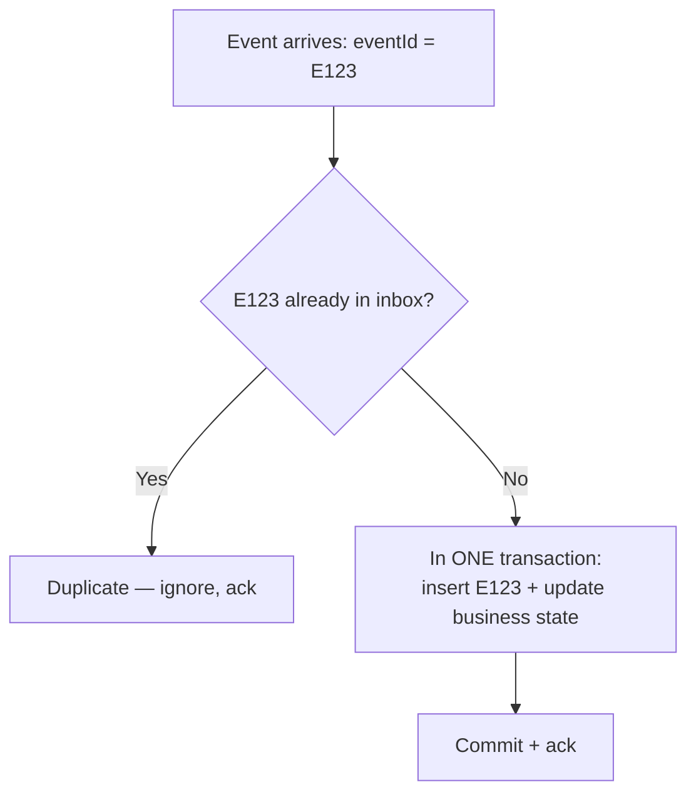

**Trade-offs.** You maintain a processed-events table and give it a TTL / archival strategy so it doesn't grow forever. The critical detail is that the ID-insert and the business change must be in the **same transaction** — if you record the ID in a separate step, a crash in between reintroduces the duplicate-processing bug. Note the symmetry: **outbox** protects the *producer* (never lose an event); **inbox** protects the *consumer* (never process an event twice).

**Strong interview answer.**
> "Since delivery is at-least-once, my consumers are idempotent via an inbox: I record each event's ID in a processed-events table in the same transaction as the business update. A duplicate event hits the unique constraint and I skip it. The key is that recording the ID and applying the change are one atomic transaction — otherwise a crash in between reopens the double-processing hole. Outbox protects the producer; inbox protects the consumer."

**Remember this.** *Inbox = record the event ID in the same transaction as the business change. Duplicate ID → skip. It's how you make a consumer idempotent under at-least-once delivery.*

---

# 14. Exactly Once

**In plain English.** "Exactly-once" is one of the most misunderstood phrases in distributed systems. In the real world, you generally cannot guarantee a message is *delivered* exactly once. What you *can* guarantee is that the *business effect* happens exactly once — by combining at-least-once delivery with idempotency.

**Why the confusion is dangerous.** Marketing slides say "Kafka gives exactly-once." Junior engineers then assume they can skip idempotency. Then a duplicate slips through (a rebalance, a redelivery, an external API retry) and the customer gets charged twice. The phrase conflates three *different* things that must be kept separate.

Do not casually claim:

> "Kafka gives exactly once."

**A real-world analogy.** A courier promising "we deliver your package exactly once" can't actually control the road — trucks break down, packages get re-sent. What they *can* promise is that even if two trucks show up with the same package, you end up with **one** package in your house, because your front desk checks the tracking number and refuses the duplicate. The "one package in the house" is exactly-once *effect*; the trucks are still at-least-once *delivery*.

**What's actually happening — separate the three ideas:**

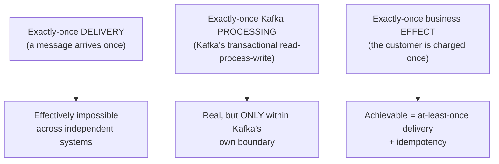

- **Exactly-once delivery** across independent systems is, for practical purposes, unachievable.
- **Exactly-once Kafka processing** (Kafka transactions / `read-process-write`) is real — but it only holds *inside Kafka's own boundary*. The moment you touch an external database or a third-party payment API, that guarantee doesn't extend to them.
- **Exactly-once business effect** is the thing you actually want, and you get it with **at-least-once delivery + idempotency** (idempotency keys, inbox pattern, state machines).

For external DB or API side effects, idempotency and transactional boundaries are still required — Kafka's guarantee cannot cover them.

**Trade-offs / the honest framing.** Chasing true exactly-once delivery is a trap: it's expensive, fragile, and still doesn't cover your external side effects. The pragmatic, correct design is to embrace at-least-once and make effects idempotent. That's simpler, more robust, and actually covers the payment API.

**Strong interview answer.**
> "I design for **at-least-once delivery and make the business effect idempotent.** I'm careful to separate three things: exactly-once delivery, which is effectively impossible across systems; exactly-once Kafka processing, which is real but only within Kafka's boundary; and exactly-once *effect*, which is what I actually want. I get the effect with idempotency keys, the inbox pattern, and state machines — Kafka's guarantee can't extend to my payment provider or my database."

**Remember this.** *There's no free exactly-once. Design for at-least-once delivery + idempotent effect. Separate delivery vs Kafka-processing vs business-effect — they are not the same claim.*

---

# 15. Ordering

**In plain English.** Ordering is the guarantee that events for the same entity are processed in the sequence they happened. `OrderCreated` must be handled before `OrderShipped` — processing them out of order corrupts state. In distributed systems, ordering is only guaranteed *within a partition*, so you have to route related events to the same partition.

**Why you need it.** Consumers often run in parallel across many partitions for throughput. If two events for the same order land in different partitions, they can be processed simultaneously or out of order — and you might try to ship an order you haven't recorded as created yet. You need related events to stay in a single ordered lane.

**A real-world analogy.** A single-file security line versus many parallel lines. Within one line, people are served strictly in the order they queued. Across ten different lines, there's no guarantee — someone who arrived later at line 3 might be served before someone in line 7. To keep a family together and in order, you send them all to the **same** line. That "same line for the same key" is partitioning by key.

**What's actually happening.** Kafka guarantees ordering **within a partition** (not across partitions). To keep all events for one order in order, you make the order ID the **partition key**:

```text
key = orderId
```

All events with the same key hash to the same partition, so:

```text
OrderCreated
OrderPaid
OrderShipped
```

stay in the same partition and are consumed in order.

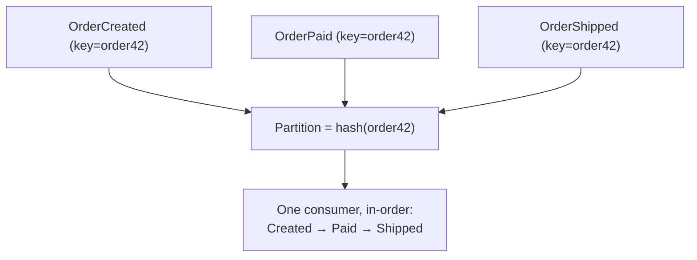

For stronger protection — because even with keying, a redelivery or a rare reorder can happen — include a monotonic marker on each event:

```text
sequenceNumber
version
```

and **reject stale events** (any event whose sequence/version is older than what you've already applied). This is the ordering-equivalent of optimistic locking, and it pairs perfectly with the state machine from Section 5: a backwards transition is simply rejected.

**Trade-offs / when to use which.** Keying by entity ID gives you per-entity ordering while still allowing massive parallelism *across* entities (different orders go to different partitions). The cost: a **hot key** (one super-active order/user) can overload its single partition — the same hot-key problem you see everywhere in distributed systems. For absolute safety you layer on sequence numbers and stale-event rejection.

**Strong interview answer.**
> "Kafka only orders within a partition, so I key events by the entity ID — `orderId` — so all of one order's events land in the same partition and are consumed in sequence. Different orders spread across partitions for parallelism. Because redelivery can still reorder things, I also carry a version or sequence number and reject any event older than what I've already applied, which fits naturally with the entity's state machine."

**Remember this.** *Ordering only holds within a partition. Key by entity ID to keep related events in order; carry a version/sequence number and reject stale events as a belt-and-suspenders.*

---

# 16. Reconciliation

**In plain English.** Reconciliation is a background job that periodically compares your system's state against the **source of truth** and repairs any mismatches it finds. It's the safety net that catches the inconsistencies that slip past all your other mechanisms.

**Why you need it.** Even with idempotency, outbox, inbox, sagas, and ordering, a distributed system can still end up in an **ambiguous** state — usually when a call to an external system times out and you genuinely don't know whether it succeeded. Did the payment gateway process it or not? The response was lost. No amount of clever transaction design prevents this class of uncertainty. Reconciliation is how you resolve it after the fact.

**A real-world analogy.** Accounting reconciliation: at month's end you compare your own books against the bank statement. The bank statement is the source of truth. Wherever your books and the bank disagree, you investigate and correct your books to match. Businesses have done this for centuries precisely because in-the-moment records drift, and periodic truth-checking is the only way to catch it.

**What's actually happening.** A concrete ambiguous state:

```text
Payment gateway = SUCCESS
Local DB = PENDING
```

The gateway actually charged the customer, but your "mark as success" write or event got lost, so your DB still says `PENDING`. A reconciliation job runs on a schedule and fixes it:

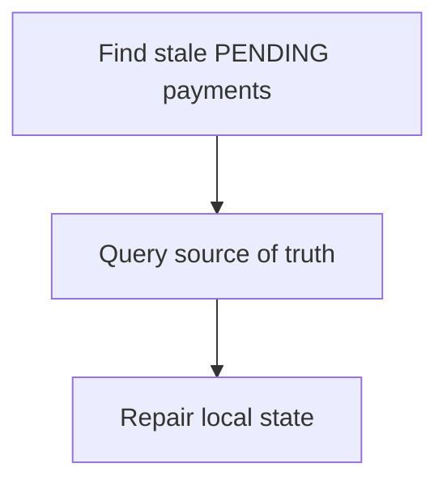

1. **Find suspects** — query your DB for records stuck in a non-terminal state past a reasonable timeout (e.g., payments `PENDING` for more than 15 minutes).
2. **Ask the source of truth** — call the payment gateway's API: "what's the real status of this charge?"
3. **Repair** — update your local state to match reality (mark it `SUCCESS`, or refund/cancel if the truth is that it never went through). Every repair must be idempotent and respect the state machine.

**Trade-offs / when to use which.** Reconciliation is a **must** for financial systems and anywhere an external system can leave you in doubt (payments, shipping providers, third-party APIs). It's your last line of defense — it catches lost events, missed compensations, and timeout ambiguity. The cost is building and running it, plus defining "how stale is stale" (the timeout threshold). It's not a substitute for idempotency and outbox; it's the backstop *behind* them.

**Strong interview answer.**
> "No matter how careful the transaction design, external timeouts leave you in genuinely ambiguous states — you don't know if the gateway charged the customer. So I run a reconciliation job: it finds records stuck in a non-terminal state past a timeout, queries the source of truth for the real status, and repairs local state idempotently. It's the backstop that catches lost events and timeout ambiguity — essential for anything financial."

**Remember this.** *Reconciliation = periodically compare against the source of truth and repair. It's the safety net for the ambiguous states nothing else can prevent — non-negotiable for money.*

---

# Interview Framework

When you're asked *any* consistency or distributed-transaction question, don't jump to a pattern. Walk through these questions out loud — they show the interviewer you reason from invariants, not from buzzwords:

```text
What must be atomic?
What can be eventual?
Where is the source of truth?
What happens on retry?
What happens on duplicate?
What happens if service crashes?
How do we reconcile?
```

Map each question to a tool from this chapter:

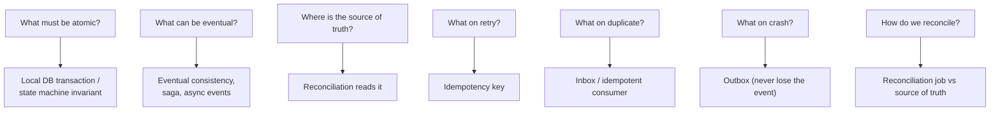

## Strong answer

> "I first identify the business invariants that must be atomic. I keep local state changes inside a database transaction, use an outbox for reliable event publication, and use idempotency for retries and duplicate messages. For cross-service workflows I prefer Saga when eventual consistency and compensation are acceptable. I also define reconciliation for ambiguous states."

## Memorize

> Atomic local transaction + reliable event intent + idempotent processing + compensation + reconciliation.

That single line is the whole chapter: make the **local** change atomic, publish the **intent** reliably (outbox), process **idempotently** (inbox / idempotency keys), **compensate** when a step fails (saga), and **reconcile** whatever still slips through. Everything else — locks, state machines, ordering, exactly-once — is detail hanging off that spine.
