# Tier 4 — Kafka Deep Dive

## Goal

Move beyond basic producer/consumer knowledge into production Kafka design.

Topics:

1. Kafka architecture
2. Topics and partitions
3. Producers
4. Consumer groups
5. Ordering
6. Keys and partitioning
7. Replication and ISR
8. Producer acknowledgements
9. Consumer offsets
10. Rebalancing
11. Consumer lag
12. Retries
13. DLQ
14. Poison messages
15. Partition scaling
16. Topic explosion
17. Kafka transactions
18. Exactly-once semantics
19. Monitoring
20. Capacity planning

---

# 1. Kafka Mental Model

Kafka is a distributed append-only log.

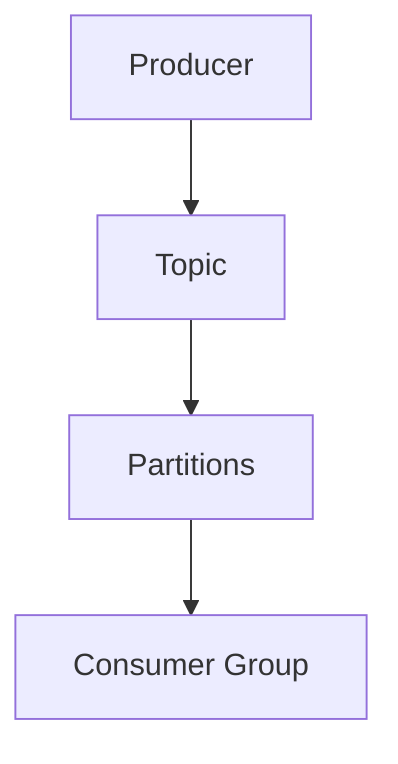

A topic is divided into partitions:

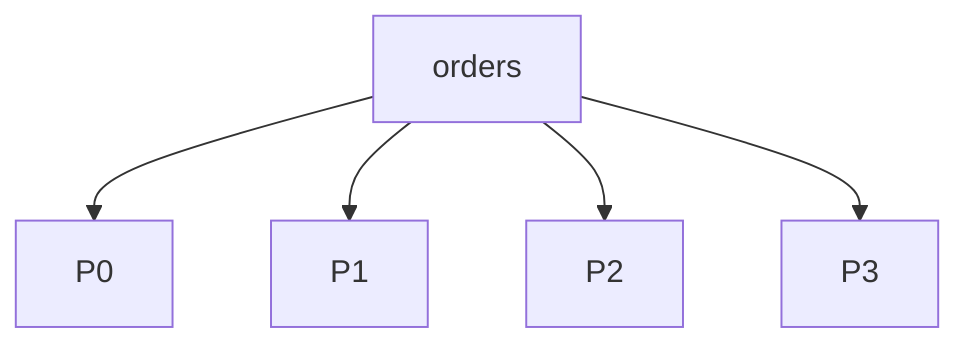

Each partition is ordered.

---

# 2. Partition

Messages are appended:

```text
P0:

offset 100 → A
offset 101 → B
offset 102 → C
```

Consumers track offsets.

An offset is a position in the partition, not a globally unique message ID.

---

# 3. Consumer Groups

A consumer group allows parallel processing.

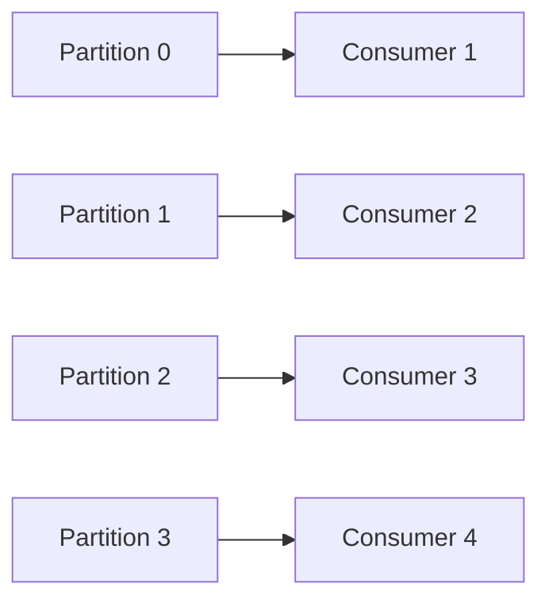

If:

```text
4 partitions
10 consumers
```

only 4 consumers can actively own partitions in that group.

Therefore:

> Consumer parallelism is bounded by partition count.

---

# 4. Choosing Partition Key

If ordering per customer is required:

```text
key = customerId
```

All customer events go to the same partition.

If key distribution is poor:

```text
customer A = 80% traffic
others = 20%
```

one partition becomes hot.

Therefore key choice affects:

- ordering
- distribution
- throughput
- hot partitions

---

# 5. Producer Acknowledgements

Conceptually:

### acks=0

Producer does not wait for broker acknowledgement.

Fast but weaker durability guarantees.

### acks=1

Leader acknowledges after local write.

### acks=all

Required replicas in the ISR acknowledge according to Kafka's replication settings.

For critical data, stronger durability settings are usually preferred.

---

# 6. Replication

Example:

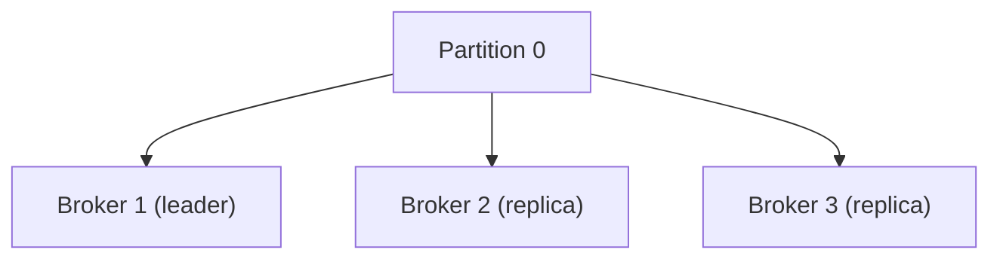

Replication factor = 3.

If Broker 1 fails:

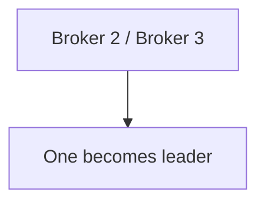

---

# 7. ISR

ISR = in-sync replicas.

Replicas sufficiently caught up with the leader belong to ISR.

Why it matters:

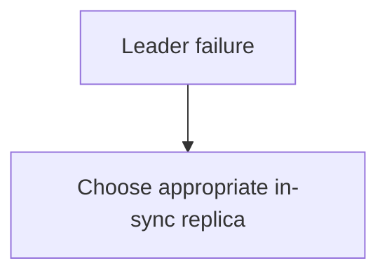

Monitor:

- ISR shrink
- under-replicated partitions
- offline partitions

---

# 8. Consumer Offset

Consumer processes:

```text
offset 100
```

Then commits offset.

If crash occurs before committing:

```text
offset 100
```

can be delivered again.

This explains why duplicate processing must be expected.

---

# 9. Consumer Lag

Lag measures how far a consumer is behind the latest available data.

If:

```text
producer = 20K/sec
consumer = 10K/sec
```

lag grows.

Debug:

```text
Producer rate ↑?
Consumer rate ↓?
CPU?
DB?
External API?
GC?
Rebalance?
Poison message?
```

Don't blindly add consumers.

---

# 10. Rebalancing

If a consumer joins/leaves:

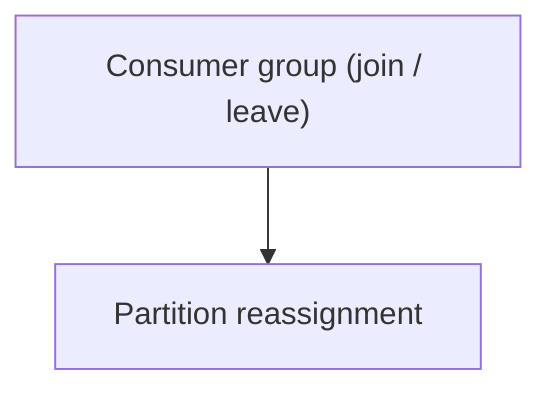

During rebalancing, processing can pause.

Frequent rebalances can cause lag.

Investigate:

- consumer crashes
- long processing
- heartbeat/session settings
- unstable membership

---

# 11. Poison Message

A message repeatedly fails:

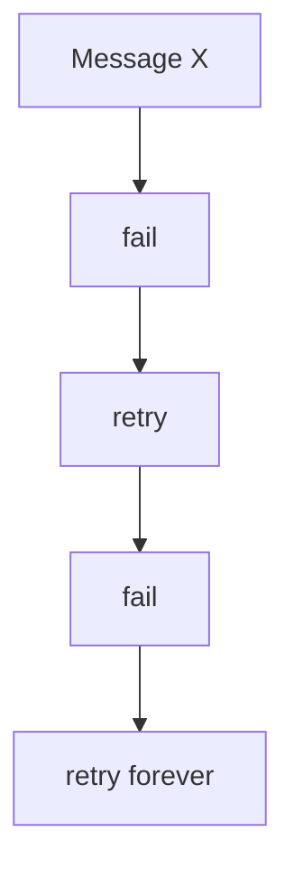

It can block progress.

Use:

```text
retry policy
+
bounded attempts
+
DLQ
```

---

# 12. Retry Topics

A retry architecture can use:

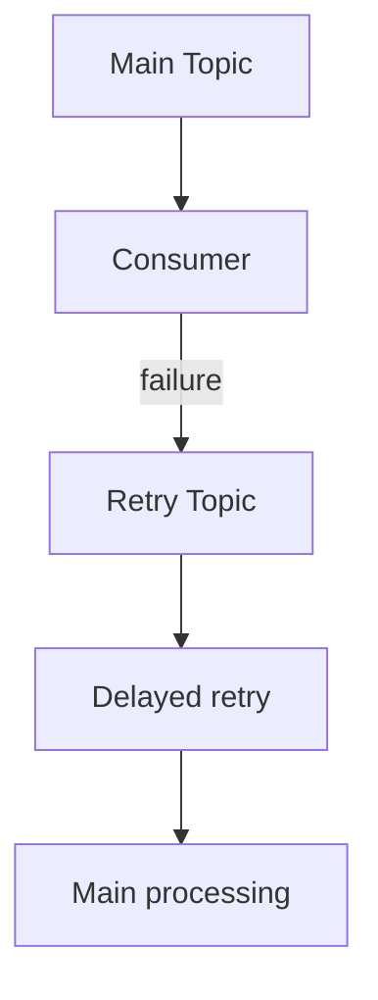

Different retry delays can be used.

Important:

- don't create infinite retries
- track retry count
- preserve event ID
- ensure idempotency

---

# 13. DLQ

Dead Letter Queue stores messages that cannot be successfully processed after policy-defined retries.

DLQ message should preserve:

- original event
- event ID
- error
- retry count
- timestamp
- original topic/partition/offset
- consumer/application metadata

DLQ is not a garbage dump. It needs monitoring and replay tooling.

---

# 14. Topic Explosion

100 topics becoming 1,000 topics is not automatically bad.

Ask:

- partitions/topic?
- message rate?
- retention?
- broker metadata?
- consumer subscriptions?
- topic creation rate?

1,000 topics × 10 partitions = 10,000 partitions.

Partition count is often the more important operational dimension.

Challenge topic-per-customer if scale becomes extreme.

---

# 15. Partition Count Is Hard to Reduce

Increasing partitions can increase parallelism.

But partition changes can affect key distribution and ordering assumptions.

Do not casually increase partitions in a system that depends on particular partitioning behavior.

Plan partition capacity ahead of major growth.

---

# 16. Ordering

Kafka provides ordering within a partition.

It does not provide global ordering across all partitions.

If:

```text
OrderCreated
OrderPaid
OrderShipped
```

must remain ordered for one order:

```text
key = orderId
```

---

# 17. Duplicate Messages

Duplicate scenario:

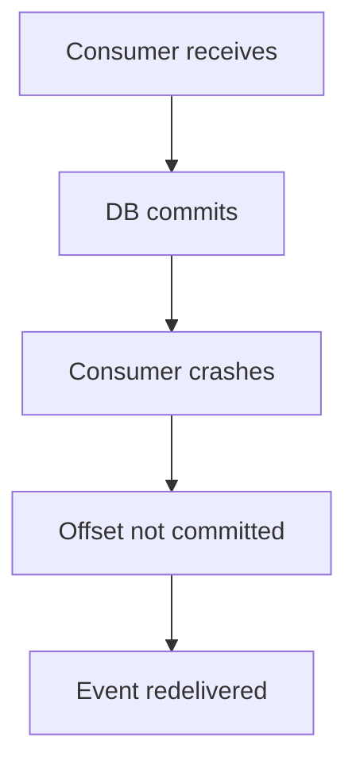

Use:

```text
eventId UNIQUE
```

and an atomic business transaction.

---

# 18. Kafka Transactions

Useful for Kafka-to-Kafka workflows:

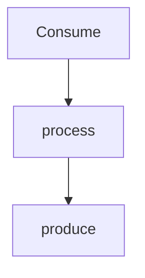

They can provide transactional semantics within Kafka.

But:

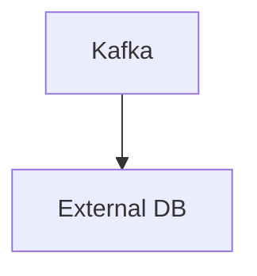

still needs an external consistency mechanism.

Don't assume Kafka transactions make arbitrary distributed systems exactly once.

---

# 19. Producer Idempotence

Producer retries can cause duplicate records if not handled appropriately.

Idempotent producer settings can reduce duplicate records caused by producer retries.

But consumer-side business idempotency is still valuable.

---

# 20. Capacity Planning

Track:

- bytes/sec
- messages/sec
- partition count
- broker CPU
- disk I/O
- disk capacity
- network
- replication traffic
- consumer lag

Example:

```text
Incoming = 500 MB/sec
Replication factor = 3

Network/disk impact is significantly larger than 500 MB/sec of logical application data.
```

Always account for replication and overhead.

---

# 21. Kafka Failure Runbook

### Broker failure

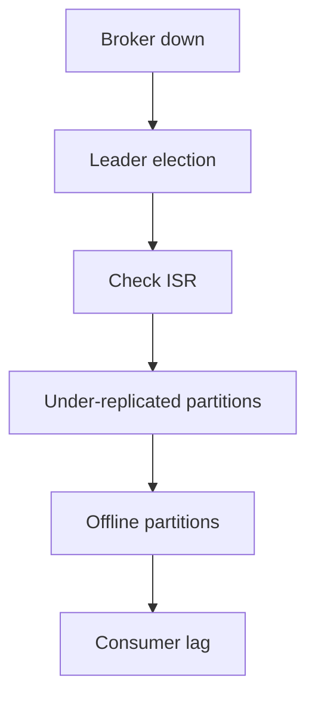

### Consumer lag

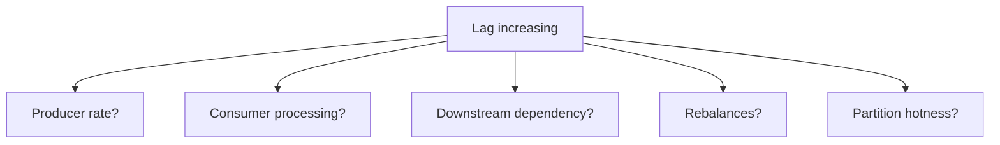

### Producer errors

Check:

- broker health
- request latency
- acks
- retries
- timeouts
- metadata
- network

---

# Strong Interview Answer

> "I model Kafka around partitions rather than topics. Partitions determine ordering and consumer parallelism. I'd choose keys based on both ordering and distribution, because a poor key can create hot partitions. For reliability I'd use appropriate replication, ISR monitoring and producer acknowledgements. Consumers should commit offsets only after successful processing and should be idempotent because redelivery can occur. For failures I'd use bounded retries and DLQ. For lag I'd identify whether producer throughput increased or consumer throughput decreased before scaling the group."

## Memorize

> Topics organize data. Partitions provide ordering and parallelism. Consumer groups provide horizontal processing. Replication provides broker fault tolerance.
