# Tier 4 — Kafka Deep Dive

## Goal

Move beyond basic producer/consumer knowledge into production Kafka design.

This chapter assumes you have *barely* touched Kafka. We build the mental model from the ground up, one idea at a time, and every idea is taught with: what it is, the failure it prevents, a real-world analogy, the mechanism, the trade-offs, a strong interview answer, and a one-line takeaway.

Two truths run through the whole chapter. Say them out loud now, because everything else hangs off them:

> **1. Ordering and parallelism are both bounded by PARTITIONS.** Not topics. Not brokers. Not consumers. Partitions.
>
> **2. Kafka redelivers messages. So your consumers MUST be idempotent** — processing the same message twice must be safe.

If you remember only those two sentences, you already think about Kafka better than most.

Topics we cover:

1. Kafka mental model
2. Topics and partitions
3. Consumer groups
4. Choosing a partition key
5. Producer acknowledgements
6. Replication
7. ISR (in-sync replicas)
8. Consumer offsets
9. Consumer lag
10. Rebalancing
11. Poison messages
12. Retry topics
13. DLQ
14. Topic explosion
15. Partition count is hard to reduce
16. Ordering
17. Duplicate messages
18. Kafka transactions
19. Producer idempotence
20. Capacity planning
21. Failure runbook

---

# 1. Kafka Mental Model

### In plain English

Kafka is a **distributed, append-only log**. That is the whole thing. Imagine a notebook where you can only ever add a new line at the bottom — you can never insert in the middle, never edit a line, never delete one. You write to the end; readers read from wherever they left off. That notebook is a Kafka log.

"Distributed" just means the notebook is spread across several machines (called **brokers**) so it survives a machine dying and can hold more than one machine could.

### Why it matters / the failure it prevents

Before log-based systems, teams glued services together with direct API calls: order service calls email service calls analytics service calls warehouse service. One slow or dead service and the whole chain stalls or loses data. Kafka breaks that chain. The producer just appends to the log and moves on. Consumers read at their own pace, whenever they want, even hours later. Nobody blocks anybody. If the email service is down for an hour, the messages sit safely in the log and get processed when it recovers.

### A real-world analogy

Think of a **bank passbook**. The bank appends transactions in order; you never rewrite history. If you lose your place, you flip back to the last line you read and continue. Multiple people (you, the auditor, the tax office) can each read the same passbook independently, each keeping their own bookmark. The passbook is the log; the bookmark is the **offset** (we'll get there).

### What's actually happening

Producers write; the log persists on disk across brokers; consumers read.

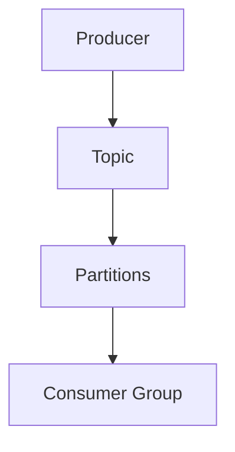

A **topic** is a named log — like a channel or a table name (`orders`, `payments`, `clicks`). But a topic is not one single log. It's split into **partitions**, each of which is its own independent ordered log:

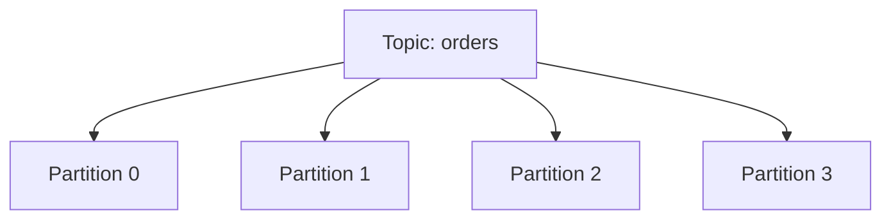

Each partition is **ordered**. Across partitions there is **no global order**. That single fact is the source of half of all Kafka design decisions, so hold onto it.

### Trade-offs / gotchas

- Splitting a topic into many partitions buys you parallelism (more on this soon) but throws away global ordering — you only get ordering *within* a partition.
- The log lives on disk and is kept for a **retention period** (e.g. 7 days), not forever by default. Kafka is a durable buffer, not necessarily your permanent database.

### Remember this

> A topic is a log split into ordered partitions. Kafka is an append-only notebook you read at your own pace.

---

# 2. Partitions

### In plain English

A **partition** is a single ordered sequence of messages. Each message lands at a position called an **offset** — 0, 1, 2, 3, and up, forever increasing within that partition.

```text
P0:

offset 100 → A
offset 101 → B
offset 102 → C
```

An offset is a **position within one partition**. It is *not* a globally unique message ID. Offset 100 exists in partition 0 *and* in partition 1 — they are different messages.

### Why it matters / the failure it prevents

Partitions are how Kafka scales and how it stays ordered at the same time. One partition can only be written and read as fast as one set of resources allows. Two partitions can be worked on by two consumers *at once*. So partitions are the unit of parallelism. And because each partition is internally ordered, they're also the unit of ordering. This dual role — parallelism knob *and* ordering guarantee wrapped in the same thing — is exactly why partition count is such a loaded decision.

### A real-world analogy

Partitions are **checkout lanes at a supermarket**. One lane keeps its own line in strict order — first customer served first. Open more lanes and you serve more people at once (parallelism), but there's no longer a single global order across the whole store; customer 5 in lane 2 might finish before customer 2 in lane 1. If you *need* a specific family to be served in strict order, you must send them all to the *same* lane.

### What's actually happening

- The producer picks a partition for each message (by key, or round-robin — see §4).
- The broker appends the message to the end of that partition's log and assigns it the next offset.
- A consumer reads sequentially from an offset and advances.

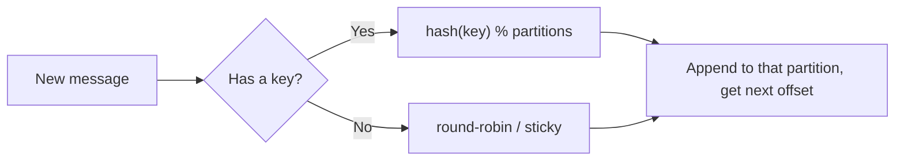

### Trade-offs / gotchas

- More partitions → more parallelism, but weaker ordering guarantees (order only holds inside each partition) and more overhead (files, memory, leader elections).
- Offsets are per-partition. Never treat an offset as a unique key for a message across the topic.

### Remember this

> Partition = one ordered lane. Offset = your position in that lane. Parallelism and ordering both live here.

---

# 3. Consumer Groups

### In plain English

A **consumer group** is a team of consumers that splits the work of reading a topic. Kafka hands each partition to exactly **one** consumer in the group. That's how you process a topic in parallel without two consumers stepping on the same messages.

### Why it matters / the failure it prevents

Without groups, if you ran two copies of your service to go faster, both would read *everything* and you'd process every message twice. Consumer groups solve that: Kafka guarantees each partition goes to only one member of the group, so the work is divided, not duplicated. Different groups, though, each get the *full* stream — that's how the email service and the analytics service both consume `orders` independently.

### A real-world analogy

Back to the supermarket. A **consumer group is a shift of cashiers**. Each open lane (partition) is staffed by exactly one cashier (consumer). If you have 4 lanes and 4 cashiers, everyone's busy. Hire a 5th cashier for 4 lanes and they just stand around — there's no lane to give them. That idle cashier is the heart of the next point.

### What's actually happening

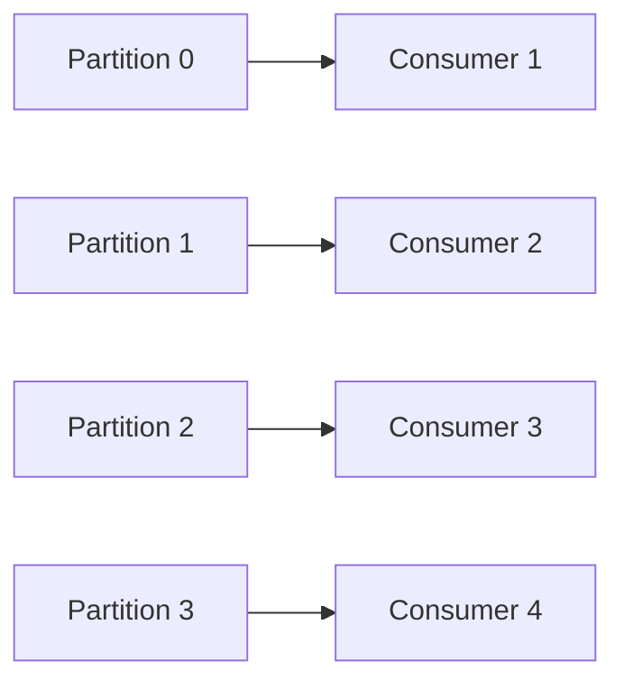

Now suppose:

```text
4 partitions
10 consumers in the group
```

Only **4** consumers can actively own partitions. The other 6 sit idle as hot standbys.

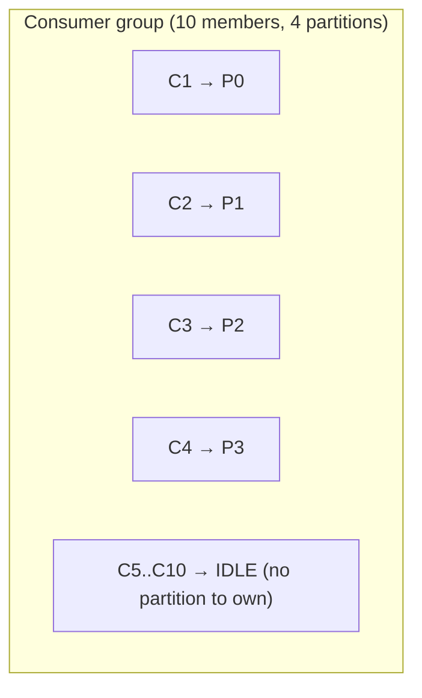

Therefore, the rule you must internalise:

> **Consumer parallelism is bounded by partition count.** You cannot go faster than one consumer per partition, no matter how many consumers you add.

This is truth #1 from the intro, showing up for the first time. It'll keep showing up.

### Trade-offs / gotchas

- If your consumers can't keep up and you're already at one-consumer-per-partition, adding consumers does **nothing**. You need *more partitions* — a decision you should have made earlier (see §15).
- Idle standbys aren't wasted: if an active consumer dies, a standby takes over its partitions during a rebalance (§10).

### Remember this

> A consumer group divides partitions among members. Max useful consumers = number of partitions.

---

# 4. Choosing a Partition Key

### In plain English

When a producer sends a message, it can attach a **key**. Kafka hashes the key and always sends the same key to the same partition. No key means round-robin spreading. The key is how you say "these messages belong together and must stay in order."

### Why it matters / the failure it prevents

Say a customer's events must be processed in order: created, then updated, then cancelled. If those land in different partitions, they can be processed out of order — you might cancel before you create. Setting `key = customerId` forces all of that customer's events into one partition, which is ordered. The key choice is literally how you buy ordering for the things that need it.

But the same choice controls *load distribution*, and that's where people get burned.

### A real-world analogy

The key is the **rule the greeter uses to assign families to checkout lanes**. "Everyone whose surname starts with A–F, lane 1." That keeps each family together and in order. But if 80% of shoppers are named "Smith," lane with S is a mob while the others are empty. A bad key = a **hot partition**.

### What's actually happening

```text
key = customerId   →   hash(customerId) % numPartitions   →   fixed partition
```

All of one customer's events go to the same partition, preserving per-customer order.

Now the danger — skewed keys:

```text
customer A = 80% of traffic
all others = 20%
```

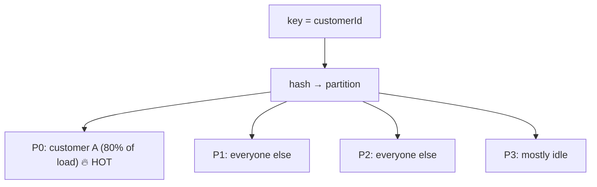

One partition becomes a bottleneck. And remember: one partition = at most one consumer. So a hot partition caps your throughput no matter how many consumers or partitions you have elsewhere.

### Trade-offs / gotchas

The key choice simultaneously drives four things — you can't tune one without affecting the others:

| Concern | Effect of the key |
|---|---|
| **Ordering** | Same key → same partition → ordered together |
| **Distribution** | Skewed key → uneven partition load |
| **Throughput** | A hot partition caps at one consumer's speed |
| **Hot partitions** | Caused by low-cardinality or skewed keys |

- Need order *and* even spread? Pick a higher-cardinality key (e.g. `userId` instead of `country`), or a composite key.
- Don't need ordering at all? Use no key and let round-robin spread the load evenly.

### Remember this

> The partition key buys ordering — but a skewed key buys you a hot partition. Choose for ordering *and* distribution.

---

# 5. Producer Acknowledgements (`acks`)

### In plain English

When a producer sends a message, `acks` controls **how many brokers must confirm the write before the producer considers it "done."** It's a dial between "fast but risky" and "slow but safe."

### Why it matters / the failure it prevents

Imagine the producer fires a message and moves on, but the broker that received it crashes a millisecond later before saving a copy anywhere. The message is gone and nobody knows. `acks` is how you decide how much of that risk you'll accept. For a "user clicked a button" metric, losing one is fine. For "user paid $500," it is not.

### A real-world analogy

`acks` is **how you send a package**:

- `acks=0` — drop it in the mailbox and walk away. Fast, but you have zero proof it went anywhere.
- `acks=1` — hand it to the post office clerk and get a receipt. The clerk has it — but if the post office burns down before they file it in the back, it's lost.
- `acks=all` — hand it over and wait until the clerk confirms copies are filed in multiple offices. Slowest, safest.

### What's actually happening

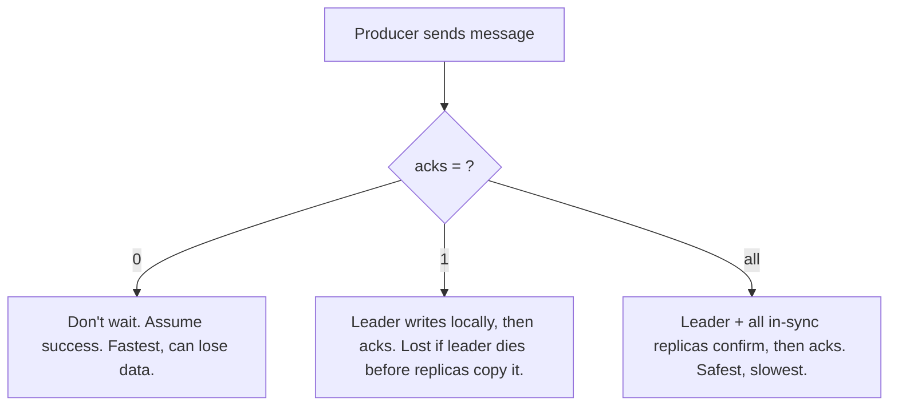

**acks=0** — Producer does not wait for any broker acknowledgement. Fastest; weakest durability.

**acks=1** — The leader broker acknowledges after its own local write. If the leader dies before replicas copy the data, that data can be lost.

**acks=all** — The required in-sync replicas (ISR — see §7) all confirm before the producer gets its ack. Strongest durability.

For critical data, `acks=all` is the usual choice, typically paired with replication factor 3 and `min.insync.replicas=2` so at least two brokers hold every acknowledged message.

### Trade-offs / gotchas

| `acks` | Durability | Latency | Use when |
|---|---|---|---|
| 0 | Weakest (can drop) | Lowest | High-volume metrics, logs where loss is OK |
| 1 | Medium | Medium | Reasonable default for less-critical data |
| all | Strongest | Highest | Payments, orders, anything you can't lose |

- `acks=all` alone isn't enough. With replication factor 1, "all in-sync replicas" is just the leader — you're back to `acks=1`'s risk. Durability = `acks` **and** replication factor **and** `min.insync.replicas` together.

### Remember this

> `acks` trades durability against latency. `acks=all` + RF 3 + minISR 2 = don't lose acknowledged data.

---

# 6. Replication

### In plain English

**Replication** means each partition is copied onto multiple brokers. One copy is the **leader** (handles all reads and writes); the others are **followers** (replicas) that copy the leader. If the leader's broker dies, a follower is promoted to leader and the partition keeps serving.

### Why it matters / the failure it prevents

Brokers are just machines; machines die. Without replication, a dead broker means every partition it led is unavailable and possibly lost. Replication is what lets Kafka survive a broker failure with no data loss and minimal downtime — it's the whole reason Kafka is "durable."

### A real-world analogy

Replication is **keeping the same document on three laptops that sync continuously**. You edit on the "main" laptop (leader); the other two mirror it (followers). Drop the main laptop in a lake, grab another, keep working — barely a hiccup.

### What's actually happening

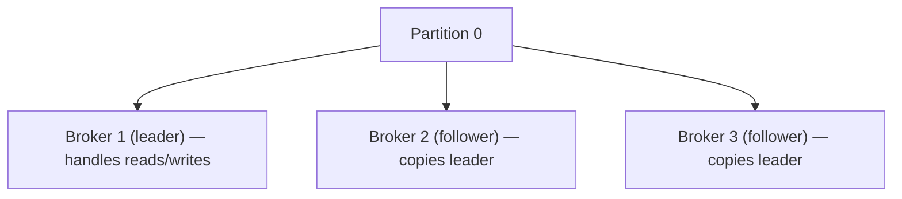

Replication factor = 3 means three copies of every partition on three different brokers.

If Broker 1 (the leader) fails:

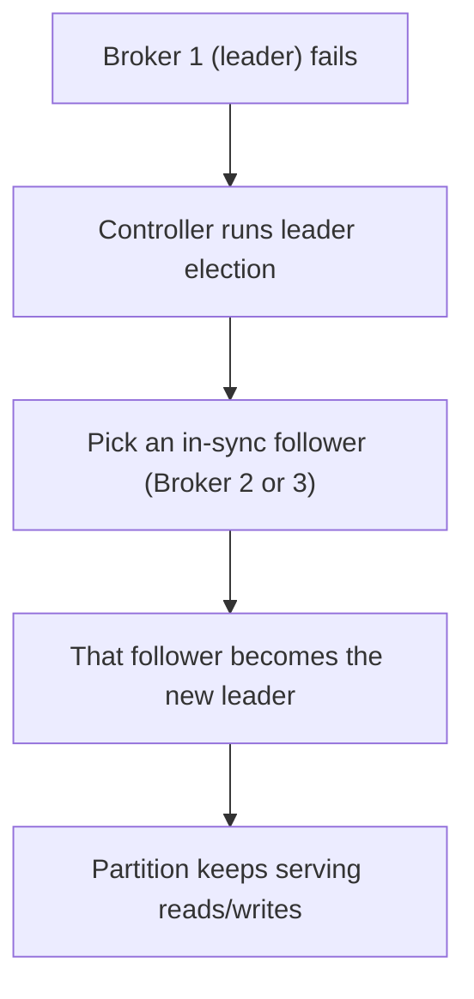

### Trade-offs / gotchas

- Higher replication factor = more durability but more network and disk traffic (every message is written N times) and more storage cost.
- Replication factor 3 is the standard for production. RF 1 = no fault tolerance; RF 2 tolerates one failure but leaves no safety margin during maintenance.
- Only **in-sync** followers are safe to promote. Promoting a lagging follower loses data — which is exactly what ISR is about.

### Remember this

> Replication = N copies of each partition. Leader serves; followers mirror; a follower takes over when the leader dies.

---

# 7. ISR — In-Sync Replicas

### In plain English

**ISR** is the set of replicas that are **sufficiently caught up** with the leader. A follower that has copied everything (or nearly everything) the leader has is "in sync." One that has fallen behind drops out of the ISR until it catches up.

### Why it matters / the failure it prevents

When the leader dies, Kafka must pick a new leader. If it picked a follower that was 10,000 messages behind, those 10,000 messages would vanish. The ISR is the "safe to promote" list — only in-sync replicas can become leader (with the default safe settings), so promotion doesn't lose acknowledged data. ISR is also what `acks=all` and `min.insync.replicas` actually count.

### A real-world analogy

ISR is the **list of understudies who actually know the current version of the play**. If the lead actor faints, you only send on an understudy who's rehearsed the latest script. An understudy who's three drafts behind stays off-stage until they catch up — otherwise the audience sees the wrong scene.

### What's actually happening

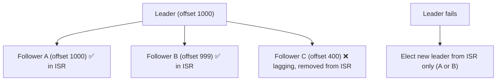

When the leader fails, a new leader is chosen from the ISR, so no acknowledged data is lost.

Health signals to monitor:

- **ISR shrink** — replicas falling out of sync (broker overloaded, network trouble, disk slow).
- **Under-replicated partitions** — fewer in-sync copies than the replication factor. A warning sign.
- **Offline partitions** — no available leader at all. This means unavailability *right now*.

### Trade-offs / gotchas

- `min.insync.replicas=2` with `acks=all` means a write is only accepted if at least 2 replicas are in sync. If too many brokers are down and the ISR shrinks below that, producers get errors — Kafka refuses the write rather than risk losing it. That's *availability traded for durability*, on purpose.
- **Unclean leader election** (a config): if enabled, Kafka may promote an out-of-sync replica to stay available — at the cost of losing data. Off by default. Know it exists; leave it off for critical data.

### Remember this

> ISR = replicas safe to promote. Watch ISR shrink, under-replicated, and offline partitions — they warn of coming pain.

---

# 8. Consumer Offsets

### In plain English

An **offset** is a consumer's bookmark — the position it has read up to in a partition. A consumer **commits** its offset to tell Kafka "I've successfully handled everything up to here." On restart, it resumes from the last committed offset.

### Why it matters / the failure it prevents

Consumers crash. When one comes back (or a standby takes over), how does it know where to resume? The committed offset. Get the *timing* of the commit wrong and you either lose messages (commit too early, then crash before actually processing) or reprocess them (commit after processing, crash in between). The safe choice — **commit only after successful processing** — means you never lose a message, but you might process some twice.

### A real-world analogy

The offset is a **bookmark in a book you're reading aloud to someone**. The rule: only move the bookmark *after* you've finished reading a page aloud and they confirm they heard it. If you move the bookmark first and then get interrupted mid-page, you'd skip that page next time (lost message). By moving it last, the worst case is you re-read a page you already read (duplicate) — annoying, but nothing is lost.

### What's actually happening

Safe order — process first, commit second:

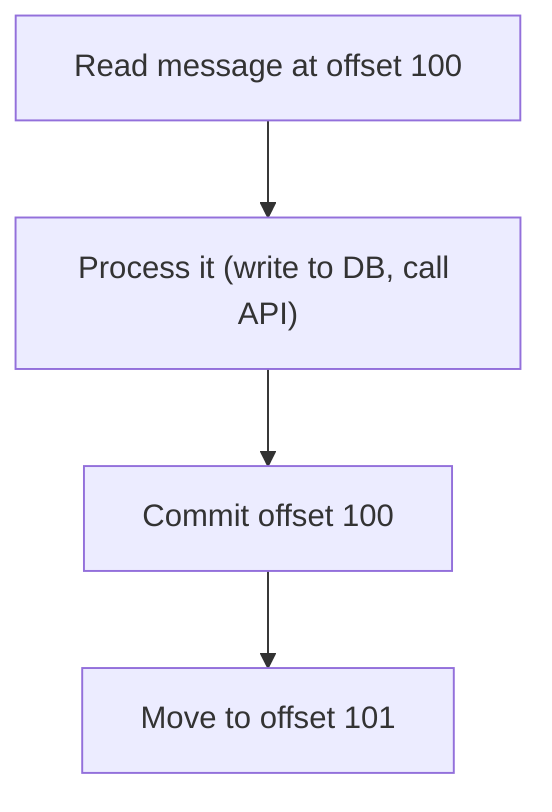

Now the crash case:

```text
Consumer reads offset 100
Consumer processes offset 100 (DB updated)
Consumer CRASHES before committing offset 100
→ On restart, last committed offset is 99
→ Offset 100 is delivered AGAIN
```

So offset 100 gets processed twice. This is not a bug — it's the fundamental **at-least-once** behaviour of Kafka.

> This is truth #2 from the intro: **redelivery happens, so consumers must be idempotent.** Processing offset 100 twice must produce the same end state as processing it once (see §17).

### Trade-offs / gotchas

- **Commit after processing** (at-least-once): never lose data, but expect duplicates. This is the right default.
- **Commit before processing** (at-most-once): no duplicates, but a crash loses the message. Rarely what you want.
- **Auto-commit** commits on a timer, which can commit offsets for messages you haven't finished processing — quietly causing message loss on a crash. Prefer manual commit after processing for anything important.

### Remember this

> The offset is your bookmark. Commit *after* processing → at-least-once → plan for duplicates.

---

# 9. Consumer Lag

### In plain English

**Consumer lag** is how far behind a consumer is: `latest offset produced − last offset the consumer committed`. Lag of 0 means fully caught up. Growing lag means the consumer is falling behind the producer.

### Why it matters / the failure it prevents

Lag is *the* health metric for a consumer. Rising lag means data is getting staler — your "real-time" dashboard is now ten minutes late, or orders are being fulfilled slowly. Catching lag early lets you fix the cause before it becomes an outage. Ignoring it means one day you discover you're an hour behind and can't catch up.

### A real-world analogy

Lag is the **stack of dishes piling up by the sink** while one person washes. If plates arrive faster than they're washed, the stack grows without limit. The size of the stack tells you you're losing — but it doesn't tell you *why* (slow washer? broken tap? too many dinner guests?).

### What's actually happening

```text
producer rate = 20,000 messages/sec
consumer rate = 10,000 messages/sec
→ lag grows by 10,000/sec, forever
```

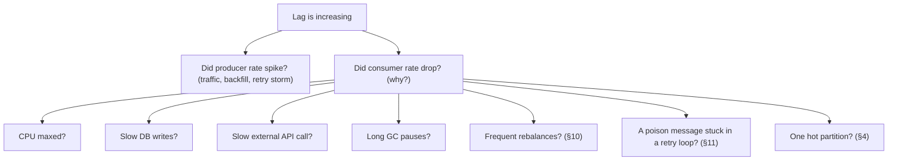

The discipline: **find out whether the producer sped up or the consumer slowed down** before you react. They demand opposite fixes.

### Trade-offs / gotchas

- **Don't blindly add consumers.** If you're already at one-consumer-per-partition, adding more does nothing (§3). If the bottleneck is a slow DB, more consumers just hammer the DB harder. Diagnose first.
- A single **hot partition** can show as lag on just one partition while others are fine — a strong hint the *key* is skewed, not that you need more consumers.

### Remember this

> Lag = how far behind you are. Before scaling, ask: did the producer speed up, or did the consumer slow down?

---

# 10. Rebalancing

### In plain English

A **rebalance** is when Kafka re-divides the partitions among the members of a consumer group — because a consumer joined, left, or crashed. During a rebalance, consuming typically **pauses** while partitions are reassigned.

### Why it matters / the failure it prevents

Rebalancing is *good*: it's how the group heals when a consumer dies (a survivor takes over the dead one's partitions) and how it grows when you add capacity. But **frequent** rebalances are toxic — each one pauses processing, so a group that rebalances every few seconds spends its life stopping and restarting instead of working. That shows up as lag (§9) with no obvious cause.

### A real-world analogy

A rebalance is **cashiers re-dividing the open lanes when someone clocks in or out**. Necessary and healthy. But if a flaky cashier keeps clocking in and out every 30 seconds, the whole team keeps stopping to re-assign lanes and nobody actually checks anyone out. That flapping is the failure mode.

### What's actually happening

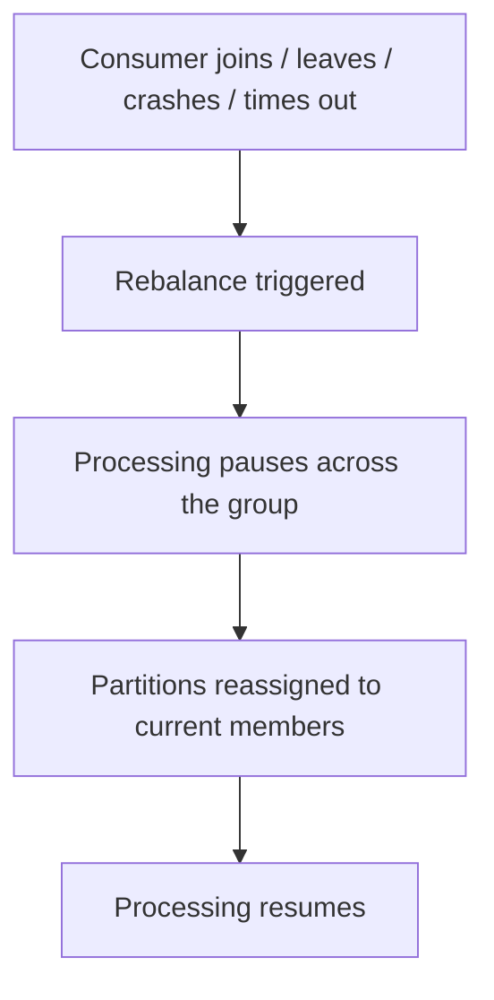

Common causes of *excessive* rebalancing:

- **Consumer crashes** (real failures — fix the root cause).
- **Processing takes too long** between polls, so the broker thinks the consumer is dead and evicts it (tune `max.poll.interval.ms`, or do less work per poll).
- **Heartbeat / session timeouts** too aggressive for your workload (`session.timeout.ms`, `heartbeat.interval.ms`).
- **Unstable membership** — consumers flapping up and down (deploys, autoscaling, OOM kills).

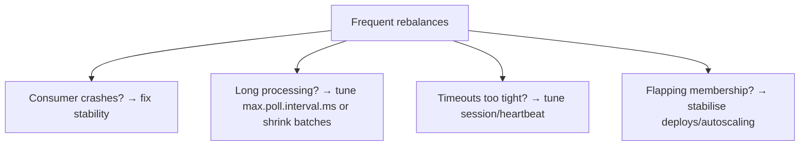

### Trade-offs / gotchas

- **Stop-the-world vs cooperative rebalancing:** classic rebalancing pauses *everyone*; **cooperative (incremental) rebalancing** only moves the partitions that need to move, so most consumers keep working. Prefer cooperative for large groups.
- A slow consumer that misses `max.poll.interval.ms` triggers a rebalance, which slows the *whole group*, which can cascade. One slow member can poison the group.

### Remember this

> Rebalancing heals the group but pauses it. Frequent rebalances = hidden lag. Chase stability and long-processing.

---

# 11. Poison Messages

### In plain English

A **poison message** is a single message that fails to process every time — a malformed payload, a null field, a value your code can't handle. Because the consumer commits offsets only after success (§8), it never gets past this message: it fails, retries, fails, retries... forever.

### Why it matters / the failure it prevents

One bad message can **halt an entire partition**. The consumer keeps retrying it and never advances the offset, so every message behind it in that partition is stuck too. A single corrupt record can freeze a whole stream of good data. The fix is to *stop retrying after a bounded number of attempts* and set the bad message aside.

### A real-world analogy

A poison message is **one jammed sheet in a printer**. The printer keeps trying to feed that sheet, jams, retries, jams — and the hundred perfectly good pages behind it never print. You don't fix it by retrying harder; you pull the jammed sheet out (set it aside), and let the rest flow.

### What's actually happening

The failure loop, unbounded:

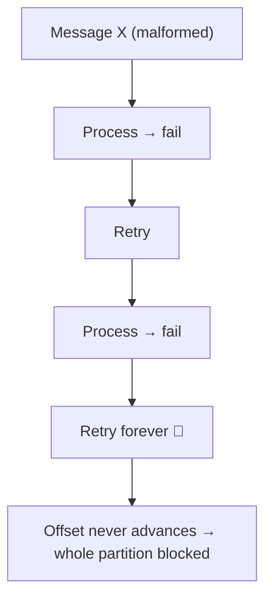

The fix — bound the attempts, then divert:

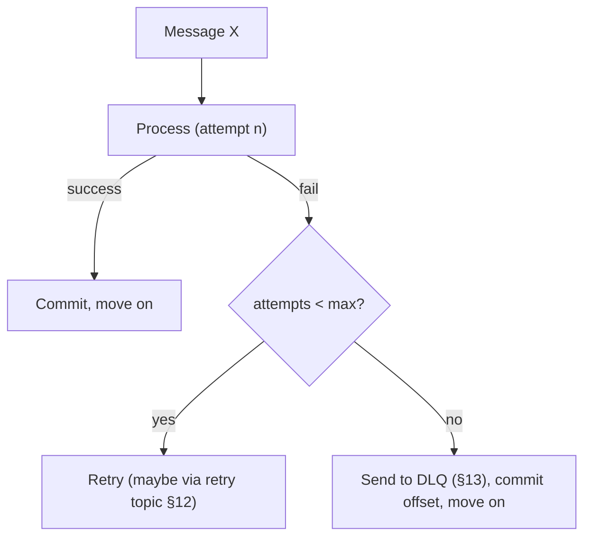

```text
retry policy
+ bounded attempts (e.g. max 3–5)
+ DLQ for messages that exhaust retries
```

### Trade-offs / gotchas

- Retrying *in place* (blocking the partition while you wait) protects order but stalls everything behind it. Retrying *via a separate topic* (§12) unblocks the partition but can reorder messages.
- Set the max-attempts sensibly: too low and transient blips (a brief network glitch) get dumped to DLQ; too high and a truly poison message wastes minutes before diversion.

### Remember this

> A poison message freezes a partition. Bound retries, then divert to DLQ — don't retry forever.

---

# 12. Retry Topics

### In plain English

A **retry topic** is a separate topic where failed messages go to be tried again *later*, so the main topic's partition isn't blocked while you wait. You can have several with increasing delays (retry-5s, retry-1m, retry-10m) for exponential backoff.

### Why it matters / the failure it prevents

Many failures are *transient* — a downstream service is briefly down, a database is momentarily overloaded. You want to retry, but you don't want to freeze the whole partition (§11) waiting. Retry topics move the failed message off the main flow, let the good messages keep flowing, and bring the failed one back after a delay when the transient problem may have cleared.

### A real-world analogy

A retry topic is the **"come back later" line at a passport office**. If your paperwork isn't ready, you don't hold up everyone behind you — you're sent to a separate waiting area and called back in 15 minutes. The main queue keeps moving; you get another shot without blocking anyone.

### What's actually happening

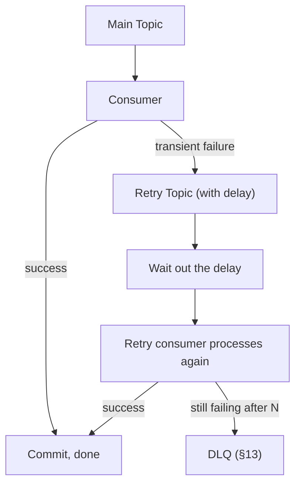

Tiered delays for backoff:

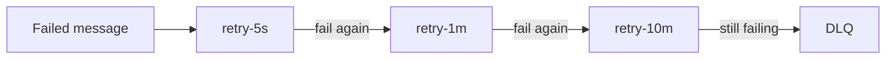

Rules that keep this safe:

- **Don't create infinite retries** — always cap and end at a DLQ.
- **Track the retry count** (in a header) so you know when to give up.
- **Preserve the event ID** so you can detect duplicates downstream.
- **Ensure idempotency** — a retried message may have partially succeeded the first time.

### Trade-offs / gotchas

- Retry topics **break strict ordering**: a message diverted and reprocessed later arrives *after* messages that came behind it originally. If order is sacred for a key, in-place retry may be required instead — accept the blocking.
- More retry tiers = more topics and partitions to operate (feeds the topic-explosion problem, §14). Keep the tiers few and purposeful.

### Remember this

> Retry topics unblock the main partition at the cost of ordering. Cap the retries; the last stop is always the DLQ.

---

# 13. DLQ — Dead Letter Queue

### In plain English

A **Dead Letter Queue** is a topic where messages go when they've **failed all their retries**. It's a holding area for "we couldn't process this — a human or a repair job needs to look."

### Why it matters / the failure it prevents

Without a DLQ, a permanently-failing message either blocks the partition forever (§11) or gets silently dropped (data loss you don't even know about). The DLQ gives poison messages a safe place to land so the main flow stays healthy *and* nothing is lost — you can inspect, fix, and replay them later.

### A real-world analogy

A DLQ is the **"undeliverable mail" bin at the post office**. Letters with a bad address don't get thrown away and don't jam the sorting machine — they go in a specific bin where a clerk investigates, fixes the address, and re-sends. A bin nobody ever checks is just a landfill; the value is in *working* it.

### What's actually happening

A DLQ message should preserve enough context to diagnose and replay:

```text
- original event payload
- event ID
- error message / stack trace
- retry count
- timestamp of failure
- original topic / partition / offset
- consumer / application metadata (which service, which version)
```

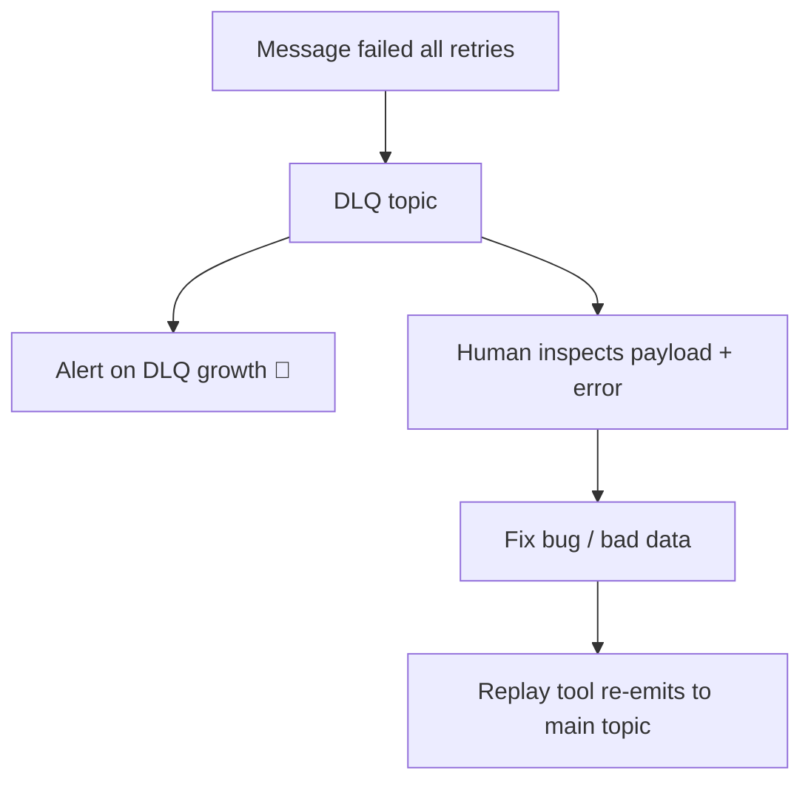

### Trade-offs / gotchas

- **A DLQ is not a garbage dump.** It needs *monitoring* (alert when it grows — that's your early warning of a bug or bad upstream data) and *replay tooling* (a way to fix and re-emit). A DLQ nobody watches is silent data loss with extra steps.
- Replaying blindly can re-trigger the same failure. Fix the root cause *first*, then replay — and rely on idempotency so replays are safe.

### Remember this

> DLQ = safe holding for messages that exhausted retries. Preserve full context, monitor growth, build replay — never a silent dump.

---

# 14. Topic Explosion

### In plain English

**Topic explosion** is when the number of topics grows very large (say a topic per customer, so 100 topics becomes 100,000). It sounds alarming, but the real cost isn't the topic count itself — it's the **total partition count** underneath.

### Why it matters / the failure it prevents

Each partition costs real resources: open files, memory, replication traffic, and metadata the cluster's controller must track. A cluster can drown in partitions long before it drowns in topics. Understanding that the *partition* is the real unit of cost stops you from building a topic-per-customer design that quietly scales itself into a cluster meltdown.

### A real-world analogy

Topics are **file folders**; partitions are the **individual sheets of paper** inside them. Adding 900 empty-ish folders to a filing cabinet is fine. The cabinet strains when the *total number of sheets* — across all folders — gets huge, because the index that tracks every sheet gets unwieldy.

### What's actually happening

Don't panic at topic count; do the multiplication:

```text
1,000 topics × 10 partitions each = 10,000 partitions
100,000 topics × 5 partitions each = 500,000 partitions ⚠️
```

Questions to ask before assuming it's a problem — or before creating the design:

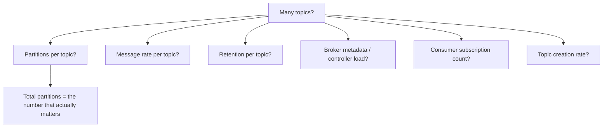

### Trade-offs / gotchas

- **Topic-per-customer** is convenient (clean isolation, per-customer retention) but explodes partitions at scale. The alternative — one shared topic keyed by `customerId` (§4) — keeps partition count fixed but needs careful key design to avoid hot partitions.
- Challenge topic-per-entity designs *before* they ship. Reducing partitions later is painful (§15).

### Remember this

> Count partitions, not topics. `topics × partitions/topic` is the number that can sink your cluster.

---

# 15. Partition Count Is Hard to Reduce

### In plain English

You can **increase** a topic's partition count, but you effectively **cannot decrease** it without creating a new topic and migrating. And even *increasing* is not free — it changes how keys map to partitions.

### Why it matters / the failure it prevents

Because parallelism is capped by partitions (§3), teams are tempted to add partitions whenever they need more throughput. But partition count is baked into the key→partition mapping (`hash(key) % numPartitions`). Change the partition count and the *same key can start landing in a different partition* — which silently breaks per-key ordering (§16) for a system that depended on it. This bites hardest in exactly the systems that care most about order.

### A real-world analogy

It's like **renumbering all the lanes in a stadium car park after cars are already parked**. Add lanes and the "park by license-plate rule" now sends a car to a *different* lane than before — so a family's cars end up split across old and new lanes, out of the order you carefully arranged. And you can't easily *remove* a lane that still has cars in it.

### What's actually happening

```mermaid
flowchart TD
    Before["4 partitions: hash(key) % 4"] --> KA["key 'A' → partition 2"]
    Change["Grow to 8 partitions: hash(key) % 8"] --> KA2["key 'A' → partition 6 (moved!)"]
    KA2 --> Break["Old 'A' events in P2, new 'A' events in P6 → ordering broken"]
```

```text
Adding partitions   → more parallelism, BUT key→partition map changes
Removing partitions → not supported in place; requires a new topic + migration
```

### Trade-offs / gotchas

- **Plan partition capacity ahead of major growth.** It's much cheaper to start with more partitions than you need today than to re-partition a live, order-sensitive system later.
- If you must grow partitions on a keyed topic, understand you may need to drain/replay to preserve ordering, or accept an ordering discontinuity at the cutover.
- Over-provisioning partitions isn't free either (§14, §21) — each one has overhead. Right-size, don't max-size.

### Remember this

> Partitions go up, not down — and growing them re-maps keys, breaking ordering. Plan partition count early.

---

# 16. Ordering

### In plain English

Kafka guarantees ordering **within a single partition**, and **only** within a single partition. There is **no** global ordering across a topic's partitions. If two messages are in different partitions, Kafka makes no promise about which is processed first.

### Why it matters / the failure it prevents

Business events often have a required order: an order is *created*, then *paid*, then *shipped*. Process "shipped" before "created" and your system is in an impossible state. To guarantee that order, you must guarantee those events land in the *same partition* — which you do by giving them the *same key* (§4). This is the single most common cause of "our events processed out of order" incidents: events for the same entity spread across partitions.

### A real-world analogy

Each partition is a **single-file queue at one ticket window**. Everyone at *that* window is served in strict order. But across five windows, there's no global "who arrived first" — window 3 might serve its 2nd person before window 1 serves its 1st. To guarantee a group is served in order, send them all to the *same* window.

### What's actually happening

These must stay ordered for one order:

```text
OrderCreated
OrderPaid
OrderShipped
```

So key them by the order's ID:

```text
key = orderId
```

```mermaid
flowchart TD
    E1["OrderCreated (orderId=42)"] --> H["hash(42) → partition 3"]
    E2["OrderPaid (orderId=42)"] --> H
    E3["OrderShipped (orderId=42)"] --> H
    H --> P3["Partition 3: Created → Paid → Shipped (ordered) ✅"]
```

Without a key, those three could scatter across partitions and be processed in any order:

```mermaid
flowchart TD
    N1["OrderShipped"] --> PA["Partition 1"]
    N2["OrderCreated"] --> PB["Partition 2"]
    N3["OrderPaid"] --> PC["Partition 0"]
    PA --> Bad["Consumed as Shipped → Created → Paid ❌ impossible state"]
```

### Trade-offs / gotchas

- Ordering forces same-key-same-partition, which risks hot partitions (§4) if a key is very busy. Order and even load pull against each other.
- Even within a partition, ordering can break if a producer sends with retries and `max.in.flight.requests > 1` without idempotence enabled — a retry of an earlier message can land *after* a later one. Enabling the idempotent producer (§19) preserves per-partition order across retries.

### Remember this

> Order lives *inside* a partition. Same key → same partition → in order. No key → no promise.

---

# 17. Duplicate Messages

### In plain English

Kafka is **at-least-once** by default: it guarantees a message is delivered, but it may deliver it **more than once**. So your consumer will, eventually, see the same message twice — and it must handle that gracefully.

### Why it matters / the failure it prevents

Recall §8: a consumer can process a message, then crash *before* committing the offset, so on restart the message is redelivered. If your consumer isn't idempotent, that means charging a card twice, sending two emails, or double-counting revenue. Idempotency is the seatbelt that makes redelivery harmless. This is truth #2 from the intro, and it's non-negotiable in real systems.

### A real-world analogy

Think of a **light switch labelled "ON"** versus a button labelled "TOGGLE." Press "ON" five times and the light is just on — same result every time (idempotent). Press "TOGGLE" five times and you've no idea if the light's on or off (not idempotent). Design your consumers like the "ON" switch: applying the same message repeatedly lands in the same final state.

### What's actually happening

The classic duplicate scenario:

```mermaid
flowchart TD
    CR["Consumer receives offset 100"] --> DB["DB commit succeeds"]
    DB --> CC["Consumer crashes"]
    CC --> NC["Offset 100 NOT committed"]
    NC --> RD["On restart, offset 100 redelivered"]
    RD --> Again["Processed a second time"]
```

The fix — make the effect idempotent using a unique event ID:

```text
eventId UNIQUE   -- a de-dup key stored with the business write

On each message, in ONE atomic transaction:
  INSERT into processed_events (eventId)   -- fails if already present
  + apply the business change
COMMIT

If the eventId already exists → skip (already handled).
```

```mermaid
flowchart TD
    M["Message (eventId=abc)"] --> Chk{"eventId already processed?"}
    Chk -->|yes| Skip["Skip — already applied ✅"]
    Chk -->|no| Do["Apply change + record eventId, atomically"]
```

The insert and the business change must be in the **same transaction**, or you can record "processed" without doing the work (or vice versa).

### Trade-offs / gotchas

- **At-least-once + idempotent consumer** is the pragmatic, widely-used pattern. Simpler and cheaper than full exactly-once.
- **Exactly-once** end-to-end (§18) is possible only in constrained setups and adds complexity and latency. Most systems are better served by at-least-once + idempotency.
- The de-dup store (the `eventId` table/set) needs its own retention/cleanup, or it grows forever.

### Remember this

> Kafka is at-least-once → you *will* see duplicates → consumers must be idempotent (unique eventId + atomic write).

---

# 18. Kafka Transactions

### In plain English

Kafka **transactions** let a consumer read messages, process them, and produce new messages **all-or-nothing** — either every produced message and the consumed offsets commit together, or none do. This is the basis of **exactly-once semantics (EOS)** *within Kafka*.

### Why it matters / the failure it prevents

In a **consume → process → produce** pipeline (read from topic A, transform, write to topic B), a crash between "produce to B" and "commit offset on A" would, without transactions, either duplicate the output or lose the offset. Kafka transactions bind the produce *and* the offset commit into one atomic unit, so the pipeline is exactly-once as long as it stays inside Kafka.

### A real-world analogy

A Kafka transaction is a **bank transfer between two accounts at the same bank**. Debit one, credit the other — both happen or neither does; you never see money vanish in between. But that atomicity only holds *inside the bank*. Wire money to a *different* bank (an external system) and you're back to "did it arrive? did it double-send?" — a separate problem.

### What's actually happening

Exactly-once *inside* Kafka works:

```mermaid
flowchart TD
    Consume["Consume from Topic A"] --> Process["Process / transform"]
    Process --> Produce["Produce to Topic B"]
    Produce --> Commit["Commit produced messages + consumed offsets ATOMICALLY"]
    Commit --> EOS["Exactly-once within Kafka ✅"]
```

But the moment you touch an **external system**, Kafka's transaction can't cover it:

```mermaid
flowchart TD
    K["Kafka message"] --> W["Write to external DB / call external API"]
    W --> Gap["Kafka commit and external write are two separate systems"]
    Gap --> Need["Need your own consistency mechanism: idempotency, outbox, 2-phase, saga"]
```

### Trade-offs / gotchas

- Transactions add coordination overhead and latency — don't turn them on if at-least-once + idempotency already meets your needs.
- **Do not assume Kafka transactions make an arbitrary distributed system exactly-once.** They cover Kafka-to-Kafka. For Kafka-to-database, use the **transactional outbox pattern** or an idempotent write keyed on eventId (§17).
- Consumers reading transactional topics should use `isolation.level=read_committed` to avoid seeing aborted messages.

### Remember this

> Kafka transactions = exactly-once *within Kafka only*. Cross a boundary to an external system and you own the consistency yourself.

---

# 19. Producer Idempotence

### In plain English

An **idempotent producer** prevents *producer-side* duplicates. When a producer retries a send (because it didn't get an ack), Kafka could otherwise write the message twice. The idempotent producer tags each message so the broker recognises and discards the retry-duplicate.

### Why it matters / the failure it prevents

Producer retries are common and necessary — networks blip, acks get lost. But a naive retry means: broker actually wrote the message, ack got lost on the way back, producer assumes failure and resends → **duplicate in the log**. The idempotent producer closes that gap, so retries don't create duplicates *at write time*. It also preserves per-partition ordering across retries (§16).

### A real-world analogy

It's like **online payment with an idempotency key**. You click "Pay," the response times out, you click again nervously — but because your browser attached the same idempotency key, the bank recognises the retry and charges you only once. The producer's sequence number is that idempotency key.

### What's actually happening

```mermaid
flowchart TD
    S["Producer sends msg (producerId + sequence#)"] --> B["Broker writes it"]
    B --> Ack["Ack lost on the network ❌"]
    Ack --> Retry["Producer retries same msg (same sequence#)"]
    Retry --> Dedup{"Broker: seen this sequence# already?"}
    Dedup -->|yes| Drop["Discard the duplicate ✅"]
    Dedup -->|no| Write["Write it"]
```

Enable it with `enable.idempotence=true` (default in modern Kafka), which also implies `acks=all` and safe retry settings.

### Trade-offs / gotchas

- The idempotent producer only stops duplicates *from producer retries into Kafka*. It does **not** stop consumer-side duplicates from redelivery (§17). Those are different problems with different fixes.
- **Producer idempotence + consumer idempotence are both needed** for real robustness: one guards the write path, the other guards the read/process path.

### Remember this

> Idempotent producer kills *retry* duplicates at write time — but you *still* need consumer-side idempotency for redelivery.

---

# 20. Capacity Planning

### In plain English

Capacity planning is figuring out whether your cluster can handle the load — and it's dominated by a fact people forget: **replication multiplies everything.** Every byte you send is written once per replica and shipped over the network to followers.

### Why it matters / the failure it prevents

Teams size a cluster for "500 MB/sec of application data" and then wonder why the network and disks are saturated at what looks like half that. The answer: replication factor 3 means roughly **3× the disk writes and heavy replication network traffic** on top of the logical data. Plan for the logical number and you under-provision by a large margin and fall over under real load.

### A real-world analogy

It's like **catering for a wedding**. The "guest count" (logical data) is the headline number, but the *real* load includes staff meals, spillage, and second helpings (replication and overhead). Cater for exactly the guest count and you run out of food halfway through.

### What's actually happening

Track all of these — they're the vital signs of a cluster:

```text
- bytes/sec in and out
- messages/sec
- total partition count
- broker CPU
- disk I/O
- disk capacity (retention × rate × replication!)
- network throughput
- replication traffic
- consumer lag
```

The replication multiplier, made concrete:

```text
Incoming (logical) = 500 MB/sec
Replication factor = 3

Disk write load ≈ 500 MB/sec × 3 = 1,500 MB/sec across the cluster
Plus replication network traffic between brokers (followers pulling from leaders)

→ Real network/disk impact is MUCH larger than 500 MB/sec.
```

```mermaid
flowchart TD
    App["500 MB/sec logical data"] --> RF["× replication factor 3"]
    RF --> Disk["~1,500 MB/sec disk writes"]
    RF --> Net["+ inter-broker replication network"]
    App --> Ret["× retention days → total disk capacity"]
```

### Trade-offs / gotchas

- **Retention × rate × replication = disk needed.** 7-day retention of 500 MB/sec at RF 3 is a *lot* of disk; be deliberate about retention.
- More partitions help parallelism but cost CPU, memory, file handles, and replication overhead (§14, §15). Capacity planning is where the "just add partitions" reflex meets reality.

### Remember this

> Always multiply by replication. Logical data is the *small* number; disk, network, and retention are where you actually plan.

---

# 21. Kafka Failure Runbook

A runbook is a "when the pager goes off, do this" flowchart. Three of the most common Kafka incidents:

### Broker failure

A broker died. Walk the chain of consequences:

```mermaid
flowchart TD
    BD["Broker down"] --> LE["Leader election runs for its partitions"]
    LE --> ISR["Check ISR: are healthy in-sync replicas available?"]
    ISR --> URP["Under-replicated partitions? (fewer copies than RF)"]
    URP --> OP["Offline partitions? (no leader → unavailable NOW)"]
    OP --> CL["Consumer lag from the disruption?"]
    CL --> Fix["Restore broker / rebalance / verify ISR recovers"]
```

Priority order: **offline partitions** (active unavailability) first, then **under-replicated** (durability at risk), then **lag** (recovery).

### Consumer lag

Lag is climbing. Diagnose cause before scaling (echoing §9):

```mermaid
flowchart TD
    Lag["Lag increasing"] --> PR["Producer rate spiked? (traffic / backfill / retry storm)"]
    Lag --> CP["Consumer processing slower? (CPU, DB, external API, GC)"]
    Lag --> DD["Downstream dependency slow or down?"]
    Lag --> RB["Frequent rebalances? (§10)"]
    Lag --> PH["Hot partition from a skewed key? (§4)"]
    PR --> Act["Fix the actual cause — don't reflexively add consumers"]
    CP --> Act
    DD --> Act
    RB --> Act
    PH --> Act
```

### Producer errors

Producers are erroring or timing out. Check:

```text
- broker health (is a broker down / overloaded?)
- request latency (are brokers slow to ack?)
- acks setting (waiting on more replicas than are in ISR?)
- retries and timeouts (too tight? backing off correctly?)
- metadata (stale cluster metadata / leadership changes?)
- network (partitions, DNS, saturation?)
- min.insync.replicas (ISR shrunk below it → writes rejected)
```

### Remember this

> Runbooks turn panic into a checklist. Offline > under-replicated > lag. Diagnose lag's cause before scaling.

---

# Strong Interview Answer

> "I model Kafka around partitions rather than topics. Partitions determine both ordering and consumer parallelism — you can't process a topic faster than one consumer per partition, and ordering only holds within a partition. I choose keys for both ordering and distribution, because a skewed key creates a hot partition that caps throughput. For reliability I use replication factor 3, `acks=all`, `min.insync.replicas=2`, and I monitor ISR shrink and under-replicated partitions. Consumers commit offsets only after successful processing, and they're idempotent — using a unique event ID with an atomic write — because Kafka is at-least-once and redelivery is guaranteed. For bad messages I use bounded retries, retry topics for transient failures, and a monitored DLQ with replay tooling for the rest. For lag I first determine whether producer throughput rose or consumer throughput fell before I touch scaling, and I check for hot partitions and frequent rebalances. I know Kafka transactions give exactly-once *within* Kafka but not across an external database, so for Kafka-to-DB I rely on idempotency or the transactional outbox. And I plan capacity remembering that replication multiplies disk and network well beyond the logical data rate."

## Memorize

> **Topics** organize data. **Partitions** provide ordering *and* parallelism — both are bounded by partition count. **Consumer groups** divide partitions for horizontal processing (max useful consumers = partitions). **Replication + ISR** provide broker fault tolerance. **Offsets** are bookmarks committed after processing → **at-least-once** → **consumers must be idempotent** because redelivery is guaranteed.
