# Tier 5 — High-Scale Architecture

## Goal

Learn how to design systems when traffic, data volume, or concurrency grows by 10x or 100x.

This is a teaching chapter. It assumes you have **never scaled a system before**. We start from the first bottleneck a small app hits, and every time we fix one thing, we ask the only question that matters at scale:

> **When I fix this component, where does the pain move next?**

That single question is the spine of the whole chapter. Scaling is not "make it bigger." Scaling is a game of **whack-a-mole**: you flatten one bottleneck and another pops up somewhere else. A senior engineer is just someone who has seen where the mole pops up next.

Topics we'll walk through, in the order you'd actually hit them:

1. Start with numbers (estimation) — you can't fix what you can't measure
2. Stateless services — the precondition for everything else
3. Horizontal scaling — add machines, not bigger machines
4. Load balancer — the traffic cop in front
5. Cache — stop asking the database the same question
6. Read scaling — replicas for read-heavy workloads
7. Write scaling — when one database can't absorb the writes
8. Sharding — split the data across many databases
9. Hot rows / hot partitions — when one key gets all the traffic
10. Distributed counter — the classic hot-row fix
11. Rate limiting — protect your own capacity (fixed / sliding / token / leaky)
12. Load shedding — drop low-value work when you're drowning
13. Backpressure — make fast producers slow down
14. Async processing — return fast, do the work later
15. CDN — push content to the edge, near users
16. Database bottleneck — a diagnostic checklist
17. Capacity planning — leave headroom for the bad day
18. The high-scale pattern — how it all fits together
19. The scaling framework + the mantra

Throughout, watch for the recurring theme in **bold**: *scaling one component just moves the bottleneck.*

---

# 1. Start With Numbers (Estimation)

## In plain English

Before you draw a single box, you estimate **how much traffic and data** the system will handle. Requests per second, reads vs writes, storage per day. You turn a vague ask ("build Twitter") into a handful of concrete numbers.

## Why you need it / what breaks without it

If you don't know the numbers, you can't know where the system will break — so you'll either over-engineer (build a 150-node cluster for 100 users) or under-engineer (put everything on one database that melts on launch day). **Estimation is how you find the bottleneck before it finds you.**

Every scaling decision in this chapter is a reaction to a number. "Should I add a cache?" depends on how many reads per second you have. "Should I shard?" depends on write volume. Numbers first, architecture second.

## A real-world analogy

Estimation is what a restaurant owner does before opening night. *How many diners will show up? How many at peak (Friday 8pm)? How many plates per diner? How much food to stock?* If you guess "a few people" and 400 show up, the kitchen collapses. If you stock for 400 and 20 show up, you've wasted money on food that rots. The plates-per-diner is your **requests per user**, the Friday-8pm rush is your **peak traffic**, and the food you stock is your **capacity**.

## What's actually happening

You estimate these quantities:

```text
Requests/sec
Reads/sec
Writes/sec
Average request size
Peak traffic
Storage/day
Retention
Bandwidth
```

Let's walk through a real example so the arithmetic isn't scary. Suppose you have:

```text
10M users
1M daily active
10 requests/user/day

≈ 10M requests/day
≈ 116 req/sec average
```

Read that slowly. You have 10 million total users, but not all of them show up every day — only **1 million are daily active** (the ones who actually open the app). Each active user makes **10 requests per day** (open a few pages, post something, scroll). So:

- 1,000,000 active users × 10 requests each = **10,000,000 requests per day**.
- A day has 86,400 seconds (24 × 60 × 60).
- 10,000,000 ÷ 86,400 ≈ **116 requests per second on average**.

That "116" is the *average* — it pretends traffic is perfectly smooth across all 24 hours. It never is. People use apps at lunch, in the evening, during a viral moment. So we multiply by a **peak factor**. If peak is 10× the average:

```text
≈ 1,160 req/sec peak
```

That's just 116 × 10. Now you know your servers must survive **~1,160 requests per second**, not 116. Designing for the average would get you paged on day one.

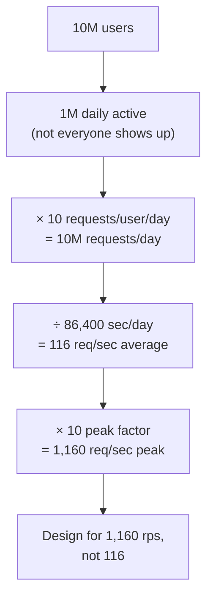

The exact numbers are estimates — nobody knows the real peak factor in advance. But they don't need to be exact. Their job is to **expose bottlenecks and get you to the right order of magnitude**: is this a 100-rps problem or a 100,000-rps problem? Those need completely different architectures.

## Trade-offs

- **Precision vs speed.** Don't spend an hour computing to three decimal places. Round aggressively (100K seconds/day is close enough to 86,400 for napkin math). The goal is the *shape* of the problem, not an audit.
- **Average vs peak.** Always design for peak. Averages lie — they hide the exact moment your system is most likely to fall over.

## Strong interview answer

> "First I'd estimate. Say 1M daily active users, 10 requests each — that's 10M/day, about 116 req/sec average. With a 10× peak factor I design for ~1,160 rps. That number decides everything downstream: whether I need a cache, replicas, or sharding. I always size for peak, not average, and I use these numbers to find the bottleneck before writing any code."

## Remember this

> **No numbers, no design.** Estimate reads/writes/peak first — the biggest number tells you where the system will break.

---

# 2. Stateless Application Servers

## In plain English

A **stateless** server is one that keeps no important memory of *you* between requests. Everything it needs to handle your request either comes *in* the request or is fetched from a shared store (a database, a cache). Any server can handle any request, because none of them remember anything special.

## Why you need it / what breaks without it

Here's the story. You start with one app server. Traffic grows, so you want to add a second. But if server #1 stored your login session **in its own local memory**, then when the load balancer sends your next request to server #2, server #2 has never heard of you — you're logged out. Now you can't freely add or remove servers, because each one holds state that only *it* knows.

Statelessness is the **precondition for horizontal scaling** (topic 3). You literally cannot add machines freely until your servers stop hoarding local state. This is why it comes so early: it unlocks everything after it.

## A real-world analogy

Think of a **coffee shop with interchangeable baristas** versus one where only *your* barista remembers your order. If every barista can read your order off the cup (the request carries the state) or off a shared ticket screen (shared store), then any barista can make your drink and you can add ten more baristas at the counter. But if the only way to get your usual is to wait for the one barista who memorized it, the line grinds to a halt the moment she takes a break. Stateless = order on the cup. Stateful = order in one barista's head.

## What's actually happening

You put a load balancer in front and run several identical, interchangeable app servers behind it:

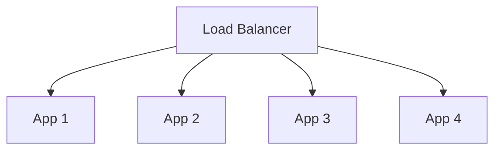

Because the servers are stateless, the load balancer can send request #1 to App 1 and request #2 to App 3 with no problem — neither needs to remember the other's requests. Add App 5? Just plug it in behind the load balancer; it's instantly useful. Remove App 2 for maintenance? The others cover it. **Instances become disposable, and disposable is scalable.**

Where does the state actually go? Into a **shared, external store** that all app servers can reach:

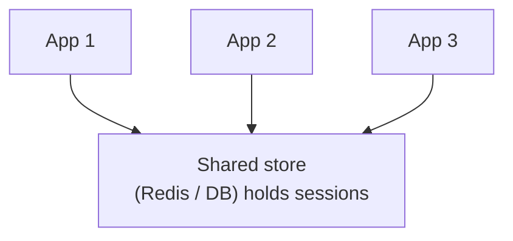

The rule: **avoid storing session state only in local memory when requests can land on any instance.** Put sessions in Redis, put user data in the database, put uploaded files in object storage. The app servers become pure logic with no long-term memory.

## Trade-offs

- **Local memory is fast but traps you.** Reading a session from local RAM is instant; reading it from Redis costs a network hop (~1 ms). You pay that small tax in exchange for the freedom to scale.
- **"Sticky sessions" are a tempting shortcut.** You *can* configure the load balancer to always send a given user to the same server (session affinity). It works until that server dies — and now those users lose their state anyway. Real statelessness is more robust.

## Strong interview answer

> "I'd make the app servers stateless — no session or user data in local memory, all of it in a shared store like Redis or the database. That way the load balancer can route any request to any instance, and I can add or remove servers freely. Statelessness is the thing that makes horizontal scaling actually work."

## Remember this

> **Keep no memory in the box.** Push state to a shared store so every server is interchangeable — and disposable servers are scalable servers.

---

# 3. Horizontal Scaling

## In plain English

There are two ways to give a system more power. **Vertical scaling** = make one machine bigger (more CPU, more RAM). **Horizontal scaling** = add more machines that share the load. Horizontal is the strategy that takes you to real scale.

## Why you need it / what breaks without it

You've made your servers stateless (topic 2), so now you *can* add machines. But should you, or should you just buy a bigger one? The story: vertical scaling is the easy first move — click a button, get a bigger box, done. But it hits a hard ceiling. There is a **biggest machine you can buy**, and once you're on it, you're stuck. It's also a single point of failure: one giant server dies, everything dies.

Horizontal scaling has no ceiling — you can always add one more machine — and it's naturally fault-tolerant, because losing one of fifty machines is survivable. **The catch: adding app servers just pushes the bottleneck downstream** to whatever they all talk to (usually the database). That's the theme again.

## A real-world analogy

Vertical scaling is **hiring one superhuman chef** and giving them a bigger stove. Fast, simple — until you need to feed 10,000 people and there's no chef alive who can cook that fast, no matter how big the stove. Horizontal scaling is **hiring 50 ordinary chefs** in 50 kitchens. Coordinating them is more work, but there's no limit to how many you can hire, and if two call in sick, dinner still happens.

## What's actually happening

Vertical (bigger box):

```text
4 CPU → 16 CPU
```

Horizontal (more boxes):

```text
1 instance
 ↓
10 instances
```

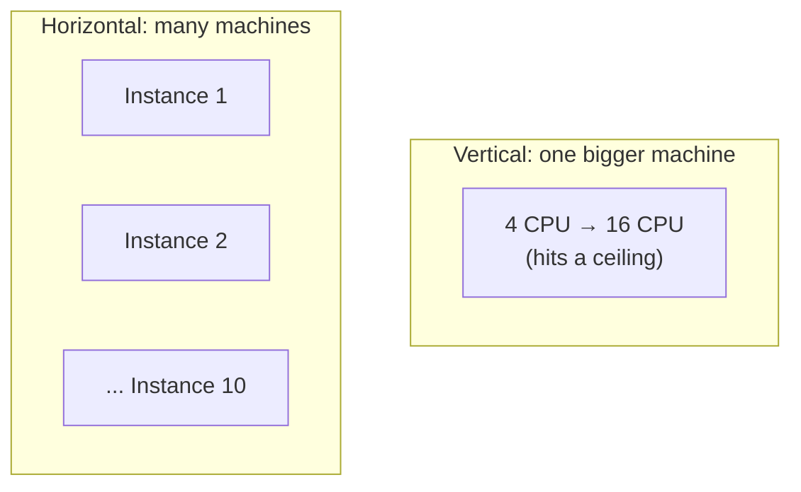

For **stateless workloads**, horizontal scaling is usually the better choice: flexible, cheap (commodity machines), and fault-tolerant. You add capacity in small increments instead of one terrifying upgrade.

But now trace where the load goes. Ten app servers all read and write the **same database**. You've solved the app-tier bottleneck and handed it straight to the database tier:

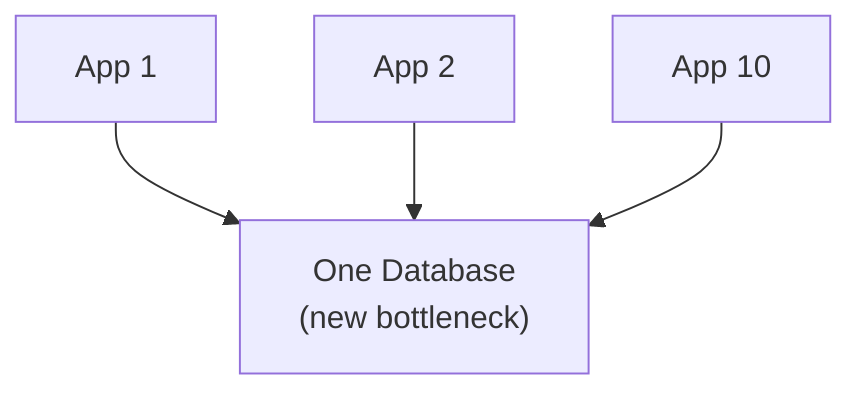

This is *the* pattern of the whole chapter. Fixing the app servers didn't remove the bottleneck — it **moved** it. The rest of this chapter is mostly about the database bottleneck you just created.

## Trade-offs

| Axis | Vertical (bigger box) | Horizontal (more boxes) |
|---|---|---|
| Ceiling | Hard limit — biggest machine you can buy | Effectively unlimited |
| Complexity | Trivial (resize and restart) | Load balancing, coordination, distributed bugs |
| Fault tolerance | One box = single point of failure | Lose one of many, keep running |
| Cost | Big machines cost a premium | Commodity machines, pay-as-you-grow |
| Best for | Quick wins, databases (which are hard to shard) | Stateless app tiers |

A senior tip: you often scale **vertically first** (it's easy and buys time) and switch to horizontal when you approach the ceiling.

## Strong interview answer

> "For the stateless app tier I'd scale horizontally — add commodity instances behind the load balancer rather than buying one giant box, because vertical scaling hits a hardware ceiling and is a single point of failure. But adding app servers just moves the bottleneck to the database, so the interesting scaling work is downstream: caching, replicas, and sharding."

## Remember this

> **Add boxes, don't grow one box** — but remember that ten app servers just point ten hoses at one database. The bottleneck moved; it didn't leave.

---

# 4. Load Balancer

## In plain English

A **load balancer** is the traffic cop sitting in front of your app servers. Every incoming request hits it first, and it decides which server handles that request. It spreads the load so no single server drowns.

## Why you need it / what breaks without it

The moment you have more than one app server (topic 3), something has to *choose* which server gets each request. Without a load balancer, clients would have to know all your server addresses and pick one themselves — brittle, and impossible to change without updating every client. Worse, if a server dies, clients keep sending to a dead address.

The load balancer solves both: it gives clients **one address** to talk to, and it quietly spreads traffic across healthy servers, routing around dead ones.

## A real-world analogy

It's the **host at a busy restaurant**. Diners don't wander in and pick a table themselves — the host seats them, balancing tables across waiters so no one waiter is buried while another stands idle. If a waiter goes home sick, the host simply stops seating their section. You (the diner) only ever talk to the host; you never need to know the waiters' names.

## What's actually happening

The load balancer distributes requests across instances using a **strategy**:

- **Round robin** — hand requests out in rotation: server 1, 2, 3, 1, 2, 3… Simple and fair when servers are equal.
- **Least connections** — send the next request to whichever server currently has the fewest active connections. Smarter when requests take uneven amounts of time.
- **Weighted** — give beefier servers a bigger share (server A is twice as powerful, so send it twice the traffic).
- **Consistent hashing** — route by a hash of some key (like user ID) so the *same* user tends to hit the *same* server. Useful for cache locality; we'll see the same idea in sharding.

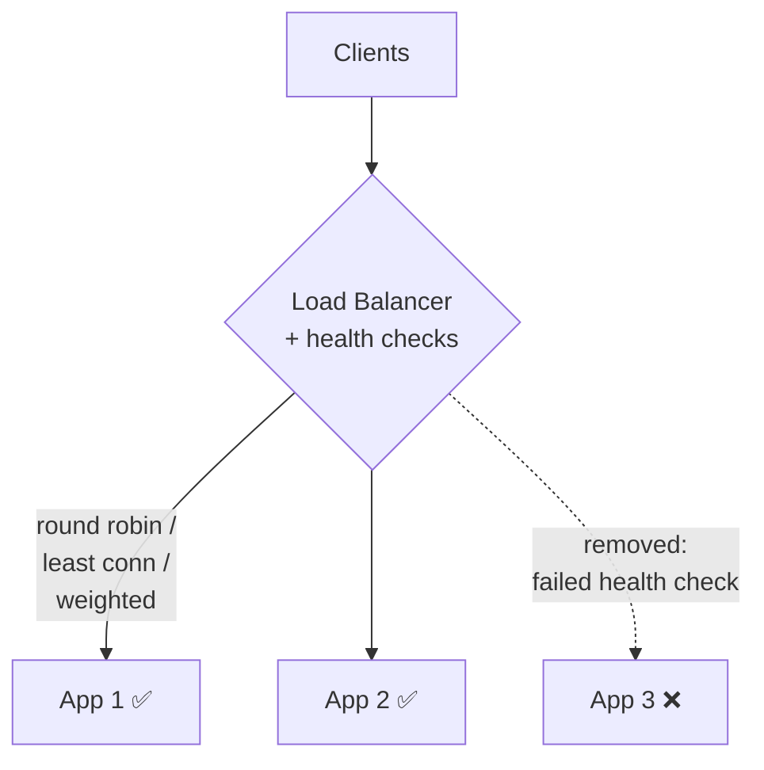

Crucially, the load balancer runs **health checks** — it periodically pings each server ("are you alive and healthy?"). If a server stops responding, the load balancer **removes it from rotation** automatically, so users don't get routed to a dead box. When it recovers, it's added back.

Now the theme again: the load balancer itself can become a bottleneck or a single point of failure. In production you run **multiple load balancers** (or a managed one that's internally redundant). Fixing the app tier moved the bottleneck; the load balancer is the next thing you must make robust.

## Trade-offs

- **Round robin is simple but dumb** — it ignores that one server might be handling a slow, heavy request. Least-connections adapts but costs a little more tracking.
- **Consistent hashing gives locality but risks imbalance** — pinning users to servers helps caching, but a few "whale" users can overload their assigned server (foreshadowing the hot-key problem in topic 9).

## Strong interview answer

> "I'd put a load balancer in front of the stateless app tier so clients hit one address and traffic spreads across instances — round robin or least-connections normally, consistent hashing when I want cache locality. Health checks pull dead instances out of rotation automatically. And I'd make the load balancer itself redundant, since otherwise it's just relocated my single point of failure."

## Remember this

> **One front door, many rooms.** The load balancer spreads traffic and routes around dead servers — but make it redundant, or it becomes the single point of failure.

---

# 5. Cache

## In plain English

A **cache** is a small, super-fast store that holds copies of data you ask for often, so you don't have to fetch it from the slow database every time. Ask the cache first; only bother the database on a miss.

## Why you need it / what breaks without it

Recall where we are: ten stateless app servers (topics 2–3) behind a load balancer (topic 4), all hammering **one database** (the bottleneck we created). Most systems read the same things over and over — the homepage, a popular product, a celebrity's profile. If **90% of reads are repeated**, then 90% of your database's work is answering the *exact same question* it just answered.

That's wasteful and it's fragile: the database is the slowest, hardest-to-scale component, and you're pointing your whole read load at it. A cache absorbs the repeated reads so the database only sees the *new* or *rare* ones. It's usually the single highest-leverage move for read-heavy systems.

## A real-world analogy

A cache is the **notepad on your desk** versus the **filing cabinet down the hall**. The first time someone asks for the quarterly numbers, you walk to the cabinet (the database), pull the file, and jot the answer on your notepad. The next ten people who ask, you just glance at the notepad — instant, no walk. The filing cabinet is the source of truth; the notepad is fast but small and can go stale if the real file changes.

## What's actually happening

The app checks the cache first. On a **hit**, it returns immediately. On a **miss**, it goes to the database, then stores the result in the cache so next time is a hit:

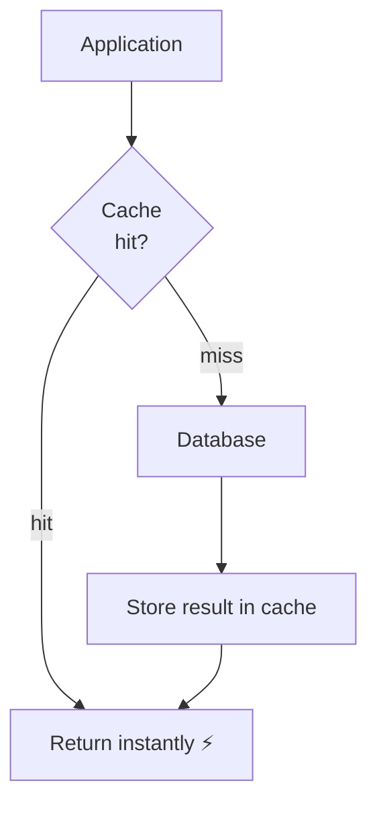

If 90% of reads hit the cache, your database load drops by roughly 90% — a 10× reduction. That's the difference between one database coping and one database melting.

But caching introduces its own hard problems (there's a famous joke: the two hardest things in computing are cache invalidation and naming things). You must understand:

- **Invalidation** — when the underlying data changes, the cached copy is now *wrong*. How and when do you throw it away? (The stale notepad problem.)
- **Staleness** — even with a TTL, the cache can be a few seconds behind reality. Is that OK for this data? (Usually yes for a product name, never for a bank balance.)
- **Stampede** — a popular key expires and *thousands* of requests all miss at once, stampeding the database in the same instant. Fixes include locking (one request refills, others wait) or slightly randomized expiry.
- **Hot keys** — one key (a celebrity's profile) is so popular it overloads whichever cache node holds it. (This is topic 9, the hot-key problem, showing up in the cache tier.)
- **Cache failure** — if the cache goes down and *all* traffic falls through to the database at once, you can take the database down with it. The cache must fail gracefully.

Notice the theme yet again: the cache **moved** the read bottleneck off the database — but created hot keys, stampedes, and a new dependency to keep alive.

## Trade-offs

- **Speed vs freshness.** A longer TTL means more cache hits (faster, cheaper) but staler data. You tune the TTL to how much staleness the data can tolerate.
- **Memory vs coverage.** Caches are small and expensive per byte. You cache the *hot* subset, not everything; evict the rest (LRU — least recently used).
- **Consistency risk.** A cache is a second copy of the truth, and two copies can disagree. Every cache is a small bet that stale-but-fast beats fresh-but-slow for this data.

## Strong interview answer

> "For a read-heavy workload I'd add a cache like Redis in front of the database — if most reads are repeated, it can cut database load by an order of magnitude. But I'd be explicit about the hard parts: invalidation and staleness (pick a TTL the data tolerates), stampede protection when a hot key expires, hot-key handling, and graceful behavior if the cache itself fails so I don't cascade the whole read load onto the database."

## Remember this

> **Ask the notepad before the filing cabinet.** A cache absorbs repeated reads — but now you own invalidation, staleness, stampedes, and a new thing that can fail.

---

# 6. Read Scaling (Replicas)

## In plain English

A **read replica** is a full copy of your database that stays in sync with the main one and serves **read** queries. You keep writing to the main database (the *primary*), but you spread the *reads* across one or more replicas.

## Why you need it / what breaks without it

The cache (topic 5) absorbed the *repeated* reads. But plenty of reads still get through — the unique ones, the cache misses, the queries you can't cache. If your workload is **read-dominated** (most systems are: think of how many times you scroll versus post), one database can still be overwhelmed just by reads.

The fix: clone the database. The **primary** handles all writes; several **replicas** each hold a copy and handle reads. Now your read capacity multiplies with the number of replicas, while writes stay on the primary.

## A real-world analogy

Think of a **library with one master reference copy and several photocopies**. Only the librarian updates the master (writes go to the primary). But if 200 students all need to read the same textbook, you don't make them queue for the one master copy — you hand out photocopies (replicas) so they can all read at once. The photocopies are updated shortly after the master changes, so occasionally a photocopy is a page behind.

## What's actually happening

The primary streams its changes to the replicas — this is **replication**:

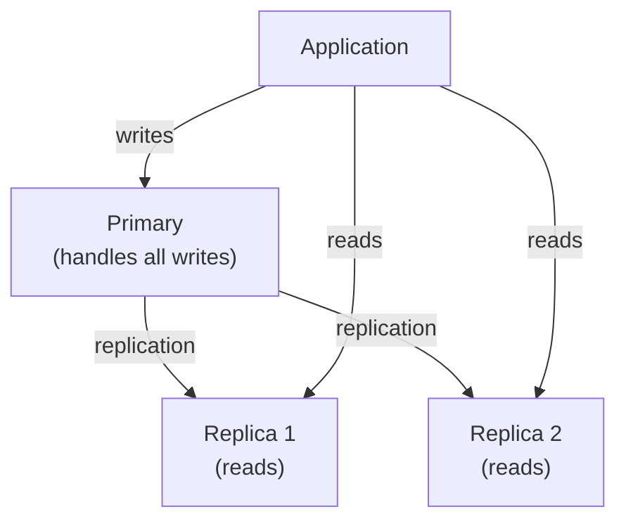

You **route suitable reads to the replicas** and keep writes on the primary. Add more replicas, get more read capacity. Simple and powerful.

But there's a catch called **replication lag**. Replication takes a little time — usually milliseconds, sometimes more under load. So a value you *just wrote* to the primary may not have reached the replica yet. If you write "new profile photo" and then immediately read from a replica, you might get the **old** photo back because the replica hasn't caught up.

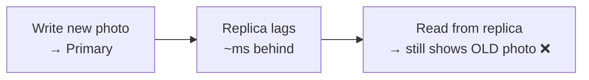

This breaks **read-after-write** consistency (the expectation that you can immediately see your own change). The fix: for reads that *must* reflect a just-made write (like showing a user their own new post), **route those specific reads to the primary**, and send everything else to replicas. This is called *read-your-writes* routing.

Theme check: replicas moved the read bottleneck off the primary — but introduced replication lag and a consistency wrinkle you now have to reason about. And notice writes are *still* all on the primary. That's the next bottleneck.

## Trade-offs

- **Strong vs eventual consistency on replicas.** Reading the primary is always fresh (strong) but doesn't scale reads. Reading a replica scales beautifully but can be slightly stale (eventual). You choose per query based on whether staleness is acceptable.
- **More replicas = more read capacity, but more lag risk and cost.** Each replica is a full copy of your data — storage and money — and the more of them, the more the primary works to feed them all.
- **Writes don't scale this way at all.** Replicas only help reads. Every write still lands on the single primary — which is exactly why topic 7 exists.

## Strong interview answer

> "For a read-heavy workload I'd add read replicas: keep all writes on the primary and route reads across replicas to multiply read capacity. The catch is replication lag — a replica can be milliseconds behind, so read-after-write can show stale data. I'd route reads that must reflect a just-made write to the primary and send the rest to replicas. Note this scales reads only; writes still bottleneck on the single primary, which is where sharding comes in."

## Remember this

> **Photocopy the database for readers.** Replicas multiply read capacity — but they lag, so route "must-be-fresh" reads to the primary. Writes still don't scale.

---

# 7. Write Scaling

## In plain English

At some point the writes alone are too much for one database to handle — even with caches and replicas, because those only help reads. **Write scaling** is the set of techniques for spreading write load beyond a single database.

## Why you need it / what breaks without it

Follow the trail. Cache absorbed repeated reads. Replicas absorbed the rest of the reads. But **every replica still gets every write from the primary**, and the primary is the *only* thing that accepts writes. If your write volume outgrows what one machine can commit to disk, you are stuck — no amount of caching or read replicas helps, because the problem is writes, and writes have nowhere else to go.

This is the moment the "one database" architecture finally breaks for good. You need to fundamentally change how writes are distributed.

## A real-world analogy

Imagine **one bank teller** processing every deposit in the city. You can hire assistants to *read* account balances to customers (replicas), but only that one teller can actually *record* a deposit. When deposits pour in faster than one teller can write them down, the line never ends. The only real fix is to **open more teller windows, each responsible for different accounts** — that's sharding.

## What's actually happening

Your options, roughly from cheapest to most invasive:

- **Batching** — instead of 1,000 tiny writes, group them into one bigger write. Fewer, fatter operations are far more efficient. (Great when you can tolerate a tiny delay.)
- **Partitioning** — split one big table into pieces (by date, by range) so each piece is smaller and faster to write.
- **Sharding** — split the data across *multiple databases*, each owning a slice. This is the big gun (topic 8).
- **Event-driven processing** — don't write synchronously on the request path; drop an event on a queue and let workers write in the background (topic 14).
- **Workload separation** — put different kinds of writes on different systems (e.g., analytics events into a system built for high write throughput, transactional data in your main DB).

**Sharding** is the headline technique. Instead of one database, you run several, and a rule decides which database each piece of data lives in:

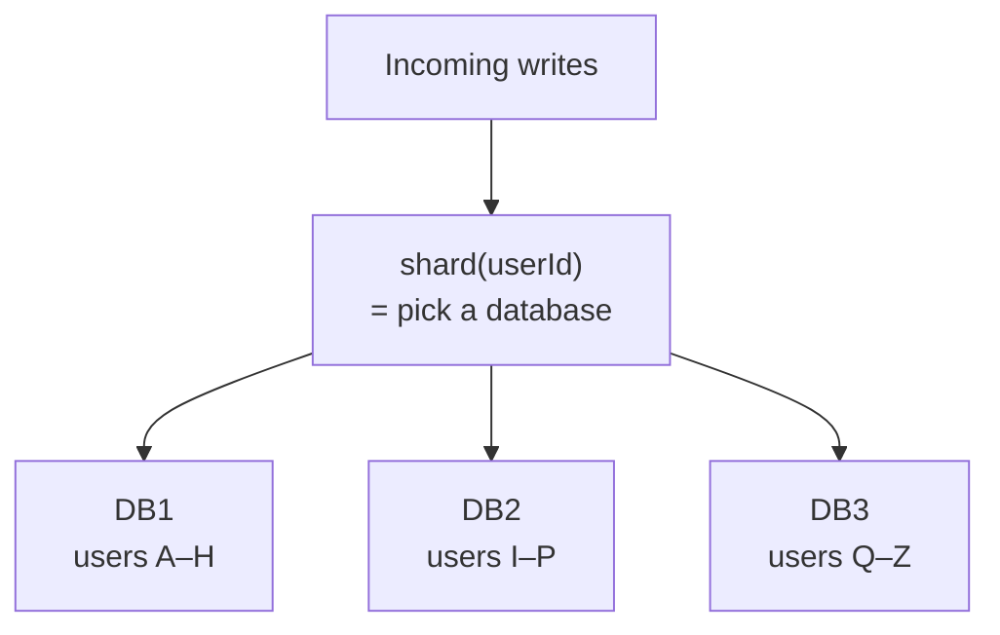

Now write load is divided three ways. User Alice's writes go to DB1, user Zara's to DB3, and they never contend for the same machine. Add more shards, get more write capacity.

Theme check: sharding scales writes — but it *shatters* the simplicity of a single database. Cross-shard queries, transactions across shards, and rebalancing all get harder. The bottleneck moved from "not enough write capacity" to "distributed-systems complexity." That trade is the subject of topic 8.

## Trade-offs

- **Batching trades latency for throughput.** Grouping writes is efficient but adds a small delay before each write lands. Fine for analytics, not for "did my payment go through?"
- **Sharding trades simplicity for scale.** You gain near-unlimited write capacity and lose easy joins, easy transactions, and easy queries that span shards.
- **Async/event-driven trades immediacy for capacity.** Writing via a queue smooths spikes but means the write isn't done the instant the user's request returns (eventual consistency).

## Strong interview answer

> "Replicas scale reads but every write still hits the single primary, so once write volume exceeds one machine I have to change the model. Cheapest first: batch small writes together, partition large tables. If that's not enough, shard — split the data across multiple databases by a shard key so writes divide across machines. Sharding gives near-unlimited write capacity at the cost of cross-shard queries and transactions, which is a real complexity jump I'd call out."

## Remember this

> **Replicas can't save writes.** When one database can't absorb the writes, you must split the *data itself* across machines — that's sharding, and it trades simplicity for scale.

---

# 8. Sharding

## In plain English

**Sharding** means splitting your data across multiple databases, where each database (a *shard*) holds a different slice of the data. A **shard key** is the field you use to decide which slice a given row belongs to. Choosing that key well is the whole game.

## Why you need it / what breaks without it

Topic 7 established *that* you shard to scale writes. This topic is about *how not to do it badly*. Because here's the trap: sharding only helps if the load spreads **evenly** across shards. Pick a bad shard key and you get one overloaded shard doing 80% of the work while the others idle — you've paid all the complexity cost of sharding and gotten almost none of the benefit.

## A real-world analogy

Sharding is like **splitting a giant class into sections by last name** — A–H in room 1, I–P in room 2, Q–Z in room 3. If names are evenly spread, each room has a similar headcount and every teacher has a manageable load. But if you split by **birth month** and half the school somehow has a December birthday, room 12 is packed while the others echo. Same idea with a bad shard key: split by *country* when 80% of your users live in one country, and that one shard is a mob scene.

## What's actually happening

A **good shard key** has three properties:

- **High cardinality** — many distinct values, so the data can be finely divided. (User ID: millions of values. Good.)
- **Evenly distributed** — no single value dominates, so shards get roughly equal load.
- **Commonly present in queries** — you have the key handy when you query, so you know which shard to hit without asking all of them.

A **bad shard key** violates these. The classic example:

```text
country
```

if 80% of users are in one country. That creates a **hot shard** — one shard buried under most of the traffic while the others sit nearly idle:

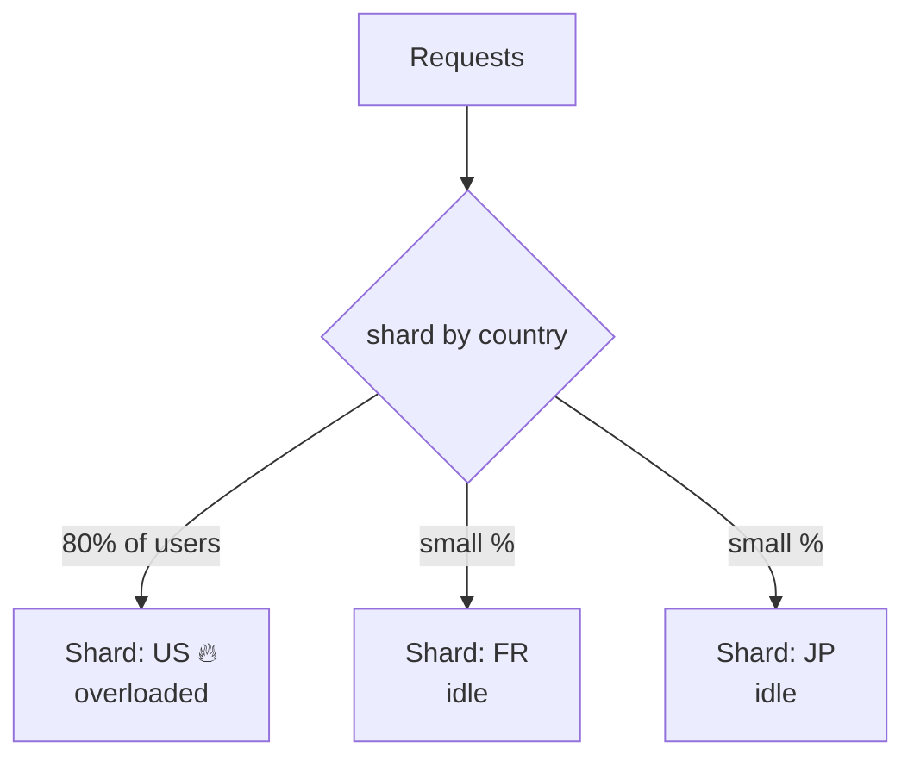

Compare with sharding by user ID, which spreads evenly:

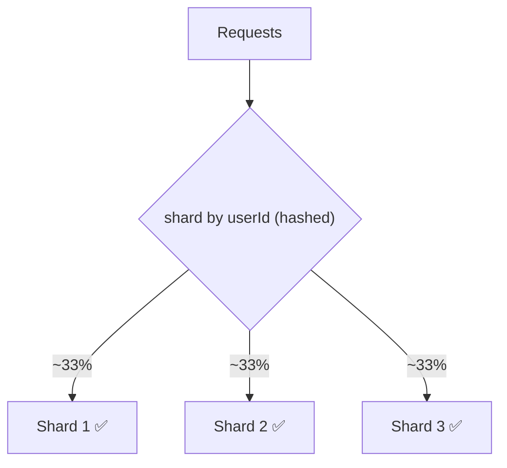

There's a second cost sharding introduces: **queries that span shards get expensive**. "List all users sorted by signup date" now has to ask *every* shard and merge the results (a scatter-gather). And a transaction touching two users on two different shards is a cross-shard transaction — genuinely hard. So you pick a shard key that keeps your *common* queries on a single shard.

Theme check: even with a perfect shard key, you've traded "one simple database" for "many databases plus a routing layer plus rebalancing plus cross-shard queries." Sharding is the point where a system stops being simple. That's why you delay it until caching and replicas can't cope.

## Trade-offs

- **Even distribution vs query-locality.** Hashing the key spreads load beautifully but scatters related data (bad for range queries). Range-based sharding keeps related data together (great for range queries) but risks hot shards. You can't fully have both.
- **Sharding complexity is permanent.** Once sharded, cross-shard joins, distributed transactions, and resharding-as-you-grow are facts of life. This is the single biggest complexity jump in the chapter.
- **Resharding is painful.** Adding a shard later means moving data around while live. Techniques like consistent hashing reduce how much data moves, but it's never free.

## Strong interview answer

> "The shard key is the whole decision. I want high cardinality, even distribution, and presence in common queries — user ID hashed is a classic good choice. I'd avoid low-cardinality skewed keys like country, where one value holds 80% of users and creates a hot shard that does most of the work while others idle. I'd also design the key so common queries land on one shard, since cross-shard scatter-gather and distributed transactions are the real cost sharding imposes."

## Remember this

> **A shard is only as good as its key.** High-cardinality, even, query-friendly keys spread load; skewed keys just recreate the bottleneck on one hot shard.

---

# 9. Hot Row / Hot Partition

## In plain English

A **hot row** (or hot partition/hot key) is a *single* piece of data that gets a wildly disproportionate share of the traffic. Even with perfect sharding, one specific row can be a bottleneck all by itself — because you can't split a single row across machines.

## Why you need it / what breaks without it

This is the bottleneck that survives sharding, and it surprises people. You sharded by user ID; load is beautifully even across shards. Then a celebrity joins, or one product goes viral, or one global counter tracks every event — and suddenly **one row** (`account:123`, `video:viral`, `counter:global`) is getting 100,000 updates per second. That row lives on exactly one shard, on one machine. Adding more shards **does nothing**, because all the traffic is aimed at that one key. You've hit the limit of "just spread it out" — the traffic refuses to spread.

## A real-world analogy

Imagine a stadium with 50 ticket gates (your 50 shards). Normally the crowd spreads across all 50 and everyone gets in fast. But one gate is where a **celebrity is signing autographs** — everyone stampedes that single gate while the other 49 sit empty. Opening a 51st gate doesn't help; the crowd only wants the celebrity's gate. You have to change the *plan* at that one gate: split the celebrity into multiple signing stations, hand out numbered tickets, batch people through — anything but "add another gate."

## What's actually happening

Concretely, suppose one row:

```text
account:123
```

receives 100K updates/sec. All updates target that single row, on a single shard. Sharding assumed load would spread — but this load won't. So you need different tactics that specifically break up the concentration on that one key:

- **Serialize updates through a queue** — funnel all writes to that row through a single ordered queue, so they don't fight each other (no lock contention), and apply them in a controlled stream.
- **Partition counters** — if the row is a counter, split it into many sub-counters and sum them on read (this is topic 10, the distributed counter).
- **Distribute writes across buckets** — spread the writes over N keys (`account:123:0`, `account:123:1`, …) and reconcile.
- **Redesign the aggregation** — maybe you don't need a live exact value; compute it periodically instead.
- **Batch updates** — coalesce 1,000 increments into one "+1000" write.
- **Use atomic database primitives** — a native atomic increment is far cheaper than read-modify-write and avoids races.

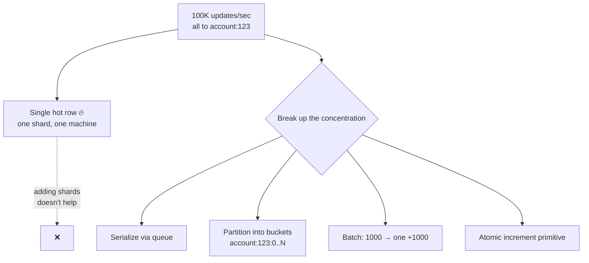

Theme check, sharpened: this is the theme's boss level. You've done everything right — stateless, horizontal, cached, replicated, sharded — and the bottleneck *still* moved, this time onto a single key that no amount of spreading can fix. You have to attack the key itself.

## Trade-offs

- **Spreading a hot key trades exactness for throughput.** Bucketing the writes means reads must sum buckets — cheap writes, more expensive reads, and possibly slightly eventual totals (topic 10).
- **Serializing via a queue trades latency for safety.** One ordered stream avoids contention but adds queueing delay, and the queue itself must keep up.
- **Batching trades freshness for efficiency.** Coalescing updates is hugely cheaper but the live value lags by the batch interval.

## Strong interview answer

> "A hot row is the bottleneck sharding can't fix — one key like a celebrity account or a global counter getting 100K writes/sec lives on one shard, and adding shards does nothing. I'd attack the key directly: serialize writes through a queue to kill contention, or partition the counter into buckets and sum on read, or batch increments, or use an atomic increment primitive. The general move is to break up the concentration or make each write cheaper, since you can't spread a single key across machines."

## Remember this

> **You can't shard a single row.** When one key gets all the traffic, spreading doesn't work — you must split the key itself (buckets), serialize it (queue), or make each write cheaper (batch/atomic).

---

# 10. Distributed Counter

## In plain English

A **distributed counter** is the standard fix for a hot counter row. Instead of one counter that everyone increments (and fights over), you keep many small sub-counters, spread the increments across them, and add them up when you need the total.

## Why you need it / what breaks without it

This is the concrete answer to the hot-row problem (topic 9) when the hot thing is a *count* — views, likes, votes. Picture a viral video approaching a billion views. If every view does `views = views + 1` on **one row**, that row is a hot row: massive contention, updates queueing behind each other, the counter falling behind reality. One counter simply cannot absorb a billion concurrent increments.

## A real-world analogy

It's like **counting a stadium crowd with one clicker versus fifty**. If a single person stands at one gate clicking every entrant, they can't keep up with a stampede. Instead you put a clicker at each of the 50 gates; each counts its own gate independently with zero coordination, and at the end you **add the 50 clickers together** for the total. Fifty people counting in parallel is fifty times faster — and none of them ever wait for another.

## What's actually happening

Instead of one counter:

```text
views = 1 billion
```

you split it into many buckets:

```text
views:0
views:1
...
views:99
```

Each incoming increment picks a bucket (at random, or by hashing the requester) and increments **that** bucket. Because writes now spread across 100 buckets, no single bucket is hot — you've turned one screaming-hot key into 100 lukewarm ones:

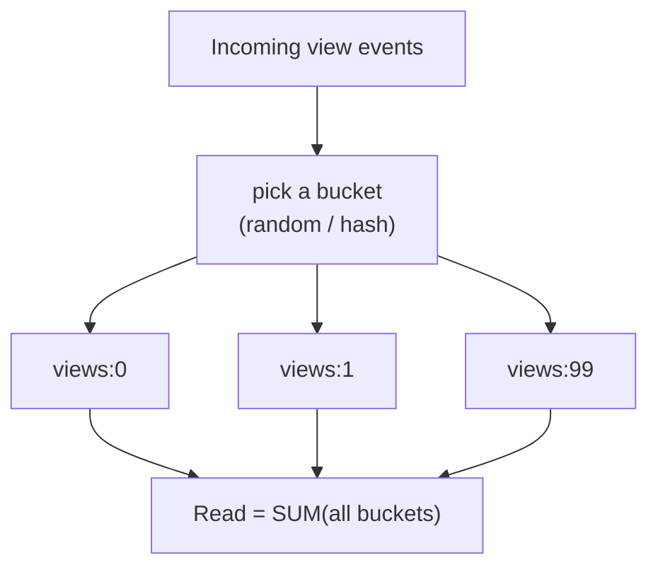

To read the total, you sum every bucket:

```text
SUM(all buckets)
```

That's the whole trick: **cheap, spread-out writes; a slightly more expensive read** that fans out across all buckets and adds them.

Theme check: the distributed counter took the write bottleneck off the single row and moved a little cost onto reads (you now sum N buckets) and onto exactness (the total is eventually consistent). Every fix in this chapter is a relocation of cost — never a free lunch.

## Trade-offs

- **More reads for fewer write conflicts.** Writes get cheap and contention-free; reads now touch N buckets instead of one. You trade read cost for write throughput.
- **Eventual aggregation.** The summed total can be a hair behind reality since buckets update independently — perfectly fine for a view count, not for money.
- **Complexity.** More keys to manage, and you must pick N (too few = still hot; too many = expensive reads).

Written out from the source notes, the trade-off is exactly: *more reads, eventual aggregation, complexity.*

## Strong interview answer

> "For a hot counter like viral video views, one row can't absorb the increments, so I'd shard the counter into N buckets — each increment hits a random bucket, and the total is the sum of all buckets. That spreads the write load so no bucket is hot. The cost is that reads must sum N buckets and the total is eventually consistent, which is fine for a view count. I'd pick N to balance write spread against read fan-out."

## Remember this

> **Many clickers, one sum.** Split a hot counter into buckets so writes spread; pay for it with fan-out reads and an eventually-consistent total.

---

# 11. Rate Limiting

## In plain English

**Rate limiting** caps how many requests a given caller (a user, an IP, a tenant) can make in a window of time. Over the cap, you reject with a "slow down" response. It's how you protect your own capacity from being eaten by one greedy or malicious caller.

## Why you need it / what breaks without it

You've built a lot of capacity — but capacity is finite, and some callers will happily consume all of it. A scraper hammering your API, a buggy client stuck in a retry loop, one noisy tenant starving everyone else, an application-layer DDoS. Without a rate limiter, a single bad actor can saturate the system you worked so hard to scale, and *everyone* suffers. The rate limiter draws a fair line: "you get this much, no more," so no one caller can take the whole thing down.

## A real-world analogy

A rate limiter is a **nightclub bouncer enforcing capacity**. The club holds 100 people; the bouncer counts and, when it's full, tells new arrivals to wait. Different bouncing philosophies (the algorithms below) handle the *crowd* differently — some let a saved-up burst rush in, some let people through at a strict steady drip — but the goal is always the same: never let more in than the venue can safely hold.

## What's actually happening

There are four classic algorithms. The core tension across all of them is **accuracy vs cost vs burst-tolerance**.

### Fixed window

Count requests per fixed clock window (e.g., per minute); reset the count when the window rolls over. Dead simple and cheap.

**The flaw — boundary bursts.** Because the counter resets sharply at the window edge, a caller can send a full window's worth of requests just *before* the reset and another full window's worth just *after* — double the intended rate in a tiny span, and neither window's count looks over the limit.

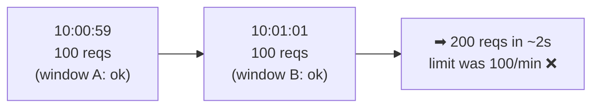

### Sliding window

Track requests over a rolling window that moves with *now*, so there's no sharp reset to exploit — it fixes the boundary-burst bug. **More accurate, but more expensive**, because you're maintaining a moving view of recent requests rather than a single counter that resets.

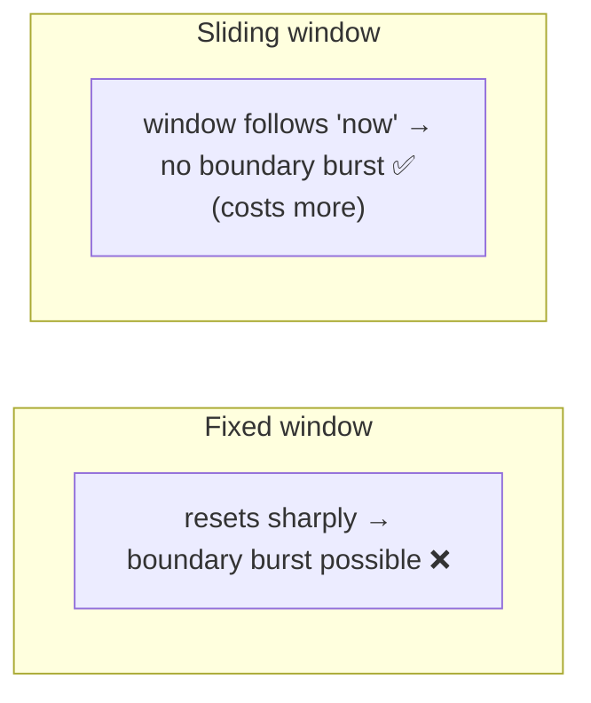

### Token bucket

A bucket holds up to `capacity` tokens. **Tokens accumulate at a fixed rate** (say 10/sec). **Each request consumes a token**; if the bucket is empty, the request is denied. Because tokens can pile up while you're idle, a caller can **burst** — spend a stockpile all at once — but the long-run average is capped by the refill rate. This is the sweet spot for user-facing APIs: it *allows bounded bursts while controlling the average rate.*

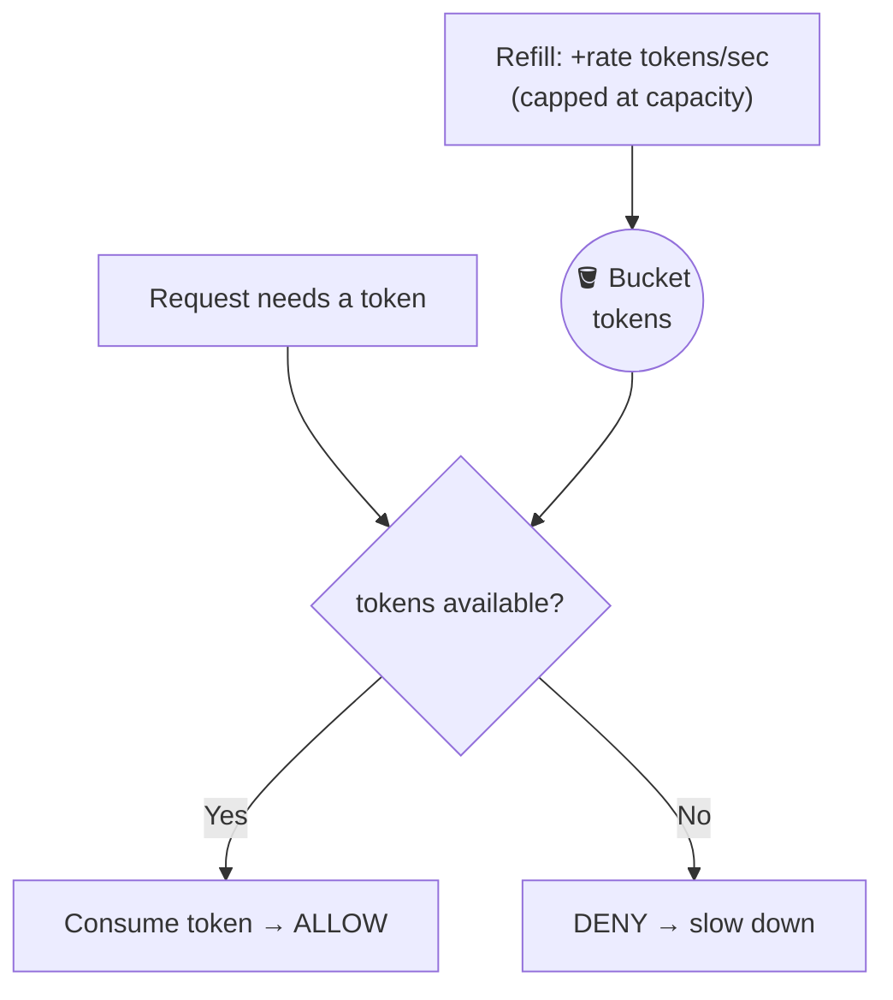

### Leaky bucket

Requests join a queue that **drains (leaks) at a fixed rate**. Output is perfectly smooth — no bursts *ever* reach the backend, no matter how bursty the input. It **controls the output rate more strictly** than token bucket. Ideal when you're protecting a fragile downstream that can only accept a constant, steady rate.

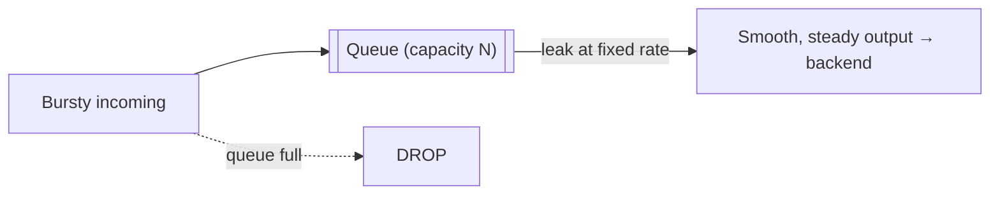

Theme check: rate limiting is itself a component that sits on **every** request's path, so it must be fast and must not become the bottleneck it's meant to prevent — and its shared counters can themselves become hot keys (topic 9). Protecting capacity created a new thing to keep fast and available.

## Trade-offs

| Algorithm | Accuracy | Cost | Bursts? | Best for |
|---|---|---|---|---|
| **Fixed window** | Low (boundary bug) | Cheap | Uncontrolled at edges | Simple, non-critical limits |
| **Sliding window** | High | More expensive | No | When you need accuracy |
| **Token bucket** | High | Cheap | **Yes, bounded** | User-facing APIs (bursts + avg cap) |
| **Leaky bucket** | High | Cheap | **No (smooths)** | Protecting a fixed-rate downstream |

The key distinction to internalize: **token bucket allows saved-up bursts, leaky bucket forbids all bursts.** Choose by whether your downstream can tolerate a spike.

## Strong interview answer

> "Rate limiting protects capacity from abuse, retry storms, and noisy tenants. Fixed window is simplest but has the boundary-burst bug — 200 requests across a window edge under a 100/min limit. Sliding window fixes that at higher cost. Token bucket is my default for user-facing APIs: tokens refill at a fixed rate and each request spends one, so it allows bounded bursts while capping the average. Leaky bucket drains a queue at a strict fixed rate — no bursts at all — which is what I'd use to protect a fragile fixed-throughput downstream."

## Remember this

> **Cap the greedy caller before they cap you.** Fixed window is simple-but-leaky; sliding is accurate-but-costly; token bucket allows bursts; leaky bucket forbids them.

---

# 12. Load Shedding

## In plain English

**Load shedding** means, when you're getting more work than you can possibly handle, deliberately **dropping or degrading the least important work** so the most important work still succeeds. You choose what to sacrifice, on purpose, instead of letting the whole system collapse.

## Why you need it / what breaks without it

Rate limiting (topic 11) caps individual callers, but sometimes *legitimate aggregate* traffic simply exceeds your capacity — a flash sale, a viral moment, a thundering herd. When incoming work is far greater than what you can process, if you try to accept it all, queues grow without bound, latency explodes, and eventually *everything* fails, including the requests you most cared about. Load shedding is the choice to fail *gracefully and selectively* rather than *totally and randomly*.

## A real-world analogy

It's an **emergency room during a disaster** — triage. When 200 patients arrive at once and you can treat 20 at a time, you don't treat them first-come-first-served until you collapse. You **triage**: life-threatening cases first, minor scrapes wait or get sent elsewhere. You deliberately deprioritize the non-critical so the critical survive. Load shedding is triage for requests.

## What's actually happening

The trigger is simple: incoming work exceeds capacity.

```text
Incoming = 100K/sec
Capacity = 20K/sec
```

You're being handed 100,000 requests per second but can only truly serve 20,000. The 80,000 excess has to go *somewhere*, and the wrong answer is "into an ever-growing queue" — that just delays the collapse. The right answer: **do not let the system queue forever. Reject or degrade lower-priority work** immediately.

You do this by **priority**. Keep the critical, shed the rest:

```text
Critical payment → accept
Recommendation   → disable
Analytics        → defer
```

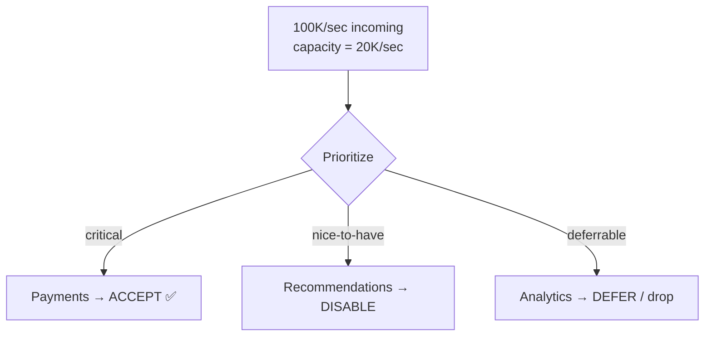

The payment goes through (that's what the business truly can't lose), recommendations quietly turn off (the page still works, just plainer), analytics events get dropped or delayed (nobody notices in the moment). The system stays up and does its most important job. This is **graceful degradation** — the app gets *less capable* under load instead of *dead*.

Theme check: load shedding is the admission that scaling has limits — you can't always add capacity fast enough, so you must decide *what to protect* when demand outruns supply. The bottleneck became "which work matters most," a product decision as much as an engineering one.

## Trade-offs

- **What you shed is a business call, not just a technical one.** Engineering can build the mechanism; product decides that payments beat analytics. Get this ranking agreed *before* the incident.
- **Shedding hurts someone.** Every dropped request is a real user who didn't get served. You accept small, chosen harm to avoid large, random harm.
- **Shed early, not late.** If you wait until queues are already huge, you're recovering from collapse, not preventing it. Detect overload fast and start shedding immediately.

## Strong interview answer

> "When aggregate demand exceeds capacity — say 100K/sec incoming against 20K/sec capacity — I won't queue the excess forever, because that just delays total collapse. Instead I shed load by priority: accept critical work like payments, disable nice-to-haves like recommendations, and defer or drop analytics. That's graceful degradation — the system gets less capable rather than dying. The priority ranking is a business decision I'd nail down ahead of time, and I'd shed early rather than after queues explode."

## Remember this

> **Triage, don't drown.** When demand outruns capacity, deliberately drop low-value work so high-value work survives — an infinite queue only delays the collapse.

---

# 13. Backpressure

## In plain English

**Backpressure** is a signal that flows *backward* from a slow consumer to a fast producer, effectively saying "stop sending so fast, I can't keep up." It's how a system makes a fast producer slow down to match a slow consumer, instead of burying it.

## Why you need it / what breaks without it

Load shedding (topic 12) dropped excess work at the front door. Backpressure is the related idea *inside* your pipelines: whenever one part produces work faster than the next part can consume it, the gap has to go somewhere. If you ignore it and buffer everything in an unbounded queue, you're not solving the problem — you're **hiding** it. The queue grows until memory runs out, and then everything crashes at once. An unbounded buffer turns a small, survivable mismatch into a delayed catastrophe.

## A real-world analogy

Think of **washing dishes with someone drying**. If you wash (produce clean dishes) faster than they can dry (consume), the drying rack fills up. A *bounded* rack forces you to slow down — you physically can't wash faster than there's space to stack. That "you must slow down" pressure traveling back to the washer is backpressure. An *unbounded* rack (an infinitely tall stack) just means dishes pile to the ceiling and eventually the whole tower crashes.

## What's actually happening

The setup is a producer/consumer speed mismatch:

```text
Producer = 100K/sec
Consumer = 20K/sec
```

The producer generates 100,000 items per second; the consumer can only process 20,000. That's an 80,000/sec surplus with nowhere to go. The fix is to **use bounded queues and/or Kafka** — a queue with a *fixed* maximum size. When it fills, the producer is forced to block, slow down, or shed (topic 12) — the backpressure signal. The mismatch becomes visible and controllable instead of silently accumulating.

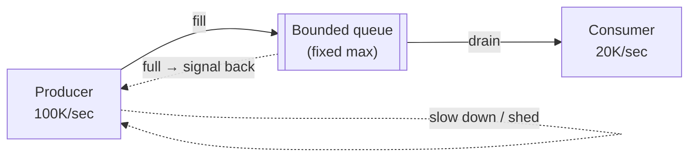

To manage backpressure you **monitor** the health of the pipeline:

- **queue depth** — how full is the buffer right now? Rising = consumer falling behind.
- **oldest item age** — how long has the oldest unprocessed item been waiting? Rising = you're getting further behind.
- **lag** — how far behind real-time is the consumer (classic Kafka consumer lag)?
- **processing rate** — are you draining as fast as you're filling?

The one-line truth to carry: **an infinite queue only delays failure.** Buffering is not a fix; it's a countdown timer. The real fix is to make the producer respect the consumer's pace.

Theme check: backpressure is the plumbing that makes the whole scaled system honest about its limits. You can scale each stage, but the moment one stage is slower, you need a way to *communicate* that backward — otherwise the fast stages just build a bigger bomb.

## Trade-offs

- **Bounded (safe) vs unbounded (dangerous) queues.** Bounded queues make you confront the mismatch now (block or shed); unbounded queues feel smoother until they OOM-crash. Always prefer bounded.
- **Block vs drop.** When the queue is full you either make the producer wait (block — preserves data, adds latency) or drop items (shed — stays fast, loses data). Choose by whether the data is precious.
- **Buffering buys time, not a solution.** A bigger queue absorbs a longer spike, but if the producer is *sustainably* faster than the consumer, no queue size saves you — you must scale the consumer or slow the producer.

## Strong interview answer

> "Backpressure is how a slow consumer tells a fast producer to slow down. If the producer does 100K/sec and the consumer 20K/sec, I won't hide the 80K/sec gap in an unbounded queue — that just delays an out-of-memory crash. I use bounded queues (or Kafka) so that when the buffer fills, the producer blocks or sheds. I monitor queue depth, oldest-item age, consumer lag, and processing rate to see the mismatch early. The mantra: an infinite queue only delays failure."

## Remember this

> **A full bounded queue is a feature, not a bug** — it forces the producer to slow down. An infinite queue only delays failure; it never prevents it.

---

# 14. Async Processing

## In plain English

**Asynchronous processing** means the API doesn't do the slow work itself while the user waits. Instead it drops the work onto a **queue**, returns to the user immediately ("got it, working on it"), and a background **worker** does the heavy lifting later.

## Why you need it / what breaks without it

Some work is slow: sending emails, encoding video, calling a sluggish third-party API, generating a report. If your API does this *synchronously* — inside the request, while the user's browser spins — then every slow task ties up a request thread, users stare at loading spinners, and a burst of slow tasks can exhaust your servers even though they're mostly just *waiting*. Async decouples "accept the work" from "do the work," so the fast part (accepting) stays fast and the slow part (doing) runs at its own pace in the background.

## A real-world analogy

It's the difference between a **restaurant where you wait at the counter for your meal** and one that **gives you a buzzer**. Synchronous: you stand at the register blocking the line until your food is fully cooked. Asynchronous: they take your order, hand you a buzzer (the immediate response), and you sit down; the kitchen (the worker) cooks in the background and buzzes you when it's ready. The register stays free to take the next order instantly.

## What's actually happening

The API's only job becomes: validate the request, put a message on the queue, and return. A separate pool of workers pulls from the queue and does the actual work:

```mermaid
flowchart TD
    API["API<br/>(returns immediately)"] --> Queue["Queue"]
    Queue --> Worker["Worker<br/>(does slow work)"]
    Worker --> DB["DB / external service"]
```

Because the API returns the moment the message is enqueued, the user gets a fast response even if the real work takes minutes.

The **benefits**:

- **decoupling** — the API and the worker can be scaled, deployed, and fail independently.
- **buffering** — a traffic spike piles up in the queue instead of overwhelming the workers; they drain it at a steady pace (this is where backpressure, topic 13, lives).
- **controlled concurrency** — you decide how many workers run, so downstream systems see a steady, bounded load instead of a stampede.
- **better resource utilization** — request threads aren't wasted sitting idle waiting on slow I/O.

The **trade-offs** (the price of async):

- **eventual consistency** — the work isn't done when the response returns; it finishes *later*. Your UI has to account for "in progress."
- **harder user experience** — you must show "processing…" states, notify on completion, handle failures the user can't see happen.
- **retries / idempotency required** — a queued message might be delivered more than once, so workers must be **idempotent** (processing the same message twice has the same effect as processing it once). Otherwise you send two emails or charge the card twice.

```mermaid
flowchart LR
    Sync["Synchronous:<br/>user waits for slow work ⏳"] -->|convert to| Async["Asynchronous:<br/>return now, work later ⚡"]
    Async --> Cost["Cost: eventual consistency,<br/>'in progress' UX,<br/>idempotent retries"]
```

Theme check: async moved the bottleneck off the request path (the user no longer waits) and onto a queue-and-worker system you now have to run, monitor for lag, and make idempotent. Faster responses, more moving parts.

## Trade-offs

- **Immediacy vs throughput.** Sync gives an instant done-result but ties up resources; async frees resources and smooths spikes but the result is delayed.
- **Simplicity vs resilience.** A synchronous call is easy to reason about; async introduces a queue, workers, retries, and idempotency — more resilient, more complex.
- **At-least-once delivery forces idempotency.** Most queues can deliver a message twice on failure/retry. You *must* design workers so duplicates are harmless.

## Strong interview answer

> "For slow work — video encoding, emails, calls to slow third parties — I'd process asynchronously: the API validates, enqueues a message, and returns immediately, while background workers do the heavy work. This decouples the tiers, buffers spikes in the queue, and gives controlled concurrency so downstreams aren't stampeded. The costs are eventual consistency and an 'in progress' UX, and because queues are usually at-least-once, workers must be idempotent so a redelivered message doesn't double-charge or double-send."

## Remember this

> **Take the order, hand over a buzzer.** Enqueue slow work and return now — but pay with eventual consistency and idempotent, retry-safe workers.

---

# 15. CDN

## In plain English

A **CDN** (Content Delivery Network) is a global fleet of caching servers spread across the world. It stores copies of your static content close to your users, so a user in Tokyo is served from a nearby Tokyo server instead of reaching all the way back to your origin in Virginia.

## Why you need it / what breaks without it

Your origin servers live in one place (or a few). But your users are everywhere. Every image, CSS file, and video they request has to travel from your origin to their device — and if that's halfway around the planet, it's slow (physics: light takes time) and it dumps all that bandwidth on your origin. For **global, static, or cacheable content**, that's a triple waste: high latency for users, heavy traffic on your origin, and big bandwidth bills. A CDN fixes all three by caching near the user.

## A real-world analogy

A CDN is a chain of **local warehouses** versus one central factory. If every online order shipped directly from the single factory in another country, delivery would be slow and the factory's shipping dock would be swamped. Instead, the company stocks popular items in local warehouses near customers — your order ships from the warehouse across town (fast, cheap), and the central factory only gets involved for rare items it doesn't stock locally.

## What's actually happening

The user hits the nearest CDN edge server. On a **hit**, the CDN serves the cached copy directly — the origin never even hears about the request. On a **miss** (the CDN doesn't have it yet), the CDN fetches it from the origin once, caches it, and serves it — so the *next* nearby user gets a hit:

```mermaid
flowchart TD
    User["User (Tokyo)"] --> CDN["CDN edge<br/>(nearby)"]
    CDN -->|hit| Fast["Serve cached copy ⚡"]
    CDN -->|miss| Origin["Origin (Virginia)<br/>fetched once, then cached"]
    Origin --> CDN
```

This **reduces** three things at once:

- **origin traffic** — most requests are served by the edge and never reach your origin (like the cache in topic 5, but geographically distributed).
- **latency** — content travels a short distance from a nearby edge instead of across the world.
- **bandwidth** — your origin ships each asset to the CDN a few times, not to every user individually.

It's ideal for:

- **images** — thumbnails, photos, avatars.
- **static files** — CSS, JavaScript, fonts.
- **public content** — anything the same for all users and cacheable.

Theme check: a CDN is essentially topic 5's cache, moved to the *network edge* and replicated globally. It offloads your origin — but adds cache-invalidation-at-a-distance (purging stale content from hundreds of edges) and cost. Same relocation-of-cost pattern, now spanning the planet.

## Trade-offs

- **Static/public content only.** A CDN shines for content that's the same for everyone and rarely changes. Personalized or private, per-request data can't be shared-cached at the edge (or requires careful cache keys).
- **Freshness vs reach.** Content cached across hundreds of edges is fast to serve but slow to *update* everywhere — purging/invalidating a stale asset globally takes effort (versioned URLs are the common trick).
- **Cost.** CDNs cost money, but usually far less than serving all that bandwidth from your origin and eating the latency.

## Strong interview answer

> "For global static and cacheable content — images, CSS/JS, public assets — I'd put a CDN in front. Users are served from a nearby edge instead of my origin, which cuts latency, offloads origin traffic, and reduces bandwidth. It's essentially a geographically distributed cache. The caveats are that it only helps static/public content, and invalidating stale content across all edges takes care — I'd use versioned URLs so a new asset gets a new path."

## Remember this

> **Ship from the warehouse across town.** A CDN is a global edge cache for static content — huge latency and origin wins, at the cost of distributed invalidation.

---

# 16. Database Bottleneck (Diagnostic Checklist)

## In plain English

Sooner or later the **database** is your bottleneck — it almost always is at scale, because it's the hardest tier to scale and everything funnels into it. This topic is a **diagnostic checklist**: before you reach for a fix, figure out *what exactly* is slow, because the right fix depends entirely on the cause.

## Why you need it / what breaks without it

The whole chapter has been quietly circling this: horizontal scaling pointed everything at the database, and caching/replicas/sharding were all ways to relieve it. But when someone says "the database is slow," that's not actionable — it's like a doctor hearing "I feel bad." You have to **diagnose** before you prescribe. Throw a cache at a problem that's actually a missing index, or add replicas when the real issue is one hot row, and you've spent effort fixing the wrong thing while the bottleneck stays put.

## A real-world analogy

It's **medical diagnosis before treatment**. A good doctor doesn't hand out the same pill to everyone who says "it hurts." They ask *where*, *when*, *what kind of pain* — narrowing down until they know whether it's a sprain, an infection, or a break. Each has a completely different treatment. "The database is slow" needs the same interrogation before you prescribe caching versus indexing versus sharding.

## What's actually happening

First, **ask diagnostic questions** to localize the pain:

```text
Reads or writes?
CPU or I/O?
Query or connection pool?
One table or whole DB?
One key/row or broad load?
```

Walk through why each matters:

- **Reads or writes?** Reads → caching and replicas help. Writes → those *don't* help; you need batching, partitioning, or sharding. (This is the reads-scale-easily, writes-scale-hard split from topics 5–7.)
- **CPU or I/O?** CPU-bound → maybe an inefficient query burning cycles. I/O-bound → maybe you're reading too much data from disk (missing index, no pagination).
- **Query or connection pool?** A slow *query* is a query problem. But if you've simply run out of connections, the queries are fine — you have a pooling/concurrency problem.
- **One table or whole DB?** One hot table → partition or index *that* table. Whole DB → you may need to scale the DB itself or shard.
- **One key/row or broad load?** One hot key → this is the hot-row problem (topic 9), fixed with bucketing/queueing, *not* with more capacity. Broad load → capacity solutions apply.

```mermaid
flowchart TD
    Slow["'DB is slow'"] --> D{"Diagnose"}
    D --> RW{"Reads or writes?"}
    D --> CI{"CPU or I/O?"}
    D --> QP{"Query or connections?"}
    D --> TB{"One table or whole DB?"}
    D --> KR{"One row or broad?"}
    RW -->|reads| Fix1["cache / replicas"]
    RW -->|writes| Fix2["batch / partition / shard"]
    KR -->|one row| Fix3["hot-row fixes (buckets/queue)"]
```

Once diagnosed, you pick from the **toolbox** — and notice this list *is* the whole chapter:

```text
Query optimization
Indexes
Caching
Read replicas
Partitioning
Sharding
Batching
Archival
Capacity increase
```

Read roughly cheapest/least-invasive first: fix the query, add an index, cache it, add replicas, partition, shard, batch writes, archive old data, and only then throw hardware at it. **Capacity increase is last** — buying a bigger box is the crude fallback when smarter fixes aren't enough.

Theme check: this is the theme's home base. The database bottleneck is where every earlier fix was aimed, and the diagnosis tells you which relocation of load to attempt next. Fix the query and load might move to connections; add a replica and it might move to replication lag; shard and it might move to a hot row.

## Trade-offs

- **Cheap fixes first.** An index or a query rewrite can be a 100× win for near-zero cost and complexity — always exhaust these before sharding.
- **Capacity increase is the blunt instrument.** It's fast and simple but expensive and ceiling-limited (topic 3's vertical scaling). Use it to buy time, not as the real fix.
- **Archival is underrated.** Sometimes the DB is slow simply because it's huge. Moving cold, old data out (archival) shrinks the working set and speeds everything up cheaply.

## Strong interview answer

> "When the database bottlenecks, I diagnose before I fix: reads or writes? CPU or I/O? Slow query or exhausted connections? One hot table or the whole DB? One hot key or broad load? Each points to a different fix — reads want caching and replicas, writes want batching and sharding, a hot key wants bucketing, not more capacity. Then I apply the cheapest effective fix first — query optimization, indexes, caching — before the invasive ones like sharding, and I treat a raw capacity increase as the last resort."

## Remember this

> **Diagnose before you prescribe.** "The DB is slow" isn't a fix — localize it (reads/writes, CPU/IO, query/connections, table/DB, key/broad), then apply the cheapest fix that fits.

---

# 17. Capacity Planning

## In plain English

**Capacity planning** is deciding how much capacity to provision — and the key insight is that you *never* provision for exactly your current peak. You leave **headroom** for growth, failures, and bursts. A system running at 100% has zero room for the bad day.

## Why you need it / what breaks without it

You've measured your load (topic 1) and know you handle, say, 10K requests/sec today. The tempting move is to provision exactly 10K of capacity — perfectly efficient, no waste. It's also a trap. The moment *anything* goes slightly wrong — a traffic spike, one server failing, a deploy taking a node offline — you have no slack, and a system with no slack tips instantly from "fine" to "collapsing." Capacity planning is buying insurance against the completely predictable bad day.

## A real-world analogy

It's like **designing a bridge**. Engineers don't build a bridge to hold *exactly* the weight of the traffic they expect — they build in a large safety margin for the heaviest truck, plus wind, plus wear, plus the day everyone crosses at once. A bridge rated for exactly the average load collapses the first time a heavy convoy shows up. Spare capacity is the safety margin that keeps the bridge standing on the worst day, not just the average one.

## What's actually happening

Suppose:

```text
Current = 10K/sec
Growth = 3x/year
```

You handle 10K/sec now, and you're growing 3× per year — so in a year you'll need ~30K/sec. Provisioning exactly 10K means you're already behind next quarter, and you have nothing spare *today*.

**Don't provision exactly 10K.** Account for all the things that eat into capacity:

- **peak traffic** — your real peak is well above the average (topic 1's 10× factor).
- **failure headroom** — if one server (or one whole availability zone) dies, the survivors must absorb its share without tipping over. If you run 3 zones, you should survive losing one — meaning you can't run the other two near 100%.
- **replication** — keeping replicas in sync costs the primary work; that's capacity spent on durability, not serving.
- **deployment** — rolling out a new version takes nodes offline temporarily; the rest carry the load meanwhile.
- **traffic bursts** — flash sales, viral moments, thundering herds arrive faster than you can add capacity.
- **noisy neighbors** — on shared infrastructure, someone else's spike can steal resources you were counting on.

```mermaid
flowchart TD
    Peak["Peak traffic (>average)"] --> Need["Provisioned capacity"]
    Fail["Survive a failed server/zone"] --> Need
    Repl["Replication overhead"] --> Need
    Deploy["Nodes offline during deploys"] --> Need
    Burst["Traffic bursts"] --> Need
    Noisy["Noisy neighbors"] --> Need
    Need --> Rule["Provision well ABOVE current peak,<br/>never exactly at it"]
```

The principle: **a system should have enough spare capacity to survive expected failures without immediately collapsing.** "Expected failures" is the key phrase — a server dying and a deploy happening aren't freak events, they're *Tuesday*. Plan for them as the normal case.

Theme check: capacity planning is the theme applied to *time*. Even after you've fixed every current bottleneck, growth (3×/year) guarantees a future one. You provision headroom precisely because you know the bottleneck will move again — upward — whether you're watching or not.

## Trade-offs

- **Headroom vs cost.** Spare capacity costs money that sits idle on good days. Too little and you collapse on the bad day; too much and you burn budget. The art is picking a buffer (often expressed as a target max utilization, e.g. never above 60–70%) that survives your worst *expected* event.
- **Autoscaling helps but isn't instant.** Cloud autoscaling adds capacity on demand, reducing idle waste — but it takes minutes to spin up, so you still need standing headroom to survive a sudden burst that arrives faster than scaling can react.
- **Failure headroom multiplies cost.** Surviving the loss of 1 of N zones means running each below 1 − 1/N utilization — real money spent on the day nothing goes wrong, to be ready for the day something does.

## Strong interview answer

> "I never provision for exactly current peak. If I'm at 10K/sec growing 3× a year, I plan for growth plus headroom for the things that are normal, not exceptional: real peak above average, surviving a failed server or zone, replication and deploy overhead, bursts, and noisy neighbors. The rule is enough spare capacity to survive expected failures without collapsing — so I target a max utilization like 60–70%, use autoscaling for the slow trends, but keep standing headroom for bursts that arrive faster than scaling can react."

## Remember this

> **Never run at 100%.** Provision above peak with headroom for failures, deploys, and bursts — a server dying isn't a freak event, it's Tuesday.

---

# 18. The High-Scale Design Pattern

## In plain English

This is the **assembled picture** — how every component we've built stacks together into one high-scale architecture. Each box exists to kill a *different* bottleneck, in the order you'd hit them.

## Why you need it / what breaks without it

We've built the pieces one at a time, each in reaction to the previous one's bottleneck. Now you need to see them as a single pipeline so you can reason about a whole system at once — and so that in an interview you can sketch this from memory and explain *why each layer is there*.

## A real-world analogy

It's like a **modern airport**, laid out as a series of stages each solving one crowd problem: the highway signs route you to the right terminal (CDN — get you to the nearest content), the terminal entrances spread the crowd across doors (load balancer), the check-in agents are interchangeable (stateless services), the frequent-flyer fast-lane skips the queue for known cases (cache), security caps the flow so the gates don't overflow (rate limiting), and baggage handling happens out of sight while you walk to your gate (async workers). No single stage solves everything; each dissolves one specific bottleneck in the flow.

## What's actually happening

Here's the full pattern, tracing a request from the edge to storage:

```mermaid
flowchart TD
    CDN["CDN"] --> LB["Load Balancer"]
    LB --> SS["Stateless Services"]
    SS --> Cache["Cache"]
    SS --> Kafka["Kafka"]
    SS --> RL["Rate Limit"]
    Cache --> DB["DB"]
    Kafka --> Workers["Workers"]
    DB --> RR["Read Replicas / Shards"]
```

Read it as a story, and notice each box maps to a bottleneck we hit:

- **CDN** — serves static content from the edge, so most requests never even reach your servers (topic 15).
- **Load Balancer** — spreads what's left across many app servers and routes around dead ones (topic 4).
- **Stateless Services** — interchangeable app servers you can add or remove freely (topics 2–3).
- **Cache** — absorbs repeated reads so the database isn't asked the same thing twice (topic 5).
- **Rate Limit** — protects all of this capacity from abuse and overload (topic 11).
- **Kafka → Workers** — offloads slow work to the background so the API returns fast, with buffering and backpressure (topics 13–14).
- **DB → Read Replicas / Shards** — scales reads with replicas and writes with sharding (topics 6–8).

**Each component solves a different bottleneck.** That's the entire point — and the reason it's a *pattern* rather than a single trick. You rarely need all of it at once; you add each layer when its specific bottleneck appears.

## Remember this

> **Each box kills one bottleneck.** CDN (distance), LB (distribution), stateless (elasticity), cache (repeat reads), rate limit (abuse), queue/workers (slow work), replicas/shards (DB load) — assembled in the order pain arrives.

---

# 19. The Scaling Framework + The Mantra

This is the framework to run in your head — and out loud in an interview — whenever someone asks the classic question.

## The interview question

> "How do you scale this to 10x?"

Don't freeze and don't start naming technologies at random. Run this ordered checklist. It's simply the chapter, in sequence — each step is a topic, and each one is a reaction to the bottleneck the previous step created:

```text
1. Estimate traffic
2. Find current bottleneck
3. Make app stateless
4. Horizontal scale
5. Cache reads
6. Scale DB reads
7. Partition/shard writes if needed
8. Async expensive work
9. Add rate limiting/backpressure
10. Load shed during overload
11. Monitor and capacity plan
```

Why this order works, in one breath: you **estimate** to find the biggest number (1), **locate the bottleneck** that number implies (2), make the app **stateless** so you *can* scale it (3), **scale horizontally** which pushes load to the DB (4), **cache** to absorb repeated reads (5), add **replicas** for the remaining reads (6), **shard** when writes outgrow one machine (7), move **slow work async** off the request path (8), **rate-limit and apply backpressure** to protect your capacity (9), **shed load** when demand still exceeds it (10), and **monitor + capacity-plan** so you're ready before the next 10× arrives (11).

```mermaid
flowchart TD
    E["1. Estimate"] --> B["2. Find bottleneck"]
    B --> S["3. Stateless app"]
    S --> H["4. Horizontal scale"]
    H --> C["5. Cache reads"]
    C --> RR["6. Read replicas"]
    RR --> SH["7. Shard writes"]
    SH --> A["8. Async slow work"]
    A --> RL["9. Rate limit + backpressure"]
    RL --> LS["10. Load shed on overload"]
    LS --> CP["11. Monitor + capacity plan"]
    CP -.->|10x again → repeat| B
```

Notice the dashed arrow: after the last step, growth eventually brings you *back* to step 2 with a new bottleneck. Scaling is never "done" — it's a loop you re-run each time the load jumps another order of magnitude.

## The mantra

Everything in this chapter collapses into one sentence. Say it, believe it, and let it drive every scaling decision you make:

> **Scaling one component can simply move the bottleneck. Always ask what the next bottleneck will be.**

You saw it fire at every single step: making the app horizontal moved load to the database; caching created hot keys; replicas created replication lag; sharding created hot rows; async created a queue to manage; rate limiting created a hot counter of its own. A junior engineer fixes the bottleneck in front of them and declares victory. A senior engineer fixes it *and immediately asks where the pain just went* — because it always goes somewhere.

## Remember this

> **The bottleneck never disappears — it relocates.** Great scaling is just seeing where it moves next, one step before it gets there.
