# Tier 6 — Advanced Distributed Systems

**Difficulty:** Advanced → Staff
**Interview importance:** ⭐ **Critical** (this is the layer that separates "can draw boxes" from "has run systems at 3am")
**References:** DDIA Ch. 8–9 (trouble with distributed systems, consistency & consensus); Raft & Paxos papers; the classic "fallacies of distributed computing"

---

## 0. Why This Chapter Exists

Everything up to now had a comforting property: when something broke, *you knew it broke*. A function threw an exception. A server crashed and the process was gone. There was a clear line between "working" and "not working."

Distributed systems delete that line.

Here, a thing can be **half-alive**: a server that answers some requests and drops others, a network that delivers your message but loses the reply, a database replica that thinks it's the boss while another replica thinks the same thing. Nobody has the full picture. There is no single clock, no single truth, no way to instantly tell "crashed" from "just slow."

This chapter builds the intuition for that world — coordination, consensus, time, and the trade-offs you're forced to make when you can't trust the network, the clock, or your neighbor.

> The one-line thesis of the whole chapter: **a distributed system is not designed for the happy path. It is designed around what happens when parts of it are slow, duplicated, unreachable, partially failed, or recovering — often all at once.**

Every section below uses the same seven-step arc so you can teach it to yourself:

1. **In plain English** — what it is.
2. **Why it matters** — the failure it explains.
3. **A real-world analogy** — an everyday version.
4. **What's actually happening** — the mechanism, step by step.
5. **Trade-offs / the real lesson** — what you're actually buying and paying.
6. **Strong interview answer** — the words to say out loud.
7. **Remember this** — one line to keep.

Topics covered: partial failure · CAP theorem · quorum · leader election · split brain · fencing · distributed locks · clock skew · logical ordering · failure detection · why exactly-once is hard · multi-region · RPO/RTO · disaster recovery · graceful degradation · the senior thinking checklist · recovery-causes-failure · the failure matrix · the final interview framework · the final mental model.

---

# 1. Partial Failure

### In plain English

In a single program on a single machine, failure is **all-or-nothing**. If the process dies, *everything* it was doing dies with it. There's no state where "half the program is running."

In a distributed system, that guarantee is gone. At any instant, some parts are healthy, some are slow, and some are unreachable — and each part only sees its own little corner.

```text
Single process:   everything fails together.

Distributed system, right now:
  Service A = healthy
  Service B = slow          (responds, but takes 8 seconds)
  Service C = unreachable   (is it dead? or is the network down? unknown)
```

That mixed state is a **partial failure**.

### Why it matters

Most outages are not "the whole thing exploded." They're one slow dependency dragging everything else down, or one unreachable service that callers keep waiting on. If your design assumes components fail cleanly and all-together, it will be blindsided by the messy middle — which is where real systems actually live.

### A real-world analogy

Think of a restaurant kitchen. In a tiny one-cook kitchen, if the cook faints, service stops — clean, total failure. In a big kitchen with ten stations, the grill can be on fire while the salad station hums along and the dessert station is *waiting on a delivery that may or may not arrive*. Nobody at the pass can instantly tell whether the dessert station is slammed or simply gone. That ambiguity — some stations fine, some slow, some silent — is partial failure.

### What's actually happening

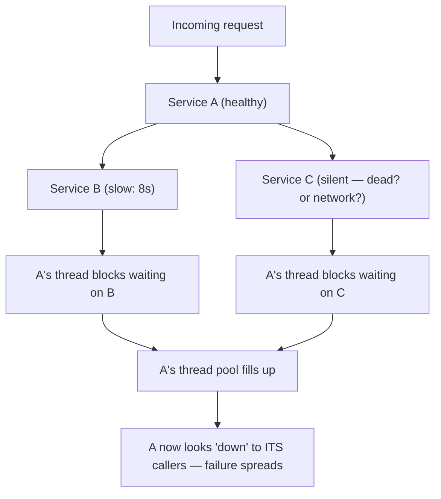
```mermaid
flowchart TD
    U["Incoming request"] --> A["Service A (healthy)"]
    A --> B["Service B (slow: 8s)"]
    A --> C["Service C (silent — dead? or network?)"]
    B --> R1["A's thread blocks waiting on B"]
    C --> R2["A's thread blocks waiting on C"]
    R1 --> X["A's thread pool fills up"]
    R2 --> X
    X --> Y["A now looks 'down' to ITS callers — failure spreads"]
```

The dangerous part is the last arrow: a partial failure **propagates**. Service B being slow isn't B's problem alone — it consumes A's threads, so A starts failing too. This is why the rest of this chapter (timeouts, bulkheads, circuit breakers) exists: to stop one slow corner from taking down the whole map.

### Trade-offs / the real lesson

You cannot make partial failure go away — it's inherent to having more than one machine. What you *can* do is contain it. The entire discipline of resilience engineering is: **assume any dependency can be slow or silent at any moment, and make sure that doesn't cascade.**

### Strong interview answer

> "The first thing I assume in a distributed design is partial failure: at any moment some dependency is healthy, some is slow, and some is unreachable — and I usually can't tell 'dead' from 'slow.' So I design every call to a dependency with a timeout and isolation, so one slow component can't consume all my threads and turn into a full outage."

### Remember this

> **In distributed systems, failure is partial and ambiguous — some parts break while others keep running, and you often can't tell "crashed" from "slow."**

---

# 2. CAP Theorem

### In plain English

CAP is a rule about what a distributed data system can promise **during a network partition** — that is, when nodes can't talk to each other. It says: while the network is split, you must choose between two things:

- **Consistency (C):** every read sees the latest write (all nodes agree).
- **Availability (A):** every request gets a (non-error) answer.

You cannot have both *while the partition is happening*. The **P** (Partition tolerance) is not really a choice — networks *will* partition, so a real distributed system must tolerate partitions. The genuine choice is: **when a partition happens, do you sacrifice C or A?**

### Why it matters

The single most common CAP mistake — the one that fails interviews — is saying *"pick two of three."* That framing is wrong and reveals you don't get it. P isn't optional. CAP is specifically the trade-off you're forced into **during** a partition. The rest of the time (no partition), you can have both C and A.

### A real-world analogy

Two bank branches share one account. Normally they sync over a phone line. One day the phone line goes dead (partition). A customer walks into Branch 1 wanting to withdraw the last $100.

- **Choose Consistency:** Branch 1 refuses — "I can't reach Branch 2 to confirm the balance, so I won't risk a double-withdrawal." The customer is turned away (**not available**), but the books never go wrong (**consistent**).
- **Choose Availability:** Branch 1 hands over the $100 without checking. The customer is served (**available**), but if Branch 2 *also* hands out $100, the account is overdrawn (**inconsistent**).

There is no third option that keeps both promises while the phone line is dead. That's CAP.

### What's actually happening

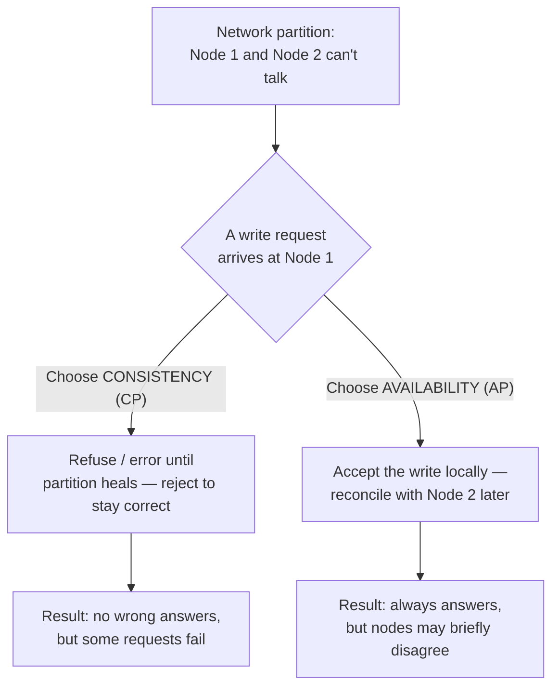
```mermaid
flowchart TD
    P["Network partition:<br/>Node 1 and Node 2 can't talk"] --> Q{"A write request<br/>arrives at Node 1"}
    Q -->|"Choose CONSISTENCY (CP)"| C1["Refuse / error until<br/>partition heals — reject to stay correct"]
    Q -->|"Choose AVAILABILITY (AP)"| A1["Accept the write locally —<br/>reconcile with Node 2 later"]
    C1 --> C2["Result: no wrong answers,<br/>but some requests fail"]
    A1 --> A2["Result: always answers,<br/>but nodes may briefly disagree"]
```

- **CP systems** (e.g. a system built on Raft, like etcd/ZooKeeper) refuse to serve if they can't reach a quorum. Correct, but can become unavailable.
- **AP systems** (e.g. Dynamo-style stores, Cassandra tuned for availability) keep answering from whichever node you reached, and reconcile conflicting versions afterward.

### Trade-offs / the real lesson

CAP is not a slogan; it's a **per-write, per-partition decision**. Mature systems don't pick one globally — they pick per operation. A "post a tweet" write can be AP (better to accept it and reconcile than to reject it). A "withdraw money" write should be CP (better to reject than to double-spend). The lesson: **know, for each operation, whether being wrong or being unavailable is the worse outcome.**

### Strong interview answer

> "CAP is about behavior *during a network partition*, not a general 'pick two.' Partitions will happen, so P is a given. The real question is: when nodes can't reach each other, does this operation reject to stay consistent (CP), or answer anyway and reconcile later (AP)? I decide per operation — payments lean CP, feed writes lean AP."

### Remember this

> **CAP = during a partition, choose Consistency (reject to stay correct) or Availability (answer and reconcile). Decide per operation, not globally.**

---

# 3. Quorum

### In plain English

A **quorum** is a "you need at least this many votes to act" rule for a group of replicas. Instead of needing *all* replicas to agree (fragile — one dead node blocks everything) or letting *any single* replica act alone (dangerous — leads to disagreement), you require a **majority**.

### Why it matters

Quorums are how a distributed system keeps making progress when some nodes are down, **without** letting two disconnected halves both act independently. They're the mathematical backbone of leader election, consistent reads/writes, and split-brain prevention.

### A real-world analogy

A board of directors can only make a binding decision if **a majority shows up** to vote. If 3 of 5 directors are in the room, they can act — the 2 who are stuck in traffic don't block the company. But here's the safety property: the 2 stragglers **cannot** form their own valid "board" and make conflicting decisions, because 2 is not a majority. Only one majority can exist at a time.

### What's actually happening

For `N` replicas, a majority quorum is `floor(N/2) + 1`.

```text
N = 3   →  majority = 2
N = 5   →  majority = 3
N = 7   →  majority = 4

If N = 3 and 1 replica fails:
  2 replicas remain  →  2 ≥ majority(2)  →  system can still act ✅

If N = 3 and 2 replicas fail:
  1 replica remains  →  1 < majority(2)  →  system refuses to act ❌
  (better to stop than to act alone and risk divergence)
```

The magic property: **two different majorities of the same group must overlap in at least one member.** That shared member prevents two conflicting decisions from both being "valid."

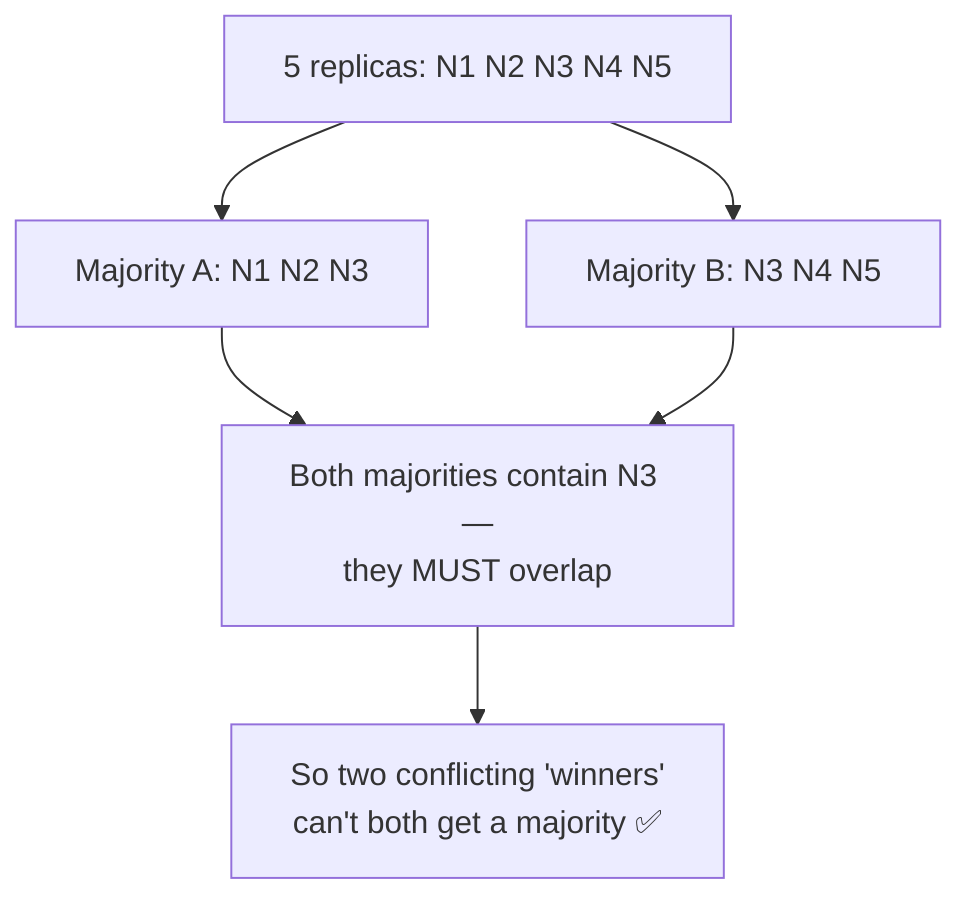
```mermaid
flowchart TD
    G["5 replicas: N1 N2 N3 N4 N5"] --> M1["Majority A: N1 N2 N3"]
    G --> M2["Majority B: N3 N4 N5"]
    M1 --> O["Both majorities contain N3 —<br/>they MUST overlap"]
    M2 --> O
    O --> S["So two conflicting 'winners'<br/>can't both get a majority ✅"]
```

For read/write quorums specifically, the classic rule is **W + R > N** (writes go to `W` replicas, reads consult `R` replicas; if their sum exceeds `N`, every read is guaranteed to touch at least one replica that saw the latest write).

### Trade-offs / the real lesson

Quorums buy fault tolerance and correctness, but cost **latency** (you wait for a majority, not the fastest node) and **availability under heavy loss** (lose a majority and the system halts on purpose). Bigger `N` tolerates more failures but makes every decision slower. The lesson: **majority overlap is what makes "keep going while some nodes are down" safe — and it's why an even-numbered cluster (like 2 or 4) is a bad idea (no clean majority, ties possible).**

### Strong interview answer

> "I use a majority quorum so the system keeps making progress while a minority of nodes is down, but can never let two disconnected groups both act. Any two majorities overlap by at least one node, so only one decision can win. For reads and writes I set W + R > N so reads always see the latest write. I always size clusters odd — 3 or 5 — to avoid tie situations."

### Remember this

> **A quorum is a majority vote. Any two majorities overlap, so only one side can win — that overlap is what makes progress-with-failures safe.**

---

# 4. Leader Election

### In plain English

Many distributed systems designate **one** node as the **leader** (a.k.a. primary/master). The leader is the single node allowed to make certain decisions — accept writes, hand out ordering, coordinate the others. Everyone else is a **follower**. **Leader election** is the process the nodes use to agree on who the leader is — and to pick a new one automatically when the leader dies.

### Why it matters

Having exactly one coordinator makes a lot of hard problems easy: there's no argument about ordering, no conflicting writes, one place to make decisions. But it introduces a new problem — *what happens when the leader dies?* — and a scarier one — *what if we accidentally end up with two leaders?* (that's split brain, next section). Leader election is the mechanism that must handle both.

### A real-world analogy

A team has one shift manager who assigns tasks. If the manager calls in sick, the team can't just all start giving orders — that's chaos. Instead they follow a rule: hold a quick vote, and whoever gets a majority becomes the new manager. Crucially, the rule must guarantee **exactly one** manager at a time, even during the confusing handover.

### What's actually happening

Normal operation — one leader, others follow:

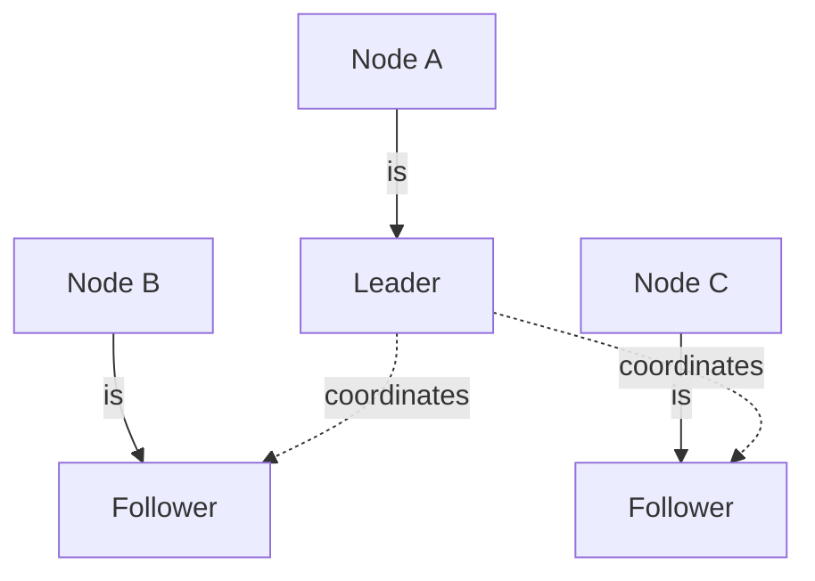
```mermaid
flowchart TD
    A["Node A"] -->|is| Leader["Leader"]
    B["Node B"] -->|is| F1["Follower"]
    C["Node C"] -->|is| F2["Follower"]
    Leader -.coordinates.-> F1
    Leader -.coordinates.-> F2
```

Leader dies, election runs:

```mermaid
flowchart TD
    A["Node A (leader) 💥 crashes"] --> D["Followers notice: no heartbeat<br/>from leader within timeout"]
    D --> E["Election starts:<br/>candidates ask for votes"]
    E --> V{"Does a candidate get<br/>a majority (quorum)?"}
    V -->|Yes| B["Node B becomes new leader,<br/>bumps the term number"]
    V -->|No (split vote)| E
```

The key ingredients (this is roughly how **Raft** works):

1. **Heartbeats** — the leader constantly signals "I'm alive." Missing heartbeats trigger an election.
2. **Terms / epochs** — each election increments a monotonically increasing number. A leader is only valid *for its term*; a higher term always wins. (This number is what powers fencing — section 6.)
3. **Majority vote** — a candidate becomes leader only with a **quorum** of votes, which guarantees at most one leader per term.

### Trade-offs / the real lesson

Single-leader designs are simpler and give you clean ordering, but the leader is a **bottleneck** (all writes funnel through it) and a **failover window** (there's a gap between the old leader dying and a new one being elected during which writes may pause). The lesson: **leader election's whole job is to guarantee "at most one leader," especially during the messy handover — and the tools that guarantee it are quorums and monotonic term numbers.**

### Strong interview answer

> "I use single-leader coordination when I want clean write ordering and one decision point. The leader sends heartbeats; if followers miss them, they run an election and a candidate needs a majority quorum to win, so we can never have two leaders in the same term. Each election bumps a term number, which also lets us fence off a stale old leader that comes back."

### Remember this

> **Leader election picks one coordinator and — via quorum votes plus ever-increasing term numbers — guarantees at most one leader, even during failover.**

---

# 5. Split Brain

### In plain English

**Split brain** is the nightmare that leader election exists to prevent: the situation where **two nodes both believe they're the leader at the same time**, and both start making authoritative decisions (like accepting writes). Because they can't see each other, their versions of reality drift apart, and you end up with two conflicting truths that are painful — sometimes impossible — to merge.

### Why it matters

Split brain silently corrupts data. Unlike a crash (loud, obvious), split brain looks like everything is working — both "leaders" happily accept writes. You only discover the damage later, when you try to reconcile and find the two halves disagree about the balance, the inventory count, or the order status. This is one of the worst failure modes in distributed systems.

### A real-world analogy

Two managers each think they're in charge of the same warehouse. The phone line between their offices goes down. Manager A tells the crew to ship all the inventory to Customer X. Manager B, unaware, tells the crew to ship the same inventory to Customer Y. Both gave "valid" orders. Now there isn't enough stock, the books are wrong, and there's no clean way to decide who was right. Two bosses, one warehouse, no communication = split brain.

### What's actually happening

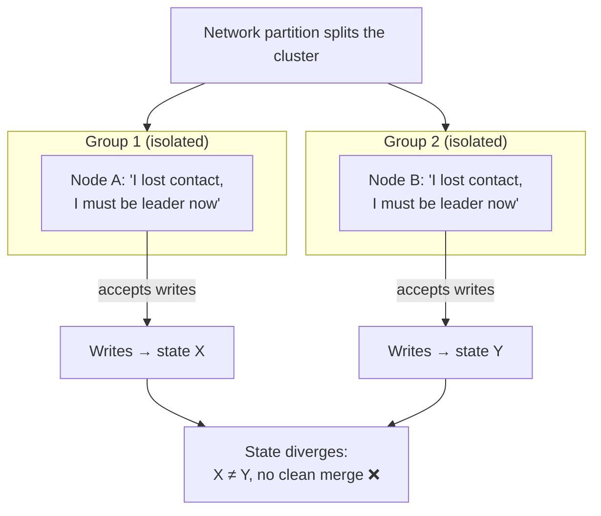
```mermaid
flowchart TD
    P["Network partition splits the cluster"] --> G1
    P --> G2
    subgraph G1["Group 1 (isolated)"]
      A["Node A: 'I lost contact,<br/>I must be leader now'"]
    end
    subgraph G2["Group 2 (isolated)"]
      B["Node B: 'I lost contact,<br/>I must be leader now'"]
    end
    A -->|accepts writes| W1["Writes → state X"]
    B -->|accepts writes| W2["Writes → state Y"]
    W1 --> DIV["State diverges:<br/>X ≠ Y, no clean merge ❌"]
    W2 --> DIV
```

How to **prevent** it:

- **Quorum:** a node may only act as leader if it can reach a **majority**. In a partition, only one side can hold a majority, so only one side gets a leader. The minority side steps down. (This is the primary defense.)
- **Fencing (next section):** even if a stale leader survives, it's blocked from writing to shared storage via epoch numbers.
- **Consensus algorithms** (Raft/Paxos): bake quorum + terms into the protocol so two leaders per term is provably impossible.
- **Epoch / term numbers:** monotonically increasing IDs that let storage reject the old leader.

### Trade-offs / the real lesson

The defense against split brain — requiring a quorum — means the **minority side goes unavailable on purpose**. That's the CAP trade in action: to avoid divergence (consistency), the isolated minority refuses to serve (sacrifices availability). The lesson: **you prevent two-leaders-at-once by requiring a majority to lead, which is exactly why a minority partition must shut itself down rather than "helpfully" keep serving.**

### Strong interview answer

> "Split brain is two nodes both acting as leader during a partition, causing divergent writes. I prevent it by requiring a quorum to be leader — in any partition only one side can hold a majority, so the minority side must step down and stop serving. I back that with fencing tokens so a stale leader that reconnects gets its writes rejected by storage. Accepting that the minority goes unavailable is the deliberate CAP trade to protect consistency."

### Remember this

> **Split brain = two leaders at once, writing divergent state. Prevent it by requiring a majority to lead (so the minority must stand down) plus fencing.**

---

# 6. Fencing

### In plain English

**Fencing** is a mechanism that **invalidates an old leader's authority** so that even if it's still alive and trying to act, its actions get rejected. It's the safety net for when quorum alone isn't enough — for example, a leader that was declared dead but is actually just slow, and wakes up mid-write.

The usual implementation is a **fencing token**: a number that only ever goes up. Every leader gets a token when elected; storage remembers the highest token it has seen and **rejects any request carrying a lower one**.

### Why it matters

There's a gap between "we declared the leader dead" and "the old leader realizes it's not the leader anymore." During that gap, the old leader might still send a write. Quorum elected a new leader, but nothing stops the *old* leader's in-flight write from hitting shared storage — unless something fences it out. Fencing closes that window.

### A real-world analogy

An employee is fired, but they still have their building keycard. Just declaring "you're fired" doesn't physically stop them from badging in. So security **revokes the old keycard in the system** — now when the ex-employee swipes, the door rejects them, even though the plastic card still exists. The fencing token is the keycard's ID; the door is the storage; "reject lower than the highest seen" is revocation.

### What's actually happening

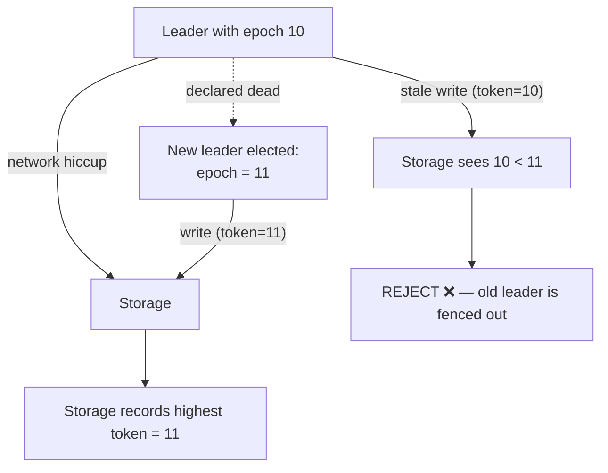
```mermaid
flowchart TD
    E1["Leader with epoch 10"] -->|network hiccup| S["Storage"]
    E1 -.declared dead.-> NEW["New leader elected:<br/>epoch = 11"]
    NEW -->|"write (token=11)"| S
    S --> H["Storage records highest token = 11"]
    E1 -->|"stale write (token=10)"| S2["Storage sees 10 < 11"]
    S2 --> REJ["REJECT ❌ — old leader is fenced out"]
```

Numeric example:

```text
Leader epoch = 10          # original leader gets token 10

network hiccup → new election
New leader epoch = 11      # storage now remembers "highest token = 11"

Old leader (still alive) tries to write with token = 10:
  storage sees 10 < 11  →  write REJECTED

New leader writes with token = 11:
  storage sees 11 ≥ 11  →  write ACCEPTED
```

The critical detail: the *storage/resource itself* must check the token. It's not enough for the old leader to "voluntarily" stand down — you assume it won't (it thinks it's still leader). The resource is the enforcement point.

### Trade-offs / the real lesson

Fencing requires the downstream resource to be **token-aware** — your database, lock service, or file store has to understand and enforce monotonic tokens. Not everything does; a dumb blob store that accepts any write can't be fenced, which is why distributed locks built on such stores are unsafe. The lesson: **quorum decides who *should* lead; fencing enforces it at the resource, because a stale leader won't cooperate on its own.**

### Strong interview answer

> "Fencing handles the stale-leader window: after a new leader is elected, the old one might still be alive and try to write. I give each leader a monotonically increasing fencing token (epoch), and the storage rejects any write carrying a token lower than the highest it has seen. The enforcement has to live in the resource, not the leader — you can't trust a stale leader to stand down voluntarily. It's the same idea as revoking an ex-employee's keycard."

### Remember this

> **Fencing = give each leader a monotonically increasing token; the resource rejects anything with an older token. It's revoking the old keycard so a stale leader can't write.**

---

# 7. Distributed Lock

### In plain English

A **distributed lock** lets multiple machines agree that **only one of them at a time** may do something — process job X, write to a file, run a nightly batch. It's a mutex, but across a network, where the participants don't share memory and can crash independently.

### Why it matters

Lots of tasks must not run twice concurrently: sending an invoice, charging a card, compacting a file. On one machine a normal lock suffices. Across machines, you need a shared lock — and naïve implementations are subtly, dangerously broken, because the network and crashes conspire against you.

### A real-world analogy

A single bathroom key at a café. Whoever holds the key uses the bathroom; everyone else waits. Now add distributed-systems reality: what if the person with the key **passes out inside** (process crash)? The key must eventually be reclaimable (a **lease/expiry**) or the bathroom is locked forever. And what if they **fell asleep, we gave the key to someone else, and then the first person woke up and walked out mid-use** thinking they still had it (stale owner)? That last case is exactly why locks need fencing.

### What's actually happening

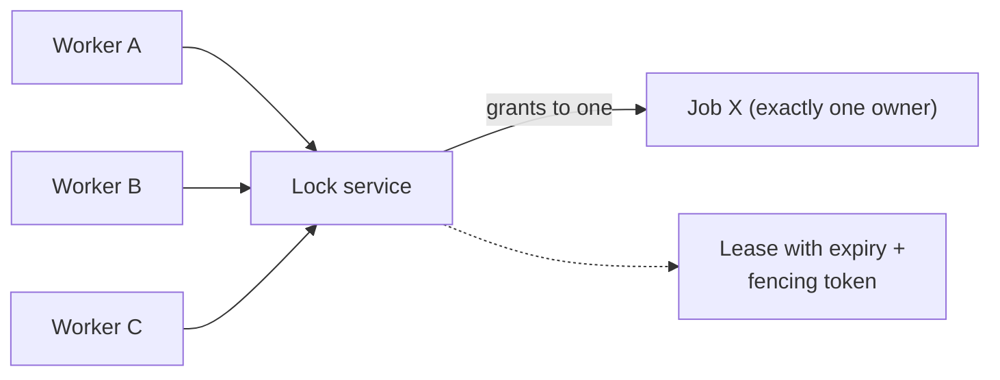
```mermaid
flowchart LR
    A["Worker A"] --> L["Lock service"]
    B["Worker B"] --> L
    C["Worker C"] --> L
    L -->|grants to one| J["Job X (exactly one owner)"]
    L -.-> T["Lease with expiry +<br/>fencing token"]
```

A **correct** distributed lock needs all of:

- **Ownership** — a clear record of who holds it.
- **Lease / expiry** — the lock auto-releases after a timeout, so a crashed holder doesn't block forever.
- **Safe release** — only the true owner can release it (or it releases itself on expiry), never a random caller.
- **Crash handling** — if the holder dies, the lease expires and someone else can proceed.
- **Fencing** — a monotonic token so a holder that *paused* (e.g. a long GC pause), lost its lease, and then resumed cannot corrupt shared state. The protected resource rejects the stale token.

The famous trap: a simple Redis `SETNX key value` (set-if-not-exists) gives you ownership and, with an expiry, a lease — but **no fencing**. If Worker A grabs the lock, freezes for 30 seconds (GC pause), its lease expires, Worker B grabs the lock and starts working, and *then* A wakes up believing it still holds the lock — now **both** act. `SETNX` alone cannot stop A's stale write. You need a fencing token that the downstream resource checks.

```text
t=0    A acquires lock (lease 30s), fencing token = 33
t=1    A freezes (GC pause)...
t=31   A's lease expires → B acquires lock, fencing token = 34
t=32   B starts writing with token 34
t=40   A wakes up, still thinks it holds the lock, writes with token 33
       → resource sees 33 < 34 → A's write REJECTED ✅ (fencing saved you)
```

### Trade-offs / the real lesson

A distributed lock trades throughput (only one worker proceeds) for safety (no double-processing). But the deeper lesson is that **the lock alone is not enough** — because of pauses and clock issues, the *resource* being protected must participate via fencing. If the resource can't check a fencing token, your lock is "mostly works," which in distributed systems means "corrupts data occasionally." The lesson: **`SETNX` is a lock primitive, not a complete distributed-lock design; correctness requires lease + safe release + fencing enforced at the resource.**

### Strong interview answer

> "A distributed lock needs more than 'set a key if absent.' I need ownership, a lease so a crashed holder doesn't block forever, safe release by the true owner only, and — crucially — fencing tokens. The classic failure is a holder that GC-pauses past its lease: someone else grabs the lock, then the original wakes up and both write. Only a monotonic fencing token checked *by the protected resource* stops that. `SETNX` gives ownership and lease but no fencing, so by itself it's unsafe for anything that must truly run once."

### Remember this

> **A distributed lock needs ownership + lease + safe release + fencing. `SETNX` alone isn't enough — a paused holder can wake up stale, and only a fencing token checked at the resource saves you.**

---

# 8. Clock Skew

### In plain English

Every machine has its own clock, and those clocks **do not agree**. They drift apart, get corrected by NTP in little jumps, and can even move *backwards*. So a timestamp from Server A and a timestamp from Server B are **not directly comparable** — "later timestamp" does not reliably mean "happened later."

### Why it matters

It's tempting to order events across machines by their wall-clock timestamps: "this write has a newer timestamp, so it's the latest, keep it." That logic is quietly broken by clock skew and can drop the *actually*-newer write, expire tokens early or late, or release leases at the wrong time. Time is one of the most underestimated hazards in distributed systems (DDIA devotes a whole chapter to it).

### A real-world analogy

Two witnesses to an accident, each glancing at their own wristwatch. One watch runs 3 minutes fast, the other 2 minutes slow. If you order the events purely by "whose watch showed the earlier time," you can easily conclude the wrong car went first — even though each witness was honestly reporting their own watch. The watches disagree, so their times aren't comparable. That's clock skew.

### What's actually happening

```text
At the same true instant:
  Server A clock = 10:00:00.100
  Server B clock = 09:59:59.900

Difference = 200 ms of skew.

Event that truly happened FIRST, on B:   timestamped 09:59:59.900
Event that truly happened SECOND, on A:  timestamped 10:00:00.100
  → here they happen to sort correctly, but flip the skew and they'd sort WRONG.
```

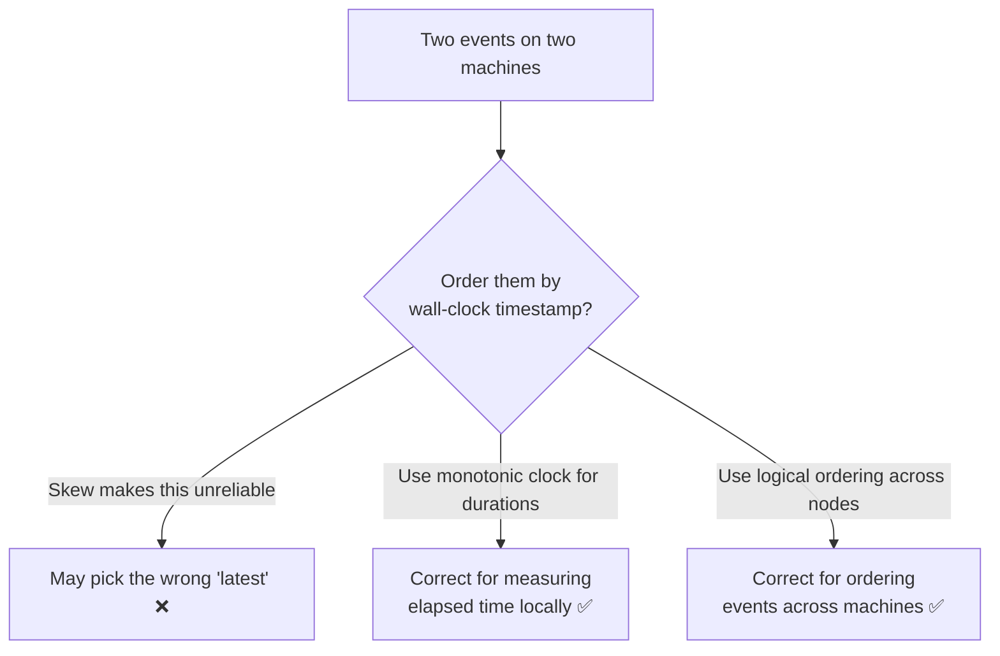
```mermaid
flowchart TD
    W["Two events on two machines"] --> C{"Order them by<br/>wall-clock timestamp?"}
    C -->|"Skew makes this unreliable"| BAD["May pick the wrong 'latest' ❌"]
    C -->|"Use monotonic clock for durations"| OK1["Correct for measuring<br/>elapsed time locally ✅"]
    C -->|"Use logical ordering across nodes"| OK2["Correct for ordering<br/>events across machines ✅"]
```

Where skew bites in practice:

- **Token / lease expiry** — "expires at 10:00" means different things on different machines.
- **Event ordering** — "last write wins" by timestamp can drop the real winner.
- **Distributed transactions** — coordination that trusts synchronized clocks can violate correctness.

Two kinds of clock, and using the right one matters:
- **Wall-clock time** (`System.currentTimeMillis`) — can jump forwards/backwards; only meaningful as a rough human timestamp, never for ordering or duration across machines.
- **Monotonic clock** (`System.nanoTime`) — only ever moves forward, but is meaningful **only within one machine**. Use it to measure *durations* locally (e.g. "did this take longer than my timeout?").

### Trade-offs / the real lesson

You *can* get tightly synchronized clocks (Google's Spanner uses atomic clocks + GPS and "TrueTime" with explicit uncertainty bounds), but that's expensive, special hardware. For everyone else, the lesson is: **don't order cross-machine events by wall-clock timestamps. Use monotonic clocks for local durations, and logical ordering (next section) for cross-machine ordering.**

### Strong interview answer

> "I never order events across machines by wall-clock timestamps — clocks skew, drift, and can jump backwards, so a newer timestamp doesn't reliably mean a later event, and 'last-write-wins by timestamp' can drop the real winner. For measuring durations locally I use a monotonic clock. For ordering events across nodes I use logical ordering — version numbers, Lamport, or vector clocks — not physical time."

### Remember this

> **Clocks on different machines disagree. Don't order cross-machine events by wall-clock time; use monotonic clocks for local durations and logical ordering across machines.**

---

# 9. Logical Ordering

### In plain English

Since physical clocks can't reliably order events across machines, we use **logical ordering** instead: numbers that capture *sequence* or *causality* rather than time-of-day. The simplest is a plain **version number** that increments on each change. Fancier schemes (Lamport clocks, vector clocks) let you reason about causality even without a single leader.

### Why it matters

Networks reorder and delay messages. A write made *after* another can arrive *before* it. If you apply updates in arrival order, you can overwrite new data with old data. Logical ordering lets the receiver say "this update is older than what I already have — ignore it," regardless of when it showed up.

### A real-world analogy

Legal contracts don't say "the version from 3:42pm wins" (whose clock?). They say **"Amendment No. 11 supersedes Amendment No. 10."** The version *number* establishes order unambiguously, no matter when each copy physically arrives in your mailbox. If Amendment No. 9 shows up late, you simply ignore it — you already have No. 11.

### What's actually happening

The everyday, good-enough tool: a monotonically increasing **version per entity**.

```text
Order #555:
  version 10  (status = PACKED)
  version 11  (status = SHIPPED)   ← current

A delayed update arrives carrying version 9 (status = PENDING):
  9 < 11  →  REJECT it (it's stale) ✅

An update arrives carrying version 12:
  12 > 11 →  ACCEPT and advance ✅
```

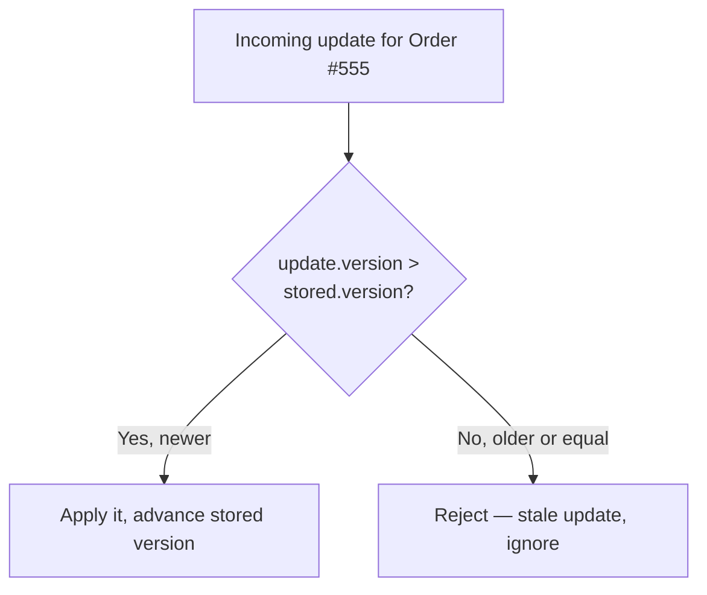
```mermaid
flowchart TD
    U["Incoming update for Order #555"] --> C{"update.version ><br/>stored.version?"}
    C -->|Yes, newer| A["Apply it, advance stored version"]
    C -->|No, older or equal| R["Reject — stale update, ignore"]
```

When a single version counter isn't enough:
- **Sequence numbers** — a leader stamps each event with an ever-increasing number, giving a total order.
- **Lamport clocks** — a scalar that guarantees "if A caused B, then A's number < B's number" (though equal-ish numbers don't imply causality).
- **Vector clocks** — one counter per node; can detect *concurrent* (conflicting) updates that need merging, not just ordering. Used by Dynamo-style stores to flag conflicts.

For most business systems, a per-entity version is enough and vastly simpler — reach for vector clocks only when you truly need to detect concurrent conflicting writes.

### Trade-offs / the real lesson

Simple version numbers are cheap and easy but only order changes to *one* entity, and (in a multi-writer setup) need a leader or coordination to assign them. Vector clocks handle leaderless concurrency and detect conflicts, but they're heavier and the conflicts still need application logic to resolve. The lesson: **order events by logical version, not by time — and pick the lightest scheme that captures the ordering you actually need.**

### Strong interview answer

> "To order events across machines I use logical ordering, not timestamps. The pragmatic default is a monotonically increasing version per entity: if an incoming update's version is lower than what I've stored, it's stale and I drop it — this makes updates idempotent and reorder-safe. If I need to detect concurrent conflicting writes in a leaderless system, I'd use vector clocks, but for most business systems a per-entity version is enough."

### Remember this

> **Order events by logical version numbers, not clocks. If an update's version is older than what you have, drop it. Reach for vector clocks only when you must detect concurrent conflicts.**

---

# 10. Failure Detection

### In plain English

In a distributed system you can never be *certain* whether another node has crashed — you can only **suspect** it, based on the fact that you haven't heard from it lately. "No response" has many possible causes, and from the outside they look identical. So failure detection is fundamentally about **timeouts and educated guessing**, not certainty.

### Why it matters

Everything downstream depends on this: leader election triggers when we *suspect* the leader died; a request retries when we *suspect* it was lost. But suspicion can be wrong — the node might be fine, just slow or briefly unreachable. If your detector is too trigger-happy, you'll needlessly fail over healthy nodes (and risk split brain). Too slow, and you sit on a dead node. This ambiguity is the root cause of why we need retries, idempotency, and reconciliation.

### A real-world analogy

You text a friend and get no reply for an hour. Did their phone die? Are they ignoring you? Did the text fail to send? Are they just driving? You genuinely cannot tell from the silence alone. You *guess* based on how long it's been and what you know about them. Distributed failure detection is exactly this: interpreting silence, never knowing for sure.

### What's actually happening

```text
Node A sends a request to Node B.
A receives: (nothing)

"No response" could mean ANY of:
  • B crashed
  • the network dropped the request
  • the network dropped the reply
  • B is overloaded and slow
  • a packet is merely delayed and will arrive soon
```

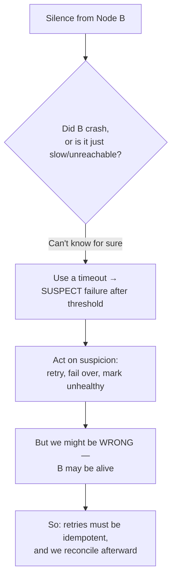
```mermaid
flowchart TD
    S["Silence from Node B"] --> Q{"Did B crash,<br/>or is it just slow/unreachable?"}
    Q -->|"Can't know for sure"| T["Use a timeout →<br/>SUSPECT failure after threshold"]
    T --> R1["Act on suspicion:<br/>retry, fail over, mark unhealthy"]
    R1 --> W["But we might be WRONG —<br/>B may be alive"]
    W --> D["So: retries must be idempotent,<br/>and we reconcile afterward"]
```

Practical detectors:
- **Heartbeats / timeouts** — expect a signal every N seconds; missing K in a row ⇒ suspect dead. Simple but must be tuned.
- **Phi-accrual detectors** — instead of a hard yes/no, output a *suspicion level* that rises with silence, adapting to observed network variance. Used by Cassandra/Akka.

### Trade-offs / the real lesson

Tuning the timeout is a genuine trade-off: **aggressive** (short timeout) detects real failures fast but causes false positives — declaring healthy-but-slow nodes dead, triggering needless failovers and split-brain risk. **Conservative** (long timeout) avoids false alarms but leaves you stuck on genuinely dead nodes longer. There's no perfect value. The lesson: **because you can only ever *suspect* failure — never confirm it — every action you take on that suspicion (retry, failover) must be safe to be wrong about, which is why idempotency and reconciliation are non-negotiable.**

### Strong interview answer

> "You can't distinguish 'crashed' from 'slow' from 'network dropped it' — from the outside they're identical silence. So failure detection is timeout-based suspicion, not certainty. That has two consequences: I tune timeouts to balance fast detection against false positives that cause needless failovers, and — because any action on a false suspicion (a retry, a failover) may be wrong — I make operations idempotent and reconcile afterward. Adaptive detectors like phi-accrual help by outputting a suspicion level instead of a hard flip."

### Remember this

> **You can only suspect failure (via timeouts), never confirm it. Because suspicion can be wrong, every retry and failover must be safe to be wrong about — hence idempotency and reconciliation.**

---

# 11. Exactly-Once Is Hard

### In plain English

"Process this exactly once" sounds like a basic ask. In a distributed system, it's nearly impossible to guarantee at the messaging layer. The reason is the ambiguity from the last section: when a response is lost, the sender **cannot tell** whether the operation succeeded or not — so it must choose between *maybe never* (don't retry) and *maybe twice* (retry). What you actually build is **effectively-once**: at-least-once delivery plus **idempotency** so duplicates are harmless.

### Why it matters

Retries are everywhere (they're how you survive the partial failures and lost responses above). But every retry risks doing the work twice — double-charging a card, sending two emails, shipping two orders. If you don't design for duplicates, retries *become* your bug. "Exactly-once" is the single most misunderstood guarantee in distributed systems.

### A real-world analogy

You order a coffee online, the payment page hangs, and you never see a confirmation. Did it go through? You genuinely don't know. If you click "Pay" again, you might get charged twice. The fix isn't to somehow make the network perfect — it's for the shop to notice **"this is the same order number I already processed"** and not charge you again. That order number is an **idempotency key**.

### What's actually happening

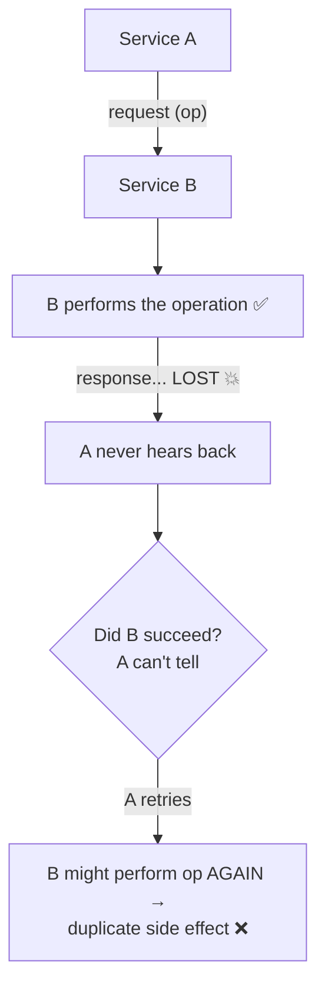
```mermaid
flowchart TD
    A["Service A"] -->|"request (op)"| B["Service B"]
    B --> DO["B performs the operation ✅"]
    DO -->|"response... LOST 💥"| A2["A never hears back"]
    A2 --> Q{"Did B succeed?<br/>A can't tell"}
    Q -->|"A retries"| DUP["B might perform op AGAIN →<br/>duplicate side effect ❌"]
```

The fix — make the operation **idempotent** so a duplicate is a no-op:

```text
IDEMPOTENCY KEY   →  client sends a unique key with each logical operation
       +
DEDUPLICATION     →  B records processed keys; a repeat key returns the
                      stored result instead of doing the work again
       +
STATE MACHINE     →  the entity only allows valid transitions
                      (e.g. PENDING → PAID, but PAID → PAID is a no-op)
```

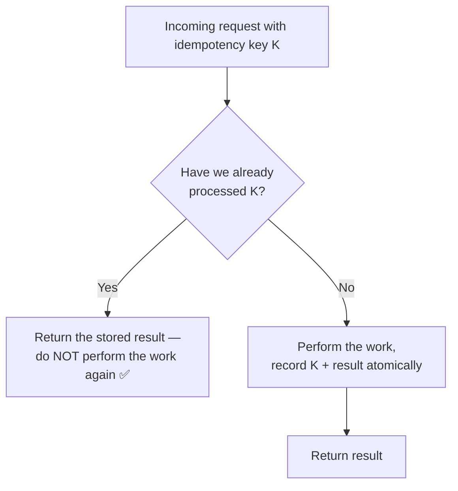
```mermaid
flowchart TD
    R["Incoming request with idempotency key K"] --> C{"Have we already<br/>processed K?"}
    C -->|Yes| RET["Return the stored result —<br/>do NOT perform the work again ✅"]
    C -->|No| P["Perform the work,<br/>record K + result atomically"]
    P --> RET2["Return result"]
```

### Trade-offs / the real lesson

The costs of effectively-once are real: you must **store dedup keys** (with a retention window and cleanup) and make every side-effecting operation idempotent, which takes design effort. But the alternative — trusting the network to deliver exactly once — doesn't exist. The lesson: **you can't get exactly-once *delivery*; you get at-least-once delivery plus idempotency, which yields exactly-once *effect*. Idempotency is the price of retrying safely, and retrying is unavoidable.**

### Strong interview answer

> "True exactly-once delivery is basically impossible, because when a response is lost the sender can't tell success from failure, so it must either risk never (no retry) or risk twice (retry). I design for at-least-once delivery plus idempotency: the client sends an idempotency key, the server deduplicates on it and stores the result, and the entity is a state machine so replays are no-ops. That gives exactly-once *effect*, which is what the business actually cares about."

### Remember this

> **Exactly-once delivery is a myth. Use at-least-once + idempotency keys + dedup to get exactly-once *effect*. Idempotency is what makes retrying safe.**

---

# 12. Multi-Region Architecture

### In plain English

A **multi-region** system runs in more than one geographic data center (e.g. one in the US, one in Europe). You do this to survive an entire region going down, to serve users closer to home (lower latency), and to meet data-residency laws. The catch: the regions are far apart, so keeping their data in sync is slow and full of consistency puzzles.

### Why it matters

A single region is a single point of failure — a fire, a power outage, a fiber cut, and your whole service is gone. Multi-region is how you survive that. But spanning regions turns every hard problem in this chapter (partitions, consistency, conflicts, failover) into a *bigger* problem, because now the "network between nodes" is an ocean with 100+ ms of latency.

### A real-world analogy

A company opens a second headquarters on another continent so the business survives if one city has a disaster. Great for resilience — but now the two offices must agree on shared records (budgets, inventory) across a 9-hour time difference and a laggy connection. Do both offices get to make binding decisions (active-active, fast but risks conflicts), or does one office lead and the other stand ready (active-passive, simpler but slower failover)? That org decision is exactly the multi-region decision.

### What's actually happening

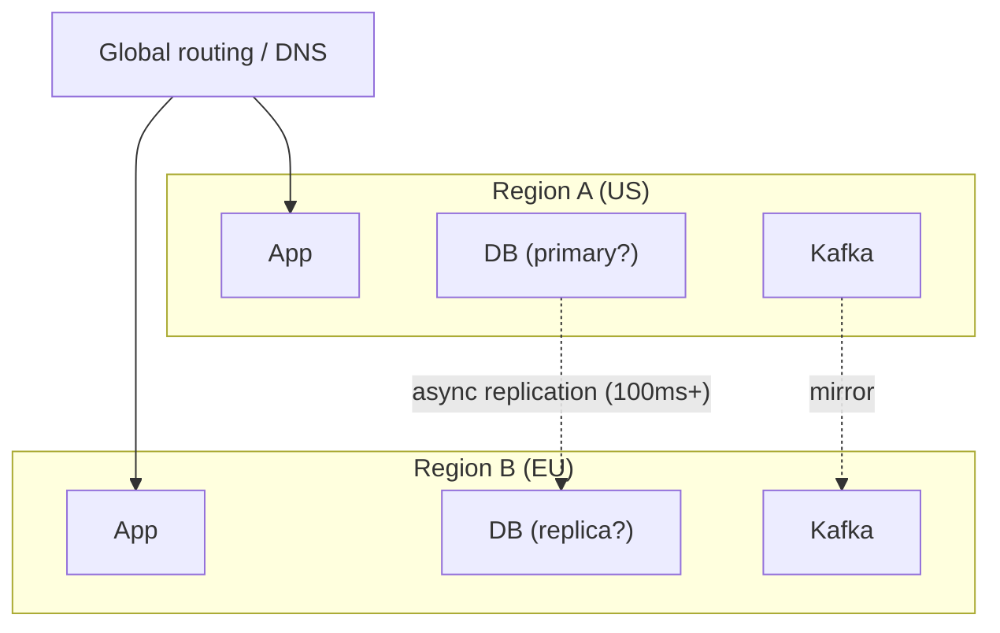
```mermaid
flowchart TD
    subgraph RA["Region A (US)"]
      A1["App"]
      A2["DB (primary?)"]
      A3["Kafka"]
    end
    subgraph RB["Region B (EU)"]
      B1["App"]
      B2["DB (replica?)"]
      B3["Kafka"]
    end
    A2 -.async replication (100ms+).-> B2
    A3 -.mirror.-> B3
    DNS["Global routing / DNS"] --> A1
    DNS --> B1
```

The decisions you must make (say these in an interview):

- **Active-active or active-passive?** Both regions serve writes (fast, but conflict resolution needed) vs. one serves, one stands by (simpler, but failover has a gap).
- **Where's the source of truth?** One region authoritative, or shared ownership?
- **How is replication done?** Synchronous (consistent but slow, and a remote outage stalls you) vs. asynchronous (fast, but you can lose the un-replicated tail on failover).
- **RPO / RTO?** How much data can you lose, how fast must you recover (next section).
- **Conflict resolution?** In active-active, two regions may edit the same record — last-write-wins? CRDTs? application merge?
- **Failover?** Automatic or manual? How do you avoid split brain across regions?
- **Client discovery?** How do clients find the healthy region — DNS failover, anycast, global load balancer?

### Trade-offs / the real lesson

Multi-region trades **availability and latency (gains)** for **consistency and operational complexity (costs)**. Synchronous cross-region replication gives you strong consistency but pays the ocean's latency on every write and stalls if the far region is down. Asynchronous replication is fast but means failover can lose recent writes and active-active can create conflicts. The lesson: **multi-region buys survival-of-a-region and lower latency, but every write now confronts CAP across an ocean — so choose active-active vs active-passive and sync vs async based on how much inconsistency (or how much latency) each operation can tolerate.**

### Strong interview answer

> "Multi-region gives me regional fault tolerance, lower latency for global users, and data-residency compliance — at the cost of consistency and operational complexity, because the link between regions is high-latency and can partition. The core decisions are active-active vs active-passive, sync vs async replication, where the source of truth lives, conflict resolution, and how clients discover the healthy region. I pick per workload: async active-passive for most systems (simple, cheap), reserving active-active or synchronous replication for cases that truly need it, accepting the conflict-resolution and latency cost."

### Remember this

> **Multi-region buys you regional fault tolerance and low latency but pays in consistency and complexity. The key choices: active-active vs passive, sync vs async replication, and how you route clients to a healthy region.**

---

# 13. RPO and RTO

### In plain English

These are the two numbers that define your disaster-recovery goals:

- **RPO — Recovery Point Objective:** *how much data* you can afford to lose, measured in time. "RPO = 5 minutes" means after a disaster you might lose up to the last 5 minutes of data.
- **RTO — Recovery Time Objective:** *how long* you can be down before you must be back. "RTO = 30 minutes" means you must restore service within 30 minutes.

RPO is about **data loss**; RTO is about **downtime**. They're different questions and often have different answers.

### Why it matters

You can't design a backup, replication, or failover strategy without these numbers — they're the *requirements*. An RPO of "zero" forces synchronous replication (expensive, slow). An RPO of "1 hour" lets you get away with hourly backups (cheap). The whole DR budget flows from these two targets, which are ultimately **business decisions**, not technical ones.

### A real-world analogy

Think of saving a document you're writing.

- **RPO** = how often you hit Save. If you save every 5 minutes, a crash loses at most 5 minutes of typing. Save every second (autosave), and you lose almost nothing — but it costs more (constant disk writes).
- **RTO** = how long it takes to reboot the machine and reopen the document and get back to work after the crash.

You lost *some work* (RPO) and *some time* (RTO), and they're separate measures of the same crash.

### What's actually happening

```text
RPO — Recovery Point Objective (tolerable data loss)
  RPO = 5 minutes  →  at worst, lose ~5 min of data
  RPO = 0          →  lose nothing → requires synchronous replication (costly)

RTO — Recovery Time Objective (tolerable downtime)
  RTO = 30 minutes →  must be back within ~30 min
  RTO = seconds    →  requires hot standby / automatic failover (costly)
```

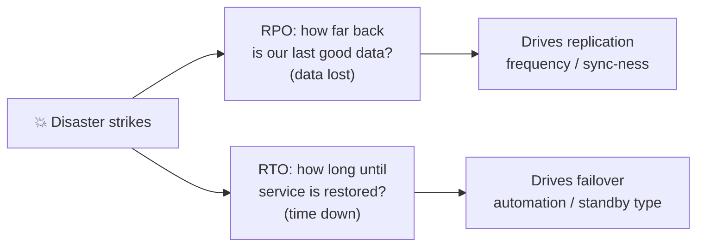
```mermaid
flowchart LR
    D["💥 Disaster strikes"] --> P["RPO: how far back<br/>is our last good data?<br/>(data lost)"]
    D --> R["RTO: how long until<br/>service is restored?<br/>(time down)"]
    P --> S1["Drives replication<br/>frequency / sync-ness"]
    R --> S2["Drives failover<br/>automation / standby type"]
```

How the targets map to mechanisms:

| Target | Tight (near-zero) needs | Loose needs |
|---|---|---|
| **RPO** | Synchronous replication / continuous backup | Periodic (hourly/daily) backups |
| **RTO** | Hot standby, automatic failover | Restore-from-backup, manual failover |

### Trade-offs / the real lesson

Tighter RPO/RTO costs more money — a lot more, non-linearly. RPO=0 with RTO=seconds means running a fully synchronized hot standby (roughly double the infrastructure) plus automated failover you actually trust. Most systems don't need that everywhere. The lesson: **RPO and RTO are business trade-offs (cost of protection vs. cost of loss), and you should set them per system — your payment ledger and your recommendation cache do not deserve the same numbers.**

### Strong interview answer

> "RPO is how much data I can lose (drives replication frequency and whether it's synchronous); RTO is how long I can be down (drives failover automation and whether I keep a hot standby). They're separate — data loss vs. downtime — and both are business decisions balancing the cost of protection against the cost of the loss. I set them per system: near-zero for a financial ledger, generous for a rebuildable cache."

### Remember this

> **RPO = tolerable data loss (drives replication); RTO = tolerable downtime (drives failover). Different questions; both are business cost trade-offs set per system.**

---

# 14. Disaster Recovery

### In plain English

**Disaster recovery (DR)** is the complete plan and set of mechanisms for bringing a system back after a catastrophe — a region loss, data corruption, an accidental mass-delete, ransomware. It's much more than "we have backups." A real DR plan covers backups *plus* replication *plus* independent storage *plus* tested restores *plus* the human runbooks to execute under pressure.

### Why it matters

The day you need DR, you *really* need it, and there's no time to improvise. Many teams *think* they have DR because data is replicated — then discover replication faithfully copied the corruption or the `DELETE` to every replica, and there's no clean copy to restore from. Untested backups are a coin flip. DR is the difference between "we lost an hour" and "we lost the company."

### A real-world analogy

Fire safety for a building. It's not just having a fire extinguisher (a backup). It's: extinguishers *and* sprinklers (multiple layers), an off-site copy of critical documents (independent storage), *and* fire drills so people know the exits under stress (tested runbooks). A building with an extinguisher nobody's checked in five years and no evacuation plan is not "fire-safe" — it just feels that way until the fire.

### What's actually happening

A robust DR plan combines:

```text
Backups            +   point-in-time copies you can restore from
Replication        +   live copies for fast failover
Independent storage +  a copy NOT in the same failure domain
                       (different region/account/provider)
Cross-region copy  +   survives a whole-region loss
Restore testing    +   PROVE the backups actually restore (regularly!)
Runbooks           +   step-by-step recovery instructions for humans
Monitoring         +   detect the disaster and verify recovery
```

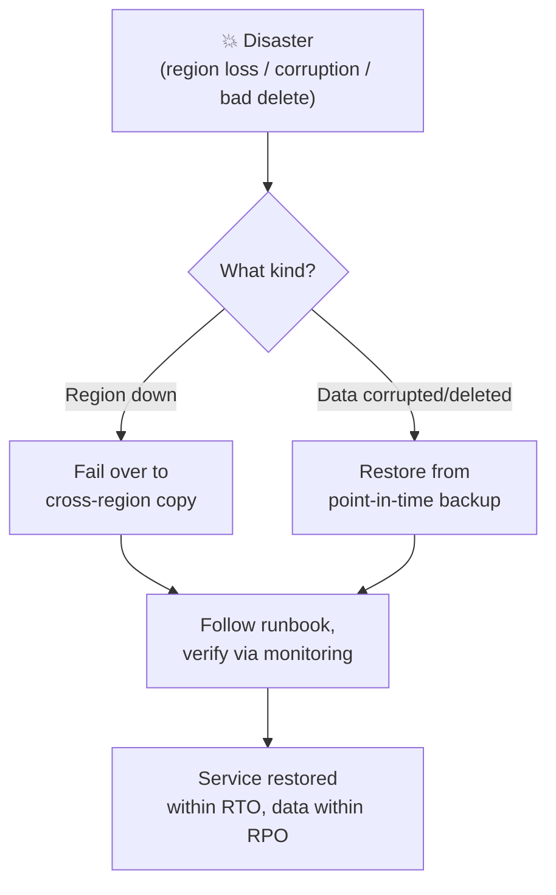
```mermaid
flowchart TD
    DIS["💥 Disaster<br/>(region loss / corruption / bad delete)"] --> T{"What kind?"}
    T -->|"Region down"| FO["Fail over to<br/>cross-region copy"]
    T -->|"Data corrupted/deleted"| RB["Restore from<br/>point-in-time backup"]
    FO --> RUN["Follow runbook,<br/>verify via monitoring"]
    RB --> RUN
    RUN --> OK["Service restored<br/>within RTO, data within RPO"]
```

The single most important DR principle: **replication is not a backup.** Replication copies *everything instantly* — including the corruption, the buggy migration, and the accidental `DELETE FROM users`. To recover from those you need a *point-in-time* backup (a copy from *before* the bad event) that lives in an independent failure domain. And a backup you've never test-restored is not a backup — it's a hope.

### Trade-offs / the real lesson

DR costs money and ongoing discipline (regular restore drills, maintained runbooks) for an event that may never come — which is exactly why it gets neglected. The trade-off is paying a steady insurance premium against a rare catastrophic loss. The lesson: **replication protects against a node/region *dying*; only independent, tested, point-in-time backups protect against data being *wrong* (corruption, bad deploys, human error) — you need both, and untested backups don't count.**

### Strong interview answer

> "DR is more than backups. I combine live replication for fast failover with point-in-time backups in an *independent* failure domain, because replication faithfully copies corruption and bad deletes — it protects against a region dying, not against data being wrong. Both live behind explicit RPO/RTO targets, I keep runbooks so recovery isn't improvised at 3am, and — most importantly — I *test restores regularly*, because an untested backup is just a hope."

### Remember this

> **Replication is not a backup — it copies corruption too. Real DR = replication (for failover) + independent, point-in-time, *tested* backups (for corruption) + runbooks, all sized to your RPO/RTO.**

---

# 15. Graceful Degradation

### In plain English

**Graceful degradation** means: when a dependency fails, the system **loses a feature, not the whole service.** Instead of the entire page erroring because the recommendations service is down, you show the page *without* recommendations. The critical path keeps working; the nice-to-haves quietly drop off.

### Why it matters

Not every dependency is equally important, but naïve code treats them all the same — one failed call and the whole request 500s. Graceful degradation is how you keep the money-making core path alive while a non-essential corner is broken. It's the difference between "checkout is down" (disaster) and "the 'you might also like' widget is missing" (nobody notices).

### A real-world analogy

A car with a dead radio. You don't refuse to drive because the entertainment system failed — you drive anyway; you've just lost a non-essential feature. But if the *brakes* fail, that's the critical path, and you stop. Graceful degradation is knowing which of your features are "the radio" (drop them, keep going) and which are "the brakes" (must work, or fail hard/safely).

### What's actually happening

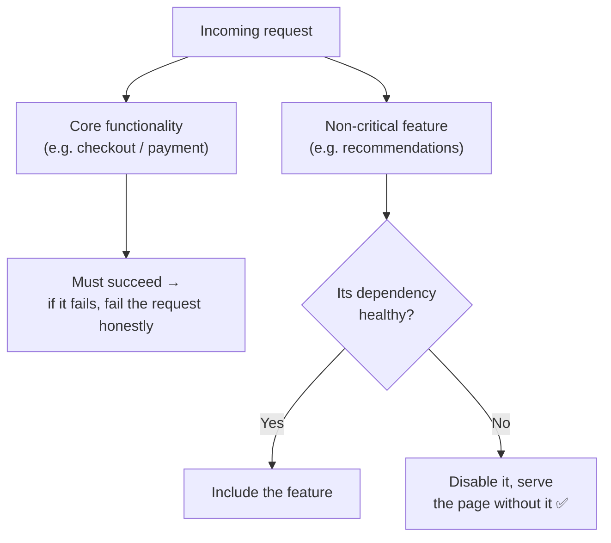
```mermaid
flowchart TD
    REQ["Incoming request"] --> CORE["Core functionality<br/>(e.g. checkout / payment)"]
    REQ --> NC["Non-critical feature<br/>(e.g. recommendations)"]
    CORE --> CONT["Must succeed →<br/>if it fails, fail the request honestly"]
    NC --> DEP{"Its dependency<br/>healthy?"}
    DEP -->|Yes| SHOW["Include the feature"]
    DEP -->|No| SKIP["Disable it, serve<br/>the page without it ✅"]
```

Classifying dependencies is the design act:

```text
Payment          = REQUIRED    → part of the critical path; failure = fail the request
Recommendations  = OPTIONAL    → on failure, omit the widget, keep serving
Analytics        = ASYNC       → fire-and-forget; never block the user on it
```

Common patterns that implement it:
- **Fallbacks** — serve a default/cached value when the live source is down (e.g. cached recommendations, or none).
- **Feature flags / kill switches** — turn off an expensive or failing feature under load.
- **Async offloading** — move non-critical work (analytics, emails) off the request path so it can't slow or fail the user's request.

### Trade-offs / the real lesson

Graceful degradation costs upfront design — you must classify every dependency as critical/optional/async and write the fallback path for each. The payoff is that partial failures become partial (feature) outages instead of total ones. The lesson: **decide *before* the incident which features are the radio and which are the brakes, and build each optional dependency to fail into a fallback rather than into a 500.**

### Strong interview answer

> "I classify every dependency as critical, optional, or async. Critical ones (payment, auth) are on the path and, if they fail, I fail the request honestly. Optional ones (recommendations) degrade gracefully — on failure I serve a cached default or omit the widget, never 500 the whole page. Async work (analytics, emails) I move off the request path entirely so it can't slow or fail the user. The point is to turn a dependency failure into a lost feature, not a lost service."

### Remember this

> **Graceful degradation = lose a feature, not the service. Classify dependencies as critical/optional/async up front, and make optional ones fall back instead of failing the whole request.**

---

# 16. Senior System-Design Thinking (the checklist)

### In plain English

This is the mental checklist a senior engineer runs over **every single component** in a design. For each box on your diagram, you don't just ask "what does it do?" — you ask "what does it do when things go wrong?" Seven questions, applied to every component, catch the failure modes juniors miss.

### Why it matters

The gap between a junior and a senior design isn't the happy-path diagram — those look identical. It's that the senior has already asked "what if this is slow?" and "what if this request arrives twice?" for every box, and has an answer. This checklist is how you manufacture that instinct until it's automatic.

### A real-world analogy

A pilot's pre-flight checklist. The plane looks fine sitting on the tarmac — but the pilot mechanically goes through "flaps? fuel? instruments? hydraulics?" for every system, because the whole point is to catch the problem *before* you're in the air. This is your pre-flight checklist for each component before it's in production.

### What's actually happening

For every component, ask these seven questions:

```text
1. FAILURE           What if it crashes entirely?
2. SLOW              What if it becomes 10× slower (but doesn't die)?
3. DUPLICATE         What if a request/event arrives twice?
4. LOST RESPONSE     What if the operation succeeds but the response is lost?
5. NETWORK PARTITION What if A simply cannot reach B?
6. OVERLOAD          What if traffic suddenly becomes 10×?
7. RECOVERY          What happens when the failed component comes back?
```

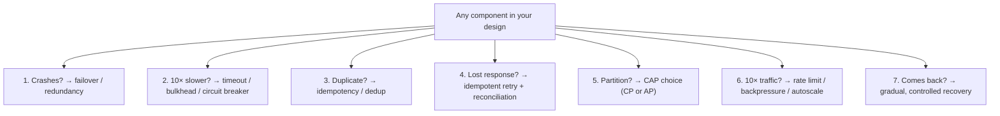
```mermaid
flowchart TD
    COMP["Any component in your design"] --> Q1["1. Crashes? → failover / redundancy"]
    COMP --> Q2["2. 10× slower? → timeout / bulkhead / circuit breaker"]
    COMP --> Q3["3. Duplicate? → idempotency / dedup"]
    COMP --> Q4["4. Lost response? → idempotent retry + reconciliation"]
    COMP --> Q5["5. Partition? → CAP choice (CP or AP)"]
    COMP --> Q6["6. 10× traffic? → rate limit / backpressure / autoscale"]
    COMP --> Q7["7. Comes back? → gradual, controlled recovery"]
```

Notice how each question maps directly to a tool from this chapter and Tiers 1–5: slow→timeout, duplicate→idempotency, partition→CAP, recovery→controlled ramp-up.

### Trade-offs / the real lesson

You can't over-engineer every component for all seven — that's paralysis and wasted cost. The skill is judgment: apply the full checklist mentally, then invest protection *where the failure actually hurts*. The lesson — and the single most-forgotten item — is **question 7, recovery**: almost everyone plans for the failure and forgets to plan for the component coming *back*, which (as the next section shows) can trigger a *second* outage.

### Strong interview answer

> "For every component I run a seven-question checklist: what if it crashes, what if it's 10× slower, what if a request duplicates, what if the response is lost, what if it's partitioned, what if traffic 10×'s, and — the one people forget — what happens when it recovers? Each maps to a tool: slow→timeout and bulkhead, duplicate→idempotency, partition→a deliberate CAP choice, recovery→a controlled ramp. I apply the checklist everywhere but spend protection where failure actually hurts."

### Remember this

> **For every component ask: crash? slow? duplicate? lost response? partition? overload? recovery? The last one — recovery — is the most forgotten and the most dangerous.**

---

# 17. Recovery Can Cause Another Failure

### In plain English

When a failed component comes back online, the *recovery itself* can trigger a **brand-new outage** — often worse than the original. A recovering cache gets slammed by everyone refilling it at once. A recovered queue unleashes a massive backlog that overwhelms whatever consumes it. "The thing is back up" is not the same as "we're safe."

### Why it matters

This is the failure mode that catches even experienced teams, because the instinct after an outage is relief — "it's back!" — right before the second wave hits. Recovery is a *high-load event*, not a return to calm. If you don't design recovery to be **gradual and controlled**, you get a recurring outage that flaps on and off.

### A real-world analogy

A popular highway closes for repairs, and traffic piles up for miles. The moment it reopens, **all** the backed-up cars floor it onto the road at once — and the sudden surge causes a fresh jam (or an accident) right at the on-ramp. The road being "open" didn't fix things; the *stampede* of everything that was waiting is the new problem. That's why real traffic control meters cars onto a reopened highway gradually.

### What's actually happening

The recovering-cache stampede:

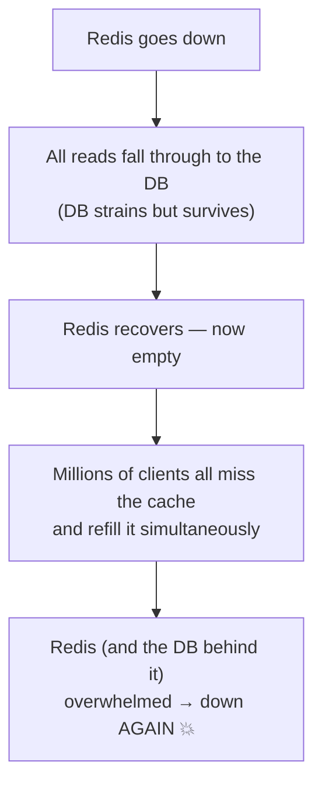
```mermaid
flowchart TD
    A["Redis goes down"] --> B["All reads fall through to the DB<br/>(DB strains but survives)"]
    B --> C["Redis recovers — now empty"]
    C --> D["Millions of clients all miss the cache<br/>and refill it simultaneously"]
    D --> E["Redis (and the DB behind it)<br/>overwhelmed → down AGAIN 💥"]
```

The recovering-queue backlog:

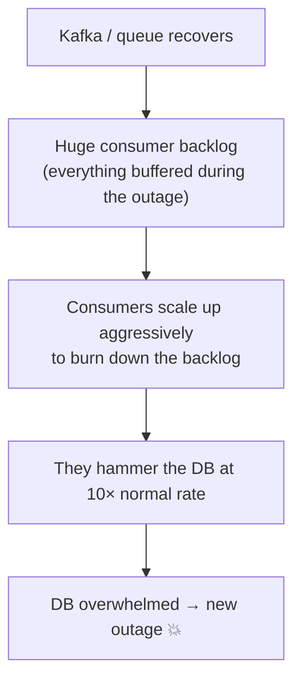
```mermaid
flowchart TD
    A["Kafka / queue recovers"] --> B["Huge consumer backlog<br/>(everything buffered during the outage)"]
    B --> C["Consumers scale up aggressively<br/>to burn down the backlog"]
    C --> D["They hammer the DB at 10× normal rate"]
    D --> E["DB overwhelmed → new outage 💥"]
```

How to make recovery safe (controlled ramp-up):
- **Gradual traffic ramp** — slowly increase load onto the recovered component instead of all at once (like highway metering).
- **Cache warming** — pre-populate before opening the floodgates, or use single-flight/request-coalescing so only one request rebuilds each key.
- **Consumer rate limiting** — cap how fast recovered consumers drain a backlog so they don't crush downstream systems.
- **Jittered retries** — spread the reconnection stampede over time so clients don't all hit at the same instant.

### Trade-offs / the real lesson

Controlled recovery is *slower* to fully recover — you deliberately hold back load, so the backlog clears over minutes instead of seconds. That patience is the price of not triggering a second outage. The lesson: **treat recovery as a high-load event and ramp it gradually — because letting everything that was waiting rush back in at once is a classic way to turn one outage into two.**

### Strong interview answer

> "Recovery is a high-load event, not a return to normal — so I design it to be gradual. A recovered cache faces a stampede of simultaneous refills, so I warm it and use single-flight so only one request rebuilds each key. A recovered queue has a huge backlog, so I rate-limit consumers instead of letting them flood the DB. And I jitter reconnection retries so clients don't all reconnect at the same instant. Recovering slower on purpose beats triggering a second outage."

### Remember this

> **Recovery is a high-load event. Ramp it gradually (warm caches, single-flight, rate-limit consumers, jitter retries) — or the stampede of everything rushing back turns one outage into two.**

---

# 18. The Senior-Level Failure Matrix

### In plain English

This table is the whole book on one page: for each *kind* of failure, the standard *protection*. Every row is a failure mode discussed across Tiers 1–6; every protection is a named tool. If you internalize this matrix, you can reach for the right defense reflexively.

### How to read it

Each protection here is explained somewhere in Tiers 1–6 — the distributed-systems rows (split brain, region failure) are explained *in this chapter*; the resilience rows (timeout, circuit breaker, bulkhead, backoff) come from Tier 1–2; the data rows (idempotency, dedup, outbox, saga, reconciliation) from Tier 3; and the scale rows (single-flight, hot key, rate limiting) from Tier 5.

| Failure | Protection | Where explained |
|---|---|---|
| Slow dependency | Timeout | §1 partial failure; Tier 1 |
| Dependency failure | Circuit breaker | Tier 1–2 |
| Resource exhaustion | Bulkhead | Tier 1–2 |
| Retry amplification | Backoff + jitter | §17; Tier 1 |
| Duplicate request | Idempotency | §11 |
| Duplicate event | Deduplication | §11 |
| DB corruption | Backup + PITR | §14 |
| Broker failure | Replication | §14; Tier 4 |
| Cache failure | Graceful fallback | §15 |
| Cache stampede | Single-flight | §17; Tier 5 |
| Hot key | Local cache / replication | Tier 5 |
| Traffic spike | Rate limiting / backpressure | §16; Tier 5 |
| Cross-service workflow | Saga | Tier 3 |
| DB + event dual write | Outbox | Tier 3 |
| Ambiguous external result | Reconciliation | §10, §11 |
| Split brain | Quorum / fencing | §3, §5, §6 |
| Region failure | DR / failover | §12, §13, §14 |

### Remember this

> **Every failure mode has a named, standard protection. Recognizing the failure and reaching for its protection reflexively is what "senior" looks like.**

---

# 19. Final Interview Framework

### In plain English

A repeatable ten-step walk for designing *any* production system in an interview (or in real life). Following it means you never freeze, never forget failure handling, and always cover the dimensions interviewers grade on: scale, consistency, resilience, recovery, and observability.

### The ten steps

**1. Functional requirements** — what must the system actually *do*? (Nail the core; defer the nice-to-haves.)

**2. Non-functional requirements** — the numbers that shape everything:
- latency
- throughput
- availability
- consistency
- durability

**3. Scale** — do the math, don't hand-wave:
- requests/sec
- storage
- bandwidth
- peak traffic (and peak-to-average ratio)

**4. Data model** — *what is the source of truth?* Everything else is a derived copy.

**5. Architecture** — the boxes and arrows:

```mermaid
flowchart TD
    Client["Client"] --> Gateway["Gateway"]
    Gateway --> Services["Services"]
    Services --> Backend["Cache / DB / Kafka"]
```

**6. Bottlenecks** — identify the choke points *before* they bite (usually a hot component or a single-writer).

**7. Failure handling** — run the §16 checklist out loud:

```text
What if the DB fails?
What if Redis fails?
What if Kafka fails?
What if a dependency is slow (not just down)?
What if a request is duplicated?
What if a service crashes mid-operation?
What if the network partitions?
```

**8. Consistency** — state your choice explicitly per operation:

```text
strong?  eventual?  transactional?  idempotent?
```

**9. Recovery** — design the comeback, not just the failure:

```text
RPO   RTO   backup   failover   reconciliation
```

**10. Observability** — you can't operate what you can't see:
- latency, throughput, errors
- **saturation** (how full are the queues/pools?)
- queue depth / consumer lag
- dependency health

### Remember this

> **Requirements → scale → data model → architecture → bottlenecks → failure → consistency → recovery → observability. Say each step out loud; never skip failure and recovery.**

---

# 20. The Most Important Senior-Level Principle

Everything in this chapter collapses into one sentence:

> **A distributed system is not designed only for the happy path. It is designed around what happens when things are slow, duplicated, unavailable, partially failed, or recovering.**

### Final mental model

```mermaid
flowchart TD
    SD["SYSTEM DESIGN"] --> SCALE["SCALE"]
    SD --> CONS["CONSISTENCY"]
    SD --> RES["RESILIENCE"]

    SCALE --> SC["Cache / Shard / Queue / Replica"]
    CONS --> CC["Txns / Saga / Outbox / Idempotency"]
    RES --> RR["Timeout / Retry / Circuit / Bulkhead"]

    SC --> OBS["OBSERVABILITY"]
    CC --> OBS
    RR --> OBS
    OBS --> DR["RECOVERY / DR"]
```

Read it top to bottom: every design balances **scale, consistency, and resilience**; each pillar has its toolbox; all three feed **observability** (you can't manage what you can't see); and observability feeds **recovery/DR** (you detect and recover from what you observe).

### Memorize these fifteen principles

Each is now explained earlier in this chapter (or Tiers 1–5) — this is the recall list:

1. **Find the bottleneck before scaling.** *(§19 step 6 — scaling the wrong thing wastes effort.)*
2. **Assume dependencies can be slow, not just down.** *(§1 partial failure — "slow" is the sneaky failure.)*
3. **Assume requests and events can be duplicated.** *(§11 — retries and at-least-once make duplicates inevitable.)*
4. **Never let retries be unlimited.** *(§17 — unbounded retries amplify overload; use backoff + jitter.)*
5. **Timeouts protect resources.** *(§1 — a timeout stops a slow dependency from consuming all your threads.)*
6. **Bulkheads isolate failures.** *(§16 checklist — partition resources so one failure can't sink everything.)*
7. **Circuit breakers stop repeated calls to unhealthy dependencies.** *(§16 — stop hammering something that's failing.)*
8. **Backpressure prevents overload propagation.** *(§16 — push back rather than pass overload downstream.)*
9. **Replication improves availability; backups provide recoverability.** *(§14 — replication ≠ backup.)*
10. **Make business operations idempotent.** *(§11 — idempotency is what makes retrying safe.)*
11. **Use outbox for DB + event consistency.** *(§18 matrix — the dual-write problem's standard fix.)*
12. **Use Saga for distributed business workflows.** *(§18 matrix — coordinate multi-service transactions without 2PC.)*
13. **Design recovery, not just failure handling.** *(§16 Q7 & §17 — recovery is its own high-load event.)*
14. **Monitor saturation, not just errors.** *(§19 step 10 — a full queue is failing before it errors.)*
15. **Always ask what happens when the failed component comes back.** *(§17 — the most forgotten, most dangerous question.)*

### Remember this

> **Design for the bad path. Balance scale, consistency, and resilience; make them observable; and always plan the recovery — because the failed component coming back is its own event.**
