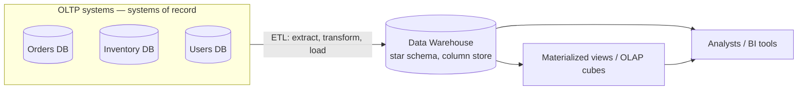
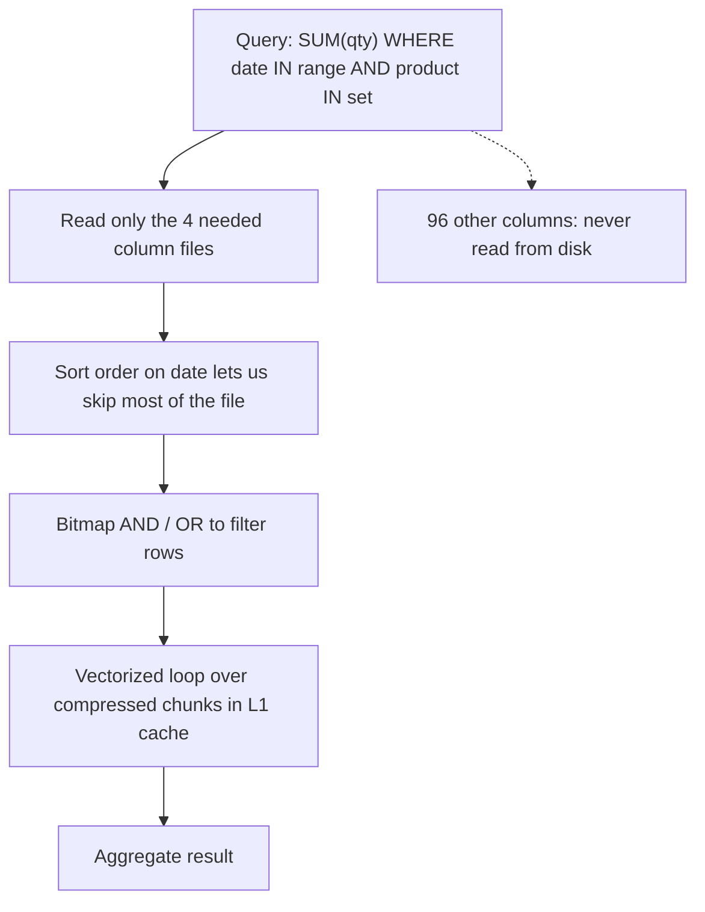

# OLTP vs OLAP & Column-Oriented Storage

**Prerequisites:** Topics 6, 7 (storage engines)
**Difficulty:** Intermediate
**Interview importance:** High
**Source:** Chapter 3 — "Transaction Processing or Analytics?", "Column-Oriented Storage"

---

## 1. What Is It?

Two fundamentally different access patterns, which turn out to need fundamentally different storage layouts.

- **OLTP** — Online Transaction Processing. User-facing. Huge volume of requests, each touching a **small number of records**, found by key.
- **OLAP** — Online Analytic Processing. Analyst-facing. Low volume of queries, each scanning **millions of records** and computing aggregates.

**Column-oriented storage** is the layout that makes OLAP fast: store all values from one column together, instead of storing all values from one row together.

---

## 2. Why Does It Exist?

For a long time, both workloads ran on the same relational databases. Then someone tried to run a real analytics query on a production OLTP database.

Consider: *"Did people buy more fresh fruit or candy on Sundays, across all stores, last quarter?"*

The fact table has maybe **100 columns** and **trillions of rows**. Your query needs **four** of them: date, product, quantity, store.

A row-oriented storage engine loads **every row in full** from disk into memory, parses it, and filters. You needed 4 columns and read 100. You wasted **96% of the I/O.**

Meanwhile, this query is running against the database that's also serving checkout. It saturates disk bandwidth, evicts the page cache, and now customers can't pay.

Two problems, one cause: **the access patterns are incompatible.** So the industry split them — a separate **data warehouse** for analytics, with a storage layout designed for scans rather than seeks.

---

## 3. Simple Explanation

Rows vs columns is the whole idea, and it's simpler than it sounds.

**Row-oriented** stores each record contiguously:
```
[id=1, date=2024-01-01, product=42, qty=3, store=7, ...95 more fields]
[id=2, date=2024-01-01, product=91, qty=1, store=7, ...95 more fields]
```
To read `qty` for all rows, you touch every byte of every row.

**Column-oriented** stores each column contiguously:
```
date:    [2024-01-01, 2024-01-01, 2024-01-02, ...]
product: [42, 91, 17, ...]
qty:     [3, 1, 5, ...]
store:   [7, 7, 12, ...]
```
To read `qty` for all rows, you read one file. The other 96 columns are never touched.

**The critical requirement:** all column files must contain rows **in the same order**, so that the 23rd entry in `date` and the 23rd entry in `qty` belong to the same row. The row is reassembled by position.

---

## 4. Real-World Analogy

**A warehouse.**

Row-oriented is organizing by *order*: each order's items boxed together. Perfect for fulfilling one order — grab one box.

Column-oriented is organizing by *product type*: all the phone chargers on one shelf, all the batteries on another. Terrible for fulfilling a single order (you'd walk the whole warehouse), but ideal for "how many chargers did we ship last month?" — you go to one shelf and count.

Both layouts are correct. They're correct for different questions. That's the entire chapter.

---

## 5. Technical Explanation

### The two access patterns

| Property | OLTP | OLAP (analytics) |
|---|---|---|
| Main read pattern | Small number of records per query, fetched by key | Aggregate over a large number of records |
| Main write pattern | Random-access, low-latency writes from user input | Bulk import (ETL) or event stream |
| Primarily used by | End users, via a web application | Internal analysts, for decision support |
| What data represents | Latest state of data at current point in time | History of events that happened over time |
| Dataset size | Gigabytes to terabytes | Terabytes to petabytes |
| Bottleneck | **Disk seek time** | **Disk bandwidth** |

That last row is the one to remember. **OLTP is seek-bound; OLAP is bandwidth-bound.** Every design decision follows from it. Indexes help with seeks and are largely irrelevant when you're scanning everything anyway.

### Data warehousing

A data warehouse is a separate database that analysts can query without affecting OLTP operations. It contains a read-only copy of data from all the various OLTP systems in the company.

Data is extracted from OLTP databases (periodic dumps or continuous streams), transformed into an analysis-friendly schema, cleaned up, and loaded into the warehouse. This process is **ETL** — Extract, Transform, Load.

The big advantage of a separate warehouse is that it **can be optimized for analytic access patterns**. The indexing algorithms of Topics 6 and 7 work well for OLTP, but aren't very good at answering analytic queries. The surface-level data model is often relational, because SQL is generally a good fit for analytic queries — but the internals look very different.

### Stars and snowflakes

The **star schema** (dimensional modeling) is the standard warehouse layout.

At the centre is a **fact table**. Each row represents an **event** that occurred at a particular time — an individual customer's purchase of a product, a page view, a click. Capturing events rather than aggregates gives maximum analytical flexibility later, at the cost of enormous fact tables.

Some fact table columns are **attributes** (price, cost). Others are **foreign keys to dimension tables**. Dimensions represent the **who, what, where, when, how, and why** of the event — `dim_product`, `dim_store`, `dim_customer`, `dim_date`.

Even date and time are often represented by dimension tables, so that additional information about dates — like public holidays — can be encoded, allowing queries to distinguish sales on holidays from non-holidays.

It's called a star schema because the fact table is in the middle with dimension tables radiating out. A **snowflake schema** breaks dimensions down into sub-dimensions — more normalized, but star schemas are often preferred because they're simpler for analysts to work with.

In a typical warehouse, tables are often **very wide: fact tables often have over 100 columns, sometimes several hundred.**

### Column compression

Once you store columns together, compression becomes remarkably effective — because **the number of distinct values in a column is often much smaller than the number of rows.**

The technique the book highlights is **bitmap encoding**. Take a column with *n* distinct values and turn it into *n* separate bitmaps, one per distinct value, with one bit per row: 1 if the row has that value, 0 otherwise.

If *n* is small, those bitmaps can be stored with one bit per row. If *n* is large, most bits are zero in most bitmaps — they're **sparse** — and can be **run-length encoded**, making them extremely compact.

Bitmap indexes are well suited to the queries analytics actually asks:

- `WHERE product_sk IN (30, 68, 69)` → load the three bitmaps and compute their **bitwise OR**.
- `WHERE product_sk = 31 AND store_sk = 3` → load both bitmaps and compute their **bitwise AND**. This works because the columns contain rows in the same order, so the *k*-th bit in one column's bitmap corresponds to the same row as the *k*-th bit in another's.

> **Column-oriented storage and column families.** Bigtable-style column families (used in Cassandra and HBase) are *not* the same as column-oriented storage. Within a column family, a row's columns are stored together, along with a row key, and no column compression is used — so the Bigtable model is still mostly **row-oriented**. This distinction trips people up constantly.

### Memory bandwidth and vectorized processing

For warehouse queries scanning millions of rows, a big bottleneck is getting data from disk into memory. But it isn't the only one — analytical engineers also worry about efficiently using the bandwidth **from main memory into the CPU cache**, avoiding branch mispredictions and bubbles in the CPU instruction pipeline, and making use of **SIMD** instructions.

Column-oriented storage layouts are good for making efficient use of CPU cycles. The query engine can take a chunk of compressed column data that fits comfortably in the CPU's L1 cache and iterate through it in a tight loop with no function calls. This is **vectorized processing**.

Operators can be designed to execute on such chunks of compressed column data directly — an especially neat trick, since it means the data stays compressed for longer, and it makes better use of the CPU cache.

### Sort order in column storage

Rows can be stored in any order — insertion order is simplest — but you can impose an order and use it as an indexing mechanism. **The sort order must be applied to entire rows, not to individual columns**, since we need to keep columns aligned by position.

The administrator chooses the sort columns using knowledge of common queries. If queries usually target date ranges, sort by date first: the query optimizer can then scan only rows from the required range, which is much faster than scanning everything.

A second column determines the sort order of rows that have the same value in the first. A sorted order also **helps compression**: if the primary sort column doesn't have many distinct values, long sequences of repeated values appear, and simple run-length encoding could compress a column with billions of rows down to a few kilobytes. That compression effect is strongest on the first sort key; second and third sort keys are more jumbled and don't have long runs.

**Several different sort orders.** A clever extension (introduced in C-Store, adopted in Vertica): since data needs to be replicated anyway for fault tolerance, **store the same data sorted in several different ways**, so the query can use whichever version best fits its pattern. This is a bit like having several secondary indexes in a row-oriented store — but the difference is that a row-oriented store keeps every row in one place (heap file or clustered index), whereas here every column is stored in one of several sorted copies of the whole dataset.

### Writing to column-oriented storage

Column-oriented storage, compression, and sorting all help make read queries faster. But they **make writes more difficult.**

An update-in-place approach like B-trees is not possible with compressed columns. If you wanted to insert a row in the middle of a sorted table, you would most likely have to rewrite all the column files, since rows are identified by their position within a column and the insertion has to update all columns consistently.

The solution is **LSM-trees**. All writes first go to an in-memory store, where they are added to a sorted structure and prepared for writing to disk. It doesn't matter whether the in-memory store is row- or column-oriented. When enough writes have accumulated, they are merged with the column files on disk and written to new files in bulk. This is essentially what Vertica does.

Queries need to examine **both the column data on disk and the recent writes in memory**, and combine the two. The query optimizer hides this from the user — from an analyst's point of view, data that has been modified with inserts, updates, or deletes is immediately reflected in subsequent queries.

### Aggregation: data cubes and materialized views

Not every warehouse is a column store, but they're much faster for ad hoc analytical queries, so they're growing quickly in popularity.

Another aspect worth mentioning is **materialized aggregates**. Warehouse queries often involve aggregate functions — `COUNT`, `SUM`, `AVG`, `MIN`, `MAX`. If the same aggregates are used by many queries, caching the results avoids recomputing them every time.

A **materialized view** is one way: unlike a virtual view (which is just a shortcut for writing queries, expanded at query time), a materialized view is an **actual copy of the query results, written to disk**. When the underlying data changes, a materialized view needs to be updated — the database can do this automatically, but it **makes writes more expensive**, which is why materialized views aren't often used in OLTP databases. In read-heavy warehouses they can make more sense.

A special case is the **data cube** or **OLAP cube**: a grid of aggregates grouped by different dimensions. Each cell holds the aggregate of an attribute over all rows with that dimension combination — for example, total sales by (date, product). Roll up along one dimension to get totals by date regardless of product.

The advantage is that certain queries become very fast, because they've effectively been precomputed. The disadvantage is that **a data cube doesn't have the same flexibility as querying raw data.** If you have a dimension that isn't in the cube, you can't slice by it. So most warehouses keep as much raw data as possible and use aggregates like cubes only as a performance boost for specific queries.

---

## 6. Diagram





---

## 7. Concrete Example

**A retail chain analyzing basket composition.**

Fact table: 2 trillion rows, 120 columns. Query: *"average basket value by store region for weekends in Q4."*

Row store: reads 120 columns × 2 trillion rows. Even at 1 GB/s, this is hours.

Column store with date as the primary sort key:
1. The date sort order means only Q4 rows are scanned — a range within the file, not the whole thing.
2. Only 4 column files are read.
3. `region` has ~20 distinct values → bitmap-encoded, run-length compressed, tiny.
4. The weekend filter uses the date dimension (which encodes day-of-week) as a bitmap AND.
5. Aggregation runs vectorized over compressed chunks.

Result: seconds instead of hours. Not from a cleverer algorithm — from **reading three orders of magnitude less data.**

---

## 8. When to Use / Not Use

**Use column-oriented storage when:** queries scan many rows but few columns; tables are wide; aggregates dominate; writes arrive in bulk (ETL or streaming); data is largely append-only history.

**Do NOT use when:** you need to fetch whole rows by key — reassembling a row means touching every column file, which is exactly the pattern column stores are bad at; you have high-frequency small updates; you need low-latency point reads; the table is narrow, since the benefit scales with the ratio of total columns to needed columns.

---

## 9. Advantages & Disadvantages

**Column storage — advantages:** dramatically less I/O for wide-table scans; excellent compression (bitmap, run-length); efficient CPU cache use and vectorized execution; sort order acts as an index and boosts compression; bitwise operations serve filters directly; multiple sort orders can be stored across replicas.

**Column storage — disadvantages:** writes are hard — no in-place updates on compressed columns; row reconstruction is expensive; inserts need the whole LSM machinery; sort order must be chosen up front by an administrator with knowledge of the query patterns; not suited to OLTP at all.

---

## 10. Trade-off Table

| Approach | Advantages | Disadvantages | Best Use Case |
|---|---|---|---|
| Row-oriented (B-tree/LSM) | Fast point reads and writes; whole-row access | Wasteful for wide-table scans | OLTP |
| Column-oriented | Massive I/O reduction; compression; vectorization | Poor point reads; complex writes | OLAP / warehouse |
| Column family (Bigtable/Cassandra) | Groups related columns; flexible schema | **Still row-oriented**; no column compression | Wide-row OLTP-ish workloads |
| Materialized view | Precomputed; very fast for known queries | Write cost; must be maintained | Repeated known aggregates |
| OLAP cube | Extremely fast for its dimensions | Inflexible — can't slice by a dimension not in the cube | Fixed dashboards over stable dimensions |
| Raw data + on-demand aggregation | Maximum flexibility | Slower per query | Ad hoc exploration — keep this as the base |

The pattern the book endorses: **keep raw data, add aggregates only as a performance boost.** Never let the cube become the only copy.

---

## 11. Failure Scenarios

| Scenario | Consequence | Handling |
|---|---|---|
| Analytics query run on the OLTP database | Saturates disk, evicts page cache, checkout slows | Separate warehouse; replica for reporting at minimum |
| ETL job fails silently | Analysts make decisions on stale data | Freshness monitoring; alert on data age, not just job status |
| Wrong sort key chosen | Full scans; poor compression | Re-sort (expensive); store multiple sort orders across replicas |
| Cube missing a dimension | Question can't be answered without a rebuild | Always retain raw data |
| Small frequent updates to a column store | Merge pressure; degraded query performance | Batch writes; LSM-style buffering; consider whether the workload is really OLAP |
| Row reconstruction for many rows | Touches every column file | Don't use a column store for row-fetch workloads |
| Schema drift between OLTP and warehouse | Silent data corruption in reports | Schema contracts; validation in the ETL step |

---

## 12. Production Considerations

- **Never run analytics on the OLTP primary.** At minimum use a replica; properly, use a warehouse.
- **Monitor data freshness** as a first-class metric. "The job succeeded" and "the data is current" are different claims.
- **Choose sort keys from actual query logs**, not from intuition. The primary sort key gives both the scan-skipping and the best compression.
- **Keep raw event data.** Aggregates are derived; raw is the system of record for analytics.
- **Watch storage cost vs query cost.** Multiple sort orders and materialized views trade space for speed.
- **Column families are not column storage.** Verify what your database actually does before assuming compression benefits.

---

## ❌ 13. Common Mistakes

- **Confusing column families with column-oriented storage.** Cassandra and HBase store a row's columns together within a family, with no column compression. That's row-oriented.
- **Running the quarterly report against production.** Classic, and it takes down checkout.
- **Storing aggregates instead of events.** You lose the ability to ask questions you hadn't thought of. Capture events; aggregate later.
- **Choosing a column store for a key-value workload.** Row reconstruction is its worst case.
- **Assuming a warehouse is "just a bigger database."** The internals are entirely different even though the SQL looks the same.
- **Treating an OLAP cube as the source of truth.** It can't answer questions outside its dimensions.
- **Ignoring sort order.** It's the single biggest lever in a column store, and it's frequently left at default.

---

## 🧠 14. Think Like an Engineer

```
What fraction of columns does the query need?
   (few of many → column store)
        ↓
How many rows per query? (few → OLTP; millions → OLAP)
        ↓
Is the bottleneck SEEK time or BANDWIDTH?
   (seek → indexes; bandwidth → read less data)
        ↓
Can I reduce data read? (sort order, partition pruning, compression)
        ↓
Do writes arrive in bulk or one at a time?
        ↓
Which aggregates are asked repeatedly? (materialize those only)
        ↓
Have I kept the raw events so future questions are answerable?
```

---

## 15. Mental Model

```
OLTP = find a needle → optimize SEEKS → indexes → row storage
OLAP = weigh the haystack → optimize BANDWIDTH → read less → column storage

Read less data:
  fewer columns (column storage)
  fewer rows    (sort order + pruning)
  fewer bytes   (compression)
  less recompute (materialized views)
```

---

## 🔗 16. How This Connects to Other Concepts

- **LSM-Trees (Topic 6)** — column stores use LSM buffering for writes, because in-place updates on compressed columns are impossible. The idea recurs.
- **B-Trees (Topic 7)** — the OLTP counterpart; the contrast here shows why one design can't serve both.
- **Batch Processing (Topic 27)** — ETL is a batch job, and Chapter 10 is essentially "how ETL works at scale."
- **Stream Processing (Topic 32)** — continuous ETL; the warehouse kept current by a stream rather than a nightly job.
- **Data Integration (Topic 34)** — the warehouse is the original derived-data system, and Chapter 12 generalizes the idea.

---

## 17. Interview Questions & Answers

**Beginner**

**Q: What's the difference between OLTP and OLAP?**
OLTP is user-facing: high request volume, each touching a few records looked up by key, and the bottleneck is disk seek time. OLAP is analyst-facing: low query volume, but each query scans millions of rows to compute aggregates, and the bottleneck is disk bandwidth. That difference in bottleneck is why they need different storage layouts — indexes solve seek problems and don't help when you're scanning everything anyway.

**Q: Why is column storage faster for analytics?**
Because analytics queries typically need a handful of columns out of a table that might have a hundred or more. Row storage forces you to read whole rows, so you read the entire table to get 4% of it. Column storage keeps each column in its own file, so you only read what you need. Compression is also far more effective because a column has far fewer distinct values than it has rows.

**Intermediate**

**Q: How does bitmap encoding work, and why does it suit analytics?**
For a column with n distinct values you create n bitmaps, one per value, with one bit per row indicating whether that row has that value. Sparse bitmaps run-length compress extremely well. It suits analytics because the common filters map directly to bit operations: an IN clause becomes a bitwise OR of several bitmaps, and an AND across two columns becomes a bitwise AND. That works precisely because all columns store rows in the same order, so the k-th bit means the same row in every column.

**Q: Why does sort order matter so much in a column store?**
Two reasons. It acts as an index — if the data is sorted by date and you query a date range, the engine scans only that range rather than the whole file. And it improves compression dramatically, because sorting groups repeated values into long runs that run-length encoding crushes. The catch is that the sort must apply to entire rows to keep columns positionally aligned, and the compression benefit is concentrated in the first sort key, since subsequent keys are more jumbled. C-Store and Vertica extended this by storing the same data in several sort orders across the replicas you need for fault tolerance anyway, so a query can use whichever ordering suits it.

**Q: How do column stores handle writes?**
Not by updating in place — that's impossible with compressed columns, and inserting a row in the middle of a sorted table would require rewriting every column file since rows are identified by position. Instead they use the LSM approach: writes go to an in-memory sorted structure, and once enough accumulate they're merged with the on-disk column files and written out in bulk. Queries then have to read both the on-disk columns and the in-memory recent writes and combine them, which the optimizer hides from the user.

**Advanced / Staff**

**Q: A team wants to run their reporting queries directly against the production Postgres primary. Talk them out of it — or don't.**
It depends entirely on the query shape and the load, so I'd start by measuring rather than asserting. If the reports are small, indexed, and infrequent, a read replica is enough and building a warehouse would be premature. The problem case is scan-heavy aggregate queries, because those saturate disk bandwidth and evict the buffer cache, and the second effect is the one people miss — after a big scan, the OLTP working set is no longer cached, so ordinary transactions get slower for a while even after the report finishes. So the immediate mitigation is a dedicated replica, which isolates the I/O. The longer-term answer is a column-oriented warehouse, but I'd only argue for that once I could show that the query volume or table width justifies it, because a warehouse adds an ETL pipeline, a freshness problem, and a schema contract to maintain.

**Q: How would you decide what to materialize?**
From query logs, not intuition. I'd look for aggregates that are computed repeatedly over data that changes slowly, since that's where the write cost of maintaining the view is smallest relative to the read savings. I'd be cautious about materializing anything with high cardinality in its grouping keys, because the view can end up nearly as large as the source. And I'd treat materialized views strictly as a performance layer over retained raw data — the failure mode I'd guard against is a cube becoming the only surviving copy, because then any question involving a dimension that wasn't included becomes unanswerable, and that's how organizations lose the ability to investigate their own history.

---

## 🎯 30-Second Interview Answer

> "OLTP and OLAP have opposite bottlenecks: OLTP looks up a few records by key so it's seek-bound, and OLAP scans millions of rows to aggregate so it's bandwidth-bound. That's why they need different storage. Column-oriented storage keeps each column in its own file, so a query needing 4 columns out of 120 reads 4 files instead of the whole table. Compression is also far better because a column has few distinct values relative to rows — bitmap encoding plus run-length encoding, and the filters become bitwise ANDs and ORs directly. The cost is that writes are hard: you can't update compressed columns in place, so column stores buffer writes in memory LSM-style and merge in bulk, and fetching a whole row means touching every column file. One thing worth flagging is that Cassandra's column families are not column-oriented storage — within a family the row's columns are stored together, so it's still row-oriented."

---

## ⚡ Quick Revision

- **OLTP:** few records by key, seek-bound, user-facing, current state.
- **OLAP:** millions of rows, bandwidth-bound, analyst-facing, event history.
- **Star schema:** central **fact table** (one row per **event**) + **dimension tables** (who/what/where/when/how/why). Fact tables often 100+ columns, trillions of rows.
- **Column storage:** each column in its own file; **all columns must store rows in the same order**.
- **Bitmap encoding** + **run-length encoding** → filters become bitwise AND/OR.
- **Vectorized processing:** compressed chunks in L1 cache, tight loops, SIMD.
- **Sort order** = index + compression booster. Applies to whole rows. Multiple sort orders across replicas (C-Store/Vertica).
- **Writes:** no in-place update possible → **LSM buffering**, bulk merge.
- **Materialized views / OLAP cubes:** precomputed aggregates. Fast but inflexible — **always keep raw data**.
- **Column families ≠ column-oriented storage.** Bigtable/Cassandra are still row-oriented.
