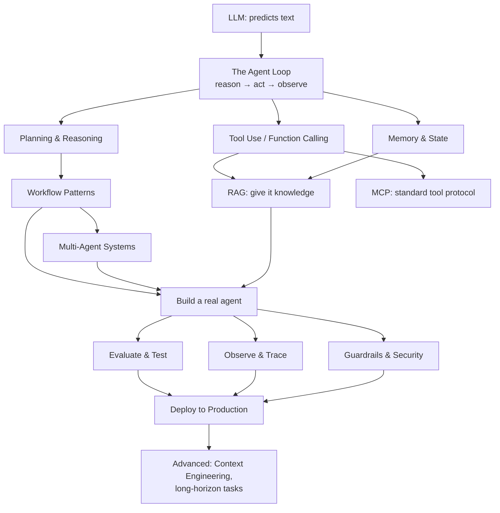

# Agentic AI — A Complete Course (Concepts → Implementation → Production)

> A from-scratch course to master Agentic AI: what agents are, how they think, how to build them, and how to run them in production. Read it in order and you should be able to **explain any concept** and **implement a real agent** yourself.

---

## Who this is for

You're a strong backend engineer who is **new to AI**. You don't need any machine-learning background. You need to understand LLMs well enough to *orchestrate* them, and to build reliable systems *around* them — which is exactly a backend/distributed-systems skill set. Every chapter starts in plain English, then goes deep.

> **Mental frame that helps:** an LLM is a smart-but-forgetful, sometimes-wrong contractor who can only talk. An **agent** is the *management system* you build around that contractor: giving it tools, memory, goals, checks, and a loop so it can actually get work done. Most of "Agentic AI" is good engineering around an unreliable component — which you already know how to do.

---

## How to use this course

1. **Read in order.** Later chapters assume earlier vocabulary.
2. **After each chapter**, try to answer its "Check yourself" questions out loud before moving on.
3. **Do the code chapters hands-on.** Reading about an agent loop is not the same as writing one. Chapter 13 builds a real agent from scratch in ~150 lines.
4. **Build a capstone** (Chapter 20) — you don't understand agents until you've debugged one that's stuck in a loop or hallucinating a tool call.

---

## The map — how the concepts connect

---

## Full syllabus

### Part 1 — Foundations
- **01 — What Is Agentic AI?** Agents vs workflows vs a plain LLM call. When you actually need an agent (and when you don't).
- **02 — LLM Fundamentals for Agent Builders.** Tokens, context windows, sampling, structured output, and the limitations (hallucination, knowledge cutoff, non-determinism) that every agent design must work around.
- **03 — The Agent Loop.** The heart of everything: reason → act → observe → repeat. ReAct explained.

### Part 2 — Core Building Blocks
- **04 — Tool Use / Function Calling.** How an LLM "does things": tool schemas, the tool-calling protocol, parallel tools, error handling.
- **05 — Memory & State.** Short-term (context) vs long-term (vector/DB) memory; episodic vs semantic; how to manage a growing context.
- **06 — RAG (Retrieval-Augmented Generation).** Embeddings, vector databases, chunking, retrieval, reranking. RAG vs fine-tuning vs long context.
- **07 — Planning & Reasoning.** Chain-of-thought, ReAct, plan-and-execute, reflection/self-critique, tree-of-thoughts.
- **08 — Prompt Engineering for Agents.** System prompts, few-shot, structured output, and putting guardrails in the prompt.

### Part 3 — Architectures & Patterns
- **09 — Agentic Workflows vs Autonomous Agents.** The five reliable patterns: prompt chaining, routing, parallelization, orchestrator-workers, evaluator-optimizer.
- **10 — Multi-Agent Systems.** Orchestrator + sub-agents, handoffs, communication. When multi-agent helps and when it just adds cost.
- **11 — MCP (Model Context Protocol).** The "USB-C for tools" — how agents connect to tools and data in a standard way.

### Part 4 — Building for Real
- **12 — The Frameworks Landscape.** Raw API vs LangGraph vs LlamaIndex vs CrewAI vs AutoGen vs Claude Agent SDK vs OpenAI Agents SDK — what to pick and why.
- **13 — Build Your First Agent (hands-on).** A real coding/file agent from scratch: the loop + tools, in ~150 lines.
- **14 — Evaluation & Testing.** Why you can't unit-test a probabilistic system the old way. Evals, LLM-as-judge, regression suites.
- **15 — Observability & Tracing.** Spans, cost/latency tracking, LangSmith/Langfuse, debugging a misbehaving agent.
- **16 — Guardrails, Safety & Security.** Prompt injection, jailbreaks, output filtering, sandboxing tools, human-in-the-loop.
- **17 — Cost & Latency Optimization.** Prompt caching, model routing, streaming, batching, context compaction.

### Part 5 — Production & Mastery
- **18 — Deploying Agents to Production.** Stateless design, queues, retries, rate limits, scaling, the reliability playbook (this is your backend strength).
- **19 — Advanced: Context Engineering & Long-Horizon Tasks.** The frontier skill — managing what the model sees; subagent orchestration; memory compaction.
- **20 — Capstone Projects.** Concrete specs to implement, from beginner to advanced.
- **21 — Glossary.** Every term, plain-English.
- **22 — Mastery Checklist & Interview Q&A.** "Can you answer this? Can you build this?" — self-test before you call yourself done.

---

## The 5 things that separate "used ChatGPT" from "can build agents"

1. **The loop.** An agent isn't one clever prompt — it's a *loop* that lets the model take an action, see the result, and decide the next action. (Ch 3)
2. **Tools.** The model can't do anything by itself; it can only emit text asking *you* to run a tool and return the result. (Ch 4)
3. **Context is the real product.** What you put in the context window each turn *is* the agent's intelligence. Managing it is the core skill. (Ch 5, 19)
4. **It's probabilistic.** Same input can give different output. You design for that with evals, guardrails, and retries — not by pretending it's deterministic. (Ch 14, 16)
5. **Reliability is engineering, not prompting.** Retries, idempotency, timeouts, human-in-the-loop — the boring backend stuff is what makes agents production-worthy. (Ch 18)

---

## A note on code & models

Code examples use **Python** (the AI ecosystem's default) and are written to be **provider-agnostic in concept**, with concrete examples against the **Anthropic (Claude) API** since the patterns are identical across providers. Where you'd apply something in **Java/Spring** (your home turf), I'll call it out. When we reach the build chapters I'll confirm your preferred stack (raw SDK vs a framework like LangGraph).

> Models move fast. When I show specific model names/IDs or SDK calls in the implementation chapters, I verify them against current references rather than relying on memory — you should build the same habit, because a model ID from a year-old blog post is often wrong.

---

*Start with **01 — What Is Agentic AI?***
