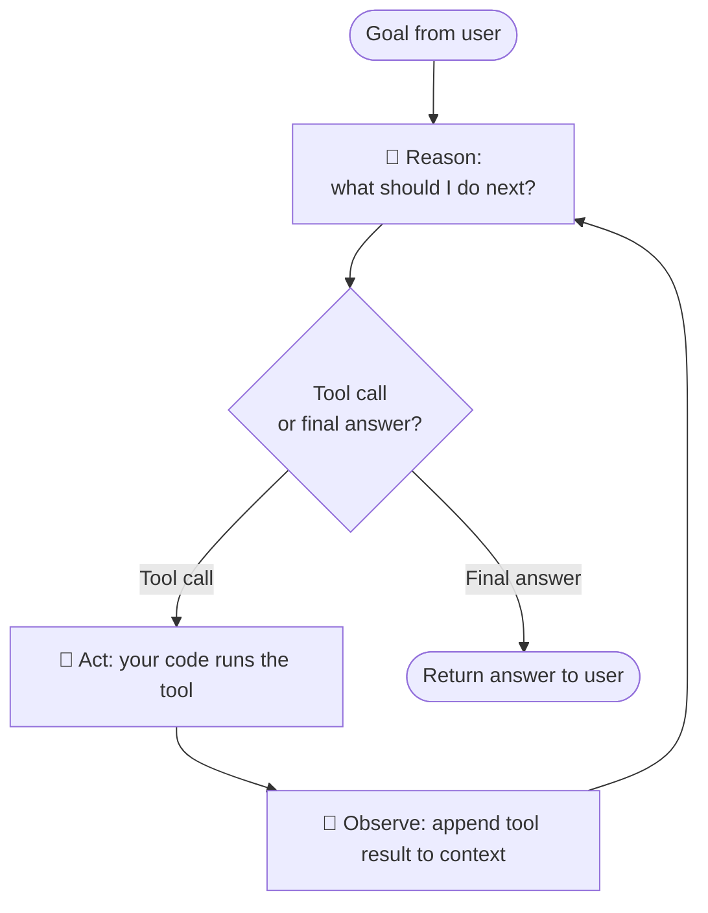
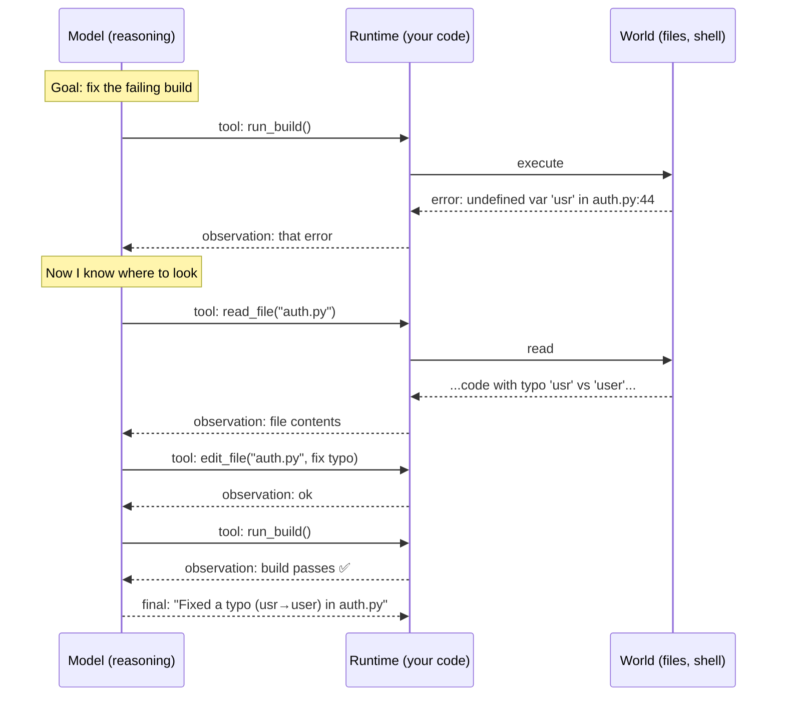
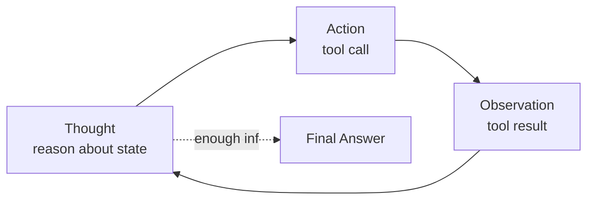
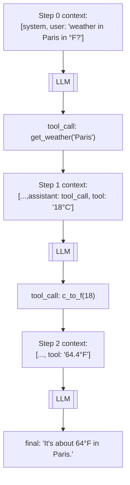

# 03 — The Agent Loop

> Everything else in this course hangs off one idea: an agent is a **loop** that lets the model **reason**, take an **action** (a tool call), **observe** the result, and decide again — until the goal is met. Understand this loop and you understand agents. This chapter builds it up in pseudocode.

---

## 1. The Core Idea in Plain English

A plain LLM call is a straight line: prompt in, answer out. But real tasks need *trying something, seeing what happened, and adjusting.* So we put the model in a loop:

1. **Reason** — the model thinks about the goal and current state, and decides the next step.
2. **Act** — it emits a **tool call** (e.g. "read file X", "search for Y").
3. **Observe** — your code runs the tool and feeds the **result** back into the model's context.
4. **Repeat** — the model now has more information and decides the next step.
5. **Stop** — when the model says "I'm done" (produces a final answer instead of a tool call), or a limit is hit.

That's the whole thing. It's called the **agent loop** (or the ReAct loop — §4).



The loop is why an agent can handle tasks whose steps you couldn't predict: each iteration, the model **replans** based on what it just learned.

---

## 2. Why a Loop Beats a Single Call

Consider "find the bug in this repo and fix it." You *cannot* write this as one prompt — you don't know which file has the bug until you've looked. The agent discovers it:



Each observation **changes the plan**. That adaptivity is the entire value proposition of an agent.

---

## 3. The Loop in Pseudocode (read this carefully)

Here's the actual shape of every agent, stripped to essentials. Notice how the **message list grows** each iteration — that's the agent's working memory (Ch 2 §3).

```python
def run_agent(goal, tools, max_steps=15):
    # 1. Seed the context: rules + available tools + the goal
    messages = [
        {"role": "system", "content": SYSTEM_PROMPT},   # who it is, how to behave
        {"role": "user",   "content": goal},
    ]

    for step in range(max_steps):                        # a bound = safety net
        # 2. REASON: ask the model what to do next, given everything so far
        response = llm(messages, tools=tools, temperature=0)

        # 3. Did it ask for a tool, or give a final answer?
        if response.stop_reason == "tool_use":
            # 3a. ACT + OBSERVE for each requested tool call
            messages.append(response.as_assistant_message())   # remember what it asked
            for call in response.tool_calls:
                result = execute_tool(call.name, call.arguments)  # YOUR code runs it
                messages.append({                                  # feed result back
                    "role": "tool",
                    "tool_call_id": call.id,
                    "content": result,
                })
            # loop continues → model sees the results and decides again
        else:
            # 3b. No tool call → this is the final answer. STOP.
            return response.text

    return "Stopped: hit max_steps without finishing."   # give-up condition
```

Study the four load-bearing parts:

| Line of the loop | What it is | Why it matters |
|---|---|---|
| `messages = [...]` growing each step | **Context/working memory** | The model's only memory; it re-reads the whole thing each call |
| `llm(messages, tools=...)` | **Reason** | The model decides; low temperature for consistency |
| `execute_tool(...)` | **Act** (your code!) | The model *requests*; your runtime *executes* and returns truth |
| `stop_reason` check + `max_steps` | **Termination** | Without this an agent loops forever / burns money |

> If you remember one code snippet from this whole course, make it this one. LangGraph, CrewAI, the Claude Agent SDK — they are all elaborations of this loop.

---

## 4. ReAct: Reason + Act (the pattern behind the loop)

The loop above is the modern form of **ReAct** ("Reasoning + Acting"), the 2022 paper that shaped agents. The insight: instead of the model either *just reasoning* (chain-of-thought, which can't touch the world) or *just acting* (tool calls with no thinking), you **interleave** them:

```text
Thought:  I need the user's order status. I should look it up.
Action:   get_order(order_id="123")
Observation: {status: "shipped", eta: "Aug 25"}
Thought:  It's shipped, ETA Aug 25. I can answer now.
Answer:   Your order #123 shipped and arrives Aug 25.
```

- **Thought** = the model reasoning in text (helps it plan and stay coherent).
- **Action** = a tool call.
- **Observation** = the tool's result, fed back.

Modern tool-calling APIs bake this in: the model's "thought" is its reasoning text, the "action" is a structured tool call, and you supply the "observation." You rarely hand-format `Thought/Action/Observation` strings anymore, but that *is* what's happening under the hood.



---

## 5. Termination — How an Agent Knows to Stop

A loop needs an exit. Agents stop when **any** of these happen:

- ✅ **Goal met** — the model returns a final answer instead of a tool call.
- 🛑 **Max steps / iterations** — a hard cap (e.g. 15) so a confused agent can't loop forever.
- 💸 **Budget cap** — max tokens or dollars spent.
- ⏱️ **Timeout** — wall-clock limit.
- 🧱 **Explicit "done" tool** — some designs give the model a `finish(answer)` tool it must call to end.
- ❌ **Unrecoverable error / max retries** on a failing tool.

> **Always** set a max-steps bound. The classic beginner bug is an agent that keeps calling the same failing tool, or ping-pongs between two actions, forever — quietly spending money. (More failure modes in Ch 16.)

---

## 6. A Worked Trace with State

Watch the message list (context) grow — this is what the model re-reads every iteration:



Notice: the model needed **two** tools in sequence and combined their results — something a single call couldn't do. Also notice the context is now carrying two tool results; over many steps this is what eventually fills the window (→ context engineering, Ch 19).

---

## 7. Variations of the Loop (preview)

The basic loop has powerful variants you'll meet later:

- **Add a planning step first** — have the model write a plan, then execute it step-by-step (plan-and-execute, Ch 7).
- **Add reflection** — after acting, have the model critique its own work and retry (evaluator-optimizer, Ch 9).
- **Add sub-agents** — a tool call can itself *be another agent* (multi-agent, Ch 10).
- **Human-in-the-loop** — pause the loop for human approval before risky actions (Ch 16).

All of these are the same loop with extra structure around the "reason" and "act" steps.

---

## 8. Common Mistakes

- **No max-steps bound** → infinite loops and runaway cost. Always cap it.
- **Not feeding tool results back correctly** → the model "forgets" what it just did and repeats actions. The observation *must* go into the next call's context.
- **Dropping the assistant's tool-call message** from history → the API rejects the mismatched tool-result, or the model loses the thread. Append *both* the tool call and its result.
- **High temperature** → the model makes erratic tool choices. Keep it low.
- **Letting context grow unbounded** → you hit the window limit mid-task and the agent breaks. Plan to summarize/trim (Ch 19).
- **Expecting the model to run tools itself** → it never does; your runtime does. (Said again because it's *the* foundational misunderstanding.)

---

## 9. Check Yourself

1. What are the four phases of the agent loop?
2. Why does the message list grow every iteration, and what is it re-read for?
3. Give three ways an agent loop can terminate.
4. In ReAct, what are Thought / Action / Observation?
5. Why can a loop solve tasks a single LLM call cannot?

---

## 10. Key Takeaways

- **An agent is a loop: reason → act → observe → repeat → stop.** This is the core of the entire field.
- The loop's power is **adaptivity**: each observation can change the next decision, so it handles tasks whose steps aren't known in advance.
- The **message list is the working memory**; it grows each step and is resent every call.
- **ReAct** = interleaving reasoning (Thought) with tool calls (Action) and results (Observation).
- **Always bound the loop** (max steps / budget / timeout) — unbounded loops are the #1 beginner failure.
- Frameworks are just this loop with conveniences bolted on.

**Next:** *04 — Tool Use / Function Calling* — the mechanism that turns a text predictor into something that can act.
