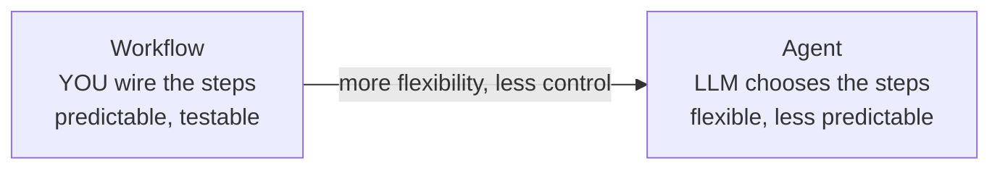
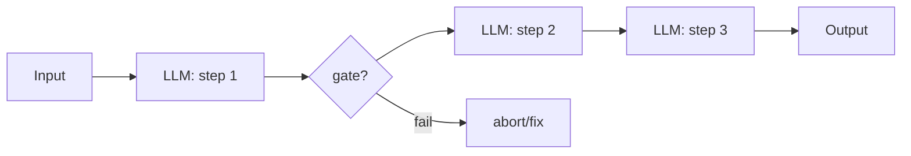
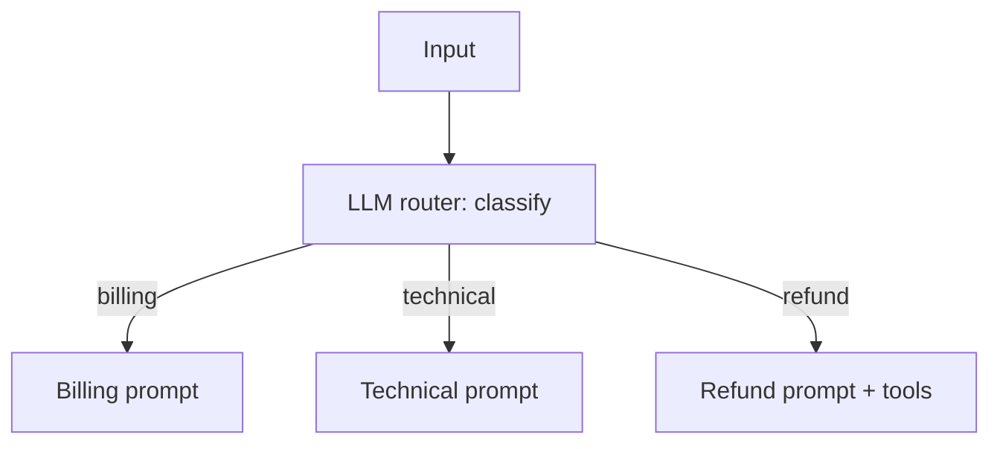
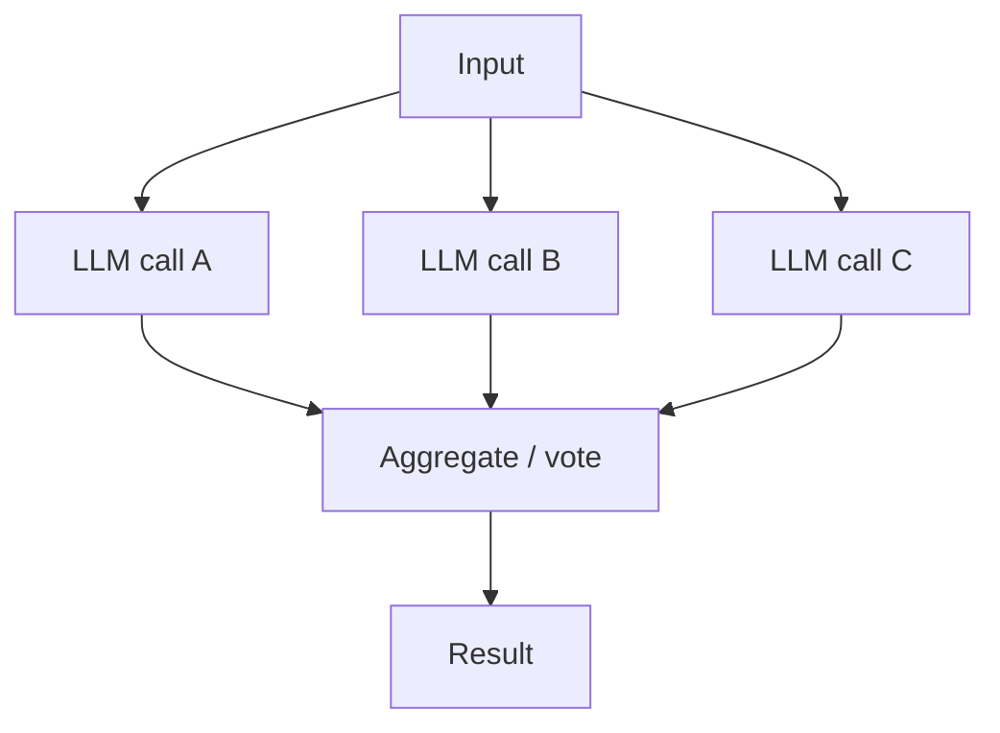
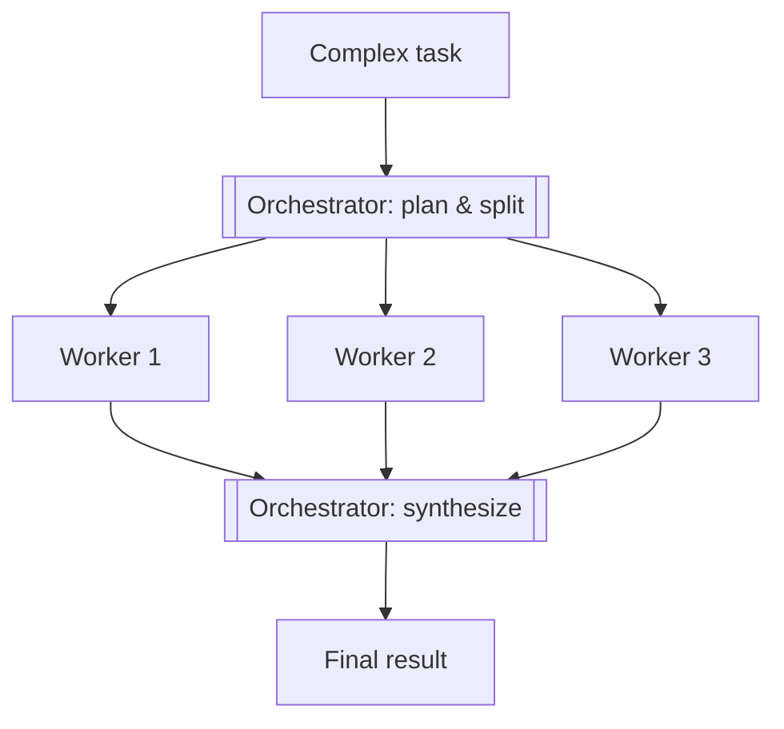
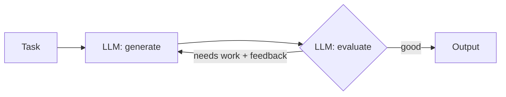
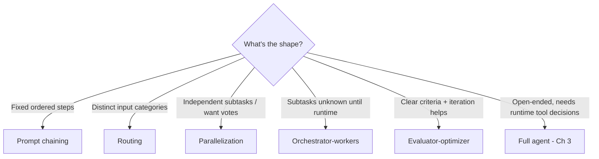

# 09 — Agentic Workflows vs Autonomous Agents

> Most reliable "AI agents" in production are actually **workflows** — LLM calls wired together in code you control — not fully autonomous agents. This chapter covers the five battle-tested workflow patterns (prompt chaining, routing, parallelization, orchestrator-workers, evaluator-optimizer) and when to graduate to a true agent.

---

## 1. The Problem in Plain English

Chapter 1 put agents on a spectrum from "plain call" to "fully autonomous." The industry's hard-won lesson: **the more autonomy you give, the less reliable, predictable, and debuggable the system becomes.** So the best engineers reach for the *least* autonomous design that solves the problem — and that usually means a **workflow**: a fixed set of LLM calls that *you* orchestrate in code, not a model deciding its own path.

**The key distinction:**
- **Workflow** — *you* define the control flow. LLM steps are plugged into code you wrote. Predictable, testable.
- **Agent** — the *LLM* defines the control flow at runtime (which steps, which tools, when to stop). Flexible, less predictable.

**Analogy — assembly line vs. master craftsman.** A workflow is an assembly line: each station does one defined job, the product moves in a fixed path, quality is consistent, and you can inspect any station. An agent is a master craftsman handed raw materials and a goal, free to decide their own process — capable of more, but you can't predict exactly what they'll do. For most products, a well-designed assembly line beats a craftsman.

---

## 2. The Five Workflow Patterns

These come from Anthropic's *Building Effective Agents* and are the reliable building blocks. Learn to recognize which one a problem needs.

### 2.1 Prompt Chaining
Break a task into a **fixed sequence** of LLM calls, each using the previous output. Add programmatic **gates** between steps to catch failures early.

**Use when** the task decomposes into clean, ordered subtasks. *Example:* generate an outline → check it meets criteria → write the doc from the outline. Trades latency for accuracy (each step is simpler).

### 2.2 Routing
Classify the input, then send it down one of several **specialized paths**. Separating concerns lets each path have its own prompt/model.

**Use when** inputs fall into distinct categories that are better handled differently. *Example:* a support system routing to billing vs. technical vs. escalation. Also lets you route easy queries to a cheap model, hard ones to a strong model.

### 2.3 Parallelization
Run multiple LLM calls **at the same time**, then aggregate. Two flavors:
- **Sectioning** — split a task into independent subtasks run in parallel (e.g. analyze 5 documents at once).
- **Voting** — run the *same* task multiple times and combine/vote (e.g. three reviewers flag bugs; take the union).

**Use when** subtasks are independent (speed) or when multiple perspectives improve quality/confidence (voting).

### 2.4 Orchestrator-Workers
A central **orchestrator** LLM dynamically breaks a task into subtasks, delegates each to **worker** LLMs, and synthesizes their results. Unlike parallelization, the subtasks aren't fixed up front — the orchestrator decides them based on the input.

**Use when** you can't predict the subtasks in advance. *Example:* "make this change across the codebase" — the orchestrator finds the affected files (unknown until it looks), then dispatches a worker per file. This is the bridge toward multi-agent systems (Chapter 10).

### 2.5 Evaluator-Optimizer
One LLM **generates**, another **evaluates** against criteria and gives feedback, and the generator revises — looping until the evaluator is satisfied. (This is reflection from Chapter 7, formalized as two roles.)

**Use when** you have clear evaluation criteria and iteration measurably helps. *Example:* draft a translation → evaluate nuance → refine; or write code → run tests → fix. A *separate* evaluator with fresh context is more objective than self-critique.

---

## 3. Choosing a Pattern

| Pattern | Control flow | Best for |
|---|---|---|
| Prompt chaining | Fixed sequence | Decomposable, ordered tasks |
| Routing | Branch by category | Distinct input types; cost routing |
| Parallelization | Fan-out + aggregate | Independent subtasks; voting for confidence |
| Orchestrator-workers | Dynamic fan-out | Subtasks unknown up front |
| Evaluator-optimizer | Generate ↔ evaluate loop | Quality-critical output with clear criteria |
| **Full agent** | LLM decides everything | Open-ended tasks needing runtime tool decisions |

These **compose**: a router sends a request into a prompt chain; one chain step is an evaluator-optimizer loop; a worker in an orchestrator setup is itself a small agent.

---

## 4. When to Graduate to a Full Agent

Use a true autonomous agent (Chapter 3 loop) only when **all** hold:
- The task is **open-ended** — you genuinely can't map the steps in advance.
- It **needs tools and iteration** — act, observe, adapt.
- The **cost of a wrong autonomous action is acceptable** (or gated by human approval).
- The **value justifies** the higher cost, latency, and lower predictability.

If you can draw the flowchart ahead of time → build the flowchart (a workflow). If the flowchart depends on what the model discovers → build an agent.

---

## 5. Failure Scenarios

| Scenario | What happens | Handling |
|---|---|---|
| Used a full agent where a workflow fit | Unpredictable, costly, hard to debug | Downgrade to the simplest pattern that works |
| Prompt chain: early error propagates | Later steps build on garbage | Add gates/validation between steps |
| Router misclassifies | Wrong path, wrong answer | Add a fallback/default route; confidence threshold |
| Parallel voting ties or conflicts | No clear winner | Define a tie-breaker / aggregation rule |
| Orchestrator over-splits | Too many workers, high cost | Cap worker count; give splitting guidance |
| Evaluator loop never converges | Infinite / degrading revisions | Bound iterations; concrete pass criteria |

---

## ❌ 6. Common Mistakes

- **Reaching for a fully autonomous agent by default.** Start with the least autonomous pattern that works.
- **No gates in a prompt chain.** Errors compound silently.
- **Ignoring cost routing.** Sending every query to the strongest model when a router could send easy ones to a cheap one.
- **Confusing parallelization (fixed subtasks) with orchestrator-workers (dynamic subtasks).**
- **Self-evaluation for high-stakes checks.** A fresh-context evaluator catches more.
- **Unbounded evaluator loops.** Always cap iterations with real stop criteria.
- **Building one giant agent** when a composition of small workflows would be more reliable.

---

## 7. Check Yourself

1. What's the core difference between a workflow and an agent?
2. Name the five workflow patterns and one use case each.
3. How do parallelization and orchestrator-workers differ?
4. What four conditions justify a full autonomous agent?
5. Why is "use the least autonomous design that works" good advice?

---

## 8. Key Takeaways

- Most production "agents" are **workflows** — LLM steps wired together in code *you* control — because they're predictable, testable, and cheaper.
- The five reliable patterns: **prompt chaining, routing, parallelization, orchestrator-workers, evaluator-optimizer** — and they **compose**.
- **Prompt chaining** = fixed steps + gates; **routing** = branch by category; **parallelization** = fan-out/vote; **orchestrator-workers** = dynamic fan-out; **evaluator-optimizer** = generate↔evaluate loop.
- **Graduate to a full agent only** for open-ended tasks needing runtime tool decisions, where errors are recoverable and the value justifies the cost.
- Golden rule: **if you can draw the flowchart in advance, build the flowchart.**

**Next:** *10 — Multi-Agent Systems* — when and how to have multiple agents collaborate.
