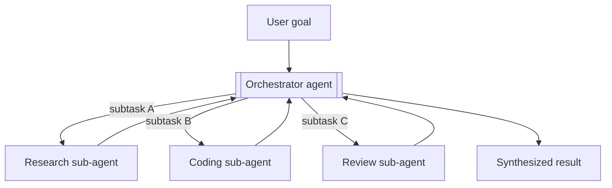
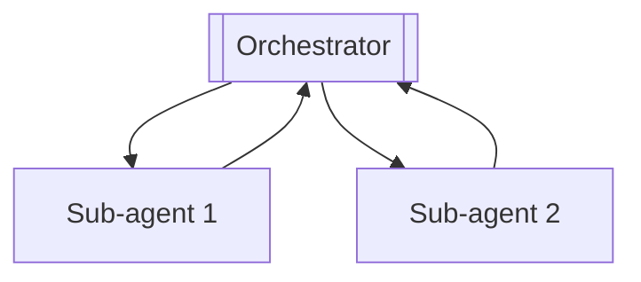
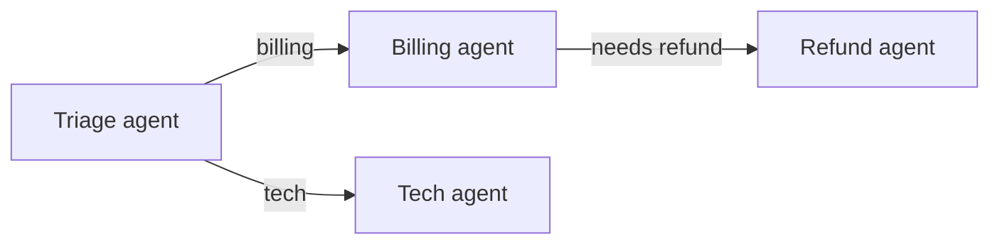
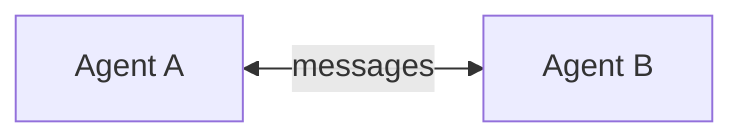
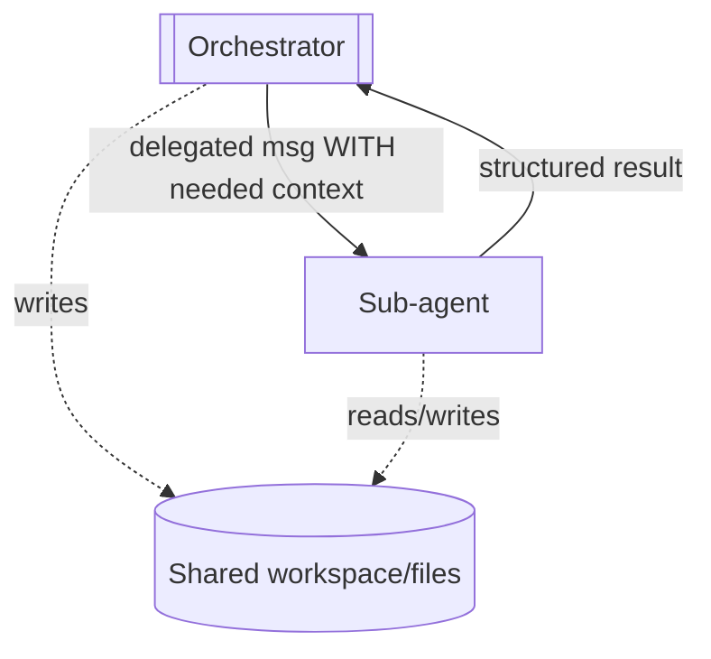
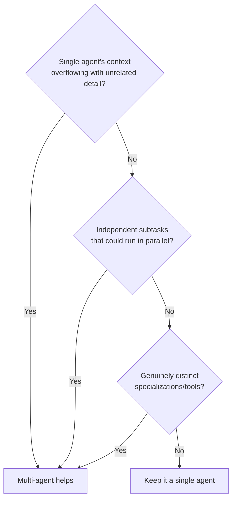

# 10 — Multi-Agent Systems

> Sometimes one agent isn't enough — you split the work across multiple specialized agents that collaborate. This chapter covers the main topologies (orchestrator + sub-agents, handoffs, peer collaboration), how agents communicate, and the crucial question of when multi-agent actually helps versus when it just multiplies cost and confusion.

---

## 1. The Problem in Plain English

A single agent doing everything runs into limits: its context fills with unrelated detail, its system prompt tries to be good at too many things, and long tasks lose focus. **Multi-agent systems** split the work: several agents, each with a focused role, tools, and context, collaborate on a larger goal.

The most common shape: a **coordinator** (orchestrator) agent that delegates subtasks to specialized **sub-agents**, then synthesizes their results — the orchestrator-workers pattern from Chapter 9, but where each worker is itself a full agent with its own tools and loop.

**Analogy — a company.** One person can run a lemonade stand. Building a product needs a team: a manager (orchestrator) who breaks down the goal and assigns work, and specialists — an engineer, a designer, a researcher (sub-agents) — each expert in their area with their own tools. The manager doesn't do everything; they coordinate and integrate. Multi-agent design is org design.

---

## 2. Why Split Into Multiple Agents?

- **Focused context** — each sub-agent's window holds only what *its* subtask needs, not the whole problem. This is the biggest win: it fights context overflow and "lost in the middle."
- **Specialization** — each agent gets a tailored system prompt, tool set, and even model tier (a cheap model for simple sub-agents, a strong one for the orchestrator).
- **Parallelism** — independent sub-agents run at the same time, cutting wall-clock time for fan-out work (research many sources, edit many files).
- **Separation of concerns** — easier to build, test, and reason about a focused agent than one that does everything.

---

## 3. Topologies

### 3.1 Orchestrator + Sub-agents (most common)
A central agent plans, delegates, and synthesizes. Sub-agents report back to it; they don't talk to each other. Clean, controllable — the default choice.

### 3.2 Handoff / Routing
Control is **passed** from one agent to another based on the situation — the first agent decides "this belongs to the refunds agent" and hands off the conversation. Common in customer support (triage agent → specialist agent).

### 3.3 Peer Collaboration
Multiple agents work as peers, exchanging messages (debate, critique, negotiate). Powerful for some problems (e.g. a "generator" and a "critic" debating), but harder to control and prone to loops. Frontier models are increasingly reliable at sustained peer/sub-agent communication, but start simple.

---

## 4. How Agents Communicate

Agents don't share a mind — they share **messages** (and sometimes a workspace). Options:

- **Structured messages / results** — a sub-agent returns a structured result to the orchestrator (the cleanest; treat delegation like a typed function call). A sub-agent can literally *be a tool* the orchestrator calls (Chapter 4).
- **Shared workspace / files** — agents read and write a common scratchpad, file system, or memory store. Good when they operate on shared artifacts (e.g. a codebase). Requires care to avoid conflicts.
- **A message bus / thread** — each sub-agent runs in its own thread/context; the orchestrator sends messages and receives events. (Managed multi-agent platforms model this explicitly: a coordinator with a roster of sub-agents, each in an isolated thread, cross-posting when they need the orchestrator.)

**Key rule:** context is *not* automatically shared. If a sub-agent needs information, the orchestrator must put it in the delegated message (or the sub-agent must fetch it). "Assume shared context" is a top multi-agent bug.

---

## 5. When Multi-Agent Helps — and When It Doesn't

Multi-agent adds real cost: more LLM calls, coordination overhead, more failure modes, harder debugging. **Reach for it only when a single agent genuinely struggles.**

**Good fits:** deep research (parallel sub-agents each investigating a subtopic), large codebase changes (one sub-agent per file/module), pipelines with distinct specialist stages.

**Poor fits:** simple linear tasks (a workflow or single agent is cheaper and clearer), tightly-coupled work where subtasks constantly need each other's context (coordination cost eats the benefit), anything where you can't cleanly divide the work.

> **Cost reality:** a multi-agent system can use many times the tokens of a single agent (every sub-agent has its own context and turns). Make sure the value — quality, speed, or scale — justifies it.

---

## 6. Failure Scenarios

| Scenario | What happens | Handling |
|---|---|---|
| Sub-agent lacks needed context | Produces wrong/irrelevant output | Orchestrator must pass required context in the delegated message |
| Agents loop talking to each other | Cost blowup, no progress | Bound turns; a clear terminator; prefer orchestrator topology over free peer chat |
| Conflicting edits to shared workspace | Corrupted artifacts | Assign ownership; serialize writes; use worktrees/locks |
| Orchestrator over-delegates | Spawns too many sub-agents, huge cost | Cap sub-agent count; guidance on when to delegate vs do directly |
| Result synthesis loses information | Orchestrator drops sub-agent findings | Structured returns; explicit "incorporate all findings" step |
| One sub-agent fails silently | Missing piece in final result | Detect nulls/errors; retry or surface the gap |

---

## ❌ 7. Common Mistakes

- **Going multi-agent by default.** It's the *last* resort, not the first. Try a single agent or a workflow first.
- **Assuming shared context.** Sub-agents only know what you tell them. Pass context explicitly.
- **Unbounded peer chatter.** Free-form agent-to-agent conversation loops and burns money — prefer orchestrator topology and bound turns.
- **No ownership of shared files.** Parallel writers corrupt each other; assign owners or isolate (worktrees).
- **Over-delegating trivial work.** Spawning a sub-agent for a one-line read costs more than doing it directly.
- **Ignoring the token bill.** Multi-agent can be 5–15× the cost of a single agent — justify it.

---

## 8. Check Yourself

1. What's the biggest advantage of splitting work across sub-agents?
2. Describe the orchestrator + sub-agents topology and how it differs from a handoff.
3. Why is "assume shared context" a bug in multi-agent systems?
4. Name two tasks that fit multi-agent well and one that doesn't.
5. What's the main cost of going multi-agent?

---

## 9. Key Takeaways

- **Multi-agent = split a big goal across focused, collaborating agents** — usually an **orchestrator** delegating to specialized **sub-agents** and synthesizing results.
- The biggest win is **focused context** per sub-agent; other wins are specialization and parallelism.
- Topologies: **orchestrator+sub-agents** (default, controllable), **handoff** (pass control), **peer collaboration** (powerful, harder to control).
- Agents communicate via **messages, structured results, or a shared workspace** — **context is never automatically shared**; pass it explicitly.
- Reach for multi-agent **only when a single agent genuinely struggles** (context overflow, parallelism, distinct specializations) — it can cost many times more.
- A sub-agent can simply be **a tool the orchestrator calls** — the cleanest interface.

**Next:** *11 — MCP (Model Context Protocol)* — the standard way to connect agents to tools and data.
