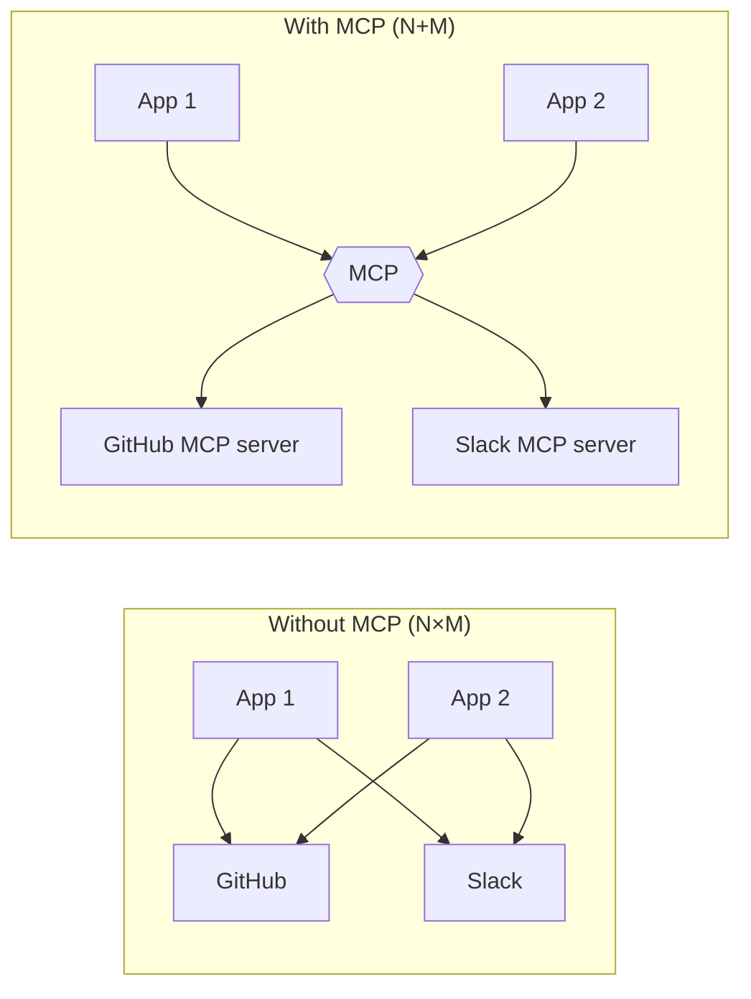
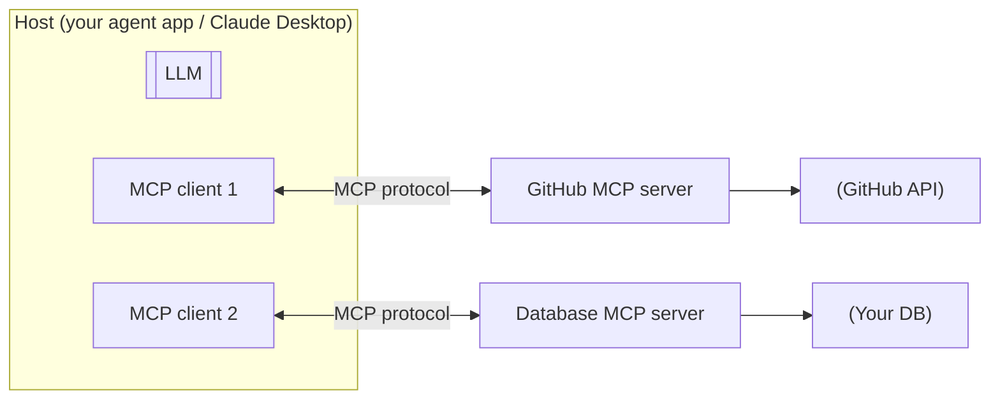
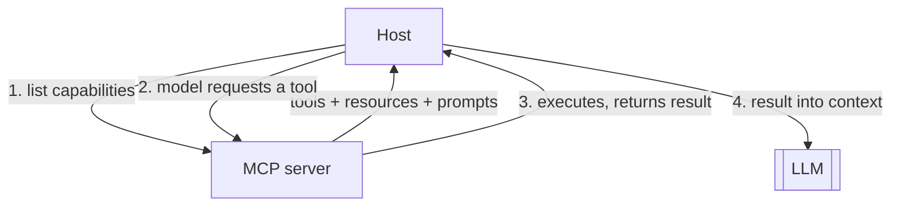
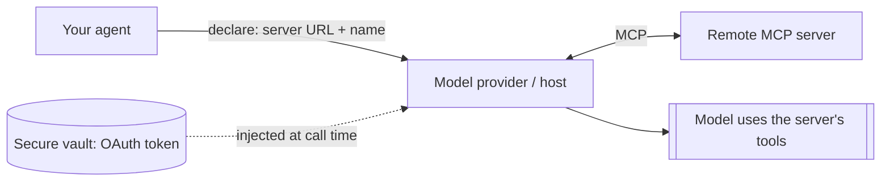

# 11 — MCP (Model Context Protocol)

> MCP is an open standard that lets any AI app connect to any tool or data source through one common interface — "USB-C for AI tools." Instead of writing custom glue for every integration, you point your agent at an MCP server and it gains that server's tools. This chapter explains what MCP is, its architecture, and why it matters.

---

## 1. The Problem in Plain English

In Chapter 4 you wrote tools by hand for one app. But every team was doing that — re-implementing "connect to GitHub," "connect to Slack," "connect to Postgres" separately, in every framework, for every model. It's the classic **N×M integration problem**: N apps × M tools = a combinatorial mess of one-off connectors.

**MCP (Model Context Protocol)** fixes this with a standard. A tool provider writes **one** MCP server (e.g. a GitHub MCP server). Any MCP-compatible app — Claude Desktop, an IDE, your custom agent — can connect to it and instantly use its tools. N + M instead of N × M.

**Analogy — USB-C.** Before USB-C, every device had its own charger and cable. USB-C is one standard port: any charger works with any device. MCP is that universal port between AI applications and the tools/data they need — plug in an MCP server and it just works.

---

## 2. Architecture — Hosts, Clients, Servers

MCP has three roles:

- **Host** — the AI application the user interacts with (Claude Desktop, an IDE, your agent app). It contains one or more clients.
- **Client** — lives inside the host; maintains a 1:1 connection to a server and speaks the MCP protocol.
- **Server** — a program that exposes capabilities (tools, data, prompts) over MCP. It wraps some underlying system (an API, a database, the filesystem).

**Transport:** servers can be **local** (run on your machine, communicate over stdio) or **remote** (run elsewhere, communicate over HTTP/SSE). Remote servers are how hosted integrations (with OAuth) work.

---

## 3. What an MCP Server Exposes

An MCP server can offer three kinds of capability:

| Primitive | What it is | Analogy | Agent use |
|---|---|---|---|
| **Tools** | Functions the model can call (with side effects) | Verbs — "do something" | Same as Chapter 4 tools, but discovered from the server |
| **Resources** | Read-only data the host can load into context | Nouns — "here's some data" | Files, records, docs to ground on |
| **Prompts** | Reusable prompt templates the server provides | Recipes — "use this workflow" | Pre-built interaction patterns |

The most-used primitive is **tools** — connecting an MCP server is, in practice, the standard way to give an agent a whole *set* of tools without hand-writing each one. The client asks the server "what tools do you have?", the server returns their schemas, and the host makes them available to the model exactly like the tools in Chapter 4.

---

## 4. Why MCP Matters

- **Write once, use everywhere.** A tool provider builds one server; every MCP host can use it. Your agent gains new capabilities by *connecting*, not coding.
- **Ecosystem.** There are ready-made MCP servers for GitHub, Slack, Google Drive, Postgres, filesystems, Notion, and hundreds more — plug them in.
- **Decoupling.** Your agent doesn't hard-code integration details. Swap or add servers without touching agent logic.
- **Dynamic discovery.** Tools are discovered at connection time, so a server can add tools and clients pick them up.
- **Standard auth.** Remote servers use standard OAuth flows, so credential handling is consistent (and can be kept out of the model's context).

---

## 5. How Your Agent Uses MCP (concept)

Two ways an agent consumes MCP servers:

1. **The host manages the connection.** Your app runs MCP clients, connects to servers, fetches their tools, and merges them into the tool list it sends the model. When the model calls one, the host routes it to the right server. (Frameworks and SDKs provide helpers to convert MCP tools into the model's native tool format.)
2. **The model provider connects for you.** Some APIs accept an MCP server URL directly — you declare `{server URL + name}` plus a matching toolset entry, and the provider makes the connection server-side, exposing the server's tools to the model. Credentials for remote servers are supplied separately (e.g. via a secure vault), never baked into the agent definition.

**Security note:** because MCP servers can run tools and return data, treat them like any other tool boundary — only connect to servers you trust, keep credentials in a vault (not in prompts), and remember that **data returned by an MCP tool is untrusted input** (a document a server returns could contain a prompt-injection attempt — Chapter 16).

---

## 6. MCP vs Plain Tools vs Frameworks

- **Plain tools (Ch 4)** — you define and execute each tool in your own code. Full control, no standard; good for a handful of app-specific tools.
- **MCP** — a *standard interface* to tools/data provided by servers (yours or third-party). Best when you want reusable, shareable, or third-party integrations.
- **Agent frameworks (Ch 12)** — libraries that orchestrate the loop; most now *speak MCP* so they can consume MCP servers as tool sources.

They layer: a framework runs your agent loop, which uses MCP to pull in tools from servers, some of which you wrote as plain tools underneath.

---

## 7. Failure Scenarios

| Scenario | What happens | Handling |
|---|---|---|
| MCP server unreachable | Tools silently unavailable | Health-check connections; surface the failure; degrade gracefully |
| Untrusted server / tool | Malicious tool or injected data | Only connect trusted servers; treat returned data as untrusted (Ch 16) |
| Credential expired | Auth failures on tool calls | Standard OAuth refresh (vaults auto-refresh); handle re-auth |
| Server exposes too many tools | Model overwhelmed / confused | Limit to needed tools; use tool search for large sets (Ch 19) |
| Huge tool output | Blows context | Servers/hosts offload large results to files + a pointer |
| Version drift between client/server | Protocol mismatch | Pin/verify protocol versions |

---

## ❌ 8. Common Mistakes

- **Thinking MCP is a different kind of AI.** It's just a *standard connector* for tools/data — the tool-use mechanics of Chapter 4 still apply.
- **Connecting untrusted servers.** An MCP server can run code and inject data; vet it like any dependency.
- **Putting credentials in the prompt.** Use a vault; keep secrets out of the model's context.
- **Trusting MCP-returned data as instructions.** It's untrusted input — a prime prompt-injection vector.
- **Dumping every server's full tool set** into the model. Curate; use tool search for big libraries.
- **Reinventing integrations** when a maintained MCP server already exists.

---

## 9. Check Yourself

1. What problem does MCP solve, in "N×M" terms?
2. Name the three MCP roles (host, client, server) and what each does.
3. What three primitives can an MCP server expose, and which is most used?
4. How does MCP relate to the plain tool use from Chapter 4?
5. Why must you treat data returned by an MCP tool as untrusted?

---

## 10. Key Takeaways

- **MCP is an open standard — "USB-C for AI tools"** — that lets any host connect to any tool/data source through one interface, turning N×M integrations into N+M.
- Architecture: **host** (the app) contains **clients**, each connected 1:1 to a **server** that exposes capabilities; servers are local (stdio) or remote (HTTP, with OAuth).
- Servers expose **tools** (functions), **resources** (read-only data), and **prompts** (templates) — tools are the workhorse.
- Under the hood it's still **Chapter 4 tool use**: discover tools → model requests one → host routes to the server → result into context.
- MCP gives you **write-once, use-everywhere integrations** and a large ecosystem of ready servers.
- **Security still applies**: trust the server, vault the credentials, and treat returned data as untrusted (injection risk).

**Next:** *12 — The Frameworks Landscape* — LangGraph, LlamaIndex, CrewAI, and friends: what to use and when.
