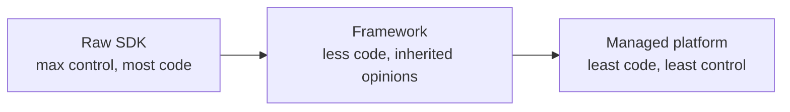
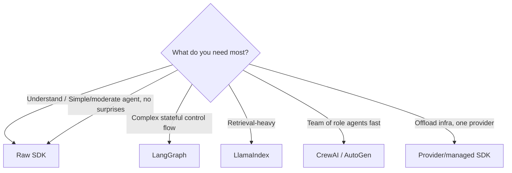

# 12 — The Frameworks Landscape

> You can build agents from the raw API (Chapters 3–4) or use a framework that handles the loop, tools, memory, and orchestration for you. This chapter maps the major options — raw SDK, LangChain/LangGraph, LlamaIndex, CrewAI, AutoGen, the provider agent SDKs — so you can pick the right tool and know what each one is actually doing under the hood.

---

## 1. The Problem in Plain English

Every framework is, at its core, wrapping the same loop you already understand: send messages + tools to the model → if it asks for a tool, run it and feed the result back → repeat until done (Chapters 3–4). What frameworks add is **convenience**: pre-built loop handling, tool abstractions, memory management, retrieval, multi-agent orchestration, tracing, and integrations.

The trade-off is the usual one: **convenience vs. control**. Raw API = maximum control, more code. Framework = less code, but you inherit its abstractions, its opinions, and sometimes its bugs.

**Analogy — cooking from scratch vs. a meal kit vs. a restaurant.** Raw API is cooking from scratch: total control, you understand every step, more work. A framework is a meal kit: ingredients pre-portioned, faster, but you follow their recipe. A fully managed agent platform is a restaurant: you just order. None is "best" — it depends on how much control you need and how much you want to build.

---

## 2. Understand the Raw Loop First

**Build at least one agent from the raw API before adopting a framework.** Otherwise the framework is magic, and when it breaks (it will), you won't know why. You already have the raw loop from Chapters 3–4; Chapter 13 builds a complete one. Once you know what's underneath, a framework is a labor-saver rather than a black box.

> Anthropic's own guidance: start with the simplest thing (direct API calls), add complexity only when it demonstrably improves outcomes. Many teams over-adopt frameworks and end up debugging the abstraction instead of their agent.

---

## 3. The Major Options

### Raw provider SDK (e.g. Anthropic SDK, `anthropic`)
- **What it is:** direct calls to the Messages API; you write the loop.
- **Also:** most SDKs now include a **tool runner** helper that runs the tool loop for you, and beta helpers for structured output and memory — so "raw" doesn't mean "no help."
- **Best for:** understanding, full control, production systems where you want no surprises, simple-to-moderate agents.
- **Cost:** you write orchestration, memory, retrieval yourself (or with small libs).

### LangChain / LangGraph
- **LangChain:** the original, broad toolkit — chains, tools, memory, huge integration catalog. Good for wiring workflow patterns quickly.
- **LangGraph:** its graph-based framework for **stateful, controllable agents** — you model the agent as a graph of nodes/edges with explicit state, loops, branches, and human-in-the-loop checkpoints. The most popular choice for **production agents** that need control.
- **Best for:** complex, stateful, multi-step agents where you want structure but not to hand-roll everything; teams already in the LangChain ecosystem.
- **Cost:** learning curve; heavier abstractions.

### LlamaIndex
- **What it is:** originally a **RAG-first** framework — best-in-class data loading, indexing, retrieval — now with agent capabilities too.
- **Best for:** anything **retrieval/data-heavy** (RAG over big/complex document sets), and agents whose main job is querying knowledge.
- **Cost:** agent orchestration is less its focus than retrieval.

### CrewAI
- **What it is:** a **multi-agent** framework built around "crews" of role-playing agents with tasks and a process (sequential/hierarchical).
- **Best for:** quickly standing up **role-based multi-agent** collaborations ("researcher + writer + editor").
- **Cost:** opinionated multi-agent model; less low-level control.

### Microsoft AutoGen
- **What it is:** a **multi-agent conversation** framework — agents (and humans) talk to each other to solve tasks; strong for code-writing/executing agents and research-y setups.
- **Best for:** experimental multi-agent conversations, human-in-the-loop group chats, research.
- **Cost:** conversation-driven control can be less predictable.

### Provider agent SDKs (OpenAI Agents SDK, Claude Agent SDK, etc.) & managed platforms
- **What they are:** first-party libraries/services for building agents on that provider, often with built-in tools, handoffs, tracing — and **managed** variants where the provider runs the agent loop and hosts a sandbox for tool execution.
- **Best for:** staying in one provider's ecosystem; offloading infrastructure (sandboxes, sessions, scaling) to the provider.
- **Cost:** provider lock-in; less portability.

---

## 4. Comparison at a Glance

| Option | Sweet spot | Control | Best when |
|---|---|---|---|
| **Raw SDK (+ tool runner)** | Understanding & clean production | Highest | You want no surprises; simple–moderate agents |
| **LangChain** | Fast wiring, huge integrations | Medium | Prototyping workflows quickly |
| **LangGraph** | Stateful production agents | High | Complex control flow, loops, HITL checkpoints |
| **LlamaIndex** | RAG / data-heavy | Medium | Retrieval is the core of the app |
| **CrewAI** | Role-based multi-agent | Medium | Quick "team of agents" setups |
| **AutoGen** | Conversational multi-agent | Medium-low | Research, agent group chats, code exec |
| **Provider/managed SDK** | One-ecosystem, offloaded infra | Varies | You want hosted loops/sandboxes, less ops |

---

## 5. How to Choose

Ask, in order:
1. **Do I even need a framework?** For a single agent with a few tools, the raw SDK + its tool runner is often simpler and clearer. Don't add a framework to look sophisticated.
2. **What's the dominant need?** Control flow → LangGraph. Retrieval → LlamaIndex. Multi-agent roles → CrewAI/AutoGen. Offloaded infra → a managed platform.
3. **What's my team already using?** Ecosystem familiarity and integrations matter a lot in practice.
4. **How much lock-in can I accept?** Portable (raw/LangGraph) vs. provider-specific (managed SDKs).

> **They interoperate:** most frameworks speak **MCP** (Chapter 11), so you can pull the same tool servers into any of them. And you can mix — e.g. LangGraph for orchestration with LlamaIndex for retrieval.

---

## 6. Failure Scenarios

| Scenario | What happens | Handling |
|---|---|---|
| Framework hides a bug you can't see | Hard to debug the loop | Know the raw loop; use tracing (Ch 15); drop to raw for the tricky part |
| Over-engineered with a heavy framework | Slow, complex, brittle | Downgrade — use the simplest option that works |
| Framework abstraction fights your need | Endless workarounds | If you're fighting it, switch to raw or another tool |
| Version churn / breaking changes | Upgrades break your agent | Pin versions; keep framework logic thin & swappable |
| Lock-in to a managed platform | Hard to migrate later | Isolate provider-specific code behind your own interface |

---

## ❌ 7. Common Mistakes

- **Adopting a framework before understanding the raw loop.** Build one from scratch first (Ch 13).
- **Choosing by hype, not need.** Match the framework to your dominant requirement.
- **Over-engineering.** A single-agent, few-tool app rarely needs a heavy multi-agent framework.
- **Deep coupling to one framework's abstractions.** Keep your agent logic thin so you can swap.
- **Ignoring MCP.** You often don't need a framework's integration catalog if an MCP server exists.
- **Assuming the framework handles production concerns.** You still own evals, guardrails, observability, cost (Chapters 14–17).

---

## 8. Check Yourself

1. What do all agent frameworks wrap, underneath?
2. Why build a raw-API agent before using a framework?
3. When would you pick LangGraph vs LlamaIndex vs CrewAI?
4. What does a managed agent platform offload for you, and what's the cost?
5. How does MCP reduce your dependence on a framework's integrations?

---

## 9. Key Takeaways

- Every framework wraps the **same loop** (Chapters 3–4); they trade **control for convenience**.
- **Build one agent from the raw SDK first** — then a framework is a labor-saver, not a black box.
- Rough map: **LangGraph** = stateful production control flow; **LlamaIndex** = retrieval-heavy; **CrewAI/AutoGen** = multi-agent; **raw SDK + tool runner** = control & simplicity; **provider/managed SDKs** = offloaded infra, some lock-in.
- **Choose by dominant need + team ecosystem + acceptable lock-in**, not by hype.
- They **interoperate via MCP**, and you still own evals, guardrails, observability, and cost regardless of framework.

**Next:** *13 — Build Your First Agent (hands-on)* — a complete agent from scratch in ~150 lines.
