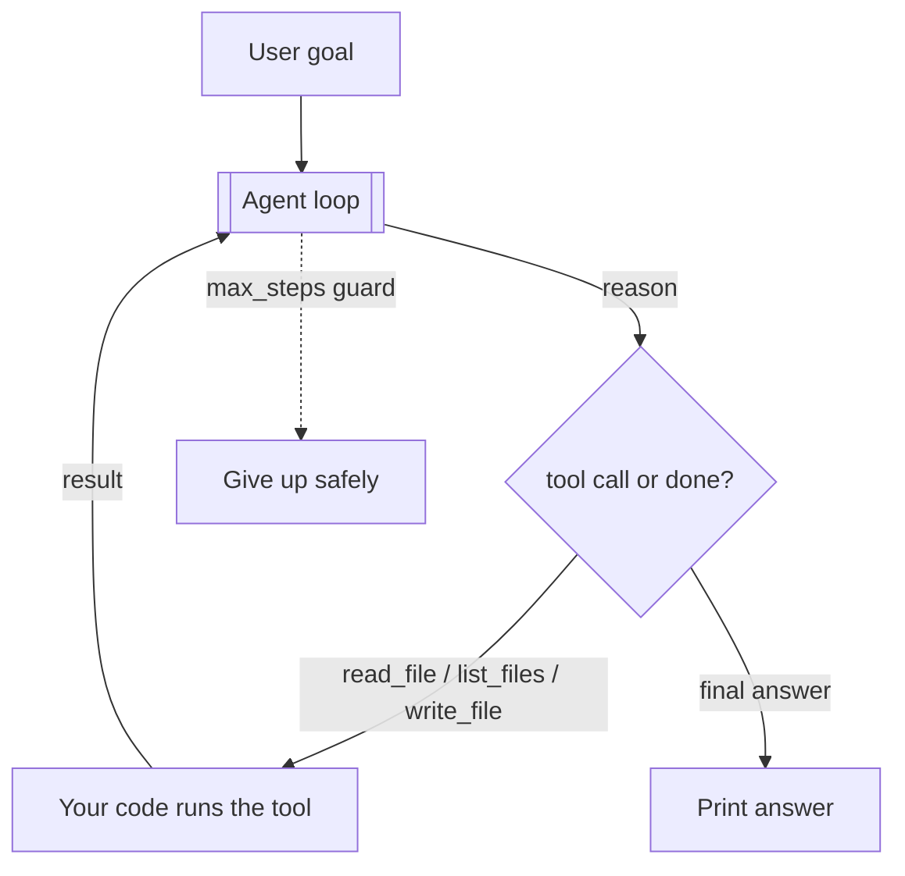
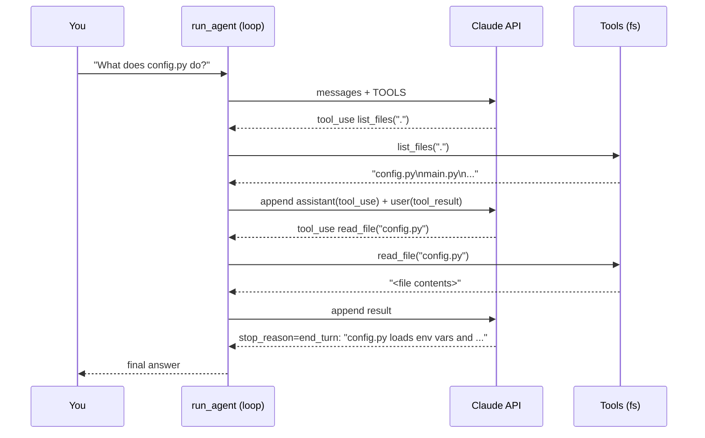

# 13 — Build Your First Agent (Hands-On)

> Everything so far, assembled into one working agent you can read top to bottom. We build a small **file/coding agent** from scratch with the raw Anthropic SDK — the loop, real tools, error handling, and a stop condition — in ~150 lines. This is reference code to *study and then type yourself*; it is not run here.

---

## 1. What We're Building

A command-line agent that can answer questions about a project and make small edits, by giving Claude three tools: **read a file**, **list files**, and **write a file**. You give it a goal ("what does `config.py` do?" or "add a docstring to the `load` function"); it decides which tools to call, in what order, until the goal is met.

This exercises every concept: the **loop** (Ch 3), **tool use** (Ch 4), **short-term memory** as the growing message list (Ch 5), the **system prompt** as its constitution (Ch 8), and a **stop condition** so it can't run forever.



---

## 2. Step 1 — Define the Tools

Each tool is name + description (when to use it) + JSON Schema (Ch 4). Keep descriptions prescriptive.

```python
TOOLS = [
    {
        "name": "list_files",
        "description": "List files in a directory of the project. "
                       "Call this first to discover what files exist before reading them.",
        "input_schema": {
            "type": "object",
            "properties": {
                "directory": {"type": "string", "description": "Directory path, e.g. '.' for the project root"}
            },
            "required": ["directory"],
        },
    },
    {
        "name": "read_file",
        "description": "Read the full contents of a text file. Use before answering questions "
                       "about a file or before editing it.",
        "input_schema": {
            "type": "object",
            "properties": {"path": {"type": "string", "description": "Path to the file"}},
            "required": ["path"],
        },
    },
    {
        "name": "write_file",
        "description": "Overwrite a text file with new contents. Only call this after you have "
                       "read the file and know exactly what the new full contents should be.",
        "input_schema": {
            "type": "object",
            "properties": {
                "path": {"type": "string", "description": "Path to the file"},
                "content": {"type": "string", "description": "The complete new file contents"},
            },
            "required": ["path", "content"],
        },
    },
]
```

---

## 3. Step 2 — Implement the Tools (your code, with safety)

The model only *requests* these; **your code executes them**. Note the safety checks — tool inputs are untrusted model output (Ch 4, Ch 16), so we confine every path to a project root.

```python
import os

PROJECT_ROOT = os.path.abspath("./workspace")   # the agent is sandboxed to here

def _safe_path(path: str) -> str:
    """Resolve path and ensure it stays inside PROJECT_ROOT (blocks ../ traversal)."""
    full = os.path.abspath(os.path.join(PROJECT_ROOT, path))
    if not full.startswith(PROJECT_ROOT + os.sep) and full != PROJECT_ROOT:
        raise ValueError(f"Path escapes project root: {path}")
    return full

def list_files(directory: str) -> str:
    d = _safe_path(directory)
    return "\n".join(sorted(os.listdir(d))) or "(empty)"

def read_file(path: str) -> str:
    with open(_safe_path(path), "r") as f:
        return f.read()

def write_file(path: str, content: str) -> str:
    with open(_safe_path(path), "w") as f:
        f.write(content)
    return f"Wrote {len(content)} chars to {path}"

# dispatcher: map tool name -> function
TOOL_FUNCTIONS = {"list_files": list_files, "read_file": read_file, "write_file": write_file}

def execute_tool(name: str, tool_input: dict) -> tuple[str, bool]:
    """Return (result_text, is_error). Never raise into the loop — return errors as results."""
    try:
        fn = TOOL_FUNCTIONS.get(name)
        if fn is None:
            return f"Unknown tool: {name}", True
        return fn(**tool_input), False
    except Exception as e:                     # validation/IO errors become tool results
        return f"Error running {name}: {e}", True
```

> Returning errors *as tool results* (not raising) is what lets the model see the failure and adapt — the Chapter 4 rule.

---

## 4. Step 3 — The Agent Loop

The heart (Ch 3). The `messages` list is the agent's short-term memory (Ch 5); it grows each turn and is resent every call. We stop when the model stops asking for tools, or when we hit `max_steps`.

```python
import anthropic

client = anthropic.Anthropic()   # reads ANTHROPIC_API_KEY (or an `ant auth login` profile)

SYSTEM_PROMPT = (
    "You are a careful coding assistant working inside a project sandbox.\n"
    "- Discover files with list_files before reading, and read a file before editing it.\n"
    "- When editing, write the COMPLETE new file contents, preserving everything you don't change.\n"
    "- Explain what you did in one or two sentences when finished.\n"
    "- If a request is destructive or outside the sandbox, refuse and say why."
)

def run_agent(goal: str, max_steps: int = 15) -> str:
    messages = [{"role": "user", "content": goal}]

    for step in range(max_steps):
        response = client.messages.create(
            model="claude-opus-4-8",
            max_tokens=4096,
            system=SYSTEM_PROMPT,
            tools=TOOLS,
            messages=messages,
        )

        # No tool requested → this is the final answer. Stop.
        if response.stop_reason != "tool_use":
            return "".join(b.text for b in response.content if b.type == "text")

        # Remember what the model asked for (must append the assistant turn).
        messages.append({"role": "assistant", "content": response.content})

        # Run every requested tool; collect ALL results into ONE user message.
        tool_results = []
        for block in response.content:
            if block.type == "tool_use":
                result, is_error = execute_tool(block.name, block.input)
                print(f"  ↳ {block.name}({block.input}) -> {result[:60]!r}")
                tool_results.append({
                    "type": "tool_result",
                    "tool_use_id": block.id,          # must match the tool_use id
                    "content": result,
                    "is_error": is_error,
                })
        messages.append({"role": "user", "content": tool_results})

    return "Stopped: reached max_steps without finishing."
```



---

## 5. Step 4 — Run It

```python
if __name__ == "__main__":
    print(run_agent("What does config.py do? Then add a one-line docstring to its load() function."))
```

The agent will (roughly): `list_files(".")` → `read_file("config.py")` → reason → `write_file("config.py", <updated>)` → `read_file` again to verify (if the prompt nudges it) → final summary. **You never told it those steps** — it derived them from the goal and the tool results. That's the whole point of an agent.

---

## 6. What to Notice (map back to the theory)

- **The loop is tiny.** ~40 lines of orchestration. Everything powerful (multi-step reasoning, adaptation) emerges from *looping* the model with tools.
- **You execute tools, not the model** (Ch 4). The model's output when it wants a tool is just structured text.
- **`messages` is the memory** (Ch 5). It grows; you resend it; that's the only reason the agent "remembers" earlier steps.
- **The system prompt is the constitution** (Ch 8) — it shaped "read before edit," "write full contents," "refuse destructive."
- **`max_steps` is the safety net** (Ch 3). Remove it and a confused agent loops forever, burning money.
- **Errors are results, not crashes** (Ch 4). The model sees `is_error` and can recover.

---

## 7. Extensions (turn this into a real agent)

Each maps to a later chapter:
- **Add a `run_tests` tool** and let it fix failing tests (evaluator-optimizer, Ch 7/9).
- **Add retrieval** — a `search_docs` tool over a vector DB for grounding (Ch 6).
- **Add human-in-the-loop** — require approval before `write_file` (Ch 16).
- **Swap in the SDK tool runner** — replace the manual loop with `client.beta.messages.tool_runner(...)` once you understand what it hides (Ch 12).
- **Add tracing** — log every step, its tokens, and latency (Ch 15).
- **Compact context** — summarize old tool results when the history gets long (Ch 5/19).

---

## 8. Failure Scenarios (that you'll hit building this)

| Scenario | Cause | Fix |
|---|---|---|
| API rejects the request | Forgot to append the assistant `tool_use` block before the `tool_result` | Append both, paired by `tool_use_id` |
| Agent repeats the same tool forever | No progress + no bound | `max_steps` guard; detect repeated identical calls |
| `tool_result` id mismatch error | Wrong/omitted `tool_use_id` | Copy `block.id` exactly into the result |
| Agent edits a file it never read | Weak system prompt | Add "read before edit" (we did) |
| Path traversal / escapes sandbox | Trusting model-supplied path | `_safe_path()` confinement (we did) |
| Huge file blows context | Reading a giant file | Cap read size; paginate; summarize |

---

## 9. Check Yourself

1. Who runs `read_file` — the model or your code?
2. Why must you append the assistant's `tool_use` block *and* the `tool_result` to `messages`?
3. What makes the agent "remember" what it read two steps ago?
4. Why return tool errors as results with `is_error` instead of raising?
5. What single line prevents an infinite loop, and what happens without it?

---

## 10. Key Takeaways

- A real agent is **~150 lines**: define tools → implement them safely → loop the model, executing tools and feeding results back, until it stops.
- The **loop + tools + growing message list + system prompt + a bound** is the entire architecture — everything else is extension.
- **You execute tools; the model requests them.** Confine inputs (sandbox paths) and return errors as results.
- The `messages` array **is** short-term memory; the system prompt **is** the behavior spec; `max_steps` **is** the safety net.
- Build this once by hand — after that, frameworks (Ch 12) and every advanced pattern will make sense because you know what's underneath.

**Next:** *14 — Evaluation & Testing* — how to know your agent actually works when it's non-deterministic.
