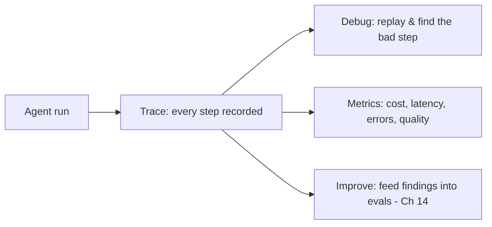
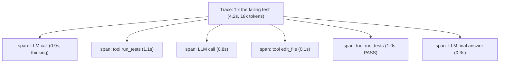
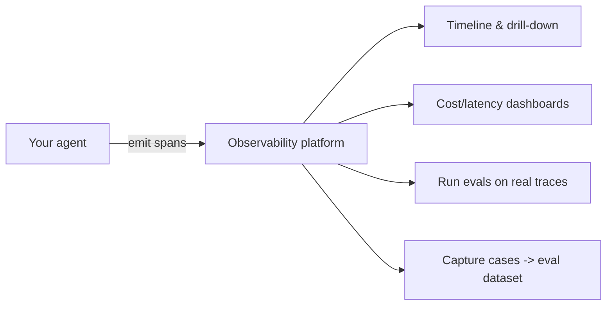
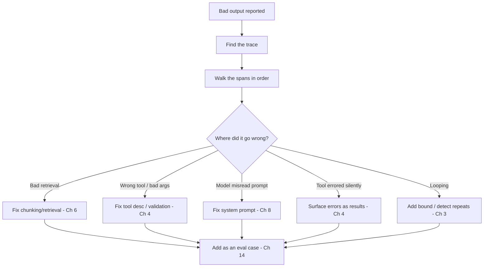

# 15 — Observability & Tracing

> When an agent misbehaves, you need to see *exactly* what it did — every prompt, tool call, result, token, and millisecond. This chapter covers tracing agent runs, the metrics that matter (cost, latency, errors, quality), and the tools that make a multi-step, non-deterministic system debuggable in production.

---

## 1. The Problem in Plain English

A normal bug: read a stack trace, find the line. An agent bug is different — "it gave a weird answer" could come from a bad retrieval, a hallucinated tool call, a prompt the model misread, a tool that errored silently, or step 7 of 12 going sideways. Without visibility into each step, you're guessing.

**Observability** is making the agent's inner workings visible: recording each step of each run so you can reconstruct exactly what happened and why. Because agents are non-deterministic and multi-step, this isn't optional — it's how you debug, improve, and control cost.

**Analogy — a flight data recorder.** You can't reproduce a specific flight to investigate an incident. The black box records everything — altitude, inputs, decisions — so you can replay it afterward. Tracing is your agent's black box: it captures each run so you can replay and diagnose the one that went wrong.

---

## 2. Traces and Spans

The core structure of observability:

- A **trace** = one complete agent run (one user goal → final answer).
- A **span** = one step within it (an LLM call, a tool execution, a retrieval), with a start/end time and metadata.
- Spans **nest**: a sub-agent's whole run is a span containing its own child spans.

For each span you want to capture: **inputs** (the exact prompt/args), **outputs** (the exact response/result), **tokens** (in/out/cached), **latency**, **model & params**, and **errors**. That's enough to replay any decision.

---

## 3. The Metrics That Matter

Track these across runs — they're your dashboards and alerts:

| Category | Metrics | Why |
|---|---|---|
| **Cost** | tokens in/out/cached per run, $ per task, $ per user | Agents can silently get expensive (loops, big contexts) |
| **Latency** | end-to-end time, per-step time, time-to-first-token | User experience; find the slow step |
| **Reliability** | error rate, tool-failure rate, timeout rate, retry rate | Catch breakage and flaky tools |
| **Behavior** | steps per task, tool-call frequency, loop detection | Spot runaway loops and over/under tool use |
| **Quality** | eval scores, user feedback (thumbs), escalation rate | Is it actually good? (ties to Ch 14) |

> **Cost is the sleeper.** A single misbehaving agent stuck in a loop, or one that stuffs huge contexts, can 10× your bill overnight. Track cost per task and alert on outliers.

---

## 4. Tooling

You can start with plain structured logging (every span as a JSON line) — but purpose-built **LLM observability platforms** make traces visual and searchable:

- **LangSmith** (LangChain), **Langfuse** (open-source), **Arize Phoenix**, **Helicone**, **Braintrust**, and others.
- They give you: a **timeline view** of each trace, drill-down into every prompt/response, token & cost accounting, latency breakdowns, and often **eval integration** (run your Ch 14 evals against traced production data) and dataset capture (turn real runs into eval cases).

Many integrate via **OpenTelemetry**, so you can use standard tracing infra. The provider's own `usage` fields (input/output/cache tokens) feed the cost metrics; log them from every call.

---

## 5. Debugging Workflow with Traces

When something's wrong:

The last step matters: every diagnosed failure becomes a **regression eval** so it can't silently return. Observability (what happened) and evaluation (is it good) form a loop — traces feed your eval datasets; evals run on traced data.

---

## 6. Production Considerations

- **Trace everything in dev; sample in prod.** Full tracing of every request can be costly at scale — sample (e.g. 100% of errors, 5% of successes).
- **Redact sensitive data.** Traces capture full prompts/results — scrub PII/secrets before storing (Ch 16).
- **Log the request/trace ID** on every model call so you can correlate a user complaint to an exact trace.
- **Alert on outliers,** not averages — the run that cost 50× or took 30s is the one to see (tail latency; Chapter connections to system-design percentiles).
- **Keep traces long enough** to investigate incidents, short enough to respect retention/privacy policies.

---

## 7. Failure Scenarios

| Scenario | Without observability | With it |
|---|---|---|
| Agent gives wrong answer | Guess-and-check the prompt | Replay the trace, find the exact bad step |
| Bill spikes overnight | Mystery | Cost dashboard shows which agent/loop; alert fired |
| A tool started failing | Silent degradation | Tool-error-rate metric spikes |
| Latency regressed | "It feels slow" | Per-span latency shows the slow hop |
| Can't reproduce a user complaint | Stuck | Trace ID → exact run replayed |
| Prompt change broke something | Found in prod | Compare traces before/after; eval catches it |

---

## ❌ 8. Common Mistakes

- **No tracing until something breaks.** Instrument from day one — you can't debug what you didn't record.
- **Logging only the final answer.** The bug is usually in a middle step; capture every span.
- **Ignoring cost/token metrics.** The silent budget-killer.
- **Averaging away outliers.** The worst run is the one you need to see — track tails, alert on them.
- **Storing raw PII/secrets in traces.** Redact before persisting.
- **Not correlating traces to complaints.** Log request/trace IDs everywhere.
- **Treating observability and evals as separate.** They're a loop — traces become eval cases.

---

## 9. Check Yourself

1. Why is a stack trace insufficient for debugging an agent?
2. What's the difference between a trace and a span?
3. Name four metric categories worth tracking, with one metric each.
4. How do observability and evaluation reinforce each other?
5. Why sample traces in production, and what should you always trace?

---

## 10. Key Takeaways

- **Observability = making the agent's steps visible** so a non-deterministic, multi-step system is debuggable.
- Structure it as **traces** (one run) made of **spans** (each step), capturing inputs, outputs, tokens, latency, model, and errors.
- Track **cost, latency, reliability, behavior, and quality** — and remember **cost is the sleeper metric** (loops/big contexts explode it).
- Use **LLM observability platforms** (LangSmith, Langfuse, Phoenix, …), often via OpenTelemetry, for timelines, drill-down, cost, and eval integration.
- Debug by **walking the trace to the bad step**, fixing the root cause, and **turning the failure into an eval case** — observability and evals form a loop.
- In production: **sample, redact PII, log trace IDs, and alert on outliers.**

**Next:** *16 — Guardrails, Safety & Security* — keeping agents from being tricked or doing harm.
