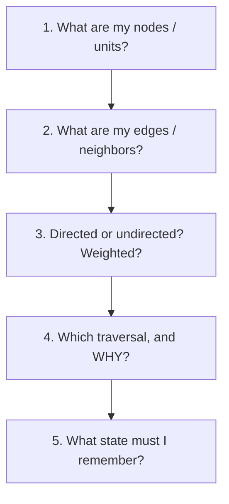

# Coding Patterns — DSA Interview Track

The algorithm/data-structure half of interview prep: recognize the **pattern** behind a problem, then the code writes itself. This track is separate from system design (Tracks 1–2) and agentic AI (Track 3) — it's for the coding round.

> **Philosophy:** don't memorize solutions, memorize *question → pattern → template*. Every chapter is built around a small set of reusable patterns and the interview clues that point to each one.

---

## Chapters

| # | Chapter | Patterns it teaches |
|---|---------|---------------------|
| 01 | Graphs | DFS, BFS, multi-source BFS, connected components, cycle detection, topological sort, Union-Find, boundary/reverse traversal, implicit graphs |

*(More DSA chapters — arrays & two pointers, sliding window, binary search, trees, heaps, dynamic programming, backtracking, intervals — can follow as `02-…`, `03-…`.)*

---

## How to use this track

For every problem, before writing any code, force yourself to answer five questions:

If you can answer those five, the code usually becomes easy. Each chapter drills this loop with active-recall prompts, step-by-step dry runs, and flashcards so the patterns stick.

See `00-start-here/` for how this track fits the whole guide.
