# Graphs — Complete Interview Tutorial

> **Goal:** Build graph intuition so that you can recognize, explain, code, and adapt the major graph patterns behind common interview questions.

This guide is designed around these problems:

1. Number of Islands
2. Max Area of Island
3. Clone Graph
4. Walls and Gates
5. Rotting Oranges
6. Pacific Atlantic Water Flow
7. Surrounded Regions
8. Course Schedule
9. Course Schedule II
10. Graph Valid Tree
11. Number of Connected Components in an Undirected Graph
12. Redundant Connection
13. Word Ladder

The important thing is **not memorizing 13 solutions**. Most of these are combinations of a small number of patterns:

- DFS
- BFS
- Multi-source BFS
- Visited tracking
- Connected components
- Cycle detection
- Topological sorting
- Backtracking-style graph traversal
- Union-Find / DSU
- Shortest path in an unweighted graph

---

# 1. What Is a Graph?

A graph is simply:

> **Objects + relationships between objects**

The objects are called **vertices/nodes**.

The relationships are called **edges**.

Example:

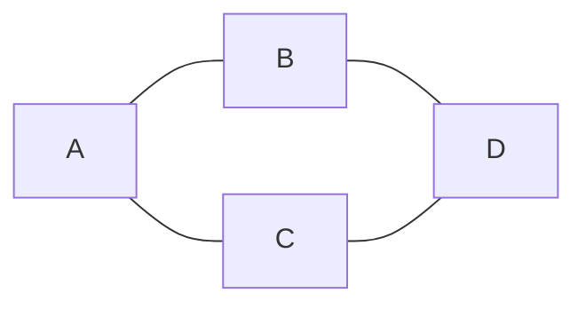

Nodes:

```text
A, B, C, D
```

Edges:

```text
A-B
A-C
B-D
C-D
```

Real-world examples:

| Problem | Node | Edge |
|---|---|---|
| Social network | Person | Friendship |
| Maps | City | Road |
| Internet | Computer | Network connection |
| Course prerequisites | Course | Prerequisite relationship |
| Word Ladder | Word | One-letter transformation |
| Grid | Cell | Adjacent cell |

The biggest interview skill is recognizing when a problem is **secretly a graph**.

---

# 2. The Four Questions to Ask About Any Graph

Whenever you see a graph problem, ask:

### Question 1: Is it directed or undirected?

Undirected:

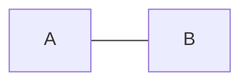

Means both directions:

```text
A -> B
B -> A
```

Directed:

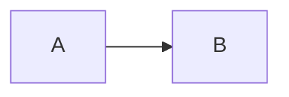

Only:

```text
A -> B
```

---

### Question 2: Is it weighted?

Unweighted:

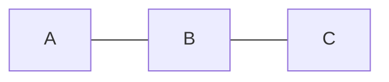

Weighted:

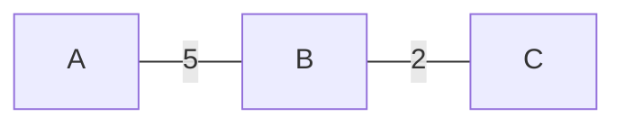

Weights may represent:

- distance
- time
- cost
- latency

---

### Question 3: Do I need to visit nodes?

If yes, think:

```text
DFS
BFS
```

---

### Question 4: What is the question asking?

Usually it is one of:

```text
Reachability?
Connectivity?
Count components?
Shortest path?
Cycle?
Ordering/dependency?
Minimum cost?
```

That question often tells you the algorithm.

---

# 3. Graph Representation

## 3.1 Adjacency Matrix

For:

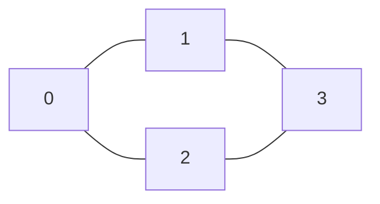

we can use:

```text
    0 1 2 3
0   0 1 1 0
1   1 0 0 1
2   1 0 0 1
3   0 1 1 0
```

`matrix[i][j] = 1` means there is an edge.

### Advantages

- Easy to check whether an edge exists.
- Simple for dense graphs.

### Disadvantages

- Uses `O(V²)` space.

---

# 4. Adjacency List

Most interview problems use adjacency lists.

For:


we can write:

```text
0 -> [1, 2]
1 -> [0, 3]
2 -> [0, 3]
3 -> [1, 2]
```

Java:

```java
List<Integer>[] graph = new ArrayList[n];

for (int i = 0; i < n; i++) {
    graph[i] = new ArrayList<>();
}
```

For every edge `(u, v)` in an undirected graph:

```java
graph[u].add(v);
graph[v].add(u);
```

For a directed graph:

```java
graph[u].add(v);
```

### Complexity

Adjacency list:

```text
Space = O(V + E)
```

This is usually preferable for sparse graphs.

---

# 5. DFS — The Most Important Graph Pattern

DFS means:

> **Depth First Search**

Imagine exploring a maze.

You enter one path and keep going as far as possible.

When you reach a dead end, you go back and try another path.

Example:

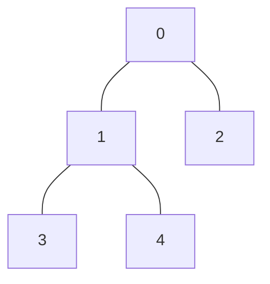

One DFS order could be:

```text
0 -> 1 -> 3 -> 4 -> 2
```

The exact order depends on neighbor ordering.

---

## 5.1 DFS Template

```java
void dfs(int node) {
    visited[node] = true;

    for (int neighbor : graph[node]) {
        if (!visited[neighbor]) {
            dfs(neighbor);
        }
    }
}
```

Mental model:

```text
1. Enter node
2. Mark visited
3. Look at neighbors
4. Visit every unvisited neighbor
5. Recursively repeat
```

---

# 6. Why Do We Need `visited`?

Consider:


If we don't remember visited nodes:

```text
A -> B -> D -> C -> A -> B -> ...
```

We can keep cycling forever.

Therefore:

```java
boolean[] visited = new boolean[n];
```

and:

```java
if (!visited[neighbor]) {
    dfs(neighbor);
}
```

For object/grid problems, a `Set` or mutation of the input can also be used.

---

# 7. BFS — The Second Fundamental Pattern

BFS means:

> **Breadth First Search**

Instead of going deep, BFS explores **level by level**.


Levels:

```text
Level 0: 0
Level 1: 1, 2
Level 2: 3, 4
```

BFS uses a queue.

---

## 7.1 BFS Template

```java
Queue<Integer> queue = new ArrayDeque<>();

queue.offer(start);
visited[start] = true;

while (!queue.isEmpty()) {
    int node = queue.poll();

    for (int neighbor : graph[node]) {
        if (!visited[neighbor]) {
            visited[neighbor] = true;
            queue.offer(neighbor);
        }
    }
}
```

Remember:

> **DFS → recursion/stack**
>
> **BFS → queue**

---

# 8. When Should I Use DFS vs BFS?

### DFS

Think DFS when the problem asks:

- Can I reach something?
- Explore an entire region.
- Count connected regions.
- Find the size of a region.
- Detect cycles.
- Traverse a dependency graph.
- Explore recursively.

### BFS

Think BFS when the problem asks:

- Minimum number of steps.
- Shortest path in an unweighted graph.
- Nearest source.
- Spread over time.
- Level by level.
- Multiple starting points.

The phrase:

> **minimum number of moves/steps in an unweighted graph**

should immediately make you think **BFS**.

---

# 9. Grid = Graph in Disguise

This is one of the most important interview insights.

Consider:

```text
1 1 0
0 1 0
0 0 1
```

Each cell is a node.

Adjacent cells are edges.

For four-direction movement:

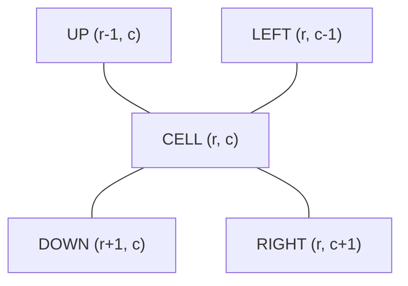

Java:

```java
int[][] directions = {
    {-1, 0},
    {1, 0},
    {0, -1},
    {0, 1}
};
```

Then:

```java
for (int[] dir : directions) {
    int nr = row + dir[0];
    int nc = col + dir[1];
}
```

This pattern appears everywhere.

---

# 10. Grid Traversal Template

```java
void dfs(char[][] grid, int r, int c) {

    if (r < 0 || r >= grid.length ||
        c < 0 || c >= grid[0].length ||
        grid[r][c] != '1') {
        return;
    }

    grid[r][c] = '0';

    dfs(grid, r - 1, c);
    dfs(grid, r + 1, c);
    dfs(grid, r, c - 1);
    dfs(grid, r, c + 1);
}
```

Notice something powerful:

We don't necessarily need a separate `visited`.

We can mark the cell itself as visited.

---

# 11. Problem 1 — Number of Islands

> ### 🧠 Before you code — answer these
> - **Nodes?** Each land cell (`'1'`).
> - **Edges/neighbors?** The 4 adjacent cells (up/down/left/right) that are also land.
> - **Directed or undirected?** Undirected — adjacency goes both ways.
> - **DFS or BFS (and why)?** Either works. We only need to *explore a whole region*, not measure distance, so DFS is simplest.
> - **What state must I remember?** Which cells are already visited. Trick: sink each visited land cell to `'0'` — the grid itself is the visited set.

## Problem

Given a grid containing:

```text
1 = land
0 = water
```

count the number of islands.

Example:

```text
1 1 0 0
1 0 0 1
0 0 1 1
1 1 0 0
```

An island is a group of connected `1`s.

---

## How to Think

This is a **connected components** problem.

Every time we encounter an unvisited land cell:

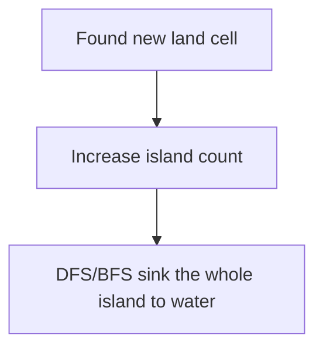

So:

```text
Number of Islands
        =
Number of connected components of land
```

---

## DFS Solution

```java
class Solution {

    public int numIslands(char[][] grid) {

        int rows = grid.length;
        int cols = grid[0].length;
        int islands = 0;

        for (int r = 0; r < rows; r++) {
            for (int c = 0; c < cols; c++) {

                if (grid[r][c] == '1') {
                    islands++;
                    dfs(grid, r, c);
                }
            }
        }

        return islands;
    }

    private void dfs(char[][] grid, int r, int c) {

        if (r < 0 || r >= grid.length ||
            c < 0 || c >= grid[0].length ||
            grid[r][c] != '1') {
            return;
        }

        grid[r][c] = '0';

        dfs(grid, r - 1, c);
        dfs(grid, r + 1, c);
        dfs(grid, r, c - 1);
        dfs(grid, r, c + 1);
    }
}
```

---

## Why Does It Work?

Suppose:

```text
1 1 0
1 0 0
0 0 1
```

Start at `(0,0)`.

DFS consumes:

```text
(0,0)
(0,1)
(1,0)
```

That entire island becomes water.

Later we find `(2,2)`.

That's another island.

Answer:

```text
2
```

---

## 🔎 DFS Dry-Run — watch the call stack sink an island

Nothing cements DFS like tracing it by hand. Take this tiny grid:

```text
1 1 0
1 0 0
0 0 1
```

The outer loops scan row by row. The first `'1'` is `(0,0)`, so `islands` becomes `1` and we call `dfs(0,0)`. Now follow the recursion. Each row below is one `dfs` call; **"stack"** is the chain of calls still open (deepest on the right); the grid mutates as we go.

| Step | Call | Action | Grid after step | Stack (open calls) |
|---|---|---|---|---|
| 1 | `dfs(0,0)` | land → sink to `0` | `0 1 0 / 1 0 0 / 0 0 1` | `(0,0)` |
| 2 | `dfs(-1,0)` up | out of bounds → return | (unchanged) | `(0,0)` |
| 3 | `dfs(1,0)` down | land → sink to `0` | `0 1 0 / 0 0 0 / 0 0 1` | `(0,0) → (1,0)` |
| 4 | `dfs(0,0)` up | already `0` → return | (unchanged) | `(0,0) → (1,0)` |
| 5 | `dfs(2,0)` down | already `0` → return | (unchanged) | `(0,0) → (1,0)` |
| 6 | `dfs(1,-1)` left | out of bounds → return | (unchanged) | `(0,0) → (1,0)` |
| 7 | `dfs(1,1)` right | already `0` → return | (unchanged) | `(0,0) → (1,0)` |
| 8 | `(1,0)` done | pop | (unchanged) | `(0,0)` |
| 9 | `dfs(0,-1)` left | out of bounds → return | (unchanged) | `(0,0)` |
| 10 | `dfs(0,1)` right | land → sink to `0` | `0 0 0 / 0 0 0 / 0 0 1` | `(0,0) → (0,1)` |
| 11 | neighbors of `(0,1)` | all `0` / out of bounds | (unchanged) | `(0,0)` |
| 12 | `(0,0)` done | pop — **island fully sunk** | `0 0 0 / 0 0 0 / 0 0 1` | *(empty)* |

The scan continues. Everything is now water until `(2,2)`, still `'1'`. So `islands` becomes `2`, we `dfs(2,2)` (all neighbors out of bounds or water), and finish.

**Answer: 2.** Notice the key idea: **the grid mutating to `0` IS the visited set.** Once a cell is sunk, every later visit to it returns instantly — that's what stops the infinite loop.

---

## Complexity

For an `R x C` grid:

```text
Time:  O(R * C)
Space: O(R * C) worst-case recursion stack
```

If input mutation is allowed, the grid itself stores visited state.

---

## Interview Pattern

Whenever you see:

> Count groups/regions/clusters/islands

think:

> **Connected Components → DFS/BFS**

---

# 12. Problem 2 — Max Area of Island

> ### 🧠 Before you code — answer these
> - **Nodes?** Each land cell (`1`).
> - **Edges/neighbors?** The 4 adjacent land cells.
> - **Directed or undirected?** Undirected.
> - **DFS or BFS (and why)?** DFS — and this time DFS **returns a number** (the size of the region), which we bubble up and add.
> - **What state must I remember?** Visited cells (sink to `0`), plus the running max area across all islands.

## Problem

Instead of counting islands, return the size of the largest island.

Example:

```text
1 1 0 0
1 1 0 1
0 0 1 1
```

The first island has area `4`.

The second has area `3`.

Answer:

```text
4
```

---

## Key Insight

This is almost the same problem as Number of Islands.

The only difference:

```text
Number of Islands:
    component found → answer++

Max Area:
    component found → calculate its size
```

---

## DFS

```java
class Solution {

    public int maxAreaOfIsland(int[][] grid) {

        int rows = grid.length;
        int cols = grid[0].length;

        int maxArea = 0;

        for (int r = 0; r < rows; r++) {
            for (int c = 0; c < cols; c++) {

                if (grid[r][c] == 1) {
                    maxArea = Math.max(
                        maxArea,
                        dfs(grid, r, c)
                    );
                }
            }
        }

        return maxArea;
    }

    private int dfs(int[][] grid, int r, int c) {

        if (r < 0 || r >= grid.length ||
            c < 0 || c >= grid[0].length ||
            grid[r][c] == 0) {
            return 0;
        }

        grid[r][c] = 0;

        int area = 1;

        area += dfs(grid, r - 1, c);
        area += dfs(grid, r + 1, c);
        area += dfs(grid, r, c - 1);
        area += dfs(grid, r, c + 1);

        return area;
    }
}
```

---

## The Important Pattern

DFS doesn't have to be `void`.

It can **return information about the component**.

Here:

```java
return area;
```

This idea is extremely reusable.

DFS can return:

```text
size
sum
maximum
minimum
boolean
distance
```

depending on the problem.

---

# 13. Problem 3 — Clone Graph

> ### 🧠 Before you code — answer these
> - **Nodes?** The given `Node` objects (each has a `val` and a `neighbors` list).
> - **Edges/neighbors?** Whatever is in each node's `neighbors` list.
> - **Directed or undirected?** Undirected (neighbors are mutual), and it **can contain cycles** — that's the whole difficulty.
> - **DFS or BFS (and why)?** Either. DFS + a HashMap is the cleanest.
> - **What state must I remember?** A `Map<original, clone>` so that when a cycle brings us back to a node we've already cloned, we reuse the clone instead of looping forever.

This problem changes the representation.

Instead of a grid, nodes are objects that point at their neighbors:

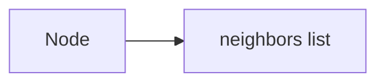

Suppose:

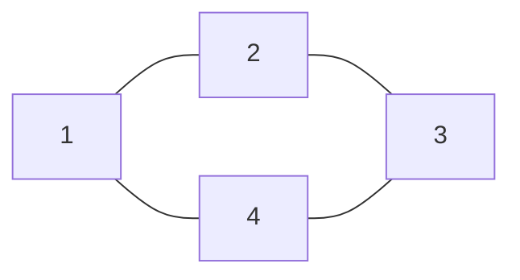

We need to create a completely new graph with the same structure.

---

## The Problem

If we simply recursively clone neighbors, cycles cause infinite recursion.

Example:

```text
1 -> 2
2 -> 1
```

So we need:

```text
original node -> cloned node
```

This is a **mapping**.

---

## Key Idea

Use:

```java
Map<Node, Node> map;
```

Meaning:

```text
original node
      ↓
cloned node
```

When we encounter a node:

1. If already cloned, return the clone.
2. Otherwise create clone.
3. Put it in the map **before** visiting neighbors.
4. Clone neighbors recursively.

---

## DFS Solution

```java
class Solution {

    private Map<Node, Node> map = new HashMap<>();

    public Node cloneGraph(Node node) {

        if (node == null) {
            return null;
        }

        if (map.containsKey(node)) {
            return map.get(node);
        }

        Node clone = new Node(node.val);

        map.put(node, clone);

        for (Node neighbor : node.neighbors) {
            clone.neighbors.add(cloneGraph(neighbor));
        }

        return clone;
    }
}
```

---

## Why Put It in the Map Before Recursing?

This is critical.

Suppose:

```text
1 <-> 2
```

We clone `1`.

```text
map:
1 -> clone1
```

Then clone `2`.

```text
map:
1 -> clone1
2 -> clone2
```

Now `2` sees neighbor `1`.

We ask:

```java
map.containsKey(1)
```

Yes.

Return `clone1`.

No infinite loop.

---

## Interview Pattern

Whenever you see:

> Clone/copy a graph with cycles

think:

```text
HashMap<Original, Clone>
+
DFS/BFS
```

---

# 14. Problem 4 — Walls and Gates

> ### 🧠 Before you code — answer these
> - **Nodes?** Each empty room cell (`INF`).
> - **Edges/neighbors?** The 4 adjacent cells that are empty rooms (not walls).
> - **Directed or undirected?** Undirected.
> - **DFS or BFS (and why)?** **BFS** — we want the *distance to the nearest gate*, and BFS reaches cells in increasing distance order.
> - **What state must I remember?** A queue of cells to expand. A cell is "visited" once it holds a real distance (no longer `INF`).

This is a very important **multi-source BFS** problem.

Imagine:

```text
INF INF INF -1
INF -1 INF -1
INF -1 INF INF
INF INF INF -1
```

Where:

```text
INF = empty room
-1  = wall
0   = gate
```

We need to fill every empty room with distance to the **nearest gate**.

---

## The Wrong Mental Model

You could start from every empty room and search for the nearest gate.

But that's inefficient.

---

## Better Mental Model

Start BFS from **all gates simultaneously**.

Suppose:

```text
0 INF INF
INF INF INF
INF INF 0
```

Put both gates into the queue:

```text
Queue:
[gate1, gate2]
```

They spread outward simultaneously.

This guarantees that the first time an empty cell is reached, it is reached from its nearest gate.

---

## Multi-Source BFS Template

```java
Queue<int[]> queue = new ArrayDeque<>();

for each source:
    queue.offer(source);

while (!queue.isEmpty()) {

    current = queue.poll();

    for each neighbor:

        if neighbor is unvisited:
            update distance
            queue.offer(neighbor);
}
```

---

## Solution

```java
class Solution {

    public void wallsAndGates(int[][] rooms) {

        int rows = rooms.length;
        int cols = rooms[0].length;

        Queue<int[]> queue = new ArrayDeque<>();

        // Add all gates.
        for (int r = 0; r < rows; r++) {
            for (int c = 0; c < cols; c++) {

                if (rooms[r][c] == 0) {
                    queue.offer(new int[]{r, c});
                }
            }
        }

        int[][] directions = {
            {-1, 0},
            {1, 0},
            {0, -1},
            {0, 1}
        };

        while (!queue.isEmpty()) {

            int[] cell = queue.poll();

            int r = cell[0];
            int c = cell[1];

            for (int[] dir : directions) {

                int nr = r + dir[0];
                int nc = c + dir[1];

                if (nr < 0 || nr >= rows ||
                    nc < 0 || nc >= cols ||
                    rooms[nr][nc] != Integer.MAX_VALUE) {
                    continue;
                }

                rooms[nr][nc] = rooms[r][c] + 1;

                queue.offer(new int[]{nr, nc});
            }
        }
    }
}
```

---

## 🔎 BFS Dry-Run — one level = one unit of distance

This is *the* trace to internalize. Take a 3×3 board with two gates (`0`). `INF` is an empty room, and we fill each room with its distance to the nearest gate.

Starting board:

```text
  0 INF INF
INF INF INF
INF INF   0
```

We seed the queue with **all gates at once** (that's the "multi-source" part): `(0,0)` and `(2,2)`, both at distance `0`. Then we peel off the queue one **level** at a time. Everything already in the queue at the start of a level is at the same distance; everything we discover during that level is at distance + 1.

| Level (distance) | Queue at start of level | Cells we fill this level | Board after level |
|---|---|---|---|
| 0 | `(0,0), (2,2)` | (the gates themselves, already 0) | `0 INF INF / INF INF INF / INF INF 0` |
| 1 | `(0,0), (2,2)` | `(0,1)=1, (1,0)=1, (2,1)=1, (1,2)=1` | `0 1 INF / 1 INF 1 / INF 1 0` |
| 2 | `(0,1),(1,0),(2,1),(1,2)` | `(0,2)=2, (1,1)=2, (2,0)=2` | `0 1 2 / 1 2 1 / 2 1 0` |
| 3 | `(0,2),(1,1),(2,0)` | none — all neighbors already filled | *(final)* |

Final answer:

```text
0 1 2
1 2 1
2 1 0
```

Trace the machinery: at level 1 we pull the two gates and stamp their empty neighbors with `1`. At level 2 we pull those `1`-cells and stamp *their* still-empty neighbors with `2`. **Because BFS drains the queue in the order cells were discovered, the first time any room is reached it is reached from its nearest gate — so its first stamp is its correct minimum distance.** A cell like `(1,1)` is adjacent to several `1`-cells; whichever pops first fills it, and later attempts see it is no longer `INF` and skip it. That "skip if already filled" is exactly `visited`.

> **One BFS level = one step of distance.** That single sentence is why BFS gives shortest paths in unweighted graphs — and it is the reason the next problem, Rotting Oranges, can treat *"one level"* as *"one minute."*

---

## The Big Lesson

Whenever the problem says:

> Find distance to the nearest X

and movement has equal cost:

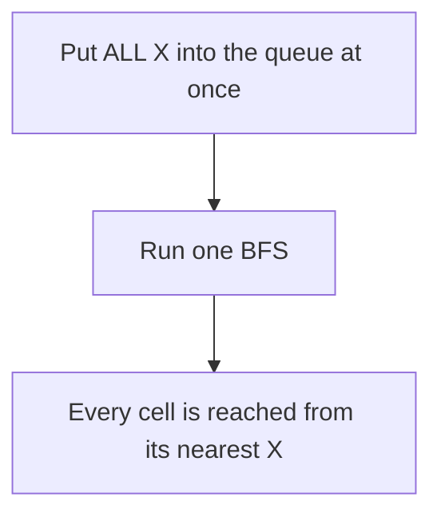

This is **multi-source BFS**.

---

# 15. Problem 5 — Rotting Oranges

> ### 🧠 Before you code — answer these
> - **Nodes?** Each orange cell (fresh `1` or rotten `2`).
> - **Edges/neighbors?** The 4 adjacent orange cells.
> - **Directed or undirected?** Undirected.
> - **DFS or BFS (and why)?** **BFS** — rot spreads outward one ring per minute, which is exactly "level by level."
> - **What state must I remember?** A queue seeded with *all* initially-rotten oranges (multi-source), a `fresh` counter to know when we're done, and a `minutes` counter incremented once per level.

This is almost the same pattern as Walls and Gates.

Grid:

```text
0 = empty
1 = fresh orange
2 = rotten orange
```

Every minute, rotten oranges infect adjacent fresh oranges.

Return the number of minutes until all oranges rot.

---

## Why BFS?

Because:

```text
minute 0 → current rotten oranges
minute 1 → oranges one step away
minute 2 → oranges two steps away
...
```

That is exactly BFS levels.

---

## Why Multi-Source BFS?

There can be multiple rotten oranges initially.

Example:

```text
2 1 1
1 1 1
1 1 2
```

Both `2`s start spreading simultaneously.

So:

```text
All rotten oranges → initial queue
```

---

## Solution

```java
class Solution {

    public int orangesRotting(int[][] grid) {

        int rows = grid.length;
        int cols = grid[0].length;

        Queue<int[]> queue = new ArrayDeque<>();

        int fresh = 0;

        for (int r = 0; r < rows; r++) {
            for (int c = 0; c < cols; c++) {

                if (grid[r][c] == 2) {
                    queue.offer(new int[]{r, c});
                } else if (grid[r][c] == 1) {
                    fresh++;
                }
            }
        }

        int minutes = 0;

        int[][] directions = {
            {-1, 0},
            {1, 0},
            {0, -1},
            {0, 1}
        };

        while (!queue.isEmpty() && fresh > 0) {

            int size = queue.size();

            for (int i = 0; i < size; i++) {

                int[] cell = queue.poll();

                for (int[] dir : directions) {

                    int nr = cell[0] + dir[0];
                    int nc = cell[1] + dir[1];

                    if (nr < 0 || nr >= rows ||
                        nc < 0 || nc >= cols ||
                        grid[nr][nc] != 1) {
                        continue;
                    }

                    grid[nr][nc] = 2;
                    fresh--;

                    queue.offer(new int[]{nr, nc});
                }
            }

            minutes++;
        }

        return fresh == 0 ? minutes : -1;
    }
}
```

---

## Why `size = queue.size()`?

This is one of the most useful BFS techniques.

At the start of a round:

```java
int size = queue.size();
```

Those are exactly the nodes at the current distance/time.

Process only those nodes.

Anything newly added belongs to the **next level**.

Therefore:

```text
one BFS level = one minute
```

---

# 16. Walls and Gates vs Rotting Oranges

They look different, but the algorithmic skeleton is almost identical.

| Problem | Sources | Goal |
|---|---|---|
| Walls and Gates | Gates | Distance to nearest gate |
| Rotting Oranges | Rotten oranges | Time to spread |

Both use:

```text
Multi-source BFS
```

This is exactly the kind of pattern recognition you want in interviews.

---

# 17. Problem 6 — Pacific Atlantic Water Flow

> ### 🧠 Before you code — answer these
> - **Nodes?** Each grid cell (a height).
> - **Edges/neighbors?** The 4 adjacent cells — but reachability is conditional on height.
> - **Directed or undirected?** Effectively **directed**: water flows to a neighbor only if that neighbor is lower or equal.
> - **DFS or BFS (and why)?** DFS (or BFS) — we only need *reachability*, not distance. The clever move is to **reverse** the flow: start from each ocean's boundary and climb *uphill*.
> - **What state must I remember?** Two visited grids — `pacific` and `atlantic`. The answer is their intersection.

This problem is harder because of the direction of reasoning.

You have heights:

```text
height[r][c]
```

Water can flow from a cell to a neighboring cell if the neighbor is **lower or equal**.

We need cells from which water can reach:

```text
Pacific Ocean
Atlantic Ocean
```

---

## The Trap

A natural thought is:

> For every cell, follow water downhill and see which oceans I can reach.

That repeats a lot of work.

---

## Reverse the Problem

Instead ask:

> Which cells can the Pacific Ocean reach if we move **uphill**?

If water can flow:

```text
high -> low
```

then reverse exploration is:

```text
low -> high
```

So:

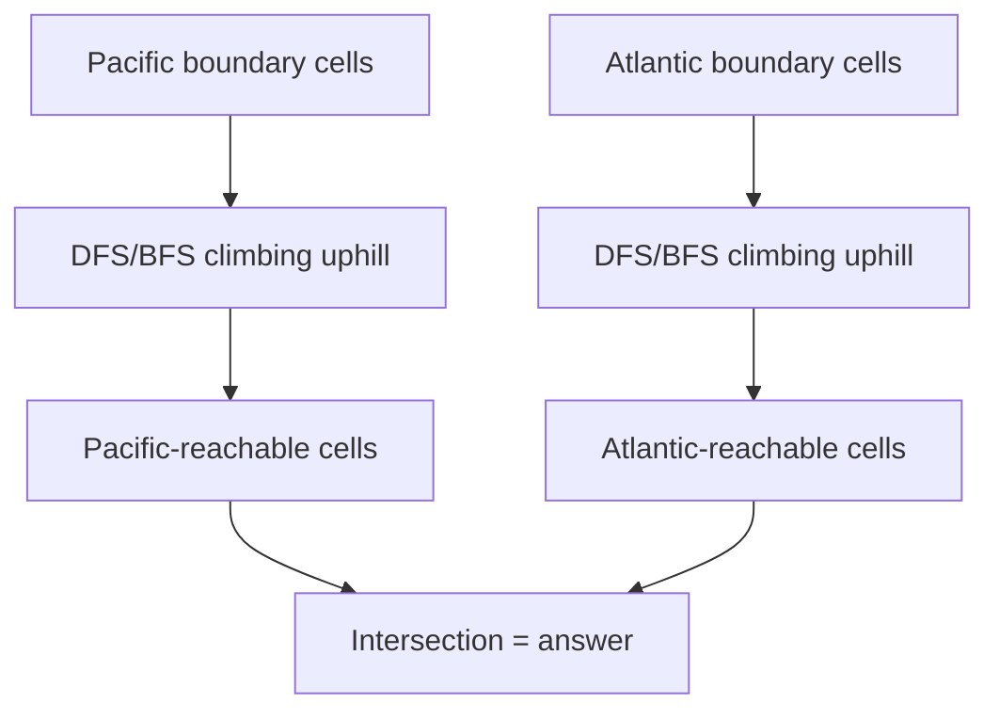

---

## Boundary Cells

Pacific:

```text
top row
left column
```

Atlantic:

```text
bottom row
right column
```

---

## DFS Solution

```java
class Solution {

    public List<List<Integer>> pacificAtlantic(int[][] heights) {

        int rows = heights.length;
        int cols = heights[0].length;

        boolean[][] pacific = new boolean[rows][cols];
        boolean[][] atlantic = new boolean[rows][cols];

        // Pacific: top + left
        for (int c = 0; c < cols; c++) {
            dfs(heights, pacific, 0, c);
            dfs(heights, atlantic, rows - 1, c);
        }

        // Pacific: left + Atlantic: right
        for (int r = 0; r < rows; r++) {
            dfs(heights, pacific, r, 0);
            dfs(heights, atlantic, r, cols - 1);
        }

        List<List<Integer>> result = new ArrayList<>();

        for (int r = 0; r < rows; r++) {
            for (int c = 0; c < cols; c++) {

                if (pacific[r][c] && atlantic[r][c]) {
                    result.add(Arrays.asList(r, c));
                }
            }
        }

        return result;
    }

    private void dfs(
        int[][] heights,
        boolean[][] visited,
        int r,
        int c
    ) {

        if (visited[r][c]) {
            return;
        }

        visited[r][c] = true;

        int[][] directions = {
            {-1, 0},
            {1, 0},
            {0, -1},
            {0, 1}
        };

        for (int[] dir : directions) {

            int nr = r + dir[0];
            int nc = c + dir[1];

            if (nr < 0 || nr >= heights.length ||
                nc < 0 || nc >= heights[0].length) {
                continue;
            }

            // Reverse flow:
            // We can move from current cell to a
            // neighbor that is >= current height.
            if (heights[nr][nc] >= heights[r][c]) {
                dfs(heights, visited, nr, nc);
            }
        }
    }
}
```

---

## The Important Insight

This is a general problem-solving technique:

> **When going from every node to a target is expensive, reverse the direction and start from the targets.**

You will see this pattern again and again.

---

# 18. Problem 7 — Surrounded Regions

> ### 🧠 Before you code — answer these
> - **Nodes?** Each `'O'` cell.
> - **Edges/neighbors?** The 4 adjacent `'O'` cells.
> - **Directed or undirected?** Undirected.
> - **DFS or BFS (and why)?** DFS (or BFS) for reachability. The trick: don't hunt for *surrounded* regions — hunt for *boundary-connected* ones and mark them safe.
> - **What state must I remember?** A "safe" mark (`'S'`) for any `'O'` reachable from the border; then a final pass flips unmarked `'O' → 'X'` and restores `'S' → 'O'`.

Given:

```text
X X X X
X O O X
X X O X
X O X X
```

Capture all `O` regions completely surrounded by `X`.

The answer:

```text
X X X X
X X X X
X X X X
X O X X
```

Why isn't the bottom `O` captured?

Because it touches the boundary.

---

## Key Insight

Instead of asking:

> Which O regions are surrounded?

ask:

> Which O regions can reach the boundary?

Any `O` connected to a boundary `O` is safe.

Everything else can be changed to `X`.

---

## Three Steps

### Step 1

Start DFS/BFS from every boundary `O`.

Mark them safe.

For example use:

```text
'O' -> 'S'
```

---

### Step 2

Scan the board.

```text
O -> X
```

because these are surrounded.

---

### Step 3

Restore:

```text
S -> O
```

---

## Solution

```java
class Solution {

    public void solve(char[][] board) {

        int rows = board.length;
        int cols = board[0].length;

        // Top and bottom
        for (int c = 0; c < cols; c++) {
            dfs(board, 0, c);
            dfs(board, rows - 1, c);
        }

        // Left and right
        for (int r = 0; r < rows; r++) {
            dfs(board, r, 0);
            dfs(board, r, cols - 1);
        }

        // Convert surrounded regions
        for (int r = 0; r < rows; r++) {
            for (int c = 0; c < cols; c++) {

                if (board[r][c] == 'O') {
                    board[r][c] = 'X';
                } else if (board[r][c] == 'S') {
                    board[r][c] = 'O';
                }
            }
        }
    }

    private void dfs(char[][] board, int r, int c) {

        if (r < 0 || r >= board.length ||
            c < 0 || c >= board[0].length ||
            board[r][c] != 'O') {
            return;
        }

        board[r][c] = 'S';

        dfs(board, r - 1, c);
        dfs(board, r + 1, c);
        dfs(board, r, c - 1);
        dfs(board, r, c + 1);
    }
}
```

---

## Pattern

This belongs to:

> **Boundary DFS/BFS**

Whenever you see:

> "Do something to regions except those connected to the boundary"

think:

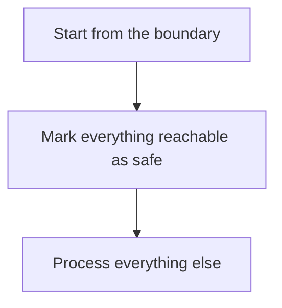

---

# 19. Problem 8 — Course Schedule

> ### 🧠 Before you code — answer these
> - **Nodes?** Each course.
> - **Edges/neighbors?** A directed edge `prereq → course` for every prerequisite pair.
> - **Directed or undirected?** **Directed** — dependencies have a direction.
> - **DFS or BFS (and why)?** Either: DFS with 3 states to detect a cycle, or BFS (Kahn's topological sort). "Can I finish?" = "Is the directed graph acyclic?"
> - **What state must I remember?** For DFS: a per-node state (`unvisited / visiting / done`). For BFS: an `indegree` array and a queue.

You are given:

```text
numCourses
prerequisites
```

Example:

```text
[1, 0]
```

means:

```text
0 -> 1
```

You must take course `0` before course `1`.

Question:

> Can you finish all courses?

---

## What Is This Really?

Courses are nodes.

Prerequisites are directed edges.

Example:

```text
0 -> 1 -> 2
```

This is a **directed graph**.

The key question:

> **Does the directed graph contain a cycle?**

If:

```text
0 -> 1 -> 2 -> 0
```

then impossible.

Why?

```text
0 requires 2
2 requires 1
1 requires 0
```

Circular dependency.

---

# 20. Course Schedule — DFS Cycle Detection

There are three useful states:

```text
0 = unvisited
1 = currently visiting
2 = completely processed
```

Why do we need three states?

Suppose:

```text
0 -> 1 -> 2
```

While exploring `0`, then `1`, then `2`, all are currently in the recursion path.

If `2` points back to `0`:

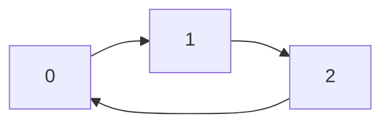

we found a cycle.

That means:

```text
neighbor == state 1
```

is a cycle.

---

## Solution

```java
class Solution {

    public boolean canFinish(
        int numCourses,
        int[][] prerequisites
    ) {

        List<Integer>[] graph = new ArrayList[numCourses];

        for (int i = 0; i < numCourses; i++) {
            graph[i] = new ArrayList<>();
        }

        for (int[] prerequisite : prerequisites) {

            int course = prerequisite[0];
            int prerequisiteCourse = prerequisite[1];

            graph[prerequisiteCourse].add(course);
        }

        int[] state = new int[numCourses];

        for (int course = 0; course < numCourses; course++) {

            if (hasCycle(graph, state, course)) {
                return false;
            }
        }

        return true;
    }

    private boolean hasCycle(
        List<Integer>[] graph,
        int[] state,
        int node
    ) {

        if (state[node] == 1) {
            return true;
        }

        if (state[node] == 2) {
            return false;
        }

        state[node] = 1;

        for (int neighbor : graph[node]) {

            if (hasCycle(graph, state, neighbor)) {
                return true;
            }
        }

        state[node] = 2;

        return false;
    }
}
```

---

# 21. The Three-State Cycle Pattern

Memorize the meaning, not just the numbers:

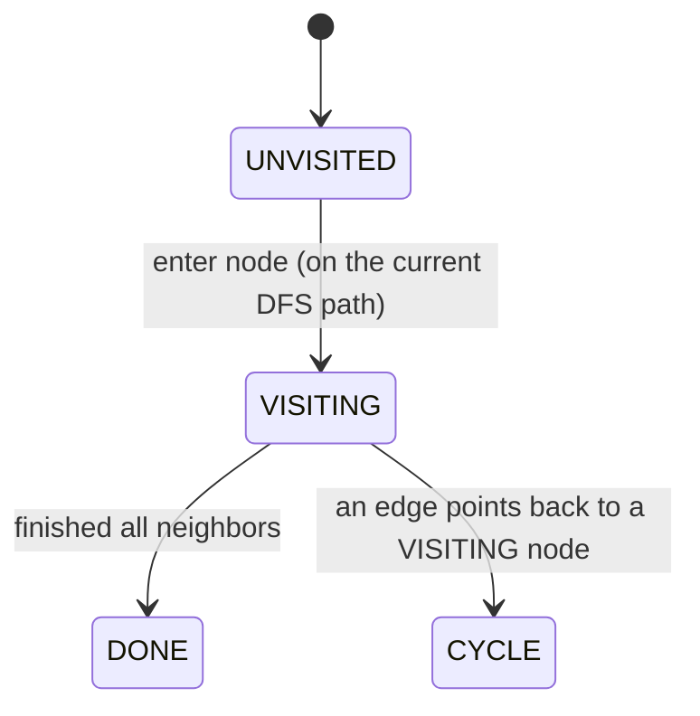

If during DFS:

```text
current -> VISITING node
```

then:

```text
CYCLE
```

If:

```text
current -> DONE node
```

that's fine.

This pattern is specifically useful for **directed graph cycle detection**.

---

# 22. Course Schedule — Kahn's Algorithm

There is another beautiful solution.

Instead of detecting cycles using DFS, use **topological sorting**.

Calculate:

```text
indegree[node]
```

Indegree = number of prerequisites pointing into the node.

Example:

```text
0 -> 1 -> 2
```

Indegrees:

```text
0 = 0
1 = 1
2 = 1
```

Start with nodes having:

```text
indegree = 0
```

Process them.

Remove their outgoing edges.

If everything gets processed:

```text
No cycle
```

If some nodes remain:

```text
Cycle exists
```

---

## Why?

A cycle has no node whose dependency count can reach zero.

---

# 23. Problem 9 — Course Schedule II

> ### 🧠 Before you code — answer these
> - **Nodes?** Each course.
> - **Edges/neighbors?** Directed edge `prereq → course`.
> - **Directed or undirected?** **Directed**.
> - **DFS or BFS (and why)?** BFS via **Kahn's topological sort** — we don't just need yes/no, we need an actual valid *order*.
> - **What state must I remember?** `indegree` per node, a queue of zero-indegree nodes, and an `order` array. If we can't place all `n` courses, there was a cycle → return empty.

This is almost identical to Course Schedule.

Difference:

### Course Schedule

```text
Can I finish?
```

Return:

```text
true / false
```

### Course Schedule II

```text
Give me an order in which I can finish.
```

Return:

```text
[course order]
```

Therefore:

> **Topological Sort**

is the natural solution.

---

## Kahn's Algorithm

```java
class Solution {

    public int[] findOrder(
        int numCourses,
        int[][] prerequisites
    ) {

        List<Integer>[] graph = new ArrayList[numCourses];

        for (int i = 0; i < numCourses; i++) {
            graph[i] = new ArrayList<>();
        }

        int[] indegree = new int[numCourses];

        for (int[] prerequisite : prerequisites) {

            int course = prerequisite[0];
            int prereq = prerequisite[1];

            graph[prereq].add(course);
            indegree[course]++;
        }

        Queue<Integer> queue = new ArrayDeque<>();

        for (int i = 0; i < numCourses; i++) {

            if (indegree[i] == 0) {
                queue.offer(i);
            }
        }

        int[] order = new int[numCourses];
        int index = 0;

        while (!queue.isEmpty()) {

            int course = queue.poll();

            order[index++] = course;

            for (int next : graph[course]) {

                indegree[next]--;

                if (indegree[next] == 0) {
                    queue.offer(next);
                }
            }
        }

        if (index != numCourses) {
            return new int[0];
        }

        return order;
    }
}
```

---

# 24. Topological Sort

Topological ordering is:

> An ordering of vertices in a directed graph such that every prerequisite comes before the dependent node.

Example:

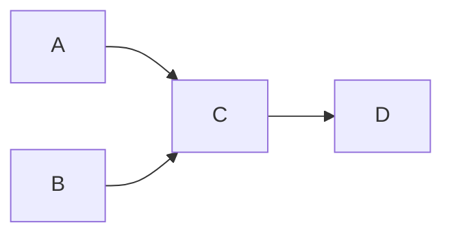

Valid:

```text
A B C D
```

or:

```text
B A C D
```

Invalid:

```text
C A B D
```

because `A` and `B` must come before `C`.

---

## When Should I Think Topological Sort?

Look for words like:

```text
prerequisite
dependency
build order
task ordering
course ordering
package dependency
```

Usually:

> **Directed graph + dependency/order = Topological Sort**

---

# 25. Problem 10 — Graph Valid Tree

> ### 🧠 Before you code — answer these
> - **Nodes?** The `n` given vertices.
> - **Edges/neighbors?** The given undirected `edges`.
> - **Directed or undirected?** **Undirected**.
> - **DFS or BFS (and why)?** Either — we just need to confirm the graph is *connected*. The shortcut: a tree has exactly `n - 1` edges AND is connected.
> - **What state must I remember?** A `visited` array. After one DFS from node 0, if any node is unvisited, it's disconnected → not a tree.

Given:

```text
n nodes
edges
```

determine whether the graph is a valid tree.

---

## What Makes a Graph a Tree?

A tree has:

### 1. All nodes connected

There cannot be disconnected pieces.

### 2. No cycle

There cannot be a loop.

### Important shortcut

For an undirected graph with `n` nodes:

> A graph is a tree iff it has exactly `n - 1` edges and is connected.

So:

```text
edges.length != n - 1
```

immediately means:

```text
false
```

Then we only need to verify connectivity.

---

## DFS Solution

```java
class Solution {

    public boolean validTree(
        int n,
        int[][] edges
    ) {

        if (edges.length != n - 1) {
            return false;
        }

        List<Integer>[] graph = new ArrayList[n];

        for (int i = 0; i < n; i++) {
            graph[i] = new ArrayList<>();
        }

        for (int[] edge : edges) {

            int u = edge[0];
            int v = edge[1];

            graph[u].add(v);
            graph[v].add(u);
        }

        boolean[] visited = new boolean[n];

        dfs(graph, visited, 0);

        for (boolean nodeVisited : visited) {
            if (!nodeVisited) {
                return false;
            }
        }

        return true;
    }

    private void dfs(
        List<Integer>[] graph,
        boolean[] visited,
        int node
    ) {

        visited[node] = true;

        for (int neighbor : graph[node]) {

            if (!visited[neighbor]) {
                dfs(graph, visited, neighbor);
            }
        }
    }
}
```

Because we already know:

```text
edges = n - 1
```

connectivity is enough.

---

# 26. Problem 11 — Number of Connected Components

> ### 🧠 Before you code — answer these
> - **Nodes?** The `n` given vertices.
> - **Edges/neighbors?** The given undirected `edges`.
> - **Directed or undirected?** **Undirected**.
> - **DFS or BFS (and why)?** Either. This is the *pure* connected-components pattern: count how many separate pieces exist.
> - **What state must I remember?** A `visited` array and a `components` counter. Each time you find an unvisited node, that's a new component — increment, then flood-fill it.

Example:

```mermaid
flowchart LR
    0 --- 1
    2 --- 3
    4
```

There are:

```text
3 components
```

---

## Pattern

This is exactly:

> **Count connected components**

Algorithm:

```text
answer = 0

for every node:
    if not visited:
        answer++
        DFS/BFS(node)
```

---

## Solution

```java
class Solution {

    public int countComponents(
        int n,
        int[][] edges
    ) {

        List<Integer>[] graph = new ArrayList[n];

        for (int i = 0; i < n; i++) {
            graph[i] = new ArrayList<>();
        }

        for (int[] edge : edges) {

            int u = edge[0];
            int v = edge[1];

            graph[u].add(v);
            graph[v].add(u);
        }

        boolean[] visited = new boolean[n];

        int components = 0;

        for (int i = 0; i < n; i++) {

            if (!visited[i]) {

                components++;

                dfs(graph, visited, i);
            }
        }

        return components;
    }

    private void dfs(
        List<Integer>[] graph,
        boolean[] visited,
        int node
    ) {

        visited[node] = true;

        for (int neighbor : graph[node]) {

            if (!visited[neighbor]) {
                dfs(graph, visited, neighbor);
            }
        }
    }
}
```

---

# 27. Number of Islands vs Connected Components

These are the same underlying pattern.

### Number of Islands

Nodes:

```text
land cells
```

Edges:

```text
adjacent land cells
```

### Connected Components

Nodes:

```text
graph vertices
```

Edges:

```text
given graph edges
```

Both become:

```text
for every unvisited node:
    answer++
    DFS/BFS
```

This is an important pattern-recognition milestone.

---

# 28. Problem 12 — Redundant Connection

> ### 🧠 Before you code — answer these
> - **Nodes?** The graph's vertices (numbered `1..n`).
> - **Edges/neighbors?** Given edges, added one at a time.
> - **Directed or undirected?** **Undirected**.
> - **DFS or BFS (and why)?** *Neither* is the slick answer — use **Union-Find (DSU)**. As we add each edge, if both endpoints are already in the same component, that edge closes a cycle → it's the redundant one.
> - **What state must I remember?** A `parent[]` array. `find` returns a node's root; `union` merges two roots.

You are given edges that originally formed a tree, but one extra edge was added.

Example:

```mermaid
flowchart LR
    1 --- 2
    1 --- 3
    2 --- 3
```

Suppose edges are:

```text
[1,2]
[1,3]
[2,3]
```

The last edge creates a cycle.

Return:

```text
[2,3]
```

---

# 29. Why Union-Find?

This is a perfect use case for:

> **Disjoint Set Union (DSU)**

DSU keeps track of which nodes belong to the same connected component.

Initially:

```text
1    2    3
```

Every node is its own component.

Process:

```text
[1,2]
```

Now:

```text
{1,2}    {3}
```

Process:

```text
[1,3]
```

Now:

```text
{1,2,3}
```

Process:

```text
[2,3]
```

Both are already in:

```text
{1,2,3}
```

Therefore adding this edge creates a cycle.

That's the redundant edge.

---

# 30. DSU Structure

We maintain:

```java
parent[i]
```

Initially:

```text
parent[i] = i
```

Meaning each node is its own parent.

---

## Find

```java
int find(int x)
```

returns the representative/root of the component.

---

## Union

```java
union(a, b)
```

connects their components.

If:

```text
find(a) == find(b)
```

then they already belong to the same component.

Adding the edge creates a cycle.

---

# 31. Redundant Connection Solution

```java
class Solution {

    int[] parent;

    public int[] findRedundantConnection(int[][] edges) {

        int n = edges.length;

        parent = new int[n + 1];

        for (int i = 0; i <= n; i++) {
            parent[i] = i;
        }

        for (int[] edge : edges) {

            int u = edge[0];
            int v = edge[1];

            if (find(u) == find(v)) {
                return edge;
            }

            union(u, v);
        }

        return new int[0];
    }

    private int find(int x) {

        if (parent[x] != x) {
            parent[x] = find(parent[x]);
        }

        return parent[x];
    }

    private void union(int a, int b) {

        int rootA = find(a);
        int rootB = find(b);

        if (rootA != rootB) {
            parent[rootA] = rootB;
        }
    }
}
```

---

# 32. DSU Optimization

The basic DSU works well, but two optimizations make it extremely efficient.

### Path Compression

```java
parent[x] = find(parent[x]);
```

This flattens the tree.

### Union by Rank/Size

Instead of arbitrarily attaching one root to another, attach the smaller tree under the larger tree.

Typical complexity becomes almost constant:

```text
O(α(n))
```

where `α` is the inverse Ackermann function.

For practical interview purposes:

> **Almost O(1) per operation.**

---

# 33. When Should I Use Union-Find?

Think DSU when:

```text
Undirected graph
+
Repeatedly adding edges
+
Need to know whether two nodes are already connected
```

Typical problems:

- Redundant Connection
- Number of connected components
- Network connectivity
- Minimum spanning tree / Kruskal

---

# 34. Problem 13 — Word Ladder

> ### 🧠 Before you code — answer these
> - **Nodes?** Each word (including `beginWord`).
> - **Edges/neighbors?** Two words are neighbors if they differ by exactly **one letter** — the graph is *implicit*, built from a rule rather than handed to you.
> - **Directed or undirected?** Undirected.
> - **DFS or BFS (and why)?** **BFS** — we want the *fewest transformations* (shortest path), and every edge costs 1.
> - **What state must I remember?** A `visited` set, a queue, and a `level` counter (BFS level = number of words in the chain so far).

This is one of the most important BFS problems.

Suppose:

```text
beginWord = "hit"
endWord   = "cog"
```

Word list:

```text
hot
dot
dog
lot
log
cog
```

One-letter transformation:

```mermaid
flowchart LR
    hit --> hot --> dot --> dog --> cog
```

Answer:

```text
5
```

The sequence includes both beginning and ending words.

---

# 35. The Hidden Graph

This problem does not explicitly give edges.

But we can define:

```text
Each word = node
```

Two words are connected if:

> They differ by exactly one character.

For example:

```text
hot
dot
```

differ in one position.

Therefore:

```mermaid
flowchart LR
    hot --- dot
```

Now the problem becomes:

> Find the shortest path from `beginWord` to `endWord`.

Because every transformation costs one step:

> **BFS**

---

# 36. The Naive Approach

For every word, compare it against every other word.

If there are:

```text
N words
word length = L
```

this can be expensive.

Instead, generate all possible one-letter transformations.

For:

```text
hot
```

change each position:

```text
aot
bot
cot
...
```

then:

```text
hoa
hob
hoc
...
```

and:

```text
hta
htb
htc
...
```

If a generated word exists in the dictionary, it is a neighbor.

---

# 37. Word Ladder Solution

```java
class Solution {

    public int ladderLength(
        String beginWord,
        String endWord,
        List<String> wordList
    ) {

        Set<String> dictionary = new HashSet<>(wordList);

        if (!dictionary.contains(endWord)) {
            return 0;
        }

        Queue<String> queue = new ArrayDeque<>();

        queue.offer(beginWord);

        Set<String> visited = new HashSet<>();
        visited.add(beginWord);

        int level = 1;

        while (!queue.isEmpty()) {

            int size = queue.size();

            for (int i = 0; i < size; i++) {

                String word = queue.poll();

                if (word.equals(endWord)) {
                    return level;
                }

                char[] chars = word.toCharArray();

                for (int j = 0; j < chars.length; j++) {

                    char original = chars[j];

                    for (char ch = 'a'; ch <= 'z'; ch++) {

                        if (ch == original) {
                            continue;
                        }

                        chars[j] = ch;

                        String next = new String(chars);

                        if (dictionary.contains(next) &&
                            !visited.contains(next)) {

                            visited.add(next);
                            queue.offer(next);
                        }
                    }

                    chars[j] = original;
                }
            }

            level++;
        }

        return 0;
    }
}
```

---

# 38. Why BFS Is Guaranteed to Find the Shortest Word Ladder

Suppose:

```text
hit
```

is level 1.

All one-change words are:

```text
level 2
```

All two-change words:

```text
level 3
```

etc.

The first time we reach:

```text
cog
```

we have found the shortest number of transformations.

This is exactly the BFS shortest-path property.

---

# 39. Word Ladder Pattern

Whenever a problem says:

> Minimum number of transformations

and every transformation has equal cost:

```text
BFS
```

Examples beyond Word Ladder:

```text
minimum moves in a board
minimum knight moves
minimum mutations
minimum state transitions
```

The "nodes" may be states rather than physical objects.

---

# 40. The Most Important Graph Patterns From These 13 Problems

Now step back.

These 13 questions collapse into a handful of patterns.

---

## Pattern 1 — Connected Components

Problems:

```text
Number of Islands
Max Area of Island
Number of Connected Components
Graph Valid Tree
```

Template:

```java
for every node:

    if not visited:

        answer++;

        DFS/BFS(node);
```

If you need size:

```java
area = DFS(node);
```

---

# 41. Pattern 2 — Basic DFS

Used in:

```text
Number of Islands
Max Area of Island
Surrounded Regions
Pacific Atlantic
Course Schedule
```

Mental model:

```mermaid
flowchart TD
    A["Enter node"] --> B["Mark visited"]
    B --> C["Explore neighbors"]
    C --> D["Return"]
```

---

# 42. Pattern 3 — Basic BFS

Used when exploring level by level.

Template:

```java
Queue<Node> queue = new ArrayDeque<>();

queue.offer(start);
visited.add(start);

while (!queue.isEmpty()) {

    Node current = queue.poll();

    for (Node neighbor : neighbors(current)) {

        if (!visited.contains(neighbor)) {

            visited.add(neighbor);
            queue.offer(neighbor);
        }
    }
}
```

---

# 43. Pattern 4 — Multi-Source BFS

Problems:

```text
Walls and Gates
Rotting Oranges
```

Template:

```mermaid
flowchart TD
    A["Put ALL starting points into the queue"] --> B["BFS"]
    B --> C["Expand simultaneously"]
```

Use this when the question involves:

> distance/time to the nearest source.

---

# 44. Pattern 5 — Boundary Traversal

Problem:

```text
Surrounded Regions
Pacific Atlantic
```

General idea:

> Instead of checking every cell's relationship to the boundary, start from the boundary and discover what can reach it.

This can transform an apparently difficult problem into simple DFS/BFS.

---

# 45. Pattern 6 — Reverse the Direction

Problem:

```text
Pacific Atlantic
```

Original:

```text
cell → ocean
```

Reverse:

```text
ocean → cell
```

Then explore in reverse conditions.

This is a very powerful technique:

> **If forward exploration repeats work, try reversing the graph.**

---

# 46. Pattern 7 — Directed Cycle Detection

Problem:

```text
Course Schedule
```

Three states:

```text
0 = unvisited
1 = visiting
2 = done
```

Cycle:

```text
edge → node currently visiting
```

Think:

> **Back edge to the current DFS path = cycle.**

---

# 47. Pattern 8 — Topological Sort

Problems:

```text
Course Schedule
Course Schedule II
```

Use when:

```text
Directed graph
+
Dependencies
+
Need ordering
```

Kahn's algorithm:

```mermaid
flowchart TD
    A["Calculate indegrees"] --> B["Queue all indegree-0 nodes"]
    B --> C["Remove/process a node"]
    C --> D["Decrease each neighbor's indegree"]
    D --> E["New zero-indegree nodes enter the queue"]
    E --> C
```

If not all nodes are processed:

```text
Cycle
```

---

# 48. Pattern 9 — Union-Find

Problem:

```text
Redundant Connection
```

Think:

> "Are these two nodes already connected?"

If yes:

```text
adding this edge creates a cycle
```

DSU is particularly useful for dynamic connectivity.

---

# 49. Pattern 10 — Implicit Graph

Problem:

```text
Word Ladder
```

The graph isn't explicitly given.

You construct neighbors from rules.

Examples:

```text
Word → one-letter mutations
Puzzle state → legal moves
Board position → legal next positions
Number → allowed transitions
```

Important interview skill:

> **A graph doesn't have to look like a graph.**

---

# 50. A Graph Interview Decision Tree

When you see a new graph question, run this mental checklist.

```mermaid
flowchart TD
    START(["New graph question"]) --> REL{"Relationship between entities?"}
    REL -->|Yes| GRID{"Is it a grid?"}
    GRID -->|Yes| CELLS["Treat each cell as a node"]
    GRID -->|No| DIR{"Directed?"}
    DIR -->|"Yes: dependency / cycle / order"| DEP{"Cycle or ordering?"}
    DEP -->|Cycle| C3["DFS with 3 states"]
    DEP -->|Ordering| TOPO["Topological Sort"]
    DIR -->|No| CONN{"Asking for connectivity?"}
    CONN -->|Yes| DFSBFS["DFS / BFS"]
    CONN -->|"Repeated dynamic connectivity"| DSU["Union-Find (DSU)"]
    CONN -->|No| SP{"Shortest path?"}
    SP -->|"Unweighted"| BFS["BFS"]
    SP -->|"Weighted"| DIJ["Dijkstra / other shortest-path"]
    SP -->|"Multiple starting points"| MSB["Multi-source BFS"]
```

---

# 51. Complexity Cheat Sheet

Let:

```text
V = number of vertices
E = number of edges
R = number of grid rows
C = number of grid columns
```

### DFS

```text
Time:  O(V + E)
Space: O(V)
```

### BFS

```text
Time:  O(V + E)
Space: O(V)
```

### Grid DFS/BFS

```text
Time:  O(R * C)
Space: O(R * C) worst case
```

### Topological Sort

```text
Time:  O(V + E)
Space: O(V + E)
```

### Union-Find

Approximately:

```text
Time: O(E * α(V))
```

which is effectively near-linear.

---

# 52. Common Interview Mistakes

## Mistake 1 — Forgetting visited

Without visited:

```text
cycles
repeated work
infinite traversal
```

---

## Mistake 2 — Marking visited too late in BFS

Bad:

```java
queue.offer(neighbor);

// later
visited.add(neighbor);
```

The same node can be added multiple times.

Prefer:

```java
visited.add(neighbor);
queue.offer(neighbor);
```

Mark it when you enqueue/discover it.

---

## Mistake 3 — Using DFS for shortest path

For an unweighted graph:

```text
shortest path → BFS
```

DFS may find a path, but not necessarily the shortest one without additional work.

---

## Mistake 4 — Treating directed and undirected cycles the same

Undirected graphs require special parent handling.

Directed graphs often use:

```text
unvisited / visiting / done
```

Do not mix these concepts.

---

## Mistake 5 — Missing multi-source BFS

If multiple sources spread simultaneously:

```text
put all sources into queue initially
```

Don't run a separate BFS from each source unless there is a specific reason.

---

## Mistake 6 — Not recognizing hidden graphs

Word transformations, grids, game states, dependencies, and network states can all represent graphs.

---

# 53. Undirected Cycle Detection

This is worth learning because it differs from Course Schedule.

Suppose:

```mermaid
flowchart LR
    0 --- 1
    0 --- 2
    1 --- 2
```

During DFS from `0`, when `1` sees `0`, that does **not** automatically mean cycle.

Why?

Because the edge:

```text
0 -- 1
```

naturally appears in both adjacency lists.

We need to remember the parent.

---

## Template

```java
boolean dfs(
    int node,
    int parent,
    List<Integer>[] graph,
    boolean[] visited
) {

    visited[node] = true;

    for (int neighbor : graph[node]) {

        if (!visited[neighbor]) {

            if (dfs(neighbor, node, graph, visited)) {
                return true;
            }

        } else if (neighbor != parent) {

            return true;
        }
    }

    return false;
}
```

The key condition:

```java
neighbor != parent
```

---

# 54. Directed vs Undirected Cycle Detection

Remember this table:

| Graph | Common DFS cycle technique |
|---|---|
| Undirected | `neighbor != parent` |
| Directed | `visited / visiting / done` |

This distinction is extremely important.

---

# 55. A Better Way to Memorize Graph Algorithms

Don't memorize code.

Memorize the **question → pattern** mapping.

```mermaid
flowchart TD
    Q1["How many islands?"] --> A1["Connected components → DFS/BFS"]
    Q2["How large is the island?"] --> A2["DFS returns size"]
    Q3["Clone graph?"] --> A3["Original→clone map + DFS/BFS"]
    Q4["Nearest gate?"] --> A4["Multi-source BFS"]
    Q5["How long until all oranges rot?"] --> A5["Multi-source BFS (level = time)"]
    Q6["Can this cell reach both oceans?"] --> A6["Reverse boundary traversal + intersection"]
    Q7["Capture surrounded regions?"] --> A7["Boundary DFS/BFS"]
    Q8["Can I finish courses?"] --> A8["Directed cycle detection"]
    Q9["Give me course order"] --> A9["Topological sort"]
    Q10["Is this a tree?"] --> A10["n-1 edges + connected"]
    Q11["How many components?"] --> A11["DFS/BFS from every unvisited node"]
    Q12["Which edge creates a cycle?"] --> A12["Union-Find"]
    Q13["Minimum word transformations?"] --> A13["Implicit graph + BFS"]
```

---

# 📚 Master Templates (one place for all of them)

The next few sections are your **single reference for every reusable template** in this guide. If you can reproduce these seven templates from memory, you can code all 13 problems. Everything earlier was teaching *why*; this is the *what to write*.

## 56. The Master DFS Template

For normal graphs:

```java
void dfs(int node) {

    if (visited[node]) {
        return;
    }

    visited[node] = true;

    for (int neighbor : graph[node]) {
        dfs(neighbor);
    }
}
```

For grids:

```java
void dfs(int r, int c) {

    if (outOfBounds || invalid) {
        return;
    }

    markVisited();

    for (direction : directions) {
        dfs(nextRow, nextCol);
    }
}
```

---

## 57. The Master BFS Template

```java
Queue<Node> queue = new ArrayDeque<>();

queue.offer(start);
visited.add(start);

while (!queue.isEmpty()) {

    Node current = queue.poll();

    for (Node neighbor : neighbors(current)) {

        if (!visited.contains(neighbor)) {

            visited.add(neighbor);
            queue.offer(neighbor);
        }
    }
}
```

---

## 58. The Master Multi-Source BFS Template

```java
Queue<Node> queue = new ArrayDeque<>();

for (Node source : sources) {
    queue.offer(source);
    visited.add(source);
}

while (!queue.isEmpty()) {

    Node current = queue.poll();

    for (Node neighbor : neighbors(current)) {

        if (!visited.contains(neighbor)) {

            visited.add(neighbor);
            queue.offer(neighbor);
        }
    }
}
```

The only difference from normal BFS:

```text
one source
```

becomes:

```text
many initial sources
```

---

## 59. The Master Connected Components Template

```java
int components = 0;

for (int node = 0; node < n; node++) {

    if (!visited[node]) {

        components++;

        dfs(node);
    }
}
```

This tiny pattern solves a huge family of questions.

---

## 60. The Master Topological Sort Template

```java
calculate indegree

Queue<Integer> queue = new ArrayDeque<>();

for every node:
    if indegree[node] == 0:
        queue.offer(node)

while (!queue.isEmpty()) {

    node = queue.poll();

    process(node);

    for neighbor:
        indegree[neighbor]--;

        if indegree[neighbor] == 0:
            queue.offer(neighbor);
}
```

Then:

```java
if (processedCount != n) {
    // cycle
}
```

---

## 61. The Master Union-Find Template

```java
int find(int x) {
    if (parent[x] != x) {
        parent[x] = find(parent[x]);
    }

    return parent[x];
}

boolean union(int a, int b) {

    int rootA = find(a);
    int rootB = find(b);

    if (rootA == rootB) {
        return false;
    }

    parent[rootA] = rootB;

    return true;
}
```

Interpret:

```mermaid
flowchart TD
    A["union() returns false"] --> B["The two nodes were already connected"]
    B --> C["This edge created a cycle"]
```

---

## 61.5 Beyond these 13 problems

These 13 problems cover the core, but the decision tree above points at a few named algorithms you should at least *recognize*. You don't need to memorize their code now — just know the name and when it applies, so the reference isn't a dead-end:

| Algorithm | When it applies (the trigger phrase) |
|---|---|
| **Dijkstra** | Shortest path in a **weighted** graph with **non-negative** weights. BFS's big sibling — swap the queue for a min-heap keyed on distance. |
| **0-1 BFS** | Shortest path where every edge weight is **0 or 1**. Use a **deque**: push 0-weight neighbors to the front, 1-weight to the back. Faster than Dijkstra here. |
| **Bellman-Ford** | Shortest path that must tolerate **negative edge weights**, and/or you need to **detect a negative cycle**. Slower (`O(V·E)`) but more general than Dijkstra. |
| **Bipartite check / graph coloring** | "Can I split nodes into two groups with no edge inside a group?" (e.g. is-graph-bipartite, possible-friendships). Do a **BFS/DFS 2-coloring**; a conflict means not bipartite. |
| **MST (Kruskal / Prim)** | "Connect all nodes with **minimum total edge weight**." **Kruskal** = sort edges + Union-Find. **Prim** = grow a tree with a min-heap (Dijkstra-flavored). |

> Rule of thumb: **weights appear → you've left BFS territory.** Non-negative weights → Dijkstra; 0/1 weights → 0-1 BFS; negative weights → Bellman-Ford; "cheapest way to connect everything" → MST.

---

# 62. How to Explain a Graph Solution in an Interview

Use this structure.

### Step 1 — Identify the graph

Say:

> "I can model each X as a node and each Y relationship as an edge."

### Step 2 — Identify the required operation

Say:

> "The problem is asking for connectivity / shortest path / cycle detection / ordering."

### Step 3 — Choose algorithm

For example:

> "Because the graph is unweighted and I need the shortest number of steps, I'll use BFS."

### Step 4 — Explain state

Say:

> "I'll use a visited set so that each node is processed at most once."

### Step 5 — Explain complexity

```text
Time: O(V + E)
Space: O(V)
```

This makes your explanation structured and confident.

---

# 63. Example Interview Explanation — Rotting Oranges

A strong answer sounds like:

> "I can model each cell as a graph node, with edges between four-directionally adjacent cells. Because all rotten oranges spread simultaneously and each spread takes one minute, this is a multi-source BFS problem. I'll put every initially rotten orange into the queue. Each BFS level represents one minute. Whenever we reach a fresh orange, we mark it rotten, decrement the fresh count, and enqueue it. At the end, if fresh oranges remain, they were unreachable and I return -1."

Then complexity:

```text
Time: O(R*C)
Space: O(R*C)
```

That's a complete interview explanation.

---

# 64. Problem Pattern Summary

| Problem | Hidden Pattern | Main Algorithm |
|---|---|---|
| Number of Islands | Connected components on grid | DFS/BFS |
| Max Area of Island | Component size | DFS/BFS |
| Clone Graph | Graph copy + cycle | DFS/BFS + HashMap |
| Walls and Gates | Nearest source | Multi-source BFS |
| Rotting Oranges | Simultaneous spread | Multi-source BFS |
| Pacific Atlantic | Reverse reachability | Boundary DFS/BFS |
| Surrounded Regions | Boundary-connected regions | Boundary DFS/BFS |
| Course Schedule | Directed cycle | DFS / Topological Sort |
| Course Schedule II | Dependency ordering | Topological Sort |
| Graph Valid Tree | Connected + acyclic | DFS/BFS |
| Connected Components | Components | DFS/BFS |
| Redundant Connection | Dynamic connectivity | Union-Find |
| Word Ladder | Implicit shortest path | BFS |

---

# 65. Final Mental Model

When you see a new problem, don't immediately think:

> "Which LeetCode solution is this?"

Instead ask:

```mermaid
flowchart TD
    G["GRAPH"] --> N["What are my nodes?"]
    N --> E["What are my edges?"]
    E --> D["Directed or undirected?"]
    D --> W["Weighted?"]
    W --> ASK{"What is asked?"}
    ASK -->|Connectivity| CONN["DFS/BFS (components: run from every unvisited node)"]
    ASK -->|Shortest path| SHORT["BFS if unweighted"]
    ASK -->|Dependency| DEP["Topological Sort"]
```

Special cases:

```mermaid
flowchart TD
    MS["Multiple sources"] --> MSB["Multi-source BFS"]
    DC["Dynamic connectivity"] --> UF["Union-Find"]
    BR["Boundary relationship"] --> BD["Boundary DFS/BFS"]
    HS["Hidden states"] --> IG["Implicit graph + BFS/DFS"]
```

---

# 66. The 13 Problems as One Story

If you understand the following progression, you understand most of the tutorial:

```mermaid
flowchart TD
    P1["1. Number of Islands"] --> L1["Learn DFS on a grid"]
    L1 --> P2["2. Max Area of Island"]
    P2 --> L2["Learn DFS returning information"]
    L2 --> P3["3. Clone Graph"]
    P3 --> L3["Learn DFS + HashMap for graph objects"]
    L3 --> P4["4. Walls and Gates"]
    P4 --> L4["Learn multi-source BFS"]
    L4 --> P5["5. Rotting Oranges"]
    P5 --> L5["Learn BFS levels = time"]
    L5 --> P6["6. Pacific Atlantic"]
    P6 --> L6["Learn reverse traversal"]
    L6 --> P7["7. Surrounded Regions"]
    P7 --> L7["Learn boundary traversal"]
    L7 --> P8["8. Course Schedule"]
    P8 --> L8["Learn directed cycle detection"]
    L8 --> P9["9. Course Schedule II"]
    P9 --> L9["Learn topological sorting"]
    L9 --> P10["10. Graph Valid Tree"]
    P10 --> L10["Learn tree properties + connectivity"]
    L10 --> P11["11. Connected Components"]
    P11 --> L11["Master component traversal"]
    L11 --> P12["12. Redundant Connection"]
    P12 --> L12["Learn Union-Find"]
    L12 --> P13["13. Word Ladder"]
    P13 --> L13["Learn implicit graph + shortest-path BFS"]
```

---

# 67. What You Should Be Able to Recognize After This

You should now be able to see these clues:

```mermaid
flowchart TD
    C1["'connected' / 'reachable' / 'group' / 'region' / 'island' / 'cluster'"] --> R1["DFS / BFS"]
    C2["'minimum steps' / 'shortest' / 'fewest moves'"] --> R2["BFS (unweighted graph)"]
    C3["'nearest' / 'spread' / 'minutes' / 'simultaneously'"] --> R3["Multi-source BFS"]
    C4["'prerequisite' / 'dependency' / 'ordering'"] --> R4["Topological Sort"]
    C5["'cycle'"] --> R5["Cycle detection"]
    C6["'already connected' / 'extra edge'"] --> R6["Union-Find"]
    C7["'boundary' / 'surrounded' / 'ocean'"] --> R7["Boundary traversal / reverse graph"]
    C8["'transform' / 'state' / 'one move' / 'one character'"] --> R8["Implicit graph"]
```

---

# 68. Final Cheat Sheet

This is the **one cheat-sheet to keep** — the whole guide compressed into a single lookup table. (Section 51 covers complexity, section 64 maps each of the 13 problems to a pattern, and section 67 maps trigger words to a pattern — those are the other three lookup directions.)

| Pattern | One-liner | Use for |
|---|---|---|
| **DFS** | Go deep. | Connectivity, components, regions, reachability, cycle detection |
| **BFS** | Go level by level. | Shortest path, minimum steps, levels, nearest source |
| **Multi-source BFS** | Put all sources in the queue at once. | Spread, distance to nearest source, simultaneous processes |
| **Topological Sort** | Order a directed dependency graph. | Prerequisites, dependencies, ordering |
| **Union-Find** | "Are these two already connected?" | Dynamic connectivity, cycle detection as undirected edges are added |
| **Boundary DFS/BFS** | Start from the boundary. | Surrounded regions, boundary reachability, ocean/grid problems |
| **Reverse graph thinking** | Flip `node → target` into `target → node`. | When forward traversal repeats too much work |

---

# 69. The Most Important 10 Things to Remember

If you forget everything else before an interview, remember these:

1. **Graph = nodes + edges.**
2. **Grid cells can be graph nodes.**
3. **DFS = explore deeply.**
4. **BFS = explore level by level.**
5. **Unweighted shortest path = BFS.**
6. **Multiple starting points = multi-source BFS.**
7. **Connected components = run DFS/BFS from every unvisited node.**
8. **Directed dependency problems = topological sort / directed cycle detection.**
9. **Repeated connectivity checks in undirected graphs = Union-Find.**
10. **If forward traversal is expensive, try reversing the direction.**

---

# 70. Recommended Practice Order

Do not randomly practice these.

Use this order:

```text
1. Number of Islands
2. Max Area of Island
3. Number of Connected Components
4. Graph Valid Tree
5. Clone Graph
6. Rotting Oranges
7. Walls and Gates
8. Surrounded Regions
9. Pacific Atlantic Water Flow
10. Course Schedule
11. Course Schedule II
12. Redundant Connection
13. Word Ladder
```

For each problem, force yourself to answer these five questions **before coding**:

```text
1. What are my nodes?
2. What are my edges/neighbors?
3. Is the graph directed?
4. DFS or BFS, and why?
5. What state do I need to remember?
```

If you can answer those five questions, the code usually becomes much easier.

---

# 🃏 Flashcards — cover the right column, test yourself

Read the **Q**, say the answer out loud, then check. Cycle through these until every one is instant. This is your fastest path from "I read it" to "I own it."

**Pattern recognition (the trigger → the algorithm):**

| Q | A |
|---|---|
| Problem says "minimum steps / fewest moves in an **unweighted** graph" | **BFS** |
| Problem says "distance to the **nearest** X" and all moves cost the same | **Multi-source BFS** (seed the queue with every X) |
| Problem says "count islands / regions / clusters / groups" | **Connected components** → DFS or BFS from every unvisited node |
| Problem says "return the **size** of the largest region" | DFS that **returns a number** (bubble up + sum) |
| Problem says "prerequisite / build order / task ordering" | **Topological sort** (Kahn's algorithm) |
| Problem says "can I finish? / any circular dependency?" (directed) | **Directed cycle detection** — DFS 3 states, or Kahn's |
| Problem says "one extra edge added to a tree; which one?" | **Union-Find** — the edge whose endpoints are already connected |
| Problem says "which cells reach the **boundary / ocean**?" | **Boundary DFS/BFS** — start from the border, not the interior |
| Problem says "minimum **transformations** / one-letter / one-move changes" | **Implicit graph + BFS** (neighbors built from a rule) |
| Problem says "shortest path but edges have **weights**" | **Dijkstra** (non-negative) — not plain BFS |
| Problem says "cheapest way to **connect all** nodes" | **MST** — Kruskal or Prim |

**Which template / mechanics:**

| Q | A |
|---|---|
| BFS: when do I mark a node visited? | When you **enqueue/discover** it — never after polling. Otherwise it's enqueued twice. |
| Why does one BFS level equal one unit of distance/time? | Because BFS drains the queue in discovery order, so a node is first reached from its nearest source. |
| What does `int size = queue.size();` at the top of a BFS round do? | Freezes the current level so newly-added nodes count as the **next** level (level = time). |
| Grid DFS: how do I avoid a separate `visited` array? | **Mutate the cell** (sink `'1'`→`'0'`, `'O'`→`'S'`). The grid is the visited set. |
| Undirected cycle detection: what's the key guard? | `neighbor != parent` — the edge back to your parent isn't a cycle. |
| Directed cycle detection: what are the three states? | `unvisited (0)` / `visiting (1)` / `done (2)`. Hitting a **visiting** node = cycle. |
| Clone Graph: why put the clone in the map **before** recursing? | So a cycle returning to this node finds the existing clone instead of looping forever. |
| Union-Find: what do the two optimizations do? | **Path compression** flattens `find`; **union by rank/size** keeps trees shallow → near `O(1)`. |
| Graph Valid Tree: the two conditions? | Exactly **n − 1 edges** AND **connected** (one DFS reaches every node). |
| Pacific Atlantic: what's the trick? | **Reverse** the flow — DFS uphill from each ocean's border; answer = intersection. |

**Common gotchas:**

| Q | A |
|---|---|
| Forgot `visited` — what happens? | Infinite loops / repeated work on any graph with a cycle. |
| Used DFS for a shortest-path question — what's wrong? | DFS finds *a* path, not the *shortest*. Unweighted shortest path needs BFS. |
| Rotting Oranges returns wrong minutes | You incremented `minutes` on a level that added nothing; guard with `fresh > 0` and count remaining fresh at the end (`-1` if any remain). |
| Multi-source problem run as many single BFS passes | Wasteful — seed **all** sources into one queue and BFS once. |

---

# 71. One Final Principle

The goal is not:

> "I memorized the solution to Number of Islands."

The goal is:

> "I recognize Number of Islands as connected-component traversal."

Then when an interviewer gives you:

```text
computers
servers
people
cities
accounts
cells
documents
devices
```

you can recognize the same structure:

```mermaid
flowchart TD
    A["things + relationships"] --> B["GRAPH"]
    B --> C["DFS / BFS / DSU / Topological Sort"]
```

That is the real graph skill.
