# Graphs — Advanced Interview Tutorial (Part 2)

> **Goal:** Continue the Graph interview journey from `01-graphs.md`.
>
> This part focuses on the advanced graph patterns that appear after DFS, BFS, connected components, cycle detection, topological sort, Union-Find, and basic shortest path.
>
> The goal is **not memorizing six solutions**. The goal is to recognize the underlying pattern and be able to adapt it to a new interview problem.

---

# 1. The Six Problems

This tutorial covers:

1. Network Delay Time
2. Reconstruct Itinerary
3. Min Cost to Connect All Points
4. Swim in Rising Water
5. Alien Dictionary
6. Cheapest Flights Within K Stops

The major patterns are:

| Problem | Hidden Pattern | Main Algorithm |
|---|---|---|
| Network Delay Time | Weighted shortest path | Dijkstra |
| Reconstruct Itinerary | Every edge exactly once | Eulerian Path + Hierholzer |
| Min Cost to Connect All Points | Connect everything with minimum total cost | Minimum Spanning Tree + Prim |
| Swim in Rising Water | Minimize the maximum value on a path | Minimax Dijkstra |
| Alien Dictionary | Derive ordering constraints | Topological Sort |
| Cheapest Flights Within K Stops | Shortest path with a limit on edges | Bellman-Ford / bounded relaxation |

The most important skill is learning to translate the English statement into one of these patterns.

---

# 2. The Advanced Graph Decision Tree

When you see a new graph problem, ask these questions in order.

## Step 1 — What are the nodes?

Examples:

```text
Cities
Courses
Airports
Grid cells
Points
Characters
Words
```

Sometimes the graph is obvious.

Sometimes it is hidden.

For example:

```text
Grid cell = node
Adjacent cell = edge
```

---

## Step 2 — What are the edges?

Ask:

> When can I move from one node to another?

Examples:

```text
Road exists
Flight exists
Courses have prerequisite relationship
Cells are adjacent
Words differ by one character
```

---

## Step 3 — Directed or undirected?

Undirected:

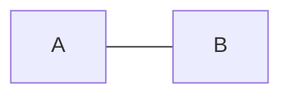

means both directions:

```text
A ↔ B
```

while directed:

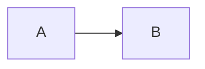

means only:

```text
A → B
```

Dependencies and prerequisites are usually directed.

Roads and physical connections are often undirected.

---

## Step 4 — Weighted or unweighted?

Unweighted:


Weighted:

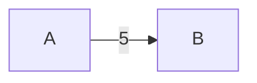

Weights can represent:

```text
time
distance
cost
risk
latency
height
```

---

## Step 5 — What exactly are we optimizing?

This question often reveals the algorithm.

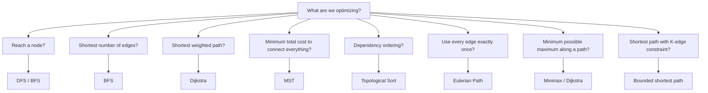

---

# 3. Weighted Graphs

In Part 1, most graphs were unweighted.

Now consider:

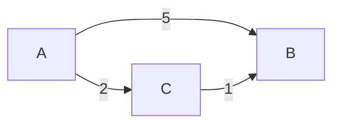

There are two ways to reach B.

Direct:

```text
A → B
cost = 5
```

Via C:

```text
A → C → B
cost = 2 + 1
     = 3
```

Therefore:

```text
shortest path A → B = 3
```

Weighted graphs introduce several new algorithms.

The most important one here is:

```text
Dijkstra
```

---

# 4. Dijkstra — The Core Idea

Dijkstra solves:

> Shortest path from a source in a graph with non-negative edge weights.

Imagine that every node has a currently known best distance.

Initially:

```text
source = 0
everything else = INF
```

Then repeatedly:

> Pick the node with the smallest known distance.

From that node, try to improve its neighbors.

This improvement is called **relaxation**.

---

## Dijkstra Mental Model

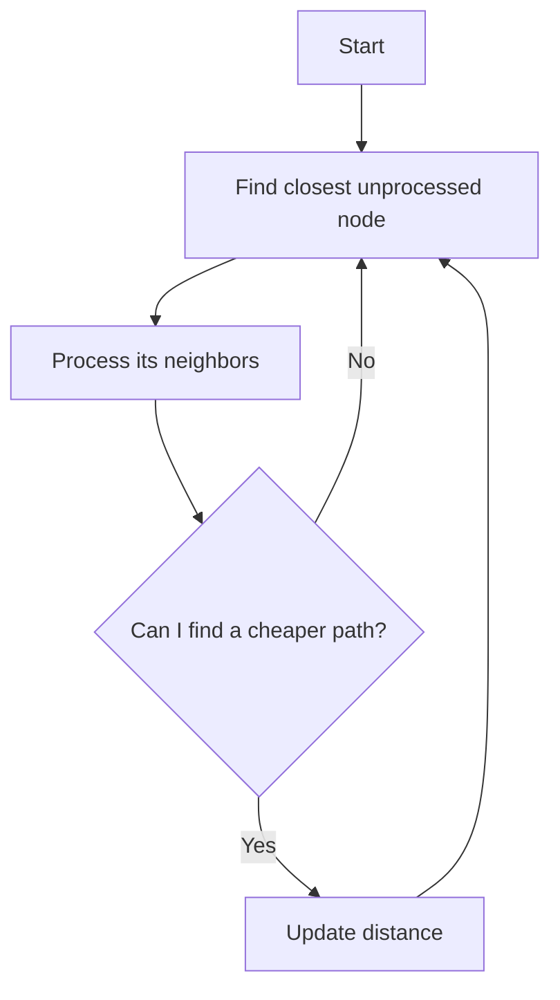

The priority queue gives us:

```text
closest node first
```

---

# 5. Dijkstra Template

```java
int[] dist = new int[n];

Arrays.fill(dist, Integer.MAX_VALUE);

dist[source] = 0;

PriorityQueue<int[]> pq =
    new PriorityQueue<>(
        Comparator.comparingInt(a -> a[1])
    );

pq.offer(new int[]{source, 0});

while (!pq.isEmpty()) {

    int[] current = pq.poll();

    int node = current[0];
    int distance = current[1];

    if (distance > dist[node]) {
        continue;
    }

    for (int[] edge : graph[node]) {

        int neighbor = edge[0];
        int weight = edge[1];

        int newDistance =
            distance + weight;

        if (newDistance < dist[neighbor]) {

            dist[neighbor] = newDistance;

            pq.offer(
                new int[]{
                    neighbor,
                    newDistance
                }
            );
        }
    }
}
```

Memorize the idea:

```text
pop cheapest
→ relax neighbors
→ push improved distances
```

---

# 6. Problem 1 — Network Delay Time

> ### 🧠 Before you code — answer these
> - **Nodes?** The network nodes `1..n`.
> - **Edges/neighbors?** A directed edge `u → v` with travel time `w` for each `times[i] = [u, v, w]`.
> - **Directed or undirected?** **Directed** — a signal travels one way along each edge.
> - **Weighted?** **Yes** — each edge has a non-negative travel time.
> - **Which algorithm/pattern, and why?** **Dijkstra** — shortest weighted path from a single source with non-negative weights. The answer is the *maximum* of those shortest distances (the last node to hear the signal).
> - **What state must I carry?** A `dist[]` array (shortest known time to each node) and a min-heap keyed on distance.

## Problem

You are given directed edges:

```text
times[i] = [u, v, w]
```

meaning:

```text
u → v
time = w
```

A signal starts from node `k`.

Find how long it takes for the signal to reach **all nodes**.

If some node cannot be reached:

```text
return -1
```

---

# 7. Example

Suppose:

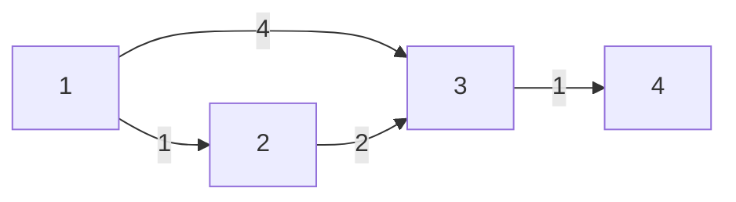

Start:

```text
k = 1
```

Shortest distances:

```text
1 = 0

2 = 1

3 = 3
    because 1 → 2 → 3
    = 1 + 2

4 = 4
    because 1 → 2 → 3 → 4
    = 1 + 2 + 1
```

The signal reaches all nodes after:

```text
4
```

Why?

Because the last node to receive the signal determines the total delay.

Therefore:

```text
answer = maximum shortest-path distance
```

---

# 8. What Pattern Is This?

Ask:

```text
Is the graph weighted?
Yes.

Is it directed?
Yes.

Do we need shortest travel time?
Yes.

Are weights non-negative?
Yes.
```

Therefore:

```text
Dijkstra
```

---

# 9. Build the Graph

For:

```text
[1,2,1]
[1,3,4]
[2,3,2]
```

build:

```text
1 → [(2,1), (3,4)]
2 → [(3,2)]
3 → []
```

Java:

```java
List<int[]>[] graph =
    new ArrayList[n + 1];

for (int i = 1; i <= n; i++) {
    graph[i] = new ArrayList<>();
}

for (int[] time : times) {

    int u = time[0];
    int v = time[1];
    int w = time[2];

    graph[u].add(new int[]{v, w});
}
```

---

# 10. Network Delay Time — Complete Solution

```java
class Solution {

    public int networkDelayTime(
        int[][] times,
        int n,
        int k
    ) {

        List<int[]>[] graph =
            new ArrayList[n + 1];

        for (int i = 1; i <= n; i++) {
            graph[i] = new ArrayList<>();
        }

        for (int[] time : times) {

            int u = time[0];
            int v = time[1];
            int w = time[2];

            graph[u].add(new int[]{v, w});
        }

        int[] dist = new int[n + 1];

        Arrays.fill(
            dist,
            Integer.MAX_VALUE
        );

        dist[k] = 0;

        PriorityQueue<int[]> pq =
            new PriorityQueue<>(
                Comparator.comparingInt(
                    a -> a[1]
                )
            );

        pq.offer(new int[]{k, 0});

        while (!pq.isEmpty()) {

            int[] current = pq.poll();

            int node = current[0];
            int currentDist = current[1];

            // Stale priority queue entry.
            if (currentDist > dist[node]) {
                continue;
            }

            for (int[] edge : graph[node]) {

                int neighbor = edge[0];
                int weight = edge[1];

                int newDist =
                    currentDist + weight;

                if (newDist < dist[neighbor]) {

                    dist[neighbor] = newDist;

                    pq.offer(
                        new int[]{
                            neighbor,
                            newDist
                        }
                    );
                }
            }
        }

        int answer = 0;

        for (int node = 1;
             node <= n;
             node++) {

            if (dist[node] ==
                Integer.MAX_VALUE) {

                return -1;
            }

            answer =
                Math.max(
                    answer,
                    dist[node]
                );
        }

        return answer;
    }
}
```

---

# 11. Dijkstra Dry Run

Graph:

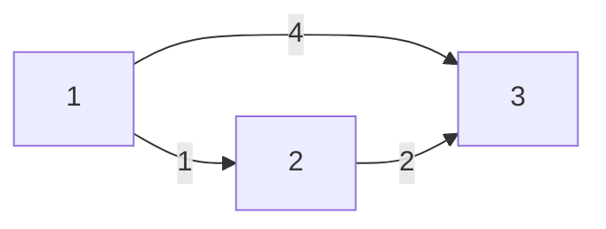

Start:

```text
1
```

Initial:

```text
dist:

1 = 0
2 = INF
3 = INF

PQ:
(1,0)
```

Pop:

```text
(1,0)
```

Relax:

```text
2 = 1
3 = 4
```

PQ:

```text
(2,1)
(3,4)
```

Pop `(2,1)`.

From 2:

```text
2 → 3 = 2
```

New path:

```text
1 + 2 = 3
```

Current:

```text
3 = 4
```

Improve:

```text
3 = 3
```

PQ:

```text
(3,3)
(3,4)
```

The `(3,4)` entry is stale.

That's why we need:

```java
if (currentDist > dist[node]) {
    continue;
}
```

---

# 12. Why Can a Node Appear Multiple Times?

Suppose:

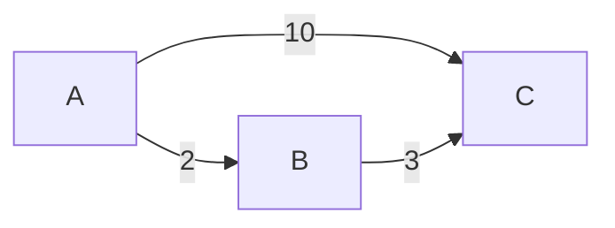

Initially:

```text
C = 10
```

Then:

```text
C = 5
```

The priority queue can contain both:

```text
(C,10)
(C,5)
```

When `(C,10)` comes out:

```text
10 > dist[C]
```

so ignore it.

This is a standard Dijkstra implementation detail.

---

# 13. Complexity

For adjacency list + priority queue:

```text
Time:
O((V + E) log V)

Space:
O(V + E)
```

---

# 14. Interview Explanation

Say:

> "This is a weighted directed shortest-path problem with non-negative edge weights. I'll use Dijkstra with a min-priority queue. The distance array stores the shortest known time to every node, and whenever I find a cheaper route I relax the neighbor. Finally, the network delay is the maximum shortest distance. If any node is unreachable, I return -1."

That is a strong interview answer.

---

# 15. Problem 2 — Reconstruct Itinerary

> ### 🧠 Before you code — answer these
> - **Nodes?** Airports (the three-letter codes).
> - **Edges/neighbors?** Each ticket `[from, to]` is a directed edge; an airport's neighbors are all its ticket destinations.
> - **Directed or undirected?** **Directed** — a ticket flies one way.
> - **Weighted?** No — every ticket counts the same; we just must use each *exactly once*.
> - **Which algorithm/pattern, and why?** **Eulerian path via Hierholzer's algorithm** — the clue "use every ticket exactly once" means visit every *edge* once, not every node. Store each airport's destinations in a min-heap for lexicographically-smallest order.
> - **What state must I carry?** The remaining unused edges per airport (a `PriorityQueue`), and the result list we build backwards on the way out (`addFirst`).

## Problem

You are given airline tickets:

```text
[from, to]
```

Every ticket must be used **exactly once**.

The trip starts at:

```text
JFK
```

If multiple valid itineraries exist, return the lexicographically smallest one.

---

# 16. Example

Tickets:

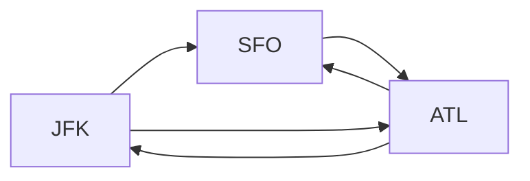

The important requirement is:

```text
USE EVERY TICKET EXACTLY ONCE
```

That phrase is the clue.

---

# 17. What Is an Eulerian Path?

There are two famous graph paths.

### Hamiltonian Path

Visit every:

```text
NODE
```

exactly once.

### Eulerian Path

Visit every:

```text
EDGE
```

exactly once.

This problem says:

```text
Use every ticket exactly once.
```

Each ticket is an edge.

Therefore:

```text
Eulerian Path
```

---

# 18. Why Normal DFS Is Not Enough

Suppose:

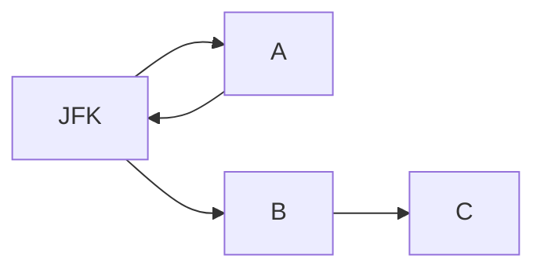

If we blindly choose:

```text
JFK → A
```

then:

```text
A → JFK
```

and we may reach a point where the route is stuck before using:

```text
JFK → B → C
```

So we cannot simply take the smallest destination and permanently add it to the answer.

We need to construct the route while backtracking.

---

# 19. Hierholzer's Algorithm

The key idea:

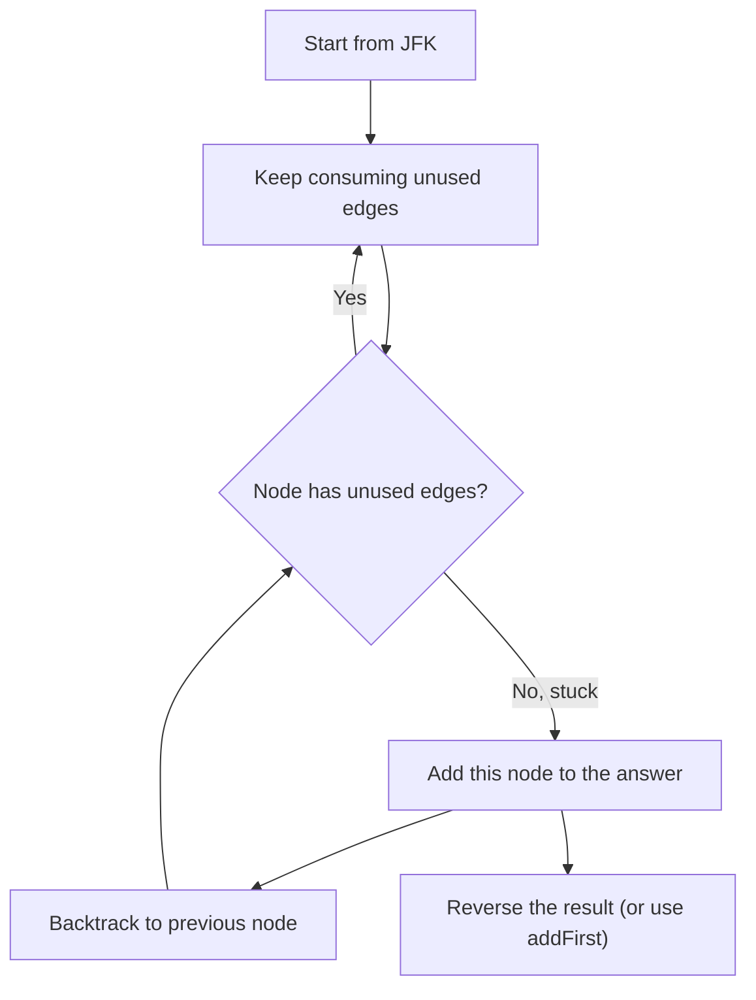

The surprising part is:

> **We add the airport when we are stuck, not when we first visit it.**

---

# 20. Why Does Backtracking Work?

Consider:

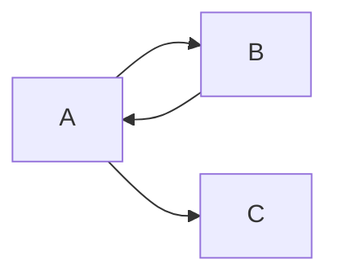

Suppose traversal reaches:

```text
A → B → A → C
```

At C:

```text
no unused edge
```

Add:

```text
C
```

Backtrack to A:

```text
A
```

Backtrack to B:

```text
B
```

Backtrack to A:

```text
A
```

The result was built backwards:

```text
C A B A
```

Reverse:

```text
A B A C
```

That's the itinerary.

---

# 21. Lexicographical Ordering

We need the smallest possible itinerary.

For every airport:

```text
airport → destinations
```

store destinations in a:

```text
PriorityQueue
```

Java:

```java
Map<String, PriorityQueue<String>> graph =
    new HashMap<>();
```

---

# 22. Reconstruct Itinerary — Complete Solution

```java
class Solution {

    private Map<String, PriorityQueue<String>>
        graph = new HashMap<>();

    private LinkedList<String> result =
        new LinkedList<>();

    public List<String> findItinerary(
        List<List<String>> tickets
    ) {

        for (List<String> ticket : tickets) {

            String from = ticket.get(0);
            String to = ticket.get(1);

            graph
                .computeIfAbsent(
                    from,
                    x -> new PriorityQueue<>()
                )
                .offer(to);
        }

        dfs("JFK");

        return result;
    }

    private void dfs(String airport) {

        PriorityQueue<String> destinations =
            graph.get(airport);

        while (destinations != null &&
               !destinations.isEmpty()) {

            String next =
                destinations.poll();

            dfs(next);
        }

        // Add while backtracking.
        result.addFirst(airport);
    }
}
```

---

# 23. Why `poll()`?

Because each ticket must be used exactly once.

When we do:

```java
destinations.poll();
```

that ticket is consumed.

It is no longer available.

Therefore every edge gets used exactly once.

---

# 24. Why `addFirst()`?

We add nodes while backtracking.

Therefore the route is naturally constructed backwards.

Instead of:

```java
result.add(airport);
```

and:

```java
Collections.reverse(result);
```

we can simply:

```java
result.addFirst(airport);
```

---

# 25. Reconstruct Itinerary Pattern

Whenever you see:

```text
use every edge exactly once
```

immediately think:

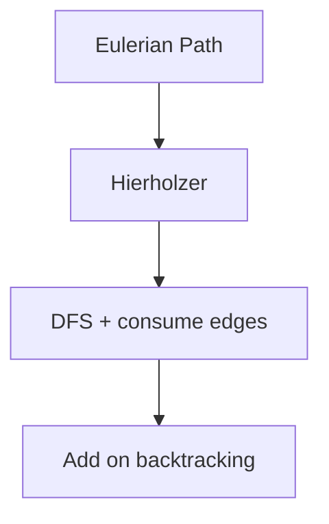

If the problem also says:

```text
lexicographically smallest
```

think:

```text
PriorityQueue
```

---

# 26. Complexity

There are `E` tickets.

Every ticket is removed once.

With a priority queue:

```text
Time:
O(E log E)

Space:
O(V + E)
```

---

# 27. Problem 3 — Min Cost to Connect All Points

> ### 🧠 Before you code — answer these
> - **Nodes?** The points `[x, y]`.
> - **Edges/neighbors?** Every point connects to every other point (a complete graph); the edge weight is the Manhattan distance `|x1-x2| + |y1-y2|`.
> - **Directed or undirected?** **Undirected** — a connection works both ways.
> - **Weighted?** **Yes** — the Manhattan distance is the cost.
> - **Which algorithm/pattern, and why?** **Minimum Spanning Tree via Prim** — the clue "connect ALL points with minimum total cost" is the MST definition. Dense graph, so grow one tree with an `O(N²)` Prim (no need to materialize every edge).
> - **What state must I carry?** `minDist[i]` = cheapest edge that can attach point `i` to the growing tree, plus a `used[]` flag per point.

## Problem

Given points:

```text
[x, y]
```

Connect all points.

The cost between two points is Manhattan distance:

```text
|x1 - x2| + |y1 - y2|
```

Return the minimum total cost.

---

# 28. Example

Points:

```text
A = (0,0)
B = (2,2)
C = (3,1)
```

Costs:

```text
A-B = |0-2| + |0-2|
    = 4

A-C = |0-3| + |0-1|
    = 4

B-C = |2-3| + |2-1|
    = 2
```

A cheap way to connect everything is:

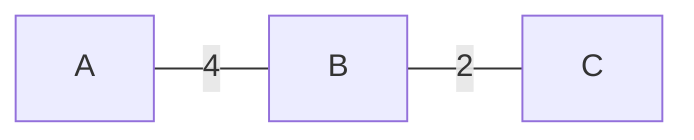

Total:

```text
4 + 2 = 6
```

---

# 29. What Is This Really?

The problem says:

```text
Connect ALL points
+
minimum total cost
```

That is exactly:

```text
Minimum Spanning Tree
```

---

# 30. What Is a Spanning Tree?

A tree:

```text
connects all nodes
+
contains no cycle
```

For `N` nodes, a tree contains exactly:

```text
N - 1 edges
```

A **minimum spanning tree** is the tree with the minimum total edge cost.

---

# 31. MST vs Shortest Path

This distinction is extremely important.

### Shortest Path

Question:

> What is the cheapest way to get from A to B?

### Minimum Spanning Tree

Question:

> What is the cheapest way to connect ALL nodes?

Do not confuse them.

---

# 32. Prim's Algorithm

There are two famous MST algorithms:

```text
Prim
Kruskal
```

For this problem, Prim is very convenient.

Mental model:

> Start with one point and grow the connected network one point at a time.

---

# 33. Prim Example

Suppose:

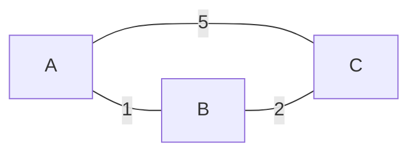

Start:

```text
Connected = {A}
```

Candidates:

```text
A-B = 1
A-C = 5
```

Choose:

```text
A-B
```

Now:

```text
Connected = {A,B}
```

Candidates for C:

```text
A-C = 5
B-C = 2
```

Choose:

```text
B-C = 2
```

Total:

```text
3
```

---

# 34. The `minDist` Array

We maintain:

```java
minDist[i]
```

meaning:

> Cheapest known edge that can connect point `i` to the current MST.

Initially:

```text
minDist[start] = 0
```

Everything else:

```text
INF
```

Each time we add a point, update the cheapest connection cost for all remaining points.

---

# 35. Min Cost to Connect All Points — Complete Solution

```java
class Solution {

    public int minCostConnectPoints(
        int[][] points
    ) {

        int n = points.length;

        boolean[] used =
            new boolean[n];

        int[] minDist =
            new int[n];

        Arrays.fill(
            minDist,
            Integer.MAX_VALUE
        );

        minDist[0] = 0;

        int totalCost = 0;

        for (int i = 0; i < n; i++) {

            int current = -1;

            // Find the unused point
            // with the cheapest connection.
            for (int j = 0; j < n; j++) {

                if (!used[j] &&
                    (current == -1 ||
                     minDist[j] <
                     minDist[current])) {

                    current = j;
                }
            }

            used[current] = true;

            totalCost +=
                minDist[current];

            // Update connection costs.
            for (int j = 0; j < n; j++) {

                if (used[j]) {
                    continue;
                }

                int cost =
                    Math.abs(
                        points[current][0]
                        - points[j][0]
                    )
                    +
                    Math.abs(
                        points[current][1]
                        - points[j][1]
                    );

                minDist[j] =
                    Math.min(
                        minDist[j],
                        cost
                    );
            }
        }

        return totalCost;
    }
}
```

---

# 36. Why Don't We Explicitly Build Every Edge?

With `N` points, every point can connect to every other point.

Number of possible edges:

```text
N(N-1)/2
```

which is:

```text
O(N²)
```

We can calculate Manhattan distances when needed instead of explicitly storing every edge.

The above dense Prim implementation uses:

```text
O(N²) time
O(N) space
```

---

# 37. Prim vs Kruskal

### Prim

Think:

```text
Grow one connected tree.
```

### Kruskal

Think:

```text
Sort all edges.
Take the cheapest edge that does not create a cycle.
```

Kruskal naturally uses:

```text
Union-Find / DSU
```

So:

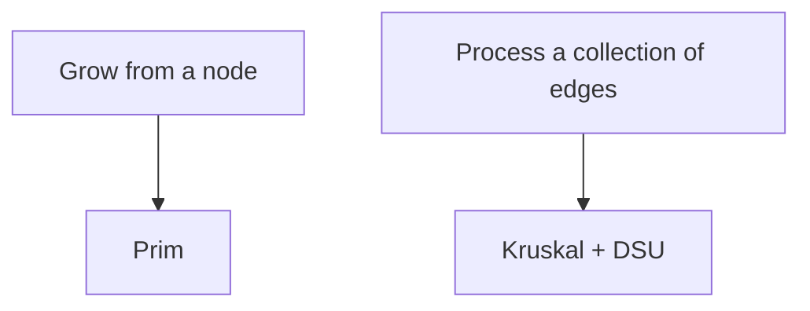

---

# 38. MST Pattern

Whenever you see:

```text
connect all nodes
minimum total cost
```

think:

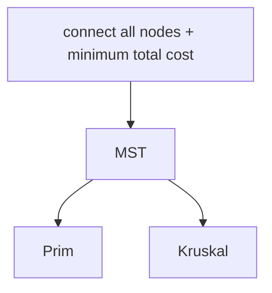

---

# 39. Problem 4 — Swim in Rising Water

> ### 🧠 Before you code — answer these
> - **Nodes?** Each grid cell `(r, c)`.
> - **Edges/neighbors?** The 4 adjacent cells (up/down/left/right).
> - **Directed or undirected?** **Undirected** — you can swim either way between adjacent cells.
> - **Weighted?** **Yes**, but the weight is a cell's *elevation*, and a path's cost is the **maximum** elevation on it — not the sum.
> - **Which algorithm/pattern, and why?** **Minimax Dijkstra** — the clue "minimum time to reach the target" where time = highest cell you must cross. Same Dijkstra skeleton, but relax with `max(current, height)` instead of `current + weight`.
> - **What state must I carry?** A min-heap keyed on the path's max-elevation-so-far, plus a `visited[][]` grid.

This is one of the most important problems in this section because it changes how you think about "shortest path."

---

# 40. Problem

You have a grid:

```text
0 2
1 3
```

Each cell contains its elevation.

At time `t`, you can enter cells whose elevation is at most:

```text
t
```

Start:

```text
(0,0)
```

Target:

```text
(n-1,n-1)
```

Find the minimum time at which the target can be reached.

---

# 41. The Important Question

Suppose a path is:

```text
0 → 5 → 3 → 4
```

What time do we need?

Not:

```text
0 + 5 + 3 + 4
```

Instead:

```text
maximum elevation
=
5
```

Because once the water reaches 5, every cell on that path is accessible.

Therefore:

```text
path cost =
maximum value encountered on path
```

---

# 42. This Is a Minimax Path

We want:

```text
minimum possible maximum
```

or:

```text
minimize(
    max(
        values along path
    )
)
```

This is called:

```text
Minimax Path
```

---

# 43. Why Dijkstra Can Still Work

Normal Dijkstra calculates:

```java
newCost =
    currentCost + edgeWeight;
```

Here the path cost is different.

It becomes:

```java
newCost =
    Math.max(
        currentCost,
        grid[nr][nc]
    );
```

That's the key insight.

---

# 44. Example

Suppose:

```text
0 2 5
1 3 4
2 1 6
```

One path may have:

```text
0 → 2 → 5 → 4 → 6
```

cost:

```text
6
```

Another path:

```text
0 → 1 → 2 → 1 → 6
```

cost:

```text
6
```

The algorithm searches for the path whose maximum elevation is smallest.

---

# 45. Swim in Rising Water — Complete Solution

```java
class Solution {

    public int swimInWater(
        int[][] grid
    ) {

        int n = grid.length;

        boolean[][] visited =
            new boolean[n][n];

        // [maximum height so far, row, col]
        PriorityQueue<int[]> pq =
            new PriorityQueue<>(
                Comparator.comparingInt(
                    a -> a[0]
                )
            );

        pq.offer(
            new int[]{
                grid[0][0],
                0,
                0
            }
        );

        int[][] directions = {
            {-1, 0},
            {1, 0},
            {0, -1},
            {0, 1}
        };

        while (!pq.isEmpty()) {

            int[] current =
                pq.poll();

            int time = current[0];
            int r = current[1];
            int c = current[2];

            if (visited[r][c]) {
                continue;
            }

            visited[r][c] = true;

            if (r == n - 1 &&
                c == n - 1) {

                return time;
            }

            for (int[] dir : directions) {

                int nr =
                    r + dir[0];

                int nc =
                    c + dir[1];

                if (nr < 0 ||
                    nr >= n ||
                    nc < 0 ||
                    nc >= n ||
                    visited[nr][nc]) {

                    continue;
                }

                int newTime =
                    Math.max(
                        time,
                        grid[nr][nc]
                    );

                pq.offer(
                    new int[]{
                        newTime,
                        nr,
                        nc
                    }
                );
            }
        }

        return -1;
    }
}
```

---

# 46. Why `Math.max()`?

This is worth understanding deeply.

Suppose:

```text
current path cost = 7
neighbor height = 5
```

We need water level:

```text
max(7,5) = 7
```

The new cell does not make things harder.

Now:

```text
current path cost = 7
neighbor height = 10
```

We need:

```text
max(7,10) = 10
```

Therefore:

```java
newTime =
    Math.max(
        currentTime,
        grid[nr][nc]
    );
```

---

# 47. Another Way to Solve Swim in Rising Water

There is another elegant approach:

```text
Binary Search on answer
```

Suppose we guess:

```text
time = T
```

Ask:

> Can I reach the target using only cells with height <= T?

That's a normal DFS/BFS.

The answer is monotonic:

```text
T = 2 → impossible
T = 3 → impossible
T = 4 → possible
T = 5 → possible
T = 6 → possible
```

Therefore:

```text
Binary Search + DFS/BFS
```

also works.

But the Dijkstra solution teaches a more reusable graph pattern.

---

# 48. Minimax Pattern

Whenever you see:

```text
minimum possible maximum
```

or:

```text
minimize the bottleneck
```

think:

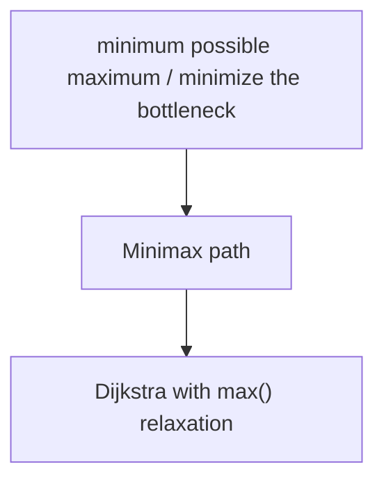

with a different path-cost operation.

Normal:

```text
newCost = current + weight
```

Minimax:

```text
newCost = max(current, weight)
```

---

# 49. Problem 5 — Alien Dictionary

> ### 🧠 Before you code — answer these
> - **Nodes?** The individual characters that appear in the words.
> - **Edges/neighbors?** A directed edge `c1 → c2` meaning `c1` comes before `c2`, derived from the **first differing character** of two adjacent words.
> - **Directed or undirected?** **Directed** — ordering has a direction.
> - **Weighted?** No — these are pure ordering constraints.
> - **Which algorithm/pattern, and why?** **Topological Sort (Kahn's)** — we need a valid linear ordering that respects all constraints; a cycle means no valid alphabet exists.
> - **What state must I carry?** An adjacency `Set` per char (to dedupe edges), an `indegree` map, and a queue of zero-indegree chars. Also guard the invalid-prefix case (`["abc","ab"]`).

This is a very important topological-sort problem.

---

# 50. Problem

You are given words sorted according to an unknown alien alphabet.

Example:

```text
wrt
wrf
er
ett
rftt
```

Determine the ordering of the characters.

A valid answer is:

```text
w e r t f
```

---

# 51. How Can Words Tell Us Character Order?

Compare adjacent words.

First:

```text
wrt
wrf
```

Compare from left to right:

```text
w = w
r = r
t != f
```

Therefore:

```text
t comes before f
```

Graph edge:

```text
t → f
```

---

# 52. Another Comparison

```text
wrf
er
```

First characters differ:

```text
w != e
```

Therefore:

```text
w → e
```

Continue this for every adjacent pair.

Now we have a directed graph of ordering constraints.

---

# 53. What Is the Hidden Graph?

The nodes are:

```text
characters
```

The edges mean:

```text
character A must come before character B
```

For example:

```mermaid
flowchart LR
    w --> e --> r --> t --> f
```

Then the problem becomes:

> Find a valid ordering of this directed graph.

That's:

```text
Topological Sort
```

---

# 54. Why Only Adjacent Words?

Because the words are already sorted.

The first different character between adjacent words provides a valid ordering constraint.

We don't need to compare every pair.

---

# 55. Very Important Edge Case — Prefix

Consider:

```text
["abc", "ab"]
```

This is invalid.

Why?

`ab` is a prefix of `abc`.

Normally:

```text
ab < abc
```

not:

```text
abc < ab
```

Therefore:

```text
longer word before its prefix
→ invalid
```

---

# 56. Duplicate Edges

Suppose we discover:

```text
a → b
```

more than once.

We must not increase indegree twice.

Use:

```java
Set<Character>
```

for neighbors.

---

# 57. Alien Dictionary — Complete Solution

```java
class Solution {

    public String alienOrder(
        String[] words
    ) {

        Map<Character, Set<Character>>
            graph = new HashMap<>();

        Map<Character, Integer>
            indegree = new HashMap<>();

        // Add every character.
        for (String word : words) {

            for (char ch :
                 word.toCharArray()) {

                graph.putIfAbsent(
                    ch,
                    new HashSet<>()
                );

                indegree.putIfAbsent(
                    ch,
                    0
                );
            }
        }

        // Build ordering constraints.
        for (int i = 0;
             i < words.length - 1;
             i++) {

            String a = words[i];
            String b = words[i + 1];

            int minLength =
                Math.min(
                    a.length(),
                    b.length()
                );

            boolean foundDifference = false;

            for (int j = 0;
                 j < minLength;
                 j++) {

                char c1 =
                    a.charAt(j);

                char c2 =
                    b.charAt(j);

                if (c1 != c2) {

                    if (!graph
                        .get(c1)
                        .contains(c2)) {

                        graph
                            .get(c1)
                            .add(c2);

                        indegree.put(
                            c2,
                            indegree.get(c2) + 1
                        );
                    }

                    foundDifference = true;
                    break;
                }
            }

            // Invalid prefix case.
            if (!foundDifference &&
                a.length() > b.length()) {

                return "";
            }
        }

        Queue<Character> queue =
            new ArrayDeque<>();

        for (char ch :
             indegree.keySet()) {

            if (indegree.get(ch) == 0) {

                queue.offer(ch);
            }
        }

        StringBuilder result =
            new StringBuilder();

        while (!queue.isEmpty()) {

            char current =
                queue.poll();

            result.append(current);

            for (char next :
                 graph.get(current)) {

                indegree.put(
                    next,
                    indegree.get(next) - 1
                );

                if (indegree.get(next) == 0) {

                    queue.offer(next);
                }
            }
        }

        // Cycle exists.
        if (result.length() !=
            indegree.size()) {

            return "";
        }

        return result.toString();
    }
}
```

---

# 58. Alien Dictionary Dry Run

Input:

```text
wrt
wrf
er
ett
rftt
```

Rules:

```text
wrt
wrf
```

gives:

```text
t → f
```

Then:

```text
wrf
er
```

gives:

```text
w → e
```

Then:

```text
er
ett
```

gives:

```text
r → t
```

Then:

```text
ett
rftt
```

gives:

```text
e → r
```

Graph:

```mermaid
flowchart LR
    w --> e --> r --> t --> f
```

Topological sort:

```text
w e r t f
```

---

# 59. Cycle Detection

Suppose constraints produce:

```mermaid
flowchart LR
    a --> b --> c --> a
```

There is no possible ordering.

Topological sort processes:

```text
indegree = 0
```

nodes.

But a cycle has no zero-indegree starting point.

Therefore:

```text
processed nodes < total nodes
```

means:

```text
cycle
```

---

# 60. Alien Dictionary Pattern

Remember:

```mermaid
flowchart TD
    A["Sorted words"] --> B["Compare adjacent words"]
    B --> C["First different character"]
    C --> D["Directed edge"]
    D --> E["Topological Sort"]
```

This is the entire problem.

---

# 61. Complexity

Let:

```text
C = total number of characters
V = number of unique characters
E = ordering constraints
```

Building the graph:

```text
O(C)
```

Topological sorting:

```text
O(V + E)
```

Overall:

```text
O(C + V + E)
```

Space:

```text
O(V + E)
```

---

# 62. Problem 6 — Cheapest Flights Within K Stops

> ### 🧠 Before you code — answer these
> - **Nodes?** The cities `0..n-1`.
> - **Edges/neighbors?** Each flight `[from, to, price]` is a directed weighted edge.
> - **Directed or undirected?** **Directed** — a flight goes one way.
> - **Weighted?** **Yes** — price is the weight.
> - **Which algorithm/pattern, and why?** **Bounded Bellman-Ford** — shortest weighted path *with a limit on edges*. `K` stops = at most `K+1` edges, so run exactly `K+1` relaxation rounds.
> - **What state must I carry?** Conceptually the state is `(city, stopsUsed)`. In practice: a `dist[]` array, and each round a fresh `next = dist.clone()` so relaxations don't chain within one round.

This is the final problem and introduces one of the most important ideas in advanced graph problems:

> **The state may contain more than just the node.**

---

# 63. Problem

Given:

```text
flights[i] = [from, to, price]
```

Find the cheapest price from:

```text
src → dst
```

using at most:

```text
k stops
```

---

# 64. Example

Flights:

```mermaid
flowchart LR
    0 -->|100| 1
    1 -->|100| 2
    0 -->|500| 2
```

Suppose:

```text
src = 0
dst = 2
k = 1
```

Options:

Direct:

```text
0 → 2
cost = 500
```

With one stop:

```text
0 → 1 → 2
cost = 100 + 100
     = 200
```

Answer:

```text
200
```

---

# 65. Why Ordinary Shortest Path Is Not Enough

Without the stop constraint:

```text
weighted shortest path
```

would suggest:

```text
Dijkstra
```

But now the number of stops matters.

Imagine reaching city B with:

```text
cost = 100
stops = 1
```

versus:

```text
cost = 100
stops = 5
```

These are not equivalent states.

The first one may still have many stops available.

The second one may have no stops left.

Therefore the state is conceptually:

```text
(city, stopsUsed)
```

---

# 66. K Stops = K + 1 Edges

This is a classic interview trap.

Example:

```mermaid
flowchart LR
    src --> A --> dst
```

There is:

```text
1 stop
```

but:

```text
2 edges
```

Therefore:

```text
maximum edges = K + 1
```

---

# 67. Why Bellman-Ford Fits

Bellman-Ford repeatedly relaxes every edge.

After one iteration:

```text
best paths using ≤ 1 edge
```

After two:

```text
best paths using ≤ 2 edges
```

After:

```text
K + 1
```

iterations:

```text
best paths using ≤ K + 1 edges
```

That matches the problem perfectly.

---

# 68. The Critical `next` Array

We should not update the same `dist` array directly.

Use:

```java
int[] next = dist.clone();
```

Think:

```text
dist
 ↓
answers before this layer

next
 ↓
answers after allowing one additional edge
```

This prevents an update made earlier in the iteration from being reused immediately and accidentally creating a path with too many edges.

---

# 69. Cheapest Flights — Complete Solution

```java
class Solution {

    public int findCheapestPrice(
        int n,
        int[][] flights,
        int src,
        int dst,
        int k
    ) {

        int INF =
            Integer.MAX_VALUE / 2;

        int[] dist =
            new int[n];

        Arrays.fill(
            dist,
            INF
        );

        dist[src] = 0;

        // K stops = K + 1 edges.
        for (int i = 0;
             i <= k;
             i++) {

            int[] next =
                dist.clone();

            for (int[] flight :
                 flights) {

                int from = flight[0];
                int to = flight[1];
                int price = flight[2];

                if (dist[from] == INF) {
                    continue;
                }

                next[to] =
                    Math.min(
                        next[to],
                        dist[from] + price
                    );
            }

            dist = next;
        }

        return dist[dst] == INF
            ? -1
            : dist[dst];
    }
}
```

---

# 70. Cheapest Flights Dry Run

Flights:

```mermaid
flowchart LR
    0 -->|100| 1
    1 -->|100| 2
    0 -->|500| 2
```

Start:

```text
dist:

0 = 0
1 = INF
2 = INF
```

---

## Iteration 1

Allow:

```text
1 edge
```

We get:

```text
0 = 0
1 = 100
2 = 500
```

---

## Iteration 2

Allow:

```text
2 edges
```

Now:

```text
2 =
min(
    500,
    100 + 100
)
```

Therefore:

```text
2 = 200
```

If:

```text
k = 1
```

we are allowed:

```text
k + 1 = 2 edges
```

So answer:

```text
200
```

---

# 71. Why `dist.clone()` Matters

Suppose:

```mermaid
flowchart LR
    A --> B --> C --> D
```

If we update `dist` directly during one iteration, we could accidentally do:

```text
A → B
then immediately B → C
then immediately C → D
```

inside the same iteration.

That would allow multiple edges when the iteration was supposed to represent only one additional edge.

Using:

```java
int[] next = dist.clone();
```

ensures every relaxation in the current round uses the previous layer.

---

# 72. Bellman-Ford vs Dijkstra Here

A Dijkstra-like solution is possible if you expand the state:

```text
(city, stops)
```

For example:

```text
PriorityQueue<State>
```

where State contains:

```text
city
cost
stopsUsed
```

But Bellman-Ford is particularly clean here because the stop constraint directly translates into a fixed number of relaxation rounds.

Interview explanation:

> "Because the number of edges is bounded by K+1, I can use bounded Bellman-Ford relaxation. Each iteration represents allowing one additional flight."

---

# 73. The Bigger Lesson — State

This is more important than the specific problem.

Normal shortest path:

```text
state = node
```

Constrained shortest path:

```text
state = (node, stops)
```

Other graph problems may have:

```text
(node, fuel)
(node, time)
(node, keys)
(node, remainingMoves)
(node, bitmask)
```

The rule is:

> **If some extra variable changes what you can do next, that variable usually belongs in the state.**

This concept appears far beyond graph problems.

---

# 74. Six Problems — Six Patterns

Now compress everything into one table.

| Problem | Ask Yourself | Pattern |
|---|---|---|
| Network Delay Time | Weighted shortest time? | Dijkstra |
| Reconstruct Itinerary | Every edge exactly once? | Eulerian Path |
| Min Cost to Connect All Points | Connect all nodes cheapest? | MST / Prim |
| Swim in Rising Water | Minimize maximum encountered? | Minimax Dijkstra |
| Alien Dictionary | Derive ordering constraints? | Topological Sort |
| Cheapest Flights | Shortest path with K-edge limit? | Bellman-Ford / State |

---

# 75. Pattern 1 — Dijkstra

Use when:

```text
Weighted graph
+
Non-negative weights
+
Shortest path
```

Mental model:

```text
Always expand the cheapest known state.
```

Template:

```java
while (!pq.isEmpty()) {

    current = pq.poll();

    for (neighbor : current.neighbors) {

        newCost =
            current.cost + edgeWeight;

        if (newCost < dist[neighbor]) {

            dist[neighbor] = newCost;

            pq.offer(
                new State(
                    neighbor,
                    newCost
                )
            );
        }
    }
}
```

---

# 76. Pattern 2 — Eulerian Path

Use when:

```text
Use every edge exactly once
```

Mental model:

```mermaid
flowchart TD
    A["Consume edges"] --> B["Get stuck"]
    B --> C["Add node"]
    C --> D["Backtrack"]
    D --> E["Reverse / addFirst"]
```

Common implementation:

```text
DFS + PriorityQueue
```

---

# 77. Pattern 3 — Minimum Spanning Tree

Use when:

```text
Connect ALL nodes
+
minimum total edge cost
```

Algorithms:

```text
Prim
Kruskal
```

Mental model:

```text
Prim:
Grow one tree.

Kruskal:
Take cheapest safe edges.
```

---

# 78. Pattern 4 — Minimax Path

Use when:

```text
Path cost =
maximum value encountered
```

and the question asks:

```text
minimum possible maximum
```

Use Dijkstra-style relaxation:

```java
newCost =
    Math.max(
        currentCost,
        edgeOrCellCost
    );
```

---

# 79. Pattern 5 — Topological Sort

Use when:

```text
Directed graph
+
dependencies/order
```

Kahn's algorithm:

```mermaid
flowchart TD
    A["Find indegree-0 nodes"] --> B["Add them to the queue"]
    B --> C["Remove a node"]
    C --> D["Decrease neighbors' indegree"]
    D --> E["New indegree-0 nodes"]
    E --> C
```

If:

```text
processed != total
```

there is a cycle.

---

# 80. Pattern 6 — Bounded Shortest Path

Use when:

```text
Shortest path
+
maximum number of edges/stops
```

Think:

```text
state includes constraint
```

and often:

```text
Bellman-Ford for K+1 rounds
```

---

# 81. Dijkstra Variations You Should Know

This is a useful interview progression.

## Normal shortest path

```java
newCost =
    currentCost + weight;
```

## Swim in Rising Water

```java
newCost =
    Math.max(
        currentCost,
        height
    );
```

The algorithmic skeleton is still:

```text
priority queue
+
best known cost
+
relaxation
```

Only the way the path cost is combined changes.

This is a powerful way to understand Dijkstra rather than memorizing it.

---

# 82. Prim vs Dijkstra

These two algorithms can look surprisingly similar.

### Dijkstra

Question:

> What is the cheapest path from the source to each node?

Priority is based on:

```text
total path cost
```

### Prim

Question:

> What is the cheapest edge that connects a new node to the existing tree?

Priority is based on:

```text
cheapest connecting edge
```

They both use greedy expansion, but they solve different problems.

---

# 83. Dijkstra vs MST

Example:

```mermaid
flowchart TD
    A ---|1| B
    A ---|4| C
    B ---|2| D
    C ---|1| D
```

Shortest path A → D:

```text
A → B → D
cost = 3
```

MST asks:

```text
How do I connect A, B, C, D
with minimum total edge cost?
```

That is a different optimization problem.

Always read the exact question.

---

# 84. Topological Sort vs DFS Cycle Detection

For directed graphs:

### Course Schedule

Question:

```text
Is it possible?
```

You can use:

```text
DFS cycle detection
```

or:

```text
Kahn's algorithm
```

### Course Schedule II / Alien Dictionary

Question:

```text
Give me an order.
```

Topological sorting is the natural answer.

---

# 85. Common Interview Mistakes

## Mistake 1 — Using Dijkstra with negative weights

Dijkstra assumes non-negative weights.

If negative weights exist:

```text
Dijkstra is generally unsafe.
```

---

## Mistake 2 — Confusing MST and shortest path

Remember:

```text
Shortest path
→ best route

MST
→ cheapest network connecting everything
```

---

## Mistake 3 — Treating Itinerary as ordinary DFS

The key phrase is:

```text
every edge exactly once
```

That's Eulerian traversal.

---

## Mistake 4 — Adding itinerary nodes too early

In Hierholzer:

```text
consume all outgoing edges
then add node during backtracking
```

---

## Mistake 5 — Forgetting the prefix case in Alien Dictionary

```text
["abc", "ab"]
```

is invalid.

---

## Mistake 6 — Adding duplicate edges in Alien Dictionary

If:

```text
a → b
```

is discovered twice, indegree must only increase once.

Use a `Set`.

---

## Mistake 7 — Forgetting K+1

If the problem says:

```text
K stops
```

maximum flights/edges are:

```text
K + 1
```

---

## Mistake 8 — Updating the same Bellman-Ford array

For bounded flights:

```java
int[] next = dist.clone();
```

is important.

---

## Mistake 9 — Thinking Swim in Rising Water minimizes sum

It doesn't.

The path cost is:

```text
maximum height
```

---

# 86. Interview Recognition Cheat Sheet

If the interviewer says:

### "Signal reaches nodes with different travel times"

Think:

```text
Weighted shortest path
→ Dijkstra
```

---

### "Use every ticket exactly once"

Think:

```text
Eulerian Path
→ Hierholzer
```

---

### "Connect all points with minimum cost"

Think:

```text
MST
→ Prim / Kruskal
```

---

### "Minimum possible maximum height"

Think:

```text
Minimax
→ Dijkstra with max()
```

---

### "Infer alphabet ordering"

Think:

```text
Constraints
→ Directed graph
→ Topological Sort
```

---

### "Cheapest flight with at most K stops"

Think:

```text
Constrained shortest path
→ K+1 edges
→ Bounded Bellman-Ford
```

---

# 87. The Graph Algorithm Decision Tree

```mermaid
flowchart TD
    G["GRAPH PROBLEM"]
    G --> F["What are we finding?"]
    G --> S["What is special?"]

    F --> R["Reachability"] --> RA["DFS / BFS"]
    F --> SP["Shortest path"]
    SP --> UW["Unweighted"] --> UWA["BFS"]
    SP --> WT["Weighted"]
    WT --> NN["Non-negative weights"] --> NNA["Dijkstra"]
    WT --> KC["K-edge constraint"] --> KCA["Bounded shortest path"]

    S --> DEP["Dependencies"] --> DEPA["Topological Sort"]
    S --> EE["Every edge once"] --> EEA["Eulerian"]
```

For connection problems:

```mermaid
flowchart TD
    A["Connect ALL nodes"] --> B["MST"]
```

For bottleneck problems:

```mermaid
flowchart TD
    A["Minimize maximum"] --> B["Minimax"]
    B --> C["Dijkstra-style"]
```

---

# 88. Master Templates

## 88.1 Dijkstra

```java
dist[source] = 0;

PriorityQueue<State> pq = minHeap;

pq.offer(source);

while (!pq.isEmpty()) {

    State current = pq.poll();

    if (current.cost > dist[current.node]) {
        continue;
    }

    for (Edge edge : graph[current.node]) {

        int newCost =
            current.cost + edge.weight;

        if (newCost < dist[edge.to]) {

            dist[edge.to] = newCost;

            pq.offer(
                new State(
                    edge.to,
                    newCost
                )
            );
        }
    }
}
```

---

## 88.2 Minimax Dijkstra

```java
newCost =
    Math.max(
        currentCost,
        edgeCost
    );

if (newCost < dist[neighbor]) {

    dist[neighbor] = newCost;

    pq.offer(
        new State(
            neighbor,
            newCost
        )
    );
}
```

---

## 88.3 Prim

```java
minDist[0] = 0;

for (int i = 0; i < n; i++) {

    choose unused node
    with smallest minDist;

    mark it used;

    total += minDist[node];

    update minDist for
    all remaining nodes;
}
```

---

## 88.4 Kahn Topological Sort

```java
calculate indegree;

queue all nodes
with indegree == 0;

while (!queue.isEmpty()) {

    node = queue.poll();

    process(node);

    for (neighbor : graph[node]) {

        indegree[neighbor]--;

        if (indegree[neighbor] == 0) {
            queue.offer(neighbor);
        }
    }
}

if (processed < total) {
    cycle exists;
}
```

---

## 88.5 Bounded Bellman-Ford

```java
dist[source] = 0;

for (int i = 0; i < maxEdges; i++) {

    int[] next = dist.clone();

    for (edge : edges) {

        next[edge.to] =
            Math.min(
                next[edge.to],
                dist[edge.from]
                + edge.weight
            );
    }

    dist = next;
}
```

---

## 88.6 Hierholzer

```java
void dfs(String node) {

    while (node has unused edges) {

        next = consumeEdge(node);

        dfs(next);
    }

    result.addFirst(node);
}
```

---

# 89. How to Approach a Completely New Graph Problem

Do not immediately start coding.

Use this interview process.

---

## Step 1 — Identify the nodes

Say:

> "First, I'll model the entities as graph nodes."

---

## Step 2 — Identify the edges

Say:

> "There is an edge between two nodes when ______."

---

## Step 3 — Identify direction

Say:

> "The relationship is directed/undirected because ______."

---

## Step 4 — Identify weight

Say:

> "The edge has a weight representing ______."

---

## Step 5 — Identify the actual goal

Ask:

```text
Reach?
Count?
Shortest?
Minimum total?
Ordering?
Every edge?
```

---

## Step 6 — Select the pattern

```text
DFS
BFS
Multi-source BFS
Dijkstra
MST
Topological Sort
Union-Find
Eulerian
Bellman-Ford
```

---

## Step 7 — Define the state

Ask:

> "What information must I carry while traversing?"

It might be:

```text
node
distance
stops
fuel
keys
mask
time
```

---

## Step 8 — Explain complexity

Always finish with:

```text
Time:
Space:
```

---

# 90. Interview Explanation — Network Delay Time

A concise strong answer:

> "I'll model each node as a graph vertex and each transmission as a directed weighted edge. Since I need the shortest time from source k to every node and weights are non-negative, I'll use Dijkstra. I'll maintain a distance array and a min-priority queue. Whenever I find a shorter path to a neighbor, I relax it and push the updated distance. The final answer is the maximum shortest distance, and if any node is unreachable I return -1."

---

# 91. Interview Explanation — Reconstruct Itinerary

> "The requirement to use every ticket exactly once tells me this is an Eulerian path problem because tickets represent edges. I'll use Hierholzer's algorithm. For lexicographical order, each airport's outgoing destinations are stored in a min-heap. I consume edges during DFS and add an airport only when it has no remaining outgoing edges. This constructs the answer during backtracking."

---

# 92. Interview Explanation — Min Cost to Connect All Points

> "We need to connect all points while minimizing the total connection cost, so this is a minimum spanning tree problem. I'll use Prim's algorithm. The `minDist` array stores the cheapest edge that can connect each unvisited point to the current MST. Each iteration selects the unvisited point with the smallest connection cost and updates the remaining points."

---

# 93. Interview Explanation — Swim in Rising Water

> "The cost of a path is the maximum elevation encountered, not the sum of elevations. Therefore this is a minimax path problem. I can use a Dijkstra-style priority queue, but instead of adding the edge cost, I calculate the new path cost as the maximum of the current path cost and the next cell's elevation."

---

# 94. Interview Explanation — Alien Dictionary

> "The words are already sorted, so I compare adjacent words and find their first differing characters. That gives a directed ordering constraint such as `a → b`. I build a graph of these constraints and perform topological sorting. I also handle the invalid prefix case and detect cycles by checking whether all characters can be processed."

---

# 95. Interview Explanation — Cheapest Flights

> "This is a shortest-path problem with an additional constraint on the number of stops. Since K stops means at most K+1 edges, I can use bounded Bellman-Ford relaxation for K+1 rounds. Each round allows paths using one additional edge. I use a separate array for the next round so updates from the same round don't chain together and violate the edge limit."

---

# 96. The Most Important Advanced Concept — "Change the Meaning of Cost"

A very useful way to understand advanced graph algorithms is:

Normal shortest path:

```text
path cost =
sum of edge costs
```

Swim in Rising Water:

```text
path cost =
maximum edge/cell cost
```

Other problems can use:

```text
minimum bottleneck
maximum bottleneck
number of edges
risk
time
```

So don't blindly memorize:

```text
Dijkstra = addition
```

Instead remember:

> Dijkstra repeatedly expands the state with the smallest known path value. The path-value calculation can sometimes be adapted to the problem's definition of cost.

---

# 97. The Most Important Advanced Concept — "State Explosion"

In simple graph problems:

```text
state = node
```

But sometimes:

```text
node alone is not enough
```

For example:

```text
Cheapest Flights
```

needs:

```text
(city, stopsUsed)
```

A different problem might need:

```text
(city, fuel)
```

or:

```text
(cell, keys)
```

or:

```text
(node, mask)
```

This is one of the biggest steps from beginner graph problems to advanced graph problems.

---

# 98. Part 1 + Part 2 — Complete Pattern Map

```mermaid
flowchart TD
    G["GRAPH"]

    G --> BT["BASIC TRAVERSAL"]
    BT --> DFS["DFS"]
    BT --> BFS["BFS"]

    G --> GRID["GRID"]
    GRID --> NI["Number of Islands"]
    GRID --> MA["Max Area of Island"]
    GRID --> WG["Walls and Gates"]
    GRID --> RO["Rotting Oranges"]
    GRID --> PA["Pacific Atlantic"]
    GRID --> SR["Surrounded Regions"]

    G --> CONN["GRAPH CONNECTIVITY"]
    CONN --> CC["Connected Components"]
    CONN --> VT["Graph Valid Tree"]
    CONN --> UF["Union-Find"]

    G --> CY["CYCLES"]
    CY --> CYU["Undirected"]
    CY --> CYD["Directed"]

    G --> ORD["ORDERING"]
    ORD --> CS1["Course Schedule"]
    ORD --> CS2["Course Schedule II"]
    ORD --> AD["Alien Dictionary"]

    G --> SPP["SHORTEST PATH"]
    SPP --> SPB["BFS"]
    SPP --> SPD["Dijkstra"]
    SPP --> SPM["Minimax Dijkstra"]
    SPP --> SPBF["Bellman-Ford"]

    G --> MST["MINIMUM SPANNING TREE"]
    MST --> MP["Prim"]
    MST --> MK["Kruskal"]

    G --> EUL["EULERIAN"]
    EUL --> RI["Reconstruct Itinerary"]

    G --> IMP["IMPLICIT GRAPHS"]
    IMP --> WL["Word Ladder"]
```

---

# 99. Complexity Cheat Sheet

| Algorithm | Time | Space | Typical Use |
|---|---:|---:|---|
| DFS | O(V + E) | O(V) | Traversal/reachability |
| BFS | O(V + E) | O(V) | Unweighted shortest path |
| Dijkstra + heap | O((V + E) log V) | O(V + E) | Weighted shortest path |
| Bellman-Ford | O(VE) | O(V) | Negative edges / bounded relaxation |
| Topological Sort | O(V + E) | O(V + E) | Dependencies/order |
| Prim dense | O(V²) | O(V) | Dense MST |
| Kruskal | O(E log E) | O(V + E) | MST |
| Eulerian with heap | O(E log E) | O(V + E) | Every edge exactly once |
| Union-Find | ~O(1) amortized per operation | O(V) | Dynamic connectivity |

---

# 100. Final Flashcards

Cover the right side and test yourself.

| Question | Answer |
|---|---|
| Weighted non-negative shortest path? | Dijkstra |
| What does Dijkstra need? | Non-negative edge weights |
| Signal from one node to all nodes? | Dijkstra |
| Use every edge exactly once? | Eulerian Path |
| Algorithm for Eulerian itinerary? | Hierholzer |
| Lexicographically smallest itinerary? | PriorityQueue + Hierholzer |
| Connect all nodes cheaply? | MST |
| Two MST algorithms? | Prim and Kruskal |
| Prim mental model? | Grow one tree |
| Kruskal mental model? | Cheapest safe edges |
| Minimum possible maximum along path? | Minimax |
| Swim in Rising Water? | Minimax Dijkstra |
| Alien Dictionary? | Topological Sort |
| How build Alien Dictionary edges? | First differing chars of adjacent words |
| Invalid Alien Dictionary prefix? | Longer word before its prefix |
| Cheapest flight with K stops? | Bounded shortest path |
| K stops means how many edges? | K + 1 |
| Why clone `dist`? | Prevent same-round chaining |
| Why can state include more than node? | Extra constraints affect future choices |

---

# 101. Final Mental Model

If you remember nothing else, remember this:

```mermaid
flowchart TD
    Q["WHAT DOES THE PROBLEM WANT?"]
    Q --> EX["Explore"] --> EXA["DFS / BFS"]
    Q --> SH["Shortest"]
    Q --> CN["Connect"] --> CNA["MST"]

    SH --> UW["Unweighted"] --> UWA["BFS"]
    SH --> WT["Weighted"]
    WT --> NN["Non-negative"] --> NNA["Dijkstra"]
    WT --> KC["K constraint"] --> KCA["Bellman-Ford"]
```

Special clues:

```mermaid
flowchart TD
    A["'every edge exactly once'"] --> AA["Eulerian"]
    B["'minimum possible maximum'"] --> BB["Minimax Dijkstra"]
    C["'dependency / ordering'"] --> CC["Topological Sort"]
    D["'connect all with minimum total'"] --> DD["MST"]
    E["'at most K stops'"] --> EE["Bounded shortest path"]
```

---

# 102. What You Should Be Able to Do After Part 2

You should now be able to look at a new graph question and ask:

```text
1. What are my nodes?
2. What are my edges?
3. Directed or undirected?
4. Weighted or unweighted?
5. What exactly am I optimizing?
6. Is this reachability, shortest path, MST, ordering,
   Eulerian traversal, or a constrained state-space problem?
7. What state do I need?
8. Which algorithm matches that pattern?
9. What is the time complexity?
10. Can I explain why the algorithm is correct?
```

That is the real objective.

Do not memorize:

```text
Network Delay Time = this exact code
```

Memorize:

```mermaid
flowchart TD
    A["Weighted + non-negative + shortest path"] --> B["Dijkstra"]
```

Do not memorize:

```text
Swim = this exact code
```

Memorize:

```mermaid
flowchart TD
    A["Minimum possible maximum"] --> B["Minimax"]
    B --> C["Dijkstra with max()"]
```

Do not memorize:

```text
Alien Dictionary = this exact code
```

Memorize:

```mermaid
flowchart TD
    A["Sorted words"] --> B["First differing characters"]
    B --> C["Ordering constraints"]
    C --> D["Topological Sort"]
```

That pattern-first approach is what lets you solve variations you have never seen before.

---

# 103. Next-Level Graph Topics

After mastering Part 1 and Part 2, the natural next topics are:

```text
0-1 BFS
Floyd-Warshall
Strongly Connected Components
Kosaraju
Tarjan
Bridges
Articulation Points
Advanced Union-Find
DAG shortest paths
Bidirectional BFS
A*
State-space graphs
Bitmask graph problems
Network Flow
Maximum Bipartite Matching
Minimum Cut
```

But do not rush there.

First make sure these six patterns are automatic:

```text
Dijkstra
Eulerian Path
MST
Minimax
Topological Sort
Constrained Shortest Path
```

Once these become instinctive, advanced graph questions become much easier to classify.
