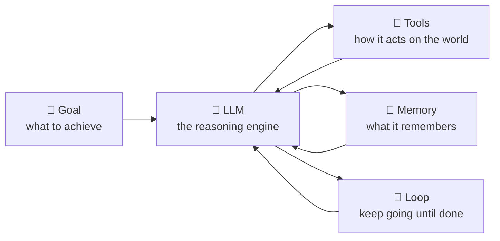
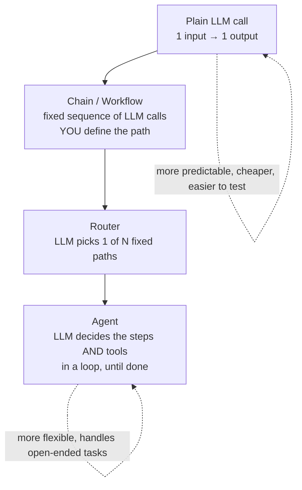
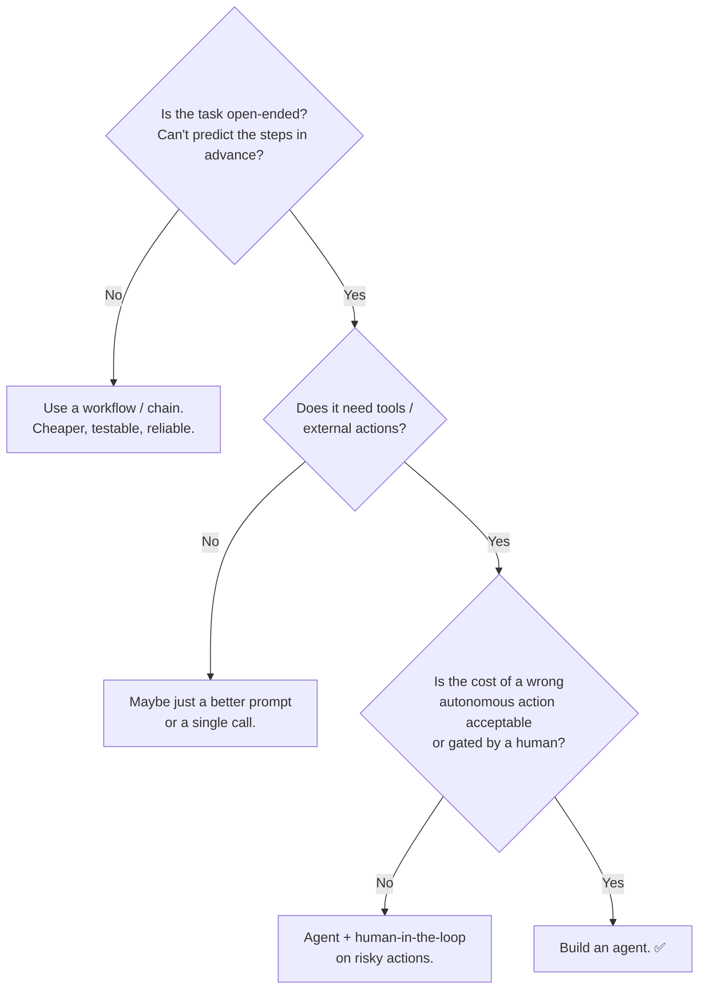

# 01 — What Is Agentic AI?

> An agent is an LLM running in a **loop**, using **tools**, to pursue a **goal** with some **autonomy** over the steps. This chapter defines the term precisely and — just as important — tells you when *not* to build one.

---

## 1. The Problem in Plain English

A plain call to an LLM is a **single turn**: you send text, it sends text back. That's a smart autocomplete. It's great for "summarize this" or "write an email," but it can't:

- Look something up it wasn't told.
- Take an action in the world (send an email, query a DB, run code).
- Break a big task into steps and *adapt* when a step fails.
- Keep working until the goal is actually met.

**Agentic AI** is what you get when you wrap the LLM in a system that *can* do those things. The word "agentic" means the software has **agency** — it decides, within bounds you set, what to do next.

**Analogy.** Think of hiring:
- **A plain LLM call** = asking a knowledgeable friend a question over text. One question, one answer.
- **A workflow** = giving that friend a fixed checklist to follow. Predictable, but rigid.
- **An agent** = hiring a contractor, giving them a goal ("fix the leak"), tools (wrench, van), and trusting them to figure out the steps, check their work, and come back when it's done.

---

## 2. A Precise Definition

Different companies word it differently, but the useful working definition is:

> **An agent is a system where an LLM dynamically directs its own process and tool usage, maintaining control over how it accomplishes a task.**

Break that into the four ingredients:



1. **Goal** — a task, not a single question.
2. **LLM (the brain)** — decides what to do next.
3. **Tools** — the hands: functions the model can call to fetch data or change the world.
4. **Loop + Memory** — it acts, observes the result, remembers, and decides again, repeatedly, until the goal is met or it gives up.

Remove the loop and tools and you're back to a chatbot. Add them and you have an agent.

---

## 3. The Spectrum: Plain Call → Workflow → Agent

This is the single most important distinction in the whole field. It's a **spectrum of autonomy**, not three separate things.



| | Plain call | Workflow (chain) | Agent |
|---|---|---|---|
| Who decides the steps? | N/A (one step) | **You** (hardcoded) | **The LLM** (at runtime) |
| Predictable? | ✅ Very | ✅ Mostly | ❌ Varies per run |
| Cost | 💲 | 💲💲 | 💲💲💲 (many LLM calls) |
| Good for | Summaries, extraction, rewriting | Known multi-step processes | Open-ended, "figure it out" tasks |
| Example | "Translate this" | "Extract → validate → format" | "Fix this failing test" |

**The key lesson (and the industry's hard-won advice):** **use the least autonomous option that solves your problem.** Agents are powerful but expensive, slower, and harder to make reliable. A fixed workflow you can test beats a magical agent you can't trust. Reach for a full agent only when the task genuinely requires the model to decide the path at runtime.

---

## 4. When You Actually Need an Agent

Ask these questions:



**Good agent use-cases** (steps unknown up front, tools required, iteration helps):
- A coding agent that fixes a bug: it must read files, run tests, see failures, and try again.
- A research agent: search, read, decide what to search next, synthesize.
- A customer-support agent that looks up orders, issues refunds, escalates.
- A "computer use" agent that navigates a UI to complete a task.

**Bad agent use-cases** (a workflow is better):
- Extracting fields from invoices → a fixed extraction chain.
- Classifying tickets into 5 buckets → a router (one classification call).
- Generating a weekly report from a known query → a script that calls the LLM once.

> **Rule of thumb:** if you can draw the flowchart of steps ahead of time, build that flowchart (a workflow). If the flowchart depends on what the model discovers along the way, build an agent.

---

## 5. What an Agent Looks Like in One Picture

Here's a coding agent solving "make the failing test pass" — notice the model *chooses* each step based on the previous result:

```mermaid
sequenceDiagram
    participant U as User
    participant A as Agent (LLM + loop)
    participant T as Tools (fs, shell)
    U->>A: "Make the failing test pass"
    A->>T: run_tests()
    T-->>A: FAIL: expected 5, got 4 in calc.py:12
    A->>T: read_file("calc.py")
    T-->>A: file contents (off-by-one bug)
    A->>T: edit_file("calc.py", fix)
    T-->>A: ok
    A->>T: run_tests()
    T-->>A: PASS ✅
    A-->>U: "Fixed an off-by-one bug in calc.py; tests pass."
```

The user gave a *goal*, not steps. The agent decided to run tests, then read, then edit, then re-run — and stopped when the goal was met. That decide-act-observe cycle is Chapter 3.

---

## 6. A Short History (so the buzzwords make sense)

- **2020–2022:** LLMs get good at text. Interaction = single prompt/response.
- **2022:** *Chain-of-Thought* — asking the model to "think step by step" massively improves reasoning. (Ch 7)
- **2022–2023:** *ReAct* paper — interleave **rea**soning and **act**ing (tool calls). This is the blueprint for modern agents. (Ch 3)
- **2023:** Function/tool calling becomes a first-class API feature. Frameworks (LangChain) explode. "AutoGPT" popularizes fully-autonomous agents (and exposes how unreliable pure autonomy is).
- **2024:** The field matures toward **structured workflows + selective autonomy**. Anthropic publishes *Building Effective Agents* (the patterns in Ch 9). *Model Context Protocol (MCP)* standardizes tools. (Ch 11)
- **2024–2025:** **Context engineering**, multi-agent orchestration, computer-use agents, and production reliability become the focus. Agents move from demos to real products.

The trajectory: from "one clever prompt" → "let it run wild autonomously" → "**structured systems with the right amount of autonomy.**" That last stage is what you're learning to build.

---

## 7. Common Misconceptions

- **"An agent is just a really good prompt."** No — it's a *system* (loop + tools + memory). The prompt matters, but the architecture is the point.
- **"More autonomy is better."** Usually the opposite. Autonomy buys flexibility at the price of reliability, cost, and debuggability. Spend it carefully.
- **"Agents replace workflows."** No — most real products are **workflows with an agentic step or two**, not one big autonomous agent.
- **"The LLM runs my tools."** It does *not*. The LLM only outputs *text saying which tool to call with which arguments*. **Your code** runs the tool and feeds the result back. (This trips up everyone at first — Ch 4.)
- **"Agents are magic / AGI."** They're a loop around a text predictor. Understanding that demystifies them and makes you better at building them.

---

## 8. Check Yourself

1. In one sentence, what's the difference between a workflow and an agent?
2. Give one task that should be a workflow and one that should be an agent, and say why.
3. What are the four ingredients of an agent?
4. Why is "use the least autonomous option that works" good advice?
5. Who actually executes a tool call — the model or your code?

*(Answers: (1) In a workflow *you* fix the steps; in an agent the *LLM* chooses the steps at runtime. (2) e.g. invoice extraction = workflow (predictable); "fix this bug" = agent (steps depend on findings). (3) Goal, LLM, tools, loop+memory. (4) Less autonomy = cheaper, more testable, more reliable. (5) Your code executes the tool; the model only requests it.)*

---

## 9. Key Takeaways

- **Agentic AI = LLM + tools + memory + a loop, aimed at a goal, with autonomy over the steps.**
- It sits on a **spectrum**: plain call → chain → router → agent, trading predictability for flexibility.
- **Default to the least autonomous design that works.** Workflows beat agents when steps are knowable.
- Real systems are usually **mostly workflow with selective agentic steps**.
- The model never runs anything itself — it emits tool *requests*; your runtime executes them and returns results. That handoff is the engine of every agent.

**Next:** *02 — LLM Fundamentals for Agent Builders* — the properties of the "brain" that dictate every design choice you'll make.
